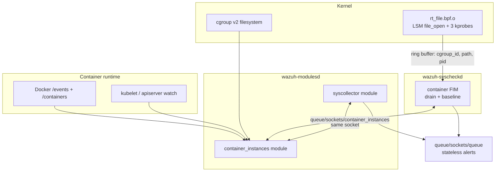
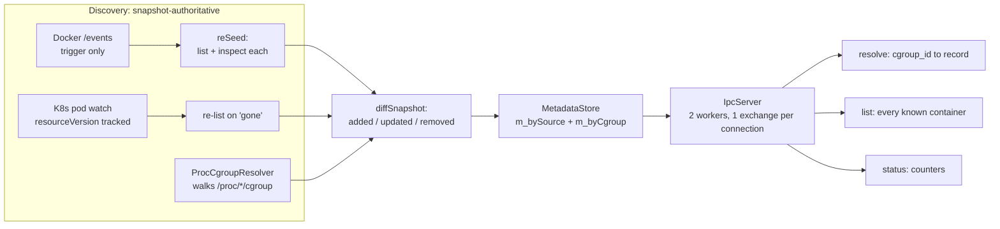
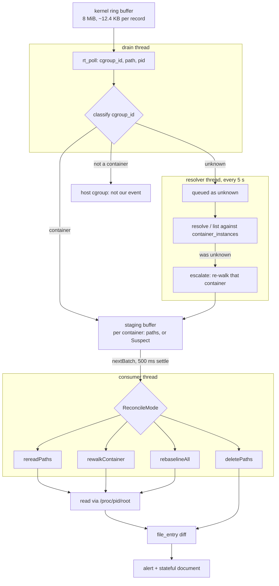
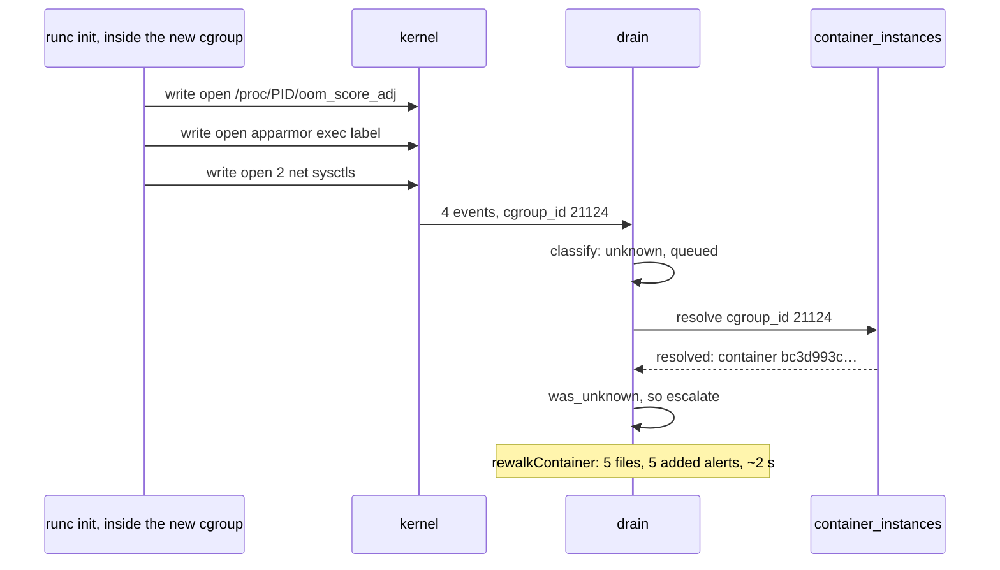
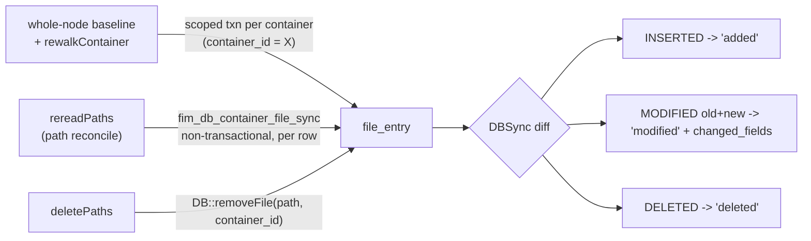
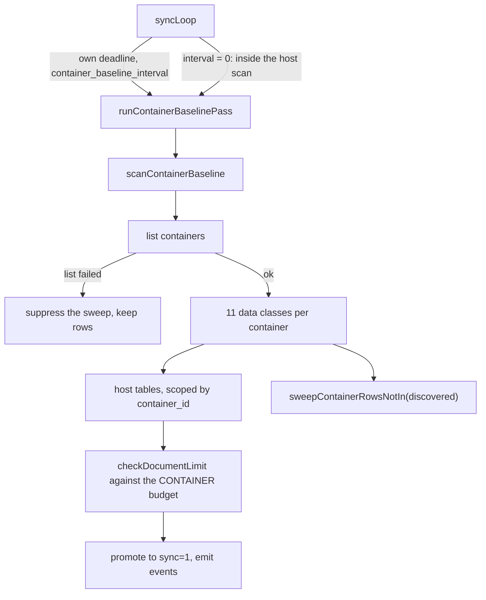

# 15 — How the feature works: a walk-through of what this branch implements

A reading guide for `37532-5-0-0-container-integration`, written to answer two questions without
making anyone read the other fourteen documents first: **what is actually built**, and **how does a
file change inside a container become an alert**.

- **Branch:** `37532-5-0-0-container-integration` @ `7e059dd5aa`, 56 commits ahead of `origin/5.0.0`
- **Date:** 2026-09-08
- **Scope:** Linux agent only. Everything here is `#if defined(__linux__) && defined(CLIENT)` or
  narrower, and the eBPF half additionally requires cgroup v2.
- **Validated on:** Ubuntu 24.04.4, kernel 7.0.0-31, cgroup v2, BPF LSM active
  ([12 §12.15](12-blocking-decisions.md#1215-the-integrated-agent-on-a-real-node-2026-09-08),
  [§12.16](12-blocking-decisions.md#1216-the-lifecycle-question-answered-by-measurement-2026-09-08))

> **This document describes behaviour, not intentions.** Where a diagram shows something surprising,
> it is because that is what the code does and it has been observed doing it on a real node. Design
> rationale lives in [12](12-blocking-decisions.md); known defects in
> [03](03-findings-correctness.md); the authoritative build status in
> [09](09-implementation-status.md).

---

## 15.1 The idea in one paragraph

Wazuh already inventories the host and watches host files. This feature extends both **inside
containers**, without an agent per container. One new module (`container_instances`) turns a kernel
`cgroup_id` into container metadata. Two existing modules consume it: **syscollector** collects
eleven classes of inventory per container, and **syscheckd** monitors files inside containers. FIM
does it *event-driven* — an eBPF program reports file activity, the agent attributes each event to a
container and re-reads only what changed — while syscollector still polls. Both write into the host's
existing tables, scoped by a `container_id` column, so nothing downstream needs a new store.

---

## 15.2 The moving parts

Three processes, one Unix socket between them, one eBPF program in the kernel.



**Who owns what**

| Component | Lives in | Job |
| --- | --- | --- |
| `container_instances` | `modulesd` | The only thing that talks to Docker/Kubernetes. Answers `cgroup_id -> container metadata`. |
| `container_baseline` (`libcontainer_baseline`) | linked into both consumers | Reads *inside* a container — its files, packages, processes — given a container id. |
| `ebpf_provider` (`rt_engine`) | linked into `syscheckd` | Loads and polls the BPF object. Knows nothing about containers. |
| container FIM | `syscheckd` | Baselines container files once, then reconciles what the kernel reports. |
| container inventory | `syscollector` | Polls eleven data classes per container on its own cadence. |

The socket is the only coupling. `container_instances` has no idea who its clients are, and both
consumers degrade to "no container data" if it is not there.

---

## 15.3 What turns it on

Three independent switches, and **all three are required** for container FIM:

```xml
<!-- 1. The metadata module. Without this, nothing works. -->
<container_instances>
  <enabled>yes</enabled>
  <docker><socket_path>/var/run/docker.sock</socket_path></docker>
</container_instances>

<syscheck>
  <!-- 2. Container FIM reads paths from container-TAGGED directories only. -->
  <directories tags="container" check_all="yes">/data</directories>

  <!-- 3. ...and silently collects zero paths unless synchronization is enabled. -->
  <synchronization><enabled>yes</enabled></synchronization>
</syscheck>

<wodle name="syscollector">
  <!-- Optional: decouple the container inventory pass from the host scan.
       0 (default) = same cadence as the host scan. -->
  <container_baseline_interval>3600</container_baseline_interval>
</wodle>
```

**Three traps worth knowing before you debug a silent no-op:**

- `tags="container"` is **tokenised**, so `tags="container,prod"` works. It did not always — a whole
  `strcmp` against the attribute meant any additional tag selected nothing
  ([C-series](03-findings-correctness.md)).
- `fim_collect_container_monitored_paths()` returns **0 paths with no warning** when
  `syscheck.enable_synchronization` is false (`container_baseline_fim_bridge.c:268`). The feature
  looks configured and does nothing.
- A path is only ever read *inside* a container if it came from a container-tagged root. A container
  row for `/data/x` cannot inherit the check options of an untagged host `<directories>` entry.

---

## 15.4 `container_instances`: from `cgroup_id` to metadata

The module keeps a store of container records keyed two ways — by source id and by cgroup inode — and
answers three questions over the socket.



**Wire format.** One line of JSON in, one line out, connection closed after a single exchange.
Request cap 8192 bytes, 5 s read timeout, `PROTOCOL_VERSION` checked by **strict equality**, worker
pool of 2.

```jsonc
--> {"version":1,"op":"resolve","cgroup_id":"44522"}
<-- {"version":1,"status":"resolved","data":{"container_id":"fcc59efab…","image":"cfim:1",…}}

--> {"version":1,"op":"list"}
<-- {"version":1,"status":"ok","data":{"connector":"docker"},"containers":[…]}   // [] when none
```

**Two properties that matter more than they look:**

- **`resolve` can answer `pending`.** A cgroup whose container is known but whose inode has not been
  joined yet is not an error; the caller retries. `list` only returns records with a non-zero cgroup
  inode.
- **"Removed" is not removal.** A container that disappears from the runtime snapshot is only
  *marked* `deletedAt` and keeps being returned by `list` for `REMOVAL_GRACE = 60 s`. This is
  deliberate: it is what lets a consumer tell **stopped** from **gone** and is the whole reason
  restarting a container does not wipe its FIM state
  ([C1](03-findings-correctness.md#c1--fim-deletes-the-state-of-merely-stopped-containers-false-delete-storm)).
  It is also currently over-effective — see [C16](03-findings-correctness.md#c16--dockers-deferred-reconcile-is-dropped-not-deferred).

---

## 15.5 Container FIM at startup: subscribe first, then walk

The ordering here is load-bearing and is the thing most likely to be broken by a well-meaning
refactor.

```mermaid
sequenceDiagram
    participant M as syscheckd main()
    participant D as ContainerEventDrain
    participant B as baseline walk
    participant DB as file_entry

    M->>D: fim_container_events_start()
    Note over D: rt_open(): 4 programs attached,<br/>cgroup_mode = ALL
    D-->>M: staging container file events<br/>until the baseline walk commits
    M->>B: fim_run_container_baseline()
    B->>DB: one scoped txn per container, rows + delete detection
    B-->>M: N container(s) scanned, M row(s)
    M->>D: fim_container_events_release()
    Note over D: first-scan boundary crossed:<br/>consumer may touch file_entry,<br/>and everything from here ALERTS
    D-->>M: baseline walk committed;<br/>the reconcile consumer is now live
```

**Why subscribe before walking.** A file changed *while* the walk is in progress would otherwise fall
into the gap between "the walk read this file" and "monitoring started". Events are staged from
`start()` and only applied after `release()`.

**Why `release()` is also the alert gate.** The baseline's own rows — every file in every container —
must not alert; they are a first sighting, not a change. `release()` sets
`container_notify_scan`, the container equivalent of host FIM's `notify_scan` / `<notify_first_scan>`.
The container walk cannot borrow the host's flag because it runs one-shot from `main()` before the
host's first scan has necessarily finished.

**The consequence to keep in mind:** `fim_run_container_baseline()` runs **once**, from
`main.c:493`. There is no scheduled container walk. The only thing that re-runs it is the drain's own
`rebaselineAll`.

---

## 15.6 Container FIM in steady state: event to alert

Three threads inside the drain, and a staging buffer between them.



### The four reconcile modes

| Mode | Triggered by | What it does | May delete? |
| --- | --- | --- | --- |
| `rereadPaths` | a known, complete set of changed paths in a known container | re-reads exactly those paths | **no** (D15) |
| `rewalkContainer` | reported loss for one cgroup, a rename, staging overflow, or a container identified *after* its events arrived | walks the container | yes, if the walk reports complete |
| `deletePaths` | `RT_EV_FILE_UNLINK` — the kernel named the removed file | deletes exactly those rows | yes, that path only |
| `rebaselineAll` | unattributable loss, or the unknown-cgroup queue overflowed | re-runs the whole-node baseline | yes, per container, if complete |

### Two details that are easy to get wrong

**The 500 ms settle exists because the event precedes the write.** `LSM file_open` fires on *open*,
so reconciling immediately stores the **pre-write** file
([C23](03-findings-correctness.md)). A staged path is therefore held until either the writing pid
exits — the common case, which releases it immediately — or 500 ms elapses. It is a bound, not a
guarantee.

**A rename escalates its whole container.** The engine reports only the *destination* path, so
staging just that would leave the source's row describing a file that no longer exists, with nothing
to ever correct it. Any number of renames between two batches coalesces into one re-walk
([C21](03-findings-correctness.md#c21--a-rename-inside-a-container-is-a-deletion-no-event-ever-reports)).

### Discovery of containers created after startup

There is no lifecycle event from `container_instances` — [10](10-container-instances-delta-plan.md)
plans one and is not implemented. Discovery is a side effect of `cgroup_mode = ALL`, and the trigger
is **the container runtime's own startup writes**, not the container's workload:



Measured with a temporary per-event trace: a container started after the baseline emits **exactly
four** events from its own cgroup, all `RT_EV_FILE_OPEN`, all inside one second of `docker run`:

```text
DIAG-EV type=1 cgroup=21124 pid=13320 path=/proc/13320/oom_score_adj
DIAG-EV type=1 cgroup=21124 pid=13323 path=/1/task/1/attr/apparmor/exec
DIAG-EV type=1 cgroup=21124 pid=13323 path=/sys/net/ipv4/ip_unprivileged_port_start
DIAG-EV type=1 cgroup=21124 pid=13323 path=/sys/net/ipv4/ping_group_range
```

`sleep 3600` — the container's actual command — produced none. **An `execve` cannot trigger this**:
the BPF program drops read-only opens and non-regular files in the kernel, so loading an interpreter
and a binary is invisible.

```c
/* rt_file.bpf.c: O_RDONLY == 0, so a plain read never reaches userspace */
if (!(f_mode & FMODE_CREATED) && !(f_flags & O_CREAT) && !(f_flags & O_ACCMODE))
    return 0;
if (!d_inode || !is_regular_file(d_inode))
    return 0;
```

None of those four paths is in the container's rootfs or under a monitored directory, and it does not
matter: **escalation happens when an unknown cgroup is resolved, regardless of the path that exposed
it.** Path filtering applies only later, to `rereadPaths`.

**Why it wins the race.** Those writes land ~1 s after `docker run`, before `container_instances` has
finished its `reSeed` and long before the drain's 5 s `refreshContainerList()` could install the
mapping. A mapping installed *first* would classify the event as a known container and take the
ordinary path — no escalation, no walk.

> **How robust is this, stated honestly.** All four writes are the **runtime's** behaviour, not the
> container's. `oom_score_adj` and the two sysctls are Docker defaults; the AppArmor label write
> needs an enforcing LSM (Ubuntu's default). On Docker + Linux this is reliable in practice, but it
> is **incidental, not guaranteed by anything in the design.** A runtime that performs none of these
> would leave a container undiscovered until its workload happened to open a regular file for
> writing. That is the strongest argument for
> [10](10-container-instances-delta-plan.md)'s Phase 0 and its reconciliation floor, and it is why
> `RT_CGROUP_MODE_ALL` cannot be narrowed to an allowlist first: the allowlist has nothing to put in
> it until a create trigger exists.

---

## 15.7 How a file inside a container is actually read

No overlay math, no per-runtime storage-driver knowledge. The kernel does the translation:

```
/proc/<pid>/root/<in-container path>
```

`RootfsFileWalker` needs a **live pid** in the container, which `PidResolver` supplies from the
cgroup. Consequences, all of them deliberate:

- A **stopped** container has no pid, so it produces no rows. That is why "produced no rows" must
  never be read as "the files are gone" — the distinction between `root_missing` (ENOENT while the
  rootfs is still addressable: a fact about the image) and `root_unreadable` (the pid exited, a
  permission failure: nothing is known) is what keeps
  [C15](03-findings-correctness.md)'s mass false delete closed.
- Rows carry the **logical** in-container path (`/data/f1.txt`), never the host path. Attribute
  events arriving with a host-form path are filtered out rather than stored
  ([C22](03-findings-correctness.md#c22--attribute-change-events-on-a-containers-rootfs-carry-a-host-path)).
- Uid/gid are translated into the **container's** id space, and owner/group resolved from the
  container's own `/etc/passwd` when available.
- The walk shares the host's `syscheck.max_files_per_second` budget rather than adding a second
  unbounded source of file I/O.

---

## 15.8 The database: one table, two writers

Container rows live in the host's `file_entry` table. `container_id` is part of the **primary key**,
and host rows carry `container_id = ""`, so the same path under two containers and the host are three
independent rows.



**Why two writers.** A scoped DBSync transaction deletes every row in its scope that it did not
refresh, on close, **whether or not delete detection was requested** — `closeTransaction()` runs
`deleteRowsByStatusField()` unconditionally. A path reconcile re-reads a handful of named files by
design, so using a transaction there wiped the rest of the container's state: measured on a live
agent, modifying one file alerted `modified`, modifying the next alerted `added`, and 1 of 5 rows
survived. Hence the non-transactional upsert
([C27](03-findings-correctness.md#c27--a-path-reconcile-deletes-the-rest-of-the-containers-rows),
[D18](12-blocking-decisions.md#d18--how-does-a-path-reconcile-persist-a-row-without-authorising-a-sweep-resolved-2026-09-08--the-non-transactional-upsert-d3a8e394d9)).

**Two more things that bite:**

- `MODIFIED` must be requested as `{"old","new"}` (`return_old_data`). Without it the callback gets a
  bare row, finds no `"new"` member and returns — every modification silently dropped while the row
  still converged in the database ([C26](03-findings-correctness.md#c26--a-change-to-an-already-known-container-file-raises-no-alert)).
- DBSync holds **one long-lived sqlite transaction**, committed only when delete detection runs. An
  external read of `fim.db` therefore shows the pre-transaction snapshot while `fim.db-journal`
  exists. Do not verify convergence with `sqlite3` while the agent is running.

---

## 15.9 Syscollector: the other consumer, still polling



Eleven tables: processes, ports, users, groups, packages, os, network interfaces, network addresses,
network protocols, services, hardware.

Unlike FIM, this is **not** event-driven: every container × every data class, every cycle. That is
what [roadmap item 20](08-roadmap.md) and [10](10-container-instances-delta-plan.md) exist to change,
and it has not been changed. What *did* change is that the pass has its own cadence
(`<container_baseline_interval>`) and its own document budget, requested from `agentd` as the
`syscollector_containers` scope so container rows cannot exhaust the host's allowance.

---

## 15.10 What comes out

A container file change produces a stateless event on `queue/sockets/queue`, in host FIM's own
vocabulary plus a `container` block:

```jsonc
{
  "collector": "file",
  "module": "fim",
  "data": {
    "event": {
      "created": "2026-09-08T00:48:15.464Z",
      "type": "modified",                       // added | modified | deleted
      "changed_fields": ["file.size", "file.mtime", "file.hash.md5", "…"]
    },
    "file": {
      "path": "/data/f1.txt",                   // in-container path
      "size": 16, "mtime": "…", "permissions": ["0644"],
      "uid": "0", "owner": "root",              // container id space
      "hash": { "md5": "…", "sha1": "…", "sha256": "…" },
      "mode": "whodata",                        // walk -> "scheduled"
      "tags": "container"
    },
    "container": {
      "id": "fcc59efab…", "name": "cfimquiet", "runtime": "docker",
      "image": { "name": "cfim:1", "digest": "sha256:…" },
      "network": [ { "name": "bridge", "ip": "172.17.0.2" } ],
      "restart_count": 0, "oci_mounts": [], "labels": {}
    }
  }
}
```

`mode` is derived from the origin: a walk reports `scheduled`, an eBPF-driven reconcile reports
`whodata`. The same row is also offered as a **stateful** document — which is currently **rejected**,
see below.

---

## 15.11 What is implemented, and what is not

**Working end to end on a real node**

| Capability | Evidence |
| --- | --- |
| `container_instances` starts, binds its socket, answers all three ops | `Enrichment query socket listening at queue/sockets/container_instances` |
| eBPF object builds from source and attaches | `4 program(s) attached, ABI 1.1`, LSM `file_open` variant |
| Subscribe-first ordering | staging message precedes the commit message |
| Whole-node container baseline | `1 container(s) scanned, 5 row(s), … 1 container(s) known` |
| Post-startup container discovery | `docker run` -> re-walk -> 5 `added` alerts in ~2 s |
| Modification detection with `changed_fields` | three consecutive single-file changes, three `modified` alerts |
| Unlink detection | `rm` -> exactly one `deleted`, that row only |
| Stale-container cleanup, and its suppression when the connector is unreachable | `1 stale container(s) cleaned`; and rows kept when the socket answers nothing |
| Container inventory with its own cadence and budget | 77 stateless events with `container.*`; `{"packages":2,"processes":3}` enforced separately from the host |
| Absent configured directory handled as a fact, not incompleteness | `1 of 2 configured directories are absent … delete detection proceeds over the 1 that resolved` |

**Not implemented, and why it matters**

| Gap | Consequence today | Where |
| --- | --- | --- |
| **Stateful documents are rejected** | no schema in `external/indexer-plugins` carries a `container` field, so ten indices fail `container: Field not allowed in strict mode` and the document is discarded. Detection and stateless events are unaffected | #37203-3/-4, external dependency |
| **No packaged `rt_file.bpf.o`** | the pipeline never *builds* the object, so a released agent has no engine and container FIM degrades to a startup snapshot that never updates. Logged as a `WARNING` when container directories are configured | [14](14-spike-integration-plan.md) WP6 |
| **No container lifecycle delta** | syscollector still re-scans everything every cycle; FIM depends on `cgroup_mode = ALL` for discovery | [10](10-container-instances-delta-plan.md), item 20 |
| **Docker reconcile floor missing** | `m_reconcilePending` is written and never read, and the removal grace only expires inside `applySnapshot()`. On an idle host a removed container stays in `list` indefinitely and its rows are never swept | [C16](03-findings-correctness.md#c16--dockers-deferred-reconcile-is-dropped-not-deferred) — P0 |
| **cgroup v1 unsupported** | `bpf_get_current_cgroup_id()` collapses to one value, so attribution is impossible. Refused at `rt_open()` rather than mis-attributed | [D11](12-blocking-decisions.md) |
| **Host FIM whodata still on its own engine** | two BPF loaders coexist; the collapse is planned, not done | [14](14-spike-integration-plan.md) WP5, gated on D9 |
| **No consumer-side tests for the `BaselineDriver`** | the state machine where C26 and C27 both lived is still only covered by contract tests below it | [09](09-implementation-status.md) item 30 |

---

## 15.12 The five rules that constrain any change here

Distilled from [12](12-blocking-decisions.md). Each one exists because breaking it produced a
measured failure.

1. **Never infer a deletion from a path you could not read.** A failed read has three causes and two
   of them are not removal. Only an explicit `RT_EV_FILE_UNLINK`, or a *complete* walk of a
   directory, authorises deleting a row. (D15)
2. **Never sweep against a set you could not obtain.** If the connector does not answer, keep the
   rows — a stale row costs one cycle of accuracy; a false-delete flood costs a re-seed and a
   storm of alerts. (D5)
3. **Stopped is not gone.** A container with no live pid produces no rows and must keep its state, so
   a restart resumes diffing instead of re-seeding. (C1)
4. **Never let a partial view delete.** A row cap, an unreadable rootfs or a rejected path suppresses
   delete detection; a configured directory that is simply absent from the image does **not**, because
   that is a static fact and suppressing on it disabled deletions forever. (D17 / C24)
5. **Wrong attribution is worse than none.** cgroup v1 is refused, `cgroup_id 0` is never used as a
   key, and a contested inode leaves a record unattributed rather than filed under the wrong
   container.

---

## 15.13 Where to look in the code

| What | Path |
| --- | --- |
| Module entry point | `src/wazuh_modules/wm_container_instances.c` |
| Metadata store, connectors, IPC | `src/wazuh_modules/container_instances/ci_impl/src/{cache,docker,kubernetes,ipc}/` |
| Client used by both consumers | `src/shared_modules/container_instances_client/include/container_instances_client.hpp` |
| Reading inside a container | `src/wazuh_modules/container_baseline/container_baseline_impl/` |
| C API both consumers call | `src/wazuh_modules/container_baseline/include/container_baseline.h` |
| BPF engine (container-agnostic) | `src/shared_modules/ebpf_provider/` |
| FIM baseline + reconcile | `src/syscheckd/src/ebpf/src/container_baseline_fim.cpp` |
| FIM C bridge, alerts, path collection | `src/syscheckd/src/ebpf/src/container_baseline_fim_bridge.c` |
| Drain, router, staging, plan | `src/syscheckd/src/ebpf/{src/container_event_drain.cpp,include/container_event_*.hpp,include/container_reconcile_plan.hpp}` |
| Container rows in the FIM DB | `src/syscheckd/src/db/src/{db.cpp,file.cpp}` |
| Container inventory pass | `src/wazuh_modules/syscollector/src/syscollectorImp.cpp` (`scanContainerBaseline`) |
| Config parsing | `src/config/src/{config.c,container_instances-config.c}` |

**Contract tests that pin the behaviour above** (standalone `make check`, no CMake needed):

```
src/syscheckd/src/ebpf/tests/txn/      scoped transaction vs. direct upsert (8 cases)
src/syscheckd/src/ebpf/tests/alert/    alert shape and tag inheritance
src/syscheckd/src/ebpf/tests/settle/   the 500 ms settle and pid-exit release
src/syscheckd/src/ebpf/tests/unlink/   unlink planning, and that an empty batch deletes nothing
src/shared_modules/ebpf_provider/      engine attach/poll/detach, per-cgroup drops
```

---

## 15.14 Reading order for the rest of the set

- **Just want status?** [09](09-implementation-status.md).
- **Need to change behaviour?** [12](12-blocking-decisions.md) first — the decisions are numbered and
  several of them look wrong until you read why.
- **Hit something that seems broken?** [03](03-findings-correctness.md), 28 numbered findings with
  reproductions.
- **Planning the remaining work?** [14](14-spike-integration-plan.md) for the work packages,
  [08](08-roadmap.md) for priorities, [10](10-container-instances-delta-plan.md) for the lifecycle
  delta — noting its own header, which records that it is unimplemented and one of its premises is
  falsified.
