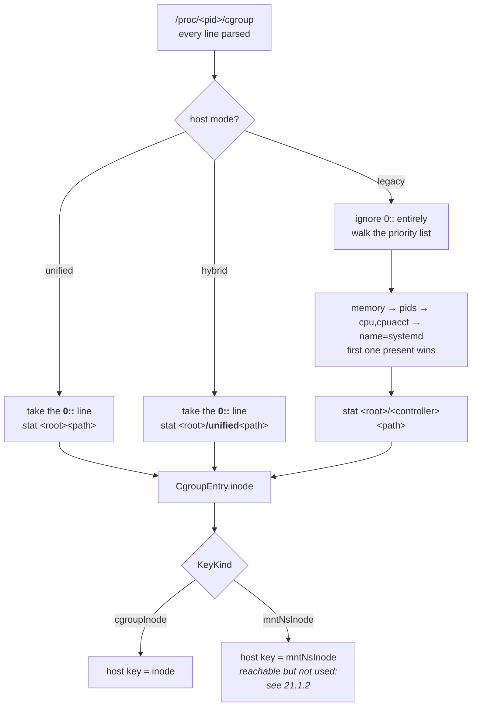
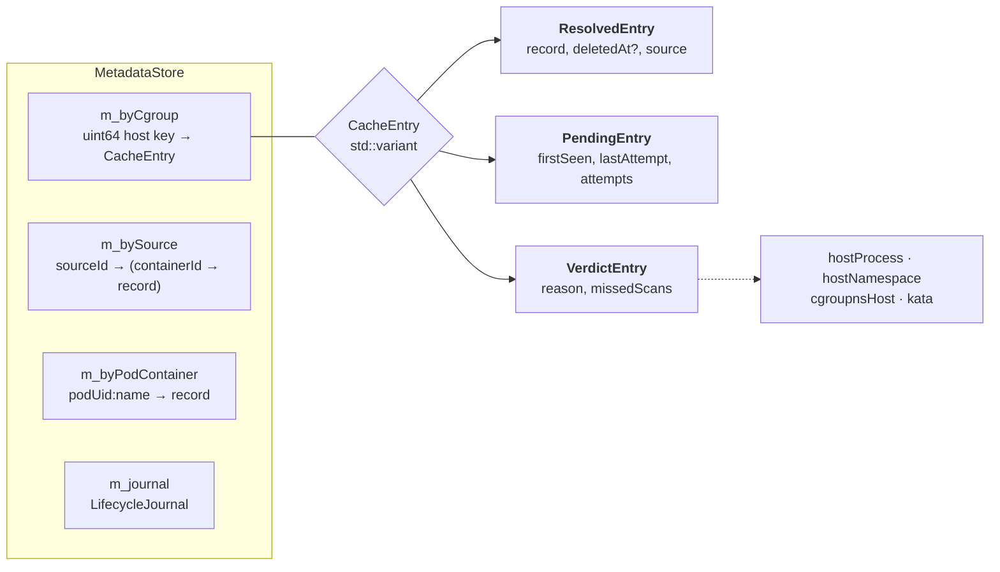
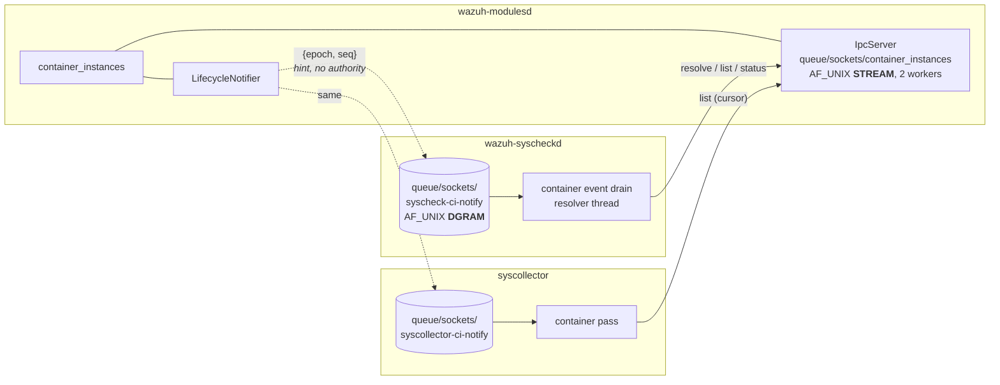
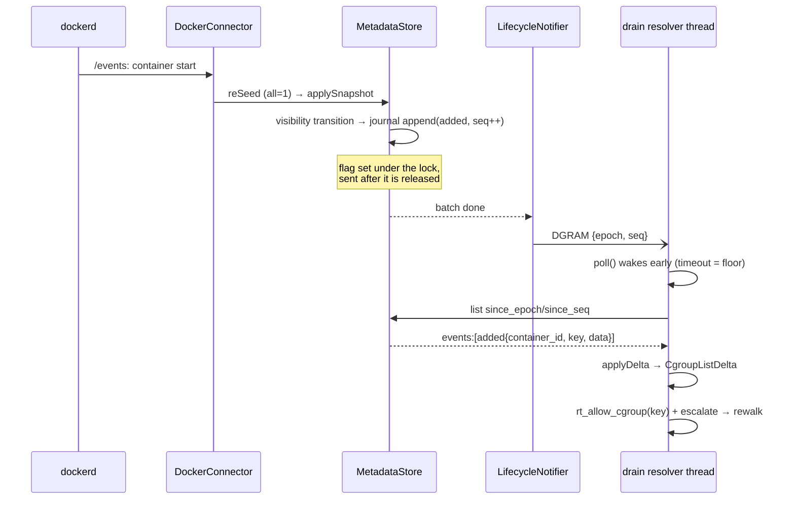
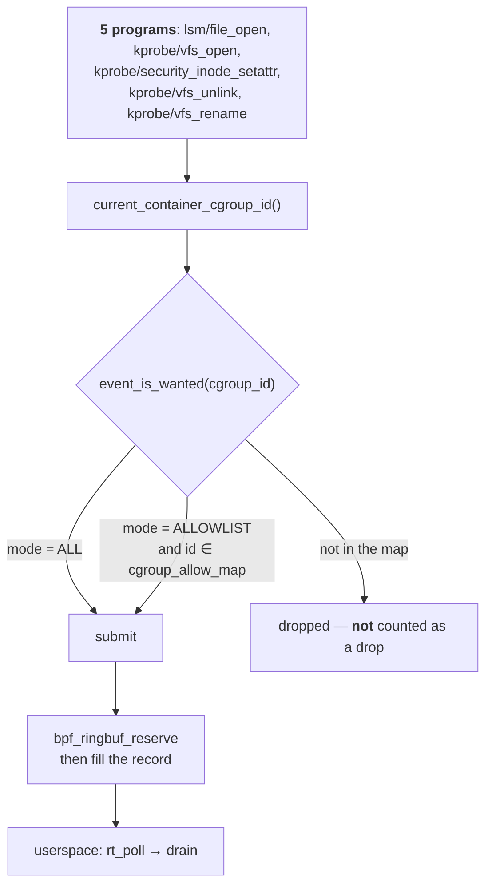
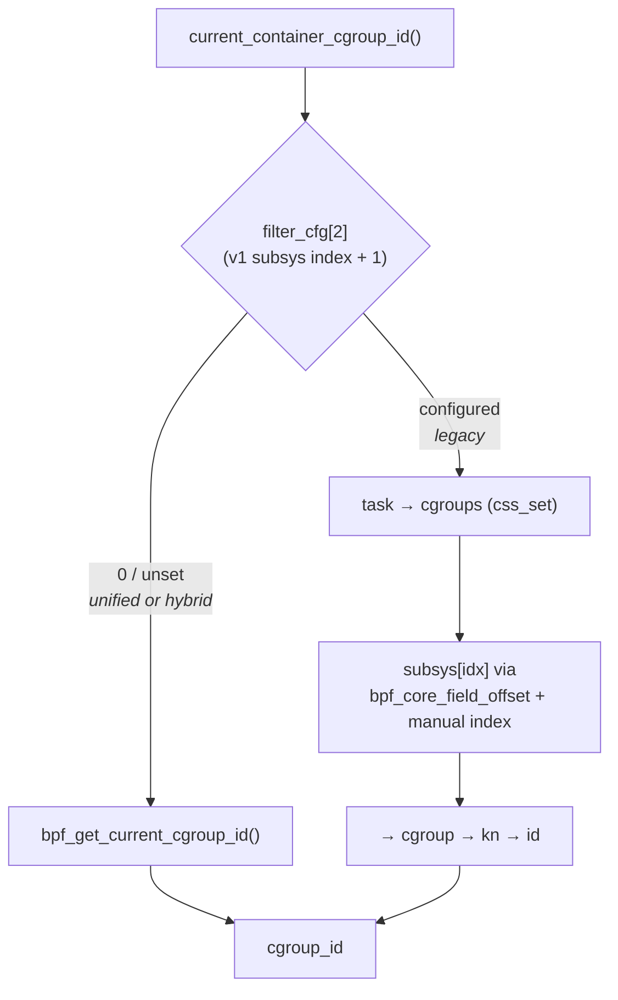
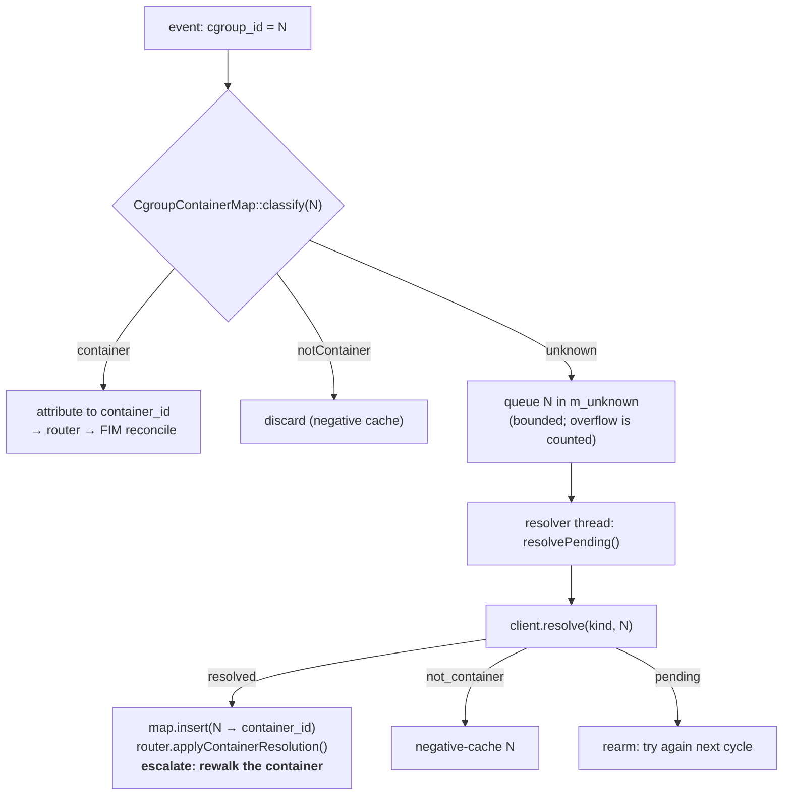
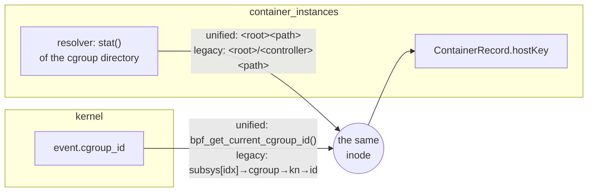

# 21 — How a file event becomes an attributed container event

**Subject:** what `container_instances` actually builds, how consumers actually talk to it, how the
kernel actually filters, and where the two sides actually meet — on **both** cgroup hierarchies.

**Date:** 2026-10-06 · **Branch:** `37532-cgroup-v1-unified-resolver` · **Issues:** #37203 / #37532 / #37396

**Derived from the code, not from the design documents.** Every structure below was read from the
header that declares it and every branch from the function that takes it; file and line references
are given so a reader can disagree with this document by reading the same lines. Where a design
document says something different, this one is describing what runs.

---

## 21.1 What `container_instances` builds

Three structures, each answering a different question, and the distinction between them is the thing
most often got wrong when reading this module.

| Structure | Keyed by | Answers | Lives in |
| --- | --- | --- | --- |
| `CgroupEntry` / `CgroupScan` | — (a list) | "which cgroups exist, and which container is each" | the resolver's output, rebuilt every scan |
| `ContainerRecord` | `containerId` | "what *is* this container" — the enrichment payload | `MetadataStore::m_bySource` |
| `CacheEntry` | **host key** (an inode) | "what do I know about this *number*" | `MetadataStore::m_byCgroup` |

### 21.1.1 The resolver's output: both inodes, one chosen

`ProcCgroupResolver::scan()` walks `/proc/<pid>`, parses every line of each process's `cgroup` file
and keeps two numbers per cgroup (`i_cgroup_resolver.hpp`):

```cpp
struct CgroupEntry
{
    std::string   containerId;    // from the leaf: cri-containerd-<hex>.scope, docker-<hex>.scope, bare hex
    std::uint64_t inode;          // the cgroup directory's st_ino
    RuntimeHint   hint;           // containerd | crio | docker | unknown
    std::string   cgroupPath;
    std::string   keyController;  // v1 only: WHICH controller supplied `inode`
    std::uint64_t mntNsInode;     // the mount namespace, read from /proc/<pid>/ns/mnt
};

struct CgroupScan
{
    std::vector<CgroupEntry>          containers;
    std::unordered_set<std::uint64_t> allHostKeys;  // every key seen, container or not
    KeyKind                           keyKind;      // which of the two numbers is THIS host's key
};
```

**Where `inode` comes from differs by hierarchy, and that is the whole of the v1 support.**
`selectCanonicalCgroup()` (`cgroup_parse.hpp:162`) picks one line out of `/proc/<pid>/cgroup`:



Two details that are easy to get wrong and are pinned by tests:

- **A hybrid host's `0::` path is relative to `<root>/unified`, not `<root>`.** Statting it at the
  root finds nothing, which produced the same symptom as pure v1 on a host whose ids were perfectly
  usable.
- **A pure v1 host still emits a `0::` line** — it reads `0::/`. It is ignored on a legacy host by
  `selectCanonicalCgroup`, and a path of `/` is dropped by `scan()` anyway.

The **mount namespace** is read from the **lowest host pid** in each cgroup
(`proc_cgroup_resolver.cpp`). That rule exists because `unshare -m` inside a container would
otherwise let whichever process the walk reached first decide that container's identity; the lowest
pid is the container's init, whose namespace the others were born into.

### 21.1.2 `mntNsInode` is collected and not used as a key

`hostKeyOf(entry, kind)` can return it, and no production path asks for it: `keyKindFor()` returns
`mntNsInode` only for `WZ_CGROUP_MODE_LEGACY`, and on a legacy host the engine is pointed at a v1
controller instead (§21.3.2), so the store is keyed by `cgroupInode` on **every** supported layout.
It stays collected as a cross-check and as the fallback if the controller route is ever unavailable.
Measured reason it is not the key: namespace inodes are recycled immediately — eight consecutive
containers received the same one — while cgroup inodes were 8 of 8 distinct
(`20-mnt-ns-key-and-legacy-filter-mode.md` §20.2).

### 21.1.3 The record, and the three indexes over it

`ContainerRecord` (`core/container_record.hpp`) is the enrichment payload: `runtime`, `containerId`,
`containerName`, `image`, `imageDigest`, `restartCount`, `podUid`, `podName`, `podNamespace`,
`nodeName`, `labels`, `annotations`, `ownerRefs[]`, `network[]`, `ociMounts[]`, `hostKey`,
`startedAt`, `pid`, `state`.

Note `hostKey` — **not** `cgroupId`. The field was renamed when the key stopped always being a
cgroup-v2 inode; on the wire it is published as `key`, and as `cgroup_id` only where that is true
(§21.2.1).

`MetadataStore` holds three maps (`cache/metadata_store.hpp`):



- **`m_byCgroup`** is what a `resolve` hits. Its value is a **variant**, so one lookup distinguishes
  "this is container X", "I do not know yet, ask again" and "this is permanently not a container,
  here is why" — the three-outcome contract consumers depend on.
- **`m_bySource`** exists so two connectors' snapshots never diff against each other: a removal
  computed from Docker's list can only remove Docker's records.
- **`m_byPodContainer`** is a secondary index for cold lookups by pod identity.

**What `listContainers()` publishes is narrower than what the store holds.** The guard
(`metadata_store.cpp:117`, and two more places) is:

```cpp
if (!record || (record->hostKey == 0 && isRunning(record->state)) || !seen.insert(containerId).second)
    continue;
```

Both terms matter. Hiding a *running* container with no key avoids handing consumers an attribution
key that is about to change; publishing a *stopped* one with no key is what stops a stop reading as
a deletion and sweeping the container's inventory.

### 21.1.4 The journal records visibility, not writes

`LifecycleJournal` (`cache/lifecycle_journal.hpp`) is a bounded ring (4096) of transitions **of the
set `listContainers()` returns**, carrying a random `epoch` and a monotonic `seq`. A record inserted
while still unresolved appends nothing; the later insert that gives it a key is what appends
`added`. A metadata-only change appends nothing at all, so annotation churn cannot evict real
transitions out of the ring.

---

## 21.2 How consumers talk to it

Two sockets, and the asymmetry between them is deliberate: one carries authority, the other carries
only a nudge.



### 21.2.1 The query socket — authority lives here

Line-delimited JSON, one exchange per connection, 8192-byte request cap, 5 s read timeout. Three
ops: `resolve`, `list`, `status`.

**The version check is a range, not equality** (`wire_protocol.hpp`): the server answers 1 and 2 and
replies **in the version it was asked in**. That is what lets modulesd and syscheckd — separate
processes under separate units — be upgraded at different times instead of refusing each other in
the gap.

```jsonc
// v1, still accepted for one release. `cgroup_id` means key_kind "cgroup".
--> {"version":1,"op":"resolve","cgroup_id":"4242"}

// v2. The key's SPACE is stated, because a cgroup inode and a mount namespace
// inode are both ordinary 64-bit numbers and a miss would look like "unknown
// container" rather than "you asked in the wrong space".
--> {"version":2,"op":"resolve","key_kind":"cgroup","key":"4242"}
<-- {"version":2,"status":"resolved","data":{ ...record..., "key":"4242", "cgroup_id":"4242"}}
```

`data.cgroup_id` is **omitted** when the host is not keyed by a cgroup inode, rather than carrying
something else under that name — a v1 consumer would otherwise believe it and install a number in a
kernel allowlist that matches nothing. `status` publishes the host's `key_kind` so a consumer
discovers it instead of classifying the host itself.

`list` optionally carries a cursor (`since_epoch` / `since_seq`) and answers with
`epoch` / `seq` / `events[]` / `resync_required`. All 64-bit values travel as **decimal strings**,
because cJSON-based consumers parse JSON numbers as doubles and round silently above 2⁵³.

### 21.2.2 The notify socket — a hint, and nothing more

A DGRAM `sendto` of `{epoch, seq}`, non-blocking, errors swallowed. A lost, duplicated or malformed
datagram costs **latency and nothing else**, because every consumer's reaction is the same: drain
whatever is queued, then issue one pull over the query socket. The periodic poll is retained as a
mandatory floor — no notification can report a container the module itself never learned about.



---

## 21.3 Getting events out of the kernel, and filtering them

### 21.3.1 The path every event takes



The filter runs **before** `bpf_ringbuf_reserve()`, which is where the saving comes from: a filtered
event costs one map lookup instead of a 12 KB reservation. A filter miss is deliberately not counted
as a drop — drops mean "the consumer wanted this and lost it", and conflating the two would make
every unmonitored container's activity look like loss.

### 21.3.2 Where `cgroup_id` comes from — the v1/v2 split

`current_container_cgroup_id()` (`bpf/rt_file.bpf.c:204`) is the whole difference:



- The helper reports the task's cgroup **in the unified hierarchy**. Where there is none it returns
  the root for every task — **measured: 1** — which is why v1 was once refused outright.
- The controller read returns that controller's own kernfs id, which **equals `stat()` of the
  directory the resolver read** — measured 6403 and 6435 for two containers on a pure v1 host.
- The index is **configured at runtime**, never compiled in: `enum cgroup_subsys_id` is ordered by
  what the kernel was built with, and it must name the controller the resolver chose. A variable
  index also means `BPF_CORE_READ(cset, subsys[i])` cannot be used — it resolves a field offset at
  load time — so the offset comes from `bpf_core_field_offset` and the index is applied by hand,
  with a bound the verifier requires.
- It is **refused on unified and hybrid hosts**: there `subsys[i]` resolves to the nearest *ancestor*
  where the controller is enabled, which would file a container's events under its parent slice.

**Consequence: filtering works identically on both hierarchies.** A legacy host runs
`RT_CGROUP_MODE_ALLOWLIST` exactly as a unified one does, and does not pay the unfiltered cost
`19-option-c-test-report.md` measured.

### 21.3.3 Keeping the kernel's allowlist current

`syncAllowlist()` mirrors every list or delta refresh into the map: `rt_allow_cgroup()` for each
added key, `rt_deny_cgroup()` for each removed one. **Removals matter as much as additions** —
inodes are reused, so a map that only grew would eventually admit an unrelated cgroup. If an add
fails (the map is full), the drain **turns filtering off entirely** rather than monitoring a subset
silently.

---

## 21.4 Joining an event to a container

The drain never asks `container_instances` per event. It keeps its own `cgroup_id → container_id`
map and consults the module only on a miss.



Three things worth noticing in `classify()` (`cgroup_container_map.hpp:173`):

- **`cgroup_id == 0` returns `unknown` immediately.** Zero is "no key" on every hierarchy, so no
  lookup is attempted and nothing is queued.
- **The unknown set is bounded** (`max_unknown`, default 1024). Overflow is recorded in
  `unknown_overflows` and sets a flag rather than growing without limit.
- **Resolution escalates.** A container whose events arrived *before* it was resolved has already
  had file activity nobody attributed, so `applyContainerResolution()` triggers a rewalk rather than
  only recording the mapping — otherwise those changes would be invisible until the next baseline.

### 21.4.1 Where the two sides meet, on one number



This is the property the whole design rests on, and it now holds on both hierarchies: the number the
kernel stamps into an event and the number userspace filed the container under are **the same
inode**, read by two different routes. No translation table, and nothing to drift.

It only holds because **one selector chooses the controller for both sides**
(`wz_cgroup_v1_select_subsys`). Two independent choices would not fail loudly — they would simply
make every lookup miss, because the two numbers would come from unrelated kernfs trees.

---

## 21.5 One event, end to end

A `docker run` on a **legacy** host, with filtering on:

1. `dockerd` emits a `start` event; `DockerConnector` re-seeds (`all=1`) and calls `applySnapshot`.
2. The resolver has already walked `/proc`, picked the `memory` controller, and stat'd
   `/sys/fs/cgroup/memory/docker/<id>` → inode **8387**. The record is stored with
   `hostKey = 8387`.
3. The container becomes visible in `listContainers()`, so the journal appends `added`, and the
   notifier sends `{epoch, seq}` after the store's lock is released.
4. The drain's resolver thread wakes from `poll()` early, pulls the delta, and calls
   `rt_allow_cgroup(8387)`. The kernel will now admit that cgroup's events.
5. A process in the container writes a file. The BPF program reads
   `subsys[4]→cgroup→kn→id` = **8387**, `event_is_wanted(8387)` finds it in `cgroup_allow_map`, and
   the record is reserved and submitted.
6. The drain reads the event, `classify(8387)` returns `container` with the container id, and the
   router reconciles that path inside that container.

Steps 2 and 5 are the join. On a unified host only their *mechanism* differs — step 2 stats
`<root><path>` and step 5 calls the helper — and every other step is identical.

---

## 21.6 Where to look in the code

| Thing | File |
| --- | --- |
| Hierarchy probe, controller priority and selector | `shared_modules/common/cgroup_host_mode.h` |
| Key kind, wire names | `shared_modules/common/container_key_kind.h`, `ci_impl/src/core/host_key.hpp` |
| `/proc` walk, both inodes | `ci_impl/src/cgroup/proc_cgroup_resolver.cpp` |
| Line parsing, hierarchy selection | `ci_impl/src/cgroup/cgroup_parse.hpp` |
| Store, indexes, visibility guard | `ci_impl/src/cache/metadata_store.{hpp,cpp}` |
| Journal | `ci_impl/src/cache/lifecycle_journal.hpp` |
| Wire protocol v1 + v2 | `ci_impl/src/ipc/wire_protocol.hpp` |
| Notifier | `ci_impl/src/ipc/lifecycle_notifier.{hpp,cpp}` |
| Client (consumer side) | `shared_modules/container_instances_client/include/container_instances_client.hpp` |
| BPF: id read + filter | `shared_modules/ebpf_provider/bpf/rt_file.bpf.c` |
| Engine API | `shared_modules/ebpf_provider/include/rt_engine.h` |
| Drain, allowlist sync, cold resolve | `syscheckd/src/ebpf/src/container_event_drain.cpp` |
| Event→container map | `syscheckd/src/ebpf/include/cgroup_container_map.hpp` |
