# Engine

## Introduction
The engine is responsible for transforming raw data into standardized schema documents, enriching it with threat intelligence, and forwarding it to designated destinations.

## Data flow
The data flow begins when an event enters the orchestrator and continues until it is processed by the security policy. Below is a high-level flowchart illustrating this process.

<flowchart_placeholder>

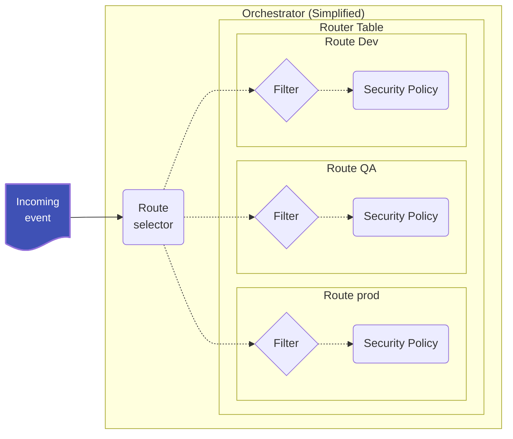

To understand how the engine is structured, it's important to identify the key components involved in this process. When a new event arrives, the engine directs it to different policies for processing. The orchestrator manages these policies at runtime.

The orchestrator routes events to a policy and is composed of the following elements:
- Route: Identifies the events that must be processed by a specific Policy.
- Policy: Processes the events.
- Priority: Determines the order in which the orchestrator attempt to route events.

A policy defines the processing pipeline of the events and is composed of:
- Decoders: Normalize and extract information from the events into a common schema.
- Rules: Analyze security threats (primarily IoCs) and enrich the events.
- Outputs: Send normalized and enriched events to the indexer and other defined outputs.

Each policy can be tailored to specific use cases.

<flowchart_placeholder>


### Event
The purpose of the Engine is to convert unstructured or semi-structured logs into normalized and enriched events. The agent transmits logs within a JSON payload, which includes additional metadata such as OS information, log source, and other relevant details. The Engine processes these logs and generates a structured JSON event, incorporating all relevant information in accordance with the defined [schema](#).

Input event example:
```json
{
  "@timestamp": "2025-01-23T17:40:37Z",
  "agent": {
    "groups": [
      "group1",
      "group2"
    ],
    "host": {
      "architecture": "x86_64",
      "hostname": "wazuh-endpoint-linux",
      "ip": [
        "192.168.1.2"
      ],
      "os": {
        "name": "Amazon Linux 2",
        "platform": "Linux"
      }
    },
    "id": "2887e1cf-9bf2-431a-b066-a46860080f56",
    "name": "wazuh-agent-name",
    "type": "endpoint",
    "version": "5.0.0"
  },
  "event": {
    "collector": "file",
    "module": "logcollector",
    "original": "Dec 13 11:35:28 a-mac-with-esc-key GoogleSoftwareUpdateAgent[21412]: 2016-12-13 11:35:28.421 GoogleSoftwareUpdateAgent[21412/0x700007399000] [lvl=2] -[KSUpdateEngine updateAllExceptProduct:] KSUpdateEngine updating all installed products, except:'com.google.Keystone'."
  },
  "log": {
    "file": {
      "path": "/var/log/syslog.log"
    }
  },
}
```

Processed event:
```json
{
  "@timestamp": "2025-01-23T17:40:37Z",
  "agent": {
    "groups": [
      "group1",
      "group2"
    ],
    "host": {
      "architecture": "x86_64",
      "hostname": "wazuh-endpoint-linux",
      "ip": [
        "192.168.1.2"
      ],
      "os": {
        "name": "Amazon Linux 2",
        "platform": "Linux"
      }
    },
    "id": "2887e1cf-9bf2-431a-b066-a46860080f56",
    "name": "wazuh-agent-name",
    "type": "endpoint",
    "version": "5.0.0"
  },
  "event": {
    "collector": "file",
    "created": "2024-11-22T02:00:00Z",
    "kind": "event",
    "module": "logcollector",
    "original": "Dec 13 11:35:28 a-mac-with-esc-key GoogleSoftwareUpdateAgent[21412]: 2016-12-13 11:35:28.421 GoogleSoftwareUpdateAgent[21412/0x700007399000] [lvl=2] -[KSUpdateEngine updateAllExceptProduct:] KSUpdateEngine updating all installed products, except:'com.google.Keystone'.",
    "start": "2025-12-13T11:35:28.000Z"
  },
  "host": {
    "hostname": "a-mac-with-esc-key"
  },
  "log": {
    "file": {
      "path": "/var/log/syslog.log"
    }
  },
  "message": "2016-12-13 11:35:28.421 GoogleSoftwareUpdateAgent[21412/0x700007399000] [lvl=2] -[KSUpdateEngine updateAllExceptProduct:] KSUpdateEngine updating all installed products, except:'com.google.Keystone'.",
  "process": {
    "name": "GoogleSoftwareUpdateAgent",
    "pid": 21412
  },
  "related": {
    "hosts": [
      "a-mac-with-esc-key"
    ]
  },
  "tags": [
    "production-server"
  ],
  "wazuh": {
    "decoders": [
      "syslog"
    ]
  }
}
```

### Policy processing
The policy is the operational graph applied to each event, structured into decoders, rules, and outputs, each related to normalizing, enriching, and delivery respectively.

<flowchart_placeholder>

Wazuh comes with a predefined policy that enables all its components to work properly and it is structured on top of Wazuh-supported log sources.

Each source does have a particular way to format and send logs to the engine. The default policy takes care of that, allowing the users to focus on their integrations and not on the nuances of the logs transports for each source.

<flowchart_placeholder>

### Decoding process
The decoding process converts unstructured data received by the engine into schema-based JSON events.

All events enter the pipeline through the root decoder, which determines the appropriate decoder for processing. Each subsequent decoder processes the event as much as possible before passing it to the next suitable decoder. This continues until no further processing can be performed.

A closer examination of the predefined decoders reveals the following structure:

<flowchart_placeholder>

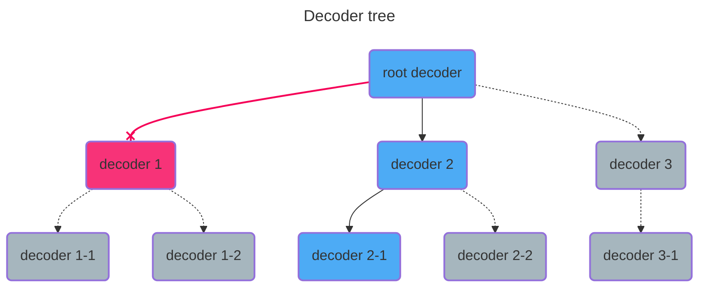

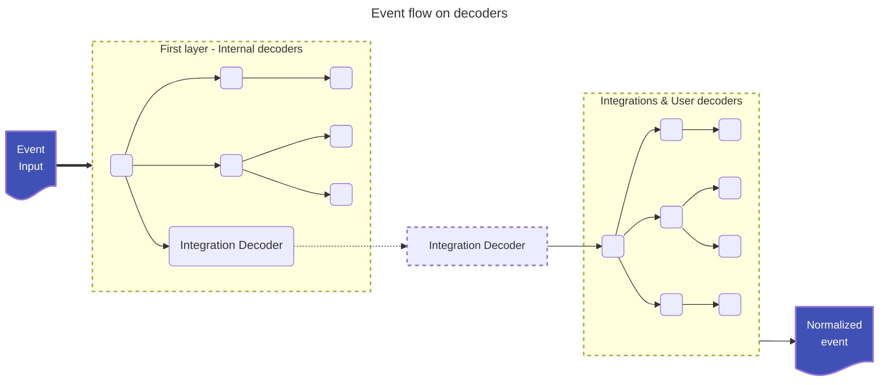

### Security enrichment process
The analysis process evaluates all event fields to identify security concerns, represented as threat indicators within the common schema. These indicators are later examined in the Wazuh Indexer for threat hunting and security issue detection.

All decoded events pass through the analysis pipeline, where the root rule determines the next appropriate rule for processing. This continues until no further rules can be applied. Unlike decoding, a rule can trigger multiple subsequent rules, each contributing to the event's analysis by adding relevant threat indicators.

A closer look at the predefined rules reveals the following structure:

<flowchart_placeholder>
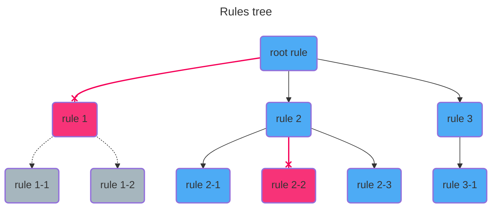


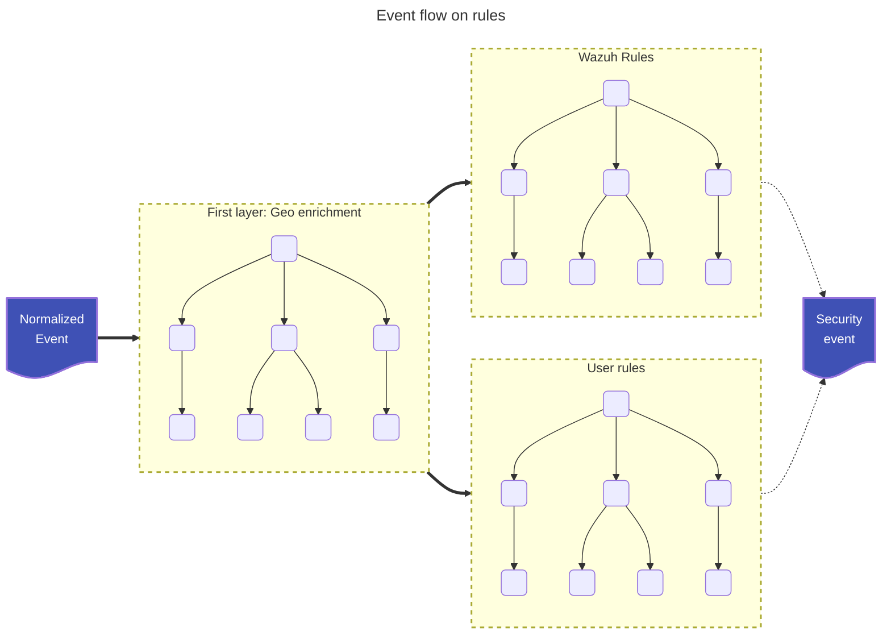

### Archiving and alerting process
Once an event has completed processing through the decoder and rule pipelines, it enters the output pipeline. Similar to previous stages, the event first passes through the root output, which determines the appropriate output(s) for further processing. Multiple outputs can be selected, enabling flexible storage and distribution policies.

The output process in Wazuh is designed to efficiently distribute alerts through broadcasting, with each output capable of filtering alerts to support customized distribution:

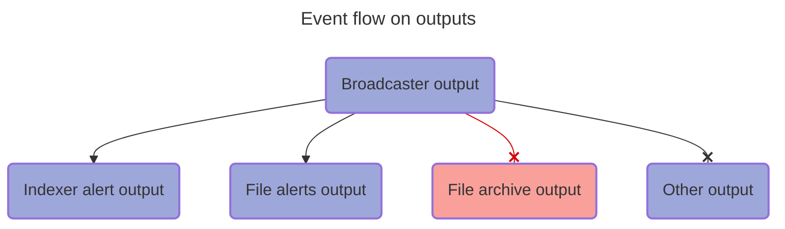


**TODO: Move this graphs**


## Schema

A schema defines a structured format for data, ensuring consistency, interoperability, and efficient querying. It establishes a common set of field names, data types, and relationships that standardize log and event data across different sources.

The Engine ensures that all operations—parsing, normalization, and enrichment—aim to transform unstructured data into structured data that adheres to the schema. This structured approach enhances data integrity, improves search performance, and enables seamless correlation across multiple data sources.

- Consistency: Standardized field names prevent discrepancies when integrating data from different sources.
- Interoperability: Facilitates integration with various tools and analytics platforms.
- Efficient Querying: Optimizes indexing and search performance.
- Data Enrichment: Enables meaningful correlations by aligning logs with predefined categories (e.g., network, process, user activity).

For example, a network event log structured according to the schema might look like this:
```json
{
  "event": {
    "category": "network",
    "type": "connection",
    "action": "network_connection"
  },
  "source": {
    "ip": "192.168.1.10",
    "port": 443
  },
  "destination": {
    "ip": "10.0.0.5",
    "port": 8080
  },
  "user": {
    "name": "admin"
  }
}
```

### Configuration
The schema configuration for the engine follows a structured format where each field is defined with specific attributes. The schema consists of a JSON object with the following key elements:

- Fields Definition:
  - The fields object contains a list of field names as keys.
  - Each field has a corresponding object defining its properties.
- Field Properties:
  Each field in the schema contains two primary properties:
  - `type`: Specifies the OpenSearch field type, such as date, keyword, text, integer, etc.
  - `array`: A boolean value (true or false) indicating whether the field can store multiple values (i.e., an array) or just a single value.

```json
{
  "name": "schema/engine-schema/0",
  "fields": {
    "@timestamp": {
      "type": "date",
      "array": false
    },
    "agent.build.original": {
      "type": "keyword",
      "array": false
    },
    "agent.ephemeral_id": {
      "type": "keyword",
      "array": false
    },
    "agent.id": {
      "type": "keyword",
      "array": false
    }
  }
}
```

### Implications
- Operational Graph and Consistency Enforcement
  - The schema is used during the construction of the operational graph to ensure that all operations are valid based on the defined field types and structures.
  - Whenever possible, schema validation is performed at build time to prevent misconfigurations before execution.
  - If an operation's consistency cannot be fully validated at build time, additional runtime checks are applied to ensure adherence to the schema.
- Consistency and Normalization in Dashboards
  - The schema ensures that data displayed in dashboards follows a consistent structure.
  - This enables seamless aggregation, filtering, and visualization by maintaining a predictable and normalized data format.

## Managing the Engine's processing
Now that we've explored what the Engine does and how its processing works, we’ll introduce key elements involved in managing and defining the operational graph—specifically, routes, policies, and assets.

All management is performed through the API (refer to the API documentation for a complete list of available calls). Before defining the operational graph, all policies and assets must first be loaded into the Engine’s catalog. This ensures that all assets are validated and ready for use before they are referenced in processing.

### Namespaces
To organize assets efficiently, the Engine categorizes them into namespaces. Internally, assets are stored directly under a specific namespace, allowing for structured management and role-based segregation of policies.

The default policy asset namespaces in the Engine are:
- `system` – Core assets responsible for handling internal event processing and ensuring basic event normalization.
- `wazuh` – Default integrations developed and maintained by Wazuh.
- `user` – A default namespace for end-user-defined assets.

While these are the predefined namespaces, the Engine allows creating as many namespaces as needed, enabling flexibility in asset management.

### Assets Catalog

The Catalog is responsible for managing the Engine’s assets, organizing them under namespaces. Each asset is uniquely identified by its name, following the convention:
```
<type>/<name>/<version>
```

This naming structure ensures clear versioning and categorization of assets. The following asset types are defined:
- **decoders** – Responsible for normalizing events, transforming raw data into a structured format.
- **rules** – Handle security analysis and event enrichment, identifying threats and adding contextual information.
- **outputs** – Define storage policies for processed events, determining how and where data is stored.
- **filters** – Used for event routing, ensuring events are correctly directed to the appropriate policies.
- **integrations** – Serve as manifests for other assets, grouping related assets that support a common goal. Typically used to bundle all assets required for specific services.

All API calls to the Catalog support name-path operations, allowing users to manage specific assets or entire groups efficiently. (Refer to the API documentation for a full list of available catalog operations.)

### Policies and Routes

With all assets defined and stored in the Catalog, the next step is to define policies, specifying exactly what functionality we want to apply. A policy organizes assets hierarchically, defining how events are processed.

The API allows users to configure all decoders, rules, and outputs for a policy, along with default management settings—such as defining default asset parents for specific namespaces. (For a complete list of API calls, refer to the documentation.)

Each policy contains references to asset names, and during the building process, the Engine retrieves these assets from the Catalog. The graph is then built following the parent relationships defined in the assets, ensuring a valid structure. If the relationships are invalid or incomplete, the build process will fail, preventing misconfigurations.

Following the same Catalog-first approach, policies are stored before they are actually used. Policies are only referenced when defining routes, ensuring that all assets and relationships are pre-validated before execution.

The Orchestrator is responsible for pairing filters with policies, ensuring that specific types of events are processed by the appropriate policies. It also manages loaded policies, routing priority and some event processing configuration.

The Engine also introduces the concept of testing sessions, which are specialized policies designed for processing test events via the API. These sessions allow users to validate how their policies will behave before deploying them in production, ensuring correctness and expected functionality.

For a complete list of API calls related to routing and policy management, refer to the documentation.

#### Architecture

The Engine is composed of distinct modules, each responsible for managing a specific aspect of event processing:
- Catalog → Manages assets (decoders, rules, filters, outputs, integrations).
- Policy → Manages policies, defining how assets are organized and processed.
- Orchestrator → Manages routes, pairing filters with policies to control event processing.

All modules follow the same naming convention, ensuring that every item—whether an asset, policy, or route—can be stored and identified homogeneously by the Store module.

<flowchart_placeholder>

- The APIs provide external communication, allowing users to interact with and configure the system.
- The Store module handles internal data retrieval, ensuring assets, policies, and routes can be efficiently accessed by their respective modules.

## Assets
In the Wazuh Engine, assets represent the fundamental components of security policies and are the smallest unit within such a policy.

Each asset is organized into various stages that dictate operational procedures when processing an event. These stages provide a structured and semantically meaningful sequence of operations, enhancing the engine's capability to execute these operations efficiently based on predefined execution strategies.

Do not confuse stages with attributes, which are configuration details and metadata about the asset.


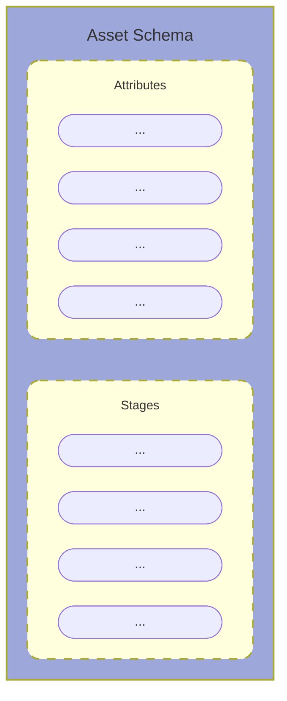

### Attributes
Attributes are configuration details. Although the order of definition does not matter, we follow the convention of defining them in the order of name, metadata, and parents.
- **Name**: Identifies the asset and follows the pattern <asset_type>/<name>/<version>.
- **Metadata**: Contains all information about the asset. The exact subfields depend on the asset type.
- **Parents**: When applicable to the asset, this defines the order in the asset graph. The exact child selection depends on the specific asset graph type.
- **Definitions**: Defines symbols that will be replaced throughout the document in its occurrences.

### Stages
The stages define the operation chain and flow the asset performs on events. Each stage is executed in the order of definition:


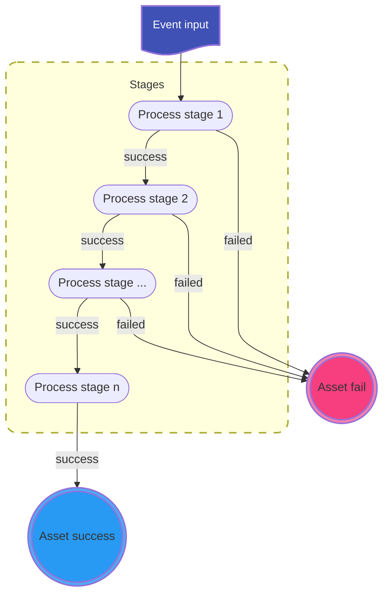

When a stage is executed, it can either fail or succeed, depending on the logic of the stage and the operations performed. Each stage is sequentially executed only if the previous stage succeeds.

Stages:
- **Check/Allow**: Allows conditional operations to be made on the event. Cannot modify the event.
- **Parse**: Parses fields on the event, acting both as a condition and normalization.
- **Map**: Allows mapping and transformation operations on the event.
- **Normalize**: Defines blocks with a combination of check, parse, and map stages.
- **Output**: Allows operations to communicate outside the Engine, typically used to send events outward. Cannot modify the event.

### Asset types
The type of asset is an allowed combination of certain stages. The following table outlines the stages available for each type of asset:

| Asset Type | Allowed Stages |
|-|-|
|Decoders|check, parse, map, normalize|
|Rules|check, map, normalize_rule|
|Outputs|check, output|
|Filters|allow|

Each asset has a name and metadata, with custom metadata suited to its specific needs. Additionally, each asset can have parents.

### Operations
Operations are the fundamental units within the operation graph. Each operation can succeed or fail, forming the basis for defining the graph by combining operations based on their execution results.

Operations are always defined as:
```yaml
target_field: operation
```

Where the operation can be:
- **Literal Value**: A direct check or map operation depending on the stage it is defined. This can be any of the YAML native values (string, number, boolean, etc.).
- **Reference**: Denoted by $field_name, it performs a direct check or map operation using the referenced value.
- **Helper**: Denoted by helper_name(args), it performs a check or map operation depending on the called helper.

When building an asset, the process can fail if there is any operation that contains a:
- **Syntax Error**: Errors in the target_field or operation syntax.
- **Schema Validation Failure**: Errors such as mapping a boolean into a keyword field, which violates the schema validation rules.
- **Semantic Error**: Incorrect usage, such as using a conditional helper in a map stage.
These errors will be notified when trying to upload the asset to the catalog.

### Execution Graph Summary
With a basic understanding of a policy and its components, we can look at the global picture of how the operation graph is defined.
Within the policy, we have subgraphs, each corresponding to an asset type:
- Decoders
- Rules
- Outputs

<workflow_placeholder>

Every event traverses each subgraph independently, forming a chain of subgraphs.

Each graph is composed of assets defined by parent relationships. An event moves down in the graph based on the asset's logical output. If an asset operation succeeds, the event is sent to its child assets.

The traversal of each subgraph follows these rules:
- **Decoders**: If the current decoder asset succeeds, the event is sent to its first child. If it fails, the event is sent to the next sibling of the parent decoder (logical OR between children).
- **Rules**: If the current rule asset succeeds, the event is broadcast to all its child assets.
- **Outputs**: Events are broadcast to all defined output assets.

An asset is considered successful if it accepts the event, meaning all conditional stages have succeeded, regardless of the outcome of transformational stages. This ensures that events are processed through the appropriate path based on successful acceptance checks.

A stage succeeds if the logical combination of its operations succeeds. The exact combination logic is determined by the stage itself. This ensures that each stage can apply its own logic to decide whether it has successfully processed an event.

<workflow_placeholder>

### Helper functions
Implement all the high level operations available to the user when developing the ruleset. Each function defines its signature, its mode of operation and its error management. Users cannot change the behavior of a helper function, and cannot combine two functions into a single expression.

There are two intrinsic operations which do not require additional syntax:
- Comparison of values or references inside a check stage.
- Value or reference assignment inside a map stage.

All other operations are accessed through the helper functions.

The syntax for calling a helper function is `helper_name(args...)`. They can be used in both check operations and map operations. Helper functions are classified into three categories:
- **Conditionals**: Used in check operations to test complex conditions.
- **Transformational**: Used in map operations to transform data.
- **Mapping**: A subset of transformational operations scoped to modifying only the target field.

Check the helper standard library for a complete list of available helper functions.

#### Condition Helpers
When using conditional helpers, the syntax is:
```yaml
target_field: condition_helper(args)
```

The helper will always test a condition on *target_field*. If the condition passes, the operation succeeds; otherwise, it fails.

#### Transform Helpers
When using transformational helpers, the syntax is:
```yaml
target_field: transform_helper(args)
```

The helper will transform the *target_field* if the operation succeeds. If the operation fails, the *target_field* remains unchanged.

A transformational helper may fail due to implicit conditions, such as expecting a specific type for the target field, missing a reference passed as an argument, etc.

***It is important to understand that every operation can succeed or fail, and this is the foundation for defining the operation graph.***

#### Parsing rules
When using a helper function in a map or check operation:
```yaml
target.field: helper_name(args...)
```

Each argument is tried to be parsed in the following order:
- **Quoted argument**: `'value'` if it starts with a single quote it parses until the closing single quote, allowed scaped characters are: `\` and `'`.
- **Reference**: `$reference` if it starts with the dollar symbol a reference is parsed, which is any alphanumeric plus the extended symbols `#`, `_`, `@`, and `-` separated by dots.
- **JSON value**: parses a JSON string, any JSON string with JSON escaping rules.
- **Raw string**: if the other parsers fail a string value will be assigned, here we allow the escaping of the symbols: `$`, `'`, `,`, `)`, `\` and whitespace.

Invalid escape sequences will always fail.

When parsing a helper function inside a logical check expression the same rules apply adding that at least one argument is expected for the helper, specifying the target field:
```yaml
check: helper_name($target.field, args...)
```

Added we can specify comparison helpers as operators:
```yaml
check: $target.field <op> <value>
```

Where value is parsed as a single helper argument following the same escaping rules and order.

Where op is any of the following:
- `==`
- `!=`
- `<`
- `<=`
- `>`
- `>=`

When using any operator that is not the equality operator only string or integer values are allowed.

When using the default map or filter functions for string operations, values are parsed according to standard YAML (or JSON) types. If a value is a string and begins with the reference symbol `$`, it is treated as a potential reference. If the reference is invalid the operation building fails.
```yaml
check:
  - target.field: <yaml_type>|<$ref>
map:
  - target.field: <yaml_type>|<$ref>
```

### Definitions
To facilitate the reuse of constructors when building large assets—such as parsing code for events with common headers or repeated constructs like IP/port definitions—definitions can be introduced at the specification level. For example:
```yaml
definitions:
  header: <timestamp> <host.hostname> <daemon>:
  source: <source.ip>:<source.port>
  destination: <destination.ip>:<destination.port>
  a-list:
    - item1: value1
    - item2: value2
```

These definitions can then be referenced elsewhere:
```yaml
parse|field:
    - <$header> from <$source> to <$destination> deny
```

This approach enables text reuse within an asset. Definitions are applied at build time through interpolation and do not function as runtime variables, i.e., cannot be modified once declared.

#### Restrictions
- **Naming Conflicts**: Definitions cannot have the same name as a schema field. Doing so will result in a failure to build the asset.
- **Precedence**: Definitions take precedence over custom fields. If a definition exists with the same name as a custom field, all references to the field will be replaced by the definition's value.
- **Chaining Definitions**: Definitions can use other definitions in their values as long as they are defined beforehand.
- **Context**: Definitions can only appear on the right side of operations, meaning we can't define the structure of the document with definitions or be used inside non operational stages.

#### Use Cases
- **Parsing Complex Logs**
  - Logs with extensive or structured headers can be broken into reusable definitions for clarity and to avoid redundancy.
  - **Example**: Defining reusable components (TYPE_FIELD, MSG_FIELD) for parsing various log formats.
- **Handling Large Value Lists**
  - When working with extensive arrays (e.g., banned IPs), definitions keep the configuration readable and maintainable.
  - **Example**: Using a predefined list of banned IPs to check against source IPs in a normalize stage.
- **Small Key-Value Databases (kvdbs)**
  - When small mappings are needed but don’t justify a full kvdb, definitions provide a lightweight alternative.
  - **Example**: Mapping log levels or event IDs to structured categories, types, and outcomes for normalization.

### Variables

Variables are temporary fields scoped to the current asset that is processing an event. They are identified by prefixing their name with an underscore `_`, following the standard field naming convention and supporting any operation just like fields.
```
_field.name
```

Key characteristics:
- Scoped to the current asset – Variables exist only within the asset processing the event and do not persist beyond it.
- Runtime Modifiable – Unlike definitions, which are static, variables can be modified during event processing.

### Log Parsing
Log parsing transforms raw log entries into structured data using parser expressions. These expressions serve as an alternative to Grok, eliminating the need for explicit type declarations by leveraging predefined schema-based parsing. Instead of regular expressions, they use specialized parsers for improved accuracy and efficiency.

Key Components:
- Literals: Direct character matches with escape rules for special characters.
- Fields: Extract structured data, including:
  - Schema fields (predefined in the schema)
  - Custom fields (user-defined, defaulting to text)
  - Optional fields (ignored if missing)
  - Field choices (choosing between multiple fields)
- Wildcards: Capture patterns without mapping data to fields.
- Optional Groups: Make subexpressions optional for flexible parsing.
- Schema Parsers: Automatically applied when a field of a known type is used, ensuring compatibility with Wazuh Indexer.

Example:
This expression captures an IP or hostname into `client.ip` or `client.address` and, if present, captures a port into `server.port`:

```yaml
parse|event.original:
  - "<client.ip>?<client.address> connected to <server.ip>(?:<server.port>)"
```

For a log entry:
```
192.168.1.10 connected to 10.0.0.5:443
```

It extracts:
```json
{
  "client.ip": "192.168.1.10",
  "server.ip": "10.0.0.5",
  "server.port": "443"
}
```

Parsers are also available as helper functions for use in map and check operations. For a detailed explanation, see the Parser Stage and Parser Helper Functions sections.

### Key Value Databases
The engine allows the definition of JSON key-value databases, making them available in the assets through helper functions. These databases can be used to map large serializable data and check Indicators of Compromise (IoCs) or extensive key databases that require constant management. This approach separates the maintenance of such data from the decoder, streamlining the process and ensuring efficient data handling.

For more details on managing kvdbs, refer to the How to Manage kvdb section and the kvdb Library helper functions.

#### Use cases
**Normalizing Large Serializable Data**: Maps event IDs to predefined categorization fields using a kvdb, simplifying event classification. Example:
```yaml
normalize:
  - map:
      - event: kvdb_get_merge(windows_security_eventid_to_category_type_action, $event.code)
```

This retrieves event categories, types, and actions based on the event ID.

**Checking Indicators of Compromise (IoCs)**: Compares log entries against a kvdb of known malicious IPs to identify potential threats. Example:
```yaml
normalize:
  - check:
      - source.ip: kvdb_match(known_malicious_ips)
```

If a match is found, security-related data is mapped to the event.

### Dates and Timestamps
Assets are capable of handling dates in various formats and time zones. This flexibility is achieved through configurable parsers (refer to the date parser documentation for more details).

Once a date is parsed, the Engine normalizes it to UTC. This ensures that all timestamps are stored and processed homogeneously, maintaining consistency across event processing and dashboard visualization.

### Geolocation
Assets are capable of enriching events with geolocation information, enhancing event data with location-based context. This is achieved by using GeoLite databases, which provide location data based on IP addresses. For more details, see the geo location helper documentation.

The GeoLite databases are configured through the API, allowing you to specify the relevant databases to be used for geolocation enrichment. For more information on how to configure these databases, refer to the API documentation.

### Decoders

Decoders are the first layer of assets that pass through the event when it is processed by a security policy. They are responsible for normalizing the event, transforming it into a structured event.

All events enter the pipeline through the root decoder, which selects the appropriate decoder to process the event. Each subsequent decoder processes the event as much as it can and then passes it to the next suitable decoder. This continues until no more decoders can process the event. A decoder can only select one next decoder from the available ones.


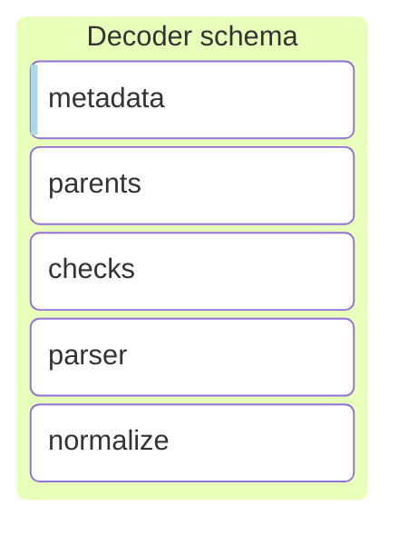

- **Metadata**: Each decoder has metadata that provides information about the decoder, such as the supported products,
  versions, and formats. This metadata does not affect the processing stages. (TODO IMPROVE)

- **Parents**: Defines the order in the decoder graph, establishing the parent-child relationship between decoders.
  A decoder can have multiple parents, when an event is successfully processed in a decoder, it will evaluate the
  children, one by one, until it finds a decoder that successfully processes the event.

> [!IMPORTANT]
> There is no order of priority when evaluating the children, and it cannot be assumed that a sibling decoder will be evaluated before another one.

- **Checks**: The checks stage is a preliminary stage in the asset processing sequence, designed to assess whether an
  event meets specific conditions without modifying the event itself.
  More information on the checks stage can be found in the [Check section](#checkallow).


### Rules

Rules are the second layer of assets that process events in a security policy. They are responsible for analyzing the
normalized event, when the decoding stage is finished, to add context, security indicators, and threat intelligence.
Unlike decoders,  the rule cannot modify the decoded event, but it can add new certain fields to enrich the event, this
prevents the rules from being used to decode events.


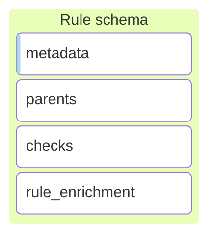

- **Metadata**: Each rule has metadata that provides information about the rule, such as the supported products,
  versions, and formats. This metadata does not affect the processing stages. (TODO IMPROVE)

- **Parents**: Defines the order in the rule graph, establishing the parent-child relationship between rules, a rule can
  have multiple parents, when an event is successfully processed in a rule (rule matches), it will evaluate all the
  children. Unlike decoders, and all children will be evaluated.

- **Checks**: The checks stage is a preliminary stage in the asset processing sequence, designed to assess whether an
  event meets specific conditions. On the rules, the checks stage is used to evaluate the conditions that the event must
  meet to be considered a security event. More information on the checks stage can be found in the [Check section](#checkallow).

- **Rule Enrichment**: The rule enrichment stage is used to add context, security indicators, and threat intelligence to
  the normalized event. This stage is used to add new fields to the event, but it cannot modify the normalized event, it
  like the `map` stage, but with the restriction that it cannot modify the normalized event, only rule fields can be added.

### Outputs

Outputs are the last layer of assets that process events in a security policy. They are responsible for storing the
security events in a storage system, sending them to a wazuh-indexer, a file, or sending them to a third-party system.


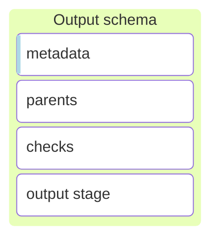

- **Metadata**: Each output has metadata that provides information about the output, such as the destination, version,
  and format. This metadata does not affect the processing stages. (TODO IMPROVE)

- **Parents**: Defines the order in the output graph, establishing the parent-child relationship between outputs.
  An output can have multiple parents, when an event is successfully processed in an output, it will evaluate all the
  children. Usually, the outputs are the last assets in the policy, so they do not have children.

- **Checks**: The checks stage is a stage in the output asset used to evaluate the conditions that the event must meet to
  be sent to the output. More information on the checks stage can be found in the [Check section](#checkallow).

### Filters

The filters are assets with a single stage, the check stage, used to evaluate the conditions without modifying the event.

The filters are used to:

1. Route events to the correct policy in the orchestrator (Most common use case).
2. Filter a event between parent assets and child assets.


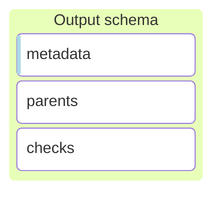

- **Metadata**: Each filter has metadata that provides information about the filter, such as the proposed use case, version,
  and format. This metadata does not affect the processing stages. (TODO IMPROVE)

- **check**: The checks stage is a stage in the filter asset used to evaluate the conditions that the event must meet to
  pass the filter. More information on the checks stage can be found in the [Check section](#checkallow).

- **Parents**: Defines the order in the filter graph, establishing the parent-child relationship between assets and filters.
  When children are used in the safety policy, they can be located under any decoder, ruler or output. When an asset is evaluated and succeeds, it evaluates the filter that has it as a parent and if it passes the filter, the children of the passet are evaluated.

  <placeholder_graph_filter>

> [!NOTE]
> When filter assets are used in the orchestrator, the don't have parents, they are a check stage that is evaluated before
> the event is sent to the policy.

## Stages

### Check/Allow
The check stage is a preliminary stage in the asset processing sequence, designed to assess whether an event meets specific conditions without modifying the event itself. Filters events based on predefined criteria, ensuring that only relevant events trigger the subsequent stages like parse or normalize.

There are two ways to define conditions in a stage check: through a condition list or a conditional expression string.

#### Condition list
In a condition list, each condition is described with a pair `property:value`. Here, `property` is the name of any field, and `value` is the condition that the field must meet.

The event is filtered through all listed conditions, and only events that satisfy all conditions in order are processed further.

Depending on the value, the condition to test is:
- **JSON value**: Tests that the field contains a specific value.
- **Field reference**: Checks that the event contains the field denoted by the reference, and both fields have the same value. A reference is formatted as `$field.name`.
- **Helper function**: Executes a conditional operation on the field, specified by `helper_name(args…)`.

Example checklist:
```yaml
check:
  - event.format: text
  - user.name: $root_user
  - event.original: exists()
  - event.id: 1234
```

#### Conditional expression
For scenarios requiring complex conditions, especially in rules, a conditional expression allows for more nuanced logic. This string uses a subset of first-order logic language, including logical connectives and support for grouping through parentheses.

Logical Connectives:
- Negation (NOT)
- Conjunction (AND)
- Disjunction (OR)

These connectives facilitate writing conditions between terms where a term can be:
- Value comparison: Formatted as `<$field><op><value>`.
- Helper function: Expressed as `<helper_name>(<field>, args...)`, except for the “exists” helper, which can be denoted by the field name alone.

Supported Operators:
- Comparison operators `!=` and `==` are applicable to all data types.
- Operators `<=`, `<`, `>=`, `>` are supported for numbers and strings (lexicographically).

Examples of conditional expressions:
```yaml
check: $event.category=="registry" AND $event.type=="change" AND ($registry.path=="/some/path" OR $registry.path=="/some/other/path")
```

```yaml
check: int_less($http.response.status_code, 400)
```

```yaml
check: $wazuh.origin == /var/log/apache2/access.log OR $wazuh.origin == /var/log/httpd/access_log
```

### Parse
Executes a series of parsing expressions that transform the event's original message into clearly defined data fields. The parsing operations are processed in sequence, with each operation attempted until one succeeds. If an operation succeeds, subsequent operations in the list are skipped.

If all operations fail, the execution of the stage is marked as failed, the processing of the event could continue with the next substage only if it is within a normalize.

For a complete list of parsers check the Parsers reference.

#### Parser expression
Parser expressions facilitate the transformation of log entries into structured objects, offering an alternative to Grok by eliminating the need for explicit type declarations as these are predefined in the schema. Instead of regular expressions, these expressions utilize tailored parsers, enhancing precision.

The parser expressions are composed of various tokens or expressions, where these expressions can be any one of the following:
- **Literals**, Direct characters that match input text exactly. with certain reserved characters that require escaping (used in other tokens), with the character `\` , precisely: `<>?\(`

  E.g.: The following expression will match exactly that in the log line
`[Fri Sep 09 10:42:29.902022 2011] [core:error]`
- **Fields**, are expressions of the form  `<[?]field_name[/param1…]>`, where we can identify 4 different types of field expressions:
  - **Schema fields**: Directly correspond to fields defined in the schema, with the engine automatically applying the appropriate parser and can have parameters depending on the parser.

     E.g.: `<source.ip>` will match any IPv4 or IPv6 and map it to the field `source.ip`.
  - **Custom fields**: Are those that are not in the schema, in contrast to schema fields, custom fields use the text parser unless specified otherwise by the parameters. These are intended for temporary/auxiliary use.

    Custom fields are indexed as text by default in open search, depending on the configuration open search may try to detect and index as other types.

    E.g.: `<custom_field/long>` will match any number and map it to the field `custom_field`.
  - **Optional fields**: we indicate that a field parse expression is optional writing the interrogation symbol `?` at the beginning of the expression. If the parsing fails it will continue with the next expressions.

    E.g.: `<field1>|<?field2>|<field3>` will match anything between `|` symbols three times, and the second may be empty or not.
  - **Field choice**: Expresses a choice between two field expressions, meaning one of the fields must match. We write two field expressions splitted by the interrogation symbol `?`. As the first choice we can only use parsers that do not require end token, if we use one that does the expression will fail to compile because the end tokens are not sent to the parser.

    E.g.: `<source.ip>?<~/literal/->` will match an IP and map it to source ip or a hyphen, skipping it.

    Note: `?` only needs to be scaped when it appears right after a field expression: `<source.ip>\?...`
- `Wildcards`, follows the same syntax and behaves the same as a custom field but has no name and does not map to any field. It is used to parse some pattern without extracting. Can be a optional or in a field choice also.

  E.g.:`<~/byte>` will parse a byte value and continue.

  E.g.:`Error Code: <~/long> Description: <message>` Here, `<~/long>` uses a wildcard to parse an integer error code that isn’t mapped to any field, essentially ignoring it while capturing the subsequent error description into message.
- **Optional groups**, make a logpar subexpression optional. The optional expression is denoted with `(?sub_expression)`. Used to make some more complex patterns optional where a simple optional field won’t suffice. It can contains any valid logpar expression with the exception of another optional group. An optional group can not contains another group, and two optional groups may not appear in a row.

  E.g.:`[<source.ip>(?:<source.port>)]` will match any ip address optionally followed by a port separated by double dots, and being between brackets.

**Examples**:

This expression will capture an IP address or hostname into `client.ip` or `client.address`, and optionally capture a port into `server.port` if it is present.
```yaml
<client.ip>?<client.address> connected to <server.ip>(?:<server.port>)
```

Apache error parser:
```yaml
# [Mon Dec 26 16:15:55.103522 2016] [mpm_prefork:notice] [pid 11379] AH00163: Apache/2.4.23 (Unix) configured -- resuming normal operations
# [Mon Dec 26 16:15:55.103786 2016] [core:notice] [pid 11379] AH00094: Command line: '/usr/local/Cellar/httpd24/2.4.23_2/bin/httpd'
# [Wed Oct 20 19:20:59.121211 2021] [rewrite:trace3] [pid 121591:tid 140413273032448] mod_rewrite.c(470): [client 10.121.192.8:38350] 10.121.192.8 - - [dev.elastic.co/sid#55a374e851c8][rid#7fb438083ac0/initial] applying pattern '^/import/?(.*)$' to uri '/'
# [Wed Oct 20 19:20:59.121211 2021] [rewrite:trace3] [pid 121591:tid 140413273032448] mod_rewrite.c(470): [client milo.dom.com:513] 10.121.192.8 - - [dev.elastic.co/sid#55a374e851c8][rid#7fb438083ac0/initial] applying pattern '^/import/?(.*)$' to uri '/'
# [Mon Dec 26 16:22:08 2016] [error] [client 192.168.33.1] File does not exist: /var/www/favicon.ico
# [Fri Sep 09 10:42:29.902022 2011] [core:error] [pid 35708:tid 4328636416] [client 89.160.20.112] File does not exist: /usr/local/apache2/htdocs/favicon.ico
# [Thu Jun 27 06:58:09.169510 2019] [include:warn] [pid 15934] [client 67.43.156.12:12345] AH01374: mod_include: Options +Includes (or IncludesNoExec) wasn't set, INCLUDES filter removed: /test.html
# [Mon Dec 26 16:17:53 2016] [notice] Apache/2.2.22 (Ubuntu) configured -- resuming normal operations
# [Mon Dec 26 16:22:00 2016] [error] [client 192.168.33.1] File does not exist: /var/www/favicon.ico, referer: http://192.168.33.72/
# [Mon Dec 26 16:22:08 2016] [error] [client 192.168.33.1] File does not exist: /var/www/favicon.ico
parse|event.original:
    - "[<@timestamp/Mon Dec 26 16:22:00 2016>] [<log.level>] [client <source.address>(?:<source.port>)] <message>"

    - "[<@timestamp/%a %b %d %T %Y/en_US.UTF-8>] [<~apache.error.module>:<log.level>] [pid <process.pid>(?:tid <process.thread.id>)] [client <source.address>(?:<source.port>)] <message>"

    - "[<@timestamp/%a %b %d %T %Y/en_US.UTF-8>] [<~apache.error.module>:<log.level>] [pid <process.pid>(?:tid <process.thread.id>)] <message>"
```

#### Schema fields and parsers
Fields within the schema are bound to specific parsers that ensure the data matches the expected format. For example, date fields may require a specific time format, which is denoted using parameters following the field name in the format `<field_name/param_0/param_n>`. This allows for flexible data validation against predefined types or custom formats specified by additional parameters.

For standard fields defined in the schema, each field type has an associated parser. For instance, a field of type long (like `event.severity`) will utilize a numeric parser.

Custom fields not defined in the schema default to using the text parser, which continues parsing until a specified delimiter or the end of the log entry. Fields at the end of a parser expression are interpreted as catch-all, capturing all remaining text in the log entry. This approach facilitates partial parsing where full matching is not required, ensuring flexibility in log analysis.

For example,  the case of `<tmp_field>c` this will parse everything until character `c` is found. It is possible to specify the parser name as the first argument, for example `<tmp_field/ip>c` will use the ip parser instead of the text parser. It is also possible to pass parameters to the parser, for example `<tmp_field/date/RFC822>c` parses the timestamp using the RFC822 format.

#### End tokens and field expressions
Some parsers need an anchor token to stop parsing, i.e. the text parser used by default in all custom fields will parse any character until the end token is found. The end token is the literal following the field expression, or if the field expression is at the end it will parse the remaining string.

E.g.:`<header>:<message>` will parse and capture any text up to a double dots in the header field, and the remaining of the log will be captured in the message field.

This implicates that two field expressions must be splited by a literal unless the first one does not need an end token, while `<custom/long><~>` is valid, as the long parsers does not need end token, `<text><~>` will be invalid.

In choice expressions the end token is the same for both field expressions, it is the literal right after the second field expression. E.g, `<custom_ip>?<~>|` will be valid, as both parsers require an end token, in this case the literal `|`. This implies the same as before, if one of the choices needs an end token, it must be followed by a literal.

In optional group expressions, i.e. when a field is followed by an optional group, there are multiple end tokens. The literal at the beginning of the optional group and the literal right after the group, meaning if a field needs an end token and is followed by an optional group, the group must start with a literal and a literal must appear right after the group.

E.g.: `<custom_text>(?|<opt/long>):`, in this case the text parser will try to search for a `|`, so the optional group can be parsed, and if the optional group fails, then the text parser will use the symbol `:` as end token.


### Map
Executes each operation of the list in order until the last operation. If any operation fails, it continues with the next one.

If all operations fail the stage is not marked as failed and  continues to the next stage.
```yaml
- map:
    - event.kind: event
    - event.dataset: apache.access
    - event.category: +array_append/web
    - event.module: apache
    - service.type: apache
    - event.outcome: success
```


### Normalize/Enrichment
The normalize stage is where the event undergoes transformations and adjustments after passing through the check and parse stages successfully. Composed of a list of sub-stages that are executed in the specified order. These sub-stages can include operations such as check, map, and parse.
- **Check**: Applies conditional checks within the normalize context to determine if subsequent mappings or parsing should be executed.
- **Parse**: Further decomposes and extracts fields from the event data if required.
- **Map**: Transforms and assigns new values to fields in the event based on predefined rules.

Each set of sub-stages is processed sequentially. If a check and parse within a normalization block is successful, the corresponding map is executed, replicating the check, parse, and normalize stages of the asset.

Example:
```yaml
normalize:
 - map:
	- wazuh.decoders: array_append(windows-sysmon)
	- event.dataset: sysmon
	- event.kind: event

 # Only maps network.procol if event.code is 22
 - check: $event.code == '22'
   map:
	- network.protocol: dns

 # Only maps resources if the check and parse stages succeeded
 - check: $event.outcome == failure
   parse|message:
     - "[<error.code/int>]<details>"
   map:
     - resources: split($details, ",")
```

### Output
The Output Stage allows you to specify and configure the different outputs, defining the final destinations for events before they leave the Engine.
```yaml
outputs:
  - output_name: configuration
```

For more details on the available output types and configurations, refer to the appropriate documentation:
- Indexer
- File

## Parsers

### Schema parsers
These parsers are used automatically when a field of its type is used in a logpar expression.

For example, if you use the field `<event.start>` which is of type `date`, it will be parsed automatically by the date parser.

These parsers will generate fields which are type-compatible with Wazuh Indexer.

| Type        | Parser       | Description                                                                                          |
|-------------|--------------|------------------------------------------------------------------------------------------------------|
| null        | -            | A null field can’t be indexed or searched. When a field is set to null, OpenSearch behaves as if that field has no values. |
| boolean     | bool         | OpenSearch accepts true and false as boolean values. An empty string is equal to false.               |
| float       | float        | Codified as decimal representation in string format. A single-precision 32-bit IEEE 754 floating point number, restricted to finite values. |
| scaled_float| scaled_float | Codified as decimal representation in string format. The scaling factor is defined in the schema.    |
| double      | double       | Codified as decimal representation in string format. A double-precision 64-bit IEEE 754 floating point number, restricted to finite values. |
| long        | long         | Codified as decimal representation in string format. A signed 64-bit integer with a minimum value of `-2^63` and a maximum value of `2^63-1`. |
| byte        | byte         | Codified as a decimal representation in string format. A signed 8-bit integer with a minimum value of `-128` and a maximum value of `127`. |
| object      | -            | -                                                                                                    |
| array       | -            | -                                                                                                    |
| nested      | -            | -                                                                                                    |
| text        | text         | A string sequence of characters that represent full-text values.                                     |
| keyword     | text         | A string sequence of characters that represent full-text values.                                     |
| ip          | ip           | A string with IPv4 or IPv6 address.                                                                  |
| date        | date         | Date codified as string. All dates are converted to a unified date in UTC timezone.                  |
| geo_point   | -            | -                                                                                                    |
| binary      | binary       | A codified base64 string.                                                                            |

Aditionally we define some types for the purpose to use specific parsers, normally used to parse objects or structured types from an input text. This is the case for `url` field for example.

| Type        | Parser     | Description                                                                                           |
|-------------|------------|-------------------------------------------------------------------------------------------------------|
| url         | uri        | Parses URI text and generates the URL object with all the parsed parts.                               |
| useragent   | useragent  | Parses a user agent string. It does not build the user agent object; this can be done with the OpenSearch plugin. |


## Helper functions

Explanation of how herlper work, format, types, etc.

- link to new document inside this module with all helpers functions

## Debugging

### Logs

### Tester

### Traces


## F.A.Q
- A explanation of the time zone and how it works in the engine.
- A explanation of diferent timestamp fields and how they are used.
