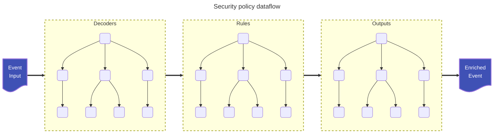
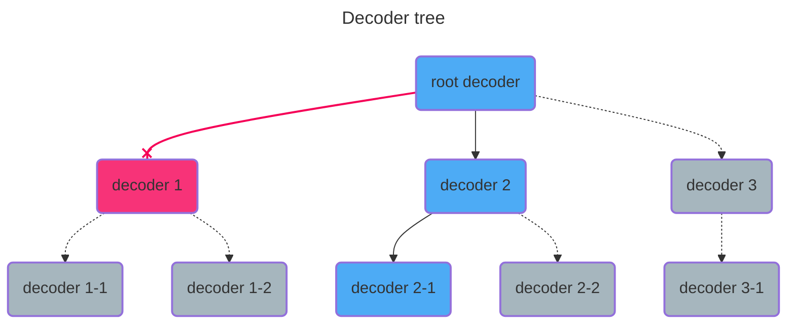
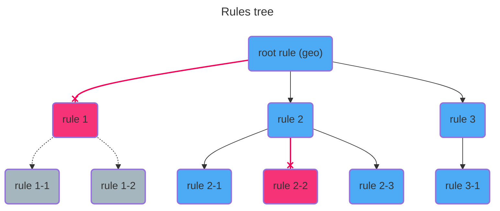
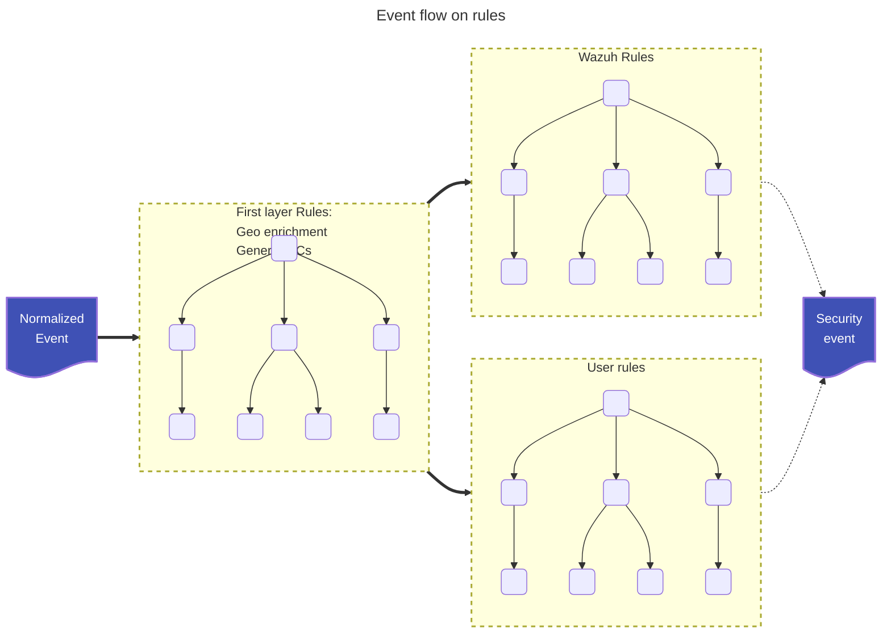
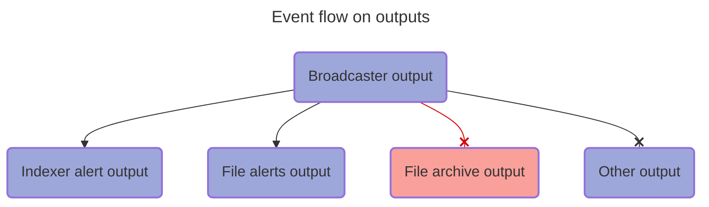
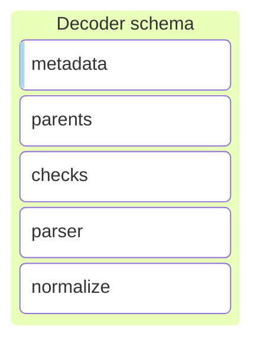
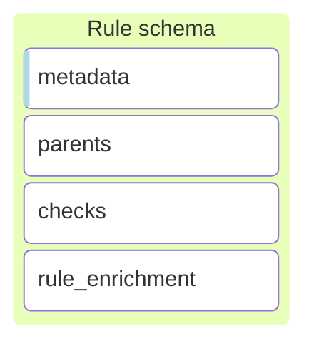
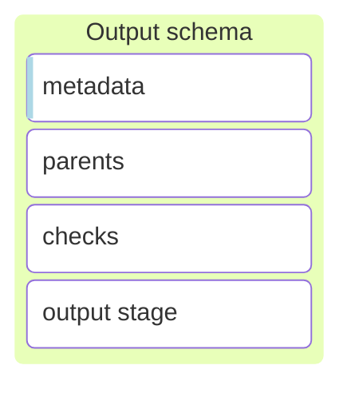

# Engine

## Introduction
The engine is responsible for transforming raw data into standardized schema documents, enriching it with threat intelligence, and forwarding it to designated destinations.

## Data flow
The data flow begins when an event enters the orchestrator and continues until it is processed by the security policy. Below is a high-level flowchart illustrating this process.

<flowchart_placeholder>


To understand how the engine is structured, it's important to identify the key components involved in this process. When a new event arrives, the engine directs it to different policies for processing. The orchestrator manages these policies at runtime.

The orchestrator routes events to a policy and is composed of the following elements:
- Route: Identifies the events that must be processed by a specific Policy.
- Policy: Processes the events.
- Priority: Determines the order in which the orchestrator attempt to route events.

A policy defines the processing pipeline of the events and is composed of:
- Decoders: Normalize and extract information from the events into a common schema.
- Rules: Analyze security threats (primarily IoCs) and enrich the events.
- Outputs: Send normalized and enriched events to the indexer and other defined outputs.

Each policy can be tailored to specific use cases.

<flowchart_placeholder>




### Event
The purpose of the Engine is to convert unstructured or semi-structured logs into normalized and enriched events. The agent transmits logs within a JSON payload, which includes additional metadata such as OS information, log source, and other relevant details. The Engine processes these logs and generates a structured JSON event, incorporating all relevant information in accordance with the defined [schema](#).

Input event example:
```json
{
  "@timestamp": "2025-01-23T17:40:37Z",
  "agent": {
    "groups": [
      "group1",
      "group2"
    ],
    "host": {
      "architecture": "x86_64",
      "hostname": "wazuh-endpoint-linux",
      "ip": [
        "192.168.1.2"
      ],
      "os": {
        "name": "Amazon Linux 2",
        "platform": "Linux"
      }
    },
    "id": "2887e1cf-9bf2-431a-b066-a46860080f56",
    "name": "wazuh-agent-name",
    "type": "endpoint",
    "version": "5.0.0"
  },
  "event": {
    "collector": "file",
    "module": "logcollector",
    "original": "Dec 13 11:35:28 a-mac-with-esc-key GoogleSoftwareUpdateAgent[21412]: 2016-12-13 11:35:28.421 GoogleSoftwareUpdateAgent[21412/0x700007399000] [lvl=2] -[KSUpdateEngine updateAllExceptProduct:] KSUpdateEngine updating all installed products, except:'com.google.Keystone'."
  },
  "log": {
    "file": {
      "path": "/var/log/syslog.log"
    }
  },
}
```

Processed event:
```json
{
  "@timestamp": "2025-01-23T17:40:37Z",
  "agent": {
    "groups": [
      "group1",
      "group2"
    ],
    "host": {
      "architecture": "x86_64",
      "hostname": "wazuh-endpoint-linux",
      "ip": [
        "192.168.1.2"
      ],
      "os": {
        "name": "Amazon Linux 2",
        "platform": "Linux"
      }
    },
    "id": "2887e1cf-9bf2-431a-b066-a46860080f56",
    "name": "wazuh-agent-name",
    "type": "endpoint",
    "version": "5.0.0"
  },
  "event": {
    "collector": "file",
    "created": "2024-11-22T02:00:00Z",
    "kind": "event",
    "module": "logcollector",
    "original": "Dec 13 11:35:28 a-mac-with-esc-key GoogleSoftwareUpdateAgent[21412]: 2016-12-13 11:35:28.421 GoogleSoftwareUpdateAgent[21412/0x700007399000] [lvl=2] -[KSUpdateEngine updateAllExceptProduct:] KSUpdateEngine updating all installed products, except:'com.google.Keystone'.",
    "start": "2025-12-13T11:35:28.000Z"
  },
  "host": {
    "hostname": "a-mac-with-esc-key"
  },
  "log": {
    "file": {
      "path": "/var/log/syslog.log"
    }
  },
  "message": "2016-12-13 11:35:28.421 GoogleSoftwareUpdateAgent[21412/0x700007399000] [lvl=2] -[KSUpdateEngine updateAllExceptProduct:] KSUpdateEngine updating all installed products, except:'com.google.Keystone'.",
  "process": {
    "name": "GoogleSoftwareUpdateAgent",
    "pid": 21412
  },
  "related": {
    "hosts": [
      "a-mac-with-esc-key"
    ]
  },
  "tags": [
    "production-server"
  ],
  "wazuh": {
    "decoders": [
      "syslog"
    ]
  }
}
```

### Policy processing
The policy is the operational graph applied to each event, structured into decoders, rules, and outputs, each related to normalizing, enriching, and delivery respectively.

<flowchart_placeholder>

Wazuh comes with a predefined policy that enables all its components to work properly and it is structured on top of Wazuh-supported log sources.

Each source does have a particular way to format and send logs to the engine. The default policy takes care of that, allowing the users to focus on their integrations and not on the nuances of the logs transports for each source.

<flowchart_placeholder>

### Decoding process
The decoding process converts unstructured data received by the engine into schema-based JSON events.

All events enter the pipeline through the root decoder, which determines the appropriate decoder for processing. Each subsequent decoder processes the event as much as possible before passing it to the next suitable decoder. This continues until no further processing can be performed.

A closer examination of the predefined decoders reveals the following structure:

<flowchart_placeholder>




### Security enrichment process
The analysis process evaluates all event fields to identify security concerns, represented as threat indicators within the common schema. These indicators are later examined in the Wazuh Indexer for threat hunting and security issue detection.

All decoded events pass through the analysis pipeline, where the root rule determines the next appropriate rule for processing. This continues until no further rules can be applied. Unlike decoding, a rule can trigger multiple subsequent rules, each contributing to the event's analysis by adding relevant threat indicators.

A closer look at the predefined rules reveals the following structure:

<flowchart_placeholder>





### Archiving and alerting process
Once an event has completed processing through the decoder and rule pipelines, it enters the output pipeline. Similar to previous stages, the event first passes through the root output, which determines the appropriate output(s) for further processing. Multiple outputs can be selected, enabling flexible storage and distribution policies.

The output process in Wazuh is designed to efficiently distribute alerts through broadcasting, with each output capable of filtering alerts to support customized distribution:




**TODO: Move this graphs**

```mermaid
flowchart TD

 classDef EventBoxClass font-size: 15px,stroke-width:2px, color:#fff, fill:#3f51b5
 classDef TreeBoxClass font-size: 15px,stroke-width:2px,stroke-dasharray: 5 5
 classDef ModuleArchClass fill:#673ab7,stroke-width:2px,fill-opacity:0.5, font-size: 20px
 classDef SubModuleArchClass fill:#673ab7,stroke-width:2px,fill-opacity:0.5, font-size: 15px

%% --------------------------------------
%%           Decoding Stage
%% --------------------------------------

 subgraph decoTree["First layer - Internal decoders"]
    direction TB
    decoInputRoot(" ")
    deco02(" ")
    deco03(" ")
    integrationDecoder("Integration Decoder")
    deco05(" ")
    deco06(" ")
    deco07(" ")

    decoInputRoot --> deco02 & deco03 & integrationDecoder
    deco02 --> deco05
    deco03 --> deco06 & deco07
  end

  integrationDecoder -..-> userDecoRoot:::TreeBoxClass


 subgraph userDecoTree["Integrations & User decoders"]
    direction TB
    userDecoRoot(" ")
    userDeco02(" ")
    userDeco03(" ")
    userDeco04(" ")
    userDeco05(" ")
    userDeco06(" ")
    userDeco07(" ")
    userDeco08(" ")

    userDecoRoot --> userDeco02 & userDeco03 & userDeco04
    userDeco02 --> userDeco05
    userDeco03 --> userDeco06 & userDeco07
    userDeco04 --> userDeco08
  end

%% Stage block
subgraph decoderStage["Decoding Stage"]
    decoTree:::TreeBoxClass
    userDecoTree:::TreeBoxClass
end



%% Output decoder stage
eventNormalized@{shape: doc, label: "Normalized</br>event"}
eventNormalized:::EventBoxClass

%% Pipieline
routeSelector ==> decoInputRoot
userDecoTree ====> eventNormalized

%% --------------------------------------
%%           Rules Stage
%% --------------------------------------

subgraph firstLayerRulesTree["First layer Rules:</br>Geo enrichment</br>General IoCs"]
  direction TB

  firstLayerRules01(" ")
  firstLayerRules02(" ")
  firstLayerRules03(" ")
  firstLayerRules04(" ")
  firstLayerRules05(" ")
  firstLayerRules06(" ")
  firstLayerRules07(" ")
  firstLayerRules08(" ")

  firstLayerRules01 --> firstLayerRules02 & firstLayerRules03 & firstLayerRules04
  firstLayerRules02 --> firstLayerRules05
  firstLayerRules03 --> firstLayerRules06 & firstLayerRules07
  firstLayerRules04 --> firstLayerRules08
 end

 subgraph wazuhRulesTree["Wazuh Rules"]
  direction TB

  wazuhRules01(" ")
  wazuhRules02(" ")
  wazuhRules03(" ")
  wazuhRules04(" ")
  wazuhRules05(" ")
  wazuhRules06(" ")
  wazuhRules07(" ")
  wazuhRules08(" ")

  wazuhRules01 --> wazuhRules02 & wazuhRules03 & wazuhRules04
  wazuhRules02 --> wazuhRules05
  wazuhRules03 --> wazuhRules06 & wazuhRules07
  wazuhRules04 --> wazuhRules08
 end

 subgraph userRulesTree["User rules"]
  direction TB

  userRules01(" ")
  userRules02(" ")
  userRules03(" ")
  userRules04(" ")
  userRules05(" ")
  userRules06(" ")
  userRules07(" ")
  userRules08(" ")

  userRules01 --> userRules02 & userRules03 & userRules04
  userRules02 --> userRules05
  userRules03 --> userRules06 & userRules07
  userRules04 --> userRules08

 end



subgraph ruleStage["Rules Stage"]
 firstLayerRulesTree:::TreeBoxClass
 wazuhRulesTree:::TreeBoxClass
 userRulesTree:::TreeBoxClass
end

%% Output stage rules
securityEvent@{shape: doc, label: "Security</br>event"}
securityEvent:::EventBoxClass

%% Pipieline
eventNormalized==>firstLayerRulesTree==>wazuhRulesTree & userRulesTree-.->securityEvent

%% --------------------------------------
%%           Output Stage
%% --------------------------------------
 subgraph outputTree["Outputs"]
  direction TB

  output01(" ")
  output02(" ")
  output03(" ")
  output04(" ")
  output05(" ")
  output06(" ")
  output07(" ")
  output08(" ")

  output01 --> output02 & output03 & output04
  output02 --> output05
  output03 --> output06 & output07
  output04 --> output08

 end
 outputTree:::TreeBoxClass

%% Pipieline output
 securityEvent ==> outputTree


%% --------------------------------------
%%           Default Policy
%% --------------------------------------
subgraph defaultPolicy["Default policy"]
  decoderStage
  eventNormalized
  ruleStage
  securityEvent
  outputTree
end
defaultPolicy:::SubModuleArchClass


%% --------------------------------------
%%           Engine
%% --------------------------------------
%% Input Decodeing Stage
eventInput@{shape: doc, label: "Incoming event</br>from endpoint"}
eventInput:::EventBoxClass

subgraph engine["engine"]
  defaultPolicy
  routeSelector(["Orchestrator: Router (Route selector)"])
end
engine:::ModuleArchClass

eventInput ===> routeSelector



```










## Schema

## Managing the Engine's processing

### Namespaces

### Assets Catalog

### Policies and Routes

## Assets
In the Wazuh Engine, assets represent the fundamental components of security policies and are the smallest unit within such a policy.

Each asset is organized into various stages that dictate operational procedures when processing an event. These stages provide a structured and semantically meaningful sequence of operations, enhancing the engine's capability to execute these operations efficiently based on predefined execution strategies.

Do not confuse stages with attributes, which are configuration details and metadata about the asset.

<workflow_placeholder>

### Attributes
Attributes are configuration details. Although the order of definition does not matter, we follow the convention of defining them in the order of name, metadata, and parents.
- **Name**: Identifies the asset and follows the pattern <asset_type>/<name>/<version>.
- **Metadata**: Contains all information about the asset. The exact subfields depend on the asset type.
- **Parents**: When applicable to the asset, this defines the order in the asset graph. The exact child selection depends on the specific asset graph type.
- **Definitions**: Defines symbols that will be replaced throughout the document in its occurrences.

### Stages
The stages define the operation chain and flow the asset performs on events. Each stage is executed in the order of definition:

<workflow_placeholder>

When a stage is executed, it can either fail or succeed, depending on the logic of the stage and the operations performed. Each stage is sequentially executed only if the previous stage succeeds.

Stages:
- **Check/Allow**: Allows conditional operations to be made on the event.
- **Parse**: Parses fields on the event, acting both as a condition and normalization.
- **Map**: Allows mapping and transformation operations on the event.
- **Normalize**: Defines blocks with a combination of check, parse, and map stages.
- **Output**: Allows operations to communicate outside the Engine, typically used to send events outward.

### Asset types
The type of asset is an allowed combination of certain stages. The following table outlines the stages available for each type of asset:

| Asset Type | Allowed Stages |
|-|-|
|Decoders|check, parse, map, normalize|
|Rules|check, map, normalize|
|Outputs|check, output|
|Filters|allow|

Each asset has a name and metadata, with custom metadata suited to its specific needs. Additionally, each asset can have parents.

### Operations
Operations are the fundamental units within the operation graph. Each operation can succeed or fail, forming the basis for defining the graph by combining operations based on their execution results.

Operations are always defined as:
```yaml
target_field: operation
```

Where the operation can be:
- **Literal Value**: A direct check or map operation depending on the stage it is defined. This can be any of the YAML native values (string, number, boolean, etc.).
- **Reference**: Denoted by $field_name, it performs a direct check or map operation using the referenced value.
- **Helper**: Denoted by helper_name(args), it performs a check or map operation depending on the called helper.

When building an asset, the process can fail if there is any operation that contains a:
- **Syntax Error**: Errors in the target_field or operation syntax.
- **Schema Validation Failure**: Errors such as mapping a boolean into a keyword field, which violates the schema validation rules.
- **Semantic Error**: Incorrect usage, such as using a conditional helper in a map stage.
These errors will be notified when trying to upload the asset to the catalog.

### Execution Graph Summary
With a basic understanding of a policy and its components, we can look at the global picture of how the operation graph is defined.
Within the policy, we have subgraphs, each corresponding to an asset type:
- Decoders
- Rules
- Outputs

<workflow_placeholder>

Every event traverses each subgraph independently, forming a chain of subgraphs.

Each graph is composed of assets defined by parent relationships. An event moves down in the graph based on the asset's logical output. If an asset operation succeeds, the event is sent to its child assets.

The traversal of each subgraph follows these rules:
- **Decoders**: If the current decoder asset succeeds, the event is sent to its first child. If it fails, the event is sent to the next sibling of the parent decoder (logical OR between children).
- **Rules**: If the current rule asset succeeds, the event is broadcast to all its child assets.
- **Outputs**: Events are broadcast to all defined output assets.

An asset is considered successful if it accepts the event, meaning all conditional stages have succeeded, regardless of the outcome of transformational stages. This ensures that events are processed through the appropriate path based on successful acceptance checks.

A stage succeeds if the logical combination of its operations succeeds. The exact combination logic is determined by the stage itself. This ensures that each stage can apply its own logic to decide whether it has successfully processed an event.

<workflow_placeholder>

### Helper functions
Implement all the high level operations available to the user when developing the ruleset. Each function defines its signature, its mode of operation and its error management. Users cannot change the behavior of a helper function, and cannot combine two functions into a single expression.

There are two intrinsic operations which do not require additional syntax:
- Comparison of values or references inside a check stage.
- Value or reference assignment inside a map stage.

All other operations are accessed through the helper functions.

The syntax for calling a helper function is `helper_name(args...)`. They can be used in both check operations and map operations. Helper functions are classified into two categories:
- **Conditionals**: Used in check operations to test complex conditions.
- **Transformational**: Used in map operations to transform data.

Check the helper standard library for a complete list of available helper functions.

#### Condition Helpers
When using conditional helpers, the syntax is:
```yaml
target_field: condition_helper(args)
```

The helper will always test a condition on *target_field*. If the condition passes, the operation succeeds; otherwise, it fails.

#### Transform Helpers
When using transformational helpers, the syntax is:
```yaml
target_field: transform_helper(args)
```

The helper will transform the *target_field* if the operation succeeds. If the operation fails, the *target_field* remains unchanged.

A transformational helper may fail due to implicit conditions, such as expecting a specific type for the target field, missing a reference passed as an argument, etc.

***It is important to understand that every operation can succeed or fail, and this is the foundation for defining the operation graph.***

#### Parsing rules
When using a helper function in a map or check operation:
```yaml
target.field: helper_name(args...)
```

Each argument is tried to be parsed in the following order:
- **Quoted argument**: `'value'` if it starts with a single quote it parses until the closing single quote, allowed scaped characters are: `\` and `'`.
- **Reference**: `$reference` if it starts with the dollar symbol a reference is parsed, which is any alphanumeric plus the extended symbols `#`, `_`, `@`, and `-` separated by dots.
- **JSON value**: parses a JSON string, any JSON string with JSON escaping rules.
- **Raw string**: if the other parsers fail a string value will be assigned, here we allow the escaping of the symbols: `$`, `'`, `,`, `)`, `\` and whitespace.

Invalid escape sequences will always fail.

When parsing a helper function inside a logical check expression the same rules apply adding that at least one argument is expected for the helper, specifying the target field:
```yaml
check: helper_name($target.field, args...)
```

Added we can specify comparison helpers as operators:
```yaml
check: $target.field <op> <value>
```

Where value is parsed as a single helper argument following the same escaping rules and order.

Where op is any of the following:
- `==`
- `!=`
- `<`
- `<=`
- `>`
- `>=`

When using any operator that is not the equality operator only string or integer values are allowed.

When using the default map or filter functions for string operations, values are parsed according to standard YAML (or JSON) types. If a value is a string and begins with the reference symbol `$`, it is treated as a potential reference. If the reference is invalid the operation building fails.
```yaml
check:
  - target.field: <yaml_type>|<$ref>
map:
  - target.field: <yaml_type>|<$ref>
```

### Definitions

### Variables

### Log Parsing

### Key Value Databases

### Dates and Timestamps

### Geolocation

### Decoders

### Rules

### Outputs

### Filters

## Orchestrator

## Server

## Metrics

## Builder

## Stages

### Check/Allow

### Parse

### Map

### Normalize/Enrichment

### Output

## Helper functions

Explanation of how herlper work, format, types, etc.

- link to new document inside this module with all helpers functions

## Debugging

### Logs

### Tester

### Traces
