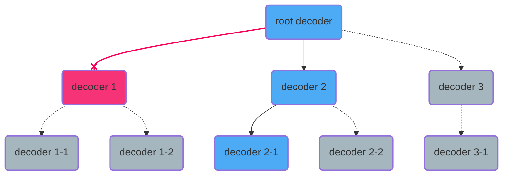
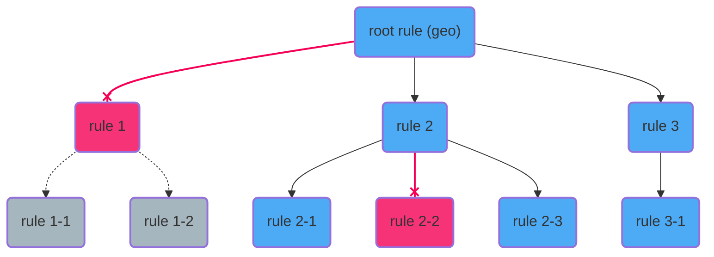

# Engine

## Introduction
The engine is responsible for transforming raw data into standardized schema documents, enriching it with threat intelligence, and forwarding it to designated destinations.

## Data flow
The data flow begins when an event enters the orchestrator and continues until it is processed by the security policy. Below is a high-level flowchart illustrating this process.

<flowchart_placeholder>


To understand how the engine is structured, it's important to identify the key components involved in this process. When a new event arrives, the engine directs it to different policies for processing. The orchestrator manages these policies at runtime.

The orchestrator routes events to a policy and is composed of the following elements:
- Route: Identifies the events that must be processed by a specific Policy.
- Policy: Processes the events.
- Priority: Determines the order in which the orchestrator attempt to route events.

A policy defines the processing pipeline of the events and is composed of:
- Decoders: Normalize and extract information from the events into a common schema.
- Rules: Analyze security threats (primarily IoCs) and enrich the events.
- Outputs: Send normalized and enriched events to the indexer and other defined outputs.

Each policy can be tailored to specific use cases.

<flowchart_placeholder>


### Event
The purpose of the Engine is to convert unstructured or semi-structured logs into normalized and enriched events. The agent transmits logs within a JSON payload, which includes additional metadata such as OS information, log source, and other relevant details. The Engine processes these logs and generates a structured JSON event, incorporating all relevant information in accordance with the defined [schema](#).

Input event example:
```json
{
  "@timestamp": "2025-01-23T17:40:37Z",
  "agent": {
    "groups": [
      "group1",
      "group2"
    ],
    "host": {
      "architecture": "x86_64",
      "hostname": "wazuh-endpoint-linux",
      "ip": [
        "192.168.1.2"
      ],
      "os": {
        "name": "Amazon Linux 2",
        "platform": "Linux"
      }
    },
    "id": "2887e1cf-9bf2-431a-b066-a46860080f56",
    "name": "wazuh-agent-name",
    "type": "endpoint",
    "version": "5.0.0"
  },
  "event": {
    "collector": "file",
    "module": "logcollector",
    "original": "Dec 13 11:35:28 a-mac-with-esc-key GoogleSoftwareUpdateAgent[21412]: 2016-12-13 11:35:28.421 GoogleSoftwareUpdateAgent[21412/0x700007399000] [lvl=2] -[KSUpdateEngine updateAllExceptProduct:] KSUpdateEngine updating all installed products, except:'com.google.Keystone'."
  },
  "log": {
    "file": {
      "path": "/var/log/syslog.log"
    }
  },
}
```

Processed event:
```json
{
  "@timestamp": "2025-01-23T17:40:37Z",
  "agent": {
    "groups": [
      "group1",
      "group2"
    ],
    "host": {
      "architecture": "x86_64",
      "hostname": "wazuh-endpoint-linux",
      "ip": [
        "192.168.1.2"
      ],
      "os": {
        "name": "Amazon Linux 2",
        "platform": "Linux"
      }
    },
    "id": "2887e1cf-9bf2-431a-b066-a46860080f56",
    "name": "wazuh-agent-name",
    "type": "endpoint",
    "version": "5.0.0"
  },
  "event": {
    "collector": "file",
    "created": "2024-11-22T02:00:00Z",
    "kind": "event",
    "module": "logcollector",
    "original": "Dec 13 11:35:28 a-mac-with-esc-key GoogleSoftwareUpdateAgent[21412]: 2016-12-13 11:35:28.421 GoogleSoftwareUpdateAgent[21412/0x700007399000] [lvl=2] -[KSUpdateEngine updateAllExceptProduct:] KSUpdateEngine updating all installed products, except:'com.google.Keystone'.",
    "start": "2025-12-13T11:35:28.000Z"
  },
  "host": {
    "hostname": "a-mac-with-esc-key"
  },
  "log": {
    "file": {
      "path": "/var/log/syslog.log"
    }
  },
  "message": "2016-12-13 11:35:28.421 GoogleSoftwareUpdateAgent[21412/0x700007399000] [lvl=2] -[KSUpdateEngine updateAllExceptProduct:] KSUpdateEngine updating all installed products, except:'com.google.Keystone'.",
  "process": {
    "name": "GoogleSoftwareUpdateAgent",
    "pid": 21412
  },
  "related": {
    "hosts": [
      "a-mac-with-esc-key"
    ]
  },
  "tags": [
    "production-server"
  ],
  "wazuh": {
    "decoders": [
      "syslog"
    ]
  }
}
```

### Policy processing
The policy is the operational graph applied to each event, structured into decoders, rules, and outputs, each related to normalizing, enriching, and delivery respectively.

<flowchart_placeholder>

Wazuh comes with a predefined policy that enables all its components to work properly and it is structured on top of Wazuh-supported log sources.

Each source does have a particular way to format and send logs to the engine. The default policy takes care of that, allowing the users to focus on their integrations and not on the nuances of the logs transports for each source.

<flowchart_placeholder>

### Decoding process
The decoding process converts unstructured data received by the engine into schema-based JSON events.

All events enter the pipeline through the root decoder, which determines the appropriate decoder for processing. Each subsequent decoder processes the event as much as possible before passing it to the next suitable decoder. This continues until no further processing can be performed.

A closer examination of the predefined decoders reveals the following structure:

<flowchart_placeholder>



### Security enrichment process
The analysis process evaluates all event fields to identify security concerns, represented as threat indicators within the common schema. These indicators are later examined in the Wazuh Indexer for threat hunting and security issue detection.

All decoded events pass through the analysis pipeline, where the root rule determines the next appropriate rule for processing. This continues until no further rules can be applied. Unlike decoding, a rule can trigger multiple subsequent rules, each contributing to the event's analysis by adding relevant threat indicators.

A closer look at the predefined rules reveals the following structure:

<flowchart_placeholder>


### Archiving and alerting process
Once an event has completed processing through the decoder and rule pipelines, it enters the output pipeline. Similar to previous stages, the event first passes through the root output, which determines the appropriate output(s) for further processing. Multiple outputs can be selected, enabling flexible storage and distribution policies.

The output process in Wazuh is designed to efficiently distribute alerts through broadcasting, with each output capable of filtering alerts to support customized distribution:


### Asset processing
- Adding an asset architecture diagram, parts and asset chain op execution tree
- basic explanation of assets in general


#### Decoder Asset
Some specialization of the asset as decoder

#### Filter Asset

Some specialization of the asset as filter, like for example the `filter`  cannot parser or map fields.

#### Rules Asset
Some specialization of the asset as rules, i.e. Cannot parser o map outside of schema.

#### Outputs Asset

## How it work

### Definitions

### Parsers

Explanation of how parsers work

- link to new document inside this module with all parsers

### Helper funntions

Explanation of how herlper work, format, types, etc.

- link to new document inside this module with all helpers functions

### Variables

I think we should eliminate this concept

### Schemas

what is each one used for and what is the format

#### Wazuh Schema + Custom Schema

#### Logpar override Schema

#### Others schemas


## Catalog

intro + api catalog link

### Nampeaces

### Integrations


## Event processing

Protocol, log, etc.


## Metrics

How metrics are generated and how they are used

I think we should leave this short until future definitions.

## Queues

I think we should leave this empty until future definitions.

## Time Zones

## GEOIP

## KVDB
I think we should leave this empty until future definitions.


## Tester

How testing work in orchestrator

### Sessions

### Traces and logs
