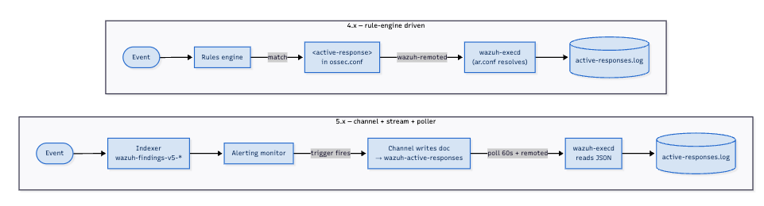
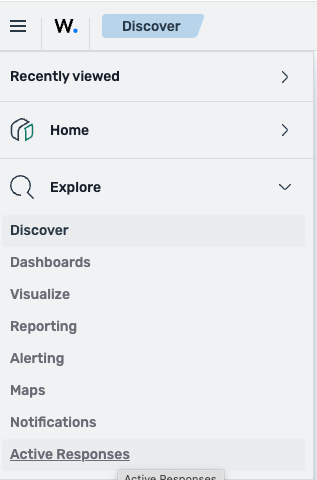
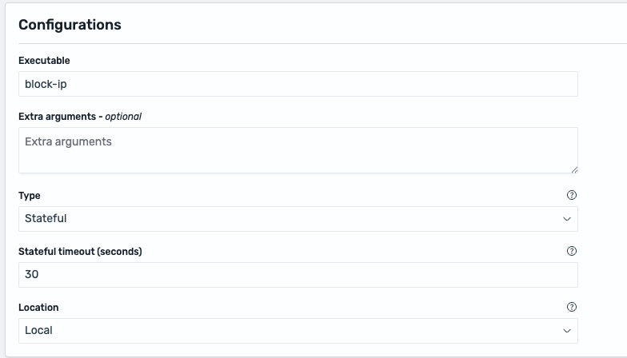
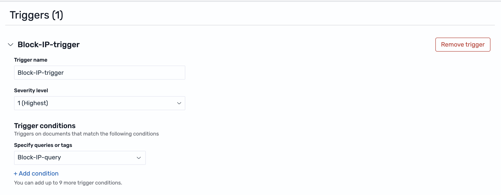
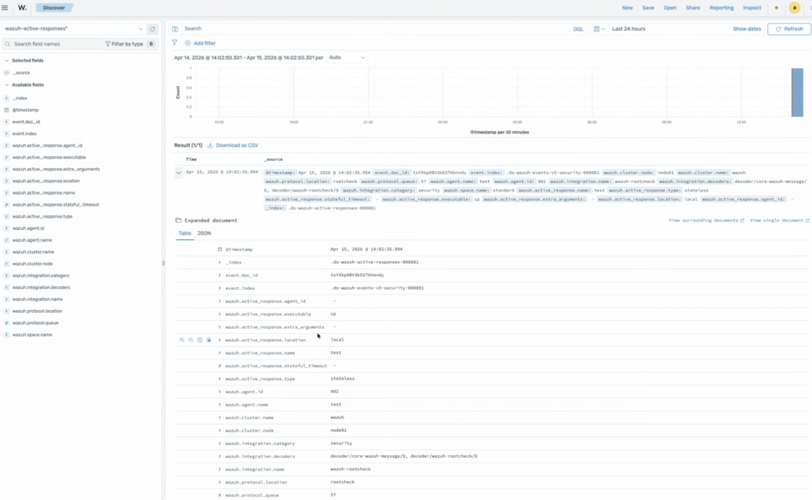

# Active Response migration guide (4.x to 5.x)

Active Response (AR) is rebuilt in 5.x. The 4.x XML in `ossec.conf`, the agent-side `ar.conf`, rule-based matching, and the `PUT /active-response` API are all removed. 5.x replaces them with channels managed in the dashboard, an Alerting monitor that triggers them, a `wazuh-active-responses` data stream that records executions, and a manager-side poller that dispatches to agents over `wazuh-manager-remoted`.

> **Manual migration only.** No converter, importer, or compatibility shim is provided. Every 4.x AR must be recreated as a 5.x active response; every custom script must be rewritten for the new JSON contract.

## Breaking changes at a glance

- `ossec.conf` `<command>` / `<active-response>` blocks are no longer parsed. `ar.conf` is removed from the agent.
- AR is created under **Explore → Active Responses**. Each channel carries `name`, `description`, `enabled`, `executable`, `extra_arguments`, `type` (`stateful` / `stateless`), `stateful_timeout` (default `180s`), `location` (`local` / `defined-agent` / `all`), `agent_id`.
- Matching (`<rules_id>` / `<level>` / `<rules_group>`) moves to the query of an Alerting monitor of type **Active Response**.
- `PUT /active-response` is removed with no replacement. Dispatch is document-driven: a monitor action writes into `wazuh-active-responses`; the manager polls every 60 s (batches of 100) and forwards via `wazuh-manager-remoted`. Pre-5.0 agents are filtered out.
- Executions land as structured documents in the `wazuh-active-responses` data stream (backing data stream `.ds-wazuh-active-responses`, 3-day ISM retention via `stream-active-responses-policy`).
- The JSON delivered to scripts changed shape: `command` ∈ `enable` / `disable` (was `add` / `delete`); alert fields use flat WCS paths (`source.ip`, `user.name`, …); AR metadata sits under `wazuh.active_response.*`.
- Default firewall scripts (`firewall-drop`, `firewalld-drop`, `pf`, `npf`, `ipfw`, `netsh`, `route-null`, `host-deny`) are folded into a single `block-ip` executable. `restart-wazuh` moves to the Control Module. `wazuh-slack` is removed.
- `<location>server</location>`, `<repeated_offenders>`, `<timeout_allowed>` have no direct equivalent.
- `<disabled>` is replaced by the channel `enabled` field plus a **Mute / Unmute** runtime toggle.



## Compatibility matrix

| Wazuh Version | AR configuration source | Dashboard Platform        | Manager / Indexer |
| ------------- | ----------------------- | ------------------------- | ----------------- |
| 4.x           | `ossec.conf` XML blocks | OpenSearch Dashboards 2.x | Wazuh 4.x         |
| 5.0.x         | Dashboard entity (UI)   | OpenSearch Dashboards 3.x | Wazuh 5.x         |

Mixed-version fleets may execute inconsistently — coordinate manager and agent upgrades.

---

## Pre-migration

Back up the 4.x AR state and inventory each entry before upgrading:

```bash
AR_BACKUP_DIR="/root/backup-ar-$(date +%Y%m%d)"
sudo mkdir -p "$AR_BACKUP_DIR"
sudo cp -a /var/ossec/etc/ossec.conf "$AR_BACKUP_DIR/"
sudo cp -a /var/ossec/active-response/bin/ "$AR_BACKUP_DIR/"
```

For each `<command>` and `<active-response>` block in `/var/ossec/etc/ossec.conf`, record the values you will need to recreate the AR as a 5.x active response:

- `<command>`: `<name>`, `<executable>`, `<extra_args>`, `<timeout_allowed>`.
- `<active-response>`: the linked command, `<location>`, `<agent_id>`, the matching condition (`<rules_id>` / `<rules_group>` / `<level>`), `<timeout>`, `<repeated_offenders>`, `<disabled>`.

Historical AR records are not migrated to the 5.x `wazuh-active-responses` data stream. In 4.x they live in two places:

- Alerts in your `wazuh-alerts-*` indices, filtered by `rule.groups: active_response`.
- Lines in `/var/ossec/logs/active-responses.log` on each agent.

If you need long-term records, export them from your 4.x indexer using your standard data-export procedure before upgrading.

---

## Field mapping (4.x XML → 5.x active response)

| 4.x XML                                                     | 5.x equivalent                      | Notes                                                                                               |
| ----------------------------------------------------------- | ----------------------------------- | --------------------------------------------------------------------------------------------------- |
| `<command><name>`                                           | _(no direct field)_                 | The channel replaces the named command. Pick a descriptive **Name**.                                |
| `<command><executable>`                                     | **Executable**                      | Discovery path preserved at `/var/ossec/active-response/bin/<executable>` on Unix agents.           |
| `<command><extra_args>`                                     | **Extra arguments**                 | Free-form string passed to the executable.                                                          |
| `<command><timeout_allowed>`                                | _(no replacement)_                  | Reversal is driven by `type = Stateful` + **Stateful timeout**.                                     |
| `<active-response><location>` = `local`                     | **Location** = `Local`              | Default.                                                                                            |
| `<active-response><location>` = `defined-agent`             | **Location** = `Defined agent`      | Reveals **Agent ID**.                                                                               |
| `<active-response><location>` = `all`                       | **Location** = `All`                | Pushes the action to every connected agent.                                                         |
| `<active-response><location>` = `server`                    | _(no replacement)_                  | Manager-side execution does not exist in 5.x. See [`Location = server`](#location--server-from-4x). |
| `<active-response><agent_id>`                               | **Agent ID**                        | Only when `Location = Defined agent`.                                                               |
| `<active-response><rules_id>` / `<level>` / `<rules_group>` | Alerting monitor query              | Matching moves to the monitor — see [Triggering model](#triggering-model).                          |
| `<active-response><timeout>`                                | **Stateful timeout**                | Same unit (seconds). Forces `Type = Stateful`. Default `180s`.                                      |
| `<active-response><repeated_offenders>`                     | _(no replacement)_                  | See [`<repeated_offenders>` is gone](#repeated_offenders-is-gone).                                  |
| `<active-response><disabled>`                               | `enabled` field + **Mute / Unmute** | `enabled` is the persistent flag; **Mute / Unmute** is the runtime toggle.                          |
| `ar.conf`                                                   | _(deleted)_                         | `wazuh-execd` reads the JSON message directly.                                                      |

## Triggering model

| Aspect              | 4.x                                                               | 5.x                                                                            |
| ------------------- | ----------------------------------------------------------------- | ------------------------------------------------------------------------------ |
| Where matching runs | Manager rules engine                                              | Alerting monitor (indexer / dashboard plane)                                   |
| How to express it   | `<rules_id>` / `<level>` / `<rules_group>` in `<active-response>` | Monitor of type **Active Response** with a query against `wazuh-findings-v5-*` |
| What invokes the AR | The alert fires the AR directly                                   | The trigger's **Add active response** action invokes the channel               |
| Visibility          | Manager logs                                                      | Alerting evaluation + execution record in `wazuh-active-responses*`            |

Each 4.x `<active-response>` becomes two artifacts in 5.x: the AR channel (the **what**) and an Alerting monitor (the **when**). The monitor query encodes the matching condition that used to live in `<rules_id>` / `<level>` / `<rules_group>`; the monitor's trigger then carries an **Add active response** action pointing at the channel. End-to-end wiring is covered in [Migration steps](#migration-steps), steps 4 and 5 below.

> The monitor type **must** be `Active Response`. No other type exposes the **Add active response** action.

**Writing the monitor query.** The 4.x numeric rule ID does not carry over. Detection in 5.x is indexed under `wazuh-findings-v5-*` indices (split by category, e.g. `wazuh-findings-v5-system-activity*`, `wazuh-findings-v5-security*`, etc...), where a finding's rule identity is **`wazuh.rule.title`** (a human-readable string) and **`wazuh.rule.id`** (a UUID — not a number). So the query is **not** `wazuh.rule.id: 5763`. Pick the findings index that carries your events and match on:

- **`wazuh.rule.title`** — recommended for monitors, e.g. `wazuh.rule.title is "Docker secret removed"`. Readable, but note that titles can change between ruleset versions.
- **`wazuh.rule.id`** — the stable UUID, but it is mapped as text; an exact-match (`is`) operator may fail to match the dashed UUID. Prefer `wazuh.rule.title` unless you confirm `wazuh.rule.id.keyword` works in your build.

The 4.x numeric IDs (`5763`, `5760`, …) have no 1:1 equivalent — locate the 5.x rule that detects the same condition by its `wazuh.rule.title` in `wazuh-findings-v5-*` (e.g. with `GET wazuh-findings-v5-*/_search`).

## Audit and visibility

| Surface               | 4.x                                                                                                       | 5.x                                                                                                                                                        |
| --------------------- | --------------------------------------------------------------------------------------------------------- | ---------------------------------------------------------------------------------------------------------------------------------------------------------- |
| Executions land in    | `/var/ossec/logs/active-responses.log` + events from the `active_response` rule group in `wazuh-alerts-*` | `wazuh-active-responses` alias (`.wazuh-active-responses-v5` backing data stream). Agent log unchanged.                                                    |
| Structured fields     | Free text                                                                                                 | `wazuh.active_response.{name,type,executable,extra_arguments,stateful_timeout,location,agent_id}` + `event.doc_id` / `event.index`.                        |
| `@timestamp`          | Event time                                                                                                | Indexing time. For event-time correlation use the linked alert via `event.doc_id`.                                                                         |
| Default retention     | Alerts ILM policy                                                                                         | 3 days (`stream-active-responses-policy`, priority 100). Adjust the policy for longer retention.                                                           |
| Pivot to source alert | Manual                                                                                                    | Each execution record carries `event.doc_id` + `event.index`; switch Discover to that index and filter `_id:<event.doc_id>` in the search bar to open the triggering alert. |

## API change

`PUT /active-response` is removed with no replacement endpoint. Integrations that previously fired AR via the API must now emit an alert document and let an Alerting Active Response monitor pick it up. The manager keeps a bookmark at `/var/wazuh-manager/queue/cluster/ar_bookmark.json`.

---

## JSON stdin contract

> Custom AR scripts from 4.x will break on 5.x without code changes.

The discovery path is unchanged on Unix agents (`/var/ossec/active-response/bin/<executable>`). What changed is the JSON shape and the command vocabulary.

**4.x:**

```json
{
  "version": 1,
  "origin": { "name": "node01", "module": "wazuh-analysisd" },
  "command": "add",
  "parameters": {
    "extra_args": [],
    "alert": {
      "rule": { "id": "5763", "level": 10 },
      "data": { "srcip": "192.168.1.100", "dstuser": "root" }
    },
    "program": "/var/ossec/active-response/bin/firewall-drop"
  }
}
```

**5.x:**

```json
{
  "wazuh": {
    "active_response": {
      "name": "block-ip",
      "executable": "block-ip",
      "location": "defined-agent",
      "agent_id": "001",
      "type": "stateless"
    },
    "agent": { "id": "001", "name": "test-agent" }
  },
  "source": { "ip": "192.168.1.100" },
  "user": { "name": "username" },
  "command": "enable"
}
```

Changes:

- `command` ∈ `enable` / `disable`. `disable` messages additionally carry `stateful_timeout` at the root.
- Alert fields are flat WCS 9.1 paths (`source.ip`, `source.port`, `user.name`). `parameters.alert.data.*` is gone.
- AR metadata under `wazuh.active_response.*`. `wazuh-execd` reads `.executable`, `.type`, `.stateful_timeout` before invoking the script.

### Migration recipe

For each custom script:

1. Re-map field reads to WCS paths (`parameters.alert.data.srcip` → `source.ip`, etc.).
2. Replace the inbound command handling: the 4.x `case "$COMMAND" in add) ... delete)` becomes `enable) ... disable)`. The manager dispatches exactly one of those values — `add` / `delete` in 4.x, `enable` / `disable` in 5.x. `continue` appears only as the `check_keys` deduplication reply: `wazuh-execd` answers `continue` or `abort` to a script that sends a `check_keys` control message, and this protocol is unchanged from 4.x, so scripts that issue `check_keys` keep comparing the response against `"continue"` exactly as before.
3. Read `<extra_args>` values from `wazuh.active_response.extra_arguments` instead of positional shell arguments (`$1`, `$2`, …) — in 5.x the manager serializes them into the JSON payload, not into argv. Other AR metadata in the same object is also accessible to the script when needed: `.wazuh.active_response.{name,executable,type,stateful_timeout,location,agent_id}`. See the rewritten script in [Example 2 — Step 3](#example-2--custom-ssh-blocker-with-extra_arguments-rule-5760) for the `extra_arguments` accessor in use.
4. Capture stdin **inside the script itself** — `read -r INPUT_JSON; echo "$INPUT_JSON" > /tmp/ar-input.json` — on a real dispatch to confirm the shape. **Do not** wrap as `tee /tmp/ar-input.json | impl.sh`: `wazuh-execd` keeps stdin open after sending the payload (it expects the script to optionally respond with a `check_keys` control message and read back the `continue`/`abort` answer), so `tee` never receives EOF and the dispatch hangs forever. See [Custom script hangs and AR queue stalls](#custom-script-hangs-and-ar-queue-stalls).

### Example diff

**4.x body:**

```bash
#!/bin/bash

# Log file
LOGFILE="/var/ossec/logs/active-responses.log"

logmsg(){
  local msg="$*"
  echo "$(date '+%Y-%m-%d %H:%M:%S') - custom-ar-sh - $msg" >> "$LOGFILE"
}

# Read AR input (wazuh-execd writes a single line terminated by \n)
read -r INPUT_JSON

logmsg "$INPUT_JSON"

# Get command
command=$(echo "$INPUT_JSON" | jq -r '.command')

# Get srcip from the alert
ar_srcip=$(echo "$INPUT_JSON" | jq -r '.parameters.alert.data.srcip')

logmsg "Command: $command"

if [ "$command" == "add" ]; then
  # Send control message
  printf '{"version":1,"origin":{"name":"custom-ar-sh","module":"active-response"},"command":"check_keys", "parameters":{"keys":[]}}\n'
  read -r RESPONSE
  response_command=$(echo "$RESPONSE" | jq -r '.command')
  if [ "${response_command}" != "continue" ]; then
    logmsg "Abort"
    exit 0;
  fi

  # Execute the main AR command
  logmsg "Execute AR"
elif [ "$command" == "delete" ]; then
  # Execute the revert/undone command
  logmsg "Revert AR"
else
  logmsg "Invalid command: $command"
fi

exit 0
```

**5.x body:**

```bash
#!/bin/bash

# Log file
LOGFILE="/var/ossec/logs/active-responses.log"

logmsg(){
  local msg="$*"
  echo "$(date '+%Y-%m-%d %H:%M:%S') - custom-ar-sh - $msg" >> "$LOGFILE"
}

# Read AR input (wazuh-execd writes a single line terminated by \n)
read -r INPUT_JSON

logmsg "$INPUT_JSON"

# Get command
command=$(echo "$INPUT_JSON" | jq -r '.command')

# Get srcip from the alert
ar_srcip=$(echo "$INPUT_JSON" | jq -r '.source.ip') # 5.x MIGRATION: Changed from .parameters.alert.data.srcip to WCS path .source.ip

logmsg "Command: $command"

if [ "$command" == "enable" ]; then # 5.x MIGRATION: Changed from add to enable
  # Send control message
  printf '{"version":1,"origin":{"name":"custom-ar-sh","module":"active-response"},"command":"check_keys", "parameters":{"keys":[]}}\n'
  read -r RESPONSE
  response_command=$(echo "$RESPONSE" | jq -r '.command')
  if [ "${response_command}" != "continue" ]; then
    logmsg "Abort"
    exit 0;
  fi

  # Execute the main AR command
  logmsg "Execute AR"
elif [ "$command" == "disable" ]; then # 5.x MIGRATION: Changed from delete to disable
  # Execute the revert/undone command
  logmsg "Revert AR"
else
  logmsg "Invalid command: $command"
fi

exit 0
```

Ownership and permissions are unchanged:

```bash
sudo chown root:wazuh /var/ossec/active-response/bin/<script>
sudo chmod 750 /var/ossec/active-response/bin/<script>
```

The 4.x manager `<command>` / `<active-response>` registration is replaced by a channel created in **Explore → Active Responses** and an Alerting monitor whose query matches the rule by `wazuh.rule.title` over `wazuh-findings-v5-*` (the 4.x numeric `rule.id` is gone — see [Triggering model](#triggering-model)) and whose trigger's **Add active response** action points at the channel. `<repeated_offenders>` has no direct replacement — see [`<repeated_offenders>` is gone](#repeated_offenders-is-gone).

---

## Default scripts

| 4.x script                                                                                   | 5.x replacement                                        | Notes                                                               |
| -------------------------------------------------------------------------------------------- | ------------------------------------------------------ | ------------------------------------------------------------------- |
| `firewall-drop`, `default-firewall-drop`, `firewalld-drop`, `pf`, `npf`, `ipfw`, `netsh.exe` | `block-ip`                                             | One cross-platform executable; backend selection is internal.       |
| `route-null`, `host-deny`                                                                    | `block-ip` (route / hosts.deny fallbacks)              | Used when no native firewall is available.                          |
| `ip-customblock`                                                                             | `block-ip` (or a custom script using the new contract) | Folded.                                                             |
| `disable-account`                                                                            | `disable-account`                                      | Retained. Rewrite only if wrapped by a custom JSON-parsing script.  |
| `restart-wazuh`                                                                              | _(removed from AR)_                                    | Agent restart belongs to the Control Module.                        |
| `wazuh-slack`                                                                                | _(removed)_                                            | Use **Explore → Notifications → Channels** for Slack notifications. |

For every migrated AR that referenced a consolidated script, set **Executable** to `block-ip` (or `disable-account`).

---

## Migration steps

1. **Finish the stack upgrade** through dashboard startup. AR can only be validated once the manager and indexer are on 5.x.
2. **Rewrite custom scripts** following the [recipe above](#migration-recipe). Re-apply `root:wazuh` ownership and `750` permissions.
3. **Recreate each 4.x AR** under **Explore → Active Responses → Create active response**, using the [field mapping table](#field-mapping-4x-xml--5x-active-response) and the [Default scripts](#default-scripts) translation.

   

   The creation form replaces the 4.x `<command>` / `<active-response>` XML blocks. Each row in the field-mapping table corresponds directly to a field in this form; conditional fields (**Stateful timeout**, **Agent ID**) only appear once **Type** or **Location** select the matching value.

   

4. **Wire each channel to a monitor** of type **Active Response**, encoding the 4.x match condition as the monitor query — by `wazuh.rule.title` over `wazuh-findings-v5-*` (the 4.x numeric `rule.id` has no 5.x equivalent; see [Triggering model](#triggering-model)). The monitor type **must** be `Active Response` — no other type exposes the **Add active response** action.

   

   In the trigger, the **Actions** section now exposes two separate buttons — **Add notification** (generic notifications) and **Add active response** (AR channels). Pick **Add active response** and select the channel created in the previous step.

   

5. **Restart and smoke-test:**

   ```bash
   sudo systemctl restart wazuh-manager
   ```

   Generate the triggering event and open **Discover** with the `wazuh-active-responses*` index pattern. Within ~60 s an execution document appears; expand it to confirm `wazuh.active_response.{name,type,executable,location}` match the channel, and that `event.doc_id` / `event.index` point back to the source alert. For stateful AR, wait `stateful_timeout` seconds and verify the revert (a second log line in `/var/ossec/logs/active-responses.log` on the agent, plus restored connectivity for `block-ip`).

   

---

## Worked examples

Two end-to-end migrations that make every section above concrete.

### Example 1 — Default `firewall-drop` on SSH brute-force (rule 5763)

The most common migration: a single rule, a single agent, stateful reversal, using only default scripts. Exercises [field mapping](#field-mapping-4x-xml--5x-active-response), the [`block-ip` consolidation](#default-scripts), and monitor wiring.

**Starting point (4.x `/var/ossec/etc/ossec.conf`):**

```xml
<command>
  <name>firewall-drop-ar</name>
  <executable>firewall-drop</executable>
  <timeout_allowed>yes</timeout_allowed>
</command>

<active-response>
  <disabled>no</disabled>
  <command>firewall-drop-ar</command>
  <location>local</location>
  <rules_id>5763</rules_id>
  <timeout>60</timeout>
</active-response>
```

What this does in 4.x: when rule `5763` (composite SSH brute force — fires after several authentication failures in a short window) triggers, the manager dispatches `firewall-drop` to the originating agent, which adds an `iptables DROP` rule for the offending IP and reverses it after 60 seconds.

**Walking each [migration step](#migration-steps) for this AR:**

| Step                       | Action for this example                                                                                                                                                                                                                                                                                                                                               |
| -------------------------- | --------------------------------------------------------------------------------------------------------------------------------------------------------------------------------------------------------------------------------------------------------------------------------------------------------------------------------------------------------------------- |
| 2 — Rewrite custom scripts | Not applicable — uses the default script.                                                                                                                                                                                                                                                                                                                             |
| 3 — Recreate as active response    | Use the field values in the table below.                                                                                                                                                                                                                                                                                                                              |
| 4 — Wire to monitor        | Create an `Active Response` monitor over `wazuh-findings-v5-system-activity` index alias with query `wazuh.rule.title is "<5.x rule title for the SSH auth failure>"` — **not** `wazuh.rule.id: 5763` (the 4.x numeric ID has no 5.x equivalent; match by `wazuh.rule.title`, see [Triggering model](#triggering-model)). In the trigger choose **Add active response** → the channel above. |
| 5 — Restart and smoke-test | Trigger an SSH authentication failure on the agent; expect a document in `wazuh-active-responses*` within ~1-2 min (allow for ingest latency + the monitor interval).                                                                                                                                                                                                 |

**Step 4 — channel field values:**

| Form field       | Value                                  | Comes from                                                                                          |
| ---------------- | -------------------------------------- | --------------------------------------------------------------------------------------------------- |
| Name             | `block-ip-ssh-local`                   | Descriptive replacement for `<command><name>firewall-drop-ar</name>` (4.x had no description).      |
| Description      | `Block source IP on SSH login failure` | Free text — new in 5.x.                                                                             |
| Enabled          | ✓                                      | Replaces the absence of `<disabled>` in 4.x.                                                        |
| Executable       | `block-ip`                             | `firewall-drop` was folded into the `block-ip` umbrella ([Default scripts](#default-scripts)).      |
| Extra arguments  | _(empty)_                              | No `<extra_args>` was set in 4.x.                                                                   |
| Type             | `Stateful`                             | 4.x had `<timeout>` set, which implies a reversible action.                                         |
| Stateful timeout | `60`                                   | Same value as 4.x `<timeout>60</timeout>`. (If left blank, the 5.x default of `180` s would apply.) |
| Location         | `Local`                                | Same as 4.x `<location>local</location>`.                                                           |
| Agent ID         | _(hidden)_                             | Only appears when Location = Defined agent.                                                         |

**Expected outcome after Step 5:**

1. Agent's `/var/ossec/logs/active-responses.log` shows two lines for the same source IP: a BLOCK at firing time, then an UNBLOCK ~60 s later.
2. The indexer's `wazuh-active-responses*` data stream gets one document. The `enable` document looks like:

   ```json
    {
      "@timestamp": "<indexing time, not event time>",
      "event": {
        "doc_id": "X2cQrZ4BDAFZz_TTUaKz",
        "index": ".ds-wazuh-findings-v5-system-activity-000001"
      },
      "wazuh": {
        "cluster": {
          "node": "node01",
          "name": "wazuh"
        },
        "protocol": {
          "location": "journald",
          "queue": 49
        },
        "agent": {
          "host": {
            "hostname": "ubuntu-2404",
            "os": {
              "name": "Ubuntu",
              "type": "linux",
              "version": "24.04.2 LTS (Noble Numbat)",
              "platform": "ubuntu"
            },
            "architecture": "x86_64"
          },
          "name": "ubuntu24",
          "groups": [
            "default"
          ],
          "id": "003",
          "version": "v5.0.0"
        },
        "integration": {
          "name": "linux",
          "decoders": [
            "decoder/core-wazuh-message/0",
            "decoder/syslog/0",
            "decoder/system-auth/0"
          ],
          "category": "system-activity"
        },
        "rule": {
          "sigma_id": "d5cc0e71-bcbb-4adc-98de-caed210cebf2",
          "level": "low",
          "compliance": {
            "iso_27001": [
              "A.9.2.1",
              "A.9.4.2",
              "A.12.4.1"
            ],
            "hipaa": [
              "164.308.a.1.ii.D",
              "164.308.a.5.ii.C",
              "164.312.a.2.i"
            ],
            "pci_dss": [
              "8.2",
              "10.2"
            ],
            "tsc": [
              "CC6.1",
              "CC7.2"
            ],
            "nis2": [
              "21.2.a",
              "21.2.e"
            ],
            "nist_800_171": [
              "3.1.1",
              "3.3.1",
              "3.5.1"
            ],
            "fedramp": [
              "AC-2",
              "AU-2",
              "IA-2"
            ],
            "nist_800_53": [
              "AC-2",
              "AU-2",
              "IA-2"
            ],
            "cmmc": [
              "AC.L2-3.1.1",
              "AU.L2-3.3.1",
              "IA.L2-3.5.1"
            ],
            "gdpr": [
              "II_5.1.f",
              "IV_32.1.a",
              "IV_33.1"
            ]
          },
          "mitre": {
            "technique": {
              "name": [
                "Brute Force",
                "Valid Accounts"
              ],
              "id": [
                "T1110",
                "T1078"
              ]
            },
            "tactic": {
              "name": [
                "Credential Access",
                "Initial Access"
              ],
              "id": [
                "TA0006",
                "TA0001"
              ]
            }
          },
          "id": "d5cc0e71-bcbb-4adc-98de-caed210cebf2",
          "title": "Failed authentication attempt - vagrant from 192.168.56.1",
          "tags": [
            "low",
            "wazuh-generic",
            "attack.credential-access",
            "attack.initial-access",
            "attack.t1110",
            "attack.t1078"
          ],
          "status": "stable"
        },
        "event": {
          "id": "f166aa6b-3b97-42c6-9700-37e0863a425d"
        },
        "space": {
          "name": "standard"
        },
        "active_response": {
          "name": "block-ip-ssh-local",
          "type": "stateful",
          "stateful_timeout": 60,
          "executable": "block-ip",
          "extra_arguments": null,
          "location": "local",
          "agent_id": null
        }
      }
    }
   ```

3. Switching Discover to `wazuh-findings-v5*` and filtering in the search bar `_id:<event.doc_id>` opens the originating finding.

### Example 2 — Custom SSH blocker with `extra_arguments` (rule 5760)

A custom script with arguments that add context-aware logging. Exercises the [JSON stdin contract](#json-stdin-contract) change and the per-channel `extra_arguments` simplification.

**Starting point (4.x `/var/ossec/etc/ossec.conf`):**

```xml
<command>
  <name>block-ssh-args-ar</name>
  <executable>block-ssh.sh</executable>
  <timeout_allowed>yes</timeout_allowed>
  <extra_args>--severity high --queue urgent</extra_args>
</command>

<active-response>
  <disabled>no</disabled>
  <command>block-ssh-args-ar</command>
  <location>local</location>
  <rules_id>5760</rules_id>
  <timeout>60</timeout>
</active-response>
```

> In 4.x, supporting a second arg variant requires a **second `<command>` block** because `<extra_args>` is a child of `<command>`, not of `<active-response>`. In 5.x the same executable can serve N channels with N different `extra_arguments` — that simplification is what this example proves.

**Starting point (4.x script `/var/ossec/active-response/bin/block-ssh.sh`):**

```bash
#!/bin/bash
read -r INPUT_JSON   # one line; do NOT use $(cat) — execd keeps stdin open and $(cat) hangs.
COMMAND=$(echo "$INPUT_JSON" | jq -r '.command')
SRC_IP=$(echo  "$INPUT_JSON" | jq -r '.parameters.alert.data.srcip')

# Guard against missing source IP — jq prints "null" when the field is absent.
[ -z "$SRC_IP" ] || [ "$SRC_IP" = "null" ] && exit 0

# check_keys round trip — REQUIRED for a stateful AR (one with <timeout>): execd registers
# the protected key and schedules the matching `delete` at <timeout>. Skip it and the block
# is applied but never reverted. See Troubleshooting → "Stateful AR applies but never reverts".
if [ "$COMMAND" = "add" ]; then
  printf '{"version":1,"origin":{"name":"block-ssh","module":"active-response"},"command":"check_keys","parameters":{"keys":["%s"]}}\n' "$SRC_IP"
  read -r RESPONSE
  [ "$(echo "$RESPONSE" | jq -r '.command')" != "continue" ] && exit 0
fi

case "$COMMAND" in
  add)      iptables -I INPUT -s "$SRC_IP" -j DROP ;;
  delete)   iptables -D INPUT -s "$SRC_IP" -j DROP ;;
esac

exit 0
```

**Walking each [migration step](#migration-steps) for this AR:**

| Step                       | Action for this example                                                                                                                                                                                                                                                      |
| -------------------------- | ---------------------------------------------------------------------------------------------------------------------------------------------------------------------------------------------------------------------------------------------------------------------------- |
| 2 — Rewrite custom script  | Apply the diff below: `parameters.alert.data.srcip` → `source.ip`; `add`/`delete` → `enable`/`disable`.                                                                                                                                                                      |
| 3 — Recreate as active response    | Use the field values in the table below.                                                                                                                                                                                                                                     |
| 4 — Wire to monitor        | Monitor over `wazuh-findings-v5-*` with a `wazuh.rule.title` query (4.x numeric `5760` has no 5.x equivalent — see [Triggering model](#triggering-model)); trigger action = **Add active response**. |
| 5 — Restart and smoke-test | Trigger the rule; expect the rewritten script to run and a document in `wazuh-active-responses*`.                                                                                                                                                                            |

**Step 3 — rewritten script** (`/var/ossec/active-response/bin/block-ssh.sh`, `chown root:wazuh`, `chmod 750`):

```bash
#!/bin/bash
LOGFILE="/var/ossec/logs/active-responses.log"
read -r INPUT_JSON   # one line; do NOT use $(cat) — execd keeps stdin open and $(cat) hangs.
COMMAND=$(echo "$INPUT_JSON" | jq -r '.command')
SRC_IP=$(echo  "$INPUT_JSON" | jq -r '.source.ip')
AR_NAME=$(echo "$INPUT_JSON" | jq -r '.wazuh.active_response.name')
EXTRA=$(echo   "$INPUT_JSON" | jq -r '.wazuh.active_response.extra_arguments')

# Guard against missing source IP — jq prints "null" when the field is absent.
[ -z "$SRC_IP" ] || [ "$SRC_IP" = "null" ] && exit 0

# Context-aware logging: record which channel fired and with what extra_arguments.
echo "$(date '+%Y-%m-%d %H:%M:%S') - $AR_NAME [$EXTRA] - $COMMAND $SRC_IP" >> "$LOGFILE"

case "$COMMAND" in
  enable)  iptables -I INPUT -s "$SRC_IP" -j DROP ;;
  disable) iptables -D INPUT -s "$SRC_IP" -j DROP ;;
esac

exit 0
```

**Step 4 — channel field values:**

| Form field       | Value                                                     |
| ---------------- | --------------------------------------------------------- |
| Name             | `block-ssh-args-local`                                    |
| Description      | `Block source IP on rule 5760 with extra context tagging` |
| Enabled          | ✓                                                         |
| Executable       | `block-ssh.sh`                                            |
| Extra arguments  | `--severity high --queue urgent`                          |
| Type             | `Stateful`                                                |
| Stateful timeout | `60`                                                      |
| Location         | `Local`                                                   |
| Agent ID         | _(hidden)_                                                |

**Expected outcome after Step 5:**

The JSON written to the script's stdin (capture inside the script with `read -r INPUT_JSON; echo "$INPUT_JSON" > /tmp/ar-input.json` — not a `tee` wrapper; see [Custom script hangs and AR queue stalls](#custom-script-hangs-and-ar-queue-stalls)) looks like:

```json
{
  "command": "enable",
  "source": { "ip": "1.2.3.4" },
  "wazuh": {
    "active_response": {
      "name": "block-ssh-args-local",
      "executable": "block-ssh.sh",
      "extra_arguments": "--severity high --queue urgent",
      "type": "stateful",
      "stateful_timeout": 60,
      "location": "local"
    },
    "agent": { "id": "001", "name": "wazuh-agent" }
  }
}
```

The `disable` payload sent at +60 s additionally carries `stateful_timeout` at the root, as specified in the [JSON stdin contract](#json-stdin-contract).

---

Together these two examples exercise every concrete shape you will encounter: a default consolidated script (`block-ip`), a custom script needing a JSON rewrite, the field-mapping table, monitor wiring, `extra_arguments` propagation, the `wazuh-active-responses` data-stream record, the `event.doc_id` pivot back to the originating alert. Anything more complex (multiple ARs, non-shell scripts, Windows agents) follows the same pattern: **4.x XML → field-mapping table → 5.x active response + monitor → JSON contract → execution document**.

## Other 4.14 AR scenarios

Examples 1 and 2 cover the two most common shapes (default consolidated script, custom shell script with `extra_arguments`). For every other scenario described in the [Wazuh 4.14 AR reference](https://documentation.wazuh.com/4.14/user-manual/capabilities/active-response/), the table below lists the 5.x migration approach.

| 4.14 feature                                                                     | 5.x migration approach                                                                                                                                                              |
| -------------------------------------------------------------------------------- | ----------------------------------------------------------------------------------------------------------------------------------------------------------------------------------- |
| Default `disable-account` (retained)                                             | `disable-account` channel (same executable name — see [Default scripts](#default-scripts))                                                                                          |
| Trigger by `<level>`                                                             | Monitor query `wazuh.rule.level >= N` (see [Triggering model](#triggering-model))                                                                                                   |
| Trigger by `<rules_group>`                                                       | Monitor query `wazuh.rule.groups: <group>` (see [Triggering model](#triggering-model))                                                                                              |
| `<location>defined-agent</location>` + `<agent_id>`                              | `Location = Defined agent` + Agent ID (see [Field mapping](#field-mapping-4x-xml--5x-active-response))                                                                                      |
| `<location>all</location>`                                                       | `Location = All`                                                                                                                                                                    |
| `<location>server</location>` (removed)                                          | Co-located agent on manager + `Location = Defined agent` (see [`Location = server`](#location--server-from-4x))                                                                     |
| `firewalld-drop`, `pf`, `npf`, `ipfw`, `netsh`, `route-null`, `host-deny`        | Folded into `block-ip` (see [Default scripts](#default-scripts))                                                                                                                    |
| `restart-wazuh` (removed from AR)                                                | Control Module (see [Default scripts](#default-scripts))                                                                                                                            |
| `wazuh-slack` (removed)                                                          | Notifications → Channels                                                                                                                                                            |
| Stateless AR (no `<timeout>`)                                                    | `Type = Stateless`                                                                                                                                                                  |
| `<repeated_offenders>` (no direct equivalent)                                    | No 1:1 substitute for escalating timeouts; upstream gating reduces noise, multi-channel approximates escalation (see [`<repeated_offenders>` is gone](#repeated_offenders-is-gone)) |
| `<disabled>yes</disabled>` (persistent disable)                                  | `enabled = false` + **Mute / Unmute** (see [Field mapping](#field-mapping-4x-xml--5x-active-response))                                                                                      |
| API-driven dispatch via `PUT /active-response` (removed)                         | Document-driven via alert insertion (see [API change](#api-change))                                                                                                                 |
| Custom Python script (non-shell executable)                                      | Same path, same ownership, same JSON contract (see [JSON stdin contract](#json-stdin-contract))                                                                                     |
| Multiple `<command>` blocks sharing one executable with different `<extra_args>` | Single executable + N channels with N `extra_arguments`                                                                                                                             |

Pick the rows that match your 4.14 inventory and validate those scenarios before declaring the migration complete.

---

## Post-migration validation

- Every 4.x `<active-response>` block has a matching entity in **Explore → Active Responses** with the values from the inventory.
- Custom scripts under `/var/ossec/active-response/bin/` use the 5.x JSON contract (no references to `parameters.alert.data.*` or the `add` / `delete` inbound commands).
- `ossec.conf` contains no `<command>` or `<active-response>` blocks.
- The smoke test from [Migration steps](#migration-steps) (step 5) passes for at least one migrated AR.

---

## Troubleshooting

Items below are specific to the 4.x → 5.x migration. For symptoms that are not migration-specific, the general diagnostic flow is:

| Symptom                                         | Likely cause                                                      | Action                                                                 |
| ----------------------------------------------- | ----------------------------------------------------------------- | ---------------------------------------------------------------------- |
| AR is not listed in the trigger selector        | The monitor is not _Active Response_, or the channel is muted     | Recreate the monitor as _Active Response_; unmute the channel          |
| No execution record appears in **Discover**     | Indexer notifications or alerting plugins missing                 | Ask your administrator to verify the plugin installation               |
| Record present but no effect on the agent       | Manager did not deliver the command, or the agent is disconnected | Check the manager service and the agent connection                     |
| A stateful AR does not revert after the timeout | Timeout too large, or the executable does not support reversal    | Confirm the timeout; ask your administrator to verify reversal support |

**AR entities not visible after upgrade.** Open **Dashboard Management → Index Patterns** and verify the `wazuh-active-responses*` pattern exists. If it is missing, ask your administrator to inspect the dashboard logs.

**Custom script silently does nothing.** The script still parses the 4.x JSON. `command` is now `enable`, not `add`; `parameters.alert.data.srcip` no longer exists (use `source.ip`). Re-apply the [recipe](#migration-recipe).

**AR fires but the agent never receives it.** Confirm the agent is on 5.0 or later (pre-5.0 agents are filtered out of dispatch). If the version is fine, inspect the manager logs for dispatch errors.

**Permission errors on custom scripts.** Re-apply:

```bash
sudo chown root:wazuh /var/ossec/active-response/bin/<script>
sudo chmod 750 /var/ossec/active-response/bin/<script>
```

### Custom script hangs and AR queue stalls

If a custom AR script appears to do nothing on the first fire and **subsequent fires for the same AR silently never reach the script** (no new entries in `active-responses.log`, no new stdin capture file under `/tmp`), check for two failure modes that usually compound. Both apply equally to the 4.x stdin contract and the 5.x stdin contract — the wire protocol around stdin is the same in both versions.

1. **stdin readers that wait for EOF.** `wazuh-execd` writes the payload (one JSON line) and keeps stdin open, waiting for an optional `check_keys` round trip from the script. Anything that reads until EOF — `INPUT_JSON=$(cat)`, `tee /tmp/x | impl.sh`, `xargs`, `mapfile`, `while read line; do ...; done` without a `break` — blocks forever and the rest of the script never runs. Use `read -r INPUT_JSON` to consume exactly one line and exit; capture the payload from inside the same script, not via a pipeline:

    ```bash
    #!/bin/bash
    read -r INPUT_JSON                              # one line; do not wait for EOF
    echo "$INPUT_JSON" > "/tmp/ar-input-$$.json"    # safe in-script capture
    # ... process ...
    exit 0
    ```

2. **Per-AR serialization on the agent.** `wazuh-execd` queues dispatches per AR name per agent. A hanging script holds the lock; **all subsequent fires of the same AR are silently dropped** — there is no warning in the agent's `ossec.log` and no record on the agent side. The visible symptom: the rule keeps firing on the manager (`firedtimes` increments in `wazuh-alerts-*`), but the agent never receives the dispatch and no stdin capture file appears under `/tmp`.

    Recovery on the agent:

    ```bash
    sudo pkill -9 -f <script-name>      # release any hanging instance
    sudo systemctl restart wazuh-agent  # drain stale dispatches from execd's in-memory queue
    ```

    Then re-fire with a fresh trigger (e.g. a different `srcip`) to confirm dispatch works. The underlying fix is always (1) — without `read -r` the hang reappears on the next fire.

### Stateful AR applies but never reverts

A stateful AR (a 4.x `<active-response>` with `<timeout>`) applies the block but the matching `delete` never fires — the block stays until you clear it manually, and no second stdin dispatch arrives at the script.

The cause is a custom script that does **not** complete a `check_keys` round trip for the `add` command. `wazuh-execd` schedules the timeout reversal off the key it registers during `check_keys`; a script that applies the block and exits without issuing `check_keys` is never recorded as a stateful session, so `<timeout_allowed>yes</timeout_allowed>` + `<timeout>` are silently ignored and no `delete` is dispatched. The default `firewall-drop` does the round trip internally; custom scripts must do it explicitly:

```bash
if [ "$COMMAND" = "add" ]; then
  printf '{"version":1,"origin":{"name":"<script>","module":"active-response"},"command":"check_keys","parameters":{"keys":["%s"]}}\n' "$SRC_IP"
  read -r RESPONSE
  [ "$(echo "$RESPONSE" | jq -r '.command')" != "continue" ] && exit 0   # execd flagged this key as a duplicate
fi
# ... apply the block only after a "continue" response ...
```

To confirm the round trip: after the script sends `check_keys`, `wazuh-execd` writes a second line to stdin — `{"command":"continue", ...}` (or `"abort"` for a duplicate key). Capture it (`read -r RESPONSE; echo "$RESPONSE" > /tmp/resp.json`); seeing `"command":"continue"` means execd registered the session and will dispatch `delete` at the timeout. The `keys` array must carry the value you are protecting (here the source IP) — that is the handle execd tracks for the reversal.

> **Note:** the default `block-ip` already performs this `check_keys` round trip internally (verified end-to-end on 5.0: the script emits `{"command":"check_keys","parameters":{"keys":["<ip>"]}}` on `enable` and acts on the `continue` reply). Only custom scripts must implement it.

### Channel dispatches but the script never runs

The execution record lands in `wazuh-active-responses*` (so the monitor fired and the manager dispatched), but the agent's `active-responses.log` shows nothing and no firewall rule appears. The usual cause is a malformed **Executable** field on the channel — most often a **leading or trailing space** (e.g. `" block-ip"`). The agent looks for an executable named literally `" block-ip"` under `/var/ossec/active-response/bin/`, does not find it, and silently does nothing. Edit the channel (**Explore → Active Responses → <channel> → Actions → Edit**) and ensure **Executable** is exactly the script name with no surrounding whitespace.

### `block-ip` uses firewalld, not raw iptables

On hosts where `firewalld` is active (e.g. CentOS / RHEL), `block-ip` adds and reverts the block through firewalld rich rules, not the `iptables INPUT` chain — so `iptables -L -n` shows nothing. Check the actual block with:

```bash
sudo firewall-cmd --list-rich-rules        # while blocked, lists a rule for the source IP
```

The agent's `active-responses.log` records the method explicitly: `[INFO] Method=firewalld Action=success Details=IP <ip> successfully blocked` (and `unblocked` at the stateful timeout).

### `<repeated_offenders>` is gone

In 4.x, `<repeated_offenders>` sat next to `<active-response>` and configured an escalating-timeout ladder for repeat hits on the same key:

```xml
<ossec_config>
  <active-response>
    <repeated_offenders>10,20,30</repeated_offenders>
  </active-response>
</ossec_config>
```

The first offense used `<timeout>` (seconds); subsequent offenses applied the comma-separated values in **minutes** (max five entries, not available on Windows agents).

In 5.x `execd` keeps an in-memory dedup table but exposes no escalating-timeout knob. Substitutes:

- Gate alert volume **upstream** so the AR doesn't fire per individual event — e.g. a composite rule with `frequency` / `timeframe`, so the per-document Active Response monitor only sees one alert per burst. This **reduces noise**; it is **not** an escalation substitute — the timeout per fire stays the same.
- Use two AR channels with different **Stateful timeout** values, each wired to its own monitor matching a different escalation rule. Approximates escalation but requires the source ruleset to already encode the escalation steps.
- Accept the loss where escalating timeouts were nice-to-have. There is no 1:1 replacement in 5.x for the `<repeated_offenders>` timeout-ladder behavior.

### `Location = server` from 4.x

Manager-side execution does not exist in 5.x. If the manager host runs a co-located Wazuh agent, use **Location** = `Defined agent` with that agent's ID. Otherwise install an agent on the manager host or relocate the action elsewhere.

---

## Rollback

AR cannot be rolled back independently — restore it as part of the full stack rollback . 4.x and 5.x AR pipelines do not coexist: a 5.x manager does not parse the legacy XML, and a 5.x agent invokes scripts with the new JSON contract, so restoring 4.x config or scripts on a 5.x install does **not** recover 4.x behavior.

---