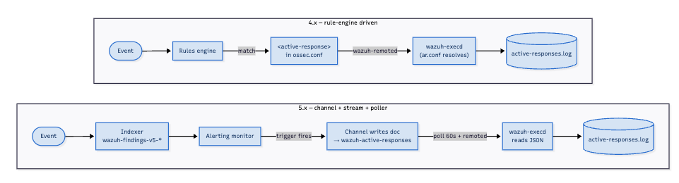
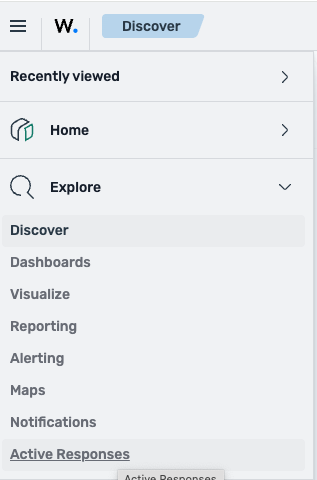
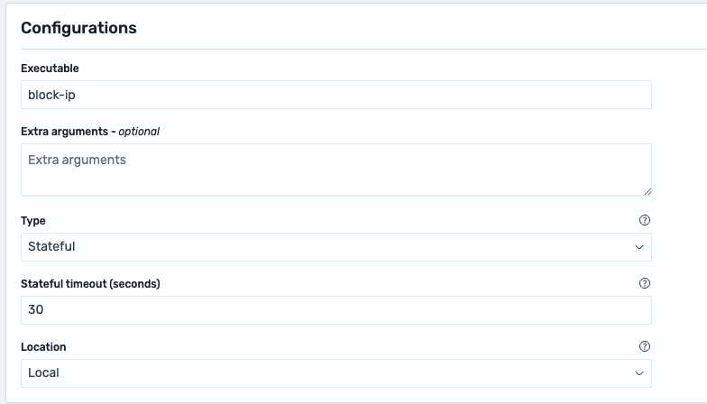
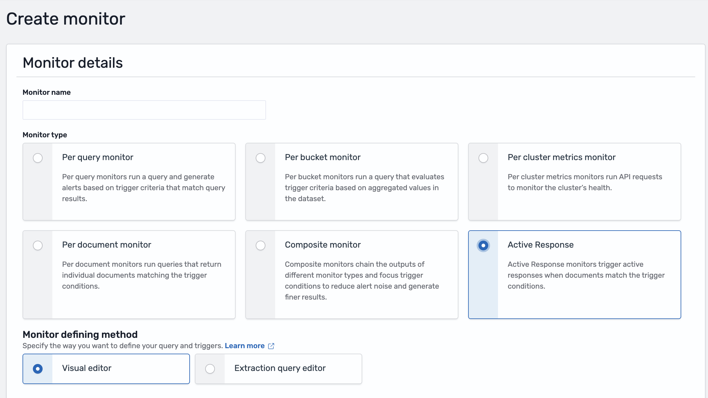
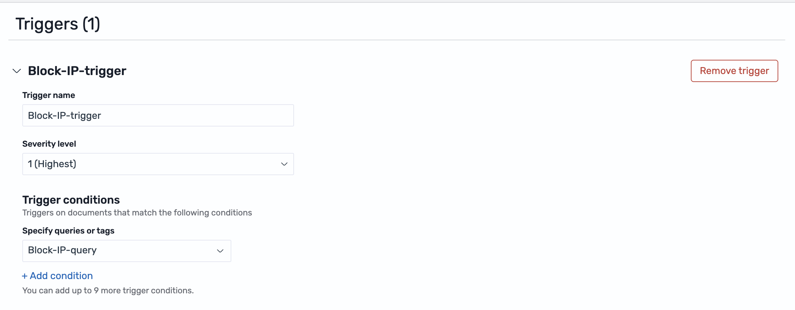
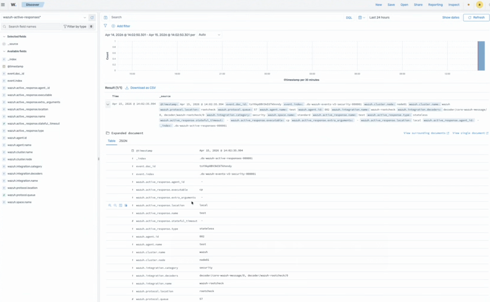

# Active Response migration guide (4.x to 5.x)

Active Response (AR) is rebuilt in 5.x. The 4.x XML in `ossec.conf`, the agent-side `ar.conf`, rule-based matching, and the `PUT /active-response` API are all removed. 5.x replaces them with channels managed in the dashboard, an Alerting monitor that triggers them, a `wazuh-active-responses` data stream that records each response, and a poller in `wazuh-manager-clusterd` that turns each record into a Task Manager task, which the agent receives in the reply to its next `POST /control` on `wazuh-manager-remoted`'s HTTPS port. The full 5.x flow is in the [Active Response architecture](../../ref/modules/active-response/architecture.md).

> **Manual migration only.** No converter, importer, or compatibility shim is provided. Every 4.x AR must be recreated as a 5.x active response; every custom script must be rewritten for the new JSON contract.

## Breaking changes at a glance

- The 4.x **manager's** `<command>` / `<active-response>` blocks have no 5.x equivalent: the manager reads `etc/wazuh-manager.conf`, where an unknown section such as `<active-response>` is a configuration error that stops the start. `ar.conf` is gone.
- The **agent's** local `ossec.conf` keeps an `<active-response>` block: `wazuh-execd` still reads `<disabled>` and `<repeated_offenders>` from it (see the [agent configuration reference](../../ref/modules/active-response/configuration.md#agent-configuration)). A `<command>` block left in an agent's `ossec.conf` or `agent.conf` is ignored with `(1223): 'command' is no longer supported and will be ignored. Active Response commands are not defined in the configuration file.`
- AR is created under **Explore → Active Responses**. Each channel carries `name`, `description`, `enabled`, `executable`, `extra_arguments`, `type` (`stateful` / `stateless`), `stateful_timeout` (default `180s`), `location` (`local` / `defined-agent` / `all`), `agent_id`.
- Matching (`<rules_id>` / `<level>` / `<rules_group>`) moves to the query of an Alerting monitor of type **Active Response**.
- `PUT /active-response` is removed with no replacement. Dispatch is document-driven: a monitor action writes into `wazuh-active-responses`; `wazuh-manager-clusterd` on every node reads the stream every 30 s (up to 1000 documents per read, `active_response_polling` / `active_response_page_size` in the [settings](../../ref/modules/active-response/architecture.md#settings)) and creates one Task Manager task per target agent. Agents below 5.0 never receive a response: documents whose `wazuh.agent.version` is `v0`–`v4` are not read, and the legacy channel on 1514 drops `active_response` tasks.
- Each triggered response is recorded as a structured document in the `wazuh-active-responses` data stream (backing indices `.ds-wazuh-active-responses-*`; retention is the indexer's ISM policy `stream-active-responses-policy`, shipped by the indexer, not by the manager).
- The JSON delivered to scripts changed shape: `command` ∈ `enable` / `disable` (was `add` / `delete`); the triggering event's fields travel at their WCS paths (`source.ip`, `user.name`, …); AR metadata sits under `wazuh.active_response.*`.
- Default firewall scripts (`firewall-drop`, `firewalld-drop`, `pf`, `npf`, `ipfw`, `netsh`, `route-null`, `host-deny`) are folded into a single `block-ip` executable. `restart-wazuh` moves to the Control Module. `wazuh-slack` is removed. The agent upgrade deletes the old executables.
- `<location>server</location>` and `<timeout_allowed>` have no equivalent.
- The manager-side `<active-response><disabled>` is replaced by the channel `enabled` field plus a **Mute / Unmute** runtime toggle. The agent-side `<disabled>` and `<repeated_offenders>` are unchanged.



## Compatibility matrix

| Wazuh Version | AR configuration source | Dashboard Platform        | Manager / Indexer |
| ------------- | ----------------------- | ------------------------- | ----------------- |
| 4.x           | `ossec.conf` XML blocks | OpenSearch Dashboards 2.x | Wazuh 4.x         |
| 5.0.x         | Dashboard entity (UI)   | OpenSearch Dashboards 3.x | Wazuh 5.x         |

Agents below 5.0 receive no active responses from a 5.x manager — upgrade the agents that must run them.

---

## Pre-migration

Back up the 4.x AR state and inventory each entry before upgrading:

```bash
AR_BACKUP_DIR="/root/backup-ar-$(date +%Y%m%d)"
sudo mkdir -p "$AR_BACKUP_DIR"
sudo cp -a /var/ossec/etc/ossec.conf "$AR_BACKUP_DIR/"
sudo cp -a /var/ossec/active-response/bin/ "$AR_BACKUP_DIR/"
```

For each `<command>` and `<active-response>` block in `/var/ossec/etc/ossec.conf`, record the values you will need to recreate the AR as a 5.x active response:

- `<command>`: `<name>`, `<executable>`, `<extra_args>`, `<timeout_allowed>`.
- `<active-response>`: the linked command, `<location>`, `<agent_id>`, the matching condition (`<rules_id>` / `<rules_group>` / `<level>`), `<timeout>`, `<repeated_offenders>`, `<disabled>`.

Historical AR records are not migrated to the 5.x `wazuh-active-responses` data stream. In 4.x they live in two places:

- Alerts in your `wazuh-alerts-*` indices, filtered by `rule.groups: active_response`.
- Lines in `/var/ossec/logs/active-responses.log` on each agent.

If you need long-term records, export them from your 4.x indexer using your standard data-export procedure before upgrading.

---

## Field mapping (4.x XML → 5.x active response)

| 4.x XML                                                     | 5.x equivalent                      | Notes                                                                                               |
| ----------------------------------------------------------- | ----------------------------------- | --------------------------------------------------------------------------------------------------- |
| `<command><name>`                                           | _(no direct field)_                 | The channel replaces the named command. Pick a descriptive **Name**.                                |
| `<command><executable>`                                     | **Executable**                      | Discovery path preserved at `/var/ossec/active-response/bin/<executable>` on Unix agents.           |
| `<command><extra_args>`                                     | **Extra arguments**                 | Free-form string passed to the executable.                                                          |
| `<command><timeout_allowed>`                                | _(no replacement)_                  | Reversal is driven by `type = Stateful` + **Stateful timeout**.                                     |
| `<active-response><location>` = `local`                     | **Location** = `Local`              | Default.                                                                                            |
| `<active-response><location>` = `defined-agent`             | **Location** = `Defined agent`      | Reveals **Agent ID**.                                                                               |
| `<active-response><location>` = `all`                       | **Location** = `All`                | Pushes the action to every connected agent.                                                         |
| `<active-response><location>` = `server`                    | _(no replacement)_                  | Manager-side execution does not exist in 5.x. See [`Location = server`](#location--server-from-4x). |
| `<active-response><agent_id>`                               | **Agent ID**                        | Only when `Location = Defined agent`.                                                               |
| `<active-response><rules_id>` / `<level>` / `<rules_group>` | Alerting monitor query              | Matching moves to the monitor — see [Triggering model](#triggering-model).                          |
| `<active-response><timeout>`                                | **Stateful timeout**                | Same unit (seconds). Only shown with `Type = Stateful`.                                             |
| `<active-response><repeated_offenders>` (agent `ossec.conf`) | _(unchanged)_                      | Still read by the agent's `wazuh-execd`. See [`<repeated_offenders>` stays on the agent](#repeated_offenders-stays-on-the-agent). |
| `<active-response><disabled>` (manager)                     | `enabled` field + **Mute / Unmute** | `enabled` is the persistent flag; **Mute / Unmute** is the runtime toggle.                          |
| `<active-response><disabled>` (agent `ossec.conf`)          | _(unchanged)_                       | `yes` still turns execution off on that agent.                                                      |
| `ar.conf`                                                   | _(deleted)_                         | `wazuh-execd` reads the JSON message directly.                                                      |

## Triggering model

| Aspect              | 4.x                                                               | 5.x                                                                            |
| ------------------- | ----------------------------------------------------------------- | ------------------------------------------------------------------------------ |
| Where matching runs | Manager rules engine                                              | Alerting monitor (indexer / dashboard plane)                                   |
| How to express it   | `<rules_id>` / `<level>` / `<rules_group>` in `<active-response>` | Monitor of type **Active Response** with a query against `wazuh-findings-v5-*` |
| What invokes the AR | The alert fires the AR directly                                   | The trigger's **Add active response** action invokes the channel               |
| Visibility          | Manager logs                                                      | Alerting evaluation + execution record in `wazuh-active-responses*`            |

Each 4.x `<active-response>` becomes two artifacts in 5.x: the AR channel (the **what**) and an Alerting monitor (the **when**). The monitor query encodes the matching condition that used to live in `<rules_id>` / `<level>` / `<rules_group>`; the monitor's trigger then carries an **Add active response** action pointing at the channel. End-to-end wiring is covered in [Migration steps](#migration-steps), steps 4 and 5 below.

> The monitor type **must** be `Active Response`. No other type exposes the **Add active response** action.

**Writing the monitor query.** The 4.x numeric rule ID does not carry over. Detection in 5.x is indexed under `wazuh-findings-v5-*` indices (split by category, e.g. `wazuh-findings-v5-system-activity*`, `wazuh-findings-v5-security*`, etc...), where a finding's rule identity is **`wazuh.rule.title`** (a human-readable string) and **`wazuh.rule.id`** (a UUID — not a number). So the query is **not** `wazuh.rule.id: 5763`. Pick the findings index that carries your events and match on:

- **`wazuh.rule.title`** — recommended for monitors, e.g. `wazuh.rule.title is "Docker secret removed"`. Readable, but note that titles can change between ruleset versions.
- **`wazuh.rule.id`** — the stable UUID, but it is mapped as text; an exact-match (`is`) operator may fail to match the dashed UUID. Prefer `wazuh.rule.title` unless you confirm `wazuh.rule.id.keyword` works in your build.

The 4.x numeric IDs (`5763`, `5760`, …) have no 1:1 equivalent — locate the 5.x rule that detects the same condition by its `wazuh.rule.title` in `wazuh-findings-v5-*` (e.g. with `GET wazuh-findings-v5-*/_search`).

## Audit and visibility

| Surface               | 4.x                                                                                                       | 5.x                                                                                                                                                        |
| --------------------- | --------------------------------------------------------------------------------------------------------- | ---------------------------------------------------------------------------------------------------------------------------------------------------------- |
| Responses recorded in | `/var/ossec/logs/active-responses.log` + events from the `active_response` rule group in `wazuh-alerts-*` | `wazuh-active-responses` data stream, one document per triggered response, written before delivery: it does not confirm execution. The agent's `active-responses.log` is unchanged and is the only record of what ran. |
| Structured fields     | Free text                                                                                                 | `wazuh.active_response.{name,type,executable,extra_arguments,stateful_timeout,location,agent_id}` + `event.doc_id` / `event.index`.                        |
| `@timestamp`          | Event time                                                                                                | Indexing time. For event-time correlation use the linked alert via `event.doc_id`.                                                                         |
| Default retention     | Alerts ILM policy                                                                                         | The indexer's ISM policy `stream-active-responses-policy`. Adjust the policy for longer retention.                                                         |
| Pivot to source alert | Manual                                                                                                    | Each execution record carries `event.doc_id` + `event.index`; switch Discover to that index and filter `_id:<event.doc_id>` in the search bar to open the triggering alert. |

## API change

`PUT /active-response` is removed with no replacement endpoint. Integrations that previously fired AR via the API must now emit an alert document and let an Alerting Active Response monitor pick it up. Each manager node keeps its read position in `/var/wazuh-manager/queue/cluster/ar_bookmark.json` (see [The cursor](../../ref/modules/active-response/architecture.md#the-cursor)).

---

## JSON stdin contract

> Custom AR scripts from 4.x will break on 5.x without code changes.

The discovery path is unchanged on Unix agents (`/var/ossec/active-response/bin/<executable>`). What changed is the JSON shape and the command vocabulary.

**4.x:**

```json
{
  "version": 1,
  "origin": { "name": "node01", "module": "wazuh-analysisd" },
  "command": "add",
  "parameters": {
    "extra_args": [],
    "alert": {
      "rule": { "id": "5763", "level": 10 },
      "data": { "srcip": "192.168.1.100", "dstuser": "root" }
    },
    "program": "/var/ossec/active-response/bin/firewall-drop"
  }
}
```

**5.x:**

```json
{
  "wazuh": {
    "active_response": {
      "name": "block-ip",
      "executable": "block-ip",
      "location": "defined-agent",
      "agent_id": "001",
      "type": "stateless"
    },
    "agent": { "id": "001", "name": "test-agent" }
  },
  "source": { "ip": "192.168.1.100" },
  "user": { "name": "username" },
  "command": "enable"
}
```

Changes:

- `command` ∈ `enable` / `disable`. The manager sends no `command`: `wazuh-execd` adds `"command": "enable"` before running the script, and the reversal it runs at the timeout is the same message with `command` set to `disable`.
- The triggering event's fields travel at their WCS paths (`source.ip`, `source.port`, `user.name`). The 4.x `parameters.alert.data.*` is gone.
- AR metadata under `wazuh.active_response.*`. `wazuh-execd` reads `.executable`, `.type`, `.stateful_timeout` before invoking the script. The 4.x `parameters.extra_args` array becomes the string `wazuh.active_response.extra_arguments` (or `null`).

Every field of the 5.x message is described in [JSON protocol](../../ref/modules/active-response/architecture.md#json-protocol).

### Migration recipe

For each custom script:

1. Re-map field reads to WCS paths (`parameters.alert.data.srcip` → `source.ip`, etc.).
2. Replace the inbound command handling: the 4.x `case "$COMMAND" in add) ... delete)` becomes `enable) ... disable)`. The manager dispatches exactly one of those values — `add` / `delete` in 4.x, `enable` / `disable` in 5.x. `continue` appears only as the `check_keys` deduplication reply: `wazuh-execd` answers `continue` or `abort` to a script that sends a `check_keys` control message, and this protocol is unchanged from 4.x, so scripts that issue `check_keys` keep comparing the response against `"continue"` exactly as before.
3. Read `<extra_args>` values from `wazuh.active_response.extra_arguments` (one string, or `null`) instead of the 4.x `parameters.extra_args` array; nothing is passed on the command line. Other AR metadata in the same object is also accessible to the script when needed: `.wazuh.active_response.{name,executable,type,stateful_timeout,location,agent_id}`. See the rewritten script in [Example 2 — Step 2](#example-2--custom-ssh-blocker-with-extra_arguments-rule-5760) for the `extra_arguments` accessor in use.
4. Capture stdin **inside the script itself** — `read -r INPUT_JSON; echo "$INPUT_JSON" > /tmp/ar-input.json` — on a real dispatch to confirm the shape. **Do not** wrap as `tee /tmp/ar-input.json | impl.sh`: `wazuh-execd` keeps stdin open after sending the payload (it expects the script to optionally respond with a `check_keys` control message and read back the `continue`/`abort` answer), so `tee` never receives EOF and the dispatch hangs forever. See [Custom script hangs and AR queue stalls](#custom-script-hangs-and-ar-queue-stalls).

### Example diff

**4.x body:**

```bash
#!/bin/bash

# Log file
LOGFILE="/var/ossec/logs/active-responses.log"

logmsg(){
  local msg="$*"
  echo "$(date '+%Y-%m-%d %H:%M:%S') - custom-ar-sh - $msg" >> "$LOGFILE"
}

# Read AR input (wazuh-execd writes a single line terminated by \n)
read -r INPUT_JSON

logmsg "$INPUT_JSON"

# Get command
command=$(echo "$INPUT_JSON" | jq -r '.command')

# Get srcip from the alert
ar_srcip=$(echo "$INPUT_JSON" | jq -r '.parameters.alert.data.srcip')

logmsg "Command: $command"

if [ "$command" == "add" ]; then
  # Send control message
  printf '{"version":1,"origin":{"name":"custom-ar-sh","module":"active-response"},"command":"check_keys", "parameters":{"keys":[]}}\n'
  read -r RESPONSE
  response_command=$(echo "$RESPONSE" | jq -r '.command')
  if [ "${response_command}" != "continue" ]; then
    logmsg "Abort"
    exit 0;
  fi

  # Execute the main AR command
  logmsg "Execute AR"
elif [ "$command" == "delete" ]; then
  # Execute the revert/undone command
  logmsg "Revert AR"
else
  logmsg "Invalid command: $command"
fi

exit 0
```

**5.x body:**

```bash
#!/bin/bash

# Log file
LOGFILE="/var/ossec/logs/active-responses.log"

logmsg(){
  local msg="$*"
  echo "$(date '+%Y-%m-%d %H:%M:%S') - custom-ar-sh - $msg" >> "$LOGFILE"
}

# Read AR input (wazuh-execd writes a single line terminated by \n)
read -r INPUT_JSON

logmsg "$INPUT_JSON"

# Get command
command=$(echo "$INPUT_JSON" | jq -r '.command')

# Get srcip from the alert
ar_srcip=$(echo "$INPUT_JSON" | jq -r '.source.ip') # 5.x MIGRATION: Changed from .parameters.alert.data.srcip to WCS path .source.ip

logmsg "Command: $command"

if [ "$command" == "enable" ]; then # 5.x MIGRATION: Changed from add to enable
  # Send control message
  printf '{"version":1,"origin":{"name":"custom-ar-sh","module":"active-response"},"command":"check_keys", "parameters":{"keys":[]}}\n'
  read -r RESPONSE
  response_command=$(echo "$RESPONSE" | jq -r '.command')
  if [ "${response_command}" != "continue" ]; then
    logmsg "Abort"
    exit 0;
  fi

  # Execute the main AR command
  logmsg "Execute AR"
elif [ "$command" == "disable" ]; then # 5.x MIGRATION: Changed from delete to disable
  # Execute the revert/undone command
  logmsg "Revert AR"
else
  logmsg "Invalid command: $command"
fi

exit 0
```

Ownership and permissions are unchanged:

```bash
sudo chown root:wazuh /var/ossec/active-response/bin/<script>
sudo chmod 750 /var/ossec/active-response/bin/<script>
```

The 4.x manager `<command>` / `<active-response>` registration is replaced by a channel created in **Explore → Active Responses** and an Alerting monitor whose query matches the rule by `wazuh.rule.title` over `wazuh-findings-v5-*` (the 4.x numeric `rule.id` is gone — see [Triggering model](#triggering-model)) and whose trigger's **Add active response** action points at the channel. `<repeated_offenders>` stays in the agent's `ossec.conf` — see [`<repeated_offenders>` stays on the agent](#repeated_offenders-stays-on-the-agent).

---

## Default scripts

| 4.x script                                                                                   | 5.x replacement                                        | Notes                                                               |
| -------------------------------------------------------------------------------------------- | ------------------------------------------------------ | ------------------------------------------------------------------- |
| `firewall-drop`, `default-firewall-drop`, `firewalld-drop`, `pf`, `npf`, `ipfw`, `netsh.exe` | `block-ip`                                             | One executable per platform; it tries the platform's firewall methods in order. |
| `route-null`, `host-deny`                                                                    | `block-ip` (route / hosts.deny fallbacks)              | Used when no native firewall is available.                          |
| `ip-customblock`                                                                             | _(removed)_ — `block-ip` or a custom script using the new contract | Deleted by the agent upgrade.                           |
| `disable-account`                                                                            | `disable-account`                                      | Retained (Linux and macOS only). Rewrite only if wrapped by a custom JSON-parsing script. |
| `restart-wazuh`                                                                              | _(removed from AR)_                                    | Agent restart is an `agent_restart` task of the [Control Module](../../ref/modules/control/README.md). |
| `wazuh-slack`, `kaspersky`                                                                   | _(removed)_                                            | Use **Explore → Notifications → Channels** for Slack notifications. |

The agent upgrade deletes the 4.x default executables from `active-response/bin/`; a channel whose **Executable** still names one fails on the agent with `(1311): Invalid command name '<name>' provided.` The shipped executables are described in the [executables reference](../../ref/modules/active-response/executables.md).

For every migrated AR that referenced a consolidated script, set **Executable** to `block-ip` (or `disable-account`).

---

## Migration steps

1. **Finish the stack upgrade** through dashboard startup. AR can only be validated once the manager and indexer are on 5.x.
2. **Rewrite custom scripts** following the [recipe above](#migration-recipe). Re-apply `root:wazuh` ownership and `750` permissions.
3. **Recreate each 4.x AR** under **Explore → Active Responses → Create active response**, using the [field mapping table](#field-mapping-4x-xml--5x-active-response) and the [Default scripts](#default-scripts) translation.

   

   The creation form replaces the 4.x `<command>` / `<active-response>` XML blocks. Each row in the field-mapping table corresponds directly to a field in this form; conditional fields (**Stateful timeout**, **Agent ID**) only appear once **Type** or **Location** select the matching value.

   

4. **Wire each channel to a monitor** of type **Active Response**, encoding the 4.x match condition as the monitor query — by `wazuh.rule.title` over `wazuh-findings-v5-*` (the 4.x numeric `rule.id` has no 5.x equivalent; see [Triggering model](#triggering-model)). The monitor type **must** be `Active Response` — no other type exposes the **Add active response** action.

   

   In the trigger, the **Actions** section now exposes two separate buttons — **Add notification** (generic notifications) and **Add active response** (AR channels). Pick **Add active response** and select the channel created in the previous step.

   

5. **Smoke-test.** No manager restart is needed: the manager reads no active-response configuration, and the poller picks up new documents on its next cycle.

   Generate the triggering event and open **Discover** with the `wazuh-active-responses*` index pattern. A response document appears once the monitor has run; expand it to confirm `wazuh.active_response.{name,type,executable,location}` match the channel, and that `event.doc_id` / `event.index` point back to the source alert. The agent runs the response after the next poll (every 30 s) and its own next `POST /control`. For stateful AR, wait `stateful_timeout` seconds and verify the revert (a second log line in `/var/ossec/logs/active-responses.log` on the agent, plus restored connectivity for `block-ip`).

   

---

## Worked examples

Two end-to-end migrations that make every section above concrete.

### Example 1 — Default `firewall-drop` on SSH brute-force (rule 5763)

The most common migration: a single rule, a single agent, stateful reversal, using only default scripts. Exercises [field mapping](#field-mapping-4x-xml--5x-active-response), the [`block-ip` consolidation](#default-scripts), and monitor wiring.

**Starting point (4.x `/var/ossec/etc/ossec.conf`):**

```xml
<command>
  <name>firewall-drop-ar</name>
  <executable>firewall-drop</executable>
  <timeout_allowed>yes</timeout_allowed>
</command>

<active-response>
  <disabled>no</disabled>
  <command>firewall-drop-ar</command>
  <location>local</location>
  <rules_id>5763</rules_id>
  <timeout>60</timeout>
</active-response>
```

What this does in 4.x: when rule `5763` (composite SSH brute force — fires after several authentication failures in a short window) triggers, the manager dispatches `firewall-drop` to the originating agent, which adds an `iptables DROP` rule for the offending IP and reverses it after 60 seconds.

**Walking each [migration step](#migration-steps) for this AR:**

| Step                       | Action for this example                                                                                                                                                                                                                                                                                                                                               |
| -------------------------- | --------------------------------------------------------------------------------------------------------------------------------------------------------------------------------------------------------------------------------------------------------------------------------------------------------------------------------------------------------------------- |
| 2 — Rewrite custom scripts | Not applicable — uses the default script.                                                                                                                                                                                                                                                                                                                             |
| 3 — Recreate as active response    | Use the field values in the table below.                                                                                                                                                                                                                                                                                                                              |
| 4 — Wire to monitor        | Create an `Active Response` monitor over `wazuh-findings-v5-system-activity` index alias with query `wazuh.rule.title is "<5.x rule title for the SSH auth failure>"` — **not** `wazuh.rule.id: 5763` (the 4.x numeric ID has no 5.x equivalent; match by `wazuh.rule.title`, see [Triggering model](#triggering-model)). In the trigger choose **Add active response** → the channel above. |
| 5 — Smoke-test             | Trigger an SSH authentication failure on the agent; expect a document in `wazuh-active-responses*` within ~1-2 min (allow for ingest latency + the monitor interval).                                                                                                                                                                                                 |

**Step 3 — channel field values:**

| Form field       | Value                                  | Comes from                                                                                          |
| ---------------- | -------------------------------------- | --------------------------------------------------------------------------------------------------- |
| Name             | `block-ip-ssh-local`                   | Descriptive replacement for `<command><name>firewall-drop-ar</name>` (4.x had no description).      |
| Description      | `Block source IP on SSH login failure` | Free text — new in 5.x.                                                                             |
| Enabled          | ✓                                      | Replaces the absence of `<disabled>` in 4.x.                                                        |
| Executable       | `block-ip`                             | `firewall-drop` was folded into the `block-ip` umbrella ([Default scripts](#default-scripts)).      |
| Extra arguments  | _(empty)_                              | No `<extra_args>` was set in 4.x.                                                                   |
| Type             | `Stateful`                             | 4.x had `<timeout>` set, which implies a reversible action.                                         |
| Stateful timeout | `60`                                   | Same value as 4.x `<timeout>60</timeout>`.                                                          |
| Location         | `Local`                                | Same as 4.x `<location>local</location>`.                                                           |
| Agent ID         | _(hidden)_                             | Only appears when Location = Defined agent.                                                         |

**Expected outcome after Step 5:**

1. Agent's `/var/ossec/logs/active-responses.log` shows two lines for the same source IP: a BLOCK at firing time, then an UNBLOCK ~60 s later.
2. The indexer's `wazuh-active-responses*` data stream gets one document per triggered response (the reversal is run by the agent and writes no document). It looks like:

   ```json
    {
      "@timestamp": "<indexing time, not event time>",
      "event": {
        "doc_id": "X2cQrZ4BDAFZz_TTUaKz",
        "index": ".ds-wazuh-findings-v5-system-activity-000001"
      },
      "wazuh": {
        "cluster": {
          "node": "node01",
          "name": "wazuh"
        },
        "protocol": {
          "location": "journald",
          "queue": 49
        },
        "agent": {
          "host": {
            "hostname": "ubuntu-2404",
            "os": {
              "name": "Ubuntu",
              "type": "linux",
              "version": "24.04.2 LTS (Noble Numbat)",
              "platform": "ubuntu"
            },
            "architecture": "x86_64"
          },
          "name": "ubuntu24",
          "groups": [
            "default"
          ],
          "id": "003",
          "version": "v5.0.0"
        },
        "integration": {
          "name": "linux",
          "decoders": [
            "decoder/core-wazuh-message/0",
            "decoder/syslog/0",
            "decoder/system-auth/0"
          ],
          "category": "system-activity"
        },
        "rule": {
          "sigma_id": "d5cc0e71-bcbb-4adc-98de-caed210cebf2",
          "level": "low",
          "compliance": {
            "iso_27001": [
              "A.9.2.1",
              "A.9.4.2",
              "A.12.4.1"
            ],
            "hipaa": [
              "164.308.a.1.ii.D",
              "164.308.a.5.ii.C",
              "164.312.a.2.i"
            ],
            "pci_dss": [
              "8.2",
              "10.2"
            ],
            "tsc": [
              "CC6.1",
              "CC7.2"
            ],
            "nis2": [
              "21.2.a",
              "21.2.e"
            ],
            "nist_800_171": [
              "3.1.1",
              "3.3.1",
              "3.5.1"
            ],
            "fedramp": [
              "AC-2",
              "AU-2",
              "IA-2"
            ],
            "nist_800_53": [
              "AC-2",
              "AU-2",
              "IA-2"
            ],
            "cmmc": [
              "AC.L2-3.1.1",
              "AU.L2-3.3.1",
              "IA.L2-3.5.1"
            ],
            "gdpr": [
              "II_5.1.f",
              "IV_32.1.a",
              "IV_33.1"
            ]
          },
          "mitre": {
            "technique": {
              "name": [
                "Brute Force",
                "Valid Accounts"
              ],
              "id": [
                "T1110",
                "T1078"
              ]
            },
            "tactic": {
              "name": [
                "Credential Access",
                "Initial Access"
              ],
              "id": [
                "TA0006",
                "TA0001"
              ]
            }
          },
          "id": "d5cc0e71-bcbb-4adc-98de-caed210cebf2",
          "title": "Failed authentication attempt - vagrant from 192.168.56.1",
          "tags": [
            "low",
            "wazuh-generic",
            "attack.credential-access",
            "attack.initial-access",
            "attack.t1110",
            "attack.t1078"
          ],
          "status": "stable"
        },
        "event": {
          "id": "f166aa6b-3b97-42c6-9700-37e0863a425d"
        },
        "space": {
          "name": "standard"
        },
        "active_response": {
          "name": "block-ip-ssh-local",
          "type": "stateful",
          "stateful_timeout": 60,
          "executable": "block-ip",
          "extra_arguments": null,
          "location": "local",
          "agent_id": null
        }
      }
    }
   ```

3. Switching Discover to `wazuh-findings-v5*` and filtering in the search bar `_id:<event.doc_id>` opens the originating finding.

### Example 2 — Custom SSH blocker with `extra_arguments` (rule 5760)

A custom script with arguments that add context-aware logging. Exercises the [JSON stdin contract](#json-stdin-contract) change and the per-channel `extra_arguments` simplification.

**Starting point (4.x `/var/ossec/etc/ossec.conf`):**

```xml
<command>
  <name>block-ssh-args-ar</name>
  <executable>block-ssh.sh</executable>
  <timeout_allowed>yes</timeout_allowed>
  <extra_args>--severity high --queue urgent</extra_args>
</command>

<active-response>
  <disabled>no</disabled>
  <command>block-ssh-args-ar</command>
  <location>local</location>
  <rules_id>5760</rules_id>
  <timeout>60</timeout>
</active-response>
```

> In 4.x, supporting a second arg variant requires a **second `<command>` block** because `<extra_args>` is a child of `<command>`, not of `<active-response>`. In 5.x the same executable can serve N channels with N different `extra_arguments` — that simplification is what this example proves.

**Starting point (4.x script `/var/ossec/active-response/bin/block-ssh.sh`):**

```bash
#!/bin/bash
read -r INPUT_JSON   # one line; do NOT use $(cat) — execd keeps stdin open and $(cat) hangs.
COMMAND=$(echo "$INPUT_JSON" | jq -r '.command')
SRC_IP=$(echo  "$INPUT_JSON" | jq -r '.parameters.alert.data.srcip')

# Guard against missing source IP — jq prints "null" when the field is absent.
[ -z "$SRC_IP" ] || [ "$SRC_IP" = "null" ] && exit 0

# check_keys round trip — REQUIRED for a stateful AR (one with <timeout>): execd registers
# the protected key and schedules the matching `delete` at <timeout>. Skip it and the block
# is applied but never reverted. See Troubleshooting → "Stateful AR applies but never reverts".
if [ "$COMMAND" = "add" ]; then
  printf '{"version":1,"origin":{"name":"block-ssh","module":"active-response"},"command":"check_keys","parameters":{"keys":["%s"]}}\n' "$SRC_IP"
  read -r RESPONSE
  [ "$(echo "$RESPONSE" | jq -r '.command')" != "continue" ] && exit 0
fi

case "$COMMAND" in
  add)      iptables -I INPUT -s "$SRC_IP" -j DROP ;;
  delete)   iptables -D INPUT -s "$SRC_IP" -j DROP ;;
esac

exit 0
```

**Walking each [migration step](#migration-steps) for this AR:**

| Step                       | Action for this example                                                                                                                                                                                                                                                      |
| -------------------------- | ---------------------------------------------------------------------------------------------------------------------------------------------------------------------------------------------------------------------------------------------------------------------------- |
| 2 — Rewrite custom script  | Apply the rewrite below: `parameters.alert.data.srcip` → `source.ip`; `add`/`delete` → `enable`/`disable`.                                                                                                                                                                      |
| 3 — Recreate as active response    | Use the field values in the table below.                                                                                                                                                                                                                                     |
| 4 — Wire to monitor        | Monitor over `wazuh-findings-v5-*` with a `wazuh.rule.title` query (4.x numeric `5760` has no 5.x equivalent — see [Triggering model](#triggering-model)); trigger action = **Add active response**. |
| 5 — Smoke-test             | Trigger the rule; expect the rewritten script to run and a document in `wazuh-active-responses*`.                                                                                                                                                                            |

**Step 2 — rewritten script** (`/var/ossec/active-response/bin/block-ssh.sh`, `chown root:wazuh`, `chmod 750`):

```bash
#!/bin/bash
LOGFILE="/var/ossec/logs/active-responses.log"
read -r INPUT_JSON   # one line; do NOT use $(cat) — execd keeps stdin open and $(cat) hangs.
COMMAND=$(echo "$INPUT_JSON" | jq -r '.command')
SRC_IP=$(echo  "$INPUT_JSON" | jq -r '.source.ip')
AR_NAME=$(echo "$INPUT_JSON" | jq -r '.wazuh.active_response.name')
EXTRA=$(echo   "$INPUT_JSON" | jq -r '.wazuh.active_response.extra_arguments')

# Guard against missing source IP — jq prints "null" when the field is absent.
[ -z "$SRC_IP" ] || [ "$SRC_IP" = "null" ] && exit 0

# Context-aware logging: record which channel fired and with what extra_arguments.
echo "$(date '+%Y-%m-%d %H:%M:%S') - $AR_NAME [$EXTRA] - $COMMAND $SRC_IP" >> "$LOGFILE"

# check_keys round trip — still REQUIRED for a stateful channel: without it execd never
# schedules the `disable` (see Troubleshooting → "Stateful AR applies but never reverts").
if [ "$COMMAND" = "enable" ]; then
  printf '{"version":1,"origin":{"name":"block-ssh","module":"active-response"},"command":"check_keys","parameters":{"keys":["%s"]}}\n' "$SRC_IP"
  read -r RESPONSE
  [ "$(echo "$RESPONSE" | jq -r '.command')" != "continue" ] && exit 0
fi

case "$COMMAND" in
  enable)  iptables -I INPUT -s "$SRC_IP" -j DROP ;;
  disable) iptables -D INPUT -s "$SRC_IP" -j DROP ;;
esac

exit 0
```

**Step 3 — channel field values:**

| Form field       | Value                                                     |
| ---------------- | --------------------------------------------------------- |
| Name             | `block-ssh-args-local`                                    |
| Description      | `Block source IP on rule 5760 with extra context tagging` |
| Enabled          | ✓                                                         |
| Executable       | `block-ssh.sh`                                            |
| Extra arguments  | `--severity high --queue urgent`                          |
| Type             | `Stateful`                                                |
| Stateful timeout | `60`                                                      |
| Location         | `Local`                                                   |
| Agent ID         | _(hidden)_                                                |

**Expected outcome after Step 5:**

The JSON written to the script's stdin (capture inside the script with `read -r INPUT_JSON; echo "$INPUT_JSON" > /tmp/ar-input.json` — not a `tee` wrapper; see [Custom script hangs and AR queue stalls](#custom-script-hangs-and-ar-queue-stalls)) looks like:

```json
{
  "command": "enable",
  "source": { "ip": "1.2.3.4" },
  "wazuh": {
    "active_response": {
      "name": "block-ssh-args-local",
      "executable": "block-ssh.sh",
      "extra_arguments": "--severity high --queue urgent",
      "type": "stateful",
      "stateful_timeout": 60,
      "location": "local"
    },
    "agent": { "id": "001", "name": "wazuh-agent" }
  }
}
```

At +60 s `wazuh-execd` runs the script again with the same message and `"command": "disable"`, as specified in the [JSON stdin contract](#json-stdin-contract).

---

Together these two examples exercise every concrete shape you will encounter: a default consolidated script (`block-ip`), a custom script needing a JSON rewrite, the field-mapping table, monitor wiring, `extra_arguments` propagation, the `wazuh-active-responses` data-stream record, the `event.doc_id` pivot back to the originating alert. Anything more complex (multiple ARs, non-shell scripts, Windows agents) follows the same pattern: **4.x XML → field-mapping table → 5.x active response + monitor → JSON contract → execution document**.

## Other 4.14 AR scenarios

Examples 1 and 2 cover the two most common shapes (default consolidated script, custom shell script with `extra_arguments`). For every other scenario described in the [Wazuh 4.14 AR reference](https://documentation.wazuh.com/4.14/user-manual/capabilities/active-response/), the table below lists the 5.x migration approach.

| 4.14 feature                                                                     | 5.x migration approach                                                                                                                                                              |
| -------------------------------------------------------------------------------- | ----------------------------------------------------------------------------------------------------------------------------------------------------------------------------------- |
| Default `disable-account` (retained)                                             | `disable-account` channel (same executable name — see [Default scripts](#default-scripts))                                                                                          |
| Trigger by `<level>`                                                             | Monitor query on `wazuh.rule.level`, which is a severity word such as `low`, not a 4.x number (see the example document above and [Triggering model](#triggering-model)) |
| Trigger by `<rules_group>`                                                       | 4.x rule groups do not carry over: match the 5.x rules by `wazuh.rule.title`, or by a value of `wazuh.rule.tags` (see [Triggering model](#triggering-model)) |
| `<location>defined-agent</location>` + `<agent_id>`                              | `Location = Defined agent` + Agent ID (see [Field mapping](#field-mapping-4x-xml--5x-active-response))                                                                                      |
| `<location>all</location>`                                                       | `Location = All`                                                                                                                                                                    |
| `<location>server</location>` (removed)                                          | Co-located agent on manager + `Location = Defined agent` (see [`Location = server`](#location--server-from-4x))                                                                     |
| `firewalld-drop`, `pf`, `npf`, `ipfw`, `netsh`, `route-null`, `host-deny`        | Folded into `block-ip` (see [Default scripts](#default-scripts))                                                                                                                    |
| `restart-wazuh` (removed from AR)                                                | Control Module (see [Default scripts](#default-scripts))                                                                                                                            |
| `wazuh-slack` (removed)                                                          | Notifications → Channels                                                                                                                                                            |
| Stateless AR (no `<timeout>`)                                                    | `Type = Stateless`                                                                                                                                                                  |
| `<repeated_offenders>` in the agent's `ossec.conf`                               | Unchanged: keep it on the agent (see [`<repeated_offenders>` stays on the agent](#repeated_offenders-stays-on-the-agent)) |
| `<disabled>yes</disabled>` in the manager's `<active-response>`                  | `enabled = false` + **Mute / Unmute** (see [Field mapping](#field-mapping-4x-xml--5x-active-response))                                                                                      |
| `<disabled>yes</disabled>` in the agent's `ossec.conf`                           | Unchanged: execution stays off on that agent                                                                                                                                       |
| API-driven dispatch via `PUT /active-response` (removed)                         | Document-driven via alert insertion (see [API change](#api-change))                                                                                                                 |
| Custom Python script (non-shell executable)                                      | Same path, same ownership, same JSON contract (see [JSON stdin contract](#json-stdin-contract))                                                                                     |
| Multiple `<command>` blocks sharing one executable with different `<extra_args>` | Single executable + N channels with N `extra_arguments`                                                                                                                             |

Pick the rows that match your 4.14 inventory and validate those scenarios before declaring the migration complete.

---

## Post-migration validation

- Every 4.x `<active-response>` block has a matching entity in **Explore → Active Responses** with the values from the inventory.
- Custom scripts under `/var/ossec/active-response/bin/` use the 5.x JSON contract (no references to `parameters.alert.data.*` or the `add` / `delete` inbound commands).
- `wazuh-manager.conf` passes `/var/wazuh-manager/bin/wazuh-manager-conf validate` (no 4.x `<command>` or `<active-response>` section carried over). Agents keep only `<disabled>` and `<repeated_offenders>` (plus the installer's `<ca_store>` / `<ca_verification>`) in their `<active-response>` block.
- The smoke test from [Migration steps](#migration-steps) (step 5) passes for at least one migrated AR.

---

## Troubleshooting

Items below are specific to the 4.x → 5.x migration. For symptoms that are not migration-specific, the general diagnostic flow is:

| Symptom                                         | Likely cause                                                      | Action                                                                 |
| ----------------------------------------------- | ----------------------------------------------------------------- | ---------------------------------------------------------------------- |
| AR is not listed in the trigger selector        | The monitor is not _Active Response_, or the channel is muted     | Recreate the monitor as _Active Response_; unmute the channel          |
| No response record appears in **Discover**      | Indexer notifications or alerting plugins missing                 | Ask your administrator to verify the plugin installation               |
| Record present but no effect on the agent       | Manager did not deliver the command, or the agent is disconnected | Check the manager service and the agent connection                     |
| A stateful AR does not revert after the timeout | Timeout too large, or a custom script skips `check_keys`          | See [Stateful AR applies but never reverts](#stateful-ar-applies-but-never-reverts) |

**AR entities not visible after upgrade.** Open **Dashboard Management → Index Patterns** and verify the `wazuh-active-responses*` pattern exists. If it is missing, ask your administrator to inspect the dashboard logs.

**Custom script silently does nothing.** The script still parses the 4.x JSON. `command` is now `enable`, not `add`; `parameters.alert.data.srcip` no longer exists (use `source.ip`). Re-apply the [recipe](#migration-recipe).

**AR fires but the agent never receives it.** Confirm the agent is on 5.0 or later and connected over HTTPS: documents for agents below 5.0 are not read, and the legacy 1514 channel drops `active_response` tasks. If the version is fine, read the `[Active Response]` lines in `/var/wazuh-manager/logs/cluster.log` (every lost response is logged there — see [Messages](../../ref/modules/active-response/architecture.md#messages)), and check that `<disabled>` is not `yes` in the agent's `ossec.conf`.

**Permission errors on custom scripts.** Re-apply:

```bash
sudo chown root:wazuh /var/ossec/active-response/bin/<script>
sudo chmod 750 /var/ossec/active-response/bin/<script>
```

### Custom script hangs and AR queue stalls

If a custom AR script appears to do nothing on the first fire and **subsequent fires for the same AR silently never reach the script** (no new entries in `active-responses.log`, no new stdin capture file under `/tmp`), check for two failure modes that usually compound. Both apply equally to the 4.x stdin contract and the 5.x stdin contract — the wire protocol around stdin is the same in both versions.

1. **stdin readers that wait for EOF.** `wazuh-execd` writes the payload (one JSON line) and keeps stdin open, waiting for an optional `check_keys` round trip from the script. Anything that reads until EOF — `INPUT_JSON=$(cat)`, `tee /tmp/x | impl.sh`, `xargs`, `mapfile`, `while read line; do ...; done` without a `break` — blocks forever and the rest of the script never runs. Use `read -r INPUT_JSON` to consume exactly one line and exit; capture the payload from inside the same script, not via a pipeline:

    ```bash
    #!/bin/bash
    read -r INPUT_JSON                              # one line; do not wait for EOF
    echo "$INPUT_JSON" > "/tmp/ar-input-$$.json"    # safe in-script capture
    # ... process ...
    exit 0
    ```

2. **One script at a time on the agent.** `wazuh-execd` runs each response to completion before it reads the next message: it waits for the script's first stdout line and then for the script to exit. A hanging script therefore stalls **every** later response on that agent, whatever its executable, until the script ends; the messages wait in execd's queue and nothing is logged at the default level. The visible symptom: new documents keep appearing in `wazuh-active-responses*`, but the agent's `active-responses.log` stays silent.

    Recovery on the agent:

    ```bash
    sudo pkill -9 -f <script-name>      # end the hanging instance; execd moves on to the queued messages
    sudo systemctl restart wazuh-agent  # if execd itself does not recover
    ```

    Then re-fire with a fresh trigger (e.g. a different source IP) to confirm dispatch works. The underlying fix is always (1) — without `read -r` the hang reappears on the next fire.

### Stateful AR applies but never reverts

A stateful channel (**Type** = `Stateful`, the 5.x form of a 4.x `<active-response>` with `<timeout>`) applies the block but the matching `disable` never runs — the block stays until you clear it manually, and no second invocation reaches the script.

The cause is a custom script that writes nothing on stdout after the `enable` line. `wazuh-execd` adds a response to its timeout list only after it reads the script's reply line; a script that applies the block and exits without writing its `check_keys` line is run once and never reverted (at debug level execd logs `Active response won't be added to timeout list. Message not received with alert keys from script '<path>'`). A **Stateful timeout** of `0` also makes the response stateless. Custom scripts must do the round trip explicitly:

```bash
if [ "$COMMAND" = "enable" ]; then
  printf '{"version":1,"origin":{"name":"<script>","module":"active-response"},"command":"check_keys","parameters":{"keys":["%s"]}}\n' "$SRC_IP"
  read -r RESPONSE
  [ "$(echo "$RESPONSE" | jq -r '.command')" != "continue" ] && exit 0   # execd flagged this key as a duplicate
fi
# ... apply the block only after a "continue" response ...
```

To confirm the round trip: after the script sends `check_keys`, `wazuh-execd` writes a second line to stdin — the same message with `"command":"continue"` (or `"abort"` when a reversal for the same key is still pending). Capture it (`read -r RESPONSE; echo "$RESPONSE" > /tmp/resp.json`). The `keys` array must carry the value you are protecting (here the source IP): execd identifies the pending reversal by the executable name plus those keys. The full rules are in [Deduplication and timeouts](../../ref/modules/active-response/architecture.md#deduplication-and-timeouts).

> **Note:** the shipped `block-ip` already performs this round trip: on `enable` it sends the source IP as its key and acts only on `continue`. Only custom scripts must implement it.

### Channel dispatches but the script never runs

The response document lands in `wazuh-active-responses*` (so the monitor fired), but the agent's `active-responses.log` shows nothing and no firewall rule appears. A common cause is an **Executable** field that names no file under `/var/ossec/active-response/bin/` — a 4.x name such as `firewall-drop`, a typo, or a **leading or trailing space** (e.g. `" block-ip"`). `wazuh-execd` then logs `(1311): Invalid command name ' block-ip' provided.` in the agent's `ossec.log` and runs nothing. Edit the channel (**Explore → Active Responses → `<channel>` → Actions → Edit**) and ensure **Executable** is exactly the script name with no surrounding whitespace.

### `block-ip` uses firewalld, not raw iptables

On Linux hosts where the `firewalld` service is active (e.g. CentOS / RHEL), `block-ip` tries firewalld before iptables and adds and reverts the block through firewalld rich rules, not the `iptables INPUT` chain — so `iptables -L -n` shows nothing. Check the actual block with:

```bash
sudo firewall-cmd --list-rich-rules        # while blocked, lists a rule for the source IP
```

The agent's `active-responses.log` records the method explicitly: `[INFO] Method=firewalld Action=success Details=IP <ip> successfully blocked` (and `unblocked` at the stateful timeout).

### `<repeated_offenders>` stays on the agent

`<repeated_offenders>` was never part of the manager's matching: it sits in the `<active-response>` block of the **agent's** `ossec.conf` and gives repeat hits on the same key an escalating timeout, in **minutes**:

```xml
<ossec_config>
  <active-response>
    <repeated_offenders>10,20,30</repeated_offenders>
  </active-response>
</ossec_config>
```

5.x keeps it unchanged: the agent's `wazuh-execd` still reads it at start and applies it to stateful responses. The first time execd sees a key the response uses the channel's **Stateful timeout**; each repetition uses the next value of the list. Keep the block on agents that had it; nothing moves to the dashboard. Accepted values and the exact counting rules are in the [agent configuration reference](../../ref/modules/active-response/configuration.md#repeated_offenders).

### `Location = server` from 4.x

Manager-side execution does not exist in 5.x. If the manager host runs a co-located Wazuh agent, use **Location** = `Defined agent` with that agent's ID. Otherwise install a 5.x agent on the manager host (the 5.x agent lives under `/var/ossec`, the manager under `/var/wazuh-manager`, and the 5.x packages do not conflict) or relocate the action elsewhere.

---

## Rollback

AR cannot be rolled back independently — restore it as part of the full stack rollback. 4.x and 5.x AR pipelines do not coexist: a 5.x manager does not parse the legacy XML, and a 5.x agent invokes scripts with the new JSON contract, so restoring 4.x config or scripts on a 5.x install does **not** recover 4.x behavior.

---