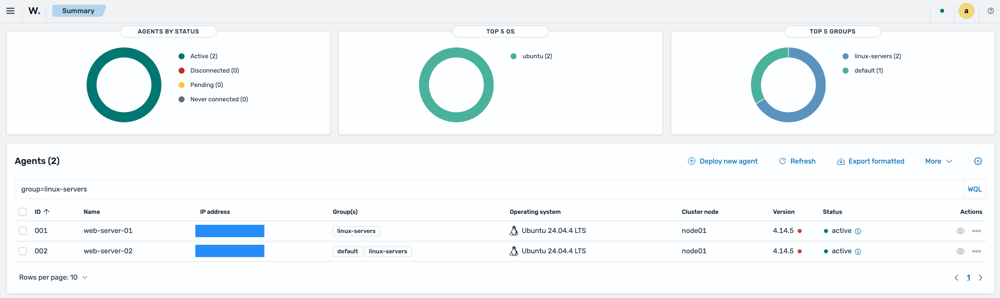
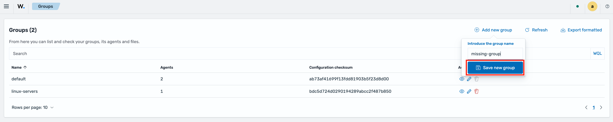
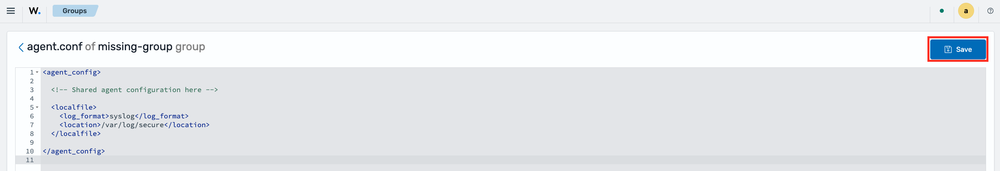
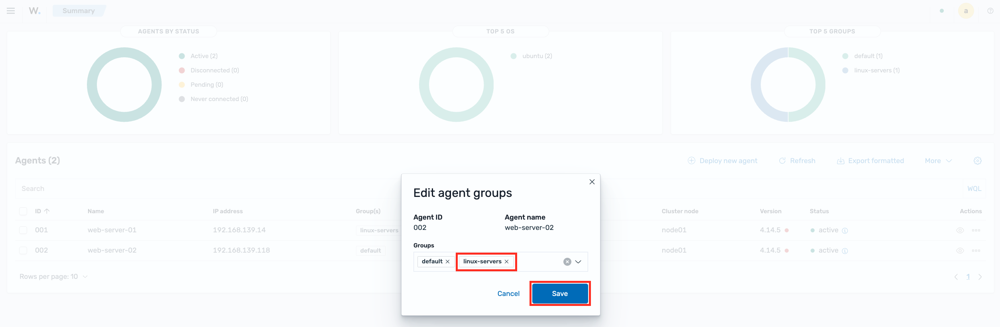
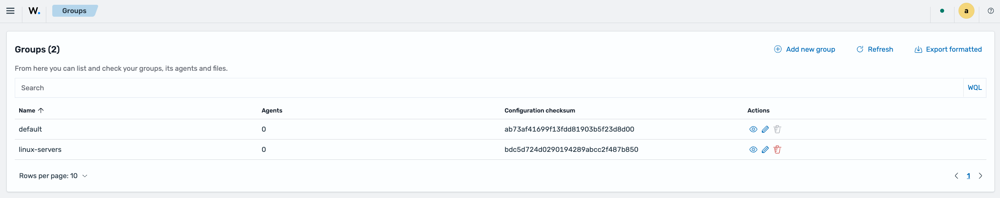

# Migrating Agent Groups to Wazuh 5.0

In Wazuh 4.x, agent group assignments were stored in the manager's `global.db` database and shared group configurations lived under `/var/ossec/etc/shared/`. Each group folder contained an `agent.conf` and a compiled `merged.mg` file that the manager pushed to agents on check-in.

Starting with Wazuh 5.0, the manager installation path changed from `/var/ossec/` to `/var/wazuh-manager/`. Group configurations still reside under the same relative path (`etc/shared/`), but the absolute paths have changed. Group membership is also no longer inferred by the manager: the agent declares its group during the **enrollment handshake**, and the manager stores that assignment in `global.db`. This means an agent will only be placed in its original group if that group is configured on the agent **before** it (re)enrolls. There is no automatic checksum-based group guessing in Wazuh 5.0. The full mechanism is covered in [How group assignment works](#how-group-assignment-works) below.

> There is no automatic migration tooling for agent groups. You must manually transfer your group configuration files to the new manager before reconnecting any agents.

## How group assignment works

Group assignment in Wazuh 5.0 is driven by the agent's enrollment:

1. **Enrollment (the handshake that carries the group).** When an agent enrolls (registers) with the manager, it includes the group(s) configured in its `ossec.conf` under `<enrollment><groups>`. The manager's enrollment service (`wazuh-manager-authd`) validates the group and writes the assignment into `global.db`. If the declared group does not exist on the manager, **enrollment is rejected and the agent cannot connect**.
2. **Persistence.** The assignment persists in `global.db` and survives agent and manager restarts, so it does not need to be resent on every connection.
3. **Reconnection.** On each keepalive, the manager looks up the agent's group in `global.db` and, if found, compiles and pushes that group's shared configuration. If no group is recorded for the agent, the manager assigns the `default` group.

> [!IMPORTANT]
> Earlier Wazuh versions could *guess* an agent's group by matching its `merged.mg` checksum against the groups present on the manager (the `remoted.guess_agent_group` internal option). **This mechanism has been removed in Wazuh 5.0.** A reconnecting agent that has no group configured in its `ossec.conf` and no prior assignment in `global.db` will be placed in the `default` group. To restore its original group you must either re-enroll the agent with the group configured, or assign the group manually (see [Workaround: manual group assignment](#workaround-manual-group-assignment)).

## Prerequisites

This guide assumes you will **back up the group configurations from the 4.x manager and then perform a fresh Wazuh 5.0 installation**, typically on the same host, removing 4.x and installing 5.0 in its place. The migration is carried through the backup you take *before* removing 4.x.

Before proceeding, make sure you have:

- Root or terminal access to the manager host
- The group configured on each agent's `ossec.conf` under `<enrollment><groups>`, so the group is sent on enrollment (recommended, not a blocker)
- **Agents stopped**, and kept stopped until the group folders are restored and each agent's group is configured. Otherwise, an agent that reconnects mid-migration is either assigned the `default` group (if it declares no group) or has its enrollment rejected and cannot connect (if it declares a group that does not yet exist on the manager).
  To turn off an agent:
  ```bash
  # On each agent
  systemctl stop wazuh-agent
  ```
  For large deployments, apply this across hosts using your orchestration tooling (Ansible, an SSH loop, MDM, GPO, etc.).

## Migration steps

### 1. Back up group configurations from the 4.x manager

On the **4.x manager**, archive the group folders under `shared/`, excluding the runtime-generated `merged.mg`:

```bash
cd /var/ossec/etc
tar -cvzf /tmp/wazuh_groups_backup.tar.gz --exclude='*/merged.mg' shared/*/
```

The `shared/*/` glob matches only the group folders, so non-group files in `shared/` (such as `ar.conf` and `agent-template.conf`) are left out.

To migrate only specific groups, replace `shared/*/` with the folder names:

```bash
cd /var/ossec/etc
tar -cvzf /tmp/wazuh_groups_backup.tar.gz --exclude='*/merged.mg' \
    shared/<group-name-1>/ shared/<group-name-2>/
```

The archive will contain only the customized `agent.conf` files and any additional files you placed in each group folder.

Keep this archive somewhere that **survives the reinstall** (for example, off the host or on external storage), so it is not lost when you remove 4.x.

### 2. Restore group configurations on the 5.x manager

> [!IMPORTANT]
> Complete this step **before** connecting any agents to the 5.0 manager. The manager validates the declared group during enrollment: if an agent enrolls with a `<groups>` value that does not yet exist on the manager, **enrollment is rejected and the agent cannot connect**. (An agent with no `<groups>` tag still connects and lands in `default`.)

After installing Wazuh 5.0, copy the backup archive back onto the manager host, then extract it and fix ownership:

```bash
tar -xvzf /tmp/wazuh_groups_backup.tar.gz -C /var/wazuh-manager/etc/
chown -R wazuh-manager:wazuh-manager /var/wazuh-manager/etc/shared/
```

Verify the group folders were restored:

```bash
ls /var/wazuh-manager/etc/shared/
```

> [!WARNING]
> **Configuration validity:** The restored `agent.conf` files must be valid for Wazuh 5.0. Any deprecated options or renamed tags from the 4.x configuration format will cause the shared configuration to fail to compile. Review each group's `agent.conf` against the Wazuh 5.0 reference documentation and remove or update any incompatible settings before proceeding.

### 3. Ensure each agent has its group configured

On every **agent** that should belong to a non-default group, confirm the group is set in `/var/ossec/etc/ossec.conf`:

```xml
<enrollment>
  <enabled>yes</enabled>
  <groups>group-name</groups>
</enrollment>
```

> [!IMPORTANT]
> An agent showing a group on the 4.x dashboard does **not** necessarily mean that group is in its `ossec.conf`. Depending on how it was deployed or assigned, the membership may exist only on the manager. Check the agent's `ossec.conf` rather than relying on the dashboard.
>
> If an agent starts without a group configured, it will fall into the `default` group and you must [assign its group manually](#workaround-manual-group-assignment).

### 4. Start the agents and verify group assignment

With the group folders in place and each agent's group configured, start each agent. The group is only sent when the agent **enrolls**, so an agent still holding a stale key from the old manager must enroll fresh.

Clear its key first, then start it:

```bash
# On each agent
rm -f /var/ossec/etc/client.keys
systemctl start wazuh-agent
```

During enrollment the agent sends its configured group to the manager, which records the assignment in `global.db`. On the following keepalive the manager compiles and pushes the matching group's shared configuration.

> [!WARNING]
> If an agent declares a group that does not exist on the manager, **enrollment is rejected** and the agent cannot connect (`ERROR: Invalid group: <group>. Unable to add agent`). See [Workaround: agent fails to connect (missing group)](#workaround-agent-fails-to-connect-missing-group) to resolve it.

To verify, view the group assignments from the Wazuh dashboard under **Agents management -> Summary**.



You can also check the group assignment for a specific agent using the Wazuh API.

> [!NOTE]
> The API requires an authentication token. Request one from the manager with your API credentials (default user `wazuh`), then reuse it in the calls below. The token can expire, so request a new one if it stops working:
> ```bash
> TOKEN=$(curl -u <user>:<password> -k -X POST \
>     "https://<manager-ip>:55000/security/user/authenticate?raw=true")
> ```

```bash
curl -k -X GET "https://<manager-ip>:55000/agents?agents_list=<agent-id>&select=group" \
     -H "Authorization: Bearer $TOKEN"
```

You have now migrated your agent groups from Wazuh 4.x to Wazuh 5.0.

## Workaround: agent fails to connect (missing group)

If an agent declares a group that does not exist on the manager, **enrollment is rejected** and the agent cannot connect. The agent log shows:

```
wazuh-agentd: ERROR: Invalid group: <group>. Unable to add agent (from manager)
```

To resolve it, do one of the following:

### Option 1: Restore the group first

Make sure the group folder is in place on the manager ([step 2](#2-restore-group-configurations-on-the-5x-manager)), then restart the agent so it re-enrolls.

### Option 2: Create the group manually

This lets the agent connect; you add the group's configuration afterward. From the dashboard, go to **Agents management -> Groups -> Add new group** and enter the name of the missing group, then click **Save new group**:



You can also create it through the Wazuh API:

```bash
curl -k -X POST "https://<manager-ip>:55000/groups" \
     -H "Authorization: Bearer $TOKEN" \
     -H "Content-Type: application/json" \
     -d '{"group_id": "<group-name>"}'
```

Then restart the agent so it re-enrolls with the new group available on the manager.

To add the configuration afterward, either complete the migration of that group ([step 2](#2-restore-group-configurations-on-the-5x-manager)) or edit it from the dashboard: go to **Agents management -> Groups** and, in the **Actions** column, select the pencil icon (**Edit group configuration**) to edit it manually. Once you have finished, click **Save**:



### Option 3: Drop the group from the agent

Remove the `<groups>` tag from the agent's `ossec.conf` so it lands in `default`, then restart the agent and [assign the group manually](#workaround-manual-group-assignment).

## Workaround: manual group assignment

If an agent started without its group configured in `ossec.conf` (so no group was sent during enrollment), it will be in the `default` group. Assign the correct group manually after the agents have reconnected.

From the dashboard, go to **Agents management -> Summary**. In the **Actions** column, click the `...` icon for the agent, then select **Edit groups**. In the popup window, type the group name or pick it from the dropdown list, then click **Save**.



You can also assign it through the Wazuh API:

```bash
# Assign a single agent to a group
curl -k -X PUT "https://<manager-ip>:55000/agents/<agent-id>/group/<group-name>" \
     -H "Authorization: Bearer $TOKEN"
```

For bulk assignment, list the agents in each group and assign them in a loop:

```bash
for agent_id in 001 002 003; do
    curl -k -X PUT "https://<manager-ip>:55000/agents/${agent_id}/group/<group-name>" \
         -H "Authorization: Bearer $TOKEN"
done
```

After manual assignment, restart each agent or wait for the next keepalive cycle for the manager to push the updated `merged.mg`.

## Migration example

The following example walks through a complete migration of a group called `linux-servers` that has a custom `agent.conf`. It uses two agents to show both outcomes: one with the group set in `ossec.conf` (assigned automatically on enrollment) and one without it (which lands in `default` and is fixed with the [manual workaround](#workaround-manual-group-assignment)).

### 4.x state

Group folder on the 4.x manager at `/var/ossec/etc/shared/linux-servers/`:

```bash
# ls -la /var/ossec/etc/shared/linux-servers/
total 8
drwx------ 1 wazuh wazuh  38 Jun  2 18:39 .
drwxrwx--- 1 root  wazuh  92 Jun  2 18:38 ..
-rw-rw---- 1 wazuh wazuh 215 Jun  2 18:39 agent.conf
-rw-r--r-- 1 wazuh wazuh 487 Jun  2 18:39 merged.mg
```

Example `agent.conf`:

```bash
# cat /var/ossec/etc/shared/linux-servers/agent.conf
  <agent_config>
    <localfile>
      <log_format>syslog</log_format>
      <location>/var/log/secure</location>
    </localfile>
    <syscheck>
      <frequency>43200</frequency>
    </syscheck>
  </agent_config>
```

Agents 001 (`web-server-01`) and 002 (`web-server-02`) are members of `linux-servers`.

```bash
# /var/ossec/bin/agent_groups -l -g linux-servers
2 agent(s) in group 'linux-servers':
  ID: 001  Name: web-server-01.
  ID: 002  Name: web-server-02.
```

### Step 1: Export from 4.x

```bash
# cd /var/ossec/etc
# tar -cvzf /tmp/wazuh_groups_backup.tar.gz --exclude='*/merged.mg' shared/linux-servers/
shared/linux-servers/
shared/linux-servers/agent.conf
```

Inspect the archive to confirm contents:

```bash
# tar -tvzf /tmp/wazuh_groups_backup.tar.gz
drwx------ wazuh/wazuh       0 2026-06-02 18:39 shared/linux-servers/
-rw-rw---- wazuh/wazuh     215 2026-06-02 18:39 shared/linux-servers/agent.conf
```

### Step 2: Restore on 5.x

```bash
# tar -xvzf /tmp/wazuh_groups_backup.tar.gz -C /var/wazuh-manager/etc/
shared/linux-servers/
shared/linux-servers/agent.conf
# chown -R wazuh-manager:wazuh-manager /var/wazuh-manager/etc/shared/
# ls -la /var/wazuh-manager/etc/shared/linux-servers/
total 8
drwx------ 1 wazuh-manager wazuh-manager  38 Jun  2 19:31 .
drwxrwx--- 1 wazuh-manager wazuh-manager  78 Jun  2 19:31 ..
-rw-rw---- 1 wazuh-manager wazuh-manager 215 Jun  2 18:39 agent.conf
-rw-r--r-- 1 wazuh-manager wazuh-manager 246 Jun  2 19:31 merged.mg
```

The groups are now visible from the dashboard in **Agents management -> Groups**.



### Step 3: Configure the group on one agent only

To show both outcomes, the group is configured only on **agent 001**.

**Agent 001** (`web-server-01`) is pointed at the 5.0 manager and its group set under `<enrollment>` in `/var/ossec/etc/ossec.conf`:

```bash
# sed -n '/<enrollment>/,/<\/enrollment>/p' /var/ossec/etc/ossec.conf
    <enrollment>
      <enabled>yes</enabled>
      <agent_name>web-server-01</agent_name>
      <groups>linux-servers</groups>
      <authorization_pass_path>etc/authd.pass</authorization_pass_path>
    </enrollment>
```

**Agent 002** (`web-server-02`) is pointed at the same manager **without** the `<groups>` tag. It will land in the `default` group, which is later fixed in [Step 6](#step-6-assign-the-remaining-agent-manually).

```bash
# sed -n '/<enrollment>/,/<\/enrollment>/p' /var/ossec/etc/ossec.conf
    <enrollment>
      <enabled>yes</enabled>
      <agent_name>web-server-02</agent_name>
      <authorization_pass_path>etc/authd.pass</authorization_pass_path>
    </enrollment>
```

### Step 4: Enroll the agents

The group is sent during the enrollment handshake; the agent performs a fresh enrollment. Any stale key from the old manager is cleared and the agent is started.

On each agent:
```bash
# rm -f /var/ossec/etc/client.keys
# systemctl start wazuh-agent
```

### Step 5: Verify

Both agents can be checked from the dashboard under **Agents management -> Summary**:


The same can be confirmed from the API:

```bash
# curl -k -X GET \
     "https://localhost:55000/agents?agents_list=001,002&select=id,name,group" \
     -H "Authorization: Bearer $TOKEN"
```

```json
{
  "data": {
    "affected_items": [
      {"id": "001", "name": "web-server-01", "group": ["linux-servers"]}, 
      {"id": "002", "name": "web-server-02", "group": ["default"]}
    ], 
    "total_affected_items": 2, 
    "total_failed_items": 0, 
    "failed_items": []
  }, 
  "message": "All selected agents information was returned", 
  "error": 0
}
```

Agent 001 enrolled with its group and was assigned `linux-servers`; agent 002 had no group configured and fell into `default`.

### Step 6: Assign the remaining agent manually

Agent 002 landed in `default` because its group was not in `ossec.conf`. From the dashboard, it is assigned to `linux-servers` through **Agents management -> Summary -> Actions -> Edit groups**, where the group is added in the popup and saved:


The same can be done from the API:

```bash
# curl -k -X PUT "https://localhost:55000/agents/002/group/linux-servers" \
     -H "Authorization: Bearer $TOKEN"
```

```json
{
  "data": {
    "affected_items": ["002"], 
    "total_affected_items": 1, 
    "total_failed_items": 0, 
    "failed_items": []
  }, 
  "message": "All selected agents were assigned to linux-servers", 
  "error": 0
}
```

Both agents now belong to `linux-servers`:


The same can be confirmed from the API:

```bash
# curl -k -X GET \
     "https://localhost:55000/agents?agents_list=001,002&select=id,name,group" \
     -H "Authorization: Bearer $TOKEN"
```

```json
{
  "data": {
    "affected_items": [
      {"id": "001", "name": "web-server-01", "group": ["linux-servers"]}, 
      {"id": "002", "name": "web-server-02", "group": ["default", "linux-servers"]}
    ], 
    "total_affected_items": 2, 
    "total_failed_items": 0, 
    "failed_items": []
  }, 
  "message": "All selected agents information was returned", 
  "error": 0
}
```

### Step 7 (Optional): Remove the `default` group from agent 002

Assigning a group **adds** it, so agent 002 keeps its original `default` membership alongside `linux-servers`. To leave it in `linux-servers` only, `default` is removed from the same **Agents management -> Summary -> Actions -> Edit groups** dialog, by clearing the `default` entry in the popup and saving:


The same can be done through the API:

```bash
# curl -k -X DELETE "https://localhost:55000/agents/002/group/default" \
     -H "Authorization: Bearer $TOKEN"
```

```json
{
  "message": "Agent '002' removed from 'default'.", 
  "error": 0
}
```
