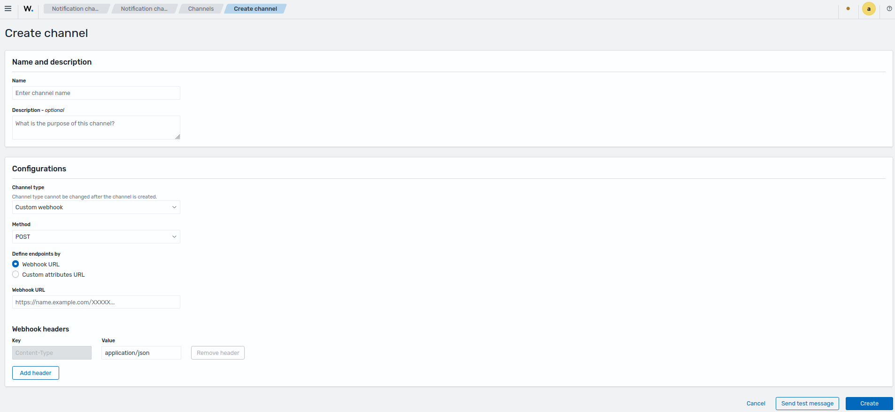
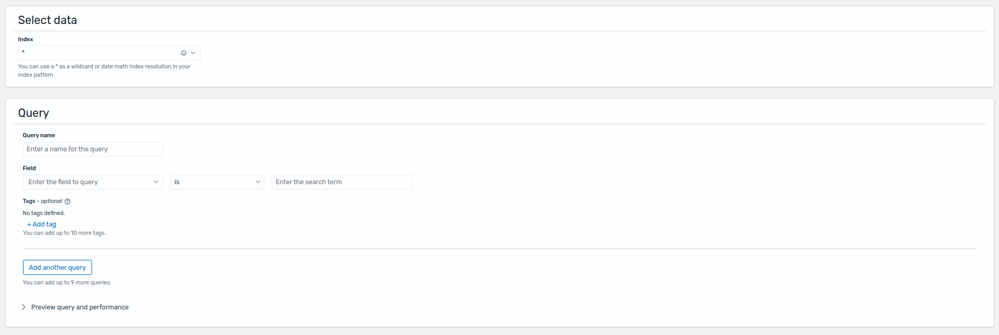
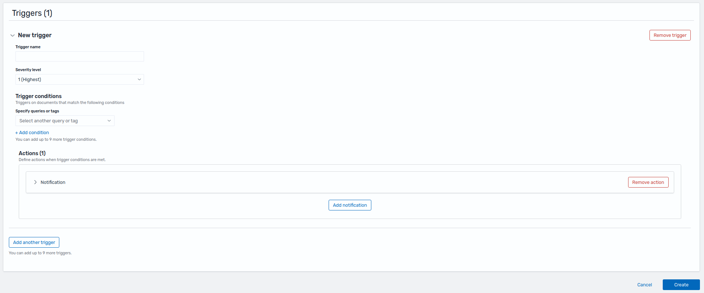
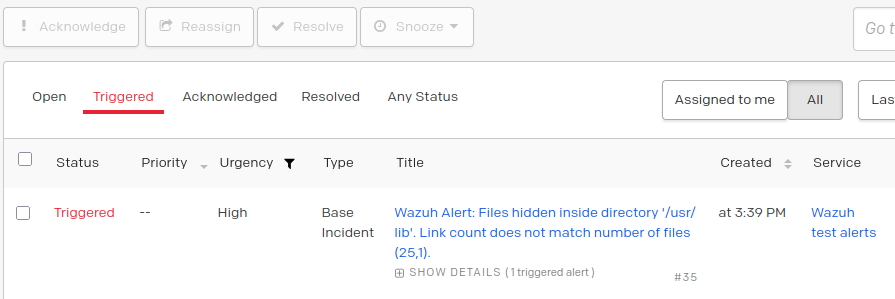
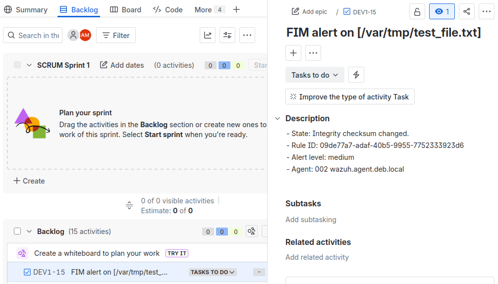

# Migrating Integratord to Dashboard Notifications

In Wazuh 4.x, third-party integrations were configured directly in `ossec.conf` on the manager using `<integration>` blocks, handled by the `integratord` daemon.

Wazuh 5.x replaces this approach with two dashboard plugins:

- **Notifications** — manages shared channels and connection settings for third-party services.
- **Alerting** — creates monitors that scan data and send messages through those channels.

All integration configuration is now done from the dashboard, with no changes required to `ossec.conf`.

---

> **⚠️ Warning:** The Notifications plugin does not support bi-directional integrations such as Maltiverse or Virustotal, which were previously supported by `integratord`. These threat enrichment integrations are now handled through [Security Analytics enrichments](#enrichment-integrations).

> **Note:** This migration must be performed manually. There is no automatic tool to convert `<integration>` blocks from `ossec.conf` to the Wazuh 5.x dashboard configuration.

## Configuration mapping 4.x → 5.x

The following tables map each `<integration>` field from Wazuh 4.x to its equivalent location in the 5.x dashboard.

### Required configuration → Notifications channel

Configure these fields at **Explore > Notifications > Channel**.

| 4.x field        | 5.x field    | Notes                        |
| ---------------- | ------------ | ---------------------------- |
| `<name>`         | Channel name | Identifies the channel       |
| `<hook_url>`     | Webhook URL  | Endpoint for the integration |
| `<api_key>`      | Headers      | Passed as a request header   |
| `<alert_format>` | Headers      | Passed as a request header   |

> **Note:** Not all fields are required for every integration. For example, Slack requires `<hook_url>` but not `<api_key>`. Channels in 5.x offer a broader set of configuration options than 4.x.

### Optional filters → Alerting monitors

Configure these fields at **Explore > Alerting > Monitors**.

| 4.x field          | 5.x equivalent           | Notes                                                                                                                            |
| ------------------ | ------------------------ | -------------------------------------------------------------------------------------------------------------------------------- |
| `<rule_id>`        | Monitor query            | Monitors use queries on index patterns instead of rule matching. The matching field is `wazuh.rule.id`.                          |
| `<level>`          | Monitor query            | In 4.x the tag was a threshold, but in 5.x it's a value between `{low, medium, high}`. The matching field is `wazuh.rule.level`. |
| `<group>`          | Monitor query            | The group tag referred to the internal Wazuh component that generated the data. Now, its represented by `wazuh.integration.name` |
| `<event_location>` | Monitor query            | The 4.x field matched Wazuh modules or log sources via regex; in 5.x, queries using fields like `log.file.value`                 |
| `<options>`        | Trigger → Action message | See below                                                                                                                        |



#### From `<options>` to trigger actions

In 4.x, the `<integration>` block invoked a built-in script (referenced by `<name>`) that sent a default JSON payload to the external service. The `<options>` block allowed appending extra fields to that payload.

In 5.x, the monitor defines a **Trigger** containing one or more **Actions**. Each action targets a channel and includes a fully user-defined message body — there is no default payload. This gives full control over the content sent to the external integration.




### Use case mapping

In 4.x, each use case could involve multiple `<integration>` blocks paired with different scripts. Custom integrations without a built-in script were also supported by providing your own.

The table below maps some examples on 4.x to their 5.x equivalents:

| 4.x setup                                                                                             | 5.x equivalent                                                                                                                                                                                 |
| ----------------------------------------------------------------------------------------------------- | ---------------------------------------------------------------------------------------------------------------------------------------------------------------------------------------------- |
| One `<integration>` block + one script                                                                | One channel, one monitor with one query per filter, and one trigger                                                                                                                            |
| Multiple `<integration>` blocks with the same required config, different filters, same script         | One channel; one monitor per distinct `<event_location>` (different index patterns), or one monitor with multiple queries                                                                      |
| Multiple `<integration>` blocks with different required config (different hooks or auth), same script | One channel per distinct connection config; one or more monitors per channel with their own queries and triggers                                                                               |
| Multiple `<integration>` blocks with the same config, different scripts                               | One channel; one monitor with one trigger per script, each trigger having an action with a distinct message payload                                                                            |
| No equivalent                                                                                         | More than one channel (for different integrations) with one monitor — one trigger with one action per channel, sharing the same query conditions but targeting different channels/integrations |

The 5.x plugins provide a significantly more flexible configuration model. A typical migration results in one channel per external service and one or more monitors combining queries and triggers to cover all the previous `<integration>` blocks.

## Wazuh 4.x example

Below there is a set of configurations made in Wazuh 4.x, you can use it as reference to follow the migration steps.

> **Note:** Jira is an integration without a default script in 4.x — expand below to see how to create one.

<details>
<summary>Creating the custom-jira script for Wazuh 4.x</summary>

1. Create the script file at `/var/ossec/integrations/custom-jira`:

```python
#!/var/ossec/framework/python/bin/python3

import sys
import json
import requests
from requests.auth import HTTPBasicAuth

# Read configuration parameters
alert_file = open(sys.argv[1])
user = sys.argv[2].split(':')[0]
api_key = sys.argv[2].split(':')[1]
hook_url = sys.argv[3]

# Read the alert file
alert_json = json.loads(alert_file.read())
alert_file.close()

# Extract issue fields
alert_level = alert_json['rule']['level']
ruleid = alert_json['rule']['id']
description = alert_json['rule']['description']
agentid = alert_json['agent']['id']
agentname = alert_json['agent']['name']
path = alert_json['syscheck']['path']

# Set the project attributes ===> This section needs to be manually configured before running!
project_key = 'YOUR_PROJECT_SPACE_KEY'     # You can get this from the beginning of an issue key. For example, WS for issue key WS-5018
issuetypeid = '10003'  # Check https://confluence.atlassian.com/jirakb/finding-the-id-for-issue-types-646186508.html. There's also an API endpoint to get it.

# Generate request
headers = {'content-type': 'application/json'}
issue_data = {
    "update": {},
    "fields": {
        "summary": 'FIM alert on [' + path + ']',
        "issuetype": {
            "id": issuetypeid
        },
        "project": {
            "key": project_key
        },
        "description": {
            'version': 1,
            'type': 'doc',
            'content':  [
                    {
                      "type": "paragraph",
                      "content": [
                        {
                          "text": '- State: ' + description + '\n- Rule ID: ' + str(ruleid) + '\n- Alert level: ' + str(alert_level) + '\n- Agent: ' + str(agentid) + ' ' + agentname,
                          "type": "text"
                        }
                      ]
                    }
                  ],
        },
    }
}

# Send the request
response = requests.post(hook_url, data=json.dumps(issue_data), headers=headers, auth=(user, api_key))
print(json.dumps(json.loads(response.text), sort_keys=True, indent=4, separators=(",", ": "))) # <--- Uncomment this line for debugging

sys.exit(0)
```

2. Set the correct permissions:

```bash
chmod 750 /var/ossec/integrations/custom-jira
chown root:wazuh /var/ossec/integrations/custom-jira
```

3. Add the `<integration>` block to `ossec.conf` referencing the script name (`custom-jira`).

</details>

```xml
<ossec_config>

    <integration>
        <name>slack</name>
        <hook_url>YOUR_SLACK_WEBHOOK</hook_url>
        <rule_id>10002</rule_id>
        <alert_format>json</alert_format>
    </integration>

    <integration>
        <name>pagerduty</name>
        <api_key>YOUR_INTEGRATION_KEY</api_key>
        <level>14</level>
        <alert_format>json</alert_format>
    </integration>

    <integration>
        <name>custom-webhook</name>
        <hook_url>WEBHOOK_URL</hook_url>
        <api_key>API_KEY</api_key>
        <level>8</level>
        <alert_format>json</alert_format>
    </integration>

    <integration>
        <name>custom-jira</name>
        <group>syscheck</group>
        <level>9</level>
        <hook_url>YOUR_JIRA_HOOK_URL</hook_url>
        <api_key>EMAIL:API_KEY</api_key>
        <alert_format>json</alert_format>
    </integration>

    <integration>
        <name>virustotal</name>
        <api_key>YOUR_API_KEY</api_key>
        <group>syscheck</group>
        <level>10</level>
        <alert_format>json</alert_format>
    </integration>

    <integration>
        <name>maltiverse</name>
        <hook_url>https://api.maltiverse.com</hook_url>
        <api_key>YOUR_API_KEY</api_key>
        <level>5</level>
        <alert_format>json</alert_format>
    </integration>

</ossec_config>
```

## Migration steps

The steps below show one possible way to migrate the 4.x reference configuration to Wazuh 5.x. Use them as a guide and adapt the configuration to your own needs.

### 1. Configure the Notifications channel

Navigate to **Explore > Notifications > Channels**.

#### 1.1 Using default channels

Wazuh ships a set of pre-configured channels that are muted by default. To use one, un-mute it and fill in the required credentials. Each channel includes a brief description with configuration instructions.

**Example — PagerDuty channel:**

1. Un-mute the channel.
2. Edit the channel and enter the `<api_key>` from your 4.x config in the `X-Routing-Key` field under **Webhook headers**.
3. Optionally update the channel name and description.

**Example — Jira channel:**

1. Un-mute the channel.
2. Edit the channel and enter the `<hook_url>` from your 4.x config on the **Webhook URL**
3. In 4.x the `<api_key>` had the structure `email:token`, in 5.x encode the string in base64 and then set the value `Basic encodedString` in the `Authentication` header under **Webhook headers**.

> **Note:** The PagerDuty and Jira example continue in [step 2](#2-create-one-or-more-monitors-using-the-alerting-plugin) below.

#### 1.2 Creating a custom channel

In 4.x, built-in scripts existed for `Slack`, `PagerDuty`, `Shuffle`, `Maltiverse`, and `Virustotal`. In 5.x, pre-configured channels are available for `Slack`, `PagerDuty`, `Shuffle`, and `Jira`.

> **⚠️ Warning:** `Maltiverse`, `Virustotal`, and other bi-directional or threat enrichment integrations cannot be migrated to the Notifications plugin. See [enrichment integrations](#enrichment-integrations).

For any other custom integration from 4.x, create a new channel using one of the types below.

##### 1.2.1 Default channel type

Wazuh 5.x provides dedicated channel types for common services such as `Slack`, `Chime`, and `Email`. These simplify setup — for `Chime`, for example, only a webhook URL is required.

##### 1.2.2 Custom webhook channel type

For integrations without a dedicated channel type, use the **Custom webhook** type. This is also the underlying type used by the Wazuh-provided `PagerDuty`, `Jira`, and `Shuffle` channels.

Custom webhook channels support:

- Methods: `PUT`, `POST`, or `PATCH`
- Endpoint definition: webhook URL or a custom URL with query parameters
- Custom headers: e.g. `Authorization`, `Content-Type`

---

### 2. Create one or more monitors using the Alerting plugin

With channels configured, create monitors that query data and send messages through those channels.

Navigate to **Explore > Alerting > Create Monitor**.

#### 2.1 Basic configuration

A monitor defines the indexes, schedule, and query/trigger/action structure. Because a single monitor supports multiple queries, triggers, and actions, the basic configuration determines whether you need one monitor or several.

**Example — Security Monitor (reusable for PagerDuty, Slack, Jira, and Shuffle):**

| Field         | Value                        |
| ------------- | ---------------------------- |
| Monitor name  | Security Monitor             |
| Monitor type  | Per document monitor         |
| Schedule      | By interval — every 1 minute |
| Index pattern | `wazuh-findings-v5-security` |

#### 2.2 Queries

A single monitor can have multiple queries. Create one query for each filter condition you had in 4.x.

**Example query for PagerDuty:**

In the PagerDuty example, the original `<level>14</level>` maps to `wazuh.rule.level` is `high` in 5.x.

| Field      | Value                   |
| ---------- | ----------------------- |
| Query name | `high_security_finding` |
| Field      | `wazuh.rule.level`      |
| Operator   | `is`                    |
| Value      | `high`                  |

**Example queries for Jira:**

In the Jira example, the original `<group>syscheck</group>` was a group for rules related to FIM (File integrity monitoring), so that maps to the `wazuh.integration.name` is `wazuh-fim` and the `<level>9</level>` maps to `wazuh.rule.level` is `medium` in 5.x.

| Field      | Value                     |
| ---------- | ------------------------- |
| Query name | `medium_security_finding` |
| Field      | `wazuh.rule.level`        |
| Operator   | `is`                      |
| Value      | `medium`                  |

| Field      | Value                    |
| ---------- | ------------------------ |
| Query name | `fim_integration`        |
| Field      | `wazuh.integration.name` |
| Operator   | `is`                     |
| Value      | `wazuh-fim`              |

#### 2.3 Triggers

A monitor can have multiple triggers, and each trigger can reference multiple queries.

**Example trigger for PagerDuty:**

| Field              | Value                                    |
| ------------------ | ---------------------------------------- |
| Trigger name       | High level threat                        |
| Severity level     | 1 (Highest)                              |
| Trigger conditions | `high_security_finding` (query from 2.2) |

**Example trigger for Jira:**

| Field              | Value                                                          |
| ------------------ | -------------------------------------------------------------- |
| Trigger name       | Medium level threat                                            |
| Severity level     | 3 (Medium)                                                     |
| Trigger conditions | `medium_security_finding AND fim_integration` (query from 2.2) |

#### 2.4 Actions

Each trigger can have multiple actions, allowing a single trigger to notify more than one channel.

**Example action for PagerDuty:**

1. Add a new notification.
2. Set **Action name** to `PagerDuty Incident`.
3. Set **Channel** to `PagerDuty Channel`.
4. Set the **Message** to the payload below.
5. Send a test message — you should see a test incident appear in your PagerDuty account.

> **⚠️ Warning:** The message payload must match the format expected by the receiving integration. If the format is incorrect, no event will appear on the external side. Consult each integration's API documentation before sending.

The following payload replicates what the default 4.x PagerDuty script sent:

```json
{
  "event_action": "trigger",
  "payload": {
    "summary": "Wazuh Alert: {{ctx.alerts.0.sample_documents.0._source.event.original}}",
    "source": "{{ctx.alerts.0.sample_documents.0._source.wazuh.agent.name}}",
    "severity": "critical",
    "custom_details": {
      "Rule ID": "{{ctx.alerts.0.sample_documents.0._source.wazuh.rule.id}}",
      "Rule Level": "{{ctx.alerts.0.sample_documents.0._source.wazuh.rule.level}}",
      "Agent OS": "{{ctx.alerts.0.sample_documents.0._source.wazuh.agent.host.os.name}}",
      "File Path": "{{ctx.alerts.0.sample_documents.0._source.file.path}}",
      "Monitor Name": "{{ctx.monitor.name}}"
    }
  }
}
```



**Example action for Jira:**

1. Add a new notification.
2. Set **Action name** to `Jira task ticket`.
3. Set **Channel** to `Jira Channel`.
4. Set the **Message** to the payload below.
5. Send a test message — a task should have been created in your Jira project.

> **⚠️ Warning:** Change `YOUR_PROJECT_SPACE_KEY` to the space key you can find in your Jira project details, this was configured directly onto the script in 4.x, the same goes for the issue id, in this example 10003 is for tasks, but it could be different for your project, so change accordingly.

The following payload is an example to create a task:

```json
{
  "fields": {
    "project": {
      "key": "YOUR_PROJECT_SPACE_KEY"
    },
    "issuetype": {
      "id": "10003"
    },
    "summary": "FIM alert on [{{ctx.alerts.0.sample_documents.0._source.file.path}}]",
    "description": {
      "version": 1,
      "type": "doc",
      "content": [
        {
          "type": "paragraph",
          "content": [
            {
              "type": "text",
              "text": "- State: {{ctx.alerts.0.sample_documents.0._source.wazuh.rule.title}}\n- Rule ID: {{ctx.alerts.0.sample_documents.0._source.wazuh.rule.id}}\n- Alert level: {{ctx.alerts.0.sample_documents.0._source.wazuh.rule.level}}\n- Agent: {{ctx.alerts.0.sample_documents.0._source.wazuh.agent.id}} {{ctx.alerts.0.sample_documents.0._source.wazuh.agent.name}}"
            }
          ]
        }
      ]
    }
  }
}
```



For building message payloads with dynamic variables, refer to:

- [Mustache templates](https://mustache.github.io/mustache.5.html)
- [Monitor variables](https://docs.opensearch.org/latest/observing-your-data/alerting/monitors/)
- [Trigger variables](https://docs.opensearch.org/latest/observing-your-data/alerting/triggers/)
- [Action variables](https://docs.opensearch.org/latest/observing-your-data/alerting/actions/)

## Enrichment integrations

The `integratord` daemon supported integrations like `Maltiverse` and `Virustotal`, these integrations received the alert that matched the `<integration>` block and after processing the alert, it was returned to wazuh with enriched information, creating a new alert in the process.

The **Notifications** and **Alerting** plugins do not support this workflow directly (simply using channels and monitors), but the new **Security Analytics** plugin manages the creation of `Integrations`, `Decoders`, ... and the user can configure a series of pre-set enrichments for the custom spaces, meaning that the enrichment integrations are now integrated with the **Security Analytics** plugin. See the `Wazuh dashboard > Modules > Security Analytics` documentation to create these integrations in 5.x.

After creating and testing the channel and monitors you have successfully migrated your 4.x integratord configuration.
