# Migrating Mail Forwarding and Reporting to Dashboard Notifications

In previous Wazuh versions (4.x), email alerts and reporting were configured directly in the Wazuh manager's `ossec.conf` file using the `<email_alerts>`, `<reports>`, and related global SMTP configuration blocks.

Starting with Wazuh 5.0, these backend mail forwarding capabilities have been removed from the manager. Mail forwarding and scheduled reporting must now be configured directly through the Wazuh Dashboard using the **Notifications**, **Alerting**, and **Reporting** Dashboard plugins.

> **Note:** There is no automatic upgrade tooling to migrate your existing Wazuh 4.x email configurations. You must manually recreate your alerting and reporting logic in the Wazuh Dashboard. Use the mapping tables below to identify which Wazuh 5.x feature corresponds to each element in your `ossec.conf`.

## Configuration mapping (4.x -> 5.x)

The following table maps each `ossec.conf` element from Wazuh 4.x to the corresponding feature in the Wazuh 5.x Dashboard. Entries use the form `section.element` - for example, `global.smtp_server` refers to `<global><smtp_server>` in your `ossec.conf`.

> See the [ossec.conf reference](#wazuh-4x-ossecconf-reference) below for the full XML context of each section.

### Email alerts mapping

| 4.x `ossec.conf`              | 5.x Dashboard                                    | Guide                                                                         |
| ----------------------------- | ------------------------------------------------ | ----------------------------------------------------------------------------- |
| `global.smtp_server`          | Notifications > Email Senders (SMTP host/port)   | [Step 1](#1-creating-an-email-sender)                                         |
| `global.email_from`           | Notifications > Email Senders (outbound address) | [Step 1](#1-creating-an-email-sender)                                         |
| `email_alerts.email_to`       | Notifications > Email Recipient Groups           | [Step 2](#2-creating-an-email-recipient-group)                                |
| `<email_alerts>` filter block | Alerting > Monitor > Query                       | [Step 4](#4-recreating-email-alerts-with-monitors)                            |
| `<alerts><email_alert_level>` | `---`                                            | No direct equivalent - see [Step 4](#4-recreating-email-alerts-with-monitors) |

### Reports mapping

| 4.x `ossec.conf`   | 5.x Dashboard                                            | Guide                                     |
| ------------------ | -------------------------------------------------------- | ----------------------------------------- |
| `reports.title`    | Reporting > Report Definition > Name                     | [Step 5](#5-recreating-scheduled-reports) |
| `reports.email_to` | Reporting > Report Definition > Notification > Channels  | [Step 5](#5-recreating-scheduled-reports) |
| `reports.showlogs` | Reporting > Report Definition > (include details toggle) | [Step 5](#5-recreating-scheduled-reports) |

## Wazuh 4.x ossec.conf reference

Below are the typical Wazuh 4.x configuration blocks you may have in your `ossec.conf`. Use them as a reference when following the migration steps.

```xml
<!-- Wazuh 4.x ossec.conf -->
<global>
  <smtp_server>mail.example.com</smtp_server>
  <email_from>wazuh@example.com</email_from>
</global>

<alerts>
  <email_alert_level>10</email_alert_level>
</alerts>

<email_alerts>
  <email_to>security@example.com</email_to>
  <level>12</level>
  <group>sshd,</group>
  <do_not_delay/>
</email_alerts>

<reports>
  <title>Daily Vulnerability Report</title>
  <group>vulnerability-detector,</group>
  <level>10</level>
  <email_to>security@example.com</email_to>
  <showlogs>yes</showlogs>
</reports>
```

## Migration steps

### Prerequisites

Before proceeding, make sure you have:

- Wazuh 5.0 or later fully deployed (indexer, manager, dashboard)
- Access to the Wazuh Dashboard as an administrator
- SMTP server credentials or Amazon SES configuration
- Recipient email addresses ready

> These steps must be followed **in order**, as each step depends on resources created in the previous one.

## 1. Creating an Email Sender

Before creating an email channel, you must set up an outbound email server by creating a sender. You can choose to configure either an SMTP or an Amazon SES sender.

In your Wazuh 4.x `ossec.conf`, the [`global.smtp_server`](#email-alerts-mapping) and [`global.email_from`](#email-alerts-mapping) settings configured the SMTP relay and outbound email address used for all alerts. In Wazuh 5.0, both values are now part of the email sender configuration below.

1. Open the Wazuh Dashboard and navigate to the **Notifications** plugin.
2. Go to **Email senders**.

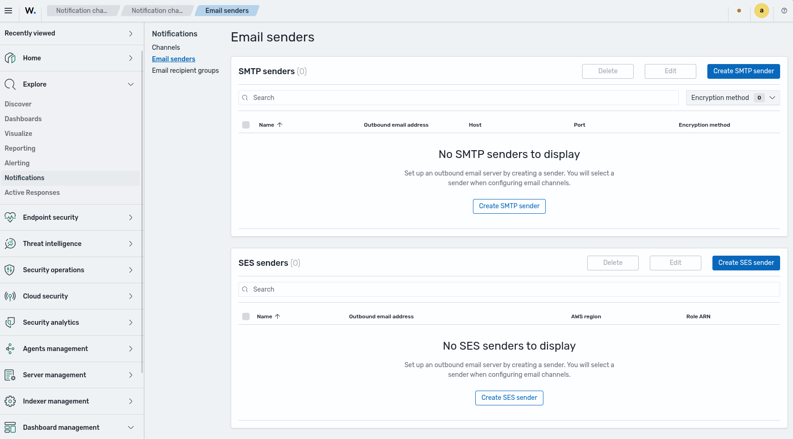

### Option A: Creating an SMTP Sender

1. Click **Create SMTP sender**.
2. Provide a **Name** for the sender (e.g., `wazuh-security-smtp-sender`).
3. Enter the **Outbound email address** (this replaces [`global.email_from`](#email-alerts-mapping) in Wazuh 4.x). For example, `noreply@wazuh.local`.
4. Specify the **Host** (this replaces [`global.smtp_server`](#email-alerts-mapping) in Wazuh 4.x) - e.g., `mailpit` - and the **Port** - e.g., `1025`.
5. Select the **Encryption method** (e.g., `None`).
   > **Note:** SSL/TLS or STARTTLS is recommended for security. To use either one, you must authenticate each sender account via the OpenSearch keystore — see steps 6-7 below.
6. If you selected SSL/TLS or STARTTLS, authenticate the sender account by storing its credentials in the OpenSearch keystore. On **each indexer node**, run the following commands via the terminal (replace `<sender_name>` with the name you entered in step 2):

   ```
   /usr/share/opensearch/bin/opensearch-keystore add opensearch.notifications.core.email.<sender_name>.username
   /usr/share/opensearch/bin/opensearch-keystore add opensearch.notifications.core.email.<sender_name>.password
   ```

7. After adding credentials to all nodes, go to the Wazuh Dashboard **DevTools** and call the reload API to apply the changes without restarting OpenSearch:

   ```
   POST _nodes/reload_secure_settings
   {
     "secure_settings_password": "..."
   }
   ```

8. Click **Create** to save the sender.

> **Wazuh 4.x note:** SMTP authentication was not supported in Wazuh 4.x - users typically relayed through a local Postfix or similar MTA. In Wazuh 5.0, the Wazuh Dashboard **Notifications** plugin supports SMTP authentication directly via the OpenSearch keystore. Certificate-based SMTP authentication (e.g., Postfix with TLS client certificates) is not supported by the Wazuh Dashboard **Notifications** plugin in the current release.

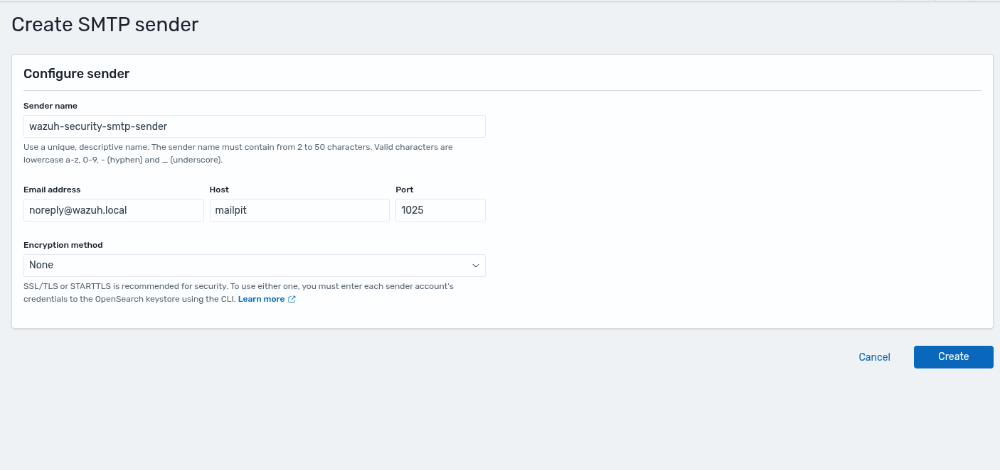

### Option B: Creating an Amazon SES Sender

1. Click **Create SES sender**.
2. Provide a **Name** for the sender.
3. Enter the **Outbound email address**.
4. Specify your **AWS region** and **Role ARN**.
5. Click **Create** to save the sender.


## 2. Creating an Email Recipient Group

To easily manage multiple destination email addresses, you can configure an Email Recipient Group.

Where in Wazuh 4.x you set [`email_alerts.email_to`](#email-alerts-mapping) directly in `ossec.conf`, in Wazuh 5.0 email destinations are managed as reusable recipient groups that can be shared across multiple channels and report definitions.

1. In the **Notifications** plugin, go to **Email recipient groups**.


2. Click **Create recipient group**.
3. Enter a **Name** for the group (e.g., `wazuh-security-recipients`).
4. (Optional) Provide a **Description** explaining the purpose of this group (e.g., `Recipients of scheduled security reports and alerts.`).
5. In the **Emails** field, type or select one or more email addresses (e.g., `wazuh-security-recipients@test.com`).


6. Click **Create** to save the recipient group.

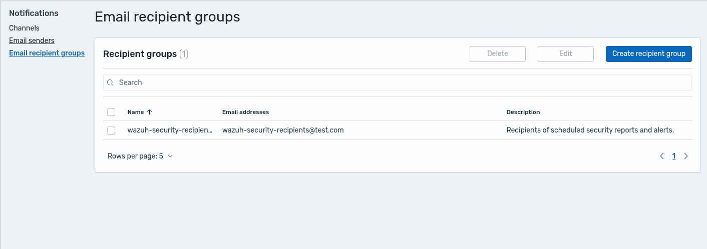

## 3. Setting up an Email Notification Channel

With your sender and recipient group created, you can now set up the Notification Channel.

1. In the **Notifications** plugin, go to **Channels** and click **Create channel**.

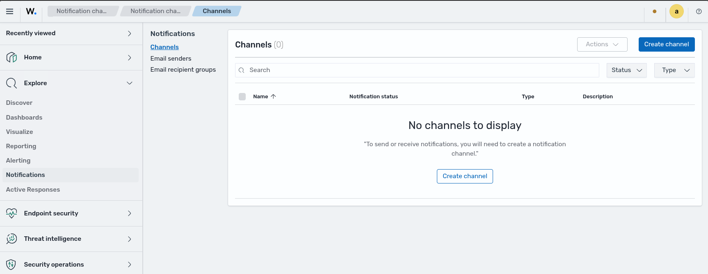

2. Enter a **Name** for the channel (e.g., `wazuh-security-mail-channel`).
3. (Optional) Provide a **Description** clarifying the purpose of this channel (e.g., `Email channel used to deliver Wazuh security alerts, findings, and incident notifications.`)
4. Under **Configurations**, select **Email** as the **Channel type**.
5. Choose your **Sender type** (e.g., **SMTP sender**).
6. In the **SMTP sender** field, select the sender you created in [Step 1](#1-creating-an-email-sender) (e.g., `wazuh-security-smtp-sender`).
7. Under **Default recipients**, select the recipient group you created in [Step 2](#2-creating-an-email-recipient-group) (e.g., `wazuh-security-recipients`).


8. (Optional) Click **Send test message** to verify your configuration.
9. Click **Create** to save the channel.


## 4. Recreating Email Alerts with Monitors

In Wazuh 4.x, you used [`<email_alerts>`](#email-alerts-mapping) blocks in `ossec.conf` with filters like `<level>`, `<group>`, `<rule_id>`, and `<event_location>` to determine which alerts triggered email notifications. In Wazuh 5.0, there is no separate "alerts" entity - the Alerting plugin operates on **monitor queries** that can target any index pattern you choose.

> **Monitor data sources:** In Wazuh 4.x, alerts were stored in a dedicated alerts index (`wazuh-alerts-*`). In Wazuh 5.0, that index no longer exists. Instead, the Alerting plugin can query any index pattern you configure - for example, `wazuh-findings-v5*`, `wazuh-events-v5*`, or a custom index. If your query relies on rule metadata fields (`wazuh.rule.*`), you must target a findings index, since only findings carry those fields. For other use cases, you can create monitors against other index patterns.

In Wazuh 4.x, alert severity was expressed as a numeric `rule.level` (0–15), and the `<level>` filter in `<email_alerts>` selected a threshold. In Wazuh 5.0, the monitor **query** determines which documents match - there is no separate severity filter on the trigger. The trigger severity level (1–Highest to 5–Lowest) sets the action severity, not the data filter.

A Monitor evaluates documents against the configured query, and when the trigger condition is met, executes an action - for example, sending an email through your notification channel.

### 4.1. Creating a Monitor

Create a **monitor** in the Wazuh Dashboard **Alerting** plugin according to your needs (for example, a **per-document monitor** to trigger on individual matching documents). Define a query that selects the documents you want to alert on and set the checking schedule. The image below shows an example configured for SSH root login events.

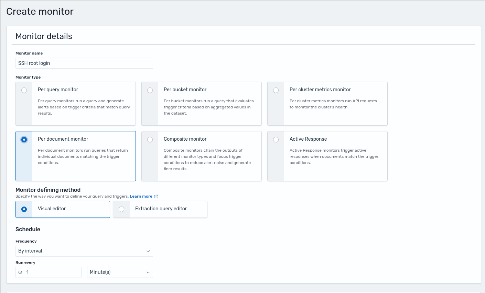


### 4.2. Configuring Triggers and Actions

When adding a trigger, configure the action to use your notification channel. This is the key migration step - it connects the monitor to the email channel you created earlier.

1. Add a trigger with a name, severity level and trigger condition.

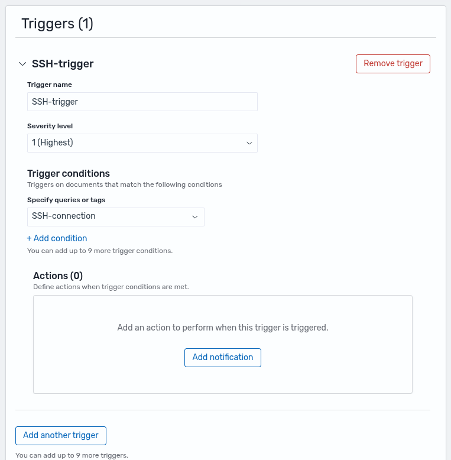

2. Under **Actions**, click **Add notification** and configure:
   - **Channel**: Select the email channel you created in [Step 3](#3-setting-up-an-email-notification-channel)
   - **Message subject**: e.g., `SSH Root Connection`
   - **Message**: Customize the body using Mustache templates or plain text
   - **Action configuration**: `Per execution` or `Per alert`


3. Click **Create** to save the monitor.

### 4.3. Testing the Monitor

1. Trigger the condition by generating an event that matches your query.
2. Verify the alert appears in the Wazuh Dashboard **Alerting** plugin under the **Alerts** tab.
3. Confirm the email notification is received in the recipient's inbox.

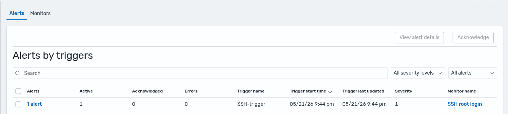


<details>
<summary>Example: recreating an `sshd` rule from Wazuh 4.x</summary>

If your Wazuh 4.x `ossec.conf` had a block like:

```xml
<email_alerts>
  <email_to>security@example.com</email_to>
  <level>12</level>
  <group>sshd,</group>
  <do_not_delay/>
</email_alerts>
```

You can recreate it with the following monitor configuration:

**Monitor:**

- **Name**: `SSH root login`
- **Type**: Per document monitor
- **Schedule**: Every 1 minute
- **Index pattern**: `wazuh-findings-v5-system-activity`
- **Query**: `wazuh.rule.title` is `SSH root login via password authentication`

**Trigger:**

- **Name**: `SSH-trigger`
- **Severity**: `1 (Highest)`

**Action:**

- **Channel**: Your email channel from [Step 3](#3-setting-up-an-email-notification-channel)
- **Subject**: `SSH Root Connection`
- **Configuration**: Per execution

</details>

## 5. Recreating Scheduled Reports

If you previously used the [`<reports>`](#reports-mapping) block in `ossec.conf` to generate daily or weekly summaries, you can replicate this behavior using the Wazuh Dashboard **Reporting** plugin.

In your Wazuh 4.x `ossec.conf`, the `<reports>` block defined the report content with filters like `<group>`, `<rule>`, `<level>`, `<srcip>`, `<location>`, and `<user>`, plus the [`<email_to>`](#reports-mapping) destination and [`<showlogs>`](#reports-mapping) toggle. In Wazuh 5.0, these are split into two parts:

- **Report content**: Instead of XML filters, you select a source dashboard or visualization - the filtering is inherent to the source.
- **Delivery**: The [`<email_to>`](#reports-mapping) is now handled by the notification channel you created in [Step 3](#3-setting-up-an-email-notification-channel).

Create a report definition configured to your needs, then set up email notification to deliver it through your channel. The images below show a daily vulnerability report as an example.

1. Navigate to the **Reporting** plugin in the Wazuh Dashboard.

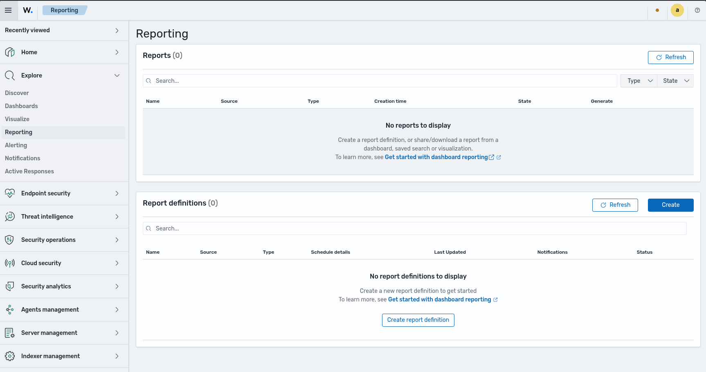

2. Click **Create report definition**.
3. Under **Report settings**, configure the following according to your needs (example values shown in the images):
   - **Name**: e.g., `Vulnerability Detection Daily Report`
   - **Report source**: Select **Dashboard** and pick the dashboard to export
   - **Time range**: e.g., `Last 24 hours`
   - **File format**: e.g., `PDF`
4. Under **Report trigger**, select **On demand** or set a schedule.

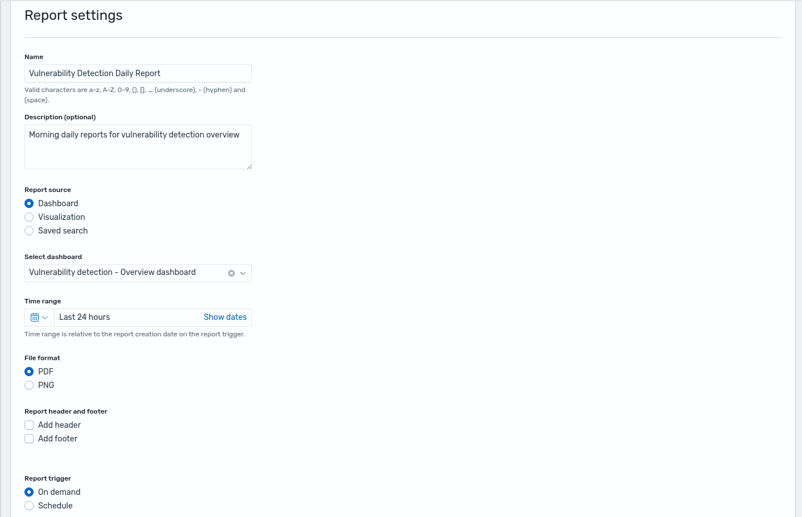

5. In **Notification settings**:
   - Check the **Send notification when report is available** option.
   - **Channels**: Select the Email channel you created in [Step 3](#3-setting-up-an-email-notification-channel).
   - **Notification subject**: e.g., `Vulnerability Detection Report`
6. Configure your notification message using the text editor or use the default template.

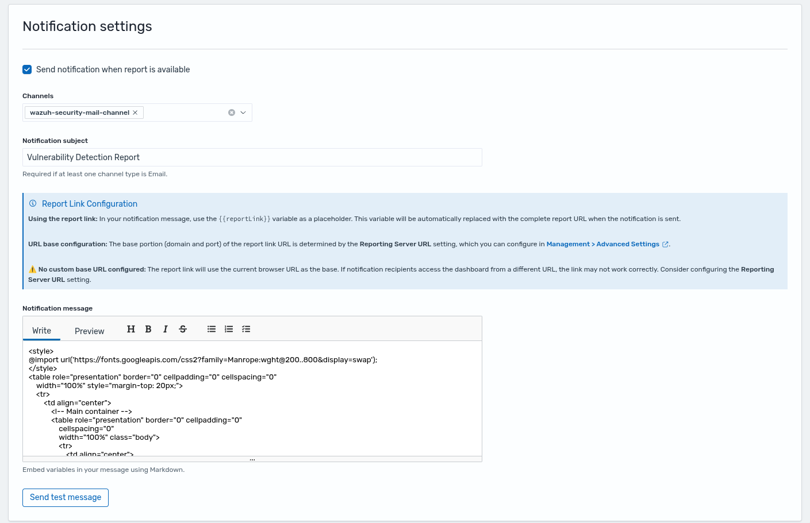

7. Click **Create** to save the report definition.
8. If you selected **On demand** as the report trigger in step 4, the application will open a new browser tab with the report being generated.

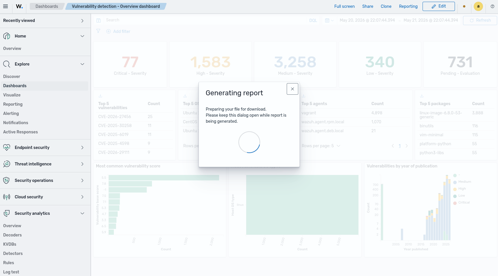

### 5.1. Viewing Generated Reports

1. Once the report is generated (either on-demand or by schedule), it will be listed in the **Reporting** plugin.

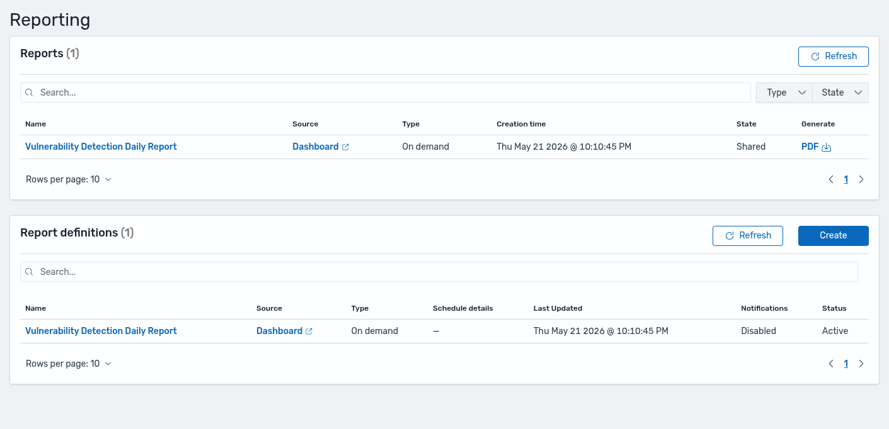

2. The email with the custom format and report link will be delivered to the recipients.

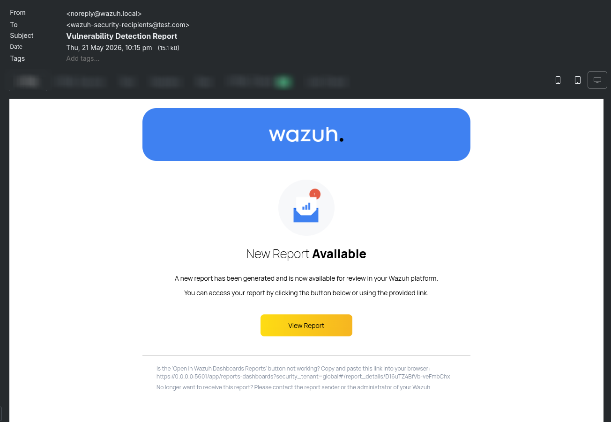

You have now migrated your email alerts and scheduled reports from `ossec.conf` to the Wazuh Dashboard.
