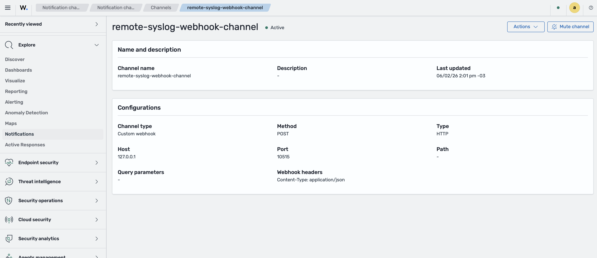
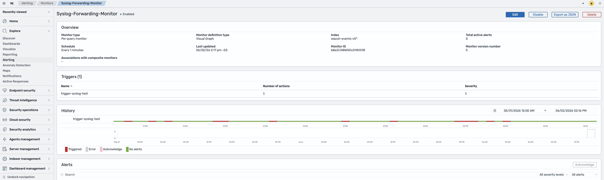
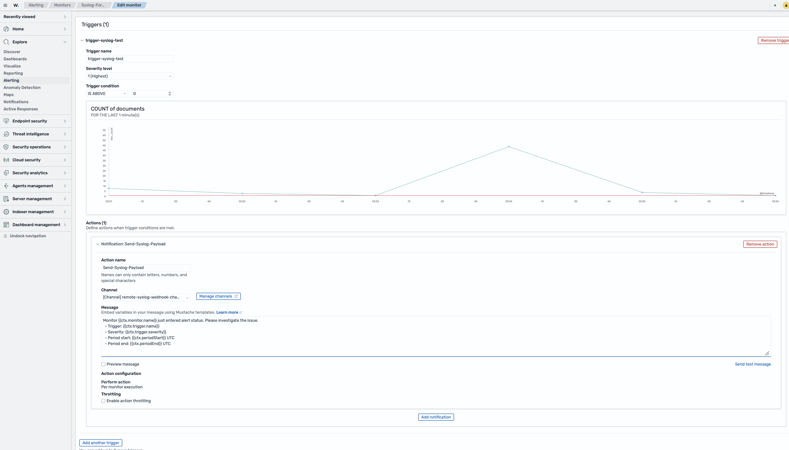

# Migrating Remote Syslog Output to Dashboard Notifications

In previous Wazuh versions (4.x), forwarding alerts to remote log servers via Syslog was managed directly in the Wazuh manager's `ossec.conf` file using `<syslog_output>` configuration blocks handled by the internal `csyslogd` daemon.

Starting with Wazuh 5.0, these legacy backend Syslog forwarding capabilities have been removed from the manager. Alert forwarding logic must now be configured directly through the Wazuh dashboard using the **Notifications** and **Alerting** dashboard plugins via webhooks.

> **Note:** There is no automatic upgrade tooling to migrate your existing Wazuh 4.x `<syslog_output>` configurations. You must manually recreate your data filtering and forwarding logic in the Wazuh dashboard. Use the mapping table below to identify which Wazuh 5.x feature corresponds to each element in your `ossec.conf`.

## Configuration mapping (4.x -> 5.x)

The following table maps each `ossec.conf` element from Wazuh 4.x to the corresponding feature in the Wazuh 5.x dashboard. Entries use the form `section.element` - for example, `syslog_output.server` refers to `<syslog_output><server>` in your `ossec.conf`.

> See the [ossec.conf reference](#wazuh-4x-ossecconf-reference) below for the full XML context of this section.

### Syslog output mapping

| 4.x `ossec.conf`         | 5.x dashboard                                            | Guide                                                                 |
| ------------------------ | -------------------------------------------------------- | --------------------------------------------------------------------- |
| `syslog_output.server`   | Notifications > Channels > Custom Webhook (target host) | [Step 1](#1-setting-up-a-custom-webhook-notification-channel)         |
| `syslog_output.port`     | Notifications > Channels > Custom Webhook (target port) | [Step 1](#1-setting-up-a-custom-webhook-notification-channel)         |
| `syslog_output.format`   | Alerting > Monitor > Action > Message (Mustache Template)  | [Step 2.2](#22-configuring-triggers-and-actions)                      |
| `<syslog_output>` filter | Alerting > Monitor > Query (data filter)                | [Step 2.1](#21-creating-a-monitor)                                    |
| `syslog_output.level`    | Alerting > Monitor > Trigger condition                  | [Step 2.2](#22-configuring-triggers-and-actions)                      |

> **Wazuh 4.x protocol note:** The legacy `<syslog_output>` mechanism natively supported raw network streams over UDP and TCP. The Wazuh 5.x Notifications engine uses HTTP/HTTPS POST webhooks for outbound routing. Target endpoints must support HTTP webhook ingestion, or you must deploy a webhook-to-syslog translation layer on the receiving side.
> **Note on Output Formats**: In Wazuh 4.x, the <format> tag automatically converted the data layout into predefined profiles (json, cef, or splunk). In Wazuh 5.x, the Notifications plugin does not include these pre-configured encoding profiles. To migrate specific formats (such as ArcSight CEF, Splunk key-value pairs, or custom JSON payloads), the structure must be manually designed inside the Message text block using Mustache syntax variables during the Action configuration phase.

## Wazuh 4.x ossec.conf reference

Below is a typical Wazuh 4.x configuration block you may have in your `ossec.conf`. Use it as a reference when following the migration steps.

> **Port context:** In this legacy 4.x example, port `514` is the standard Syslog transport port (UDP/TCP). In Wazuh 5.x webhook routing, use the HTTP/HTTPS port exposed by your receiver (for example, `8080`).

```xml
<syslog_output>
  <server>192.168.1.50</server>
  <port>514</port>
  <protocol>udp</protocol>
  <format>json</format>
  <level>10</level>
  <group>authentication_failed,</group>
</syslog_output>
```

## Migration steps

### Prerequisites

Before proceeding, make sure you have:

- Wazuh 5.0 or later fully deployed (indexer, manager, dashboard).
- Access to the Wazuh dashboard as an administrator.
- The target endpoint URL and port prepared to receive incoming webhook traffic.

## 1. Setting up a Custom Webhook Notification Channel

Instead of defining raw server endpoints inside XML blocks, destinations are now managed as reusable notification channels in the dashboard UI.

1. Open the Wazuh dashboard and go to the **Notifications** plugin.
2. Go to **Channels** and click **Create channel**.
3. Enter a **Name** for the channel (for example, `remote-syslog-webhook-channel`).
4. (Optional) Provide a **Description** clarifying the purpose of this channel.
5. Under **Configurations**, select **Custom webhook** as the **Channel type**.
6. Set the **Method** to `POST`.
7. Under **Define endpoints by**, select **Webhook URL** and enter your endpoint address matching your legacy `syslog_output.server` configuration (for example, `http://192.168.1.50:10515`).
  Use the HTTP/HTTPS listening port of your webhook endpoint here (for example, `8080`), not the legacy Syslog transport port `514`.
8. (Optional) Click **Send test message** to verify network connectivity.
9. Click **Create** to save the channel.




## 2. Recreating Data Filters with Alerts and Monitors

In Wazuh 4.x, you used `<syslog_output>` blocks with tags such as `<level>`, `<group>`, and `<rule_id>` to determine which events were forwarded. In Wazuh 5.0, the Alerting plugin executes periodic queries directly against your selected indexes.

### 2.1. Creating a monitor

1. Navigate to the **Alerting** plugin in the Wazuh dashboard and select **Monitors**.
2. Click **Create monitor**.
3. Configure the monitor:
   - **Monitor name:** Enter a name (for example, `Syslog-Forwarding-Monitor`).
   - **Monitor type:** Select **Per query monitor** or **Per document monitor** depending on your forwarding behavior.
   - **Indexes:** Target the unified system activity schema by entering `wazuh-events-v5*`.
4. Under **Query / Data filter**, translate your old XML rules into dashboard filter conditions.
   For example, to replicate a `<group>` filter, add a condition where `wazuh.rule.groups` contains your keyword.




### 2.2. Configuring triggers and actions

Triggers act as threshold selectors (similar to legacy `<level>` intent), while actions define the outbound payload format.

1. Add a trigger and set its condition.
2. If migrating a specific severity tier, configure the condition to trigger when document count **IS ABOVE** `0`.
3. Under **Actions**, click **Add notification** and configure:
   - **Action name:** Provide a label (for example, `Send-Syslog-Payload`).
   - **Channel:** Select the custom webhook channel created in [Step 1](#1-setting-up-a-custom-webhook-notification-channel).
   - **Message:** Use Mustache templates to map the payload fields to your destination JSON structure.
4. Click **Create** to activate the monitor pipeline.




### 2.3. Testing the forwarder

1. Generate an event on a monitored endpoint that matches your filter conditions.
2. Verify the matching activity appears in **Alerting** under **Alerts** history.
3. Confirm that your ingestion endpoint receives the HTTP POST payload with the expected metadata.


<details>
<summary>Example: recreating a legacy syslog forwarding filter</summary>

If your Wazuh 4.x `ossec.conf` contained:

```xml
<syslog_output>
  <server>192.168.1.50</server>
  <port>514</port>
  <level>10</level>
  <group>authentication_failed,</group>
</syslog_output>
```

You can replicate this behavior with the following dashboard workflow:

**Monitor setup:**

- **Type:** Per document monitor
- **Index pattern:** `wazuh-events-v5*`
- **Data filter:** `wazuh.rule.groups` matches `authentication_failed`

**Trigger setup:**

- **Condition:** Document count **IS ABOVE** `0`
- **Data threshold filter:** `wazuh.rule.level >= 10`

**Action setup:**

- **Channel:** Your custom webhook endpoint channel
- **Message payload:**

```json
{
  "alert_id": "{{ctx.results.0._id}}",
  "rule_description": "{{ctx.results.0.wazuh.rule.description}}",
  "severity_level": "{{ctx.results.0.wazuh.rule.level}}",
  "agent_host": "{{ctx.results.0.wazuh.agent.name}}"
}
```

</details>