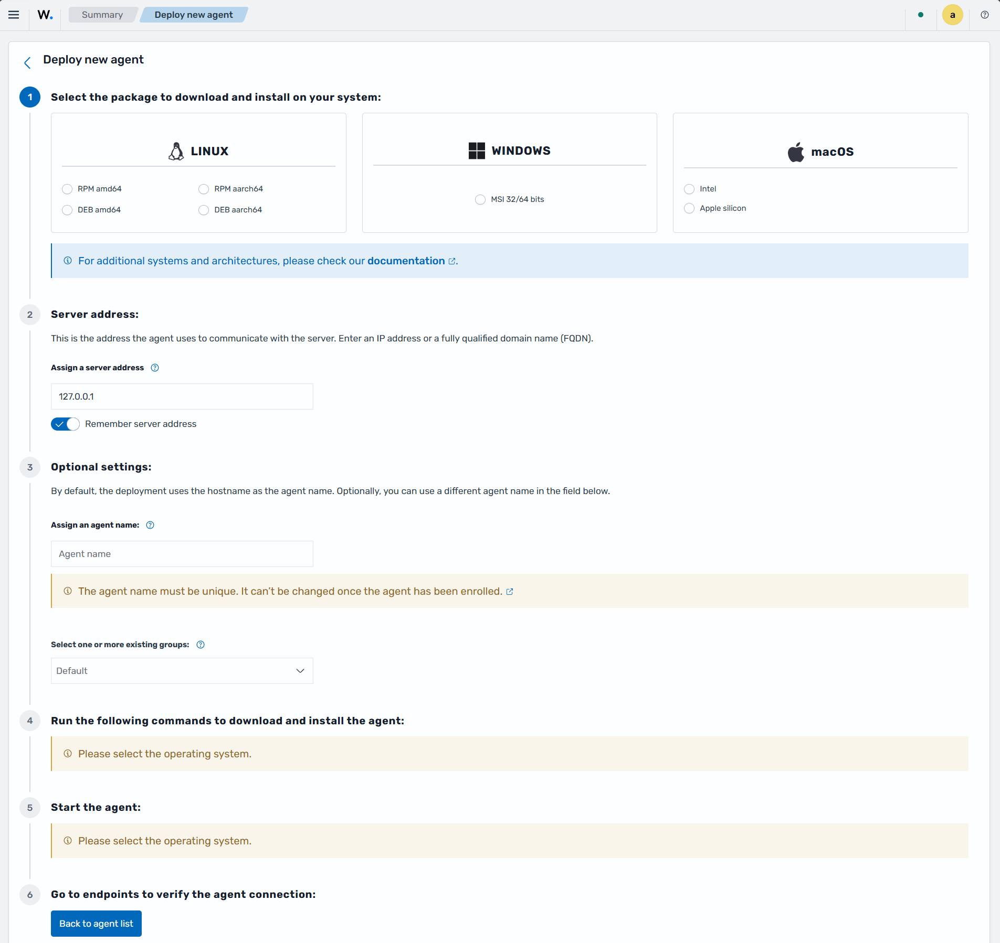
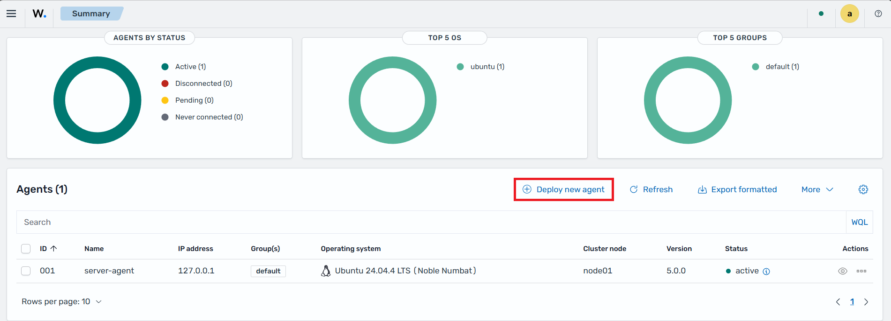
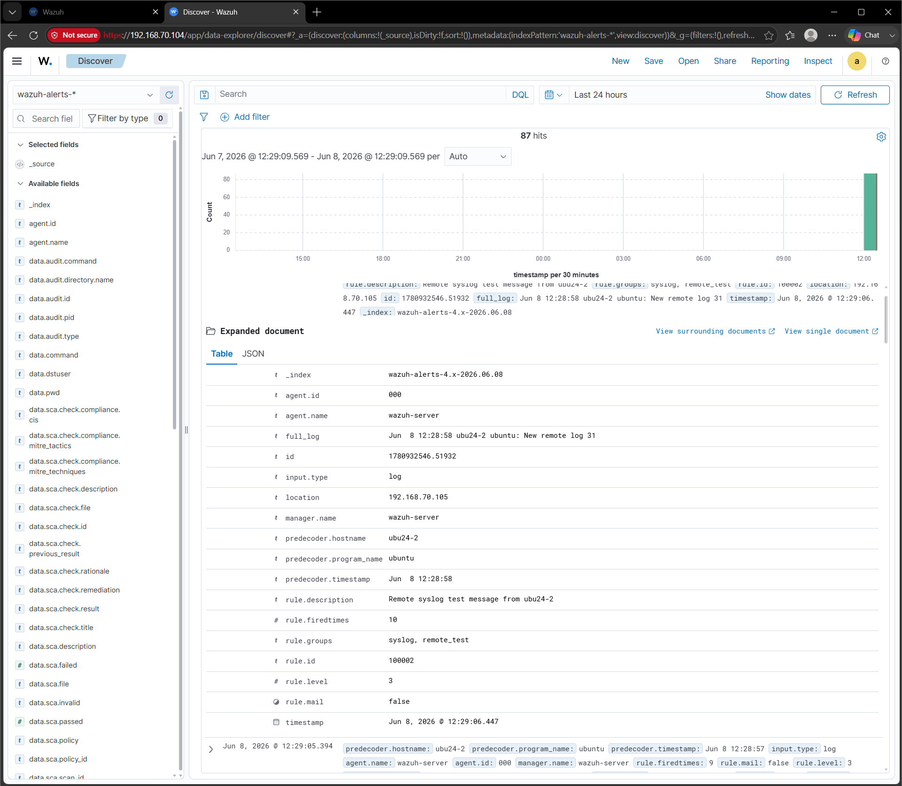
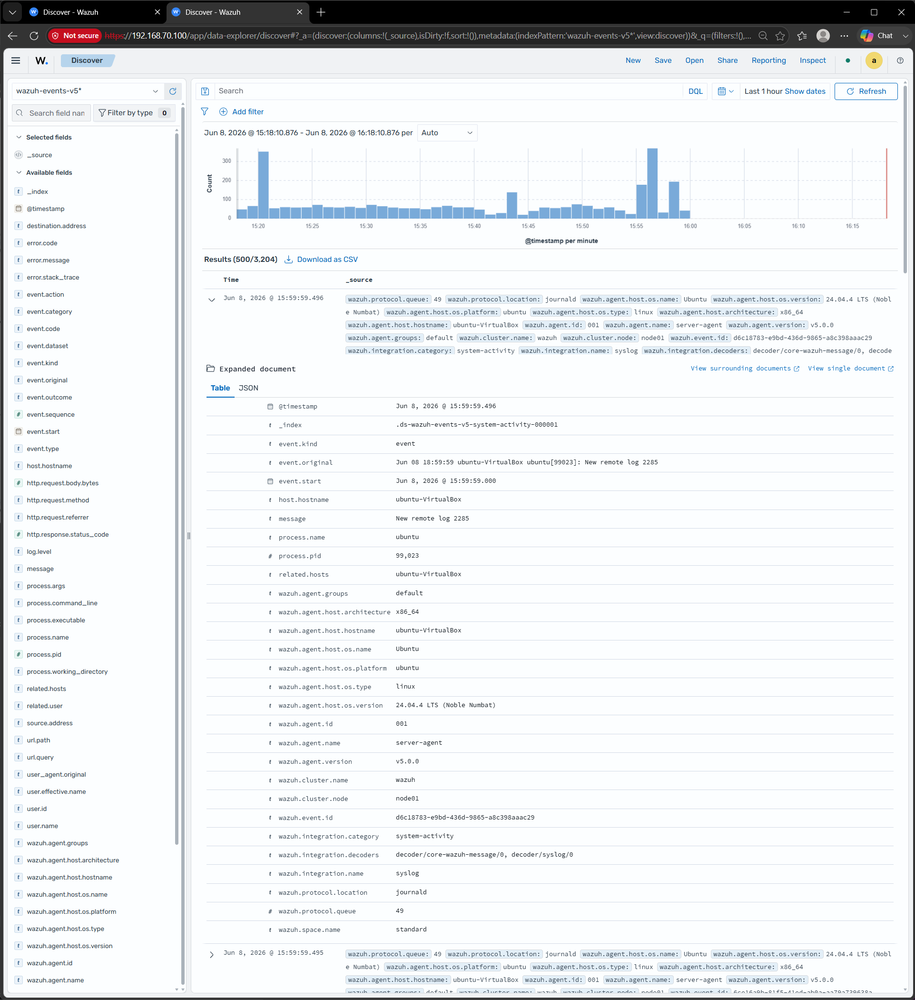
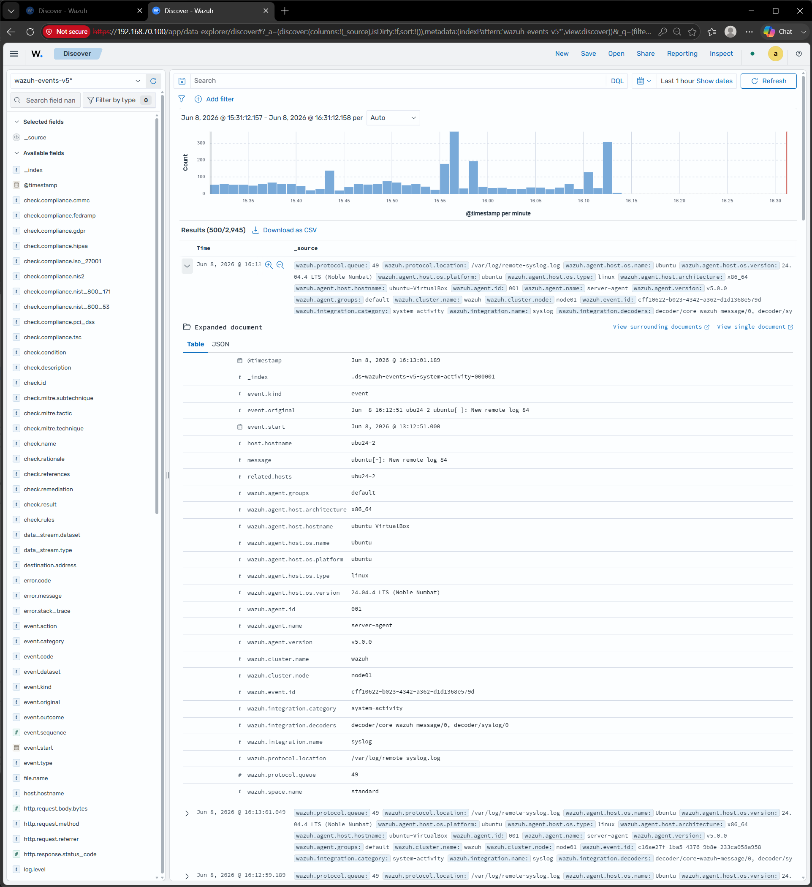

# Migrating Syslog Input to Logcollector with rsyslog

In previous Wazuh versions (4.x), the manager's `remoted` module accepted raw syslog messages from network devices (firewalls, routers, switches) on port 514, configured via `<connection>syslog</connection>` in the manager's `ossec.conf`.

Starting with Wazuh 5.0, this syslog input capability has been removed from `remoted`. The module now exclusively handles encrypted agent connections. To continue collecting syslog from network devices, you must deploy rsyslog on a collection host to receive the messages, and install a Wazuh agent on that host to forward them to the Wazuh server.

This guide covers two approaches for the rsyslog-to-Wazuh pipeline:

- **[Option A](#option-a-rsyslog--journald--logcollector)** — rsyslog writes to the systemd journal (`omjournal`), which the Wazuh agent reads by default.
- **[Option B](#option-b-rsyslog--log-file--logcollector)** — rsyslog writes to per-host log files, which the Wazuh agent monitors via a `<localfile>` stanza.

> **Note:** There is no automatic migration tooling for this change. You must manually configure rsyslog and install a Wazuh agent on the syslog collection host.

## What changed

| Aspect | Wazuh 4.x | Wazuh 5.x |
| ----------------------- | ---------------------------------------------- | --------------------------------------------------- |
| Syslog receiver | Manager `remoted` (port 514) | External syslog daemon (rsyslog) |
| Log ingestion | Direct to `analysisd` | Via Wazuh agent logcollector |
| Configuration location | Manager `ossec.conf` `<remote>` block | rsyslog config + agent `ossec.conf` |
| Wazuh agent on host | Not required | Required — not installed with the manager in 5.0 |
| IP allowlist/denylist | `<allowed-ips>` / `<denied-ips>` in `ossec.conf` | rsyslog `$AllowedSender` or host firewall rules |

## Architecture

**Wazuh 4.x:**

```
Network device ──(UDP/TCP port 514)──► Wazuh manager (remoted) ──► analysisd
```

**Wazuh 5.x — Option A (journald):**

```
Network device ──(UDP/TCP port 514)──► rsyslog (omjournal) ──► systemd journal
                                                                       │
                                                           Wazuh agent (logcollector)
                                                                       │
                                                           Wazuh manager (analysisd)
```

**Wazuh 5.x — Option B (log file):**

```
Network device ──(UDP/TCP port 514)──► rsyslog ──► /var/log/remote/<host>.log
                                                                   │
                                                       Wazuh agent (logcollector)
                                                                   │
                                                       Wazuh manager (analysisd)
```

## Choosing an approach

| | Option A — journald | Option B — log file |
| --------------------------- | ----------------------------------------- | ------------------------------------------ |
| **Agent config change** | None — journald is read by default | `<localfile>` stanza required |
| **Log rotation** | Managed by `journald` automatically | Requires logrotate configuration |
| **Per-host filtering** | Via journald fields (`_HOSTNAME`, etc.) | By file path (`/var/log/remote/<host>.log`) |
| **OS requirement** | systemd-based Linux hosts | Any Linux host |
| **rsyslog module** | `omjournal` — custom templates may fail silently on rsyslog 8.x | Built-in file output |

Option A is simpler to operate: journald handles retention automatically and no agent configuration is needed beyond the default. Option B is more portable and works on systems without systemd, and gives a clear per-host file for manual inspection.

## Configuration mapping (4.x → 5.x)

| 4.x `ossec.conf` | 5.x equivalent | Option |
| ----------------------------------------- | -------------------------------------------- | ----------- |
| `remote.connection` = `syslog` | rsyslog `imudp` / `imtcp` input modules | Both |
| `remote.port` | rsyslog `input` port | Both |
| `remote.protocol` | rsyslog `imudp` (UDP) or `imtcp` (TCP) | Both |
| `remote.allowed-ips` | rsyslog `$AllowedSender` or firewall rules | Both |
| `remote.denied-ips` | Host firewall rules (`iptables`/`firewalld`) | Both |
| Syslog forwarded directly to `analysisd` | rsyslog `omjournal` → journald reader | Option A |
| Syslog forwarded directly to `analysisd` | Agent `<localfile>` monitoring log files | Option B |

## Wazuh 4.x `ossec.conf` reference

```xml
<!-- Wazuh 4.x manager ossec.conf -->
<ossec_config>
  <remote>
    <connection>syslog</connection>
    <port>514</port>
    <protocol>udp</protocol>
    <allowed-ips>192.168.1.0/24</allowed-ips>
  </remote>
</ossec_config>
```

## Prerequisites (both options)

Before proceeding with either option, make sure you have:

- Wazuh 5.0 or later fully deployed (indexer, manager, dashboard)
- A Linux host where rsyslog will run — this can be the same host as the Wazuh manager or a dedicated server
- rsyslog installed on that host
- Network devices configured to send syslog to that host's IP address on port 514
- A Wazuh agent installed on the syslog collection host (see [Installing the Wazuh agent](#installing-the-wazuh-agent) below)

### Installing the Wazuh agent

> **Important:** In Wazuh 5.0, the Wazuh agent is **not installed automatically with the manager**. Even if rsyslog runs on the same host as the Wazuh manager, you must install and enroll a separate Wazuh agent on that host.

From the Wazuh dashboard, go to **Agent management -> Summary** and click **Deploy new agent**.



Complete with your information and use the generated command to install the agent. If the agent runs on the same host as the manager, use `127.0.0.1` as the manager address.

Enable and start the agent service after installation:

```bash
sudo systemctl daemon-reload
sudo systemctl enable wazuh-agent
sudo systemctl start wazuh-agent
```

The agent appears in the Wazuh dashboard under **Agent management -> Summary** within a few seconds:



---

## Option A: rsyslog → journald → logcollector

rsyslog receives the syslog messages and writes them directly to the systemd journal using the `omjournal` output module. The Wazuh agent reads the journal by default — no additional agent configuration is required.

> **Important:** The `_HOSTNAME` field in the systemd journal is a *trusted field* — journald always sets it to the local machine's hostname, and no application (including rsyslog) can override it. This means that without additional configuration, all remote syslog entries written to the journal appear to come from the collection host, making sources indistinguishable. The configuration below uses a template that embeds `%HOSTNAME%` — the sender's hostname extracted from the received syslog packet by rsyslog — into the `MESSAGE` field, preserving the standard syslog format that Wazuh decoders expect.

### 1. Install the rsyslog journal output module

The `omjournal` module is included in the main rsyslog package on most distributions, but some require a separate package:

```bash
# Debian/Ubuntu
sudo apt install rsyslog

# RHEL/CentOS/Amazon Linux
sudo yum install rsyslog
```

Verify the module is available:

```bash
ls /usr/lib/x86_64-linux-gnu/rsyslog/omjournal.so 2>/dev/null || \
ls /usr/lib64/rsyslog/omjournal.so 2>/dev/null && echo "omjournal available"
```

### 2. Configure rsyslog

Create `/etc/rsyslog.d/99-wazuh-remote.conf` with the following content:

```
module(load="imudp")
module(load="imtcp")
module(load="omjournal")

# Preserve the original syslog format so the sender hostname is visible in the journal
template(name="JournalFwd" type="string" string="%HOSTNAME% %syslogtag%%msg%")

ruleset(name="remote_to_journal") {
    action(type="omjournal" template="JournalFwd")
}

input(type="imudp" port="514" ruleset="remote_to_journal")
input(type="imtcp" port="514" ruleset="remote_to_journal")
```

> **Known issue — rsyslog 8.x and `omjournal` templates:** On rsyslog 8.x (including 8.2312.0, shipped with Ubuntu 24.04), specifying a `template` parameter in an `omjournal` action causes all journal writes to be **silently dropped**. No error is logged and `rsyslogd -N1` reports no config issues. This is a separate issue from the journald trusted-field behavior described above — it is a bug in the rsyslog `omjournal` implementation on this version family.
>
> If you apply the configuration above and see no messages in `journalctl -f`, confirm the issue by removing the `template` parameter temporarily:
>
> ```
> ruleset(name="remote_to_journal") {
>     action(type="omjournal")
> }
> ```
>
> Without the template, writes succeed but the remote hostname will not appear in the `MESSAGE` field. If your rsyslog version is affected, use **[Option B](#option-b-rsyslog--log-file--logcollector)** instead, which preserves the remote hostname reliably across all rsyslog versions.

With this template, a message sent by host `ubu24-2` will appear in the journal as:

```
Jun 04 21:09:01 ubuntu-VirtualBox rsyslogd[1234]: ubu24-2 ubuntu: New remote log 628
```

The `ubu24-2` at the start of the message body is the sender's hostname from the syslog packet header. Wazuh decoders parse this as standard syslog format and extract it as the event source.

If you previously used `<allowed-ips>` in Wazuh 4.x to restrict which hosts could send syslog, enforce an equivalent restriction at the firewall:

```bash
sudo firewall-cmd --permanent --add-rich-rule='rule family="ipv4" source address="192.168.1.0/24" port port="514" protocol="udp" accept'
sudo firewall-cmd --permanent --add-rich-rule='rule family="ipv4" source address="192.168.1.0/24" port port="514" protocol="tcp" accept'
sudo firewall-cmd --reload
```

Restart rsyslog to apply the changes:

```bash
sudo systemctl restart rsyslog
```

Verify rsyslog is listening on port 514:

```bash
sudo ss -ulnp | grep 514
sudo ss -tlnp | grep 514
```

### 3. Verify journal ingestion

Send a test message from a remote host to confirm the pipeline is working:

```bash
# From the remote device or another machine
logger -n <SYSLOG_HOST_IP> -P 514 --udp "Test syslog message from migration"
```

On the collection host, confirm the message arrived in the journal:

```bash
journalctl -f
```

The Wazuh agent reads the journal by default — no changes to `/var/ossec/etc/ossec.conf` are needed.

### 4. Verify events appear in the dashboard

In the Wazuh dashboard, go to **Threat Intelligence -> Events**. Events from remote devices will appear with `location: journald`. The same decoders that matched your devices in Wazuh 4.x continue to fire without modification.

---

## Option B: rsyslog → log file → logcollector

rsyslog receives the syslog messages and writes them to per-host log files under `/var/log/remote/`. The Wazuh agent monitors those files via a `<localfile>` stanza.

### 1. Configure rsyslog

Create `/etc/rsyslog.d/99-wazuh-remote.conf` with the following content:

```
module(load="imudp")
module(load="imtcp")

template(name="RemoteHostLogs" type="string"
         string="/var/log/remote/%HOSTNAME%.log")

ruleset(name="remote_to_file") {
    action(type="omfile" dynaFile="RemoteHostLogs")
}

input(type="imudp" port="514" ruleset="remote_to_file")
input(type="imtcp" port="514" ruleset="remote_to_file")
```

Create the output directory and set permissions:

```bash
sudo mkdir -p /var/log/remote
sudo chown syslog:adm /var/log/remote
sudo chmod 755 /var/log/remote
```

If you previously used `<allowed-ips>` in Wazuh 4.x, add the equivalent restriction:

```bash
sudo firewall-cmd --permanent --add-rich-rule='rule family="ipv4" source address="192.168.1.0/24" port port="514" protocol="udp" accept'
sudo firewall-cmd --permanent --add-rich-rule='rule family="ipv4" source address="192.168.1.0/24" port port="514" protocol="tcp" accept'
sudo firewall-cmd --reload
```

Restart rsyslog to apply the changes:

```bash
sudo systemctl restart rsyslog
```

Verify rsyslog is listening on port 514:

```bash
sudo ss -ulnp | grep 514
sudo ss -tlnp | grep 514
```

### 2. Configure the Wazuh agent to monitor syslog files

Edit the agent's configuration file at `/var/ossec/etc/ossec.conf` and add a `<localfile>` block:

```xml
<ossec_config>
  <localfile>
    <location>/var/log/remote/*.log</location>
    <log_format>syslog</log_format>
  </localfile>
</ossec_config>
```

This single stanza covers all files written by rsyslog under `/var/log/remote/`, regardless of how many source hosts are added in the future.

> **Message format and Wazuh decoder compatibility:** The `dynaFile` approach above uses rsyslog's default message format, which includes the syslog timestamp (`Jun  3 08:14:22`). Wazuh's built-in syslog decoders require this timestamp as the first field to match. If you use a custom message template, it **must** include `%timereported:::date-rfc3164%` at the start:
>
> ```
> # Correct — timestamp is present, Wazuh syslog decoders match
> template(name="MsgFmt" type="string" string="%timereported:::date-rfc3164% %HOSTNAME% %app-name%[%procid%]: %msg%\n")
> action(type="omfile" file="/var/log/remote/syslog.log" template="MsgFmt")
>
> # Wrong — no timestamp, events land in wazuh-events-v5-unclassified-* without field extraction
> template(name="MsgFmt" type="string" string="%HOSTNAME% %app-name%[%procid%]: %msg%\n")
> ```
>
> Events missing a timestamp will appear in the Wazuh dashboard under the `wazuh-events-v5-unclassified-*` index with only `event.original` populated and no decoded fields.

Restart the agent to apply the configuration:

```bash
sudo systemctl restart wazuh-agent
```

Confirm the logcollector is reading the files:

```bash
sudo grep "logcollector" /var/ossec/logs/ossec.log | grep "remote"
```

Expected output:

```
2026/06/03 08:16:01 wazuh-logcollector: INFO: (1950): Analyzing file: '/var/log/remote/asa-01.log'.
```

### 3. Configure log rotation

With per-host log files accumulating under `/var/log/remote/`, configure logrotate to prevent unbounded disk growth.

Create `/etc/logrotate.d/wazuh-remote-syslog`:

```
/var/log/remote/*.log {
    daily
    missingok
    rotate 7
    compress
    delaycompress
    notifempty
    sharedscripts
    postrotate
        /usr/lib/rsyslog/rsyslog-rotate
    endscript
}
```

### 4. Verify events appear in the dashboard

In the Wazuh dashboard, go to **Threat Intelligence -> Events** and filter by `location: /var/log/remote/`. The same decoders that matched your devices in Wazuh 4.x continue to fire without modification.

---

## Decoder and rule compatibility

Existing Wazuh decoders and rules for network device syslog (for example, `cisco-asa`, `pf`, `juniper`) continue to work without modification under both options. The syslog message body forwarded by rsyslog is identical to what `remoted` previously received on port 514. No decoder updates are required as part of this migration.

> **Note:** In Wazuh 4.x, the source IP of the remote device was available in `remoted`. In Wazuh 5.x, the source IP is embedded in the syslog message itself by the device (standard syslog behavior). If your rules relied on a remoted-injected source IP field, verify them after migration.

---

## Migration example

### Wazuh 4.x with syslog configured

#### Generating remote logs

```bash
ubuntu@ubu24-2:~$ i=22; while true; do logger -n 192.168.70.104 --rfc3164 -P 514 "New remote log $i"; ((i++)); sleep 1; done
```

#### Wazuh manager configuration

Configure `/var/ossec/etc/ossec.conf` to enable remote syslog reception:

```xml
<ossec_config>
  <remote>
    <connection>syslog</connection>
    <port>514</port>
    <protocol>udp</protocol>
    <allowed-ips>192.168.1.0/24</allowed-ips>
  </remote>
</ossec_config>
```

Add a rule in `/var/ossec/etc/rules/local_rules.xml` to match the remote logs:

```xml
<group name="syslog,remote_test,">
  <rule id="100002" level="3">
    <match>New remote log</match>
    <description>Remote syslog test message</description>
  </rule>
</group>
```

Alerts appear in `/var/ossec/logs/alerts/alerts.log`:

```
[wazuh-user@wazuh-server ~]$ sudo tail -f /var/ossec/logs/alerts/alerts.log
** Alert 1780935033.426378: - syslog,remote_test,
2026 Jun 08 16:10:33 ubu24-2->192.168.70.105
Rule: 100002 (level 3) -> 'Remote syslog test message from ubu24-2'
Jun  8 13:10:24 ubu24-2 ubuntu: New remote log 1619

** Alert 1780935036.426594: - syslog,remote_test,
2026 Jun 08 16:10:36 ubu24-2->192.168.70.105
Rule: 100002 (level 3) -> 'Remote syslog test message from ubu24-2'
Jun  8 13:10:26 ubu24-2 ubuntu: New remote log 1620

** Alert 1780935038.426810: - syslog,remote_test,
2026 Jun 08 16:10:38 ubu24-2->192.168.70.105
Rule: 100002 (level 3) -> 'Remote syslog test message from ubu24-2'
Jun  8 13:10:29 ubu24-2 ubuntu: New remote log 1621
```

Events visible in the dashboard:




### Wazuh 5.0 — Option A: rsyslog → journald

#### Generating remote logs

```bash
ubuntu@ubu24-2:~$ i=22; while true; do logger -n 192.168.70.104 -P 514 "New remote log $i"; ((i++)); sleep 1; done
```

#### rsyslog configuration

Create `/etc/rsyslog.d/remote.conf` to forward remote syslog to the systemd journal:

```
module(load="imudp")
module(load="imtcp")
module(load="omjournal")

ruleset(name="remote_to_journal") {
    action(type="omjournal")
}

input(type="imudp" port="514" ruleset="remote_to_journal")
input(type="imtcp" port="514" ruleset="remote_to_journal")
```

Remote logs appear in the journal:

```bash
ubuntu@ubuntu-VirtualBox:~$ journalctl -f
Jun 08 15:55:49 ubuntu-VirtualBox ubuntu[99023]: New remote log 2138
Jun 08 15:55:51 ubuntu-VirtualBox ubuntu[99023]: New remote log 2139
Jun 08 15:55:53 ubuntu-VirtualBox ubuntu[99023]: New remote log 2140
Jun 08 15:55:55 ubuntu-VirtualBox ubuntu[99023]: New remote log 2141
Jun 08 15:55:57 ubuntu-VirtualBox ubuntu[99023]: New remote log 2284
Jun 08 15:55:59 ubuntu-VirtualBox ubuntu[99023]: New remote log 2285
```

Events visible in the dashboard:



### Wazuh 5.0 — Option B: rsyslog → log file

#### Generating remote logs

```bash
ubuntu@ubu24-2:~$ i=22; while true; do logger -n 192.168.70.104 --rfc3164 -P 514 "New remote log $i"; ((i++)); sleep 1; done
```

#### Wazuh agent configuration

Add a `<localfile>` block to `/var/ossec/etc/ossec.conf` on the collection host:

```xml
<ossec_config>
  <localfile>
    <log_format>syslog</log_format>
    <location>/var/log/remote-syslog.log</location>
  </localfile>
</ossec_config>
```

#### rsyslog configuration

Create `/etc/rsyslog.d/remote.conf` to forward remote syslog to a file:

```
module(load="imudp")
module(load="imtcp")

template(name="RemoteSyslog" type="string" string="%timereported:::date-rfc3164% %HOSTNAME% %app-name%[%procid%]: %msg%\n")

ruleset(name="remote_syslog") {
    action(type="omfile" file="/var/log/remote-syslog.log" template="RemoteSyslog")
}

input(type="imudp" port="514" ruleset="remote_syslog")
input(type="imtcp" port="514" ruleset="remote_syslog")
```

Remote logs appear in the output file:

```bash
ubuntu@ubuntu-VirtualBox:~$ tail -f /var/log/remote-syslog.log
Jun  8 16:12:58 ubu24-2 ubuntu[-]: New remote log 22
Jun  8 16:12:59 ubu24-2 ubuntu[-]: New remote log 23
Jun  8 16:13:00 ubu24-2 ubuntu[-]: New remote log 24
Jun  8 16:13:01 ubu24-2 ubuntu[-]: New remote log 25
```

Events visible in the dashboard:


