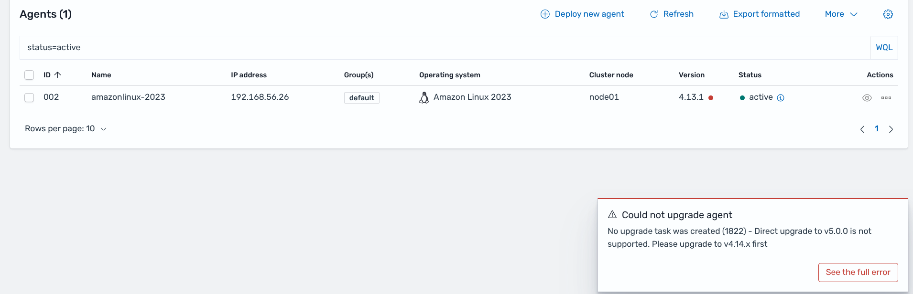
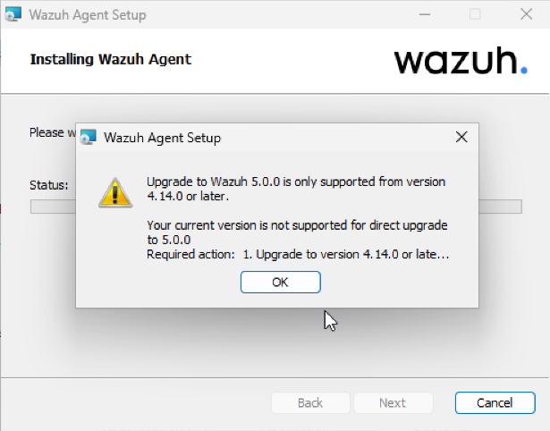

# Migration from Wazuh Agent 4.X to 5.0.0

This guide describes how to migrate Wazuh agents from 4.X to 5.0.0, including:

- Required upgrade path when the current agent is older than 4.14.X.
- Invalid and deprecated configuration elements in `ossec.conf`.
- Observed startup warnings and errors and their corresponding workarounds.
- Notes about `local_internal_options.conf` compatibility.

## Upgrade path requirements

Wazuh Agent 5.0.0 cannot be installed directly on agents running versions earlier than 4.14.0.

Required path:

1. Upgrade `4.X` -> `4.14.X`
2. Upgrade `4.14.X` -> `5.0.0`

If you attempt a direct `4.13.X` -> `5.0.0` package upgrade, installation is blocked by pre-install validation,

On the Dashboard:



On a Windows Agent:



On a linux terminal:

```console
UPGRADE BLOCKED: Incompatible version detected

Current version: v4.13.1
Target version:  5.0.0

Upgrade to Wazuh 5.0.0 is only supported from version 4.14.0 or later.
```

On a MacOS terminal the message is less intuitive:

```console
sh-3.2# installer -pkg /Users/vagrant/Downloads/wazuh-agent-5.0.0-beta2.arm64.pkg -target /
installer: Package name is wazuh-agent-5.0.0-beta2.arm64
installer: Upgrading at base path /
installer: The upgrade failed. (The Installer encountered an error that caused the installation to fail. Contact the software manufacturer for assistance. An error occurred while running scripts from the package “wazuh-agent-5.0.0-beta2.arm64.pkg”.)
```

## Recommended migration workflow

1. Upgrade the agent to the latest available `4.14.X` package.
2. Validate the agent starts without new errors on `4.14.X`.
3. Upgrade from `4.14.X` to `5.0.0`.
4. Review `ossec.log` and fix any invalid/deprecated configuration elements listed below.
5. Restart the agent and verify healthy connectivity and module startup.

## Configuration migration (`ossec.conf`)

The following changes were identified during agent startup validation after upgrading to 5.0.0.

| 4.X configuration element | 5.0 status | Agent log message (observed) | Required action |
|---|---|---|---|
| `<client><server>...</server></client>` | Deprecated | `INFO: The <server> tag is deprecated, please use <manager> instead.` | Replace `<server>` with `<manager>`. |
| `<client><server><protocol>...</protocol></server></client>` | Ignored | `INFO: Ignoring the 'protocol' option. Switching to TCP.` | Remove `<protocol>`. TCP is used. |
| `<client><crypto_method>...</crypto_method></client>` | Ignored | `INFO: Ignoring the 'crypto_method' option. Switching to AES.` | Remove `<crypto_method>`. |
| `<syscheck><scan_on_start>...</scan_on_start></syscheck>` | Invalid | `INFO: (1230): Invalid element in the configuration: 'scan_on_start'.` | Remove this element from `syscheck` (Always executed on start). |
| `<rootcheck><check_files>...</check_files></rootcheck>` | Removed | `INFO: Rootcheck option 'check_files' is no longer supported. Use the FIM module instead.` | Remove from `rootcheck`; use FIM (`syscheck`) controls. |
| `<rootcheck><check_trojans>...</check_trojans></rootcheck>` | Removed | `INFO: Rootcheck option 'check_trojans' is no longer supported. Use the FIM module instead.` | Remove from `rootcheck`; use FIM (`syscheck`) controls. |
| `<rootcheck><rootkit_files>...</rootkit_files></rootcheck>` | Invalid | `INFO: (1230): Invalid element in the configuration: 'rootkit_files'.` | Remove from `rootcheck`. |
| `<wodle name="cis-cat">...</wodle>` | Removed in 5.0 | `INFO: The 'cis-cat' module is deprecated. Use the SCA module instead.` | Migrate to SCA, then remove the `cis-cat` wodle block. See [Migrating from CIS-CAT and OpenSCAP to SCA](ciscat-openscap-to-sca.md). |
| `<wodle name="osquery">...</wodle>` | Removed in 5.0 | `INFO: The 'osquery' module is deprecated. Use the Syscollector module instead.` | Migrate to IT Hygiene, then remove the `osquery` wodle block. See [Migrating from OSquery to IT Hygiene](osquery-to-it-hygiene.md). |
| `<sca><skip_nfs>...</skip_nfs></sca>` | Deprecated/Unavailable | `INFO: Detected a deprecated configuration for SCA: 'skip_nfs' is no longer available.` | Remove `<skip_nfs>` from `sca`. See [SCA policies from 4.x to 5.x](sca-policies-4x-to-5x.md). |

### Additional observed parser side-effects

When invalid rootcheck/syscheck options remain in the configuration, the agent may also report:

```console
INFO: (1202): Configuration error at 'etc/ossec.conf'.
INFO: (1207): wazuh-rootcheck remote configuration in 'etc/ossec.conf' is corrupted.
```

These messages are resolved by removing the invalid elements listed above.

## `ossec.conf` quick before/after examples

### Client connection block

Before (4.X style):

```xml
<client>
	<server>
		<address>MANAGER_IP</address>
		<port>1514</port>
		<protocol>tcp</protocol>
	</server>
	<crypto_method>aes</crypto_method>
</client>
```

After (5.0 compatible):

```xml
<client>
	<manager>
		<address>MANAGER_IP</address>
		<port>1514</port>
	</manager>
</client>
```

### Removed modules

The `cis-cat` and `osquery` modules are removed in 5.0, but their capabilities are provided by other components. Migrate the functionality **before** removing the blocks:

- `cis-cat` -> SCA. See [Migrating from CIS-CAT and OpenSCAP to SCA](ciscat-openscap-to-sca.md).
- `osquery` -> IT Hygiene. See [Migrating from OSquery to IT Hygiene](osquery-to-it-hygiene.md).

Once the functionality is migrated, remove the blocks from `ossec.conf`:

```xml
<wodle name="cis-cat">...</wodle>
<wodle name="osquery">...</wodle>
```

### Rootcheck and syscheck cleanup

Remove unsupported elements:

```xml
<syscheck>
	<!-- remove scan_on_start -->
</syscheck>

<rootcheck>
	<!-- remove check_files -->
	<!-- remove check_trojans -->
	<!-- remove rootkit_files -->
</rootcheck>

<sca>
	<!-- remove skip_nfs -->
</sca>
```

## `local_internal_options.conf` migration notes

`local_internal_options.conf` overrides values defined in the default `internal_options.conf`. Comparing the agent default internal options between `4.14.X` and `5.0.0`, **no agent-side option keys were removed or renamed**. All agent component namespaces remain valid in 5.0:

`agent`, `execd`, `logcollector`, `rootcheck`, `sca`, `syscheck`, `wazuh_command`, `wazuh_modules`, `windows`.

The internal options removed in 5.0 belong exclusively to **manager-side** components (for example `analysisd.*`, `remoted.*`, `monitord.*`, `wazuh_db.*`, `vulnerability-detection.*`). These never take effect on an agent, so they do not require any migration action on agent hosts.

The agent does not validate `local_internal_options.conf` against a schema. Keys that no module reads are silently ignored: they do not block startup and do not emit warning or error messages. Consequently, there are **no `local_internal_options.conf` entries that prevent a 5.0.0 agent from starting**, and no specific log messages are expected for this file during the upgrade.

Recommended handling:

1. Keep `local_internal_options.conf` as-is during the package upgrade.
2. Optionally, remove any manager-only keys that may have been copied into the agent file (for example `analysisd.*`, `remoted.*`, `wazuh_db.*`); they have no effect on the agent and are kept only for tidiness.

## Connectivity and interoperability checks

After upgrading and cleaning configuration, verify:

1. Agent successfully connects over TCP to manager on port `1514`.
2. Enrollment/service endpoint is reachable on port `1515` (if enrollment is being used).
3. Agent and manager versions are both compatible with 5.0 communication protocol.

Typical connectivity symptoms requiring action:

```console
ERROR: (1208): Unable to connect to enrollment service at '[MANAGER_IP]:1515'
WARNING: (4101): Waiting for server reply (not started). Tried: 'MANAGER_IP'. Ensure that the manager version is 'v5.0.0' or higher.
ERROR: (1216): Unable to connect to '[MANAGER_IP]:1514/tcp': 'Transport endpoint is not connected'.
```

Workaround checklist:

- Confirm manager is up and reachable from the agent host.
- Confirm manager has been migrated to a compatible 5.0 deployment.
- Confirm firewall/network rules allow `1514/tcp` and `1515/tcp`.
- Confirm the agent points to the correct manager address in `<client><manager>`.

## Validation checklist

Migration is complete when all conditions below are met:

- Agent was upgraded using the required version path.
- No invalid `syscheck`/`rootcheck` element warnings remain.
- No deprecated `<server>`, `protocol`, or `crypto_method` warnings remain.
- Agent stays connected to the manager and sends events normally.
