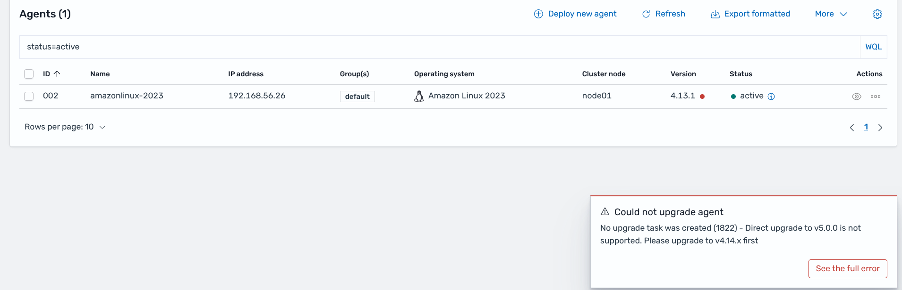
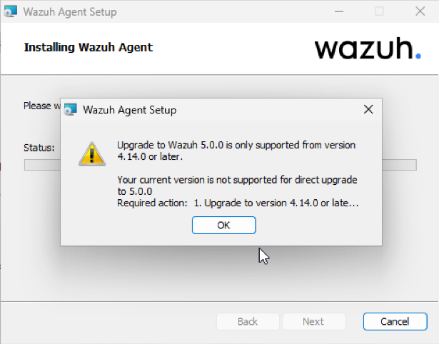

# Migration from Wazuh Agent 4.X to 5.0.0

This guide describes how to migrate Wazuh agents from 4.X to 5.0.0, including:

- Required upgrade path when the current agent is older than 4.14.X.
- Invalid and deprecated configuration elements in `ossec.conf`.
- Observed startup warnings and errors and their corresponding workarounds.
- Notes about `local_internal_options.conf` compatibility.

> [!IMPORTANT]
> This page covers **agents** only. A Wazuh **manager** cannot be upgraded in place from 4.x: `install.sh`, the
> DEB `preinst` and the RPM `%pre` all refuse a manager whose installed version is older than 5.x, and nothing
> is changed:
>
> ```console
> ERROR: Upgrade from Wazuh manager versions prior to 5.x is not supported.
>
> Detected installed version: 4.14.0
>
> A clean installation of Wazuh manager 5.x is required.
> Refer to the 5.x migration guide for more information.
> ```
>
> A 5.0 manager is always a fresh installation, to which the 4.x data and configuration are carried over by
> hand — see [Manager migration from 4.x to 5.0](manager-4x-to-5x.md).

## Upgrade path requirements

Wazuh Agent 5.0.0 cannot be installed directly on agents running versions earlier than 4.14.0.

Required path:

1. Upgrade `4.X` -> `4.14.X`
2. Upgrade `4.14.X` -> `5.0.0`

If you attempt a direct `4.13.X` -> `5.0.0` package upgrade, installation is blocked by pre-install validation:

On the Dashboard:



On a Windows Agent:



On a linux terminal:

```console
UPGRADE BLOCKED: Incompatible version detected

Current version: v4.13.1
Target version:  5.0.0

Upgrade to Wazuh 5.0.0 is only supported from version 4.14.0 or later.
```

On a macOS terminal the message is less intuitive:

```console
sh-3.2# installer -pkg /Users/vagrant/Downloads/wazuh-agent-5.0.0-beta2.arm64.pkg -target /
installer: Package name is wazuh-agent-5.0.0-beta2.arm64
installer: Upgrading at base path /
installer: The upgrade failed. (The Installer encountered an error that caused the installation to fail. Contact the software manufacturer for assistance. An error occurred while running scripts from the package “wazuh-agent-5.0.0-beta2.arm64.pkg”.)
```

## Recommended migration workflow

1. Upgrade the agent to the latest available `4.14.X` package.
2. Validate the agent starts without new errors on `4.14.X`.
3. Upgrade from `4.14.X` to `5.0.0`.
4. Review `ossec.log` and fix any invalid/deprecated configuration elements listed below.
5. Restart the agent and verify healthy connectivity and module startup.

## Configuration migration (`ossec.conf`)

The following changes were identified during agent startup validation after upgrading to 5.0.0.

| 4.X configuration element | 5.0 status | Agent log message (observed) | Required action |
|---|---|---|---|
| `<client>...</client>` | Renamed | `WARNING: <config-profile> inside the legacy <client> block is ignored. Configure it under <agent>.` | Rename the block to `<agent>` and its inner `<server>` to `<manager>`. Only `<server><address>` and the `<enrollment>` sub-block are read out of a `<client>` block; every other option in it (`<config-profile>`, `<notify_time>`, `<crypto_method>`) stops taking effect until the block is renamed, and each one is named in a startup warning. |
| `<client><server><address>` | Read as fallback | `INFO: <agent><manager><endpoint> is not configured. Using <client><server><address> 'MANAGER_IP' with the default port 1517 and the default endpoint prefix 'wazuh-manager'. Replace the <client><server> block with a single <endpoint>MANAGER_IP:1517/wazuh-manager</endpoint>` | None, to keep connecting: the port defaults to `1517` and the request path to the manager's default prefix. Move it to `<agent><manager><endpoint>` for the supported end state — the message quotes the exact line to write. |
| `<client><enrollment>...</enrollment>` | Read | — | None, if the groups it names exist on the manager the agent enrolls against — see the note below. The enrollment identity — `<agent_name>`, `<groups>`, `<agent_address>`, `<authorization_pass_path>` — is read out of the legacy block, so an upgraded agent that has to re-enroll presents the same identity instead of registering again under its hostname with no group. Move it under `<agent>` when renaming the block. |
| `<client><server><port>1514</port></server></client>` | Changed default | — | The agent talks HTTPS to the manager on `1517`. Under `<agent><manager>` the port is part of `<endpoint>` (`MANAGER_IP:1517/wazuh-manager`, `1517` when omitted); inside a legacy `<client>` block the port is not read at all. |
| `<client><server><protocol>...</protocol></server></client>` | Ignored | — | Remove `<protocol>`. TCP is used. Inside a legacy `<client><server>` block only the address is read, and its siblings are dropped without a message; the `INFO: Ignoring the 'protocol' option. Switching to TCP.` line comes from `<protocol>` under `<agent>`. |
| `<client><crypto_method>...</crypto_method></client>` | Ignored | `WARNING: <crypto_method> inside the legacy <client> block is ignored: only <server> and <enrollment> are read from it.` | Remove `<crypto_method>`. AES is used. Under `<agent>` the same option reports `INFO: Ignoring the 'crypto_method' option. Switching to AES.` instead. |
| `<client_buffer>...</client_buffer>` (top level, a sibling of `<client>`) | Moved | `INFO: 'client_buffer' is no longer used and will be ignored. Event batching is configured under <agent><batch>.` | Remove `<client_buffer>`; configure batching under `<agent><batch>` if the defaults do not suit you. Nested inside `<client>` instead, it is reported by that block's own message: `WARNING: <client_buffer> inside the legacy <client> block is ignored: only <server> and <enrollment> are read from it.` |
| `<labels>...</labels>` (in `ossec.conf` or pushed through `agent.conf`) | Removed | `WARNING: (1223): 'labels' is no longer supported and will be ignored. Agent labels were removed in 5.0.0.` | Remove the block from the agent's `ossec.conf` and from every group's `agent.conf`. There is no 5.0 replacement for agent labels. |
| `<syscheck><scan_on_start>...</scan_on_start></syscheck>` | Invalid | `INFO: (1230): Invalid element in the configuration: 'scan_on_start'.` | Remove this element from `syscheck` (Always executed on start). |
| `<syscheck><synchronization>` `<max_eps>`, `<max_interval>`, `<response_timeout>`, `<queue_size>`, `<registry_enabled>`, `<thread_pool>` | Deprecated | `WARNING: The <max_eps> option is deprecated and no longer has any effect.` (one line per option) | None required; remove them when convenient. The 4.x default configuration sets `<max_eps>`, so an upgraded agent reports it. |
| `<wodle name="syscollector"><synchronization><max_eps>` | Deprecated | `WARNING: The <max_eps> option is deprecated and no longer has any effect.` | None required; remove it when convenient. The 4.x default configuration sets it, so an upgraded agent reports it. |
| `<rootcheck><check_files>...</check_files></rootcheck>` | Removed | `INFO: Rootcheck option 'check_files' is no longer supported. Use the FIM module instead.` | Remove from `rootcheck`; use FIM (`syscheck`) controls. |
| `<rootcheck><check_trojans>...</check_trojans></rootcheck>` | Removed | `INFO: Rootcheck option 'check_trojans' is no longer supported. Use the FIM module instead.` | Remove from `rootcheck`; use FIM (`syscheck`) controls. |
| `<rootcheck><rootkit_files>...</rootkit_files></rootcheck>` | Removed | `INFO: Rootcheck option 'rootkit_files' is no longer supported.` | Remove from `rootcheck`. |
| `<wodle name="cis-cat">...</wodle>` | Removed in 5.0 | `INFO: The 'cis-cat' module is deprecated. Use the SCA module instead.` | Migrate to SCA, then remove the `cis-cat` wodle block. See [Migrating from CIS-CAT and OpenSCAP to SCA](ciscat-openscap-to-sca.md). |
| `<wodle name="osquery">...</wodle>` | Removed in 5.0 | `INFO: The 'osquery' module is deprecated. Use the Syscollector module instead.` | Migrate to IT Hygiene, then remove the `osquery` wodle block. See [Migrating from OSquery to IT Hygiene](osquery-to-it-hygiene.md). |
| `<sca><skip_nfs>...</skip_nfs></sca>` | Deprecated/Unavailable | `INFO: Detected a deprecated configuration for SCA: 'skip_nfs' is no longer available.` | Remove `<skip_nfs>` from `sca`. See [SCA policies from 4.x to 5.x](sca-policies-4x-to-5x.md). |
| `<client><enrollment><auto_method>...</auto_method></enrollment></client>` | Ignored | `INFO: <auto_method> under <enrollment> is no longer used: enrollment always negotiates TLS 1.3. Ignoring.` | None required. The option was removed entirely and is accepted-but-ignored so an upgraded file still starts; remove it when convenient. See [TLS 1.3 enrollment enforcement](#tls-13-enrollment-enforcement-wazuh-manager-authd) below. |
| `<enrollment>`'s `<manager_address>`, `<port>`, `<interface_index>`, `<ssl_cipher>`, `<server_ca_path>`, `<agent_certificate_path>`, `<agent_key_path>` | Ignored | `INFO: <ssl_cipher> under <enrollment> is no longer used: enrollment reuses <agent><manager>/<agent><ssl>. Ignoring.` (one line per option, naming it) | None required; remove them when convenient. A 5.0 agent enrolls against the same `<agent><manager><endpoint>` and with the same `<agent><ssl>` material as every other request. |

### Additional observed parser side-effects

When invalid rootcheck/syscheck options remain in the configuration, the agent may also report:

```console
INFO: (1202): Configuration error at 'etc/ossec.conf'.
INFO: (1207): wazuh-rootcheck remote configuration in 'etc/ossec.conf' is corrupted.
```

These messages are resolved by removing the invalid elements listed above.

## `ossec.conf` quick before/after examples

### Agent connection block

Before (4.X style):

```xml
<client>
	<server>
		<address>MANAGER_IP</address>
		<port>1514</port>
		<protocol>tcp</protocol>
	</server>
	<crypto_method>aes</crypto_method>
</client>
```

After (5.0 compatible):

```xml
<agent>
	<manager>
		<endpoint>MANAGER_IP:1517</endpoint>
	</manager>
</agent>
```

`<client>` is renamed to `<agent>` in 5.0 and its inner `<server>` to `<manager>`: one block under two names, never both. Options for an agent that is already on 5.0 with the old block:

- **Leave it.** The agent reads `<client><server><address>` and uses port `1517`. It connects, and logs which value it inherited. The `<enrollment>` sub-block is read too, so the agent keeps the name, groups and password path it enrolls with. Nothing else in the block is read: options such as `<config-profile>` stop having an effect, and each one is named in a startup warning.
- **Rename it** to `<agent><manager>`, which is what a fresh 5.0 install ships. Every option in the block is read again. Renaming only the root tag is not enough: `<agent><server>` is rejected.

Recommended: rename it. The fallback exists so a remote upgrade cannot strand an agent, not as a configuration to keep.

#### The groups in the block must exist on the manager

An upgraded agent asks for the groups its `<enrollment>` block names. The manager refuses an enrollment that names a group it does not have, and it refuses the whole request: one unknown group in the list is enough, and the groups that do exist are not applied either. The agent then retries indefinitely without registering, reporting the manager's reason on every attempt:

```console
INFO: Enrolling as 'agent-01'. Groups: web,db,cache.
ERROR: Enrollment rejected by the manager: invalid request. Invalid Group(s) Name(s)
```

with the manager naming the first one it could not find:

```console
wazuh-manager-authd: ERROR: Invalid group: web
```

4.X validates groups the same way, so this is not a change in what a manager accepts. It matters when an agent is upgraded *and* pointed at a different manager than the one it was installed against: a rebuilt manager, a migration, or a group since deleted.

Create the groups on the target manager before upgrading, with `agent_groups -a -g <group>`, or remove `<groups>` from the block to let the agent fall back to `default`. An agent that asks for no groups is always accepted.

### Removed modules

The `cis-cat` and `osquery` modules are removed in 5.0, but their capabilities are provided by other components. Migrate the functionality **before** removing the blocks:

- `cis-cat` -> SCA. See [Migrating from CIS-CAT and OpenSCAP to SCA](ciscat-openscap-to-sca.md).
- `osquery` -> IT Hygiene. See [Migrating from OSquery to IT Hygiene](osquery-to-it-hygiene.md).

Once the functionality is migrated, remove the blocks from `ossec.conf`:

```xml
<wodle name="cis-cat">...</wodle>
<wodle name="osquery">...</wodle>
```

### Rootcheck and syscheck cleanup

Remove unsupported elements:

```xml
<syscheck>
	<!-- remove scan_on_start -->
</syscheck>

<rootcheck>
	<!-- remove check_files -->
	<!-- remove check_trojans -->
	<!-- remove rootkit_files -->
</rootcheck>

<sca>
	<!-- remove skip_nfs -->
</sca>
```

## `local_internal_options.conf` migration notes

`local_internal_options.conf` overrides values defined in the default `internal_options.conf`. Comparing the agent default internal options between `4.14.X` and `5.0.0`, **no agent-side option keys were removed or renamed**. All agent component namespaces remain valid in 5.0:

`agent`, `execd`, `logcollector`, `rootcheck`, `sca`, `syscheck`, `wazuh_command`, `wazuh_modules`, `windows`.

The internal options removed in 5.0 belong exclusively to **manager-side** components (for example `analysisd.*`, `remoted.*`, `wazuh_db.*`, `vulnerability-detection.*`). These never take effect on an agent, so they do not require any migration action on agent hosts.

`monitord.*` is **not** in that set. Those six rotation keys are read by the agent for its own log management and are unchanged in 5.0 — keep them. (On the *manager* they were renamed; see the manager configuration migration guide.)

The agent does not validate `local_internal_options.conf` against a schema. Keys that no module reads are silently ignored: they do not block startup and do not emit warning or error messages. Consequently, there are **no `local_internal_options.conf` entries that prevent a 5.0.0 agent from starting**, and no specific log messages are expected for this file during the upgrade.

Recommended handling:

1. Keep `local_internal_options.conf` as-is during the package upgrade.
2. Optionally, remove any manager-only keys that may have been copied into the agent file (for example `analysisd.*`, `remoted.*`, `wazuh_db.*`); they have no effect on the agent and are kept only for tidiness.

## Connectivity and interoperability checks

After upgrading and cleaning configuration, verify:

1. Agent successfully connects to the manager over HTTPS on port `1517`.
2. Agent and manager versions are both compatible with 5.0 communication protocol.
3. The agent holds a trust anchor at `/var/ossec/etc/certs/root-ca.pem` and verifies the manager. A remote upgrade delivers one — see [Trust anchor delivery to legacy agents](remote-agent-upgrade.md#trust-anchor-delivery-to-legacy-agents); a local package upgrade does not. On Linux, a `(4126)` in `ossec.log` means one was delivered but never installed, usually because the `openssl` command is missing — see [When the CA cannot be validated on the agent](remote-agent-upgrade.md#when-the-ca-cannot-be-validated-on-the-agent).

Port `1515` is the legacy enrollment listener, used only by 4.x agents, and `1514` is the legacy session listener that 4.x agents (and the remote upgrade of a 4.x agent) use. A 5.0 manager opens `1514` only when `<remote><legacy>` is configured, and `1515` follows it unless `<auth><legacy_enrollment>` is set explicitly. An upgraded agent never uses either: it keeps the identity it already has and does not enroll again, and a 5.0 agent registering for the first time does so over `POST /enroll` on `1517`, with an enrollment token.

The following are the messages of an agent still running **4.x** (not yet upgraded, or whose upgrade aborted) that cannot reach those legacy listeners, for example because the 5.0 manager was installed without `<remote><legacy>`. A 5.0 agent does not log them:

```console
ERROR: (1208): Unable to connect to enrollment service at '[MANAGER_IP]:1515'
WARNING: (4101): Waiting for server reply (not started). Tried: 'MANAGER_IP'. Ensure that the manager version is 'v5.0.0' or higher.
ERROR: (1216): Unable to connect to '[MANAGER_IP]:1514/tcp': 'Transport endpoint is not connected'.
```

Workaround checklist:

- Confirm manager is up and reachable from the agent host.
- Confirm the manager is a 5.0 installation (see [Manager migration from 4.x to 5.0](manager-4x-to-5x.md)).
- Confirm firewall/network rules allow `1517/tcp` (agent to manager). `1514/tcp` and `1515/tcp` are needed only while agents still on 4.x connect, enroll or are remotely upgraded.
- Confirm the agent points to the correct manager address. A carried-over 4.X file spells it `<client><server><address>`, which is read as a fallback; the 5.0 spelling is `<agent><manager><endpoint>`.
- Confirm the URL prefix matches the manager's `remote.https.global_prefix`. A mismatch answers every request `404`, never `401`, and is the single most commonly missed cause here.
- Confirm the trust anchor arrived. If verification is the problem, the agent names which check failed — see the message table in [Agent Not Connecting](../../ref/modules/client/README.md#agent-not-connecting).

## Package upgrade on the host

Installing the 5.0.0 package over a 4.14.X agent keeps `client.keys`, `ossec.conf` and `local_internal_options.conf`, by different means per package format. On Debian-based hosts the preinst copies the three files to `/var/ossec/packages_files/agent_config_files/`, and the postinst writes the 5.0 template as `ossec.conf.new` and then restores your copies over the package's. On RPM hosts nothing is staged: `client.keys` and `local_internal_options.conf` are `%config(noreplace)` and `ossec.conf` is `%ghost`, so rpm leaves yours in place and reports any file it did replace as `.rpmsave`/`.rpmnew`. Either way the agent restarts with its 4.X identity and configuration, reads the manager address from the legacy `<client>` block and connects over HTTPS on `1517` with the same id and key; no enrollment happens.

Two things to plan for when the upgrade is not run by hand on a terminal:

- On Debian-based hosts `dpkg -i` stops at a conffile prompt for `/etc/init.d/wazuh-agent` (`Configuration file '/etc/init.d/wazuh-agent' ... Package distributor has shipped an updated version`). Without a terminal it waits forever. Run it as `dpkg -i --force-confold wazuh-agent_5.0.0-*.deb` (or the equivalent apt option) so the local file is kept and the upgrade proceeds.
- Between unpack and postinst, `/var/ossec/etc/ossec.conf` and `client.keys` on disk are the package placeholders (a template with `MANAGER_IP`, an empty key file). An agent restarted in that window logs `ERROR: (4112): Invalid server address found: 'MANAGER_IP'` and `ERROR: (1215): No client configured. Exiting.` Do not restart the agent until the package manager has finished; if it did finish and the files are still the placeholders, the postinst did not run: complete it with `dpkg --configure wazuh-agent` and the backups under `packages_files/agent_config_files/` are restored. Passing a conffile flag there changes nothing, since those prompts belong to the unpack step, not to configure.

A package upgrade supplies no CA and checks nothing: the manager pushes its `root-ca.pem` only on the remote-upgrade path (see [Trust anchor delivery](remote-agent-upgrade.md#trust-anchor-delivery-to-legacy-agents)), and the pre-install gate described under [Certificate trust check](#certificate-trust-check) belongs to the WPK installer, which does not run here.

The consequence is quiet rather than loud. A 4.X `ossec.conf` carries no `<ssl>` block, so the upgraded agent lands on the last row of the resolution table: with no anchor on disk it resolves to `none`, connects, and verifies nothing, logging `TLS verification is DISABLED (verification_mode=none).` It does not refuse to start and it does not fail to connect, so a fleet upgraded this way is working and unverified unless you look. Place the manager's CA at `/var/ossec/etc/certs/root-ca.pem` (`<installdir>\certs\root-ca.pem` on Windows) before the upgrade, `0640 root:wazuh` so the agent can read it, or set `<certificate_authorities>` explicitly; the same agent then comes up verifying with `full`.

## Remote upgrade (WPK)

A remote upgrade from 4.14.X to 5.0.0 never rewrites `ossec.conf`: the file the 4.X agent had is the file the 5.0 agent reads, which is why the `<client>` fallback above exists.

Before installing anything, the WPK installer checks that the manager answers HTTPS on the port/endpoint the upgraded agent will use, retrying a few times in case it's briefly unreachable, and aborts if it still does not. On hosts whose TLS stack can't negotiate the manager's TLS 1.3 minimum (e.g. EL7-era/Amazon Linux 2 system crypto libraries), the check falls back to a plain TCP connectivity check instead of treating that incompatibility as "manager unreachable":

```console
2026/07/31 00:26:57 - Checking connectivity to MANAGER_IP:1517/wazuh-manager.
2026/07/31 00:26:58 - Upgrade failed. The manager is not reachable at MANAGER_IP:1517/wazuh-manager, interrupting upgrade.
```

The abort happens before the package manager runs, so the agent stays on 4.14.X, keeps running, and the upgrade can be retried once `1517` is reachable. `upgrade_result` is `2`.

The target address and port come from the same place the agent reads them: `<agent><manager>` first, then `<client><server><address>`, with `1517` as the port default.

### Certificate trust check

A 4.X agent never verified the manager's certificate at all. A 5.0 agent decides what to do from two inputs: what `<agent><ssl>` says, and whether a trust anchor is on disk at `/var/ossec/etc/certs/root-ca.pem` (`<installdir>\certs\root-ca.pem` on Windows). There is no single default:

| `<ssl>` says | Anchor on disk | The upgraded agent |
|---|---|---|
| `<verification_mode>` is set | either | honours it, `none` included |
| only `<certificate_authorities>` is set | either | `certificate`, against that file |
| nothing | present | `full`, with the anchor as the CA |
| nothing | absent | `none`: it connects, and verifies nothing |

An explicit `none` with an anchor present is still honoured, and logged as `(4122)` at warning level for giving up a verification the host was equipped to perform.

Before installing anything, the WPK installer checks that the combination the upgraded agent will boot into can work at all, and aborts when it cannot:

- `full` or `certificate` — set explicitly, or resolved from a `<certificate_authorities>` with no mode — whose CA file is missing or unreadable;
- the same two modes with no `<certificate_authorities>` configured and no anchor on disk;
- an explicit `system` with `<certificate_authorities>` also set, which the agent refuses to start with;
- a `system` that the host's own trust store does not verify the manager against, whether it was set explicitly or resolved by default;
- a `<verification_mode>` that is not one of the four accepted values.

A 4.X agent carries none of that: a `<client>` block cannot express TLS verification. With no anchor available, the installer checks whether the host's own trust store verifies the manager's certificate, and when it does not, the outcome depends on whether it can tell that the installed agent predates 5.0:

- **Linux** (the version comes from `dpkg-query` or `rpm`) and **Windows** (from the installed version): the upgrade proceeds, and the agent lands on the last row of the table — running unverified. `logs/upgrade.log` (`upgrade\upgrade.log` on Windows) says so:

  ```console
  2026/09/14 10:12:33 - No trust anchor is present at ./etc/certs/root-ca.pem; the upgraded agent will run unverified unless <ssl><verification_mode> and <certificate_authorities> are configured explicitly. To enable verification: place the manager's CA at ./etc/certs/root-ca.pem and re-run the upgrade, or configure <certificate_authorities> explicitly and restart the agent.
  ```

- **macOS**: there is no package query to answer it, so the same 4.X migration aborts instead.

The anchor is what changes that outcome. The manager sends it over the upgrade channel by default, and the installer validates it before installing it — see [Trust anchor delivery to legacy agents](remote-agent-upgrade.md#trust-anchor-delivery-to-legacy-agents) and, for the cases where it cannot be validated (including a Linux host without the `openssl` command), [When the CA cannot be validated on the agent](remote-agent-upgrade.md#when-the-ca-cannot-be-validated-on-the-agent). Or you place it at the path above before upgrading. Either way, `ossec.conf` is never edited by the upgrade, and an agent that finds the anchor without a `<verification_mode>` of its own comes up verifying with `full` against it.

As with the connectivity check, an abort happens before the package manager runs: the agent stays on 4.14.X, keeps running, and the upgrade can be retried. `upgrade_result` is `2`.

This matters most for a fleet whose manager certificate is issued by the deployment's own CA rather than a publicly-trusted one, so that no host's trust store verifies it: without an anchor, Linux and Windows agents upgrade into an unverified connection and macOS upgrades abort. Place the CA (or make sure the delivered one validates) ahead of a fleet-wide upgrade rather than discovering the gap one agent at a time.

## TLS 1.3 enrollment enforcement (`wazuh-manager-authd`)

Wazuh 5.0 raises the minimum TLS protocol version of the manager's legacy enrollment listener (`wazuh-manager-authd`, port `1515`) to TLS 1.3 and removes the `ssl_auto_negotiate` fallback that previously allowed negotiating down to TLS 1.0. That listener serves only agents still on 4.x, and only while it is open (see [Connectivity and interoperability checks](#connectivity-and-interoperability-checks)); a 5.0 agent enrolls over `POST /enroll` on `1517`, whose TLS settings are `<remote><https>`'s.

### Manager: `<auth><ciphers>` must use a TLS 1.3 ciphersuite list

Do not carry a 4.x `<auth><ciphers>` value into `wazuh-manager.conf`. In 5.0 it is a colon-separated list of TLS 1.3 ciphersuite names, and `wazuh-manager-authd` accepts only these: `TLS_AES_128_GCM_SHA256`, `TLS_AES_256_GCM_SHA384`, `TLS_CHACHA20_POLY1305_SHA256`, `TLS_AES_128_CCM_SHA256`, `TLS_AES_128_CCM_8_SHA256`. Omit the option to use the default, `TLS_AES_256_GCM_SHA384:TLS_CHACHA20_POLY1305_SHA256:TLS_AES_128_GCM_SHA256`.

A 4.x-style OpenSSL cipher-list string (for example the 4.x default, `HIGH:!ADH:!EXP:!MD5:!RC4:!3DES:!CAMELLIA:@STRENGTH`) does not match the schema's `TLS_<NAME>[:TLS_<NAME>...]` pattern, so `wazuh-manager-control start` refuses the configuration before starting any daemon, logging:

```console
(1244): Invalid configuration at '/auth/ciphers': does not satisfy 'pattern' [...]
```

A value of the right shape that names a ciphersuite outside the list above passes that check and is refused by `wazuh-manager-authd`'s own configuration check, which `wazuh-manager-control start` also runs before starting anything (`wazuh-manager-authd: Configuration error. Exiting`):

```console
ERROR: Invalid TLS 1.3 cipher suite 'TLS_AES_256_CBC_SHA' in 'ciphers' option
```

`<auth><ssl_auto_negotiate>` was removed entirely. Carried into `wazuh-manager.conf` it is an unknown option, and the manager refuses to start:

```console
(1244): Invalid configuration at '/auth/ssl_auto_negotiate': unknown option (does not satisfy 'additionalProperties') [schema /properties/auth].
```

### Agent: `<enrollment><ssl_cipher>` is no longer read

A 5.0 agent ignores `<ssl_cipher>` under `<enrollment>` (in `<agent>` or in a legacy `<client>` block), logging `INFO: <ssl_cipher> under <enrollment> is no longer used: enrollment reuses <agent><manager>/<agent><ssl>. Ignoring.`, and `<auto_method>` likewise (see the configuration table above). Enrollment uses the same TLS settings as every other request to the manager. To restrict the agent's TLS 1.3 ciphersuites, set `<agent><ssl><ciphers>` to a colon-separated list of the names above; it is checked when the configuration is read, and an unknown name stops the agent from starting:

```console
ERROR: Invalid TLS 1.3 cipher suite 'HIGH' in the 'ciphers' option.
```

### Agents not yet upgraded past 4.14.x

A 4.x agent that enrolls against a 5.0 manager does so on `1515`, which negotiates TLS 1.3 only, with the ciphersuites `<auth><ciphers>` allows.

## Validation checklist

Migration is complete when all conditions below are met:

- Agent was upgraded using the required version path.
- No invalid `syscheck`/`rootcheck` element warnings remain.
- The connection block is `<agent><manager><endpoint>`, and no `<client>` fallback message remains in `ossec.log`.
- No deprecated `protocol` or `crypto_method` messages remain.
- Agent stays connected to the manager and sends events normally.
- No `Invalid TLS 1.3 cipher suite ...` error appears in the manager log or in `ossec.log`, and no `under <enrollment> is no longer used` message remains in `ossec.log`.
