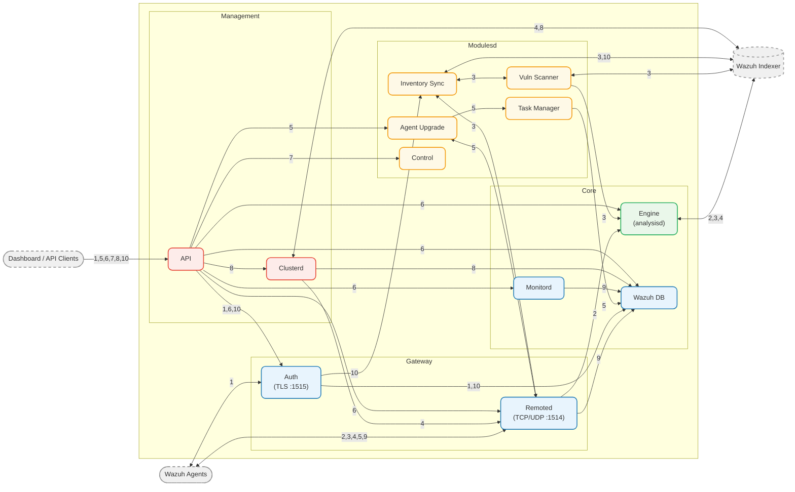

# Architecture

## Server

The Wazuh Manager is a multi-daemon system where each component runs as a separate process. Components communicate through **Unix domain sockets** located under `queue/sockets/`. The major architectural change in 5.0 is the **Engine** (replacing the legacy `analysisd`) as the core event processing pipeline.

### High-Level Architecture

### Daemons

| Daemon         | Binary                    | Purpose                                                                                                                      |
| -------------- | ------------------------- | ---------------------------------------------------------------------------------------------------------------------------- |
| **Engine**     | `wazuh-manager-analysisd` | Event processing, event generation (replaces legacy analysisd)                                                               |
| **Remoted**    | `wazuh-manager-remoted`   | Agent communication gateway — decrypts, enriches, and forwards events to the Engine                                          |
| **Wazuh DB**   | `wazuh-manager-db`        | SQLite-based database daemon for agent and global state                                                                      |
| **Monitord**   | `wazuh-manager-monitord`  | Agent monitoring and log rotation                                                                                            |
| **Auth**       | `wazuh-manager-authd`     | Agent registration and enrollment via TLS (port 1515)                                                                        |
| **Server API** | `wazuh-manager-apid`      | REST API (Python/Starlette, HTTPS) with JWT auth and RBAC                                                                    |
| **Modules**    | `wazuh-manager-modulesd`  | Hosts manager-side modules: vulnerability scanner, inventory sync, agent upgrade, task manager, and control (restart/reload) |
| **Cluster**    | `wazuh-manager-clusterd`  | Multi-node master-worker synchronization (Python, asyncio)                                                                   |

> **Note:** The manager also ships CLI tools (`wazuh-manager-control`, `wazuh-manager-keystore`, etc.) listed in the [CLI Tools](#cli-tools) section below.

### Shared Libraries

| Library               | Source                             | Consumers                                                      | Purpose                                                                           |
| --------------------- | ---------------------------------- | -------------------------------------------------------------- | --------------------------------------------------------------------------------- |
| **Indexer Connector** | `shared_modules/indexer_connector` | Engine, Vulnerability Scanner, Inventory Sync, Content Manager | Client library for pushing data to the Wazuh Indexer                              |
| **Content Manager**   | `shared_modules/content_manager`   | Vulnerability Scanner, Modulesd                                | Plugin framework for downloading and managing content (feeds, rulesets)           |
| **Router**            | `shared_modules/router`            | Remoted, Wazuh DB, Auth, Inventory Sync, Agent Upgrade         | Pub/sub IPC messaging between daemons via per-topic sockets under `queue/router/` |
| **Keystore**          | `shared_modules/keystore`          | Indexer Connector                                              | AES-256 encrypted credential store (RocksDB)                                      |

### CLI Tools

| Binary                   | Purpose                                                                  |
| ------------------------ | ------------------------------------------------------------------------ |
| `wazuh-manager-control`  | Service control script — start, stop, restart, and status of all daemons |
| `wazuh-manager-keystore` | Manage secrets in the encrypted keystore (AES-256, RocksDB)              |
| `verify-agent-conf`      | Validate `agent.conf` syntax for shared group configurations             |
| `agent_groups`           | Manage agent group assignments                                           |
| `agent_upgrade`          | Orchestrate agent WPK upgrades                                           |
| `cluster_control`        | Query cluster status and node health                                     |
| `rbac_control`           | Manage RBAC policies and role assignments                                |

### Data Flow

1. **Agent Registration** — Agent connects directly to **Auth** over TLS (port 1515), or client sends registration request via **API** → **Auth** (`queue/sockets/auth`). Auth generates and returns an agent key, then persists the agent record in **Wazuh DB** (`queue/db/wdb`).
2. **Event Processing** — Agent sends stateless events (logs, SCA, etc.) to **Remoted** over AES-encrypted TCP/UDP (port 1514). Remoted decrypts, enriches with agent metadata, and forwards via HTTP POST (`queue-http.sock`) to the **Engine**. The Engine routes events through policies and pushes resulting events to the **Wazuh Indexer** via Indexer Connector. The Engine also pulls content (rulesets, configurations) from the Indexer via its internal **cmsync** module.
3. **Inventory & Vulnerability Scan** — Agent sends inventory data (packages, OS, etc.) to **Remoted**, which publishes it to **Router** topic `inventory-states`. **Inventory Sync** subscribes to the Router topic, syncs state to the **Indexer** (via Indexer Connector), then triggers **Vulnerability Scanner** directly (in-process singleton calls within modulesd). The scanner queries CVE feeds from the Indexer (via Content Manager → Indexer Connector), matches against the agent's packages, and sends vulnerability events to the **Engine** (via `queue-http.sock`) and vulnerability state to the **Indexer** (via Indexer Connector). The scanner locks/unlocks agents in Inventory Sync during feed-update scans to prevent race conditions.
4. **Active Response** — The **Engine** produces events and sends them to the **Wazuh Indexer** (via Indexer Connector). The Indexer's internal processes evaluate these events against its own rules and generate active response findings, indexing them into `wazuh-active-responses*`. **Clusterd** polls this index periodically (~30s), filters to agents connected to the local node, and dispatches commands via `queue/sockets/ar`. **Remoted**'s AR_Forward thread reads the socket and delivers the command to the agent over the encrypted channel. The agent's `execd` daemon executes the corresponding active response script.
5. **Agent Upgrade** — Client sends an upgrade request via **API** → **Agent Upgrade** (`queue/tasks/upgrade`) module. AU sends the WPK upgrade command to **Remoted** (via `queue/sockets/ar`), which delivers it to the agent. The agent reports completion back through **Remoted** → **Router** topic `upgrade_notifications` → AU. AU delegates task tracking to **Task Manager** (`queue/tasks/task`), which persists state in **Wazuh DB** (`queue/db/wdb`).
6. **API Query** — Client sends an HTTPS request to the **Server API**. The API connects directly to **Engine** (`queue/sockets/analysis`), **Wazuh DB** (`queue/db/wdb`), **Remoted** (`queue/sockets/remote`), **Monitord** (`queue/sockets/monitor`), or **Auth** (`queue/sockets/auth`) depending on the endpoint. The **DAPI** layer transparently routes requests across cluster nodes.
7. **Manager Restart/Reload** — Client sends a restart or reload request via **API** → **wm_control** module (`queue/sockets/control`), which signals the appropriate daemons.
8. **Cluster Sync** — **Clusterd** synchronizes agent registration and shared configuration between master and worker nodes using Fernet-encrypted connections. It reads/writes agent state via **Wazuh DB** (`queue/router/wdb-http.sock`) and connects to the **Wazuh Indexer** (via Python opensearchpy) for active response dispatch, agent sync, and metrics. The API forwards cluster queries to Clusterd (`queue/cluster/c-internal.sock`).
9. **Agent Monitoring** — **Remoted** updates agent connection state (keep-alive, disconnection) in **Wazuh DB** (`queue/db/wdb`). **Monitord** handles log rotation and periodic state checks via **Wazuh DB** (`queue/db/wdb`).
10. **Agent Deletion** — Client sends a delete request via **API** → **Auth** (`queue/sockets/auth`). Auth removes the agent from **Wazuh DB** (`queue/db/wdb`) and notifies **Inventory Sync** via **Router** topic `inventory-states` to delete the agent's state from the **Indexer**.

### IPC (Unix Domain Sockets)

All inter-process communication uses Unix domain sockets under `queue/sockets/`:

| Socket                          | Used By                                          |
| ------------------------------- | ------------------------------------------------ |
| `queue/sockets/queue-http.sock` | Engine event ingestion (HTTP)                    |
| `queue/sockets/analysis`        | Engine REST API (HTTP)                           |
| `queue/sockets/auth`            | wazuh-manager-authd                              |
| `queue/sockets/remote`          | wazuh-manager-remoted control                    |
| `queue/sockets/monitor`         | wazuh-manager-monitord                           |
| `queue/sockets/control`         | wm_control module (restart/reload via API)       |
| `queue/sockets/keystore`        | Keystore IPC                                     |
| `queue/sockets/ar`              | Active response / agent command dispatch         |
| `queue/tasks/task`              | Task Manager                                     |
| `queue/tasks/upgrade`           | Upgrade task queue                               |
| `queue/db/wdb`                  | wazuh-manager-db                                 |
| `queue/cluster/c-internal.sock` | wazuh-manager-clusterd internal IPC              |
| `queue/router/wdb-http.sock`    | wazuh-manager-db HTTP API (used by cluster, API) |
| `queue/router/*`                | Router pub/sub per-topic sockets                 |
