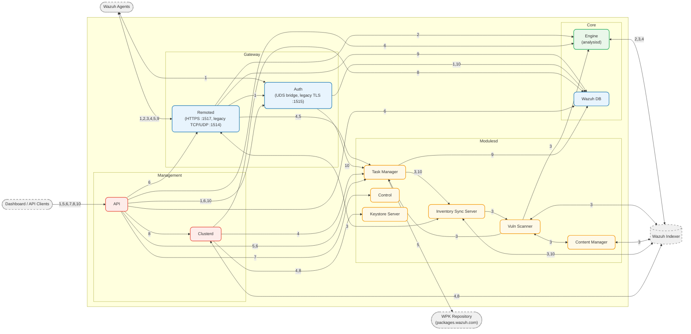

# Architecture

## Server

The Wazuh Manager is a multi-daemon system where each component runs as a separate process. Components communicate through **Unix domain sockets** located under `queue/sockets/`. The major architectural change in 5.0 is the **Engine** (replacing the legacy `analysisd`) as the core event processing pipeline.

### High-Level Architecture

```mermaid
---
config:
  title: "Wazuh Manager Architecture"
  flowchart:
    nodeSpacing: 20
    rankSpacing: 50
---
flowchart LR

classDef ext fill:#f0f0f0,stroke:#999,stroke-width:2px,stroke-dasharray:6px,rx:10
classDef d fill:#e8f4fd,stroke:#2980b9,stroke-width:2px,rx:10
classDef e fill:#eaf7ea,stroke:#27ae60,stroke-width:2px,rx:10
classDef m fill:#fef9e7,stroke:#f39c12,stroke-width:2px,rx:10
classDef a fill:#fdecea,stroke:#e74c3c,stroke-width:2px,rx:10

agents(["Wazuh Agents"]):::ext
clients(["Dashboard / API Clients"]):::ext

subgraph manager[" "]
  direction LR

  subgraph gw["Gateway"]
    direction TB
    authd["Auth<br/>(UDS bridge, legacy TLS :1515)"]:::d
    remoted["Remoted<br/>(HTTPS :1517, legacy TCP/UDP :1514)"]:::d
  end

  subgraph core["Core"]
    direction TB
    engine["Engine<br/>(analysisd)"]:::e
    wdb["Wazuh DB"]:::d
  end

  subgraph modulesd["Modulesd"]
    direction TB
    vs["Vuln Scanner"]:::m
    cm["Content Manager"]:::m
    is["Inventory Sync Server"]:::m
    tm["Task Manager"]:::m
    ctrl["Control"]:::m
    ks["Keystore Server"]:::m
  end

  subgraph mgmt["Management"]
    direction TB
    api["API"]:::a
    clusterd["Clusterd"]:::a
  end
end

indexer[("Wazuh Indexer")]:::ext
wpk(["WPK Repository<br/>(packages.wazuh.com)"]):::ext

%% External → Gateway
agents <-->|1| authd
agents <-->|1,2,3,4,5,9| remoted

%% Gateway → Gateway (POST /enroll bridges to authd's local socket: the 5.x registration path)
remoted -->|1| authd

%% Gateway → Core
remoted -->|2| engine
remoted -->|9| wdb
authd -->|1,10| wdb

%% Modulesd → Core
vs -->|3| engine
tm -->|9| wdb

%% Modulesd internal (in-process VD scan lane)
is -->|3| vs
vs -->|3| tm

%% Task Manager dispatches its manager tasks to Inventory Sync Server's internal routes
tm -->|3,10| is

%% The WPK download for an upgrade request: modulesd's only connection outside the deployment
tm -->|5| wpk

%% CVE feed downloads: VD registers a provider, Content Manager pages the feed back to it
vs <-->|3| cm

%% Modulesd ↔ Gateway (UDS relay: POST /stateful → queue/sockets/inventory-sync-http.sock)
remoted <-->|3| is

%% Remoted asks for an agent's pending tasks and hands them back in the POST /control response
remoted -->|4,5| tm

%% Auth records the indexer purge as a task rather than calling Inventory Sync itself
authd -->|10| tm

%% Core / Modulesd → Indexer
engine <-->|2,3,4| indexer
vs <-->|3| indexer
cm <-->|3| indexer
is <-->|3,10| indexer
clusterd <-->|4,8| indexer
clusterd -->|8| wdb

%% Active response: clusterd turns each finding into an agent task; remoted hands it to the agent
clusterd -->|4| tm

%% Clusterd reads the Indexer credentials from the keystore before any Indexer access
clusterd -->|4,8| ks

%% Management → Internal
api -->|5,6| tm
api -->|6| engine & wdb & remoted
api -->|1,6,10| authd
api -->|7| ctrl
api -->|8| clusterd

%% External → Management
clients -->|1,5,6,7,8,10| api
```

### Daemons

| Daemon         | Binary                    | Purpose                                                                                                                      |
| -------------- | ------------------------- | ---------------------------------------------------------------------------------------------------------------------------- |
| **Engine**     | `wazuh-manager-analysisd` | Event processing, event generation (replaces legacy analysisd)                                                               |
| **Remoted**    | `wazuh-manager-remoted`   | Agent communication gateway — HTTPS agent API on port 1517 (enrollment, events, state sync, control, downloads); legacy AES TCP/UDP on 1514 for 4.x agents, opt-in via `<remote><legacy>` |
| **Wazuh DB**   | `wazuh-manager-db`        | SQLite-based database daemon for agent and global state                                                                      |
| **Auth**       | `wazuh-manager-authd`     | Owns all agent registration logic. Reached by Remoted's `POST /enroll` over its local socket for 5.x agents; its own TLS listener on port 1515 serves 4.x agents, gated by `<auth><legacy_enrollment>` |
| **Server API** | `wazuh-manager-apid`      | REST API (Python/Starlette, HTTPS) with JWT auth and RBAC                                                                    |
| **Modules**    | `wazuh-manager-modulesd`  | Hosts manager-side modules: vulnerability scanner, inventory sync server, keystore server, content manager, task manager (which also serves agent upgrades), and control (restart/reload) |
| **Cluster**    | `wazuh-manager-clusterd`  | Multi-node master-worker synchronization (Python, asyncio)                                                                   |

> **Note:** The manager also ships CLI tools (`wazuh-manager-control`, `wazuh-manager-keystore`, etc.) listed in the [CLI Tools](#cli-tools) section below.

### Modulesd Module Composition

A manager-side module hosted by `wazuh-manager-modulesd` is three pieces, not one. The split is what lets a C daemon host C++ modules, and it is why the same name can appear in two directories.

| Layer                  | Location                        | Build output                            | Role                                                                                                                                                                                                                                     |
| ---------------------- | ------------------------------- | --------------------------------------- | ---------------------------------------------------------------------------------------------------------------------------------------------------------------------------------------------------------------------------------------- |
| **Shim**               | `wazuh_modules/src/wm_<name>.c` | compiled into `wazuh-manager-modulesd`  | Declares the module's `wm_context` (`start`, `stop`, `destroy`, `dump`, `query`), registers it in `wmodules.c`, then `dlopen`s the implementation and calls its `extern "C"` entry points. The C↔C++ ABI boundary; ~100 lines, no logic of its own. |
| **Implementation**     | `wazuh_modules/<name>/`         | `lib<name>.so`, loaded by the shim      | The module proper. Exports a flat `<name>_start()` / `<name>_stop()` pair and nothing else.                                                                                                                                              |
| **Shared library**     | `shared_modules/<name>/`        | `.so` or `.a`, linked by its consumers  | Reusable code with more than one consumer. Not a module: no `wm_context`, no registration.                                                                                                                                               |

| Module                    | Implementation                         | Shim                            |
| ------------------------- | -------------------------------------- | ------------------------------- |
| **Vulnerability Scanner** | `wazuh_modules/vulnerability_scanner/` | `wm_vulnerability_scanner.c`    |
| **Inventory Sync Server** | `wazuh_modules/inventory_sync_server/` | `wm_inventory_sync_server.c`    |
| **Task Manager**          | `wazuh_modules/task_manager/`          | `wm_task_manager.c`             |
| **Keystore Server**       | `wazuh_modules/keystore_server/`       | `wm_keystore_server.c`          |
| **Content Manager**       | `shared_modules/content_manager/`      | `wm_content_manager.c`          |
| **Control**               | —                                      | `wm_control.c`                  |

`Control` is plain C compiled straight into modulesd, so it has no `.so` and no ABI boundary to cross — it is the one entry above with no implementation directory.

`wazuh_modules/` is a shared tree: it also holds the agent's modules — `agent_info`, `agent_upgrade`, `sca`, `syscollector` — which use the same three-layer shape but are compiled only under `#ifdef CLIENT`. None of them is registered in a manager build, so the table above is the manager's complete module set.

### Shared Libraries

| Library               | Source                             | Consumers                                                                              | Purpose                                                                                                                                                                    |
| --------------------- | ---------------------------------- | -------------------------------------------------------------------------------------- | -------------------------------------------------------------------------------------------------------------------------------------------------------------------------- |
| **Indexer Connector** | `shared_modules/indexer_connector` | Engine, Vulnerability Scanner, Inventory Sync Server, Content Manager                    | Client library for reading from and pushing to the Wazuh Indexer. Per-instance classes with RAII lifetimes; reads Indexer credentials through the Keystore library.        |
| **Content Manager**   | `shared_modules/content_manager`   | Vulnerability Scanner (links it), Modulesd (registers it as a module)                    | Fetches CVE feed documents from the Indexer with Point-In-Time pagination and delivers them page-by-page to a registered callback. Also a modulesd module — see above.      |
| **Keystore**          | `shared_modules/keystore`          | Indexer Connector, Keystore Server, `wazuh-manager-keystore` CLI                         | AES-256 encrypted credential store (RocksDB). Static library, in-process only; socket access is the Keystore Server module's job.                                          |
| **UDS HTTP Server**   | `shared_modules/uds_http_server`   | Wazuh DB, Inventory Sync Server, Task Manager, Vulnerability Scanner, Remoted             | Asio-based HTTP/1.1 server over a Unix socket. The shared transport behind every HTTP socket listed below except the Engine's two, which the Engine serves itself.          |
| **Metrics**           | `shared_modules/metrics`           | Remoted, Vulnerability Scanner, Inventory Sync Server, Task Manager                       | Counters, gauges, histograms, pull metrics and a sliding-window rate behind a thread-safe registry, with a deterministic JSON dump. Static library, STL-only public headers, and deliberately **not** a singleton: each daemon owns a `Manager` and injects it. Kept under its own target and namespace rather than sharing the Engine's `fastmetrics`, which lives in the same build tree — one `Manager` under both names would be a silent ODR trap. |

### CLI Tools

| Binary                   | Purpose                                                                  |
| ------------------------ | ------------------------------------------------------------------------ |
| `wazuh-manager-control`  | Service control script — start, stop, restart, and status of all daemons |
| `wazuh-manager-keystore` | Manage secrets in the encrypted keystore (AES-256, RocksDB)              |
| `verify-agent-conf`      | Validate `agent.conf` syntax for shared group configurations             |
| `agent_groups`           | Manage agent group assignments                                           |
| `agent_upgrade`          | Orchestrate agent WPK upgrades                                           |
| `cluster_control`        | Query cluster status and node health                                     |
| `rbac_control`           | Manage RBAC policies and role assignments                                |

### Data Flow

1. **Agent Registration** — A 5.x agent POSTs its registration request to **Remoted**'s HTTPS route `POST /enroll` (port 1517, the same connection and TLS configuration it uses for everything afterward), which bridges it to **Auth** over Auth's local socket (`queue/sockets/auth.sock`). A 4.x agent instead connects directly to **Auth** over TLS on port 1515, which remains available via `<auth><legacy_enrollment>`; a client may also register via **API** → **Auth**. Auth owns all enrollment logic in every case: it generates and returns an agent key, then persists the agent record in **Wazuh DB** (`queue/sockets/wdb.sock`).
2. **Event Processing** — Agent sends stateless events (logs, SCA, etc.) to **Remoted**'s authenticated HTTPS route `POST /stateless` (port 1517, authenticated with the agent's `wazuh-agent+jwt` bearer token, the transport a 5.x agent uses). 4.x agents send events over the classic AES-encrypted TCP/UDP channel (port 1514), which remains available via `<remote><legacy>`. The two paths differ in what Remoted does with the batch: on the HTTPS route it verifies the signature, cross-checks the batch's `wazuh.agent.id` against the authenticated agent, and forwards the body **verbatim** — the agent supplies its own metadata in the batch's `H` line, so there is nothing to enrich; on the legacy channel it decrypts the message and enriches it from its in-memory agent-metadata cache, which is what the keep-alives on that channel are for. Either way the batch reaches the **Engine** via HTTP POST (`engine-ingest-http.sock`). The Engine routes events through policies and pushes resulting events to the **Wazuh Indexer** via Indexer Connector. The Engine also pulls content (rulesets, configurations) from the Indexer via its internal **cmsync** module.
3. **Inventory & Vulnerability Scan** — Agent POSTs a whole synchronization session (one FlatBuffers `FullSession`) to **Remoted**'s authenticated HTTPS route `POST /stateful`, and Remoted relays it over UDS (`queue/sockets/inventory-sync-http.sock`) to **Inventory Sync Server** in modulesd. The server validates the session, applies it to the **Indexer** (via Indexer Connector) and answers; the HTTP response relayed back to the agent IS the session result. Vulnerability-detection sessions run through a dedicated scan lane that executes the **Vulnerability Scanner** synchronously BEFORE indexing, so a `200` guarantees both the scan and the ingest. The scanner queries CVE feeds from the Indexer (via Content Manager → Indexer Connector), matches against the agent's packages, and sends vulnerability events to the **Engine** (via `engine-ingest-http.sock`) and vulnerability state to the **Indexer** (via Indexer Connector). Feed-update scans and session scans coordinate through a per-agent registry, so they never race. An **on-demand** rescan is the one path that is not inline: remoted (or the API) posts to the scanner's own socket, and the scanner records a `vd_scan` manager task with **Task Manager** rather than scanning on the caller's thread, so the answer is an admission and the scan itself survives a restart. Task Manager later runs it against `POST /_internal/vd/scan` on **Inventory Sync Server**.
4. **Active Response** — The **Engine** produces events and sends them to the **Wazuh Indexer** (via Indexer Connector). The Indexer's internal processes evaluate these events against its own rules and generate active response findings, indexing them into `wazuh-active-responses*`. **Clusterd** polls this index periodically (`active_response_polling`, 30s by default) and dispatches an `active_response` task per agent to **Task Manager** (`queue/sockets/task.sock`), the same path used for `remote_upgrade`. There is deliberately **no filtering by status or by connected node**: stateless HTTPS means no node owns an agent, so the agent-to-worker assignment that such filtering relied on no longer exists. Tasks simply wait in the database until the agent polls for them. The bookmark that drives that polling is a **high-water mark of what was read**, not of what was delivered: it is written once per page and clears every document the page returned, whatever happened to each one, and the read itself is bounded at the present instant. That is what keeps one document from either skipping the rest of the stream (a future `@timestamp` used to move the cursor past every response created before it) or freezing it (a document discarded before dispatch used to leave the cursor on its page, re-read every cycle). The exception is a response whose referenced event is not visible in its own index yet: that one is still deliverable, so the page is held short of it and read again on the next cycle, for up to two minutes. Past that the reference is taken as broken, because holding for an event that never appears would stop delivery fleet-wide. A response that cannot be delivered is lost, and every path that loses one says so at `WARNING` or above: delivery guarantees are the Task Manager's job, not the cursor's. For an agent on v5.0.0+, the task is handed back in a `POST /control` response and forwarded to the agent's `execd` daemon, which executes the corresponding active response script. Active response has no delivery path for agents below v5.0.0 (removed with the legacy TCP/UDP protocol); a task targeting one is dropped.
5. **Agent Upgrade** — Client sends an upgrade request via **API** → **Task Manager** (`queue/sockets/task.sock`, `POST /v1/agents/upgrade`, or `/v1/agents/upgrade-custom` for a WPK already staged on the node). Task Manager validates each agent, downloads the WPK from the **WPK repository** over HTTPS and checks its SHA-1 against the repository's own index — once per distinct package, not once per agent — then writes a `remote_upgrade` task per agent into its own database (`queue/tasks/tasks.db`) in a single transaction. That download is the only connection modulesd makes outside the deployment, and peer verification on it can never be turned off: the expected SHA-1 arrives over the same channel as the file, so an unverified channel would leave the integrity check confirming whatever a man in the middle supplied. Delivery then depends on the agent's version, and the manager never pushes to a 5.x agent:
    - **v5.0.0+** — the task is handed back in the response to the agent's next `POST /control` `notify`, and the agent **pulls** the WPK itself via `POST /download`.
    - **Below v5.0.0** — a polling thread in **Remoted** (gated on the legacy channel) walks the connected agents, asks Task Manager for each one's pending task, and pushes the WPK down its existing session using the legacy six-step WPK push. This path exists only so 4.x agents remain upgradable; it deliberately skips agents at v5.0.0 or above.

    Task delivery is fire-and-forget from the manager's perspective either way: the manager never learns what came of an upgrade. See [Agent upgrades](modules/task_manager/agent-upgrades.md) for the version gates and the WPK rules.
6. **API Query** — Client sends an HTTPS request to the **Server API**. The API connects directly to **Engine** (`queue/sockets/engine-api-http.sock`), **Wazuh DB** (`queue/sockets/wdb.sock`), **Remoted** (`queue/sockets/remote.sock`), **Auth** (`queue/sockets/auth.sock`), or **Task Manager** (`queue/sockets/task.sock`) depending on the endpoint. Agent restart and reload are the Task Manager cases: the API creates one `agent_restart` or `agent_reload` task per agent, in bulk requests of up to 500, and answers as soon as they are recorded — the agent picks the task up on its next `POST /control`. The **DAPI** layer transparently routes requests across cluster nodes.
7. **Manager Restart/Reload** — Client sends a restart or reload request via **API** → **wm_control** module (`queue/sockets/control.sock`), which signals the appropriate daemons.
8. **Cluster Sync** — **Clusterd** synchronizes agent registration and shared configuration between master and worker nodes using Fernet-encrypted connections. It reads/writes agent state via **Wazuh DB** (`queue/sockets/wdb-http.sock`) and connects to the **Wazuh Indexer** (via Python opensearchpy) for active response dispatch, agent sync, and metrics — reading the Indexer credentials from the **Keystore Server** (`queue/sockets/keystore.sock`) first, since they are never held in the cluster configuration. Its Indexer-dependent jobs are supervised: availability is re-checked every 300s and the jobs are cancelled and restarted with exponential backoff (capped at 3600s) whenever the Indexer becomes unreachable. The API forwards cluster queries to Clusterd (`queue/sockets/cluster-internal.sock`).
9. **Agent Monitoring** — **Remoted** refreshes each agent's keep-alive in **Wazuh DB** (`queue/sockets/wdb.sock`). Marking silent agents disconnected, deleting long-disconnected ones and rotating the manager's logs are recurring **Task Manager** jobs inside **Modulesd**. These are the only Task Manager work that still reaches **Wazuh DB**, and it does so through modulesd's host callbacks rather than for its own storage — the agent queries live there, the task rows do not — see [Recurring manager tasks](modules/task_manager/schedules.md).
10. **Agent Deletion** — Client sends a delete request via **API** → **Auth** (`queue/sockets/auth.sock`). Auth removes the agent from **Wazuh DB** (`queue/sockets/wdb.sock`), journals the deletion, and records an `agent_delete_indexer` manager task with **Task Manager** (`queue/sockets/task.sock`) — a durable intent, keyed by a deterministic id so a retry of the same journal line collapses onto the same row rather than deleting twice. Task Manager then executes it against **Inventory Sync Server**'s delete endpoint (`queue/sockets/inventory-sync-http.sock`) to remove every document of that agent from the **Indexer** — its state documents (`wazuh-states-*`) plus its reported configuration and statistics (`wazuh-agent-config`, `wazuh-agent-stats`). This task type never gives up: attempts and deferrals are unbounded and a 4xx requeues, because an agent whose documents outlive it is a data-retention problem rather than a transient one.

### Who uses the Task Manager

The Task Manager is the manager's only durable work queue, and it holds two kinds of work that behave differently. An **agent task** is stored and handed out — the manager records what the agent should do and never learns what came of it. A **manager task** is claimed, executed by the module itself and retired with an outcome, retrying on its own schedule until it reaches one.

It owns `queue/tasks/tasks.db` outright and is the only process that opens it. Nothing about task storage goes through Wazuh DB.

| Task type | Kind | Created by | Executed by |
| --------- | ---- | ---------- | ----------- |
| `active_response` | Agent | Clusterd, from the `wazuh-active-responses*` index (flow 4) | The agent, on its next `POST /control` |
| `remote_upgrade` | Agent | Task Manager's own upgrade routes (flow 5) | The agent pulls the WPK; Remoted's legacy poller pushes it for 4.x |
| `agent_restart`, `agent_reload` | Agent | Server API, in bulk per 500 agents | The agent, on its next `POST /control` |
| `agent_delete_indexer` | Manager | Auth, after journaling a deletion (flow 10) | `POST /_internal/agents/delete` on Inventory Sync Server |
| `vd_scan` | Manager | Vulnerability Scanner, on an on-demand rescan (flow 3) | `POST /_internal/vd/scan` on Inventory Sync Server |
| `agent_disconnect_sweep`, `agent_delete_old`, `log_rotate_daily` | Manager | The module's own schedules (flow 9) | In-process, against Wazuh DB and the filesystem |

Two properties are worth knowing at this level, because they are what the rest of the manager relies on:

- **Task IDs are deterministic**, derived by SHA-256 from the request's own identity. The same logical request produced twice — retried by its creator, or raised independently on two cluster nodes — collapses onto one row instead of doing the work twice. This is what lets Auth keep a deletion journal and replay it freely.
- **Creation is answered at admission**, not at completion. A `200` means the work is recorded durably, not that it has happened. A producer that needs the outcome asks for the row later.

See [Task Manager](modules/task_manager/README.md) for the HTTP surface and [Manager tasks](modules/task_manager/manager-tasks.md) for the retry, deferral and ownership rules.

### IPC (Unix Domain Sockets)

All inter-process communication uses Unix domain sockets, and every one of them lives in `queue/sockets/`. The subsystem directories `queue/db/`, `queue/tasks/` and `queue/cluster/` hold only their data: databases, backups, the active-response bookmark and the per-worker directories.

Naming rules, which apply to any socket added later:

- Every socket file ends in `.sock`.
- The name states what the socket does or which component owns it, in kebab-case. A socket that speaks HTTP carries `-http` before the extension, so the wire protocol is readable from the name and a new HTTP socket is distinguishable from the framed one it replaces.
- When a component owns more than one socket of the same protocol, a qualifier names the plane: `api` for a control or query interface, `ingest` for a data-path intake, `admin` for an operator-facing endpoint.
- Every socket lives in `queue/sockets/`, endpoints kept apart from data. Bind, then `chmod` to 0660: `bind()` applies the umask.

Below, `HTTP` is HTTP/1.1 over the socket, reachable with `curl --unix-socket`. `Framed` is the legacy protocol: a 4-byte little-endian length header followed by a text or JSON payload.

| Socket                                   | Owner                 | Protocol | Purpose                                                            |
| ---------------------------------------- | --------------------- | -------- | ------------------------------------------------------------------ |
| `queue/sockets/auth.sock`                | authd                 | Framed   | Local agent registration and deletion                              |
| `queue/sockets/remote.sock`              | remoted               | Framed   | Stats and runtime configuration queries                            |
| `queue/sockets/remote-admin-http.sock`   | remoted module        | HTTP     | Operator-facing admin and metrics endpoint                         |
| `queue/sockets/engine-api-http.sock`     | Engine                | HTTP     | REST API: catalog, policy, router, KVDB, tester, metrics           |
| `queue/sockets/engine-ingest-http.sock`  | Engine                | HTTP     | Event ingestion                                                    |
| `queue/sockets/inventory-sync-http.sock` | Inventory Sync Server | HTTP     | Stateful sync, agent-reported stats and config, agent deletion      |
| `queue/sockets/vd-http.sock`             | Vulnerability Scanner | HTTP     | On-demand scans and feed operations, called by remoted and the API |
| `queue/sockets/keystore.sock`            | keystore_server       | Framed   | Indexer credential retrieval, called by clusterd                   |
| `queue/sockets/control.sock`             | wm_control            | Framed   | Daemon restart and reload                                          |
| `queue/sockets/wmodules.sock`            | modulesd              | Framed   | Per-module query and control, and the API's component=wmodules      |
| `queue/sockets/wdb.sock`                 | wazuh-db              | Framed   | Legacy wdb query protocol                                          |
| `queue/sockets/wdb-http.sock`            | wazuh-db              | HTTP     | Agent sync and summary REST API, used by clusterd and the API      |
| `queue/sockets/task.sock`                | task_manager          | HTTP     | Agent and manager task creation, lookup, pending-task delivery, and agent upgrade requests |
| `queue/sockets/cluster-internal.sock`    | clusterd              | Cluster  | Cluster and DAPI queries                                           |

Keeping every endpoint in one directory means `ls queue/sockets/` is the complete IPC surface of the manager, and it keeps cleanup code from having to special-case a live socket sitting among the files it deletes.
