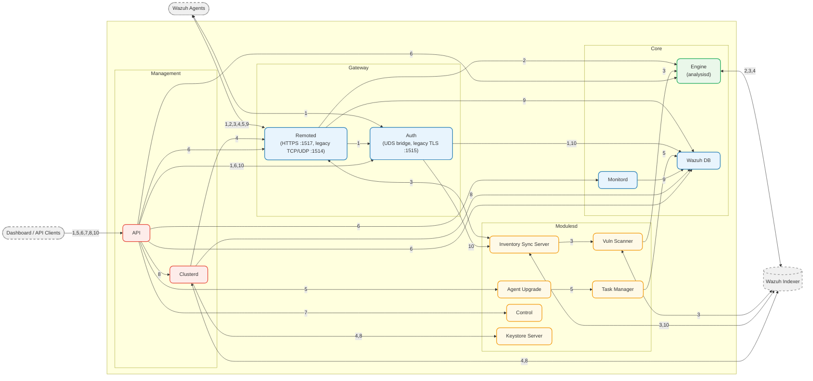

# Architecture

## Server

The Wazuh Manager is a multi-daemon system where each component runs as a separate process. Components communicate through **Unix domain sockets** located under `queue/sockets/`. The major architectural change in 5.0 is the **Engine** (replacing the legacy `analysisd`) as the core event processing pipeline.

### High-Level Architecture

```mermaid
---
config:
  title: "Wazuh Manager Architecture"
  flowchart:
    nodeSpacing: 20
    rankSpacing: 50
---
flowchart LR

classDef ext fill:#f0f0f0,stroke:#999,stroke-width:2px,stroke-dasharray:6px,rx:10
classDef d fill:#e8f4fd,stroke:#2980b9,stroke-width:2px,rx:10
classDef e fill:#eaf7ea,stroke:#27ae60,stroke-width:2px,rx:10
classDef m fill:#fef9e7,stroke:#f39c12,stroke-width:2px,rx:10
classDef a fill:#fdecea,stroke:#e74c3c,stroke-width:2px,rx:10

agents(["Wazuh Agents"]):::ext
clients(["Dashboard / API Clients"]):::ext

subgraph manager[" "]
  direction LR

  subgraph gw["Gateway"]
    direction TB
    authd["Auth<br/>(UDS bridge, legacy TLS :1515)"]:::d
    remoted["Remoted<br/>(HTTPS :1517, legacy TCP/UDP :1514)"]:::d
  end

  subgraph core["Core"]
    direction TB
    engine["Engine<br/>(analysisd)"]:::e
    wdb["Wazuh DB"]:::d
    monitord["Monitord"]:::d
  end

  subgraph modulesd["Modulesd"]
    direction TB
    vs["Vuln Scanner"]:::m
    is["Inventory Sync Server"]:::m
    au["Agent Upgrade"]:::m
    tm["Task Manager"]:::m
    ctrl["Control"]:::m
    ks["Keystore Server"]:::m
  end

  subgraph mgmt["Management"]
    direction TB
    api["API"]:::a
    clusterd["Clusterd"]:::a
  end
end

indexer[("Wazuh Indexer")]:::ext

%% External → Gateway
agents <-->|1| authd
agents <-->|1,2,3,4,5,9| remoted

%% Gateway → Gateway (POST /enroll bridges to authd's local socket: the 5.x registration path)
remoted -->|1| authd

%% Gateway → Core
remoted -->|2| engine
remoted -->|9| wdb
authd -->|1,10| wdb

%% Modulesd → Core
vs -->|3| engine
tm -->|5| wdb
monitord -->|9| wdb

%% Modulesd internal (in-process VD scan lane)
is -->|3| vs
au -->|5| tm

%% Modulesd ↔ Gateway (UDS relay: POST /stateful → queue/sockets/inventory-sync-http.sock)
remoted <-->|3| is
authd -->|10| is

%% Core / Modulesd → Indexer
engine <-->|2,3,4| indexer
vs <-->|3| indexer
is <-->|3,10| indexer
clusterd <-->|4,8| indexer
clusterd -->|8| wdb
clusterd -->|4| remoted

%% Clusterd reads the Indexer credentials from the keystore before any Indexer access
clusterd -->|4,8| ks

%% Management → Internal
api -->|6| engine & wdb & remoted & monitord
api -->|1,6,10| authd
api -->|5| au
api -->|7| ctrl
api -->|8| clusterd

%% External → Management
clients -->|1,5,6,7,8,10| api
```

### Daemons

| Daemon         | Binary                    | Purpose                                                                                                                      |
| -------------- | ------------------------- | ---------------------------------------------------------------------------------------------------------------------------- |
| **Engine**     | `wazuh-manager-analysisd` | Event processing, event generation (replaces legacy analysisd)                                                               |
| **Remoted**    | `wazuh-manager-remoted`   | Agent communication gateway — HTTPS agent API on port 1517 (enrollment, events, state sync, control, downloads); legacy AES TCP/UDP on 1514 for 4.x agents, opt-in via `<remote><legacy>` |
| **Wazuh DB**   | `wazuh-manager-db`        | SQLite-based database daemon for agent and global state                                                                      |
| **Monitord**   | `wazuh-manager-monitord`  | Agent monitoring and log rotation                                                                                            |
| **Auth**       | `wazuh-manager-authd`     | Owns all agent registration logic. Reached by Remoted's `POST /enroll` over its local socket for 5.x agents; its own TLS listener on port 1515 serves 4.x agents, gated by `<auth><legacy_enrollment>` |
| **Server API** | `wazuh-manager-apid`      | REST API (Python/Starlette, HTTPS) with JWT auth and RBAC                                                                    |
| **Modules**    | `wazuh-manager-modulesd`  | Hosts manager-side modules: vulnerability scanner, inventory sync server, keystore server, agent upgrade, task manager, and control (restart/reload) |
| **Cluster**    | `wazuh-manager-clusterd`  | Multi-node master-worker synchronization (Python, asyncio)                                                                   |

> **Note:** The manager also ships CLI tools (`wazuh-manager-control`, `wazuh-manager-keystore`, etc.) listed in the [CLI Tools](#cli-tools) section below.

### Shared Libraries

| Library               | Source                             | Consumers                                                      | Purpose                                                                           |
| --------------------- | ---------------------------------- | -------------------------------------------------------------- | --------------------------------------------------------------------------------- |
| **Indexer Connector** | `shared_modules/indexer_connector` | Engine, Vulnerability Scanner, Inventory Sync Server, Content Manager | Client library for pushing data to the Wazuh Indexer                              |
| **Content Manager**   | `shared_modules/content_manager`   | Vulnerability Scanner, Modulesd                                | Plugin framework for downloading and managing content (feeds, rulesets)           |
| **Keystore**          | `shared_modules/keystore`          | Indexer Connector, in-process; also served over `queue/sockets/keystore.sock` by the `keystore_server` module, whose client is the Python framework's Indexer client — used by **Clusterd**, not by the API daemon | AES-256 encrypted credential store (RocksDB)                                      |

### CLI Tools

| Binary                   | Purpose                                                                  |
| ------------------------ | ------------------------------------------------------------------------ |
| `wazuh-manager-control`  | Service control script — start, stop, restart, and status of all daemons |
| `wazuh-manager-keystore` | Manage secrets in the encrypted keystore (AES-256, RocksDB)              |
| `verify-agent-conf`      | Validate `agent.conf` syntax for shared group configurations             |
| `agent_groups`           | Manage agent group assignments                                           |
| `agent_upgrade`          | Orchestrate agent WPK upgrades                                           |
| `cluster_control`        | Query cluster status and node health                                     |
| `rbac_control`           | Manage RBAC policies and role assignments                                |

### Data Flow

1. **Agent Registration** — A 5.x agent POSTs its registration request to **Remoted**'s HTTPS route `POST /enroll` (port 1517, the same connection and TLS configuration it uses for everything afterward), which bridges it to **Auth** over Auth's local socket (`queue/sockets/auth.sock`). A 4.x agent instead connects directly to **Auth** over TLS on port 1515, which remains available via `<auth><legacy_enrollment>`; a client may also register via **API** → **Auth**. Auth owns all enrollment logic in every case: it generates and returns an agent key, then persists the agent record in **Wazuh DB** (`queue/sockets/wdb.sock`).
2. **Event Processing** — Agent sends stateless events (logs, SCA, etc.) to **Remoted**'s authenticated HTTPS route `POST /stateless` (port 1517, authenticated with the agent's `wazuh-agent+jwt` bearer token, the transport a 5.x agent uses). 4.x agents send events over the classic AES-encrypted TCP/UDP channel (port 1514), which remains available via `<remote><legacy>`. The two paths differ in what Remoted does with the batch: on the HTTPS route it verifies the signature, cross-checks the batch's `wazuh.agent.id` against the authenticated agent, and forwards the body **verbatim** — the agent supplies its own metadata in the batch's `H` line, so there is nothing to enrich; on the legacy channel it decrypts the message and enriches it from its in-memory agent-metadata cache, which is what the keep-alives on that channel are for. Either way the batch reaches the **Engine** via HTTP POST (`engine-ingest-http.sock`). The Engine routes events through policies and pushes resulting events to the **Wazuh Indexer** via Indexer Connector. The Engine also pulls content (rulesets, configurations) from the Indexer via its internal **cmsync** module.
3. **Inventory & Vulnerability Scan** — Agent POSTs a whole synchronization session (one FlatBuffers `FullSession`) to **Remoted**'s authenticated HTTPS route `POST /stateful`, and Remoted relays it over UDS (`queue/sockets/inventory-sync-http.sock`) to **Inventory Sync Server** in modulesd. The server validates the session, applies it to the **Indexer** (via Indexer Connector) and answers; the HTTP response relayed back to the agent IS the session result. Vulnerability-detection sessions run through a dedicated scan lane that executes the **Vulnerability Scanner** synchronously BEFORE indexing, so a `200` guarantees both the scan and the ingest. The scanner queries CVE feeds from the Indexer (via Content Manager → Indexer Connector), matches against the agent's packages, and sends vulnerability events to the **Engine** (via `engine-ingest-http.sock`) and vulnerability state to the **Indexer** (via Indexer Connector). Feed-update scans and session scans coordinate through a per-agent registry, so they never race.
4. **Active Response** — The **Engine** produces events and sends them to the **Wazuh Indexer** (via Indexer Connector). The Indexer's internal processes evaluate these events against its own rules and generate active response findings, indexing them into `wazuh-active-responses*`. **Clusterd** polls this index periodically (`active_response_polling`, 30s by default) and dispatches an `active_response` task per agent to **Task Manager** (`queue/sockets/task.sock`), the same path used for `remote_upgrade`. There is deliberately **no filtering by status or by connected node**: stateless HTTPS means no node owns an agent, so the agent-to-worker assignment that such filtering relied on no longer exists. Tasks simply wait in the database until the agent polls for them. For an agent on v5.0.0+, the task is handed back in a `POST /control` response and forwarded to the agent's `execd` daemon, which executes the corresponding active response script. Active response has no delivery path for agents below v5.0.0 (removed with the legacy TCP/UDP protocol); a task targeting one is dropped.
5. **Agent Upgrade** — Client sends an upgrade request via **API** → **Agent Upgrade** (`queue/sockets/task-upgrade.sock`) module. AU validates the request, downloads and verifies the WPK on the manager filesystem, and hands the upgrade off to **Task Manager** (`queue/sockets/task.sock`) as a `remote_upgrade` task, which is persisted in **Wazuh DB** (`queue/sockets/wdb.sock`). Delivery then depends on the agent's version, and the manager never pushes to a 5.x agent:
    - **v5.0.0+** — the task is handed back in the response to the agent's next `POST /control` `notify`, and the agent **pulls** the WPK itself via `POST /download`.
    - **Below v5.0.0** — a polling thread in **Remoted** (gated on the legacy channel) walks the connected agents, asks Task Manager for each one's pending task, and pushes the WPK down its existing session using the legacy six-step WPK push. This path exists only so 4.x agents remain upgradable; it deliberately skips agents at v5.0.0 or above.

    Task delivery is fire-and-forget from the manager's perspective either way.
6. **API Query** — Client sends an HTTPS request to the **Server API**. The API connects directly to **Engine** (`queue/sockets/engine-api-http.sock`), **Wazuh DB** (`queue/sockets/wdb.sock`), **Remoted** (`queue/sockets/remote.sock`), **Monitord** (`queue/sockets/monitor.sock`), or **Auth** (`queue/sockets/auth.sock`) depending on the endpoint. The **DAPI** layer transparently routes requests across cluster nodes.
7. **Manager Restart/Reload** — Client sends a restart or reload request via **API** → **wm_control** module (`queue/sockets/control.sock`), which signals the appropriate daemons.
8. **Cluster Sync** — **Clusterd** synchronizes agent registration and shared configuration between master and worker nodes using Fernet-encrypted connections. It reads/writes agent state via **Wazuh DB** (`queue/sockets/wdb-http.sock`) and connects to the **Wazuh Indexer** (via Python opensearchpy) for active response dispatch, agent sync, and metrics — reading the Indexer credentials from the **Keystore Server** (`queue/sockets/keystore.sock`) first, since they are never held in the cluster configuration. Its Indexer-dependent jobs are supervised: availability is re-checked every 300s and the jobs are cancelled and restarted with exponential backoff (capped at 3600s) whenever the Indexer becomes unreachable. The API forwards cluster queries to Clusterd (`queue/sockets/cluster-internal.sock`).
9. **Agent Monitoring** — **Remoted** updates agent connection state (keep-alive, disconnection) in **Wazuh DB** (`queue/sockets/wdb.sock`). **Monitord** handles log rotation and periodic state checks via **Wazuh DB** (`queue/sockets/wdb.sock`).
10. **Agent Deletion** — Client sends a delete request via **API** → **Auth** (`queue/sockets/auth.sock`). Auth removes the agent from **Wazuh DB** (`queue/sockets/wdb.sock`) and calls **Inventory Sync Server**'s delete endpoint over UDS (`queue/sockets/inventory-sync-http.sock`) to delete every document of that agent from the **Indexer** — its state documents (`wazuh-states-*`) plus its reported configuration and statistics (`wazuh-agent-config`, `wazuh-agent-stats`); the HTTP status tells Auth whether the deletion was applied, and Auth retries before logging an error that names the agent.

### IPC (Unix Domain Sockets)

All inter-process communication uses Unix domain sockets, and every one of them lives in `queue/sockets/`. The subsystem directories `queue/db/`, `queue/tasks/` and `queue/cluster/` hold only their data: databases, backups, the active-response bookmark and the per-worker directories.

Naming rules, which apply to any socket added later:

- Every socket file ends in `.sock`.
- The name states what the socket does or which component owns it, in kebab-case. A socket that speaks HTTP carries `-http` before the extension, so the wire protocol is readable from the name and a new HTTP socket is distinguishable from the framed one it replaces.
- When a component owns more than one socket of the same protocol, a qualifier names the plane: `api` for a control or query interface, `ingest` for a data-path intake, `admin` for an operator-facing endpoint.
- Every socket lives in `queue/sockets/`, endpoints kept apart from data. Bind, then `chmod` to 0660: `bind()` applies the umask.

Below, `HTTP` is HTTP/1.1 over the socket, reachable with `curl --unix-socket`. `Framed` is the legacy protocol: a 4-byte little-endian length header followed by a text or JSON payload.

| Socket                                   | Owner                 | Protocol | Purpose                                                            |
| ---------------------------------------- | --------------------- | -------- | ------------------------------------------------------------------ |
| `queue/sockets/auth.sock`                | authd                 | Framed   | Local agent registration and deletion                              |
| `queue/sockets/remote.sock`              | remoted               | Framed   | Stats and runtime configuration queries                            |
| `queue/sockets/remote-admin-http.sock`   | remoted module        | HTTP     | Operator-facing admin and metrics endpoint                         |
| `queue/sockets/engine-api-http.sock`     | Engine                | HTTP     | REST API: catalog, policy, router, KVDB, tester, metrics           |
| `queue/sockets/engine-ingest-http.sock`  | Engine                | HTTP     | Event ingestion                                                    |
| `queue/sockets/inventory-sync-http.sock` | Inventory Sync Server | HTTP     | Stateful sync, agent-reported stats and config, agent deletion      |
| `queue/sockets/vd-http.sock`             | Vulnerability Scanner | HTTP     | On-demand scans and feed operations, called by remoted and the API |
| `queue/sockets/keystore.sock`            | keystore_server       | Framed   | Indexer credential retrieval, called by clusterd                   |
| `queue/sockets/control.sock`             | wm_control            | Framed   | Daemon restart and reload                                          |
| `queue/sockets/monitor.sock`             | monitord              | Framed   | Active configuration query, via the API's component=monitor         |
| `queue/sockets/wmodules.sock`            | modulesd              | Framed   | Per-module query and control, and the API's component=wmodules      |
| `queue/sockets/wdb.sock`                 | wazuh-db              | Framed   | Legacy wdb query protocol                                          |
| `queue/sockets/wdb-http.sock`            | wazuh-db              | HTTP     | Agent sync and summary REST API, used by clusterd and the API      |
| `queue/sockets/task.sock`                | task_manager          | Framed   | Task creation and lookup (upgrade, active response)                |
| `queue/sockets/task-upgrade.sock`        | agent_upgrade         | Framed   | Upgrade requests coming from the API                               |
| `queue/sockets/cluster-internal.sock`    | clusterd              | Cluster  | Cluster and DAPI queries                                           |

Keeping every endpoint in one directory means `ls queue/sockets/` is the complete IPC surface of the manager, and it keeps cleanup code from having to special-case a live socket sitting among the files it deletes.
