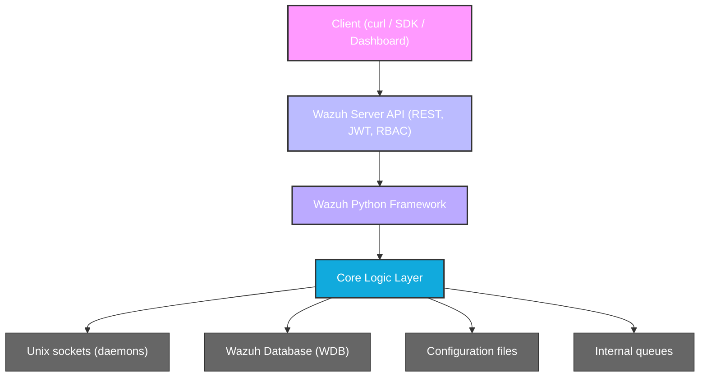
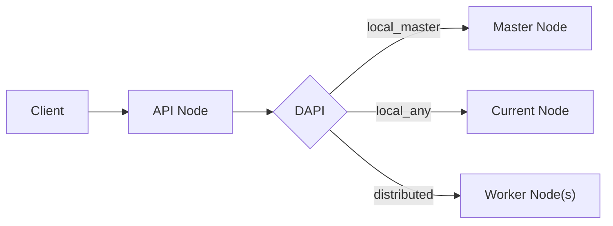

# Framework & Server API

## Purpose

This document provides a **technical, implementation-oriented overview** of the Wazuh Python Framework and the Wazuh Server API.
It focuses on **architecture, execution flow, constraints, and real-world usage patterns**.

---

## 1. System Architecture Overview

Wazuh exposes its management and operational capabilities through a REST API backed by a Python framework.

High-level components:



### Key Concepts

| Concept | Description |
|------|-------------|
| Server API | REST API used to manage agents, manager, cluster, and security |
| Framework | Python backend implementing API behavior and business logic |
| Core Layer | Low-level logic and system interactions |
| RBAC | Role-Based Access Control enforced per endpoint |
| JWT | Authentication mechanism for all API calls |
| WQL | Query language for filtering and searching API data |

---

## 2. Framework Directory Structure

### 2.1 API Interface Layer  
`wazuh/framework/wazuh/`

This layer:
- Exposes API-facing functions
- Validates input
- Enforces RBAC
- Formats responses

It **must not** contain business logic.

| Module | Responsibility | Main Endpoints |
|------|----------------|----------------|
| `agent.py` | Agent lifecycle and queries | `/agents` |
| `manager.py` | Manager status and configuration | `/manager` |
| `cluster.py` | Cluster operations | `/cluster` |
| `syscheck.py` | File Integrity Monitoring | `/syscheck` |
| `rootcheck.py` | Policy and rootcheck | `/rootcheck` |
| `active_response.py` | Trigger AR commands | `/active-response` |
| `security.py` | Authentication and users | `/security` |
| `rbac/` | Authorization logic | `/security/*` |
| `mitre.py` | MITRE ATT&CK mappings | `/mitre` |
| `stats.py` | Manager statistics | `/manager/stats` |
| `task.py` | Async task handling | `/tasks` |
| `event.py` | Event ingestion into analysisd | `/events` |

---

### 2.2 Core Logic Layer  
`wazuh/framework/wazuh/core/`

This layer contains **all real logic**.

| Component | Description |
|--------|-------------|
| `agent.py`, `manager.py`, etc. | Business logic implementation |
| `common.py` | Global constants, paths, context variables, and utility functions |
| `results.py` | Standardized result model (`WazuhResult`, `AffectedItemsWazuhResult`) |
| `InputValidator.py` | Regex-based input validation (names, lengths) |
| `utils.py` | General utilities (caching, process management, helpers) |
| `wazuh_socket.py` | IPC with Wazuh daemons via Unix sockets |
| `wazuh_queue.py` | Internal async messaging |
| `wdb.py` | Async interface to Wazuh DB (length-prefixed Unix socket protocol) |
| `wdb_http.py` | HTTP-based alternative WDB client (via `aiohttp`) |
| `configuration.py` | Parse `ossec.conf` and related files |
| `exception.py` | Custom exception hierarchy and error code catalog |
| `wlogging.py` | Custom log rotation with gzip compression |
| `pyDaemonModule.py` | UNIX daemonization (double-fork pattern) |
| `stats.py` | Statistics processing logic |
| `cluster/` | Cluster architecture (master, worker, DAPI, HAProxy helper) |
| `indexer/` | Wazuh Indexer integration (credentials, disconnected agents) |

This layer is **API-agnostic** and can be reused internally.

---

## 3. API Execution Flow

Example: `GET /agents?status=active`

1. HTTP request reaches the Server API (Starlette/Connexion)
2. Middlewares process the request (security headers, rate limiting, access logging)
3. JWT token is validated via `authentication.py`
4. Input parameters are validated via `validator.py` (regex-based)
5. Request is routed to the controller (`agent_controller.py`)
6. Controller wraps the call in the **DAPI** layer for cluster routing
7. DAPI determines the target node (`local_master`, `local_any`, etc.)
8. Framework function (`wazuh/agent.py`) is invoked
9. RBAC permissions are checked via `expose_resources` decorator
10. Core logic (`core/agent.py`) is executed
11. Data is fetched from:
    - WDB (via Unix socket or HTTP)
    - Manager daemon (via Unix socket)
    - Filesystem
12. Result is wrapped in `AffectedItemsWazuhResult` or `WazuhResult`
13. Result is serialized to JSON and returned

### 3.1 Distributed API (DAPI)

In cluster deployments, not all requests can be handled by the node receiving them.

The DAPI layer (`core/cluster/dapi/`) transparently routes requests:

| Routing Mode | Description |
|-------------|-------------|
| `local_master` | Must execute on the master node |
| `local_any` | Can execute on any node |
| `distributed_master` | Master distributes to relevant worker nodes |



### 3.2 Result Model

All framework functions return standardized result objects defined in `core/results.py`:

| Class | Description |
|-------|-------------|
| `WazuhResult` | Base dict-like result wrapper |
| `AffectedItemsWazuhResult` | Tracks affected/failed items with error details |

Results support:
- Merge operations (`|` operator) for combining results across cluster nodes
- Iteration, length, and containment checks
- Pagination metadata

---

### 2.3 API Server Layer
`wazuh/api/api/`

This layer implements the **HTTP server** that exposes the REST API.

| Component | Description |
|--------|-------------|
| `controllers/` | Route handlers (one per resource: agent, cluster, security, etc.) |
| `authentication.py` | JWT token generation and validation using EC keys (PyJWT) |
| `middlewares.py` | Request/response pipeline (security headers, rate limiting, access logging) |
| `error_handler.py` | Centralized error handling and brute-force protection |
| `validator.py` | Comprehensive regex-based validation for all API input parameters |
| `signals.py` | API lifecycle events and background tasks (key generation, CTI updates) |
| `constants.py` | API filesystem paths (`/api/configuration`, `/api/security`, etc.) |
| `encoder.py` | Custom JSON serialization |
| `uri_parser.py` | URI parsing utilities |
| `alogging.py` | Async-aware API logging |
| `spec/spec.yaml` | OpenAPI 3.0 specification (defines all endpoints, schemas, parameters) |
| `configuration/` | API configuration management |
| `models/` | Data models for request/response objects |

#### Controllers

Each controller wraps framework calls in the **DAPI (Distributed API)** layer to transparently route requests across cluster nodes.

| Controller | Responsibility |
|-----------|----------------|
| `agent_controller.py` | Agent CRUD and lifecycle |
| `cluster_controller.py` | Cluster node operations |
| `security_controller.py` | Users, roles, policies, RBAC |
| `active_response_controller.py` | Trigger active response commands |
| `syscheck_controller.py` | FIM operations |
| `rootcheck_controller.py` | Rootcheck/SCA results |
| `mitre_controller.py` | MITRE ATT&CK mappings |
| `task_controller.py` | Async task queries |
| `event_controller.py` | Event ingestion to analysisd |
| `overview_controller.py` | Agent overview/summary |
| `default_controller.py` | Basic API info (version, hostname, timestamp) |

---

### 2.4 RBAC Sub-module
`wazuh/framework/wazuh/rbac/`

| File | Responsibility |
|------|----------------|
| `decorators.py` | `expose_resources` decorator that enforces action/resource permissions |
| `orm.py` | ORM models for roles, policies, and user-role mappings |
| `preprocessor.py` | Resource preprocessing before permission checks |
| `default_resources.py` | Built-in default RBAC resource definitions |
| `auth_context.py` | Authentication context handling |

---

### 2.5 Cluster Sub-module
`wazuh/framework/wazuh/core/cluster/`

| File | Responsibility |
|------|----------------|
| `dapi/` | **Distributed API** — routes requests to the correct cluster node |
| `master.py` | Master node logic |
| `worker.py` | Worker node logic |
| `client.py` | Worker → master communication |
| `server.py` | Cluster server |
| `local_client.py` | Local cluster client |
| `local_server.py` | Local cluster server |
| `control.py` | Cluster control operations |
| `cluster.py` | Core cluster logic |
| `common.py` | Cluster-specific shared utilities |
| `config.py` | Cluster configuration schema |
| `utils.py` | Cluster utilities (`get_cluster_items`, etc.) |
| `hap_helper/` | HAProxy integration for load balancing |

---

### 2.6 Indexer Sub-module
`wazuh/framework/wazuh/core/indexer/`

| File | Responsibility |
|------|----------------|
| `indexer.py` | Main Wazuh Indexer client |
| `credential_manager.py` | Indexer credential management |
| `disconnected_agents.py` | Handling disconnected agents in the indexer |
| `max_version_components.py` | Version component handling |

---

## 4. Authentication & Security

### JWT Authentication

- All endpoints require a JWT token
- Tokens are short-lived (default: **900 seconds**)
- Tokens must be included in every request `Authorization: Bearer <JWT_TOKEN>`
- Tokens are signed using **Elliptic Curve (EC) keys** generated at startup
- Authentication logic uses `PyJWT` for token encoding/decoding
- Credentials are validated against the RBAC ORM database
- Authentication **must run on the master node** in cluster deployments

### RBAC Enforcement

RBAC is enforced **before** any core logic is executed.

- Permissions are evaluated per endpoint
- Framework functions are decorated with `expose_resources` from `rbac/decorators.py`
- RBAC policies can allow or deny access even with valid tokens
- Two RBAC modes: **white** (deny by default) and **black** (allow by default)
- A `403 Forbidden` usually indicates RBAC blocking, not auth failure
- Current user, RBAC mode, and cluster context are stored in `contextvars` for request-scoped access

### Rate Limiting & Brute-Force Protection

- The API tracks failed login attempts per IP address
- After exceeding a configurable threshold, the IP is added to a blocked set
- Blocked IPs receive `429 Too Many Requests` or immediate rejection
- Rate limiting state is managed in-memory within `middlewares.py` and `error_handler.py`

### Security Headers

- `Content-Security-Policy: none`
- `X-Frame-Options: DENY`
- `Server: Wazuh`

---

## 5. Wazuh Query Language (WQL)

WQL allows server-side filtering of large datasets.

### Basic Examples

```http
GET /agents?query=status=active
```
```http
GET /alerts?query=severity >= 7
```
```http
GET /agents?query=os.name~=ubuntu
```
### Why WQL matters

- Reduces payload size
- Avoids client-side filtering
- Improves performance on large deployments

## 6. Common API Endpoints
| Endpoint                      | Method | Description                  |
| ----------------------------- | ------ | ---------------------------- |
| `/agents`                     | GET    | List agents                  |
| `/agents/{id}`                | GET    | Agent details                |
| `/agents/{id}/restart`        | PUT    | Restart agent                |
| `/manager/status`             | GET    | Manager status               |
| `/manager/configuration`      | GET    | Manager configuration        |
| `/manager/stats`              | GET    | Manager statistics           |
| `/cluster/nodes`              | GET    | Cluster nodes                |
| `/cluster/status`             | GET    | Cluster status               |
| `/security/user/authenticate` | POST   | Obtain JWT                   |
| `/security/users`             | GET    | List security users          |
| `/security/roles`             | GET    | List RBAC roles              |
| `/security/policies`          | GET    | List RBAC policies           |
| `/syscheck/{id}`              | GET    | FIM results for an agent     |
| `/rootcheck/{id}`             | GET    | Rootcheck results            |
| `/active-response`            | PUT    | Run active response command  |
| `/mitre`                      | GET    | MITRE ATT&CK data            |
| `/events`                     | POST   | Ingest events into analysisd |
| `/overview/agents`            | GET    | Full agent summary           |
| `/tasks/status`               | GET    | Async task status            |
| `/`                           | GET    | API info (version, hostname) |

For a complete list of endpoints, parameters, and response schemas, refer to the official Wazuh API Reference:
https://documentation.wazuh.com/current/user-manual/api/reference.html

## 7. Error Handling

Errors follow a structured JSON response.
| HTTP Code | Meaning        | Notes                    |
| --------- | -------------- | ------------------------ |
| 400       | Bad Request    | Invalid parameters       |
| 401       | Unauthorized   | Invalid or expired token |
| 403       | Forbidden      | RBAC denied              |
| 404       | Not Found      | Invalid endpoint         |
| 500       | Internal Error | Check manager logs       |

## 8. Operational Use Cases
- Agent Enrollment Automation
    - Use API to bulk register agents
    - Combine with Ansible/Terraform provisioning

- Health Checks
    - Periodic calls to /manager/status
    - Cluster node verification

- Security Auditing
    - Scheduled queries on alerts
    - WQL-based filtering

## 9. Relationship with Dashboard

- The Wazuh Dashboard consumes the same Server API

- Browser dev tools can be used to inspect API calls

- Useful for debugging permissions and payloads

## 10. Best Practices
- Always use WQL for large queries
- Handle token expiration gracefully
- Treat 403 as RBAC errors, not auth issues
- Prefer async task endpoints for long operations
- Never embed credentials in scripts
- In cluster deployments, ensure authentication calls reach the master node
- Use the OpenAPI spec (`spec/spec.yaml`) as the source of truth for endpoints

---

## 11. Socket Communication Protocol

The framework communicates with Wazuh daemons via **Unix domain sockets** using a length-prefixed protocol.

### Protocol Details
- Messages use a **4-byte little-endian header** indicating the payload length
- The same framing is used for both sending and receiving
- `WazuhAsyncSocket` (in `core/wdb.py`) handles async socket connections

### Key Socket Paths

| Socket | Daemon | Purpose |
|--------|--------|---------|
| `wdb` | wazuh-db | Database queries |
| `queue/sockets/queue` | analysisd | Event ingestion |
| `queue/sockets/auth` | authd | Agent registration |
| `queue/sockets/remote` | remoted | Agent communication |
| `queue/sockets/request` | various | Internal requests |

---

## 12. Exception Hierarchy & Error Codes

All exceptions inherit from `WazuhException` (defined in `core/exception.py`).

The class contains a comprehensive error code catalog mapping numeric codes to messages and remediation suggestions.

### Error Code Ranges

| Range | Category | Examples |
|-------|----------|----------|
| 900–999 | API-level errors | Child process terminated, executor failure, endpoint restricted to master |
| 999–1099 | Core Wazuh errors | Incompatible Python, internal error, command errors, socket issues |
| 1100–1199 | Configuration errors | Invalid section/field/type, XML syntax, missing config |
| 1200–1299 | Agent errors | Agent not found, duplicate, version mismatch |
| 1700–1799 | RBAC errors | Permission denied, invalid role/policy |
| 2000+ | Module-specific errors | Syscheck, rootcheck, active response, cluster |

Error responses include a `dapi_errors` field in cluster deployments, linking errors to specific documentation pages based on the Wazuh version.

---

## 13. Logging Architecture

### Custom Log Rotation (`core/wlogging.py`)
- The `CustomFileRotatingHandler` class extends Python's logging to:
  - Rotate log files when they reach a size threshold
  - Compress rotated files with **gzip**
  - Set file permissions to `0o640`
  - Store rotated logs in a dedicated directory

### API Access Logging (`api/alogging.py`)
- Every API request generates an access log entry
- Passwords and sensitive data are **sanitized** from query strings and request bodies before logging

---

## 14. Configuration

### API Configuration
The API reads its configuration from files defined in `api/constants.py`:

| Path | Description |
|------|-------------|
| `api/configuration/api.yaml` | Main API configuration |
| `api/configuration/security/` | Security configuration directory |

### Security Configuration (JSON Schema validated)

| Setting | Description | Values |
|---------|-------------|--------|
| `auth_token_exp_timeout` | JWT token expiration time | Default: 900 seconds |
| `rbac_mode` | RBAC enforcement mode | `white` (deny by default) / `black` (allow by default) |

### Manager Configuration
- `ossec.conf` is parsed by `core/configuration.py`
- Configuration sections are validated per component

---

## 15. Global Constants & Context (`core/common.py`)

This module centralizes all Wazuh paths, limits, and runtime context.

### Key Functions
| Function | Description |
|----------|-------------|
| `find_wazuh_path()` | Auto-discovers the Wazuh installation root |
| `wazuh_uid()` / `wazuh_gid()` | Gets the wazuh-manager system user/group IDs |
| `get_installation_uid()` | Returns (or creates) a persistent UUID |
| `reset_context_cache()` | Decorator for request-scoped caching |

### Important Limits
| Constant | Value | Description |
|----------|-------|-------------|
| `MAX_SOCKET_BUFFER_SIZE` | 64 KB | Maximum socket buffer |
| `MAX_GROUPS_PER_MULTIGROUP` | 128 | Maximum groups per multigroup |
| `AGENT_NAME_LEN_LIMIT` | 128 | Maximum agent name length |
| `DATABASE_LIMIT` | 500 | Default query result limit |
| `MAXIMUM_DATABASE_LIMIT` | 100,000 | Hard cap on query results |

### Context Variables
Request-scoped state managed via `contextvars`:
- `rbac_mode` — current RBAC mode
- `current_user` — authenticated user
- `cluster_nodes` — available cluster nodes
- `origin_module` — calling module context

---

## 16. Input Validation (`api/validator.py`)

The API layer performs comprehensive regex-based validation on all inputs.

### Validated Patterns
| Pattern | Description |
|---------|-------------|
| Hashes | MD5 (32), SHA1 (40), SHA224 (56), SHA256 (64), SHA384 (96), SHA512 (128) |
| Groups | Group name validation (excludes `.`, `..`, `all`) |
| Base64 | Standard base64 encoded strings |
| Dates | Date and datetime format validation |
| WQL | Query syntax (`field operator value;connector`) |
| XML | Validated via `lxml` and `defusedxml` |
| Special chars | Separate patterns for names vs. paths |

---

## 17. Testing

Tests are organized alongside each module:

| Location | Scope |
|----------|-------|
| `framework/wazuh/tests/` | Interface layer unit tests |
| `framework/wazuh/core/tests/` | Core logic unit tests |
| `api/api/test/` | API layer unit tests |
| `api/api/controllers/test/` | Controller tests |
| `framework/wazuh/rbac/tests/` | RBAC unit tests |
| `framework/wazuh/core/indexer/tests/` | Indexer integration tests |

The project uses `pytest` as the test runner (configured in `pytest.ini` files).

To run the tests we can execute:
```bash
export WAZUH_REPO=<your_path>
PYTHONPATH=$WAZUH_REPO/framework:$WAZUH_REPO/api pytest framework   --disable-warnings 
```