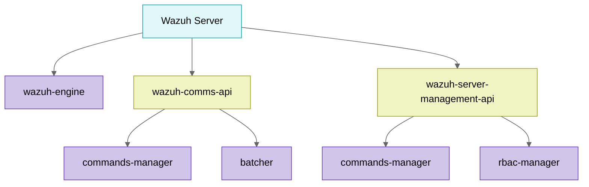

# Wazuh

# Wazuh Server
## Introduction

The Wazuh server is the core that receives, processes, 
and stores all the security telemetry generated by the agents deployed on the endpoints. 
Internally, it consists of an analysis engine (`wazuh-engine`), a communications API (`wazuh-comms-api`); 
and a management API (`wazuh-server-management-api`).

A parent process orchestrates the three child daemons 
and starts a small internal UNIX server for these to request their deployment configuration at startup.
Simultaneously, a monitor periodically checks that none of the child processes have become zombies and that 
each retains the expected number of threads, thus ensuring continued stability. 

When a stop signal arrives, the parent server sends SIGTERM to each component, 
waits for its graceful shutdown, cleans up the PID files, and terminates, ensuring that no orphaned 
processes or half-processed data are left behind.

### Communications API

The API allows: JWT authentication, obtaining commands, processing persistent and async events from agents, 
downloading files from agents, and scanning for vulnerabilities.

The API consists of a `commands-manager` socket, which it is used to post commands to the Comms API and then make these available to the agents, 
and the `batcher`, a process responsible for batching multiple requests sent to the Indexer, combining them into batches based on a 
specific size, detailed in the configuration.

### Management API

The API allows you to manage agents (add, remove, restart, group), configure group policies, 
and control access using JWT authentication. It offers operations such as update verification, 
log monitoring, and remote configuration, integrating with scripts, CLI tools, or the Wazuh Web Interface (WUI). It 
requires temporary tokens obtained through basic authentication to securely interact with the environment.

The API is composed of several components, such as the `commands-manager` socket responsible for exposing local server
commands to the various API processes.

## Server process overview

