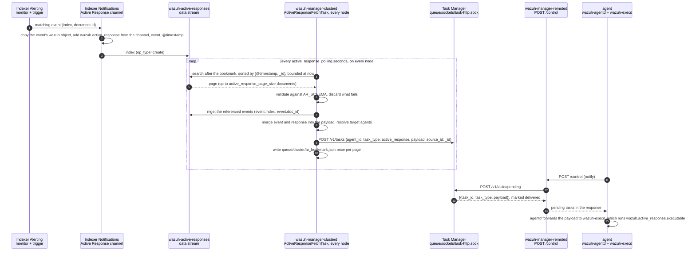

# Active Response Architecture

## Overview

A response is decided in the Wazuh Indexer, turned into Task Manager tasks by
`wazuh-manager-clusterd`, delivered to the agent in the response to its `POST /control`, and run by
the agent's `wazuh-execd`. Everything `wazuh-execd` needs — which executable, stateful or stateless,
for how long — travels in the message under `wazuh.active_response`.

## Component Architecture

### Manager Side (v5.0)

The manager does not decide when a response fires. That decision is made in the Wazuh Indexer: an
Alerting monitor evaluates indexed events, and a trigger whose action targets a notification channel
of the Active Response type writes one document per matching event into the
`wazuh-active-responses` data stream. The manager's part is to turn each of those documents into an
agent task.



Where each step lives:

| Steps | Component | Source |
|---|---|---|
| 1-3 | Indexer Alerting and Notifications plugins | `wazuh/wazuh-indexer-notifications` (`SendMessageActionHelper.sendActiveResponseMessage`); the stream template and retention policy are in `wazuh/wazuh-indexer-plugins` |
| 4-10 | `ActiveResponseFetchTask` in `wazuh-manager-clusterd`, started by the master and by every worker | `framework/wazuh/core/indexer/active_response.py`, `framework/wazuh/core/cluster/master.py`, `framework/wazuh/core/cluster/worker.py` |
| 11-14 | Task Manager and remoted | [Task Manager](../task_manager/README.md), [remoted architecture](../remoted/architecture.md) |
| 15 | `wazuh-agentd` and `wazuh-execd` on the agent | [Agent Side](#agent-side) |

The manager's part in detail — the document contract, the read, the cursor and every message it
logs — is in [Manager-side ingestion](#manager-side-ingestion).

### Agent Side

```
┌─────────────────────────────────────────────────────────────────────┐
│ wazuh-agentd (HTTPS client)                                         │
│   POST /control → task {task_type: active_response, payload}        │
│   payload without a top-level "wazuh" key → dropped                 │
└────────────────────────────────┬────────────────────────────────────┘
                                 │ queue/sockets/execq (one datagram)
                                 │ Windows: in-process queue
                                 ▼
┌─────────────────────────────────────────────────────────────────────┐
│ wazuh-execd                                                         │
│   read wazuh.active_response.{executable, type, stateful_timeout}   │
│   check active-response/bin/<executable> exists                     │
│   append "command": "enable", run it, write the message on stdin    │
│   read check_keys on stdout → answer continue / abort on stdin      │
│   wait for it to exit; log a non-zero exit                          │
│                                                                     │
│   timeout list (stateful only), checked every second:               │
│     expired entry → run it again with "command": "disable"          │
└────────────────────────────────┬────────────────────────────────────┘
                                 │ fork + exec (Windows: CreateProcess)
                                 ▼
┌─────────────────────────────────────────────────────────────────────┐
│ executable (block-ip, disable-account, custom)                      │
│   reads the message from stdin, acts, logs to active-responses.log  │
└─────────────────────────────────────────────────────────────────────┘
```

On Unix `wazuh-execd` is its own process, listening on `queue/sockets/execq` under the agent's
installation directory. On Windows it runs inside the agent service: a thread takes the messages
from an in-process queue and the agent's main thread runs the timeout check every second.

## Message Flow

### Enable flow

1. **Trigger**: an Alerting monitor in the Wazuh Indexer matches an event; its Active Response
   channel writes one response document to `wazuh-active-responses`.
2. **Ingestion**: `wazuh-manager-clusterd` reads the document on its next polling cycle, validates
   it, merges the referenced event into the payload and resolves the target agents (see
   [Manager-side ingestion](#manager-side-ingestion)).
3. **Task creation**: clusterd creates one Task Manager task per target agent: type
   `active_response`, the merged payload, and a task id derived from the document `_id`, so every
   cluster node creates the same task.
4. **Delivery**: on the agent's next `POST /control`, remoted asks the Task Manager for the agent's
   pending tasks (`POST /v1/tasks/pending`), which marks them `delivered` as it returns them. There
   is no acknowledgment after execution: the task is fire-and-forget.
5. **Forwarding**: `wazuh-agentd` hands the payload unchanged to `wazuh-execd`. A payload that is not
   JSON or has no top-level `wazuh` key is dropped with an ERROR; when execd's queue is not available (Active
   Response disabled on the agent) the task is dropped at debug level.
6. **Validation**: `wazuh-execd` parses the message and reads `wazuh.active_response.executable`,
   `type` and `stateful_timeout` (see [What wazuh-execd reads](#what-wazuh-execd-reads)).
7. **Execution**: execd appends `"command": "enable"`, starts
   `active-response/bin/<executable>` and writes the message, one line, to its stdin.
8. **Keys**: the executable answers on stdout with one `check_keys` line naming its keys (for
   `block-ip`, the IP address).
9. **Decision**: for a stateful response execd checks its timeout list (see
   [Deduplication and timeouts](#deduplication-and-timeouts)), then writes the message again with
   `command` set to `continue` or `abort`.
10. **Action**: on `continue` the executable acts; on `abort` it exits without acting.
11. **Exit**: execd waits for the executable to exit and logs a WARNING if it exited non-zero.

### Disable flow

1. **Expiry**: once a second execd walks its timeout list; an entry whose age is greater than its
   timeout is due.
2. **Re-run**: execd runs the same executable with the stored message, whose `command` is now
   `disable`. Only stdin is connected: there is no `check_keys` exchange on this path.
3. **Cleanup**: the entry is removed from the list.

Pending reversals are not lost on a clean stop: when execd shuts down (`(1314): Shutdown received.
Deleting responses.`) it runs every entry still in the list with `disable` straight away.

## Manager-side ingestion

Everything in this section is `ActiveResponseFetchTask` and its helpers in
`framework/wazuh/core/indexer/active_response.py`. It runs inside
`wazuh-manager-clusterd` on **every** node, master and workers alike, and logs to `logs/cluster.log`
under the `[Active Response]` tag. The one-paragraph summary is flow 4 of the
[server architecture](../../architecture.md).

### The document

The notification channel writes one document per matching event. It copies the event's `wazuh`
object verbatim, so whatever the monitored index carries under `wazuh` travels with the response,
and adds three things of its own:

| Field | Written by the channel as | The manager uses it for |
|---|---|---|
| `@timestamp` | the instant the document was written | read order and cursor, the task's `create_time`, and the age that bounds the visibility hold |
| `event.index`, `event.doc_id` | the monitored index and the matching document's `_id` | fetching the event whose fields are merged into the payload the agent receives; `event.index` must name one `wazuh-events-v5-*` or `wazuh-findings-v5-*` index (see below) |
| `wazuh.active_response.*` | the channel configuration: `name`, `executable`, `extra_arguments`, `type` (`stateful` or `stateless`), `stateful_timeout`, `location`, `agent_id` | what to run, and on which agents |
| `wazuh.agent.id` | copied from the event, when the event has it | the target when `location` is `local` |
| `wazuh.agent.version` | copied from the event, when the event has it | documents whose version matches `v[0-4]\..*` are never read: an agent below 5.0 has no delivery path |

`location` decides the target agents:

| `location` | Target | Needs |
|---|---|---|
| `local` | the agent the event came from | `wazuh.agent.id` in the document, i.e. in the monitored event |
| `defined-agent` | one fixed agent | `wazuh.active_response.agent_id` |
| `all` | every registered agent | nothing; an empty fleet dispatches nothing |

`AR_SCHEMA` is the first thing a document meets, and it states the contract above: `event.index`
matching `EVENT_INDEX_PATTERN` and `event.doc_id` a non-empty string; `wazuh.active_response` with `executable`,
`extra_arguments`, `location`, `name` and `type`, typed and enumerated as above and with no unknown
keys; `stateful_timeout` when `type` is `stateful`; a non-empty `agent_id` when `location` is
`defined-agent`; and a non-empty `wazuh.agent.id` when `location` is `local`. A document that fails
it is discarded there, once, with its `_id` in the WARNING. What the schema cannot reach is the
*referenced* event, whose shape is only known after the `mget`; that is why dispatch still guards
against a document raising on its own shape.

`event.index` is an allow-list because the event is fetched with the manager's own indexer
credentials and merged into the payload delivered to agents (and written to their
`active-responses.log`): an unrestricted name would let whoever can write the stream copy any index
the manager can read onto an agent. The pattern accepts one concrete index of the
`wazuh-events-v5-` or `wazuh-findings-v5-` family — a rolled-over index or a data stream's
`.ds-` backing index included — in lowercase `[a-z0-9._-]`, so nothing the indexer would expand
into more than that index (`,`, `*`, `?`, `<date math>`, `cluster:`) gets through. A response
from a monitor over any other index is discarded at validation.

The indexer's own template (`dynamic: strict`) rejects unknown field names and nothing else: it
cannot express that a field is required, an enum or a conditional, and the manager reads `_source`
verbatim. Validation therefore happens here, and a document the schema accepts can still turn out
unusable further down.

### The read

Each cycle runs one `search` on `wazuh-active-responses*`:

- sorted by `[@timestamp, _id]` ascending, `search_after` the bookmark, up to
  `active_response_page_size` documents (1000 by default);
- bounded above by the node's clock (`@timestamp <= now`), so a document stamped in the future is
  not read until its time comes and cannot move the cursor past everything created before it;
- on the very first run of a node, bounded below by that instant (`only_events_after`), so a fresh
  install does not replay the stream's history;
- excluding documents whose `wazuh.agent.version` matches `v[0-4]\..*`.

Every document on the page is validated against `AR_SCHEMA`. The survivors have their events
fetched with one `mget` per referenced index, and the payload handed to the Task Manager is the
event merged over the response document, except under `wazuh`, where the response's keys win.

### The cursor

The bookmark is a **high-water mark of what was read**, not of what was delivered. It is written
once per page, after the page is processed, to `queue/cluster/ar_bookmark.json`:

```json
{"sort": [1788797763932, "AbCd…"], "sort_fields": ["@timestamp", "_id"], "only_events_after": 1788790000000}
```

Two things follow, and both are deliberate:

- **A document that can never succeed does not stop the others.** Failing the schema, an unusable
  `event` reference, an event still missing after the grace window, an unparseable `@timestamp`, a
  refusal from the Task Manager, or raising on its own shape at dispatch are all terminal for that
  one document: it is discarded, reported at `WARNING` or `ERROR` with its `_id`, and the page still
  advances past it. A lost response is lost: delivery guarantees are the Task Manager's, not the
  cursor's.
- **The page is held, and read again next cycle, in exactly two cases.** A Task Manager that cannot
  be reached, because nothing was decided about any document and so nothing may be skipped; and a
  referenced event that is not visible yet: the event is written to another index by another
  pipeline, so for up to `active_response_event_grace` seconds (120 by default) after the
  response's `@timestamp` the cursor stops short of it. Past that age the reference is taken as broken and the document is
  discarded. While a page is held, the documents on it are dispatched again on the next cycle; the
  deterministic task id makes that harmless.

On load, a bookmark whose `@timestamp` is ahead of the node's clock is capped at the present and
saved, with a `WARNING`: such a cursor would otherwise read zero hits until wall-clock time caught
up.

**Recovery.** Deleting `ar_bookmark.json` restarts the read from the moment of deletion: on the next
cycle `only_events_after` is stamped anew and every document older than that instant is never read.
Documents already in the stream that must not be dispatched are removed from the stream itself. A
`WARNING` that repeats every cycle for the same `_id` means the page is being held, one of the two
cases above; an `ERROR … Error during active response processing` that repeats every cycle means an
exception escaped the poller and the cursor is not moving, which is a defect in the poller rather
than in the data.

### The cluster

Every node runs the same poller against the same stream with its own bookmark. Nothing is owned:
with stateless HTTPS an agent may talk to any node, so there is no agent-to-node assignment to
filter by and no leader. The N tasks the N nodes create for one document collapse into one row
because the Task Manager derives the task id from `source_id` (the document's `_id`), the agent,
the type and `create_time`; see [Task Manager](../task_manager/README.md). The corollary is that
every node reads every document: a document that stalls a cycle stalls it fleet-wide, at once.

### Settings

All three live in `intervals.common` of `framework/wazuh/core/cluster/cluster.json`, an internal
file that is replaced on upgrade. A missing key falls back to its default with a `WARNING`, and so
does a value out of range.

| Key | Default | Meaning | Trade-off |
|---|---|---|---|
| `active_response_polling` | `30` | Seconds between two reads, on every node; a positive integer | Shorter means faster delivery and more searches per node |
| `active_response_page_size` | `1000` | Documents per read; a positive integer | Larger means fewer round trips and a longer distance between two cursor writes, so more documents are dispatched again after a hold or a crash |
| `active_response_event_grace` | `120` | Seconds a response may wait for its event to become visible before it is discarded; `0` disables the hold | Longer tolerates slower event ingest at the cost of delaying every response behind the held one |

### Messages

All lines are in `logs/cluster.log`, tagged `[Active Response]`. Every path that loses a response
says so at `WARNING` or above; `wazuh_clusterd.debug=2` adds the query, the page size, each `mget`,
each task and each hold.

Each cycle ends with one `INFO` summary. A healthy cycle is one sentence:

```
Created 3 task(s) for 2 of 2 active response(s) read.
```

A cycle that held or lost something says so, and only then:

```
Created 1 task(s) for 1 of 5 active response(s) read. Held: 1. Discarded: event_not_visible_expired=1, invalid_schema=1, unusable_shape=1.
```

Every response read has exactly one outcome, so `read = dispatched + held + Σ discarded` on every
page. `dispatched` counts responses for which at least one task was created (a `location: all`
response is one response, however many tasks it made); `held` counts responses the page was held
for; the discard reasons are:

| Reason | The response was | Reported by |
|---|---|---|
| `invalid_schema` | rejected by `AR_SCHEMA` | the `Discarding active response document … Reason:` WARNING |
| `unusable_event_reference` | carrying an `event` reference the schema would reject; only reachable when validation is off | the `carries no usable event reference` WARNING |
| `event_not_visible_expired` | waiting for an event that never became visible within the grace window | the `not found after <grace>s` WARNING |
| `unparseable_timestamp` | missing its `@timestamp`, or carrying one that is not ISO 8601 | the `missing @timestamp` WARNING or the `Failed to parse @timestamp` ERROR |
| `unusable_shape` | raising while its payload or targets were resolved | the `unusable shape` WARNING |
| `zero_targets` | resolving to no agent at all (`location: all` on an empty fleet, or while the agent list could not be read) | the `targets no agent` WARNING |
| `task_manager_refused` | refused by the Task Manager for every one of its targets | the `Task Manager refused` ERROR, one per task |

A response refused for some targets and created for others counts as dispatched; the refused tasks
are in their own ERROR lines. A response with no task created because the Task Manager could not be
reached counts as held, together with the not-visible-yet case.

| Level | Message | Meaning | What to do |
|---|---|---|---|
| INFO | `Starting` / `Finished in N.NNNs.` | one polling cycle | nothing |
| INFO | `Created T task(s) for D of R active response(s) read.` (`Held: H.`, `Discarded: reason=n, ….` only when non-zero) | the cycle summary described above | nothing when it is one sentence; otherwise the WARNING or ERROR for each discard is above it |
| WARNING | ``Discarding active response document `<id>` (`<index>`). Reason: <schema error>`` | the document fails `AR_SCHEMA`; terminal | fix the channel, or the client that wrote the document; the document itself is skipped |
| WARNING | ``Active response `<id>` carries no usable event reference. Discarding it.`` | `event.index` or `event.doc_id` missing, empty or not a string, or `event.index` outside the allow-list; terminal, and reached only when schema validation is skipped | same |
| WARNING | ``Expected event `<doc_id>` (`<index>`) not found after <grace>s. Discarding active response `<id>`.`` | the referenced event never became visible; terminal | check that the monitored index still holds the event; a wrong `event.index` lands here once the response is older than the grace window |
| WARNING | ``Expected event `<doc_id>` (`<index>`) not found, and the response carries no readable @timestamp. Discarding active response `<id>`.`` | same, with no age to wait on | same |
| WARNING | `AR document <id> missing @timestamp, skipping` | no `@timestamp`; terminal | the document was not written by the notification channel |
| ERROR | `Failed to parse @timestamp '<value>' from AR <id>: <error>` | `@timestamp` is not ISO 8601; terminal | same |
| WARNING | ``Discarding active response document `<id>`: unusable shape (<Type>: <detail>).`` | the document raised while its payload or its targets were resolved, e.g. a referenced event whose `wazuh` is not an object; terminal | look at the document `event.index` and `event.doc_id` point to; the response itself passed the schema |
| WARNING | ``Active response `<id>` targets no agent. Discarding it.`` | `location: all` resolved to an empty agent list; terminal | register agents, or check `wazuh-manager-db` if `Error fetching agents` precedes it |
| ERROR | ``Task Manager refused the task for agent `<agent>`: <error>`` | the Task Manager answered with a non-2xx, e.g. a payload over the size cap or a `create_time` outside its admission window; terminal for that task | read the reason; the page still advances |
| ERROR | ``Failed to create task for agent `<agent>`: <error>`` | the Task Manager could not be reached; transient | check `wazuh-manager-modulesd`; the page is held, see the next row |
| WARNING | `Task Manager was unreachable for at least one active response. Holding the cursor so this page is read again on the next cycle.` | hold, transport case | resolves on its own once the Task Manager answers |
| WARNING | ``Active response bookmark `<path>` points at <ts>, ahead of the present instant. Capping it at <now>; …`` | the cursor was ahead of this node's clock; capped and saved | check the clocks; responses stamped between the two instants were skipped |
| WARNING | `Missing in cluster configuration (intervals.common): <keys>. Using defaults: <key=value, …>.` | `cluster.json` lacks one of the three settings; defaults apply | restore the shipped `cluster.json`, or add the keys |
| WARNING | `<key> must be <constraint>, got <value>. Using default: <n>.` | a setting is out of range; its default applies | fix the value |
| WARNING | `Cannot connect to Wazuh Indexer` | the indexer client could not be built or connected | transient; retried after the polling interval |
| ERROR | `Error fetching agents: <error>` | `wazuh-db` did not answer the agent list; a `location: all` response on this page is dispatched to nobody and lost | check `wazuh-manager-db` |
| ERROR | `Error during active response processing: <error>.` | an exception escaped the cycle; the cursor did not move | a poller defect; report it with the `_id`s on the page |

## JSON protocol

### What wazuh-execd receives

The task payload, unchanged: the response document with the referenced event merged over it, except
under `wazuh`, where the response's keys win (see [The read](#the-read)). An abridged example for a
`block-ip` channel with `location: local`:

```json,fragment
{
  "@timestamp": "2026-03-31T15:30:45.000Z",
  "source": {"ip": "192.168.1.100"},
  "wazuh": {
    "active_response": {
      "name": "block-ip",
      "executable": "block-ip",
      "extra_arguments": null,
      "type": "stateful",
      "stateful_timeout": 600,
      "location": "local",
      "agent_id": null
    },
    "agent": {"id": "001", "name": "test-agent"}
  }
}
```

Everything else the event carries (`user.name`, `file.path`, …) travels along at the same paths.

### What wazuh-execd reads

| Field | Requirement | Effect |
|---|---|---|
| `wazuh` | object | otherwise `(1316): Invalid AR command`, message dropped |
| `wazuh.active_response` | object | same |
| `wazuh.active_response.executable` | non-empty string, no parent-folder reference | the file run is `active-response/bin/<executable>`, plus `.exe` on Windows when the name has no `.`; it must exist and be readable, otherwise `(1311): Invalid command name` |
| `wazuh.active_response.type` | `"stateful"` makes the response stateful; any other value or none is stateless | stateless responses never enter the timeout list |
| `wazuh.active_response.stateful_timeout` | a number of seconds, read only when `type` is `stateful` | missing, `null` or `0` runs the response once, as stateless |

execd reads nothing else. `extra_arguments`, `location` and `agent_id` reach the executable but no
shipped executable uses them; a custom executable can read `wazuh.active_response.extra_arguments`
from its input. The payload must fit in 64 KiB (`OS_MAXSTR`): agentd sends it to execd as one
datagram, and the shipped executables read one line of at most that size.

### What the executable receives

Line 1 on stdin is the message above with `"command": "enable"` appended (execd adds the key; the
manager never sends one). After the executable's `check_keys` line, line 2 is the same message with
`command` replaced by `continue` or `abort`. On reversion, the only line is the message with
`command` set to `disable`.

The `check_keys` line the executable writes on stdout:

```json
{"version":1,"origin":{"name":"block-ip","module":"active-response"},"command":"check_keys","parameters":{"keys":["192.168.1.100"]}}
```

execd reads only `command` and the string items of `parameters.keys`.

| Command | Direction | Purpose |
|---------|-----------|---------|
| `enable` | execd → executable, stdin line 1 | Apply the action |
| `check_keys` | executable → execd, stdout | Name the keys of this action |
| `continue` | execd → executable, stdin line 2 | Proceed |
| `abort` | execd → executable, stdin line 2 | Exit without acting (stateful duplicate) |
| `disable` | execd → executable, only stdin line | Revert the action (timeout expired, or execd stopping) |

The shipped executables accept only `enable` and `disable` on line 1 and only `continue` and
`abort` on line 2, and refuse a line 1 that has no string `command` or no `wazuh` object.

### Fields used by the shipped executables

| Field | Used by |
|-------|---------|
| `source.ip` | `block-ip` |
| `user.name` | `disable-account` |

## Deduplication and timeouts

Only a stateful response with a timeout greater than zero enters execd's timeout list, and only if
the executable sends its `check_keys` line: a stateful executable that writes nothing on stdout is
run once and never reverted (`Active response won't be added to timeout list. Message not received
with alert keys from script '<path>'` at debug level).

Each entry is identified by a key built from the executable's file name followed by `-<key>` for
each key, e.g. `block-ip-192.168.1.100` (at most 4095 characters; longer keys are truncated with a
WARNING). For a stateful response:

- **Key not in the list**: execd stores the message with `command` set to `disable`, the timeout and
  the current time, and answers `continue`.
- **Key already in the list** (its reversion is pending): execd answers `abort`, so the action is not
  applied twice, and restarts the countdown: the entry's time becomes now and its timeout the one
  just computed.

A stateless response is always answered `continue` and leaves nothing behind.

`<repeated_offenders>` in the agent's `ossec.conf` changes the timeout of a stateful response whose
key execd has seen before, counted for as long as execd runs: the n-th repetition uses the n-th
value of the list, in minutes, and the last value once the list is exhausted (see
[Configuration](configuration.md#repeated_offenders)).

### Timeout example

`block-ip`, stateful, `stateful_timeout: 600`, on a Linux host without firewalld:

```
T=0s    : enable received; block-ip sends check_keys ["192.168.1.100"]
          - execd adds entry block-ip-192.168.1.100 (timeout 600s), answers continue
          - block-ip runs: iptables -I INPUT -s 192.168.1.100 -j DROP
                           iptables -I FORWARD -s 192.168.1.100 -j DROP
T=300s  : the same response arrives again: execd answers abort and restarts the
          countdown (the entry's time becomes T=300s)
T=901s  : the entry is older than 600s
          - execd runs block-ip with "command": "disable"
          - block-ip runs: iptables -D INPUT -s 192.168.1.100 -j DROP
                           iptables -D FORWARD -s 192.168.1.100 -j DROP
          - the entry is removed
```

## Writing an executable in C

The shipped executables share the helpers in `src/active-response/src/active_responses.c` and follow
the same shape:

```c
int main(int argc, char **argv) {
    cJSON *input_json = NULL;

    // Read line 1 from stdin; ENABLE_COMMAND, DISABLE_COMMAND or OS_INVALID
    int action = setup_and_check_message(argv, &input_json);
    if (action != ENABLE_COMMAND && action != DISABLE_COMMAND) {
        return OS_INVALID;
    }

    const char *srcip = get_srcip_from_json(input_json);
    if (!srcip) {
        return OS_INVALID;
    }

    // Keys are exchanged on enable only: a disable has no second line to read
    if (action == ENABLE_COMMAND) {
        char *keys[] = {(char *)srcip, NULL};
        int action2 = send_keys_and_check_message(argv, keys);
        if (action2 == ABORT_COMMAND) {
            return OS_SUCCESS;   // duplicate: nothing to do
        }
        if (action2 != CONTINUE_COMMAND) {
            return OS_INVALID;
        }
    }

    // Apply or revert the action here
    return OS_SUCCESS;
}
```

| Function | Purpose |
|----------|---------|
| `setup_and_check_message()` | On Unix, change to the installation directory; log `Starting`; read line 1 and return the command |
| `get_srcip_from_json()` | `source.ip` as a string, or NULL |
| `get_username_from_json()` | `user.name`, or NULL when it is not a valid local user name (see [disable-account](executables.md#4-disable-account-linux-macos)) |
| `send_keys_and_check_message()` | Write the `check_keys` line, read line 2, return `CONTINUE_COMMAND` or `ABORT_COMMAND` |
| `write_debug_file()` | Append a line to `active-responses.log` |

## Process lifecycle

1. execd starts the executable with its stdin and stdout connected to execd (fork and exec on Unix,
   `CreateProcess` on Windows); the working directory is the agent's installation directory.
2. execd writes line 1, reads one line from the executable's stdout, and writes line 2.
3. execd waits for the executable to exit.

execd handles one message at a time and sets no run-time limit: an executable that never exits
stalls every response after it, and on Unix the timeout check too, since both run in the same loop.

### Exit status

execd logs a non-zero exit as a WARNING in the agent's `ossec.log` and reports nothing to the
manager. The shipped executables exit `0` on success and on `abort`, and `OS_INVALID` (`-1`, exit
status 255 on Unix) when the input is invalid or every method failed.

## Agent-side messages

`wazuh-execd` logs to the agent's `logs/ossec.log` under the tag `wazuh-execd`; the agentd lines are
under the agent's own tag. Debug lines need `execd.debug` (see
[Internal options](configuration.md#internal-options)).

| Level | Message | Meaning |
|---|---|---|
| ERROR | `(1315): Invalid JSON message: '<message>'` | the payload is not JSON |
| ERROR | `(1316): Invalid AR command: '<message>'` | `wazuh` or `wazuh.active_response` is not an object, or `executable` is missing, empty or not a string |
| ERROR | `Active response command '<name>' vulnerable to directory traversal attack. Ignoring.` | `executable` references a parent folder |
| ERROR | `Active response command path too long for '<name>'. Ignoring.` | the resolved path does not fit |
| ERROR | `(1311): Invalid command name '<name>' provided.` | `active-response/bin/<name>` does not exist or cannot be read |
| ERROR | `(1317): Could not launch command <error> (<errno>)` | the executable could not be started |
| WARNING | `Active response command '<path>' reported failure (exit code <n>).` | the executable exited non-zero |
| WARNING | `Active response command '<path>' terminated abnormally.` | the executable was killed by a signal |
| WARNING | `Active response key exceeds maximum size (4096). Truncating keys.` | the keys do not fit in the entry key |
| INFO | `(1350): Active response disabled.` | `<disabled>yes</disabled>`; nothing is executed |
| INFO | `Adding offenders timeout: <n> (for #<k>)` | one `repeated_offenders` value read at start |
| INFO | `(1314): Shutdown received. Deleting responses.` | execd is stopping and reverts every pending entry |
| DEBUG | `Stateful AR '<name>' has timeout value of 0. AR will be treated as stateless.` | stateful with no usable `stateful_timeout` |
| DEBUG | `Executing command '<path> <message>'` | an enable is starting |
| DEBUG | `Adding command '<path> <message>' to the timeout list, with a timeout of '<n>s'.` | a stateful response was registered |
| DEBUG | `Command already received, updating time of addition to now.` | a stateful duplicate: `abort`, countdown restarted |
| DEBUG | `Repeated offender. Setting timeout to '<n>s'` | `repeated_offenders` applied |
| DEBUG | `Executing command '<path> <message>' after a timeout of '<n>s'` | a reversion is starting |
| ERROR | `https_client: active_response task <id> has a malformed payload; dropping.` | agentd: the payload is not JSON or has no top-level `wazuh` key |
| DEBUG | `https_client: active_response task <id> dropped: execd queue not available.` | agentd: Active Response is disabled, or execd is not running |
| DEBUG | `https_client: active_response task <id>: error communicating with execd.` | agentd: the message could not be sent to execd (for example, larger than 64 KiB) |

## Platform-Specific Considerations

| | Linux / BSD | macOS | Windows |
|---|---|---|---|
| Installation directory | `/var/ossec` | `/Library/Ossec` | `C:\Program Files (x86)\ossec-agent` |
| execd | own process, runs as root with group `wazuh` | same | thread of the agent service (`WazuhSvc`) |
| Executables | `active-response/bin/block-ip`, `disable-account` | same | `active-response\bin\block-ip.exe` |
| Executable log | `logs/active-responses.log` | same | `active-response\active-responses.log` |

## Security Considerations

- **Executables**: execd runs only files under `active-response/bin/` and refuses an `executable`
  that references a parent folder. The installer creates that directory and the shipped executables
  `root:wazuh` mode `0750`.
- **Privileges**: executables inherit execd's privileges (root on Unix, the agent service's account
  on Windows).
- **Input validation**: `block-ip` accepts only a numeric IP address (resolved with `getaddrinfo`
  and no DNS on Unix and macOS, a character whitelist on Windows); `disable-account` accepts only a
  valid local user name and never `root`.
- **Commands**: the shipped executables accept only `enable` and `disable`, and only `continue` and
  `abort` as execd's answer.
- **Log file**: `logs/active-responses.log` is created `wazuh:wazuh` mode `0660`.

Troubleshooting procedures are in [Configuration](configuration.md#troubleshooting).

## See Also

- [Active Response README](README.md) - Module overview
- [Configuration](configuration.md) - The agent's `<active-response>` block and the manager's polling settings
- [Executables Reference](executables.md) - `block-ip` and `disable-account` per platform
- [Server architecture, flow 4](../../architecture.md) - Where Active Response sits among the manager daemons
- [Task Manager](../task_manager/README.md) - Agent task storage and delivery
- [Control Module](../control/README.md) - Agent restart/reload (separated in v5.0)
