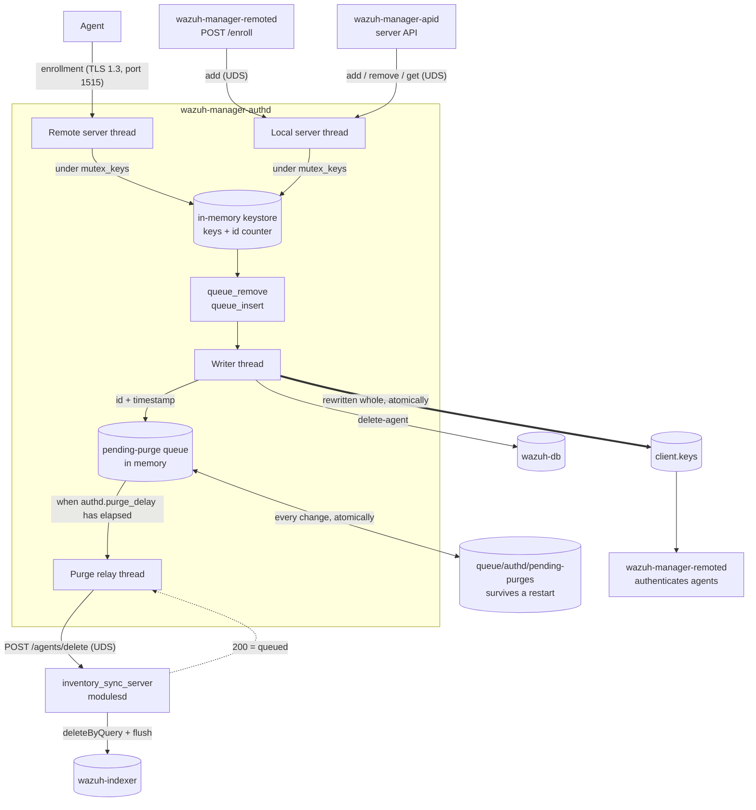
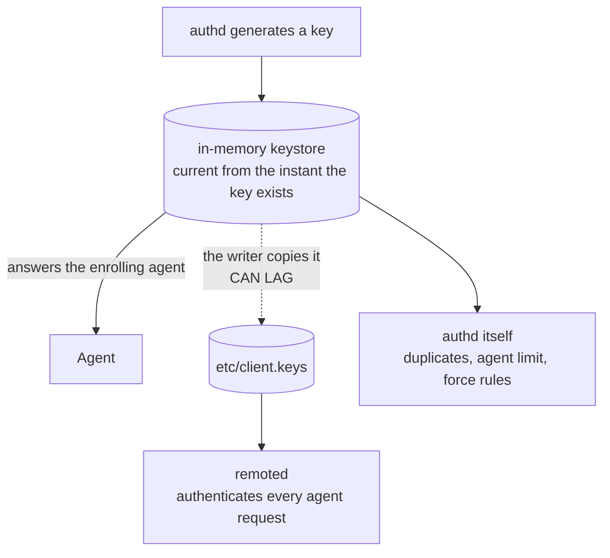
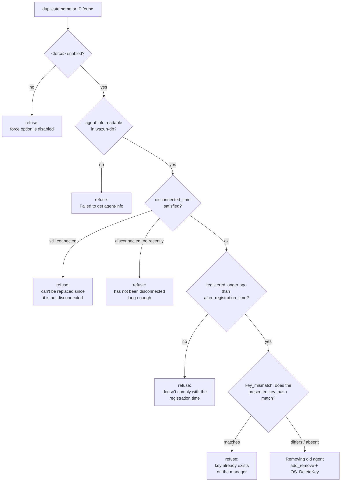
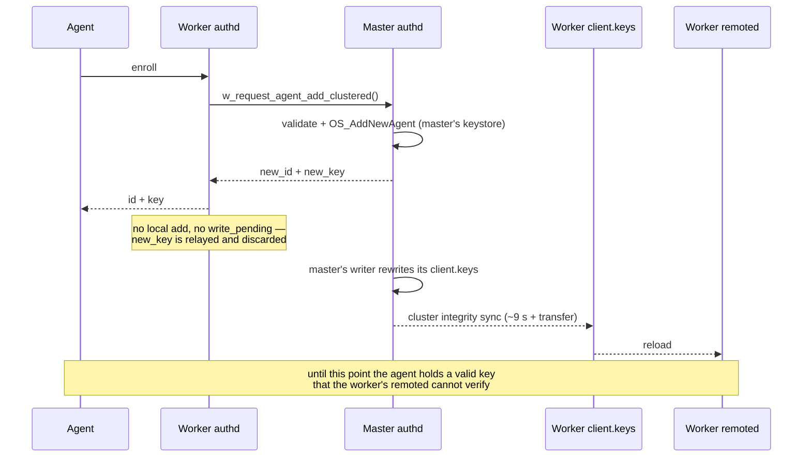
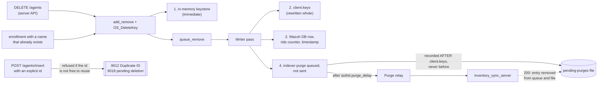
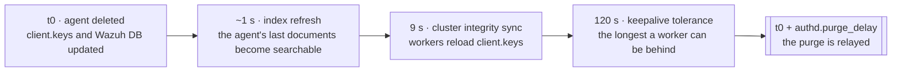
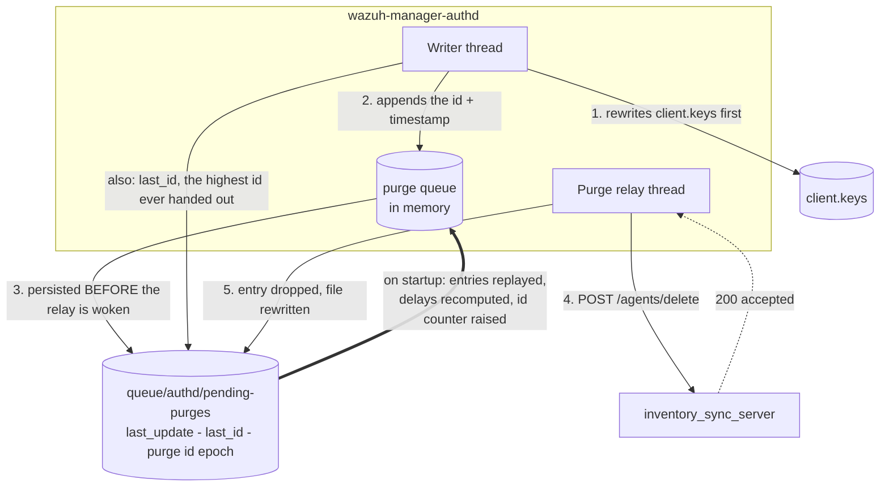

# Authd Architecture

## Overview

`wazuh-manager-authd` owns the agent keystore. It hands out agent ids and keys, persists them to
`client.keys`, mirrors every registration into Wazuh DB, and makes sure a removed agent's documents
leave the indexer too. Enrollment arrives through three doors — the TLS port on 1515, remoted's
authenticated `/enroll` route and the server API — and all of them converge on the same in-memory
keystore behind one mutex: the last two both arrive over the local Unix socket.



The load-bearing property of this layout is that **the writer thread never waits on anything it does
not own**. It is the only thread that persists `client.keys`, and remoted authenticates agents by
reading that file, so anything slow in the writer's pass delays every enrollment — including agents
unrelated to the work in progress. That is why the indexer purge sits behind a queue and a second
thread instead of being called inline.

## Threads

| Thread | Runs on | Role |
|---|---|---|
| Remote server | any node with `remote_enrollment` | TLS enrollment on port 1515 |
| Local server | every node | `queue/sockets/auth.sock`: `add`, `remove`, `get` — for the server API and for remoted's `/enroll` |
| Writer | master only | persists `client.keys`, removes Wazuh DB rows, queues indexer purges |
| Purge relay | master only | sends queued purges after their delay, owns every retry |
| authpass watcher | workers with `use_password` | re-reads `etc/authd.pass` as the cluster syncs it down from the master |

## The two stores

authd keeps every key in **two** places, and the difference between them explains most of the
module's behaviour — and most of its surprises.



- **The in-memory keystore** (`keys`, guarded by `mutex_keys`) is authoritative *inside* authd. It is
  where `OS_AddNewAgent()` assigns the id, where duplicate checks look, and where the key the agent
  receives comes from. It is current the moment a key exists.
- **`etc/client.keys`** is how the rest of the manager finds out. Only the writer thread rewrites it,
  and **remoted authenticates agents by reading it** — so an agent whose key has not reached the file
  yet is rejected as unknown (`401`), even though the key it holds is perfectly valid.

**Enrollment latency is the writer's pass time plus remoted's reload.** That is the reason nothing
slow may live in the writer's pass, and the reason the indexer purge sits behind a queue and a second
thread instead of being called inline.

On a **worker node** the gap is structural rather than incidental — see [Cluster](#cluster).

## Enrollment

Three doors converge on the same code. The TLS port on 1515 is served by the remote server thread;
remoted's authenticated `POST /enroll` and the server API both arrive over the local Unix socket.

```mermaid
sequenceDiagram
    participant C as Caller<br/>(agent · remoted /enroll · server API)
    participant T as Serving thread
    participant KS as In-memory keystore
    participant W as Writer thread
    participant CK as client.keys
    participant R as remoted

    C->>T: enroll (name, version, ip?, groups?, key_hash?)
    Note over T: parse + credential<br/>(password and/or TLS client cert)
    T->>T: validate name, ip, groups, agent version
    rect rgb(240, 240, 235)
        Note over T,KS: under mutex_keys
        T->>KS: duplicate id / ip / name?
        alt duplicate found
            KS-->>T: force rules decide (see below)
        end
        T->>KS: OS_AddNewAgent() — assigns the id, generates the key
        T->>W: queue_insert += entry; write_pending = 1; signal
    end
    T-->>C: id + name + ip + key
    Note over C: the agent can sign requests NOW…
    W->>CK: rewrite client.keys whole (atomic rename)
    W->>W: wdb_insert_agent + wdb_set_agent_groups_csv
    CK-->>R: inotify / periodic reload
    Note over R: …but remoted only accepts it from here on
```

### Validation

Checked before the keystore is mutated:

| Field | Rule |
|---|---|
| `name` | two validators, deliberately different — see below |
| `ip` | a syntactic IPv4/IPv6/CIDR, or `any`. `use_source_ip` overrides whatever the caller claims |
| `groups` | every group must exist (`9014`) |
| version | rejected if newer than the manager's, unless `<agents><allow_higher_versions>` is `yes` |

The agent limit is not on that list because it is not a separate check: `OS_AddNewAgent()` enforces
`max_agents` itself and returns `OS_ADDAGENT_LIMIT_REACHED`, which becomes `9013`.

**The name is checked by two different validators, and the difference is intentional.** The TLS
port 1515 path applies `OS_IsValidName()` — 2–128 characters, no leading `.`, a restricted charset.
The local socket applies only `is_storable_agent_name()`, a **storage-safety floor**: non-empty, at
most 128 bytes, no leading `#` or `!` (those mark removed and comment lines in `client.keys`), and no
control byte, space or `DEL` (any of them would break the file's `<id> <name> <ip> <key>` field
split). A name that clears the floor but not the stricter rule is rejected with `9017`.

The looser floor is what lets an operator register a name the self-enrollment path would refuse.
remoted's `/enroll` applies its own validator, tighter than both, before it ever reaches the socket.

### Id and key assignment

`OS_AddNewAgent()` picks the id — always the next free one, **never a recycled one** (see
[Why an id is never reused](#durability-and-the-id-mark)) — and generates the key. The caller then
reads both straight out of the entry it just created:

```c
os_strdup(keys.keyentries[index]->id,      *id);
os_strdup(keys.keyentries[index]->raw_key, *key);
```

An insertion may also *name* an id explicitly (`manage_agents`, `POST /agents/insert`). That path is
refused rather than served when the id is taken (`9012`) or still owes a purge (`9018`); self-enrolling
agents never send one.

## Duplicate handling and force replacement

When the name or IP already exists, `w_auth_replace_agent()` decides whether the newcomer may take it
over. **Every guard has to allow it**, and they are evaluated in this order — the first one that
refuses ends the decision:



Two consequences worth internalising:

- **A replacement is a deletion.** It runs `add_remove()` and `OS_DeleteKey()` — the same two calls
  `DELETE /agents` makes — so everything in [Agent removal](#agent-removal) applies to it, including
  the queued indexer purge. A fleet re-enrolling under names that already exist generates one deletion
  per agent with nobody touching the API.
- **A replacement never reuses the id.** The replacing agent is a new registration with a new id.

`key_hash` is the caller's `SHA1(id ‖ name ‖ raw_key)` over its *current* credential — the same value
the legacy `K:` field carried, computed by `w_get_key_hash()` on both sides. It is a proof of
possession, not the key itself, and it is the last guard consulted rather than the first.

## Cluster

A worker node runs neither the writer nor the purge relay: `if (!config.worker_node)` gates both. An
enrollment that arrives at a worker is forwarded to the master, and **the worker keeps nothing**.



Because of that, on a worker the window between "the agent has its key" and "remoted accepts it" is a
property of the cluster sync interval, not of authd's own speed. The `<force>` settings are ignored on
a worker — the master decides — and a worker that cannot reach the master answers `9016`.

## The enrollment password

With `use_password` enabled, `etc/authd.pass` holds the shared secret. The master generates one at
first start if none exists and logs that it did. Workers receive the file through the same cluster
sync as `client.keys`, which is why they run the **authpass watcher**: a worker that has not received
it yet fails closed — it rejects enrollments rather than validating against a null password.

remoted's `/enroll` route does not present this password as-is; it derives an AES-256-CMAC key from it
with HKDF-SHA256 and signs the request (`Authorization: WazuhEnroll <timestamp>:<mac>`). See the
[agent API reference](../remoted/agent-api.yaml).

## Error codes

The local socket answers a numeric code that the server API maps onto its own, and remoted's
`/enroll` maps onto HTTP:

| Code | Meaning | `/enroll` |
|---|---|---|
| 9001 / 9002 / 9009 | internal error, JSON parse failure, key generation failure | `500` |
| 9003 / 9004 / 9005 / 9006 / 9014 / 9017 | no such function/argument/name/IP, invalid groups, invalid agent name | `400` |
| 9007 / 9008 / 9012 | duplicate IP, name or id | `409` |
| 9010 / 9011 | no such agent id / agent id not found | — |
| 9013 | `max_agents` reached | `503` |
| 9015 / 9016 | request not valid on a worker / cannot reach the master | `503` |
| 9018 | the id still has a pending deletion | — |

## Agent removal

A removal touches four places, and only the first three are immediate.



Two of those doors are worth calling out:

- **An enrollment whose name already exists is a removal.** `w_auth_replace_agent()` calls the same
  two functions the API path calls, so a fleet that re-enrolls with names that already exist generates
  one deletion per agent without anyone touching the API. Any reasoning about deletion load has to
  account for it.
- **An insertion that names an id explicitly is refused rather than served** when that id belongs to
  an existing agent (`9012`) or still owes a purge (`9018`, reported as `1763` by the server API). A
  queued purge always runs; cancelling it is never the answer. The id stops being reusable the moment
  the agent is deleted, not when the writer gets around to queueing the purge: it is reserved in memory
  in between, or an insertion arriving inside that window would take an id whose purge is on its way.

### Why the purge waits

The relay holds each id for at least `authd.purge_delay` seconds (default `120`) before sending it,
because the purge has to outlast three intervals. A `_delete_by_query` is a *search*: it cannot match
documents the indexer has not made searchable yet, and in a cluster a worker node that still holds the
previous `client.keys` keeps accepting that agent's data and writing it. **Whatever the purge misses
survives forever**, because with the agent gone nothing overwrites it.



See [`authd.purge_delay`](configuration.md#authdpurge_delay) for the full reasoning and for when a
single-node manager can lower it.

### Durability and the id mark

**Why a file at all.** The queue between the writer and the relay is in memory, and the purge it holds
is the *only* record that those documents still have to go: the agent is already out of `client.keys`
and out of Wazuh DB, so nothing else in the system knows they are owed. Before this file existed, a
manager restart dropped whatever was queued without a word, and the documents stayed in the indexer
with nothing left to ever overwrite them.



Pending purges live in `queue/authd/pending-purges`, written through a temporary and an atomic rename:

```
last_update 1787582136
last_id 161
purge 003 1787582014
```

- The `purge` line is written **after** `client.keys` has been rewritten, never before: failing the
  other way would leave a queued purge for an agent that is still alive.
- An entry is removed only once inventory-sync has accepted it. A restart replays what is left, with
  each delay recomputed from the stored timestamp, and logs how many purges were recovered.
- If the clock is **earlier** than `last_update` on startup, every stored timestamp is untrustworthy
  and they are all re-stamped, so each entry waits its full delay again.
- `last_id` is the highest agent id ever handed out. On startup the id counter is raised to it if
  needed, so **an id is never reused**: a purge matches by agent id, and nothing in a state document
  distinguishes one owner of an id from the next.

In memory the due time is monotonic, so an NTP correction while the daemon runs can neither bring a
purge forward nor park it in a future the wall clock has already left.

### What a rebuilt manager inherits

`queue/` survives an upgrade and a plain package removal, so the id mark and any pending purges survive
with it. A full package purge — or an install into a clean tree — takes the file with it, and the id
counter starts over while the indexer still holds the previous fleet's documents. **Deleting a manager
should include deleting its indexer data**, or new agents can inherit documents from the agents that
held their ids before, in the indices they do not resynchronise themselves.

## Storage

| Path | Contents |
|---|---|
| `etc/client.keys` | one line per agent: `<id> <name> <ip> <key>`; rewritten whole, never edited in place. A removed agent is kept as a `!name` line unless `<purge>` is `yes` |
| `etc/agents-timestamp` | per-agent registration timestamp |
| `etc/authd.pass` | enrollment password |
| `queue/authd/pending-purges` | pending indexer purges and the highest id ever handed out |
| `queue/rids/<id>` | per-agent anti-replay counters, removed with the agent |

## Observability

| Line | Meaning |
|---|---|
| `Recovered N pending agent deletion(s)` | startup replayed the state file |
| `Raising the agent id counter from X to Y` | the counter would have gone backwards; ids are not reused |
| `The deletion of agent 'N' was accepted by the inventory sync server` | the purge is now inventory-sync's responsibility |
| `... could not be relayed ... will be retried in S s` | first failure for that entry; later attempts are debug |
| `The pending deletion queue is full` | the cap was reached; that deletion has to be repeated |
| `Shutting down with N pending agent deletion(s)` | they stay in the file and are retried on the next start |

The purge's own outcome — the `deleteByQuery` and its flush — is reported by
[inventory_sync_server](../inventory-sync-server/architecture.md#agent-deletion), not by authd: authd's
responsibility ends when the deletion is accepted.

## Related

- [Authd overview](README.md) and [configuration](configuration.md)
- [`src/os_auth/README.md`](https://github.com/wazuh/wazuh/blob/main/src/os_auth/README.md) — the
  developer map: invariants, tests and the reasoning behind each ordering decision
- [Inventory Sync Server architecture](../inventory-sync-server/architecture.md) — the peer on the
  other side of `DELETE /agents`
