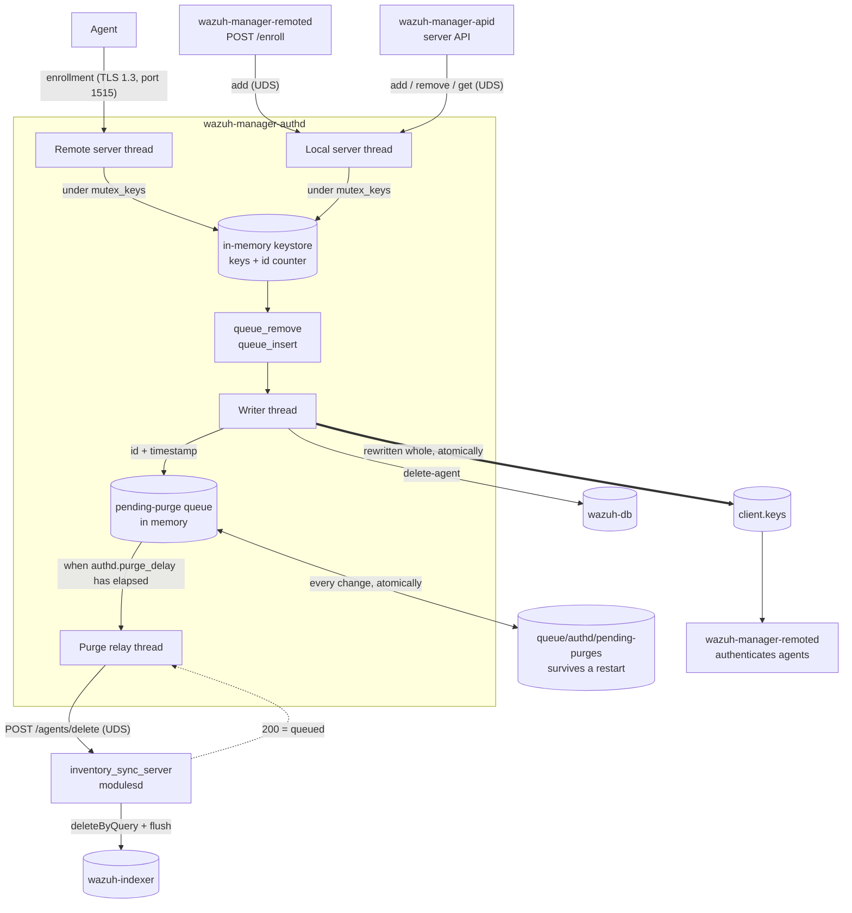
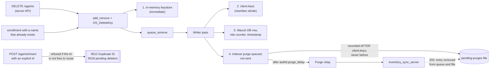
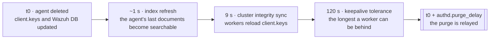
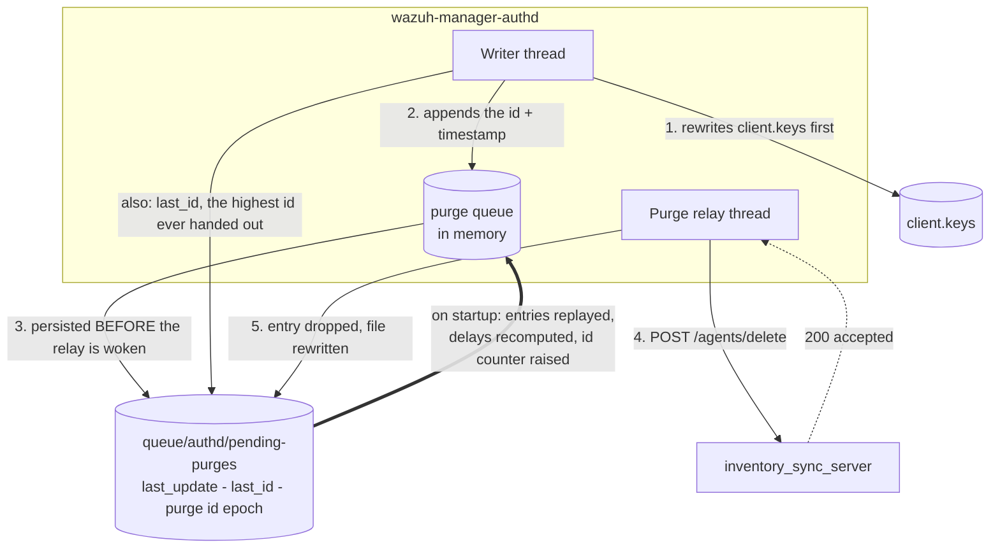

# Authd Architecture

## Overview

`wazuh-manager-authd` owns the agent keystore. It hands out agent ids and keys, persists them to
`client.keys`, mirrors every registration into Wazuh DB, and makes sure a removed agent's documents
leave the indexer too. Enrollment arrives through three doors — the TLS port on 1515, remoted's
authenticated `/enroll` route and the server API — and all of them converge on the same in-memory
keystore behind one mutex: the last two both arrive over the local Unix socket.



The load-bearing property of this layout is that **the writer thread never waits on anything it does
not own**. It is the only thread that persists `client.keys`, and remoted authenticates agents by
reading that file, so anything slow in the writer's pass delays every enrollment — including agents
unrelated to the work in progress. That is why the indexer purge sits behind a queue and a second
thread instead of being called inline.

## Threads

| Thread | Runs on | Role |
|---|---|---|
| Remote server | any node with `remote_enrollment` | TLS enrollment on port 1515 |
| Local server | every node | `queue/sockets/auth.sock`: `add`, `remove`, `get` — for the server API and for remoted's `/enroll` |
| Writer | master only | persists `client.keys`, removes Wazuh DB rows, queues indexer purges |
| Purge relay | master only | sends queued purges after their delay, owns every retry |

## Enrollment

Whichever door the request arrives through — including remoted's `/enroll`, which reaches authd over
the same local socket the API uses, and a worker node's forward to the master — the serving thread
validates it and, under `mutex_keys`, checks for a duplicate id, name or IP, applies the
[force](configuration.md#force) rules, adds the entry to the keystore, appends the key
to the insertion queue and signals the writer. It answers the caller with the key immediately.

The agent has a usable key at that point, but remoted does not know about it yet: the key reaches
`client.keys` on the writer's next pass, and remoted reloads that file on its own cadence. **Enrollment
latency is the writer's pass time plus remoted's reload**, which is the reason nothing slow may live
in that pass.

## Agent removal

A removal touches four places, and only the first three are immediate.



Two of those doors are worth calling out:

- **An enrollment whose name already exists is a removal.** `w_auth_replace_agent()` calls the same
  two functions the API path calls, so a fleet that re-enrolls with names that already exist generates
  one deletion per agent without anyone touching the API. Any reasoning about deletion load has to
  account for it.
- **An insertion that names an id explicitly is refused rather than served** when that id belongs to
  an existing agent (`9012`) or still owes a purge (`9018`, reported as `1763` by the server API). A
  queued purge always runs; cancelling it is never the answer. The id stops being reusable the moment
  the agent is deleted, not when the writer gets around to queueing the purge: it is reserved in memory
  in between, or an insertion arriving inside that window would take an id whose purge is on its way.

### Why the purge waits

The relay holds each id for at least `authd.purge_delay` seconds (default `120`) before sending it,
because the purge has to outlast three intervals. A `_delete_by_query` is a *search*: it cannot match
documents the indexer has not made searchable yet, and in a cluster a worker node that still holds the
previous `client.keys` keeps accepting that agent's data and writing it. **Whatever the purge misses
survives forever**, because with the agent gone nothing overwrites it.



See [`authd.purge_delay`](configuration.md#authdpurge_delay) for the full reasoning and for when a
single-node manager can lower it.

### Durability and the id mark

**Why a file at all.** The queue between the writer and the relay is in memory, and the purge it holds
is the *only* record that those documents still have to go: the agent is already out of `client.keys`
and out of Wazuh DB, so nothing else in the system knows they are owed. Before this file existed, a
manager restart dropped whatever was queued without a word, and the documents stayed in the indexer
with nothing left to ever overwrite them.



Pending purges live in `queue/authd/pending-purges`, written through a temporary and an atomic rename:

```
last_update 1787582136
last_id 161
purge 003 1787582014
```

- The `purge` line is written **after** `client.keys` has been rewritten, never before: failing the
  other way would leave a queued purge for an agent that is still alive.
- An entry is removed only once inventory-sync has accepted it. A restart replays what is left, with
  each delay recomputed from the stored timestamp, and logs how many purges were recovered.
- If the clock is **earlier** than `last_update` on startup, every stored timestamp is untrustworthy
  and they are all re-stamped, so each entry waits its full delay again.
- `last_id` is the highest agent id ever handed out. On startup the id counter is raised to it if
  needed, so **an id is never reused**: a purge matches by agent id, and nothing in a state document
  distinguishes one owner of an id from the next.

In memory the due time is monotonic, so an NTP correction while the daemon runs can neither bring a
purge forward nor park it in a future the wall clock has already left.

### What a rebuilt manager inherits

`queue/` survives an upgrade and a plain package removal, so the id mark and any pending purges survive
with it. A full package purge — or an install into a clean tree — takes the file with it, and the id
counter starts over while the indexer still holds the previous fleet's documents. **Deleting a manager
should include deleting its indexer data**, or new agents can inherit documents from the agents that
held their ids before, in the indices they do not resynchronise themselves.

## Storage

| Path | Contents |
|---|---|
| `etc/client.keys` | one line per agent: `<id> <name> <ip> <key>`; rewritten whole, never edited in place |
| `etc/agents-timestamp` | per-agent registration timestamp |
| `etc/authd.pass` | enrollment password |
| `queue/authd/pending-purges` | pending indexer purges and the highest id ever handed out |
| `queue/rids/<id>` | per-agent anti-replay counters, removed with the agent |

## Observability

| Line | Meaning |
|---|---|
| `Recovered N pending agent deletion(s)` | startup replayed the state file |
| `Raising the agent id counter from X to Y` | the counter would have gone backwards; ids are not reused |
| `The deletion of agent 'N' was accepted by the inventory sync server` | the purge is now inventory-sync's responsibility |
| `... could not be relayed ... will be retried in S s` | first failure for that entry; later attempts are debug |
| `The pending deletion queue is full` | the cap was reached; that deletion has to be repeated |
| `Shutting down with N pending agent deletion(s)` | they stay in the file and are retried on the next start |

The purge's own outcome — the `deleteByQuery` and its flush — is reported by
[inventory_sync_server](../inventory-sync-server/architecture.md#agent-deletion), not by authd: authd's
responsibility ends when the deletion is accepted.

## Related

- [Authd overview](README.md) and [configuration](configuration.md)
- [`src/os_auth/README.md`](https://github.com/wazuh/wazuh/blob/main/src/os_auth/README.md) — the
  developer map: invariants, tests and the reasoning behind each ordering decision
- [Inventory Sync Server architecture](../inventory-sync-server/architecture.md) — the peer on the
  other side of `DELETE /agents`
