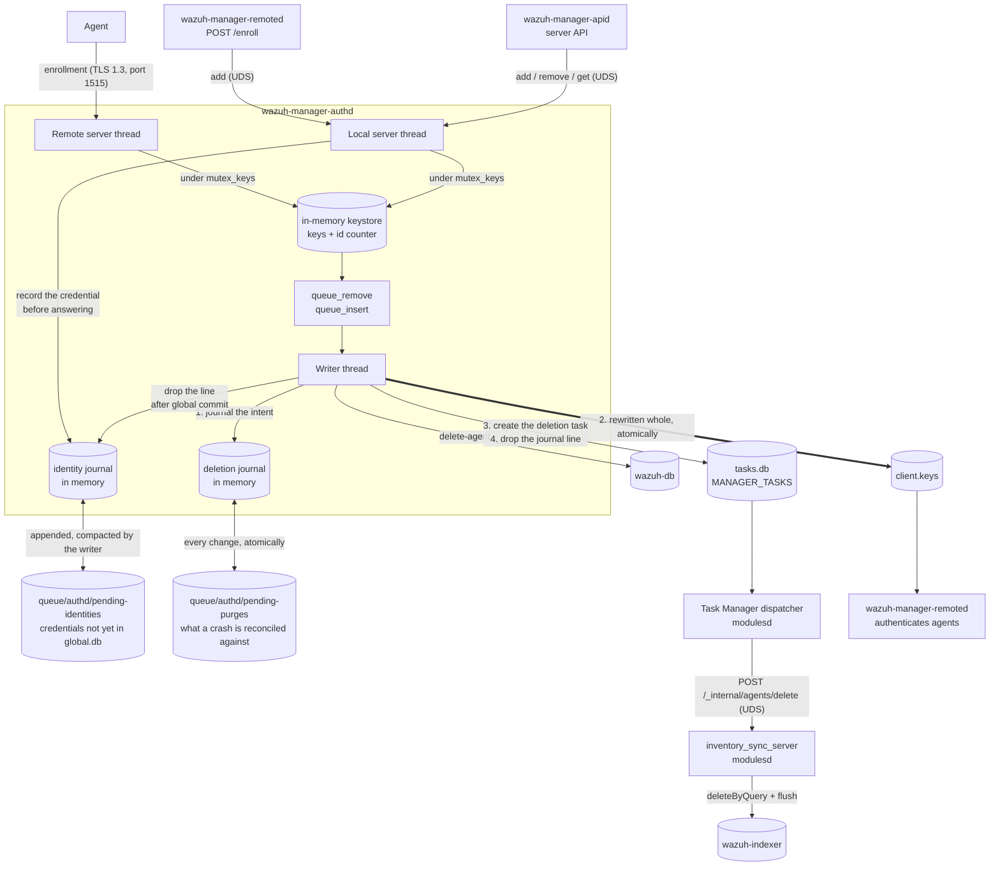
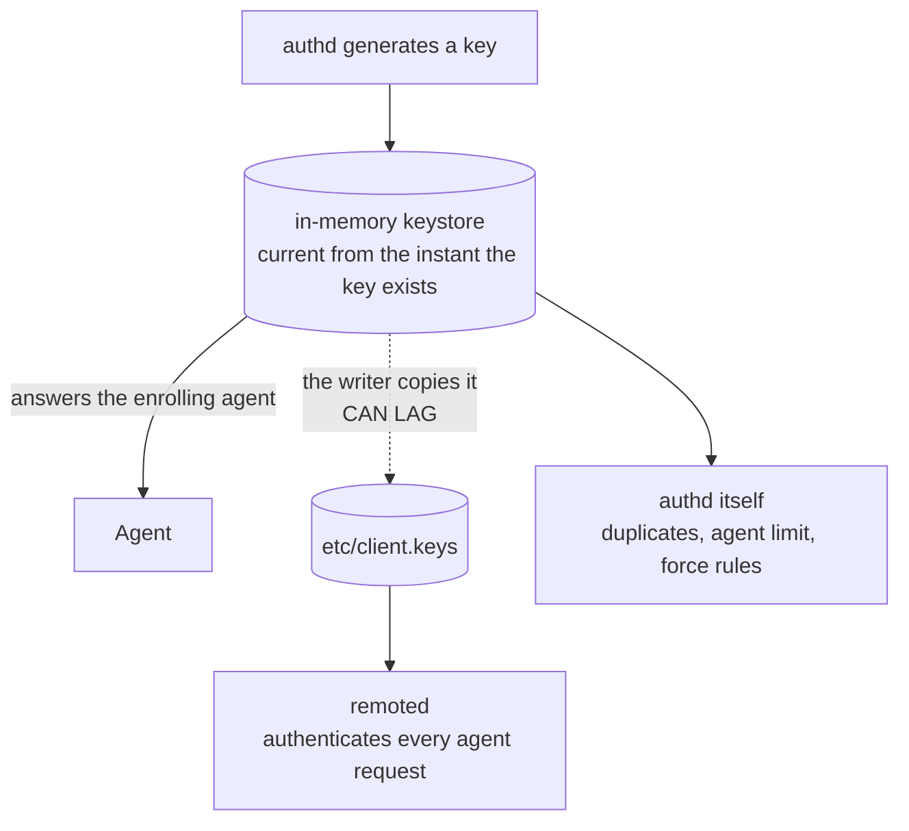
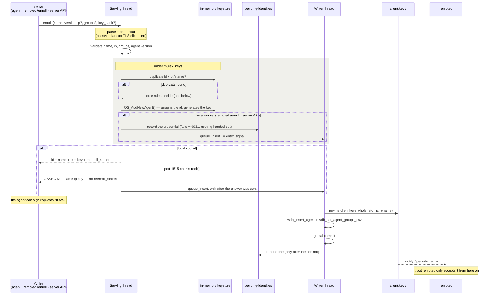
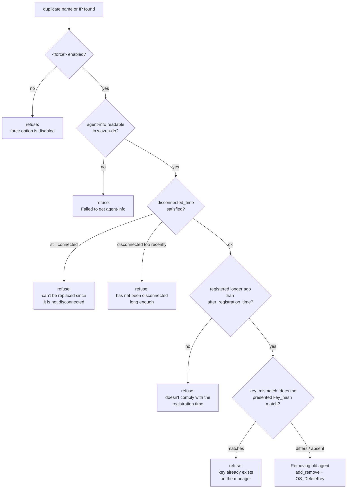
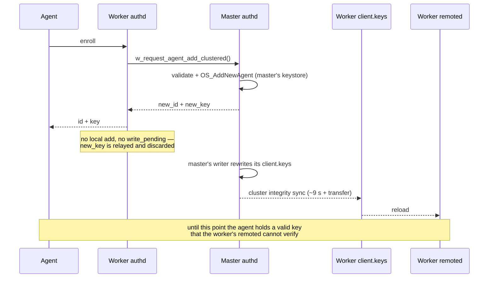
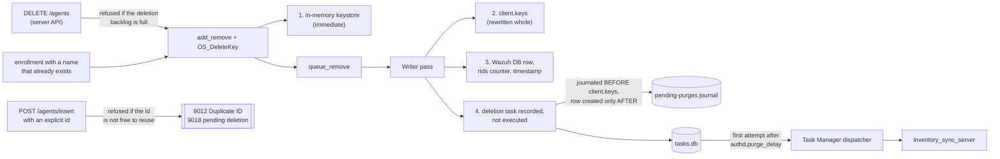
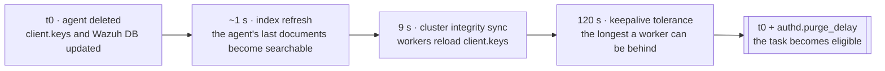
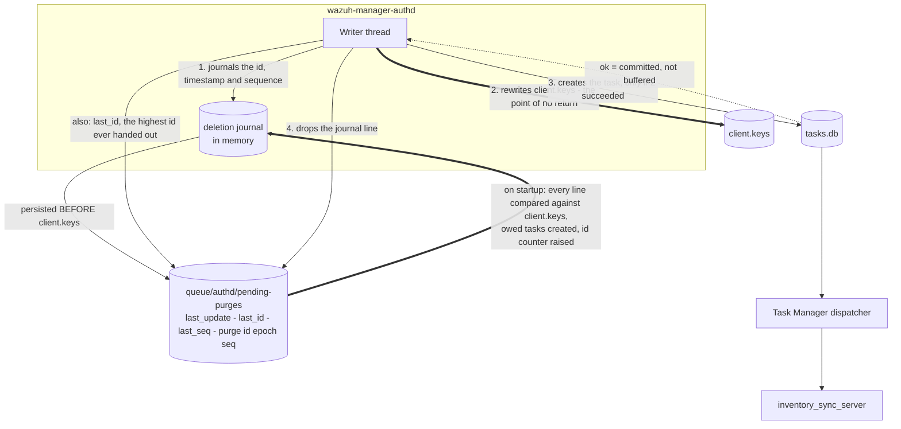

# Authd Architecture

## Overview

`wazuh-manager-authd` owns the agent keystore. It hands out agent ids and keys, persists them to
`client.keys`, mirrors every registration into Wazuh DB, and makes sure a removed agent's documents
leave the indexer too. Enrollment arrives through three doors — the TLS port on 1515, remoted's
authenticated `/enroll` route and the server API — and all of them converge on the same in-memory
keystore behind one mutex: the last two both arrive over the local Unix socket.



*Diagram source of truth: `src/os_auth/README.md`.*

The load-bearing property of this layout is that **the writer thread never waits on anything it does
not own**. It is the only thread that persists `client.keys`, and remoted authenticates agents by
reading that file, so anything slow in the writer's pass delays every enrollment — including agents
unrelated to the work in progress. That is why the indexer purge sits behind a queue and a second
thread instead of being called inline.

## Threads

| Thread | Runs on | Role |
|---|---|---|
| Remote server | any node with both `remote_enrollment` and `legacy_enrollment` | TLS enrollment on port 1515 |
| Local server | every node | `queue/sockets/auth.sock`: `add`, `remove`, `get` — for the server API and for remoted's `/enroll` — plus `token_create`, `token_list`, `token_revoke` and `token_purge` for the token CLI and the API |
| Writer | master only | persists `client.keys`, removes Wazuh DB rows, records each deletion as a Task Manager task, and settles the credentials the [identity journal](#the-identity-journal) still owes — waking on its own clock while any remain |
| authpass watcher | workers with `use_password` | re-reads `etc/authd.pass` as the cluster syncs it down from the master |

## The two stores

authd keeps every key in **two** places, and the difference between them explains most of the
module's behaviour — and most of its surprises.



- **The in-memory keystore** (`keys`, guarded by `mutex_keys`) is authoritative *inside* authd. It is
  where `OS_AddNewAgent()` assigns the id, where duplicate checks look, and where the key the agent
  receives comes from. It is current the moment a key exists.
- **`etc/client.keys`** is how the rest of the manager finds out. Only the writer thread rewrites it,
  and **remoted authenticates agents by reading it** — so an agent whose key has not reached the file
  yet is rejected as unknown (`401`), even though the key it holds is perfectly valid.

**Enrollment latency is the writer's pass time plus remoted's reload.** That is the reason nothing
slow may live in the writer's pass, and the reason the indexer purge sits behind a queue and a second
thread instead of being called inline.

On a **worker node** the gap is structural rather than incidental — see [Cluster](#cluster).

## Enrollment

Three doors converge on the same code. The TLS port on 1515 is served by the remote server thread;
remoted's authenticated `POST /enroll` and the server API both arrive over the local Unix socket.



Followed step by step, with the token, the bearer and the database writes spelled out:
[the enrollment lifecycle](enrollment-lifecycle.md).

`/enroll` can also carry one of two credentials the diagram folds into "credential". An **enrollment
token** arrives as `token_id`: the use is reserved *before* `OS_AddNewAgent()` runs and released if the
add is refused, so a token is only spent on an agent that exists. A **re-enrollment** arrives as
`reenroll = {kid, bearer}` and skips the sequence above: the master verifies the bearer against the
agent's `reenroll_secret` (read from wazuh-db before `mutex_keys`), then rotates the entry in place under
the **same id** — `OS_DeleteKey(purge = 1)` + `OS_AddNewAgent()` — and the writer runs
`global set-agent-credentials` instead of an insert. No `add_remove()` runs, so nothing in
[Agent removal](#agent-removal) applies: the id keeps its documents. Operator view:
[README](README.md#enrollment-tokens); function-level walk-through: the developer README.

### Validation

Checked before the keystore is mutated:

| Field | Rule |
|---|---|
| `name` | two validators, deliberately different — see below |
| `ip` | a syntactic IPv4/IPv6/CIDR, or `any`. `use_source_ip` overrides whatever the caller claims |
| `groups` | every group must exist (`9014`) |
| version | rejected if newer than the manager's, unless `<agents><allow_higher_versions>` is `yes` |

The agent limit is not on that list because it is not a separate check: `OS_AddNewAgent()` enforces
`max_agents` itself and returns `OS_ADDAGENT_LIMIT_REACHED`, which becomes `9013`. The same sentinel
covers the id-assignment counter (`id_counter`) reaching `INT_MAX`: both are "no capacity left"
conditions and neither leaves a corrupted record behind.

**The name is checked by two different validators, and the difference is intentional.** The TLS
port 1515 path applies `OS_IsValidName()` — 2–128 characters, no leading `.`, a restricted charset.
The local socket applies only `is_storable_agent_name()`, a **storage-safety floor**: non-empty, at
most 128 bytes, no leading `#` or `!` (those mark removed and comment lines in `client.keys`), and no
control byte, space or `DEL` (any of them would break the file's `<id> <name> <ip> <key>` field
split). A name that clears the floor but not the stricter rule is rejected with `9017`.

The looser floor is what lets an operator register a name the self-enrollment path would refuse.
remoted's `/enroll` applies its own validator, tighter than both, before it ever reaches the socket.

### The identity journal

An enrollment answers with a key, and a re-enrollment with a key and a new re-enrollment secret,
long before the writer puts either in `global.db`. If that database write failed — wazuh-db down, a
socket timeout, a crash in between — the agent was left holding credentials the manager had no
record of: it could talk to remoted once `client.keys` caught up, but it could never re-enroll,
because the row carried no secret or the previous one.

`queue/authd/pending-identities` records transitions for recovery, subject to the limitations below.
For a live, pending transition, the normal sequence is:

1. **Record**, on the serving thread, before the answer. Appending is one line with no rewrite,
   because it sits in front of each local-socket enrollment answer.
2. **Apply**, on the writer: the insert or the credential update it already performed.
3. **Commit**, once per cycle, with `global commit`. An `ok` from wazuh-db is not durability on its
   own: it runs a deferred transaction and commits on its own clock.
4. **Forget** the line on that commit, and only then release a rotation's reservation.

Four consequences an operator can observe:

- **A transition that cannot be recorded is refused** (`9031`), and no credential is handed out: the
  new entry is undone in the keystore, and a rotation never starts. A force replacement may already
  have deleted the previous agent; that deletion is not rolled back. The deletion journal may lose a
  line and carry on, because its entries can be rebuilt from `client.keys`; a secret exists nowhere
  else, so the same tolerance here would produce an agent that can never re-enroll.
- **The writer retries on its own clock** while anything is owed. The delay starts at one second,
  doubles, and nominally caps at 60 seconds; the current expression reaches 64 once before settling
  at 60. Retry-only cycles do not rewrite `client.keys`. Database calls can still delay the writer.
- **At startup the journal's own order is the judge**, not `client.keys`: an id no longer listed
  there owes nothing, a later entry for the same agent supersedes an earlier one, and anything else
  is still owed — including the case where `client.keys` names a different key, which is precisely
  the crash this exists for.
- **The bound is admission, not eviction**: 5000 transitions in flight, past which new ones are
  refused rather than older ones dropped, and a file above 8 MiB is not loaded at all. There is no
  `fsync`: process-crash/database recovery is intended, not power-loss durability. The 8 MiB check
  applies only when loading; appends do not enforce a byte ceiling.

The file holds the credential in the clear rather than a hash, because the re-enrollment verifier
derives its signing key from the real secret and `client.keys` does not carry it. A hash would record
that the transition happened and restore nothing. Treat the file as a secret: it is `0640`, and it is
normally empty.

**Only `local_add()` and `local_reenroll()` append transitions.** This covers the server API and
remoted's `POST /enroll`. Direct enrollment on the master's TLS port 1515 queues an insert with no
secret and no journal sequence. However, port-1515 enrollment received by a **worker** is forwarded
to the master's local socket and therefore does journal there. The legacy response still returns
only id/name/IP/key: the worker discards the master's re-enrollment secret, so the agent cannot use
secret-based re-enrollment.

**Recovery limitations:** a missing id in `client.keys` causes its journal entry to be discarded,
including a fresh enrollment lost before its first key-file write. A recovered rotation with an old
key in `client.keys` restores the database secret, allowing another re-enrollment; it does not itself
rewrite the key file. Credential commits currently proceed even after a failed key-file write, and
an UPDATE affecting zero rows can be treated as success. Group assignments are not journalled.
The loader also rejects ids longer than eight digits, although automatic assignment can reach
`INT_MAX` (ten digits); those otherwise valid journal entries cannot be recovered after restart.
See [the writer walkthrough](enrollment-lifecycle.md#step-11-the-writer-settles-it) and the developer
README's recovery notes for these implementation gaps.

Compaction happens during writer cleanup, startup reconciliation and failed-rotation cleanup.
If compaction fails, already dropped entries are absent from memory but can remain on disk;
therefore a nonempty file does not by itself prove wazuh-db is unavailable.

### Id and key assignment

`OS_AddNewAgent()` picks the id — always the next free one, **never a recycled one** (see
[Why an id is never reused](#durability-and-the-id-mark)) — and generates the key. The caller then
reads both straight out of the entry it just created:

```c
os_strdup(keys.keyentries[index]->id,      *id);
os_strdup(keys.keyentries[index]->raw_key, *key);
```

An insertion may also *name* an id explicitly (`manage_agents`, `POST /agents/insert`). That path is
refused rather than served when the id is taken (`9012`) or still owes a purge (`9018`); self-enrolling
agents never send one.

## Duplicate handling and force replacement

When the name or IP already exists, `w_auth_replace_agent()` decides whether the newcomer may take it
over. **Every guard has to allow it**, and they are evaluated in this order — the first one that
refuses ends the decision:



Two consequences worth internalising:

- **A replacement is a deletion.** It runs `add_remove()` and `OS_DeleteKey()` — the same two calls
  `DELETE /agents` makes — so everything in [Agent removal](#agent-removal) applies to it, including
  the queued indexer purge. A fleet re-enrolling under names that already exist generates one deletion
  per agent with nobody touching the API.
- **A replacement never reuses the id.** The replacing agent is a new registration with a new id.

`key_hash` is the caller's `SHA1(id ‖ name ‖ raw_key)` over its *current* credential — the same value
the legacy `K:` field carried, computed by `w_get_key_hash()` on both sides. It is a proof of
possession, not the key itself, and it is the last guard consulted rather than the first.

## Cluster

A worker node runs no writer: `if (!config.worker_node)` gates it, and with it every deletion phase. An
enrollment that arrives at a worker is forwarded to the master, and **the worker keeps nothing**.



Because of that, on a worker the window between "the agent has its key" and "remoted accepts it" is a
property of the cluster sync interval, not of authd's own speed. The `<force>` settings are ignored on
a worker — the master decides — and a worker that cannot reach the master answers `9016`.

The same sync carries `etc/enrollment_tokens.json`, with the same asymmetry: the master alone mints,
consumes and revokes (`token_create`/`token_revoke` answer `9015` on a worker; `token_list` reads the
replica), and `w_request_agent_add_clustered()` forwards `token_id` and `reenroll` with the `add` so the
master consumes the use or verifies the bearer, then relays the master's `reenroll_secret` to the agent.
remoted on a worker verifies token bearers against its own read-only replica of the file, which lags by
the sync interval; the master's re-check on `add` is what makes a revocation immediate.

## The enrollment password

With `use_password` enabled, `etc/authd.pass` holds the shared secret. The master generates one at
first start if none exists and logs that it did: `w_generate_random_pass()` takes 32 bytes from the
CSPRNG (`RAND_bytes`) and hex-encodes them to 64 characters, the same shape and the same fail-closed
rule as the agent key (`OS_NewAgentKey()`) — a CSPRNG failure aborts the start rather than falling
back to a weaker generator. Everything downstream treats the value as an opaque line, so a password
supplied by an administrator keeps working whatever its shape. Workers receive the file through the
same cluster sync as `client.keys`, which is why they run the **authpass watcher**: a worker that
has not received it yet fails closed — it rejects enrollments rather than validating against a
null password.

remoted's `/enroll` route does not present this password as-is; it derives an AES-256-CMAC key from it
with HKDF-SHA256 and signs the request (`Authorization: WazuhEnroll <timestamp>:<mac>`). See the
[agent API reference](../remoted/agent-api.yaml).

## Error codes

The local socket answers a numeric code that the server API maps onto its own, and remoted's
`/enroll` maps onto HTTP:

| Code | Meaning | `/enroll` |
|---|---|---|
| 9001 / 9002 / 9009 | internal error, JSON parse failure, key generation failure | `500` |
| 9003 / 9004 / 9005 / 9006 / 9014 / 9017 | no such function/argument/name/IP, invalid groups, invalid agent name | `400` |
| 9007 / 9008 / 9012 | duplicate IP, name or id | `409` |
| 9010 / 9011 | no such agent id / agent id not found | — |
| 9013 | `max_agents` reached, or the id-assignment counter (`id_counter`) exhausted at `INT_MAX` | `503` — the latter is reachable from ordinary self-enrollment, since it never sends an id of its own |
| 9015 / 9016 | request not valid on a worker / cannot reach the master | `503` |
| 9018 | the id still has a pending deletion | — |
| 9019 / 9020 | invalid caller-supplied key / id (id outside `[1, 2147483647]`, or `0`) | `400` — unreachable from here in practice: self-enrollment never sends a key or an id, mapped for completeness |
| 9021 | too many deletions are pending; the agent was NOT deleted (`1766` through the server API) | — |
| 9022 / 9023 / 9024 | enrollment token unknown or revoked / expired / out of uses (`add` with `token_id`) | `403` — the bearer verified, authd refused the use. Expiry and successfully persisted revocation survive restart; the **use count is best effort**, so `9024` is a best-effort bound — see [the README](README.md#enrollment-tokens) |
| 9025 | mint refused (`token_create`); the message carries the reason after `Enrollment token refused:` — the address checks against the listener certificate, or the store being full (5000 tokens) or about to cross its 7 MiB ceiling | — |
| 9026 / 9027 / 9028 | re-enrollment: unknown agent or no secret on record / invalid credential / outside the time window | `401` (`unknown_agent` / `invalid_signature` / `stale_token`) |
| 9029 | *Enrollment token store write failed* — `token_revoke` could not persist. The token stops being honoured here immediately and the id is retried on the next verb, but the caller is told the write failed rather than given a success or the `9022` of an unknown id | No `/enroll` path; server API `1771` → `500` |
| 9030 | *Re-enrollment already in progress* — another rotation holds that agent's reservation. A wait, not a credential problem | `409`, counter `remoted.enroll.reenroll.rejected_in_progress` |
| 9031 | *Identity transition could not be recorded* — the [identity journal](#the-identity-journal) could not take the line, so no credential is handed out at all | `503` (the server API's `1772`) |

## Agent removal

A removal touches four places, and only the first three are immediate.



Two of those doors are worth calling out:

- **An enrollment whose name already exists is a removal.** `w_auth_replace_agent()` calls the same
  two functions the API path calls, so a fleet that re-enrolls with names that already exist generates
  one deletion per agent without anyone touching the API. Any reasoning about deletion load has to
  account for it.
- **An insertion that names an id explicitly is refused rather than served** when that id belongs to
  an existing agent (`9012`) or still owes a purge (`9018`, reported as `1763` by the server API). A
  recorded purge always runs; cancelling it is never the answer. The id stops being reusable the moment
  the agent is deleted, not when the writer gets around to recording the task: it is reserved in memory
  in between, or an insertion arriving inside that window would take an id whose purge is on its way.
- **A deletion itself can be refused** (`9021`, reported as `1766`) when too many earlier ones are
  still pending. It is decided on the REQUEST thread, before the agent leaves the keystore, so the
  agent is untouched and the caller can retry. One line later there would be nothing left to refuse
  and nobody to tell — which is why the previous design, discovering a full queue in the writer, could
  only drop the purge and orphan the documents.

### Why the purge waits

The deletion task's first attempt is set `authd.purge_delay` seconds out (default `120`), because the
purge has to outlast three intervals. A `_delete_by_query` is a *search*: it cannot match
documents the indexer has not made searchable yet, and in a cluster a worker node that still holds the
previous `client.keys` keeps accepting that agent's data and writing it. **Whatever the purge misses
survives forever**, because with the agent gone nothing overwrites it.



See [`authd.purge_delay`](configuration.md#authdpurge_delay) for the full reasoning and for when a
single-node manager can lower it.

### Durability and the id mark

**Why a file at all.** The durable record of a deletion is its row in `tasks.db`, but that row cannot
be created before `client.keys` is written — doing so would put a Wazuh DB round trip in front of
every key write, so a database outage would block enrollment. The file covers the gap: it records the
*intent* locally, before the point of no return, and it is normally **empty**, because it drains as
fast as Wazuh DB answers rather than as fast as the indexer does.



The journal lives in `queue/authd/pending-purges`, written through a temporary and an atomic rename:

```
last_update 1787582136
last_id 161
last_seq 4
purge 003 1787582014 4
```

The four phases, and what each failure costs:

| # | Phase | Where | A failure costs |
|---|---|---|---|
| 0 | admit or refuse (`9021`) | request thread, before the agent leaves the keystore | the deletion is refused; the agent is untouched |
| 1 | journal the intent | writer, before `client.keys` | a warning; the phases continue |
| 2 | rewrite `client.keys` | writer | logged, and **phase 3 is skipped** |
| 3 | create the deletion task | writer, over Wazuh DB | the journal line stays; the next cycle retries |
| 4 | drop the journal lines | writer, on Wazuh DB's acknowledgement | the lines stay; the next start re-creates the tasks and the ids collide, which is success |

Phase 0 is taken by **both** paths that delete an agent: the API's `remove`, and a force replacement,
which is the higher-volume one — a mass re-enrollment produces one deletion per agent. A replacement
refused there is an enrollment refused, and the existing agent keeps its registration.

Phase 3 is gated on phase 2 because the writer *logs* a failed key write and carries on, so without
the gate authd would record purges for agents that are still listed on disk. Phase 4 can only drop a
line because the task's creation commits inside its own Wazuh DB command — its `ok` is a durability
acknowledgement rather than a buffered write. It drops the batch's lines in one write, and only the
ones whose tasks are durable: the journal file is rewritten whole on every drop, so dropping per entry
would make a bulk deletion quadratic in file writes.

Every surviving journal line is resolved on the next start against the `client.keys` just read: an
agent still listed there means the deletion never became final, so the line is dropped; an absent one
means the task is still owed and is created now. That comparison closes the window this design exists
for — a crash between the key write and the task's creation, which the previous relay design lost
silently.

- If the clock is **earlier** than `last_update` on startup, every stored timestamp is untrustworthy
  and they are all re-stamped, so each deletion waits its full delay again.
- `last_seq` is a monotonic per-entry sequence, and the deletion task's id is derived from the agent
  and its sequence. That is what makes the two legitimate creators — the writer and startup recovery —
  produce the *same* id, so the second one collides harmlessly instead of duplicating the work.
  Sequences are never reused and never reset; a wall-clock stamp could not promise that, and two
  deletions of one agent that derived one id would silently become one.
- `last_id` is the highest agent id ever handed out. On startup the id counter is raised to it if
  needed, so **an id is never reused**: a purge matches by agent id, and nothing in a state document
  distinguishes one owner of an id from the next.

### What a rebuilt manager inherits

`queue/` survives an upgrade and a plain package removal, so the id mark survives with it — and so
does `tasks.db`, which holds the deletions themselves. A full package purge — or an install into a clean tree — takes the file with it, and the id
counter starts over while the indexer still holds the previous fleet's documents. **Deleting a manager
should include deleting its indexer data**, or new agents can inherit documents from the agents that
held their ids before, in the indices they do not resynchronise themselves.

## Storage

| Path | Contents |
|---|---|
| `etc/client.keys` | one line per agent: `<id> <name> <ip> <key>`; rewritten whole, never edited in place. A removed agent is kept as a `!name` line unless `<purge>` is `yes` |
| `etc/agents-timestamp` | per-agent registration timestamp |
| `etc/authd.pass` | enrollment password |
| `queue/authd/pending-purges` | deletions between phase 1 and phase 4, plus the highest id and sequence ever handed out. Normally empty |
| `queue/authd/pending-identities` | credentials handed out but not yet committed to `global.db` — see [the identity journal](#the-identity-journal). Mode `0640`, one JSON line per transition, **in the clear**. Normally empty; a persistent nonempty file warrants checking database writes and journal-compaction errors |
| `queue/rids/<id>` | per-agent anti-replay counters, removed with the agent |
| `etc/enrollment_tokens.json` | the enrollment token store, `{"version":1,"tokens":[…]}`: per token `id`, `secret` (`null` without credential), `adr`, `pin`/`ca`, `created`, `expires`, `max_uses`, `uses`, `revoked`, `description`. Rewritten whole by the master (temporary file, `0640`, rename); a worker's copy comes from the cluster sync, and a momentarily missing file keeps the previous replica. Bounded at 5000 tokens and 7 MiB (one MiB below what remoted's replica accepts), and pruned by `token_purge` — which removes entries, unlike `token_revoke`, and is what a mint into a full store runs by itself before refusing |

The re-enrollment secret is retained in `agent.reenroll_secret` in `global.db` and temporarily in
`pending-identities`; it never appears in `client.keys`.

## Observability

| Line | Meaning |
|---|---|
| `Recovered N agent deletion(s) that were interrupted...` | startup reconciliation found deletions whose task was never created, and is creating them now |
| `Dropped N journaled deletion(s) whose agents are still listed in client.keys` | those deletions never became final; nothing is owed |
| `Converted N deletion(s) from the previous file format` | a journal written before sequences existed; the entries were numbered by position |
| `Raising the agent id counter from X to Y` | the counter would have gone backwards; ids are not reused |
| `The deletion of agent 'N' could not be recorded...` | phase 3 failed; the journal line stays and the next writer cycle retries |
| `Refusing the deletion: ...` | phase 0 said no (`9021`); the agent is untouched and the request can be repeated. A force replacement refused by the same bound reports `Agent 'N' can't be replaced: too many deletions are in progress` |
| `Shutting down with N agent deletion(s) still being recorded` | they stay in the journal and are reconciled on the next start |

The purge's own outcome — the `deleteByQuery` and its flush — is reported by
[inventory_sync_server](../inventory-sync-server/architecture.md#agent-deletion) and recorded as the
task's status, not by authd: authd's responsibility ends at the durable task row.

## Related

- [Authd overview](README.md) and [configuration](configuration.md)
- [`src/os_auth/README.md`](https://github.com/wazuh/wazuh/blob/main/src/os_auth/README.md) — the
  developer map: invariants, tests and the reasoning behind each ordering decision
- [Inventory Sync Server architecture](../inventory-sync-server/architecture.md) — the module that
  applies the deletion, on the other side of `POST /_internal/agents/delete`
