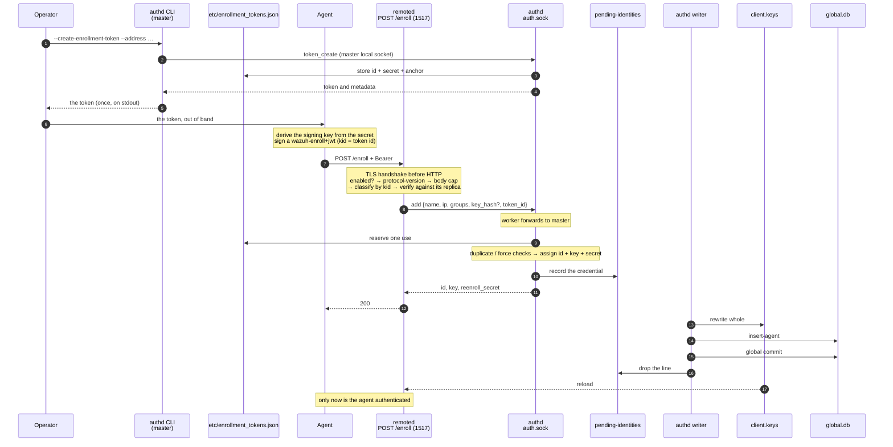

# Agent enrollment lifecycle (`POST /enroll`)

One agent, followed end to end: from the moment an operator mints an enrollment token to the moment
that agent's key is in `client.keys` and its row is in `global.db`. Twelve steps, each naming which
component acts, what it decides, and what it leaves behind on disk.

This page is the **narrative**. The reference detail lives in its own places and is linked rather
than repeated: the token store's file format, the CLI and the store's bounds are in
[the module overview](README.md#enrollment-tokens), the numeric refusals in
[the error-code table](architecture.md#error-codes), the HTTP contract in
[the HTTPS Agent API](../remoted/https-events-api.md#enrollment-endpoint-post-enroll), and the
configuration in [the configuration reference](configuration.md).

Port 1515 is a different path and is **not** described here. Its agent-facing protocol uses no
enrollment tokens or JWT bearers and returns no re-enrollment secret. See
[the module overview](README.md#how-it-works).

## The shape of it



---

## Step 1: The operator mints a token

The installed CLI invocation is (replace the hostname with the listener's certified name):

```bash
sudo /var/wazuh-manager/bin/wazuh-manager-authd --create-enrollment-token --address mgr.example.com
```

This is a **client of the local socket**,
not a standalone generator: it connects to `queue/sockets/auth.sock` and sends the `token_create`
verb, so authd must be running, and it runs on the **master only**. A worker answers `9015`.

Minting checks the configured certificate, not network reachability: `--address` must match the subject alternative names of
`remote.https.certificate`, that certificate must name something other than loopback, and
`remote.https.ca_certificate` must have signed it. The full list of checks is in
[the module overview](README.md#enrollment-tokens).

Two artifacts come out of one mint, and they go to different places:

| Artifact | Where it goes | Lifetime |
|---|---|---|
| The **token string** | stdout at creation; no CLI command retrieves it later | the operator's to distribute |
| The **record** (`id`, `secret`, `adr`, anchor, `expires`, `max_uses`, `uses`, `revoked`) | `etc/enrollment_tokens.json` on the master | until purged |

The record is what the manager keeps. The token string is what the agent gets. Listing omits the
secret and token text, but the stored record retains the material needed to reconstruct the token;
the one-time CLI output is not a guarantee of irrecoverability.

## Step 2: What a token actually is

The token an operator copies is **unpadded base64url of a compact JSON object**. Decode it with
base64url and you get the following shape (`--show-token` instead prints a readable description
that omits the credential):

```json
{"ver":1,"adr":"mgr.example.com","pin":"…","key":"…"}
```

| Member | Meaning |
|---|---|
| `ver` | format version, always `1`; anything else is refused |
| `adr` | where to connect: `host[:port][/prefix]`. The default port `1517` and the default prefix `wazuh-manager` are **dropped** on encoding, so a default deployment's token carries only a hostname |
| `pin` **or** `ca` | the trust anchor — exactly one, never both and never neither |
| `key` | the credential: 32 bytes, base64url. Absent on a `--no-credential` token |

That is the whole document. There is no signature on the token itself. Distribute it through a
trusted channel: replacing the descriptor can replace both the destination and its trust anchor,
and reading its `key` reveals the enrollment credential.

### What the `pin` is

The `pin` is **32 bytes: the SHA-256 of the DER encoding of the CA certificate's
SubjectPublicKeyInfo**. Not the certificate, not the certificate's fingerprint — the public key
structure inside it (`w_x509_spki_sha256()` in `src/shared/src/x509_op.c`).

When `remote.https.ca_certificate` holds a bundle, the pin is taken from the certificate in it that
**actually signs the listener certificate**, not from the first one in the file.

That choice has one practical consequence worth knowing before renewing anything: **the pin survives
a CA certificate renewal as long as the key pair is kept.** Re-issuing `root-ca.pem` with a new
validity window, a new serial or a new subject does not invalidate tokens already handed out.
Changing the CA key changes the pin. Once the listener's certificate chain requires that new key,
an old pin cannot authenticate it; other certificate and hostname checks still apply independently.

The CLI prints the same 32 bytes in hexadecimal as `pin:` on stderr so an operator can compare it
against a CA out of band, with the installed default CA path:

```bash
sudo openssl x509 -in /var/wazuh-manager/etc/certs/root-ca.pem -pubkey -noout | openssl pkey -pubin -outform DER | openssl dgst -sha256
```

If the configured CA file is a bundle, run this command on the signing certificate extracted
from that bundle: `openssl x509` reads only its first certificate. Inside the token the digest
is base64url; the two are the same value in different encodings.

> **Do not confuse it with `ca sha256`.** `--show-token` prints a `ca sha256:` line for an embedded
> CA, and that one is the digest of the **whole certificate**, not of its public key. The two are
> different values for the same CA, and only the `pin:` line is what a token pins.

The **agent must verify the pin** against the CA it uses to authenticate the listener. The manager
mints and distributes this value; remoted's bearer verifier does not read it. A pin mismatch is a
client-side trust failure, not one of authd's enrollment error codes.

### The alternative: `--embed-ca`

`--embed-ca` replaces `pin` with `ca`, carrying the CA itself inside the token. The agent then has
the certificate rather than a digest of its key, and needs nothing else to build a trust store.

What goes in is the **certificates** of
[`remote.https.ca_certificate`](../remoted/configuration.md#httpsca_certificate), re-serialised
rather than copied: a bundle travels as a bundle, and a private key that shares the file is never
included. The re-serialised PEM bundle may not exceed 64 KiB when embedded; this is not a limit on
the input CA file used for pinning.

Embedding increases the stored record by the size of the PEM bundle, including JSON escaping.
The store's byte ceiling can therefore bind before its token-count ceiling. A pinned token instead
requires the agent to obtain the CA separately, for example from `GET /cacerts`.

> An agent that can already reach the listener has a third option that needs no token at all:
> `GET /cacerts` hands out the same CA unauthenticated. The pin exists so the agent can *verify*
> what it fetched, which is the part an unauthenticated endpoint cannot give it.

### What the `key` is

`key` is **32 bytes, base64url**: the 16-byte token **id** followed by the 16-byte token **secret**.
The agent splits them; the manager stores them separately, the id in the clear and the secret as the
thing that proves possession. Both come from OpenSSL's CSPRNG, and a minted id that happens to
collide with an existing one is redrawn.

The id appears in `--list-enrollment-tokens` and in the bearer's `kid`. The secret is omitted from
listing, but is present in the token handed to the operator, the store file and authd's in-memory
store. The store file is also replicated to workers. Temporary derivation buffers are wiped;
that does not remove the retained credential.

Careful with the encodings, because three different lengths describe the same values. The `key`
member is 43 base64url characters for its 32 bytes; the id alone is 22 characters, which is the
shape remoted classifies a `kid` by; the pin is 43 characters in the token and 64 hexadecimal
characters on the CLI.

A `--no-credential` token has **no `key` member at all**. It says where to connect and which CA to
trust, and nothing more; remoted never accepts its id as a bearer `kid`, and the enrollment it
enables is whatever the manager's configuration would have allowed with no credential.

## Step 3: The agent derives a key and signs a bearer

The enrollment request carries a bearer rather than the secret. The agent derives a signing key
from the secret and signs a short-lived JWT.

**The derivation is one construction with three labels:**

```
key = HKDF-SHA256(
          IKM  = the secret,
          salt = 32 bytes of 0x00,
          info = <label> || 0x01,
          L    = 32 bytes)
```

| Credential | IKM | `info` label |
|---|---|---|
| Shared enrollment password | the first line of `etc/authd.pass`, with trailing CR/LF removed | `WAZUH-ENROLL-JWT-KEY` |
| Enrollment token | the token's 16-byte secret | `WAZUH-ENROLL-TOKEN-KEY` |
| Re-enrollment | the agent's 32-byte `reenroll_secret`, decoded from its 64 hex characters | `WAZUH-REENROLL-KEY` |

The labels are the domain separator: the same bytes fed to two of them yield unrelated keys. The
trailing `0x01` is a version byte, reserving room to change the construction without ambiguity. HKDF
is deterministic and uses a fixed zero salt. The shared C++ implementation uses OpenSSL HKDF;
authd's re-enrollment verifier calls it through its C bridge. The shared C token codec implements
the token derivation separately, with matching frozen vectors. Known-answer vectors cover all three labels.

**The bearer is a `wazuh-enroll+jwt`**, a deliberately closed profile:

| Part | Contents |
|---|---|
| Header | exactly `{"alg":"HS256","typ":"wazuh-enroll+jwt"}`, plus `kid` for the two keyed forms |
| Claims | exactly `{exp, iat, jti, nbf}` — no `iss`, no `sub` |
| Lifetime | the signer uses **60 s**; verification accepts `0 < exp - iat <= 60 s` and requires `nbf == iat`; `jti` is 16 random bytes encoded as 22 canonical base64url characters |

It binds **who and when, and nothing else**: not the method, not the request target, not the body.
TLS protects those. There is no replay store, so a captured bearer can be replayed inside its
acceptance window, bounded in practice by authd's duplicate-name and duplicate-IP rules.

The verifier requires `iat <= now + skew`, `now <= exp + skew`, and, for a past `iat`,
`now - iat <= max_age + skew`. With a 60-second token and the default `max_age=60`, `skew=30`,
the maximum accepted age is 90 seconds, but issuance in the future is tolerated for only 30 seconds.
See [the timing options](configuration.md#remotedjwt_max_age-and-remotedjwt_clock_skew).

The `kid` is what tells the three credentials apart, and it is read **by shape, before any signature
work**:

| `kid` | Credential | Who verifies it |
|---|---|---|
| absent | the shared enrollment password | remoted, and only when configured to require it |
| 22 base64url characters | an enrollment token id | remoted, against its replica, **always** |
| a canonical agent id, e.g. `001` | the agent's own re-enrollment secret | **authd on the master** — remoted forwards it unverified |

The two keyed shapes are disjoint: canonical agent IDs have at most ten decimal digits, while a
token id has 22 canonical base64url characters.

The classifier's range is wider than authd's current eight-character `OS_IsValidID()` check:
nine- and ten-digit agent ids reach authd but fail re-enrollment with `9027`. See the
[current limitations](README.md#re-enrollment-secret).

## Step 4: remoted classifies the request

`POST /enroll` uses enrollment credentials instead of the per-agent `wazuh-agent+jwt` bearer.
`GET /` and `GET /cacerts` also bypass that bearer. TLS, including any required client certificate,
is checked before HTTP dispatch. Once a request reaches the enrollment handler, checks run in this
order:

1. **Is enrollment enabled?** If not, `403` immediately — before any credential is examined and
   without touching authd. The route always exists, so this is distinguishable from a `404`.
2. **`protocol-version`**, then the body cap. Both before any credential.
3. **Classification by `kid`**, then verification as the table above describes.
4. **Body decoding and validation**, including the agent version policy, before contacting authd.

### How configuration affects the token's credential

This is the question that most often produces a surprise, and the answer is narrow:
**`use_password` does not bypass verification of a recognised token bearer.** Enrollment enablement,
TLS requirements, body limits and the JWT time policy still apply.

| Configuration | Request with a token `kid` | Request with no `kid` |
|---|---|---|
| `use_password` **on** | verified against the replica | the shared-password bearer is **required** |
| `use_password` **off** | verified against the replica, identically | anything passes: no header, a non-bearer scheme, garbage |

A bearer recognised as a token by the strict header parser is checked in every mode. A malformed
header that cannot be classified falls through to the password/open policy. An operator who minted a
token *with* a credential expects it to mean something, and silently ignoring it because the manager
happens to be in open mode would turn a deliberate restriction into decoration. Symmetrically,
`use_password` decides only what happens to a request that presents **no** token: with it on, the
shared-password bearer is required; with it off, the endpoint is open.

A re-enrollment `kid` likewise takes its own path in every mode, including when `etc/authd.pass` is
missing on that node — the password key is simply not involved.

> Mutual TLS is independent of both. If the listener requires a client certificate *and*
> `use_password` is on, both apply: they are two checks on the same connection, not a choice.

### What remoted can refuse on its own

Against its **read-only replica** of the token store, remoted resolves the `kid`, then checks the
signature, then the expiry, then the revocation — in that order, so an `expired` or `revoked` answer
only ever reaches a caller that proved it holds the secret. An unknown id forces one re-read of the
replica, subject to a reload rate limit, before being refused, because a token minted on the master moments ago may not have reached
this node yet.

Whether a stale token is refused **here** or by the master is not fixed, and an operator should
expect either: remoted answers its uniform `401` when its own replica already knows, and relays
authd's `403` when the master is the one that catches it.

## Step 5: remoted bridges to authd

remoted owns no enrollment business logic. It validates the body — `name`, `version`, `groups`, `ip`
— resolves the source IP, and sends an `add` over `queue/sockets/auth.sock`:

```json
{"function":"add","arguments":{"name":"…","ip":"…","groups":"…","key_hash":"…","token_id":"…"}}
```

`force`, `id` and a raw `key` are **never** sent by this route, even though the socket accepts all
three. Fresh enrollment gets an auto-assigned id and a manager-generated key; re-enrollment instead
sends `reenroll: {kid, bearer}` and keeps the id named there. A worker ignores a socket caller's
`force` override and uses the master's policy.

## Step 6: Worker or master

The node that answers the agent is not always the node that decides. What a worker does depends on
**which arguments** the `add` carries:

| Request | On a worker |
|---|---|
| `add` with no `id`/`key` — the only shape `/enroll` produces | **forwarded to the master**, along with `key_hash`, `token_id` and `reenroll` alike, and answered with the master's result |
| `add` carrying a caller-chosen `id` or `key` | refused with `9015` — there is no cluster call that could honour a chosen identity, and forwarding anyway would report success having created a different agent |
| `remove`, `get` | refused with `9015` |
| `token_create`, `token_revoke`, `token_purge` | refused with `9015` — the store has one writer, the master |
| `token_list` | answered locally, from the replica |

So an agent may enroll against any node, with a token or a re-enrollment credential, and get the
same answer: the master assigns the id, generates the key, consumes the token use and judges the
re-enrollment. A transport failure while forwarding answers `9016`.

The authd decisions and writer work below happen **on the master**, whichever node the agent
talked to. The response and later authenticated traffic still pass through the serving node.

## Step 7: authd reserves the token use

When the `add` carries `token_id`, authd re-reads the store if the file changed, then **reserves one
use before the agent exists**.

The ordering is the point. Creating the agent first and discovering the token exhausted afterwards
would leave an agent to roll back; reserving first costs only a release when the `add` is refused.
The reservation is closed exactly once, on every path: committed when the agent was created, given
back otherwise, including the path where the add produces no answer at all.

Refusals here are the token's own state: `9022` unknown or revoked, `9023` expired, `9024` out of
uses. Because the master re-checks on every `add`, a revocation takes effect immediately, even
through a worker whose replica has not been refreshed yet.

> **`max_uses` is a best-effort bound, not a durable one.** The use is counted in memory and the
> enrollment is allowed through even when the store file cannot be written, because failing a
> legitimate agent over a disk hiccup is the worse outcome. A restart before the next successful
> write reloads the older counter, so a single-use token may admit further enrollments across
> repeated restarts. Expiry is stored at minting; revocation survives restart only after its store
> write succeeds. A failed revocation reports `9029` and must be retried.

## Step 8: The keystore decision, with and without a key

Now authd validates the request and mutates the in-memory keystore under one mutex. What happens
next depends on whether this agent is new, colliding, or rotating.

### A brand-new agent

No name or IP collision: authd draws a 32-byte `reenroll_secret`, then `OS_AddNewAgent()` increments
the id counter and generates a 32-byte key as 64 lowercase hex characters. It does not search for
a free id slot. On a fresh enrollment, failure of the secret draw leaves no new entry;
on a force replacement, the old agent may already have been removed.

That key is the agent's long-term credential: it is the HS256 secret of the `wazuh-agent+jwt` bearer
the agent signs for every subsequent request, and it is what `client.keys` carries.

### A collision, and what `key_hash` changes

If the name or the IP already belongs to another agent, the enrollment is refused (`9008`, `9007`)
unless **every** `<force>` guard allows the takeover. They are evaluated in order and the first
refusal ends the decision:

| # | Guard | Refuses when |
|---|---|---|
| 1 | `force.enabled` | it is off |
| 2 | agent info readable | wazuh-db cannot supply the existing agent's status, disconnection time and registration date |
| 3 | `force.disconnected_time` | when enabled and the status is not `never_connected`: `disconnection_time` is zero, or the status is `disconnected` with a positive timestamp younger than the configured interval |
| 4 | `force.after_registration_time` | the configured threshold is positive and the existing agent is younger than it |
| 5 | `force.key_mismatch` | when enabled and `key_hash` is supplied: **the supplied hash matches** |
| 6 | deletion backlog | too many deletions are already in flight; this replacement failure surfaces as `9007`/`9008` (`409`), while an explicit `remove` uses `9021` |

`key_hash` is SHA-1 of the concatenation of the existing id, name and raw key text, without
separators (`w_get_key_hash()`); it is not a re-enrollment credential. Guard 5 applies only when
`force.key_mismatch` is enabled:

- **Without `key_hash`** the guard is skipped entirely. An agent that presents no key is treated as
  having none, and the takeover proceeds if the other guards allow it.
- **With a `key_hash` that matches** the stored key, the replacement is refused: the agent already
  holds the manager's current key for that identity, so there is nothing to enroll. This is what
  stops an agent that merely restarted from being handed a brand-new identity every time.
- **With a `key_hash` that does not match**, this guard passes; it does not prove possession of any
  key. The other guards still have to pass. With `force.key_mismatch` disabled, the hash is ignored.

When the guards do allow it, **the takeover is a deletion**: the previous agent goes through the
normal removal path, and the newcomer gets a **new id**. Its documents in the indexer are purged on
the usual schedule. An automatically assigned id is never reused.

The IP collision is checked before the name collision. If they name different agents, an allowed
IP replacement can delete the first agent before the name guard refuses the request for the second;
that earlier deletion is not rolled back. The same limitation applies to failures after the guards.

### A re-enrollment

A bearer whose `kid` is an agent id is a different operation entirely, and the contrast is the
reason it exists:

| | Force replacement | Re-enrollment |
|---|---|---|
| Triggered by | a name/IP collision plus `<force>` | a `reenroll` bearer |
| Agent id | **new** | **kept** |
| Old entry | deleted | rotated in place |
| Indexer documents | purged | kept |
| `<force>` guards | decide it | play no part |
| wazuh-db write | insert | update |

The master reads the agent's `reenroll_secret` from wazuh-db *before* taking the keystore lock,
verifies the bearer against it (`9026` no such agent or no secret on record, `9027` invalid, `9028`
outside the window), and rotates the entry under the lock. Only one rotation per agent may be in
flight; a second concurrent one is answered `9030`, which means *retry*, not *bad credential*.
The generation must still match, the id must still exist in the keystore, groups and IP must be
valid, and the requested name/IP must not belong to another agent. Both fresh credentials must be
generated and journalled before the in-place rotation can proceed.

## Step 9: The credential is written down before it is handed out

Before the answer is built, authd appends the agent, the key and the re-enrollment secret to
`queue/authd/pending-identities`. If that append fails — the directory is unwritable, or 5000
transitions are already in flight — the operation is **refused** with `9031` and no credential is
handed out: the newly added entry is undone in the keystore, and a rotation never starts.
The pre-check of journal capacity does not reserve a slot or test disk writability. If force
replacement already deleted a colliding agent before the append fails, that deletion is not undone;
this is an implementation limitation, not an atomic rollback guarantee.

This is the opposite trade-off from the deletion journal, on purpose. A lost deletion line can be
rebuilt from `client.keys`; a lost re-enrollment secret exists nowhere else, so performing the
transition unrecorded would produce an agent that can talk to remoted and can never re-enroll. See
[the identity journal](architecture.md#the-identity-journal) for the replay rules.

## Step 10: The agent gets its answer

```json
{"id":"003","name":"…","ip":"…","key":"<64 hex>","reenroll_secret":"<64 hex>"}
```

This is the HTTP `200` body; the `error`/`data` envelope belongs to authd's local socket.
The agent must store both credentials. The **key**, hex-decoded to 32 bytes, signs subsequent
authenticated agent requests. The **`reenroll_secret`** is what lets it come back later under the
same id after losing its key; it is
handed out exactly once per enrollment, it is never returned by `get`, it is never written to
`client.keys`, and each successful re-enrollment replaces both values with a new pair.

The response does not wait for persistence or remoted's reload. Those may finish before or after
the agent receives it.

## Step 11: The writer settles it

The insert/rotation and removal queues feed one writer thread. Serving threads also perform I/O:
they append the identity journal, and some validation paths query wazuh-db.

The serving thread appended the new entry to the in-memory `queue_insert` and signalled the writer;
it did **not** wait. The writer then, in order:

1. **Journals any deletion intent** to `queue/authd/pending-purges` — local, a temp file and a rename.
2. **Attempts to rewrite `client.keys` whole**, atomically, then writes `agents-timestamp`.
3. **Writes the database row**, then assigns the groups and removes deleted agents' database rows.
4. **Commits**, with `global commit`, and only then drops the identity-journal line and releases a
   rotation's reservation.
5. **Creates deletion tasks**, gated on the successful `client.keys` write.

**Current implementation limitation:** credential writes, their commit and journal removal are
not gated on `client.keys` success. A failed key-file write can therefore be followed by a
committed credential whose journal entry is forgotten, while remoted still reads the old file.

### What actually lands in `global.db`

A new agent is an `insert-agent`; a rotation is a `set-agent-credentials`, which is an **`UPDATE`**
of four columns and nothing else:

| Column | New enrollment | Re-enrollment |
|---|---|---|
| `id`, `date_add` | set | **untouched** — the agent keeps its original registration date |
| `name`, `internal_key`, `reenroll_secret` | set | rewritten |
| `register_ip` | the enrollment IP | rewritten |
| `ip` | **left `NULL`** | untouched |
| `group` | inserted, then overwritten by the group assignment | only when the request named groups |
| `connection_status` | **not set** — it stays at its default `never_connected` until the agent actually connects | untouched |
| os/version columns, `last_keepalive` | not set — they arrive later, from the agent's own traffic | untouched |

Two of those are easy to misread. **The enrollment IP goes to `register_ip`, not `ip`**: `ip` is
filled in later from the agent's real traffic, so a freshly enrolled agent legitimately has a NULL
`ip`. And **`connection_status` is not something enrollment sets** — an agent is `never_connected`
until it talks to remoted, which is why the `<force>` disconnection guard treats that state
separately.

For inserts, `date_add` is read back from `agents-timestamp` (`keep_date=1`), normally written
earlier in the cycle. A missing/unreadable timestamp returns zero; a rotation's UPDATE preserves
the existing date.

### Why the explicit commit

wazuh-db opens a transaction lazily and answers `ok` from **inside** it, closing it later on a
sweep of its own. So `ok` means *buffered*, not *durable*, and a wazuh-db crash in between would
lose it. `global commit` ends that transaction now, which is the only thing that licenses authd to
drop a journal line.

`set-agent-credentials` also has no row-existence check — an `UPDATE` matching zero rows still
answers `ok`. The retry pass reads the row: a matching `reenroll_secret` means no write is needed
before commit, a row with another or a NULL secret means update, and no row means insert.
**This does not protect the first writer pass:** an UPDATE affecting zero rows is treated as
success there, skipped by the retry pass, and its journal entry can be removed after commit.
The journal also carries no groups, so retries do not replay a failed group assignment.

> `get-agent-info` answers with `SELECT *`, so the agent's key and re-enrollment secret travel back
> over the wazuh-db socket in the clear. That socket is manager-local, and the two credential-bearing
> verbs deliberately log no arguments, but it is worth knowing before pointing a debugging tool at it.

If the database is unreachable, the credential stays owed. The writer then wakes on **its own
clock** — starting at one second and doubling toward a 60-second cap — rather than waiting for the next enrollment, so an idle
manager still finishes the job; those retry cycles deliberately do **not** rewrite `client.keys`.
The current backoff expression briefly reaches 64 seconds after 32, then settles at 60.
Startup reconciliation runs before the listeners open, using the `client.keys` just read. It drops
entries for missing ids, including a fresh enrollment whose first key-file write never landed;
it retains the latest transition for an id still present. See the
[recovery limitations](architecture.md#the-identity-journal).

The full phase ordering of the deletion half is in
[agent removal](architecture.md#agent-removal).

## Step 12: The agent becomes usable

remoted authenticates agents by reading `client.keys`, and reloads it on its own cadence. Until that
reload lands, the new key can receive `401`: an unknown agent for a fresh id, or an invalid signature
when the previous key is still loaded after a rotation.

**Time until the key becomes usable depends on the writer's pass and remoted's reload**, and on a
worker also on the cluster sync that carries `client.keys` down from the master. Slow work in the
writer can delay that availability; see [the two stores](architecture.md#the-two-stores).

Once the key is in place, ordinary authenticated agent routes use `wazuh-agent+jwt`. A later
re-enrollment still uses `wazuh-enroll+jwt`, signed from the re-enrollment secret; probes and CA
fetches remain unauthenticated.

## Where each thing lives when it is over

| Artifact | Ends up in | Replicated to workers |
|---|---|---|
| The agent's key | `etc/client.keys` and the `agent` row | yes, by the cluster sync |
| The agent's `reenroll_secret` | the `agent` row in `global.db`, only | no |
| The token record, with its use count | `etc/enrollment_tokens.json` on the master | yes, read-only |
| The token string | wherever the operator put it | never stored again |
| The identity-journal line | dropped once committed | no, node-local |

## See also

- [Module overview](README.md) — the token store, the CLI, the local socket protocol and the
  re-enrollment secret in reference form
- [Architecture](architecture.md) — the threads, the two stores, the identity journal and the
  error-code table
- [Configuration](configuration.md) — `use_password`, `<force>`, and the timing options
- [HTTPS Agent API](../remoted/https-events-api.md#enrollment-endpoint-post-enroll) — the wire
  contract of `POST /enroll`
