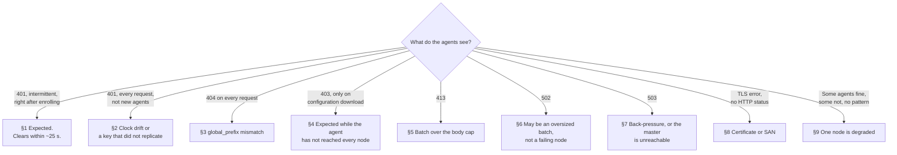
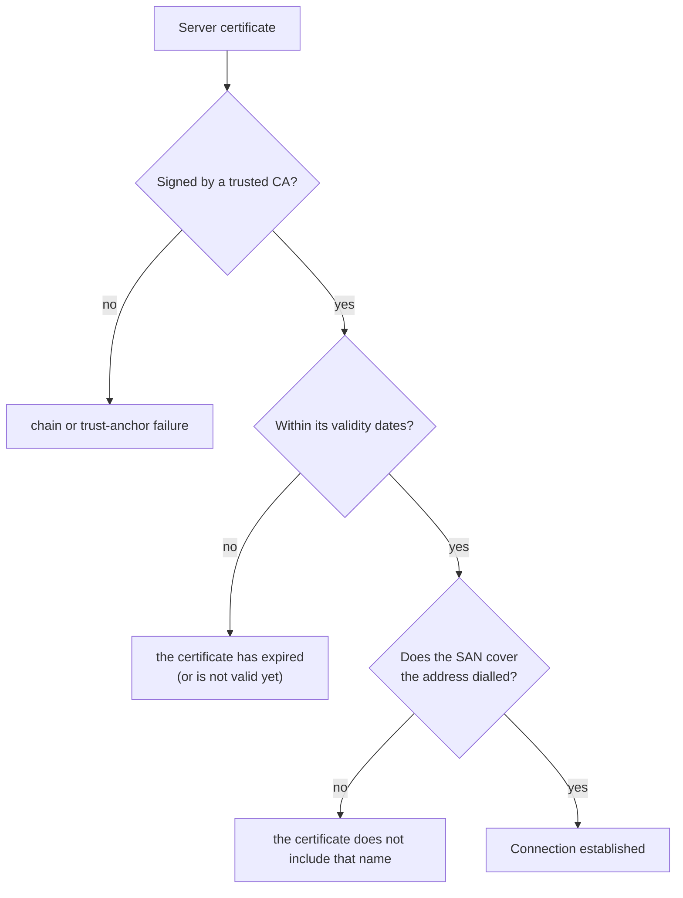

# Troubleshooting a balanced cluster

Symptom-first diagnosis for a 5.x fleet reaching a multi-node cluster through a load balancer.

Start here, not in the logs. Most of what looks alarming in this deployment is expected and
self-correcting; the table tells you which is which in one step.

For the architecture itself see [A Wazuh server cluster behind a load balancer](lb.md).

---

## Start here



---

## 1. Intermittent `401` right after enrolling

**Expected.** Not a misconfiguration.

A newly enrolled agent is known to the master immediately and to the workers a few seconds later.
Requests routed to a worker in between are rejected.

| What replicated | Workers accept after |
|---|---|
| `etc/client.keys` | 8 – 13 s |
| `etc/authd.pass` | ~23 s |
| `etc/enrollment_tokens.json` | 7 – 13 s |

The agent recovers unattended. A real agent enrolling through a balancer typically meets **three
different errors in the same burst** — a `503`, a `401`, and possibly a TLS error under passthrough
— all from the same cause.

**Confirm it and move on:**

```bash
# The key reached every node?
for n in <node1> <node2> <node3>; do
  echo -n "$n: "; ssh $n "grep -c '^<agent-id> ' /var/wazuh-manager/etc/client.keys"
done
```

**Escalate only if** it has not cleared after about a minute. Then it is §2.

> Every `401` carries the same message, `Invalid client authentication`. **The `code` field is what
> tells them apart**, and three of them name "this node has not received it yet" rather than "the
> credential is wrong": `unknown_agent` (no `client.keys` entry here), `enrollment_key_unavailable`
> (`authd.pass` not synced to this worker) and `token_unknown` (the enrollment token has not
> arrived). Read the code before concluding a credential is invalid.

---

## 2. Persistent `401`, including for agents that were working

Now it is a fault. Three causes, in order of likelihood.

### Clock drift

Each node judges the agent's token against **its own clock**. A node that drifts rejects tokens that
every other node accepts, which reads as intermittent failure tied to no agent in particular.

```bash
for n in <node1> <node2> <node3>; do echo -n "$n: "; ssh $n date -u +%s; done
```

They must agree within a few seconds. Fix with NTP, and keep `remoted.jwt_max_age` and
`remoted.jwt_clock_skew` identical across nodes.

### The key never replicated

```bash
ssh <worker> grep -c '^<agent-id> ' /var/wazuh-manager/etc/client.keys
```

If it is still absent minutes later, look at the cluster link rather than the agent:

```bash
/var/wazuh-manager/bin/cluster_control -l
tail -n 50 /var/wazuh-manager/logs/cluster.log
```

### The agent's registered address does not match

If the agent was enrolled with a specific IP rather than `any`, and the balancer presents its own
address to the manager, the address check fails. The metric is
`remoted.auth.reject.address_not_allowed`.

---

## 3. `404` on every request

**One node has a different `global_prefix`.** What that looks like depends on the balancing model:
under termination, a third of *requests* fail across the whole fleet; under passthrough, a third of
*agents* land there and fail **every** request for the life of the connection. The second is the
report you are more likely to receive.

This is the hardest failure to spot, because the node produces **no counter and no per-request log
line**: the request is discarded by the router before any route runs. A node rejecting 100% of agent
traffic looks exactly like an idle one.

**Diagnose by comparing the startup line across nodes:**

```bash
for n in <node1> <node2> <node3>; do
  echo -n "$n: "
  ssh $n "grep -m1 'served under the global prefix' /var/wazuh-manager/logs/wazuh-manager.log"
done
```

They must all report the same prefix:

```
INFO: All HTTP endpoints are served under the global prefix '/wazuh-manager'
```

Or query the effective configuration:

```bash
/var/wazuh-manager/bin/wazuh-manager-conf get remote.https.global_prefix
```

**Also check the balancer is not rewriting the path.** The prefix is *configured*, never rewritten.
A proxy that strips or adds a path segment produces the same `404`.

> It is always `404` and never `401`: the router discards before authentication runs, so a perfectly
> valid token changes nothing. If you see `401`, the prefix is not the problem.

---

## 4. `403`, but only on configuration download

**Expected while a freshly enrolled agent has not yet contacted every node.**

`POST /control` registers the agent in the memory of the node that handled it. Nothing replicates
that. A configuration download routed elsewhere is refused until the agent's notify cycle has
reached that node too.

It clears on its own. How long depends on the number of nodes:

| Nodes | Notifies needed | At `notify_time` 60 s |
|---|---|---|
| 3 | ~6 | ~5 minutes |
| 10 | ~30 | ~30 minutes |
| 20 | ~72 | ~70 minutes |

**Confirm it is this and not something else:**

* It affects only configuration downloads. WPK downloads are not gated this way.
* `remoted.download.denied` increments on the refusing node.
* The same request succeeds against a node the agent has already contacted.

**Escalate only if** it persists well beyond the window above, or affects an agent that has been
running for hours. An agent idle for more than **6 hours** against a given node is evicted from that
node's registry and has to re-register there, which is normal.

---

## 5. `413 Payload Too Large`

The agent sent a batch above the authenticated body cap of **5 MiB**. This is a working control,
not a fault: the agent classifies it as `PayloadTooLarge`, splits the batch and retries without
losing events.

**Act only if it is frequent.** Then lower the agent's `<agent><batch><size>`.

Check on the manager:

```bash
curl -s --unix-socket /var/wazuh-manager/queue/sockets/remote-admin-http.sock \
  http://localhost/metrics | grep body_too_large
```

> Do not look for it in `remoted.http.stateless.responses.413`. That bucket stays at zero, because
> the authentication middleware answers before the route runs. The counter above is the one that
> moves.

**If the `413` comes from the proxy instead**, its own body limit is below the manager's. Raise it to
at least the manager's transport cap (10 MiB by default), or the agent will split batches the
manager would have accepted.

---

## 6. `502 Bad Gateway`

Two very different causes. Check the second one before declaring an outage.

### A batch above the transport cap

Under **TLS termination with HAProxy**, a body above the 10 MiB transport cap makes the manager close
the connection, and the balancer reports that as `502`. It is not a failing node.

This is the worst of the three possible answers for the agent: `502` is not `PayloadTooLarge`, so it
does not split the batch, and it points at the manager for something the manager did not do.

The same oversized request produces three different answers depending on the front end:

| Front end | Answer | Agent behaviour |
|---|---|---|
| Passthrough or direct | connection closed, no status | retries the same bytes |
| NGINX termination | `413` | splits the batch — correct |
| HAProxy termination | `502` | does not split |

Correlate with batch size before looking at the node.

### A backend the balancer cannot reach or validate

```bash
# HAProxy
curl -s "http://<balancer>:8404/stats;csv" | awk -F, '{print $1,$2,$18}'
```

A backend marked `DOWN` right after a certificate change is §8.

---

## 7. `503 Service Unavailable`

Read the body. The code distinguishes the causes.

### `{"error":{"code":9016,"message":"Cannot communicate with master node"}}`

Enrollment only. The node could not reach the master to create the identity. Expect this while the
master is down or the cluster link is broken.

It takes **9 seconds** to produce. A client with a shorter timeout sees a timeout instead of this
message, which is why agent-side and proxy-side timeouts must be above that value.

```bash
/var/wazuh-manager/bin/cluster_control -l     # is the master listed?
```

### Back-pressure

`503` on event routes means the node accepted the credential but could not hand the batch
downstream. The agent retries; that is the designed behaviour. Sustained `503` from one node means
that node's pipeline is degraded.

```bash
curl -s --unix-socket /var/wazuh-manager/queue/sockets/remote-admin-http.sock \
  http://localhost/metrics | grep -E 'forwarder|budget.rejected'
```

### Early in a deployment

A node still starting answers `503` before its pipeline is up. Transient, and one of the three
errors described in §1.

---

## 8. TLS failure with no HTTP status

No status means the failure happened before HTTP: the agent rejected the certificate, or the
balancer rejected the backend's.

Three independent checks, and **the agent names which one failed in its own log** — it no longer
passes through the raw library error.



The two dedicated messages, both at error level in the agent's log:

```
TLS verification failed connecting to <url>: the certificate does not include that name
(subject alternative names: <the SAN list>).
```

```
TLS verification failed connecting to <url>: the certificate has expired
(not valid after <date>); no clock-skew tolerance applies to this check
(remoted.jwt_clock_skew covers only the post-enrollment JWT).
```

The first one prints the certificate's **actual SAN list**, so a SAN mismatch is diagnosable from
the agent log alone: compare that list against the address in the same line. A trust-anchor or
chain problem does not produce either message and surfaces as a generic transport failure.

### Identify which check failed

```bash
openssl s_client -connect <address>:1517 -servername <address> </dev/null 2>&1 | head -20
openssl x509 -in <node>.pem -noout -subject -issuer -dates -ext subjectAltName
openssl verify -CAfile root-ca.pem <node>.pem
```

### The SAN case is the one this deployment introduces

Under passthrough the agent dials the balancer but validates **the node's** certificate. A node
issued with only its own name refuses every agent that verifies.

**The manager's TLS metrics do not detect this.** They detect the other two:

| Failure | `remoted.server.tls.ca_matches_leaf` | `remoted.server.tls.cert_expiry_days` |
|---|---|---|
| Expired leaf | `1` | **negative** |
| Wrong CA | **`0`** | normal |
| **SAN mismatch** | `1` | normal — **nothing indicates the fault** |

So for a SAN mismatch, inspect the certificate directly:

```bash
openssl x509 -in /var/wazuh-manager/etc/certs/remoted.pem -noout -ext subjectAltName
```

Adding a node to an existing cluster is the usual way to introduce it: the new node is issued with
its own name and nothing else, while the agents keep dialling the balancer.

**The fix is to reissue, not to reconfigure.** `wazuh-certs-tool` takes the agent-facing address
separately from the node list, because it belongs to no node:

* **Passthrough** — `--agent-san <address>`, which adds it to the listener certificate of *every*
  manager node. Repeat the option for more than one address.
* **Termination** — a `load_balancer` entry in `config.yml`, which issues the proxy its own leaf
  from the same CA.

See [§8.2 of the architecture page](lb.md#82-issue-certificates).

### Where the error appears depends on the TLS model

| Model | Who sees it |
|---|---|
| Passthrough | the **agent**, in its own log, with no HTTP status |
| Termination | the **balancer**, which drops the backend; the agent sees nothing |

### After changing an agent's trust material

An agent with **no** `<ssl>` block and no CA on disk runs with verification disabled and logs it.
Placing a CA at `etc/certs/root-ca.pem` silently promotes it to full verification, including the
hostname check — which then requires the SAN rule above. See
[agent configuration](../client/configuration.md).

---

## 9. Some agents work, some do not, with no pattern

Usually **one node is degraded** while the balancer still considers it healthy.

A node can lose a dependency and keep answering the liveness probe. Observed with `wazuh-db` down:

| Request to that node | Answer |
|---|---|
| `GET /` | `200` |
| `POST /stateless` | `202` |
| `POST /control` | `500 database_error` |

Events keep flowing while groups, configuration hashes and task delivery all fail.

**No layer flags it.** Verified on a node in exactly that state:

| Where you would look | What it reports |
|---|---|
| The balancer's health check | healthy, same session count as the other nodes |
| `cluster_control -l` | the node is listed, like any other |
| Server API `/cluster/nodes` | the node is present, and carries no status field |
| Agent list | agents still `active` |

So the node cannot be found by asking anything centrally. It has to be found by asking each node
directly, which is what the commands below do.

### Find it by asking every node directly

```bash
for n in <node1> <node2> <node3>; do
  echo "== $n"
  ssh $n "ps -eo args | grep -c '[w]azuh-manager-db'"
  ssh $n "tail -n 20 /var/wazuh-manager/logs/wazuh-manager.log | grep -i 'wdb\|database'"
done
```

A node logging `Cannot connect to 'queue/sockets/wdb.sock'` in a loop is the one.

### Verify the daemons really started

The startup sequence reports success per daemon, but a daemon that dies immediately afterwards is
not caught. Check the process list rather than the startup output:

```bash
ps -eo args | grep -oE 'wazuh-manager-[a-z]+' | sort -u
```

Expect `analysisd`, `apid`, `authd`, `db`, `modulesd`, `remoted` and, on a cluster, `clusterd`.

### Take it out of rotation manually

Until a dependency-aware readiness signal exists, the only reliable remedy is to remove the node
from the balancer yourself and restart it.

---

## Quick reference

| Symptom | Most likely | Expected? |
|---|---|---|
| `401` right after enrolling | replication window | **yes**, clears within ~25 s |
| `401` persistent | clock drift | no |
| `401 token_unknown` | token not replicated yet | **yes**, clears within ~15 s |
| `403` on configuration download | node has not met the agent yet | **yes**, scales with node count |
| `404` on everything | `global_prefix` mismatch, or path rewriting | no |
| `413` | batch over the 5 MiB auth cap | **yes**, the agent splits it |
| `502` | oversized batch, or backend down | check size first |
| `503` with `9016` | master unreachable | only during a master outage |
| `503` on events | back-pressure | transient |
| TLS error, no status | CA, expiry or SAN | no |
| No pattern across agents | one degraded node | no |
