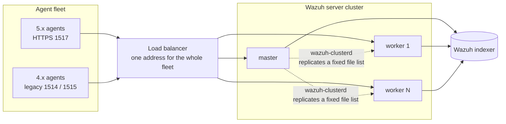
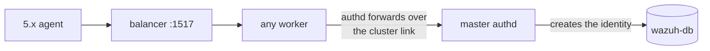
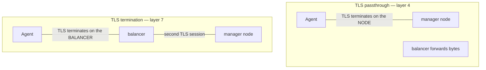
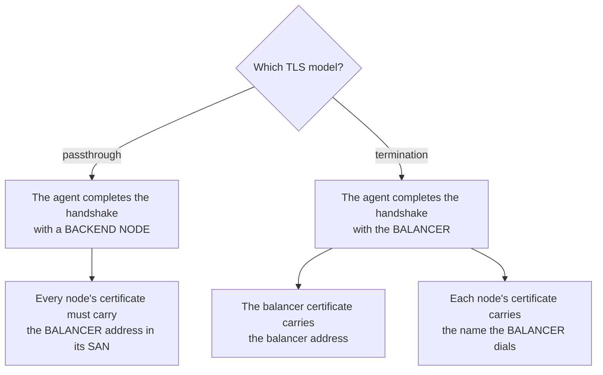
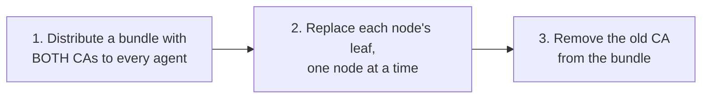
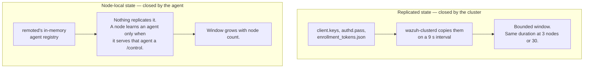
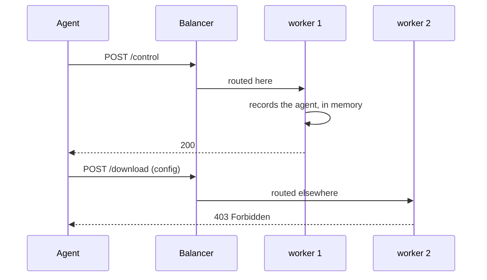
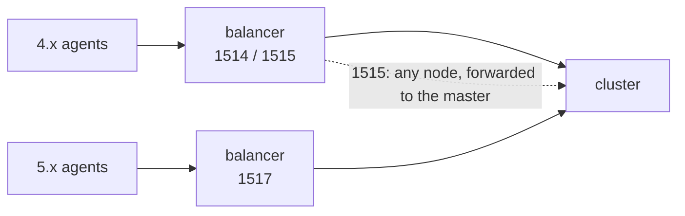

# A Wazuh server cluster behind a load balancer

Reference architecture for a 5.x deployment where a fleet of agents reaches a multi-node cluster
through a single address.

This page is the deployment contract: the topology, which traffic must reach which node, the
certificates each node needs, and — the part that surprises people — **what an agent observes while
the cluster is still catching up with itself**. The propagation windows and convergence figures were
measured on a three-node cluster; interval, timeout and cap values are the shipped defaults. The
procedure to reproduce the measurements is in
[`src/remoted/remoted_module/tools/load_balancer/`](https://github.com/wazuh/wazuh/tree/main/src/remoted/remoted_module/tools/load_balancer).

Related pages:

* [Remoted load balancers](../remoted/load-balancers/README.md) — the protocol rules that apply to
  any proxy, and worked [NGINX](../remoted/load-balancers/nginx.md) and
  [HAProxy](../remoted/load-balancers/haproxy.md) configurations.
* [Troubleshooting a balanced cluster](lb-troubleshooting.md) — symptom-first diagnosis.
* [Agent configuration](../client/configuration.md) — the `<agent>` block agents need.
* [Cluster configuration](configuration.md).

> **Note:** `<cluster>` is part of the manager configuration schema: it is validated at startup and
> every consumer receives the same effective section, with defaults applied. See
> [Cluster Configuration](configuration.md).

---

## 1. Topology



Agents know one address. Every node serves the same agent API. The master additionally owns every
operation that creates or changes identity.

---

## 2. Port map

| Port | Channel | Balanced to | Notes |
|---|---|---|---|
| `1517` | HTTPS agent API (5.x) | **every node** | The only channel a 5.x agent uses |
| `1514` | Legacy agent traffic (4.x) | **every node** | Requires `<remote><legacy><enabled>yes` |
| `1515` | Legacy enrollment (4.x) | **every node** | Requires `<auth><legacy_enrollment>`; workers forward to the master |
| `1516` | Cluster transport | not balanced | Node to node; never exposed to agents |
| `55000` | Server API | not covered here | Different API and authentication model |
| `9200` | Indexer | not balanced by this front end | — |

**Both enrollment channels can land on any node.** A worker opens the `1515` listener like the
master does and forwards the request over the cluster link, exactly as it does for `1517`, so
identity creation stays master-owned without the balancer having to know which node is the master.

There is one asymmetry, and it is on the legacy channel: the legacy response carries only id, name,
IP and key, so **a worker discards the master's re-enrollment secret**. An agent enrolled through a
worker on `1515` cannot later use secret-based re-enrollment. Pointing `1515` at the master avoids
that, at the cost of a single point of failure for legacy enrollment. Either choice is workable;
`1517` has no such trade-off.



If that forward cannot complete, the worker answers `503` with error `9016`
(`Cannot communicate with master node`) after roughly **9 seconds**. Set agent-side and proxy-side
timeouts above that value, or the caller sees a timeout instead of the reason.

---

## 3. Which operations require the master

| Operation | Any node | Master only |
|---|---|---|
| Events, inventory, stats, configuration download | yes | — |
| `/control` startup, notify, shutdown | yes | — |
| Enrollment over `1517` | accepted anywhere | identity created on the master |
| Enrollment over `1515` (legacy) | accepted anywhere | identity created on the master |
| Minting enrollment tokens | — | **yes** |
| Re-enrollment | accepted anywhere | the secret exists only on the master |
| Group changes, agent deletion | — | **yes** (through the server API) |

With the master down, existing agents are unaffected: events, `/control` and configuration
downloads keep working against the workers. **Enrollment stops**, and so do group changes.

---

## 4. What the cluster replicates, and what it does not

This is the single most useful table on the page. Everything an agent depends on is either
replicated on a timer, or never replicated at all.

| Path | Replicated? | Consequence |
|---|---|---|
| `etc/client.keys` | yes, from master | A new agent is unknown to workers for a few seconds |
| `etc/authd.pass` | yes, from master | A changed password is not accepted everywhere at once |
| `etc/enrollment_tokens.json` | yes, from master | A fresh token is unknown to workers for a few seconds |
| `etc/shared/` | yes, recursive | Group configuration converges |
| `var/multigroups/merged.mg` | yes | Multigroup configuration converges |
| **`etc/certs/`** | **no** | **Every node needs its own listener certificate, issued externally** |
| **`var/upgrade/`** | **no** | **A custom WPK must be placed on every node by hand** |
| **`queue/tasks/`** | **no** | Each node tracks task delivery on its own |
| **remoted's in-memory agent registry** | **no** | See [§7](#7-what-an-agent-observes-while-the-cluster-catches-up) |

The replicated set is defined in
[`framework/wazuh/core/cluster/cluster.json`](https://github.com/wazuh/wazuh/blob/main/framework/wazuh/core/cluster/cluster.json).
Workers poll it on a `sync_integrity` interval of **9 seconds**.

---

## 5. TLS: choose a model before issuing certificates

The two models differ in **who proves their identity to the agent**, which decides which
certificate needs which names.



| | Passthrough | Termination |
|---|---|---|
| Certificate the agent validates | **each manager node's** | the **balancer's** |
| Certificate the balancer validates | — | each manager node's |
| Balancing granularity | per **connection** | per **request** |
| Can the balancer read or log paths | no | yes |

### Balancing granularity is not a detail

A TCP front end balances **connections**. An agent that keeps one connection open stays on one node
for its lifetime. An HTTP front end balances **requests**, so consecutive requests from the same
agent land on different nodes.

That choice changes how visible everything in [§7](#7-what-an-agent-observes-while-the-cluster-catches-up)
is. Neither is wrong; the deployment has to know which one it picked.

---

## 6. Certificates

`etc/certs/` is **not** replicated, so every node needs its own listener pair, issued externally
with the Wazuh installation assistant's `wazuh-certs-tool`.

### The SAN rule



Under passthrough this is the rule people get wrong: the agent dials the balancer, but the
certificate it checks belongs to whichever node answered. A node issued only with its own name is
refused by every agent that verifies, with a TLS error and **no HTTP status**.

The same address is validated again when an enrollment token is minted:
`wazuh-manager-authd --create-enrollment-token --address <host>` refuses a host the listener
certificate does not name. So a missing SAN blocks token enrollment as well as reporting.

> The agent-facing address belongs to no single node, so `wazuh-certs-tool` takes it separately:
> `--agent-san` under passthrough, which adds it to every manager node's listener certificate, and
> the `load_balancer` section of `config.yml` under termination, which issues the balancer its own
> leaf from the same CA. See [§8.2](#82-issue-certificates).

### What agents trust

The agent verifies against `<agent><ssl><certificate_authorities>`. That file may hold **several**
CA certificates, which is what makes a rotation possible without downtime.

> **Do not bootstrap trust from `GET /cacerts` under TLS termination with a balancer certificate
> from a different CA.** That endpoint returns the CA that signs the **manager's** listener
> certificate. The agent's TLS peer is the balancer, so the anchor cannot verify the peer it is
> talking to, and an agent that adopts it loses the connection it had.
>
> An enrollment token does not rescue that case either: it pins the same
> `<remote><https><ca_certificate>`. **Signing the balancer leaf with the same CA as the nodes is
> what makes either mechanism work** — which is what §8.2's termination recipe does. Otherwise
> distribute the anchor out of band.

### Rotating the CA without dropping the fleet

Order matters. Reversing steps 1 and 2 is what takes a fraction of the fleet offline.



Replacing a node's certificate does **not** disconnect agents that are already connected under
passthrough, because the connection is already established. It affects agents that connect or
reconnect during the window.

---

## 7. What an agent observes while the cluster catches up

**Read this section before deploying.** Everything in it is expected behaviour that resolves on its
own. Not knowing about it is what turns a normal startup into an incident call.

There are two distinct effects, with two distinct causes, and they are often confused.



### 7.1 Replicated state: brief `401`s after enrollment

A newly enrolled agent is known to the master immediately and to the workers a few seconds later.
Requests routed to a worker in between are rejected.

Measured on a three-node cluster:

| File | Master accepts after | Workers accept after | Rejection while waiting |
|---|---|---|---|
| `etc/client.keys` | 0.04 s | 8.4 – 13.0 s | `401`, code `unknown_agent` |
| `etc/authd.pass` | immediately | ~23 s | `401`, code `enrollment_key_unavailable` |
| `etc/enrollment_tokens.json` | 0.13 s | 7.2 – 13.1 s | `401`, code `token_unknown` |

**The agent recovers on its own**, in every case, without intervention.

What an operator actually sees is worse than one clean error, because a real agent enrolling through
a balancer meets **three different failures in the same burst**:

| Symptom | Cause | Same root |
|---|---|---|
| `503` | a node whose pipeline is not ready yet | yes |
| `401 Invalid client authentication` | a node without `authd.pass` yet | yes |
| TLS error with no HTTP status | passthrough to a node not ready | yes |

All three are the same thing: the fleet is talking to a cluster that has not finished replicating.
They clear within about **25 seconds**, bounded by the slowest row in the table above. The password is not wrong, the token is not invalid, and the
certificate is not misissued.

> **Read the `code`, not the message.** Every `401` says `Invalid client authentication`; the `code`
> field is what separates "not replicated here yet" from "wrong credential". Three codes name the
> first case: `unknown_agent`, `enrollment_key_unavailable` (the `authd.pass` row) and
> `token_unknown` (the token row).

### 7.2 Node-local state: `403` on configuration download

`POST /control` registers an agent **in the memory of the node that handled it**. Nothing replicates
that registry. `POST /download` for `resource_type: config` authorises against it, so a download
routed to a node that has not yet served this agent a `/control` is refused with `403`.



**This also converges**, but by a different route: the agent's own notify cycle eventually reaches
every node. Measured, one notify plus six downloads per round:

| Round | Downloads denied | Nodes that know the agent |
|---|---|---|
| 1 | 4 / 6 | 1 of 3 |
| 2 | 2 / 6 | 2 of 3 |
| 3 | 2 / 6 | 2 of 3 |
| 4 | **0 / 6** | 3 of 3 |
| 5 and after | **0 / 6** | 3 of 3 |

**The window scales with cluster size**, because covering every node with random routing is the
coupon-collector problem — `N·H(N)` notifies for `N` nodes:

| Nodes | Notifies to cover them all | At `notify_time` 60 s |
|---|---|---|
| 3 | 5.5 | ~5 minutes |
| 10 | 29.3 | ~30 minutes |
| 20 | 72.0 | ~70 minutes |

Plan for it on large clusters: a freshly enrolled agent may not be able to fetch its configuration
from **every** node for that long. It can always fetch it from the nodes it has already contacted.

Two further properties worth knowing:

* It affects **only** `resource_type: config`. WPK downloads are not gated this way.
* Registry entries are evicted after **6 hours** of that node not serving the agent. An agent
  notifying regularly never reaches that, but a long-idle agent can be re-registered from scratch.

### 7.3 Per-node values an agent may see differ

| Value | Converges? | Why |
|---|---|---|
| `config_hash` | yes | Computed from `etc/shared/` and `var/multigroups/`, both replicated |
| `config_token` | yes | It is the agent's group list; identical everywhere |
| `settings_hash` | yes, if the inputs match | SHA-256 over the manager's `limits` object plus `cluster.name`, both read locally — **keep both identical across nodes** |
| `vd_feed_offset` | only when feeds are level | Read from each node's local vulnerability module |

`settings_hash` is the one an operator can break. Its `limits` inputs are **internal options**, not
a section of `wazuh-manager.conf`: `fim.file_limit`, `syscollector.*_limit` and their siblings, read
from `etc/internal_options.conf` and `etc/local_internal_options.conf`. A node whose local
overrides differ, or whose `<cluster><name>` differs, reports a different value for the same agent.

---

## 8. Deploying it

Deterministic procedure. Every step is verifiable before moving to the next.

### 8.1 Decide the agent-facing address

Pick the name agents will dial. It goes into the certificates, so changing it later means reissuing
them.

### 8.2 Issue certificates

Whatever tool issues them, these are the properties the deployment requires. They are verifiable
with `openssl` alone, so the check does not depend on the issuing tool.

| | Passthrough | Termination |
|---|---|---|
| Balancer certificate | not used | SAN contains the agent-facing address |
| Every manager node's SAN | **contains the agent-facing address** | contains the name the balancer dials |
| Signed by | a CA the agents trust | balancer leaf: a CA the agents trust; node leaves: a CA the balancer trusts |

The passthrough row is the one that trips people up, and the one the tooling does not make easy:
**the same address must appear in the SAN of every manager node**, because the agent dials the
balancer and validates whichever node answered.

#### Procedure

`wazuh-certs-tool` has one option for each TLS model. Which one you need follows directly from
[§5](#5-tls-choose-a-model-before-issuing-certificates): whoever terminates the agent's TLS session
is who needs a certificate carrying the agent-facing address.

##### Passthrough: `--agent-san`

The agent completes the handshake with a manager node, so **every** node's listener certificate has
to carry the agent-facing address. That address belongs to no single node, so it is passed on the
command line rather than in `config.yml`:

```bash
./wazuh-certs-tool.sh -A --agent-san <agent-facing address>
```

`-as`/`--agent-san` adds the address to the subject alternative name of every agent listener
certificate, on top of each manager node's own `ip` and `dns` entries. Repeat it for more than one
address.

`config.yml` then only describes the deployment itself:

```yaml
nodes:
  manager:
    - name: manager-1
      ip: "10.0.0.21"
      node_type: master
    - name: manager-2
      ip: "10.0.0.22"
      node_type: worker
```

##### Termination: the `load_balancer` section

The agent completes the handshake with the balancer, so the balancer needs a certificate carrying
the agent-facing address, signed by the same CA the agents pin — which means no second trust anchor
has to reach the endpoints. Declare it in `config.yml`:

```yaml
nodes:
  manager:
    - name: manager-1
      ip: "10.0.0.21"
      node_type: master
    - name: manager-2
      ip: "10.0.0.22"
      node_type: worker

  load_balancer:
    - name: lb
      dns:
        - "<agent-facing name>"
      ip:
        - "<agent-facing address>"
```

`-A` issues it along with everything else, or `-lb`/`--load-balancer-certificates` issues only those
entries. The manager leaves keep their own names, which is what the balancer validates when it
re-encrypts to the backend.

> `ip` accepts a list, as `dns` does, for a node reachable at more than one address. Every item
> reaches the certificate; the first is the address the components are configured with.

##### Deploy and verify

Install each pair on its node as `etc/certs/remoted.pem` and `etc/certs/remoted-key.pem`, with the
signing CA as `etc/certs/root-ca.pem`. Nothing here is replicated by the cluster; every node is
provisioned on its own.

Then verify, because this is the step that catches the mistake:

```bash
# The agent-facing address must appear here, on EVERY manager node.
openssl x509 -in <node>.pem -noout -subject -ext subjectAltName

# Every leaf must chain to the one CA.
openssl verify -CAfile root-ca.pem <node>.pem

# And the CA installed on the node must be the one that signs the listener it serves.
openssl verify -CAfile /var/wazuh-manager/etc/certs/root-ca.pem \
               /var/wazuh-manager/etc/certs/remoted.pem
```

Finally, check it end to end from outside, dialling the agent-facing address exactly as an agent
will. Because every node answers identically, run this enough times to exercise the rotation, and
check each backend directly as well (see [§8.5](#85-verify-before-letting-agents-in)):

```bash
curl --cacert root-ca.pem https://<agent-facing address>:1517/wazuh-manager/
```

`curl` answering `no alternative certificate subject name matches target` here means a node is
missing the address in its SAN. An agent reports the same fault in its own words, and prints the
certificate's actual SAN list alongside it:

```
TLS verification failed connecting to <url>: the certificate does not include that name
(subject alternative names: <list>).
```

It fails the same way for every agent that verifies, and **the manager's own TLS metrics do not
report it** — see
[troubleshooting §8](lb-troubleshooting.md#8-tls-failure-with-no-http-status).

See the
[Wazuh installation assistant documentation](https://github.com/wazuh/wazuh-installation-assistant)
for the full certificate-tool reference.

### 8.3 Configure every manager node identically where it matters

```xml
<remote>
  <https>
    <port>1517</port>
    <bind_addr>0.0.0.0</bind_addr>
    <global_prefix>/wazuh-manager/</global_prefix>
    <certificate>etc/certs/remoted.pem</certificate>
    <key>etc/certs/remoted-key.pem</key>
    <ca_certificate>etc/certs/root-ca.pem</ca_certificate>
  </https>
</remote>
```

Three settings **must be identical on every node**, and none of them is validated across the
cluster:

| Setting | If it differs |
|---|---|
| `<remote><https><global_prefix>` | That node answers `404` to every agent request |
| The `limits` internal options (`fim.file_limit`, `syscollector.*_limit`, …) | That node reports a different `settings_hash` |
| `<cluster><name>` | Same |

Verify the effective value per node rather than trusting the file:

```bash
/var/wazuh-manager/bin/wazuh-manager-conf get remote.https.global_prefix
```

Each node logs its effective prefix at startup. Compare that line across nodes:

```
INFO: All HTTP endpoints are served under the global prefix '/wazuh-manager'
```

### 8.4 Configure the balancer

Follow [the remoted load-balancer guide](../remoted/load-balancers/README.md) for the protocol
rules — TLS 1.3 to the backend, no path rewriting, no PROXY protocol, body size and timeouts. The
cluster-specific requirements are:

* `1517` to every node.
* `1515` to every node if legacy enrollment is enabled, or to the master alone if you need agents
  enrolled on that channel to keep secret-based re-enrollment (see [§2](#2-port-map)).
* `1514` to every node, if the legacy channel is enabled.
* Backend certificate verification **on**, against the same CA.

### 8.5 Verify before letting agents in

```bash
# Every node answers the liveness probe through the balancer.
curl --cacert root-ca.pem https://<agent-facing-address>:1517/wazuh-manager/

# The cluster is formed.
/var/wazuh-manager/bin/cluster_control -l
```

The responses are identical from every node — there is no node identifier in the body or headers —
so this confirms the front end works, not that every backend does. Check the backends individually,
by their own addresses:

```bash
for n in <node1> <node2> <node3>; do
  echo -n "$n: "
  curl -s -o /dev/null -w '%{http_code}\n' --cacert root-ca.pem "https://$n:1517/wazuh-manager/"
done
```

### 8.6 Configure the agents

Every agent points at the balancer, not at a node, and trusts the CA that signed the certificates
issued in [§8.2](#82-issue-certificates).

```xml
<agent>
  <manager>
    <endpoint><agent-facing address>:1517/wazuh-manager</endpoint>
  </manager>
  <enrollment>
    <enabled>yes</enabled>
    <authorization_pass_path>/var/ossec/etc/authd.pass</authorization_pass_path>
  </enrollment>
  <ssl>
    <certificate_authorities>/var/ossec/etc/root-ca.pem</certificate_authorities>
    <verification_mode>full</verification_mode>
  </ssl>
</agent>
```

Three things decide whether this works:

| Setting | Why it matters here |
|---|---|
| `<endpoint>` | The path segment must equal the managers' `global_prefix`. Omitting the slash and everything after it selects the default `wazuh-manager`; a **trailing slash with nothing after it** means "no prefix" and is a different deployment. A mismatch is `404`, not an authentication error |
| `<certificate_authorities>` | The CA from §8.2. It may hold several certificates, which is what makes [rotation](#rotating-the-ca-without-dropping-the-fleet) possible without downtime |
| `<verification_mode>` | `full` also checks the address against the certificate's SAN, which is what `--agent-san` and the `load_balancer` entry exist to satisfy |

If `<verification_mode>` is left out, the agent resolves it from what it finds on disk, and a CA at
`etc/certs/root-ca.pem` alone is enough to promote it to `full`. See
[agent configuration](../client/configuration.md#verification_mode).

Deploying with an enrollment token instead sets the address, the trust anchor and the credential
from one value, rather than asking the peer for an anchor it has not verified.

Two conditions apply, and both are properties of the certificates rather than of the token:

* **The token's address must appear in a manager listener certificate's SAN**, or minting is
  refused with `address not in certificate SAN`. Under passthrough, `--agent-san` puts it there.
  Under termination the agent-facing address is on the *balancer's* leaf, not on the nodes', so mint
  against a name the node certificates do carry, or add the agent-facing address to them as well.
* **The CA it pins is the manager's** `<remote><https><ca_certificate>`. It is only a usable anchor
  for the agent when the certificate the agent actually validates chains to that same CA — which,
  under termination, means issuing the balancer leaf from it.

### 8.7 Enrol one agent and watch it settle

Expect the behaviour in [§7](#7-what-an-agent-observes-while-the-cluster-catches-up): a few seconds
of `401`, possibly a `503`, and `403` on configuration download until the agent's notify cycle has
reached every node. Do not change anything during that window.

Confirm it settled rather than assuming it did:

```bash
# On the agent: it connected and is using the HTTPS channel.
grep -E "Valid key received|https_client: INFO: Starting" /var/ossec/logs/ossec.log

# On the master: the agent is active and reports a 5.x version.
/var/wazuh-manager/bin/cluster_control -a
```

---

## 9. Migrating a 4.x fleet

Both channels can run behind the same balancer during a migration.



Enable the legacy listener on every manager node:

```xml
<remote><legacy><enabled>yes</enabled></remote>
```

`<auth><legacy_enrollment>` has no default of its own: when absent it **follows
`remote.legacy.enabled`**, so enabling the listener enables legacy enrollment with it. Set it
explicitly only to diverge from that — for instance to keep the `1514` channel open while refusing
new 4.x registrations:

```xml
<remote><legacy><enabled>yes</enabled></remote>
<auth><legacy_enrollment>no</legacy_enrollment></auth>
```

An agent upgraded in place **keeps its identity and does not re-enrol**. An upgrade never rewrites
`ossec.conf`, so the agent starts with the 4.x `<client><server>` block; the 5.x agent reads the
deprecated `address`, applies port `1517` and the default prefix, and logs the exact replacement
configuration:

```
INFO: <agent><manager><endpoint> is not configured. Using <client><server><address> '<host>'
with the default port 1517 and the default endpoint prefix 'wazuh-manager'. Replace the
<client><server> block with a single <endpoint><host>:1517/wazuh-manager</endpoint>
```

The inherited `<port>1514</port>` is **not** carried over to the HTTPS channel.

---

## 10. Production checklist

Certificates:

- [ ] One listener pair per node, from one CA, issued externally.
- [ ] Under passthrough, every node's SAN contains the agent-facing address.
- [ ] Under termination, the balancer certificate carries the agent-facing address and every node's
      SAN carries the name the balancer dials.
- [ ] Agents trust that CA through `<agent><ssl><certificate_authorities>`.
- [ ] Behind a terminating balancer, either the balancer leaf is signed by the same CA as the
      nodes (§8.2), or nothing bootstraps trust from `GET /cacerts`.
- [ ] A rotation plan exists that distributes the new CA **before** replacing any leaf.

Configuration:

- [ ] `global_prefix` identical on every node and on every agent; the balancer never rewrites paths.
- [ ] The `limits` internal options and `<cluster><name>` identical on every node.
- [ ] Clocks synchronised (NTP). Token freshness is judged against each node's own clock.

Balancer:

- [ ] `1517` to every node; `1514` to every node if enabled; `1515` routed per the decision in
      [§2](#2-port-map).
- [ ] Backend TLS 1.3 with certificate verification enabled.
- [ ] Proxy body limit at or above the manager's transport cap
      (`<remote><https><max_body_size>`, 10 MiB by default).
- [ ] Response timeout above 30 s, and above 9 s for enrollment specifically.
- [ ] No PROXY protocol towards remoted.

Cluster:

- [ ] A custom WPK is placed in `var/upgrade/` on **every** node before requesting an upgrade.
- [ ] The team knows that `etc/certs/`, `var/upgrade/` and `queue/tasks/` are not replicated.

Operations:

- [ ] The on-call runbook contains
      [Troubleshooting a balanced cluster](lb-troubleshooting.md), so the first `401` after a
      deployment is recognised rather than escalated.

---

## 11. Legacy-only balancing

The configurations below balance the **legacy** channel only. They apply to a cluster still serving
4.x agents. For 5.x agents use the HTTPS guides linked at the top of this page.

### NGINX

```nginx
stream {
    upstream enrollment {
        server <MASTER_NODE_IP>:1515;
    }
    upstream agents {
        server <MASTER_NODE_IP>:1514;
        server <WORKER_NODE_IP>:1514;
        server <WORKER_NODE_IP>:1514;
    }
    server {
        listen 1515;
        proxy_pass enrollment;
    }
    server {
        listen 1514;
        proxy_pass agents;
    }
}
```

### HAProxy

```haproxy
frontend enrollment
    bind :1515
    mode tcp
    default_backend enrollment_nodes

backend enrollment_nodes
    mode tcp
    server master <MASTER_NODE>:1515 check

frontend agents
    bind :1514
    mode tcp
    default_backend agent_nodes

backend agent_nodes
    mode tcp
    balance leastconn
    server master  <MASTER_NODE>:1514 check
    server worker1 <WORKER_NODE>:1514 check
    server worker2 <WORKER_NODE>:1514 check
```

The examples point `1515` at the master alone. A worker can serve it too, forwarding to the master;
see [§2](#2-port-map) for the trade-off.
