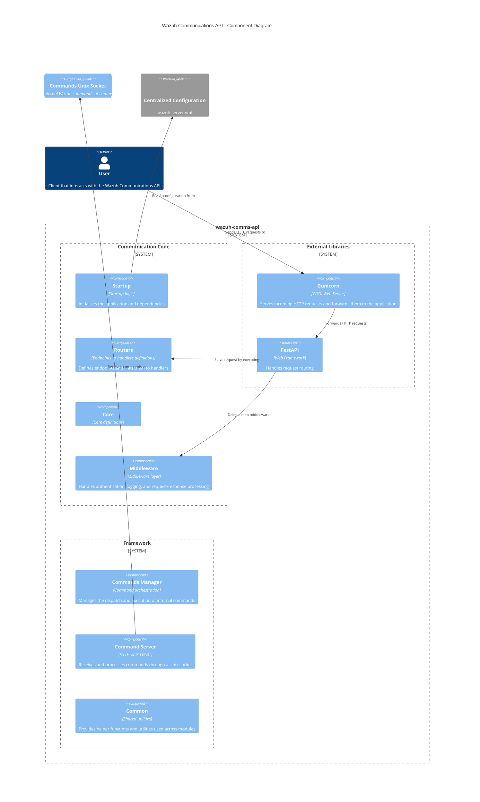

# Architecture

```mermaid

C4Container
title Wazuh Communications API - Component Diagram


System_Boundary(comms_api, "wazuh-comms-api") {

    System_Boundary(app, "Communication Code") {
        Component(startup, "Startup", "Startup logic", "Initializes the application and dependencies")
        Component(routers, "Routers", "Endpoints to handlers definitions", "Defines endpoints and links them to handlers")
        Component(core, "Core", "Core definitions")
        Component(middleware, "Middleware", "Middleware layer", "Handles authentication, logging, and request/response processing")
    }

    System_Boundary(deps, "External Libraries") {
        Component(gunicorn, "Gunicorn", "WSGI Web Server", "Serves incoming HTTP requests and forwards them to the application")
        Component(fastapi, "FastAPI", "Web Framework", "Handles request routing")
    }

    System_Boundary(framework, "Framework") {
        Component(commands_manager, "Commands Manager", "Command orchestration", "Manages the dispatch and execution of internal commands")
        Component(commands_server, "Command Server", "HTTP Unix server", "Receives and processes commands through a Unix socket")
        Component(common, "Common", "Shared utilities", "Provides helper functions and utilities used across modules")
    }

    Rel(user, gunicorn, "Sends HTTP requests to")
    Rel(gunicorn, fastapi, "Forwards HTTP requests")
    Rel(fastapi, middleware, "Delegates to middleware")
    Rel(fastapi, routers, "Solve request by executing")
    Rel(startup, centralized_config, "Reads configuration from")
    Rel(commands_server, commands_socket, "Receives commands via")
}

ComponentQueue(commands_socket, "Commands Unix Socket", "Receives internal Wazuh commands at comms-api.sock")
System_Ext(centralized_config, "Centralized Configuration", "wazuh-server.yml", "Defines core parameters for service behavior")
Person(user, "User", "Client that interacts with the Wazuh Communications API")

```
