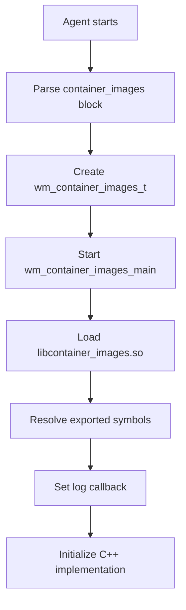
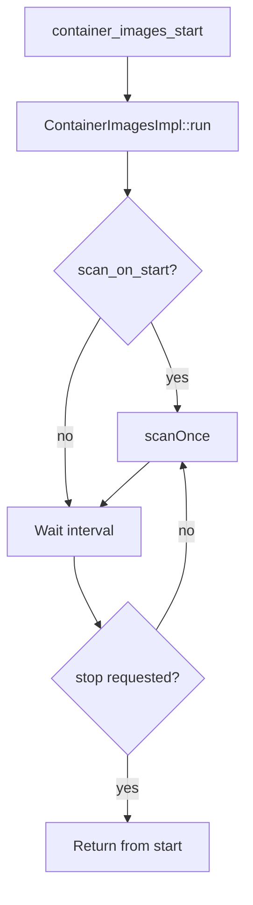

# Architecture

The **Container Images** module uses the same C and C++ split used by other Wazuh modules. The C layer lives inside `wazuh-modulesd` and handles configuration, lifecycle, dynamic loading, and logging. The C++ shared library contains the scan loop and image reader implementation.

> **Note:** This first development stage covers module startup, local OCI image layout discovery, metadata reading, and logging. Package extraction, persistence, event generation, and synchronization are not part of this stage.

---

## Main Components

### **Configuration Parser**

The configuration parser reads the `<container_images>` block from `ossec.conf` and stores it in a `wm_container_images_t` structure.

The parser handles:

- `enabled`
- `scan_on_start`
- `interval`
- `references/local`

The parser sets default values when the block is created:

| Field | Default |
|-------|---------|
| `enabled` | `yes` |
| `scan_on_start` | `yes` |
| `interval` | `1h` |
| `local_paths` | empty |

### **Module Lifecycle (`wm_container_images`)**

The module lifecycle is managed by the `wm_context` callbacks used by `wazuh-modulesd`.

| Callback | Function | Description |
|----------|----------|-------------|
| `start` | `wm_container_images_main` | Loads and starts the shared library. |
| `stop` | `wm_container_images_stop` | Requests the shared library to stop. |
| `destroy` | `wm_container_images_destroy` | Frees module configuration. |
| `dump` | `wm_container_images_dump` | Dumps the active configuration as JSON. |
| `sync` | `NULL` | Not implemented in this stage. |
| `query` | `NULL` | Not implemented in this stage. |

### **Container Images Library**

The `libcontainer_images.so` library exposes a small C ABI and forwards calls to the C++ implementation.

| Layer | Responsibility |
|-------|----------------|
| C ABI (`container_images.h`) | Exported functions loaded by `wazuh-modulesd`. |
| `ContainerImages` | Singleton facade between the C ABI and C++ implementation. |
| `ContainerImagesImpl` | Scan loop, stop handling, and reader creation. |
| `IImageReader` | Source-specific discovery interface. |
| `LocalImageReader` | Local OCI image layout reader. |

### **Reader Interface**

The `IImageReader` interface isolates source-specific discovery from the module orchestration logic. A reader returns discovered `ImageReferenceRecord` entries and identifies its source type.

The current implementation uses `LocalImageReader`. Future source types can be added by implementing the same interface.

### **Local OCI Reader**

The local reader inspects a configured directory and identifies the local image format. OCI image layouts are read, while unsupported formats are logged and skipped.

For OCI layouts, the reader:

1. Reads `index.json`.
2. Resolves the manifest blob for each manifest entry.
3. Reads the image configuration blob referenced by the manifest.
4. Extracts the tag, config digest, manifest digest, and platform fields.

Digest values read from local JSON files are validated before being used as path components.

---

## Data Flow

### **Initialization Flow**

### **Scan Execution Flow**

During `scanOnce()`, the module processes each configured local path:

1. Create a reader for the path.
2. Detect the local image format.
3. Discover OCI image references when supported.
4. Log each discovered reference.
5. Log the total number of discovered references.

---

## Threading Model

The module runs in the `wazuh-modulesd` module thread. `container_images_start()` blocks while the scan loop is active.

The interval wait is interruptible. When `container_images_stop()` is called, the implementation updates its running state and wakes the condition variable so the module can exit without waiting for the full interval.

---

## Event Types

This stage does not generate inventory events.

| Event type | Status | Notes |
|------------|--------|-------|
| Stateless alerts | Not implemented | Planned for later inventory changes. |
| Stateful events | Not implemented | Requires persistence and synchronization support. |
| Data clean notifications | Not implemented | Requires synchronization support. |

The current observable output is logging from the module scan flow.

---

## Image Reference Data

Discovered images are represented with `ImageReferenceRecord` entries:

| Field | Description |
|-------|-------------|
| `source.sourceType` | Source type, such as `local`. |
| `source.location` | Source location, such as the configured path. |
| `tag` | Reference name from the OCI annotation, when present. |
| `configDigest` | Image configuration blob digest. |
| `manifestDigest` | Manifest digest. |
| `os` | Operating system from the image configuration. |
| `architecture` | Architecture from the image configuration. |
| `variant` | Architecture variant, when present. |
| `osVersion` | Operating system version, when present. |

Package and layer data are not stored in this stage.

---

## Integration Points

### **Build Integration**

- `src/wazuh_modules/container_images/CMakeLists.txt` builds `libcontainer_images.so`.
- `src/wazuh_modules/container_images/container_images_impl/CMakeLists.txt` builds the implementation library and tests.
- `src/wazuh_modules/CMakeLists.txt` adds the module to agent builds and excludes the C glue from server builds.
- `src/init/inst-functions.sh` installs the shared library into the agent library directory.

### **Test Coverage**

The implementation includes:

- C++ tests for reader discovery, local format handling, scan behavior, injected reader factories, no-source scans, and disabled-module behavior.
- C tests for configuration parsing, defaults, multiple local paths, invalid values, and unsupported reference types.
