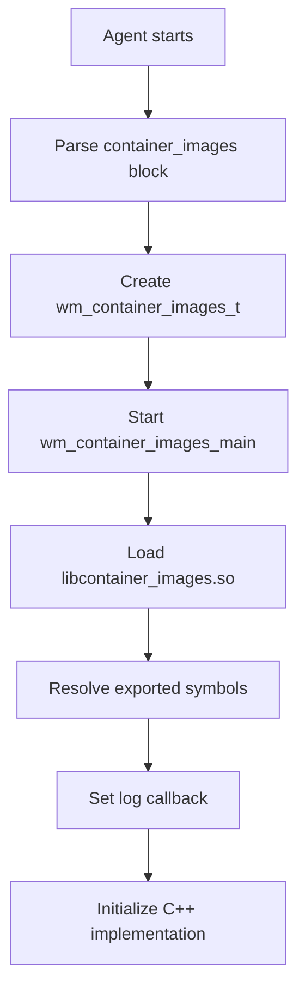
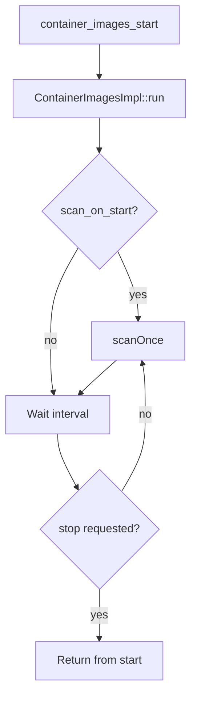

# Architecture

The **Container Images** module uses the same C and C++ split used by other Wazuh modules. The C layer lives inside `wazuh-modulesd` and handles configuration, lifecycle, dynamic loading, and logging. The C++ shared library contains the scan loop and image reader implementation.

> **Note:** This development stage covers module startup, image discovery from saved archives and OCI image layouts, package extraction for the `dpkg` and `apk` formats, logging, and local persistence of the inventory. RPM extraction, event generation, and synchronization are not part of this stage.

---

## Main Components

### **Configuration Parser**

The configuration parser reads the `<container_images>` block from `ossec.conf` and stores it in a `wm_container_images_t` structure.

The parser handles:

- `enabled`
- `scan_on_start`
- `interval`
- `references/archive`, `references/ref` and `references/local`

The three entry types are all accepted, and each is stored with its type, so the module reports the ones it cannot read yet instead of the configuration rejecting them.

The parser sets default values when the block is created:

| Field | Default |
|-------|---------|
| `enabled` | `yes` |
| `scan_on_start` | `yes` |
| `interval` | `1h` |
| `references` | empty |

### **Module Lifecycle (`wm_container_images`)**

The module lifecycle is managed by the `wm_context` callbacks used by `wazuh-modulesd`.

| Callback | Function | Description |
|----------|----------|-------------|
| `start` | `wm_container_images_main` | Loads and starts the shared library. |
| `stop` | `wm_container_images_stop` | Requests the shared library to stop. |
| `destroy` | `wm_container_images_destroy` | Frees module configuration. |
| `dump` | `wm_container_images_dump` | Dumps the active configuration as JSON. |
| `sync` | `NULL` | Not implemented in this stage. |
| `query` | `NULL` | Not implemented in this stage. |

### **Container Images Library**

The `libcontainer_images.so` library exposes a small C ABI and forwards calls to the C++ implementation.

| Layer | Responsibility |
|-------|----------------|
| C ABI (`container_images.h`) | Exported functions loaded by `wazuh-modulesd`. |
| `ContainerImages` | Singleton facade between the C ABI and C++ implementation. |
| `ContainerImagesImpl` | Scan loop, stop handling, and reader creation. |
| `IImageReader` | Source-specific discovery interface. |
| `ArchiveImageReader` | Reads saved image archives and OCI image layout directories. |
| `IByteStream` | Sequential byte source: a file, a member of an archive, and later a remote blob. |
| `LayerByteStream` | Decompresses a layer blob, or passes it through when it is a plain tar. |
| `LayerReader` | Streams the tar entries of one layer. |
| `LayerComposer` | Composes the layers of an image into the final state of its package databases. |
| `IPackageDbParser` | Package database format interface, implemented by `DpkgParser` and `ApkParser`. |

### **Reader Interface**

The `IImageReader` interface isolates source-specific discovery from the module orchestration logic. A reader returns discovered `ImageReferenceRecord` entries and identifies its source type.

The current implementation uses `ArchiveImageReader`. Future source types are added by implementing the same interface, and the reference type they serve is already part of the configuration grammar.

### **Archive Reader**

The reader identifies the input and reads its metadata. An OCI image layout is read from `index.json`; a saved image archive holds either that layout or the older `manifest.json` one.

For each image found, the reader:

1. Reads the index and resolves the manifest, following an image index for a multi-platform image. Entries whose platform is `unknown`/`unknown` (the convention buildx and containerd use for an attestation or provenance manifest) are skipped. Because the references table holds one row per reference (see [Data model](persistence.md#data-model)), an index or a saved archive naming more than one image after that filtering keeps the first deterministically and logs the rest as skipped; each image should be configured as its own `<archive>` reference to be inventoried.
2. Reads the image configuration blob and takes the platform fields from it.
3. Streams the layers in manifest order and keeps the package databases they carry.
4. Composes them and parses the result into package records.

Digest values and member names read from image metadata are validated before being used as path components, since both come from the image being scanned.

A saved archive is read twice: a tar is sequential, while the layer order comes from the metadata inside it. The first pass collects the metadata documents, the second reads the layers those documents named.

### **Registry Reader**

Reads an image from GitHub Container Registry. It implements the same reader interface as the archive reader, so the scan loop does not know which kind of source it is talking to.

The sequence is the one the registry advertises rather than one assumed of it:

1. An unauthenticated manifest request is answered with `401` and a `WWW-Authenticate` header naming the token endpoint, the service and the scope.
2. A token is obtained from that endpoint: anonymously for a public repository, or with HTTP Basic and a credential read from the agent credential store for a private one.
3. The image index is fetched and the matching variant is selected: the architecture is the agent's, and the operating system is always `linux`, because an image is a Linux image whatever runs the engine. Build attestation entries, which carry no image content, are skipped.
4. The configuration digest is compared against the one already stored. When they match, nothing further is retrieved.
5. The configuration blob supplies the platform metadata, and each layer is streamed.

The transport owns its own cURL handle rather than using the shared HTTP wrapper, because the registry flow needs two things that wrapper does not provide: the response headers, without which the advertised authentication method and `Retry-After` cannot be read, and incremental delivery, without which a layer would have to be held in memory in full.

Its security posture is set explicitly in one place: the peer and the host name are verified against a resolved certificate bundle, only `https` is allowed for a request and for anything it is redirected to, and the access token is not carried across a redirect to another host. That last one matters because a layer request is redirected off the registry to a content host which neither needs the token nor should receive it.

### **Registry Byte Stream**

Bridges libcurl, which pushes received bytes into a callback, to the byte-stream interface, which is pulled by the layer reader. The cURL multi interface is driven from inside `read()`, and the write callback answers `CURL_WRITEFUNC_PAUSE` once its buffer is full, suspending the transfer until the caller drains it. Everything happens on the caller's thread: no second thread and no locking.

The consequence is that memory is bounded by the suspend threshold rather than by the image size. Reading a 68 MB image measured 17 MB of peak resident memory.

A blob transfer carries no total wall-clock timeout, on purpose: the transfer is suspended whenever the caller is slower than the network, so a total ceiling would abort a healthy read of a large layer. It is bounded instead by a byte ceiling and by stall detection.

### **Layer Reader and Composition**

The layer reader consumes an `IByteStream` rather than a path, so the same code reads a layer from a file, from inside an archive, and later from a remote blob. `LayerByteStream` decides the compression from the blob's own first bytes rather than from the media type the image declares, which is metadata the image itself supplies. It decompresses the gzip and zstd layers the OCI image specification defines, and passes a plain tar through unchanged.

A blob compressed with something else that can be recognized from its signature, `xz`, `bzip2` or `lz4`, yields no bytes at all. That is deliberate: handing the compressed bytes to the tar reader would fail its header checksum and report a well-formed layer as malformed, so the stream stays empty and the reader reports the compression by name instead.

The reader parses the tar inline and supports the `ustar` prefix field, pax extended headers and GNU long names. Each entry is reported with a stream bounded to its content, and whatever the caller does not read is skipped, so an image costs the size of its package databases and nothing more.

Composition follows the OverlayFS rules, applied per layer in manifest order:

1. An opaque directory marker (`.wh..wh..opq`) hides what the earlier layers put under its directory.
2. A per-file marker (`.wh.<name>`) removes that path, and everything under it when it is a directory.
3. The files the layer itself carries override the earlier layers.

Only the tracked package database paths are kept: the image filesystem is never reconstructed.

### **Package Database Parsers**

Each format implements `IPackageDbParser` and registers the paths it owns, so a new format is added without changing the reader or the existing parsers. `dpkg` reports the stanzas whose status is `ok installed`; `apk` is read from both of its locations. The formats that are recognized but not parsed yet are reported once, and the image is inventoried with zero packages.

---

## Data Flow

### **Initialization Flow**

```mermaid
flowchart TD
    A[Agent starts] --> B[Parse container_images block]
    B --> C[Create wm_container_images_t]
    C --> D[Start wm_container_images_main]
    D --> E[Load libcontainer_images.so]
    E --> F[Resolve exported symbols]
    F --> G[Set log callback]
    G --> H[Initialize C++ implementation]
```

### **Scan Execution Flow**

```mermaid
flowchart TD
    A[container_images_start] --> B[ContainerImagesImpl::run]
    B --> C{scan_on_start?}
    C -- yes --> D[scanOnce]
    C -- no --> E[Wait interval]
    D --> E
    E --> F{stop requested?}
    F -- no --> D
    F -- yes --> G[Return from start]
```

During `scanOnce()`, the module processes each configured reference:

1. Read back what is stored for the reference, and create a reader for it, or report the reference type as unimplemented.
2. Identify the input and read its image metadata.
3. Stop there when the image still reports the configuration digest already stored: its contents cannot have changed, so its layers are not read and the stored inventory is kept.
4. Otherwise stream the layers of each image and compose its package databases.
5. Parse the databases into package records.
6. Store the references and their packages, reporting what changed since the previous scan.
7. Log the reference count and the package count.

### Reads that did not happen

A reader reports the outcome of its read, not just its result, because an empty result and a
failed read mean opposite things: the first says the reference holds nothing, the second says
nothing is known about it this time. The inventory is stored as one set covering every
reference, so a reference left out of that set is reported as deleted.

| Outcome | What the scan stores for that reference |
|---------|------------------------------------------|
| Read, holds images | What was read |
| Read, holds nothing | Nothing, so its records are reported as deleted |
| Could not be read | What is already stored, unchanged, with a warning |
| Still holds the stored digest | What is already stored, unchanged |

A scan cut short by a stop is abandoned rather than stored, for the same reason: it describes
only the references it reached.

---

## Threading Model

The module runs in the `wazuh-modulesd` module thread. `container_images_start()` blocks while the scan loop is active.

The interval wait is interruptible. When `container_images_stop()` is called, the implementation updates its running state and wakes the condition variable so the module can exit without waiting for the full interval.

---

## Event Types

This stage does not generate inventory events.

| Event type | Status | Notes |
|------------|--------|-------|
| Stateless alerts | Not implemented | Planned for later inventory changes. |
| Stateful events | Not implemented | Inventory is persisted locally; requires synchronization support. |
| Data clean notifications | Not implemented | Requires synchronization support. |

The current observable output is logging from the module scan flow.

---

## Image Reference Data

Discovered images are represented with `ImageReferenceRecord` entries:

| Field | Description |
|-------|-------------|
| `source.sourceType` | Reference type, `archive` at this stage. |
| `source.location` | Source location, such as the configured path. |
| `tag` | Name the image is known by. A saved image carries the whole reference in `io.containerd.image.name` and only the tag in `org.opencontainers.image.ref.name`, so the first is preferred. |
| `configDigest` | Image configuration blob digest. |
| `manifestDigest` | Manifest digest. |
| `os` | Operating system from the image configuration. |
| `architecture` | Architecture from the image configuration. |
| `variant` | Architecture variant, when present. |
| `osVersion` | Operating system version, when present. |
| `tags` | Every tag the image is known by, when the source lists more than one. |
| `packages` | The packages found in the image layers. |

---

## Integration Points

### **Build Integration**

- `src/wazuh_modules/container_images/CMakeLists.txt` builds `libcontainer_images.so`.
- `src/wazuh_modules/container_images/container_images_impl/CMakeLists.txt` builds the implementation library and tests.
- `src/wazuh_modules/CMakeLists.txt` builds the shared library for agent targets only. The C glue is compiled on every target, so the manager can parse and validate a `<container_images>` block.
- `src/init/inst-functions.sh` installs the shared library into the agent library directory.

### **Test Coverage**

The implementation includes:

- C++ tests for the byte streams, the tar variants, the composition rules, both package parsers, the supported inputs end to end, reader discovery, scan behavior, injected reader factories, no-source scans, and disabled-module behavior. The image inputs are built on disk by the tests.
- C tests for configuration parsing, defaults, every reference entry type, multiple references, invalid values, and unknown entry names.
