# Engine

>[!NOTE]
> This documentation uses the term “engine” to refer to the decoding and enrichment engine;
> this is the `wazuh-manager-analysisd` daemon.

## Introduction
The engine is responsible for transforming raw data into standardized schema documents, enriching it with threat
intelligence, and forwarding it to designated destinations (`wazuh-indexer`).

## Data flow

Events are received from `wazuh-manager-remoted`, which is responsible for receiving events from the agents.
The data flow begins when an event enters the orchestrator and continues until it is processed by the security policy.
Below is a high-level flowchart illustrating this process.


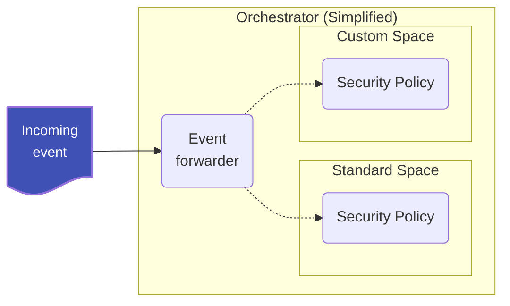

To understand how the engine is structured, it is important to identify the key components involved in this process.

The **orchestrator** is the central runtime component that manages active security policies. When a new event arrives,
the orchestrator forwards an independent copy of it to each active policy for processing. Because each policy receives
its own copy of the raw event, a single incoming event can produce multiple output documents — one per active policy.

Wazuh ships with a built-in **standard** policy that covers all supported log sources and integrations. Users can
additionally define a **custom** policy to extend or adapt the processing pipeline for their specific needs.

Each event travels through the following ordered stages inside a policy:

1. **Pre-filter** *(optional)*: Evaluated before decoding. If configured, events that do not satisfy the filter
   conditions are discarded immediately, avoiding unnecessary decoding work. If no pre-filter is configured,
   all events proceed to the decoding stage unconditionally.
2. **Decoders**: Normalize and extract fields from the raw event, mapping them to the [Wazuh Common Schema](#).
   This stage is mandatory — every event must traverse the decoder tree.
3. **Enrichment** *(optional)*: Plugins that augment the normalized event with additional context after decoding.
   Built-in plugins include GeoIP geolocation and Indicator of Compromise (IOC) matching. Enrichment can be
   fully disabled at the policy level; when disabled, the normalized event is passed directly to the next stage.
4. **Post-filter** *(optional)*: Evaluated after enrichment (or after decoding if enrichment is disabled).
   If configured, events that do not satisfy the filter conditions are discarded before reaching the outputs.
   If no post-filter is configured, all events are forwarded unconditionally.
5. **Outputs**: Send the final processed events to configured destinations, such as `wazuh-indexer` or other
   downstream components.


### Event
The purpose of the Engine is to convert unstructured or semi-structured logs into normalized and enriched events.
The agent transmits the logs to `wazuh-manager-remoted` in plain text; `remoted` adds information about the agent, 
including additional metadata such as operating system information, the log source, and other relevant details.
The Engine processes these logs and generates a structured JSON event, incorporating all relevant information in 
accordance with the defined wazuh [schema](#).

Event collected on agent:

```log
{"version":"1.100000","account_id":"123456789023","region":"us-east-1","vpc_id":"vpc-0000000","query_timestamp":"2025-12-11T22:22:22Z","query_name":"amazonlinux-2-repos-us-east-1.s3.dualstack.us-east-1.amazonaws.com.","query_type":"AAAA","query_class":"IN","rcode":"NOERROR","answers":[{"Rdata":"s3-r-w.dualstack.us-east-1.amazonaws.com.","Type":"CNAME","Class":"IN"},{"Rdata":"2a02:cf40:add:4444:9191:a9a9:aaaa:cccc","Type":"AAAA","Class":"IN"}],"srcaddr":"8.8.8.8","srcport":"8010","transport":"UDP","srcids":{}}
```

Input event example:
```json
{
  "wazuh": {
    "protocol": {
      "queue": 49,
      "location": "/var/ossec/logs/active-responses.log"
    },
    "agent": {
      "host": {
        "os": {
          "name": "Rocky Linux",
          "version": "8.10",
          "platform": "rocky",
          "type": "linux"
        },
        "architecture": "x86_64",
        "hostname": "wazuh-agent-50-rocky8"
      },
      "id": "002",
      "name": "wazuh-agent-50-rocky8",
      "version": "v5.0.0",
      "groups": [
        "default"
      ]
    },
    "cluster": {
      "name": "wazuh",
      "node": "node01"
    }
  },
  "event": {
    "original": "{\"version\":\"1.100000\",\"account_id\":\"123456789023\",\"region\":\"us-east-1\",\"vpc_id\":\"vpc-0000000\",\"query_timestamp\":\"2025-12-11T22:22:22Z\",\"query_name\":\"amazonlinux-2-repos-us-east-1.s3.dualstack.us-east-1.amazonaws.com.\",\"query_type\":\"AAAA\",\"query_class\":\"IN\",\"rcode\":\"NOERROR\",\"answers\":[{\"Rdata\":\"s3-r-w.dualstack.us-east-1.amazonaws.com.\",\"Type\":\"CNAME\",\"Class\":\"IN\"},{\"Rdata\":\"2a02:cf40:add:4444:9191:a9a9:aaaa:cccc\",\"Type\":\"AAAA\",\"Class\":\"IN\"}],\"srcaddr\":\"8.8.8.8\",\"srcport\":\"8010\",\"transport\":\"UDP\",\"srcids\":{}}",
  }
}

```

Processed event:
```json
{
  "wazuh": {
    "protocol": {
      "queue": 49,
      "location": "/var/ossec/logs/active-responses.log"
    },
    "agent": {
      "host": {
        "os": {
          "name": "Rocky Linux",
          "version": "8.10",
          "platform": "rocky",
          "type": "linux"
        },
        "architecture": "x86_64",
        "hostname": "wazuh-agent-50-rocky8"
      },
      "id": "002",
      "name": "wazuh-agent-50-rocky8",
      "version": "v5.0.0",
      "groups": [
        "default"
      ]
    },
    "cluster": {
      "name": "wazuh",
      "node": "node01"
    },
    "integration": {
      "category": "cloud-services",
      "name": "aws",
      "decoders": [
        "decoder/core-wazuh-message/0",
        "decoder/aws-route53-resolver-logs/0"
      ]
    },
    "space": {
      "name": "standard"
    }
  },
  "event": {
    "original": "{\"version\":\"1.100000\",\"account_id\":\"123456789023\",\"region\":\"us-east-1\",\"vpc_id\":\"vpc-0000000\",\"query_timestamp\":\"2025-12-11T22:22:22Z\",\"query_name\":\"amazonlinux-2-repos-us-east-1.s3.dualstack.us-east-1.amazonaws.com.\",\"query_type\":\"AAAA\",\"query_class\":\"IN\",\"rcode\":\"NOERROR\",\"answers\":[{\"Rdata\":\"s3-r-w.dualstack.us-east-1.amazonaws.com.\",\"Type\":\"CNAME\",\"Class\":\"IN\"},{\"Rdata\":\"2a02:cf40:add:4444:9191:a9a9:aaaa:cccc\",\"Type\":\"AAAA\",\"Class\":\"IN\"}],\"srcaddr\":\"8.8.8.8\",\"srcport\":\"8010\",\"transport\":\"UDP\",\"srcids\":{}}",
    "kind": "event",
    "action": "dns-query",
    "category": [
      "network"
    ],
    "start": "2021-12-11T22:46:26.000Z",
    "type": [
      "protocol"
    ],
    "outcome": "success"
  },
  "@timestamp": "2026-04-14T19:29:51.105Z",
  "cloud": {
    "provider": "aws",
    "account": {
      "id": "123456789023"
    },
    "region": "us-east-1"
  },
  "dns": {
    "question": {
      "name": "amazonlinux-2-repos-us-east-1.s3.dualstack.us-east-1.amazonaws.com.",
      "class": "IN",
      "type": "AAAA"
    },
    "response_code": "NOERROR",
    "answers": [
      {
        "data": "s3-r-w.dualstack.us-east-1.amazonaws.com.",
        "type": "CNAME",
        "class": "IN"
      },
      {
        "Rdata": "2a02:cf40:add:4444:9191:a9a9:aaaa:cccc",
        "Type": "AAAA",
        "Class": "IN"
      }
    ]
  },
  "network": {
    "transport": "udp",
    "protocol": "dns",
    "type": "IPv4"
  },
  "source": {
    "address": "8.8.8.8",
    "ip": "8.8.8.8",
    "port": 8010,
    "as": {
      "number": 55990,
      "organization": {
        "name": "Huawei Cloud Service data center"
      }
    },
    "geo": {
      "city_name": "Shanghai",
      "continent_code": "AS",
      "continent_name": "Asia",
      "country_iso_code": "CN",
      "country_name": "China",
      "location": {
        "lat": 31.2222,
        "lon": 121.4581
      },
      "timezone": "Asia/Shanghai",
      "region_iso_code": "SH",
      "region_name": "Shanghai"
    }
  },
  "related": {
    "ip": [
      "8.8.8.8"
    ],
    "hosts": [
      "amazonlinux-2-repos-us-east-1.s3.dualstack.us-east-1.amazonaws.com."
    ]
  },
  "threat": {
    "enrichments": [
      {
        "indicator": {
          "confidence": 100,
          "feed": {
            "name": "dyingbreeds_"
          },
          "first_seen": "2026-01-13T00:35:01.000Z",
          "id": "1718594",
          "last_seen": "2026-01-13T00:35:01.000Z",
          "name": "8.8.8.8:8010",
          "provider": "threat-fox",
          "software": {
            "alias": [
              "Unknown malware"
            ],
            "name": "unknown",
            "type": "botnet_cc"
          },
          "tags": [
            "AS55990",
            "Botnet",
            "byob",
            "C2",
            "censys"
          ],
          "type": "connection"
        },
        "matched": {
          "field": "source.ip, source.port"
        }
      }
    ]
  }
}

```

### Policy processing

The policy is the operational graph applied to each event. It defines an ordered pipeline of stages:
pre-filtering, decoding, enrichment, post-filtering, and output delivery. Not all stages are mandatory:
pre-filter, enrichment, and post-filter are **optional** and may be omitted or disabled depending on
the policy configuration. The following diagram shows the full pipeline when all stages are active;
optional stages are highlighted in yellow.


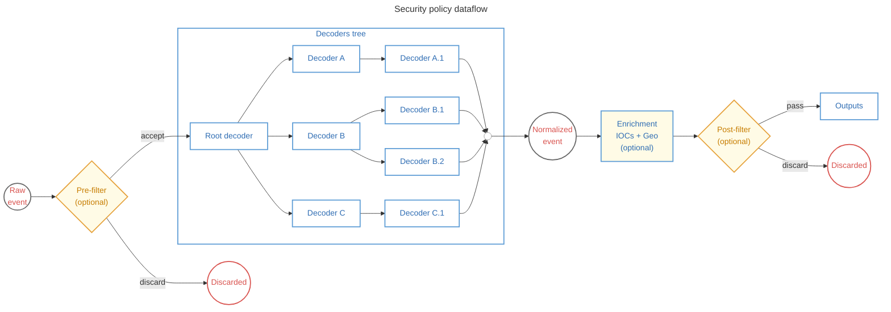

Wazuh ships with a predefined **standard** policy that covers all supported log sources and enables all its
components to work out of the box. It includes pre-configured decoders, enrichments, and outputs for every
Wazuh-supported integration.

Each log source has its own format and transport specifics. The standard policy encapsulates those details,
allowing users to focus on their own integrations and rules without dealing with the underlying log transport
mechanics for each source. Optional stages such as pre-filters, enrichment, and post-filters can be enabled
or disabled per policy depending on the use case.


### Decoding process
The decoding process converts the unstructured or semi-structured raw event received by the engine into a
schema-based JSON document aligned with the Wazuh Common Schema.

All events enter the decoder stage through the **root decoder**, which acts as the entry point of the decoder
tree. The root decoder evaluates the event and, upon matching, passes it down to the appropriate child decoders
for progressively more specialized processing. Each decoder in the tree applies its own field mappings and
transformations; if an event does not match a decoder's conditions, the next sibling decoder at the same level
is tried instead. This continues until no further applicable decoder is found.

A closer examination of the predefined decoders reveals the following structure:


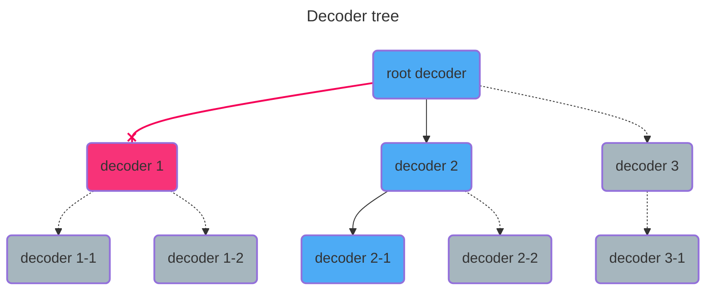

When a decoder evaluates an event, it checks whether the event satisfies its match conditions. If the conditions
are not met, the event is passed to the next sibling decoder in the same hierarchy. This continues until a
decoder accepts the event or no more sibling decoders remain at that level — in which case the event is
considered fully decoded by that branch.

Once a decoder accepts an event, it applies its transformations: normalizing fields, extracting values, or
mapping data to schema fields. The transformed event is then forwarded to that decoder's child decoders for
additional, more specialized processing. Each child decoder follows the same evaluation logic, making the
overall process both hierarchical and iterative.

This tree-based evaluation ensures that events are efficiently routed to the most specific applicable decoder
based on their structure and content, without requiring explicit routing rules.


### Security enrichment process

The security enrichment process is divided into two consecutive stages in the policy pipeline:

1. **Pre-enrichment**
2. **Enrichment**

The pre-enrichment stage performs preliminary event adjustments and filtering before the enrichment stage is executed. After that, the enrichment stage applies the enrichments configured in the policy, such as geo/ASN or IOC enrichments.

This section focuses exclusively on these two stages.

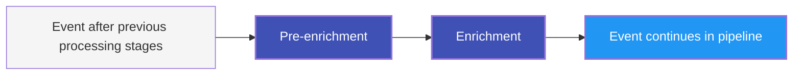

#### Pre-enrichment

The pre-enrichment stage prepares the event before the configured enrichments are evaluated.

Its purpose is to apply preliminary event adjustments and enforce filtering decisions that must be resolved before enrichment begins. In practice, this stage is responsible for preparing the event context and ensuring that events that should not continue do not reach the enrichment stage.

In the current implementation, the pre-enrichment stage includes:

- **Space enrichment**
- **Discarded events filter**
- **Cleanup of decoder temporary variables**

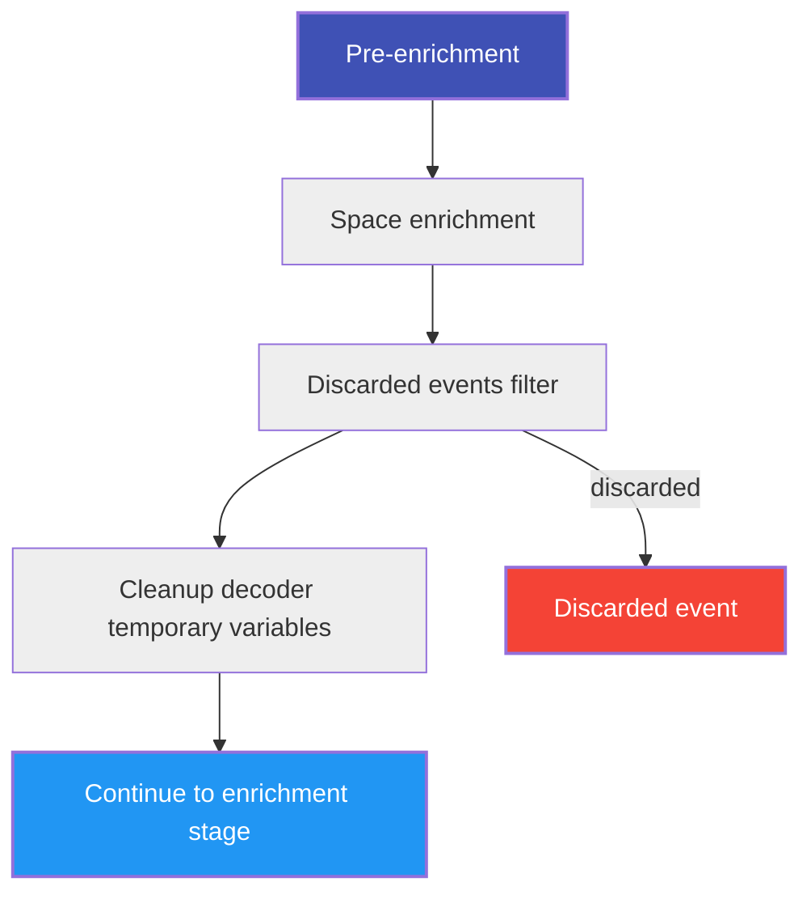

##### Space enrichment

The first pre-enrichment operation maps the policy space into the event.

Its purpose is to annotate the event with the space from which the policy is being executed. This allows the event to carry the policy space context as part of its own data before enrichment is applied.

Conceptually:

```json
{
  "wazuh": {
    "space": {
      "name": "standard|custom"
    }
  }
}
```

##### Discarded events filter

The discarded events filter evaluates whether discarded events should continue in the pipeline.

This behavior depends on the policy configuration:

- If discarded events indexing is enabled, the event continues even if it was marked as discarded.
- If discarded events indexing is disabled and the event is marked as discarded, the event is rejected and the pipeline stops.
- Otherwise, the event continues normally.

This makes the discarded-events decision part of pre-enrichment, before any configured enrichment is evaluated.

> [!NOTE]
> See the [helper functions reference](ref-helper-functions.md#discard_events) for the condition used to determine whether discarded events should continue in the pipeline.

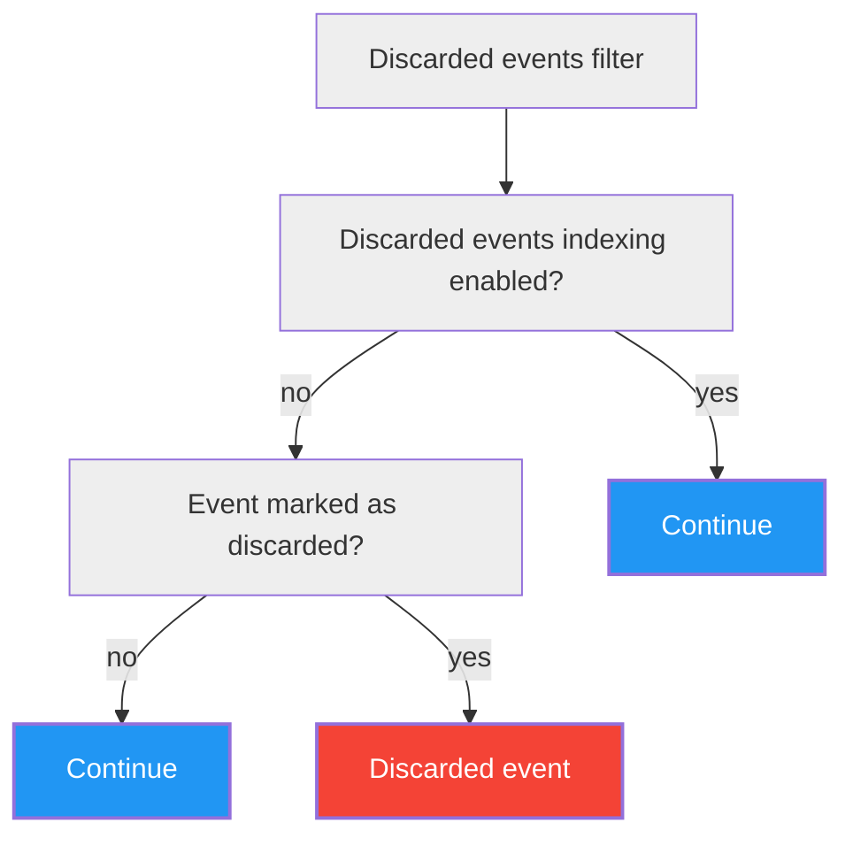

##### Cleanup of decoder temporary variables

Decoders can only map fields that belong to the **Wazuh Common Schema (WCS)** or to **temporary variables**.
Temporary variables are fields whose names start with `_` (e.g., `_raw_message`, `_parsed_ts`). They provide
a scratch space that decoders can write to and read from as an event travels through the decoder tree, enabling
intermediate values to be shared across decoders during processing.

Once the decoding stage is complete, temporary variables have served their purpose and must be removed. This
cleanup step is **mandatory** and always runs at the end of pre-enrichment — it is not configurable by the user.

After cleanup, every field present in the event is guaranteed to belong to the WCS. This invariant is what
allows the event to be correctly indexed in the Wazuh Indexer, since only schema-conformant fields are accepted.

#### Enrichment

After pre-enrichment, the event enters the enrichment stage.

The enrichments to be applied are defined in the policy document as an array. Each configured enrichment is evaluated in sequence as part of the event processing flow.

Typical enrichments include:

- **Geo enrichment**
- **IOC enrichment**

Unlike pre-enrichment, the enrichment stage does not decide whether the event should continue in the pipeline. Its purpose is to add context to the event when applicable.


##### Enrichment source definitions generated during installation

During installation, the Engine generates enrichment source definition files for both **geo/ASN** and **IOC** enrichment.

These files define which event fields will be observed at runtime to decide whether enrichment should be applied. They are generated automatically based on predefined rules that indicate which fields from the **Wazuh Common Schema (WCS)** should be observed for each type of enrichment.

This means the set of fields inspected by enrichment is not decided dynamically for every event. Instead, it is determined beforehand through these generated definitions, which ensures a controlled and consistent enrichment process.

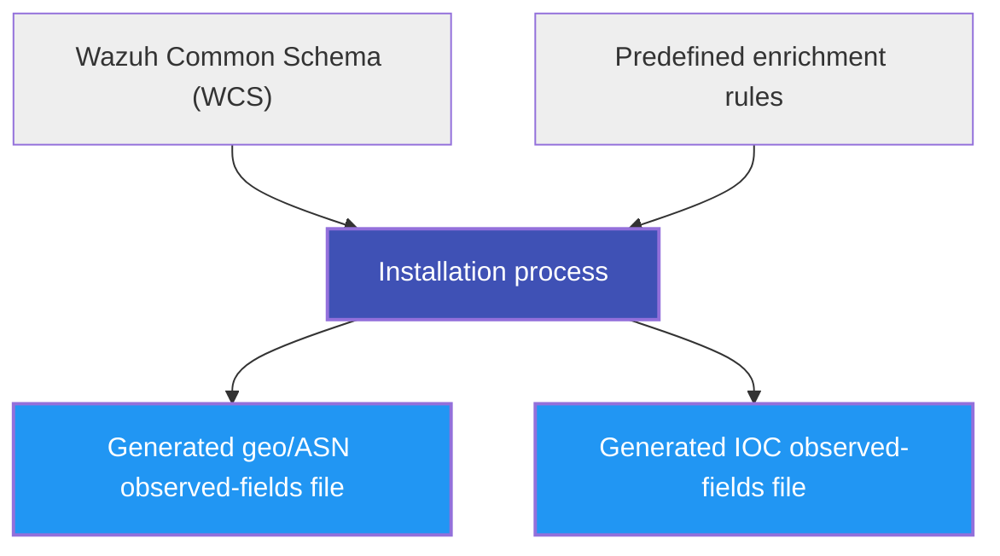

##### Geo enrichment

Geo enrichment evaluates the event fields defined for geo/ASN observation and, when applicable, adds location and autonomous system context to the event.

The fields observed for this enrichment are determined from the generated geo enrichment definitions based on the WCS. These typically include fields that may contain IP addresses relevant for enrichment.

When a valid source value is found, geo enrichment may add information such as:

- geographic location data
- country or city data
- ASN number
- ASN organization

Conceptually:

```json
{
  "source": {
    "ip": "8.8.8.8",
    "geo": {
      "country_name": "United States",
      "location": {
        "lat": 37.751,
        "lon": -97.822
      }
    },
    "as": {
      "number": 15169,
      "organization": {
        "name": "Google LLC"
      }
    }
  }
}
```

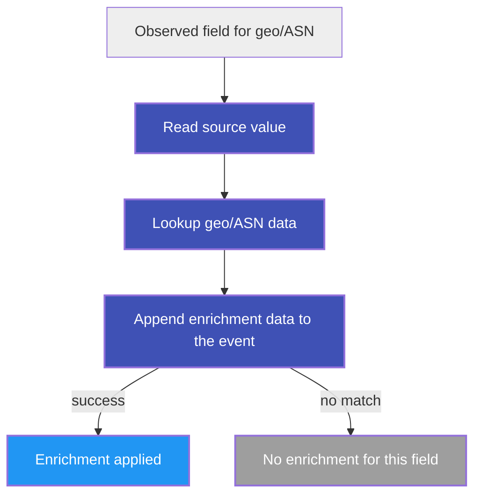

##### IOC enrichment

IOC enrichment evaluates the event fields defined for IOC observation and checks whether their values match known indicators of compromise.

The observed fields are determined from the generated IOC enrichment definitions based on the WCS and the predefined observation rules.

Depending on the observed field and the configured IOC types, this enrichment may evaluate values such as:

- connection-based indicators represented as `ip:port`
- domains
- URLs
- hashes
- other supported indicator values

In particular, network IOC matching is not limited to plain IP values. For connection-based enrichment, the observed value is built from the relevant event fields as a connection key, typically combining IP address and port.

If a match is found, the event is enriched with threat-related context associated with the matched indicator.

Conceptually:

```json
{
  "threat": {
    "indicator": {
      "type": "ipv4-addr",
      "ip": "203.0.113.10"
    },
    "enrichments": [
      {
        "matched": {
          "field": "destination.ip"
        }
      }
    ]
  }
}
```

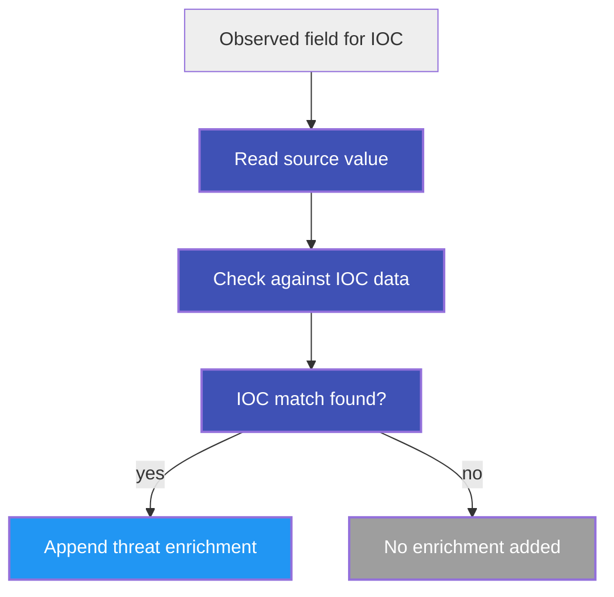


#### Relationship between pre-enrichment and enrichment

The two stages have different responsibilities:

- **Pre-enrichment** prepares and filters the event before enrichments are evaluated.
- **Enrichment** applies optional context providers such as geo and IOC.

The main behavioral difference is:

- **Pre-enrichment can stop the pipeline**
- **Enrichment does not decide pipeline continuity**

This makes pre-enrichment part of event control flow, while enrichment is dedicated to contextual data augmentation.

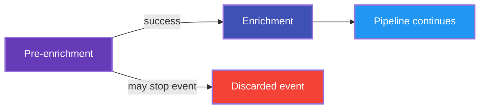

#### Summary

In the current processing model, the security enrichment process is composed of two distinct stages:

1. **Pre-enrichment**
   - maps the policy space into the event
   - filters discarded events according to policy configuration
   - removes decoder temporary variables when enabled
   - may stop the pipeline if filtering conditions require it

2. **Enrichment**
   - evaluates the enrichments listed in the policy document
   - relies on generated observed-fields definitions for geo/ASN and IOC enrichment
   - uses connection-based IOC values such as `ip:port` for network indicators
   - adds contextual information to the event when matches or lookups succeed
   - does not determine whether the pipeline continues

This design keeps event control decisions in pre-enrichment, leaves the enrichment stage dedicated to contextual event augmentation based on predefined WCS-driven observation rules, and handles unclassified-event routing later as part of output selection.


### Output process

Once an event has completed the full processing pipeline — decoding, optional enrichment, and optional post-filter —
it is forwarded to the **output stage**. Outputs are responsible for delivering the decoded event to one or more
configured destinations, such as the Wazuh Indexer or a local file.

Unlike decoders and enrichment assets, which are downloaded from the content distribution infrastructure,
**outputs are bundled with the `wazuh-manager` installation** and stored locally on the manager host. They do not
originate from the Wazuh Indexer.

#### Output directory structure

Outputs are stored under `/var/wazuh-manager/etc/outputs/` and organized by space name:

```
/var/wazuh-manager/etc/outputs/
├── default/                          # Fallback outputs, applied to all spaces unless overridden
│   ├── indexer.yml                   # Sends decoded events to the Wazuh Indexer (enabled)
│   └── file-output-integrations.yml  # Writes decoded events to a local file (disabled)
├── standard/                         # (Optional) Outputs specific to the standard space
└── custom/                           # (Optional) Outputs specific to the custom space
```

When building the output stage for a given security policy, the engine looks for a folder whose name matches the
policy's space (e.g., `standard` or `custom`). If that folder exists, only its outputs are loaded for that policy.
If no space-specific folder is found, the engine falls back to `default/`, ensuring every policy has a working
set of outputs from the start.

#### Default outputs

The two outputs included in the default installation are:

| File | Description | Default state |
|------|-------------|---------------|
| `indexer.yml` | Forwards decoded events to the configured `wazuh-indexer` | Enabled |
| `file-output-integrations.yml` | Writes decoded events to a local file on the manager | Disabled |

The output stage operates as a broadcaster: the decoded event is dispatched independently to every active output,
allowing multiple destinations to receive the same processed event:

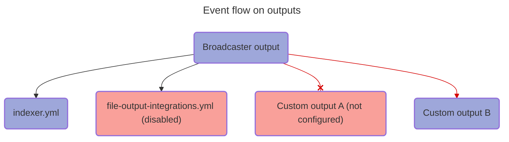

> [!WARNING]
> The output files in `default/` are **replaced on every installation or update** of `wazuh-manager`.
> Modifications to those files will be overwritten. To preserve custom outputs across updates, place
> them in a space-specific folder (`standard/` or `custom/`) instead of `default/`.

#### Unclassified events

An event is considered **unclassified** when it was only processed by the root decoder and no other decoder
accepted it. This happens because the root decoder typically has no `check` stage — it accepts every event
unconditionally, acting solely as the entry point of the decoder tree. When no child decoder matches the event,
the root decoder remains the only one that has processed it.

The engine tracks which decoders accepted each event by recording their names in the
`wazuh.integration.decoders` array field. An event is therefore identified as unclassified when that array
contains exactly one element (only the root decoder).

The `indexer.yml` output uses the [`index_unclassified_events`](ref-helper-functions.md#index_unclassified_events)
helper to apply this check and route the event accordingly:

```yaml
# Excerpt from indexer.yml
outputs:
  - first_of:
    - check: index_unclassified_events($wazuh.integration.decoders)
      then:
        - wazuh-indexer:
            index: "wazuh-events-v5-unclassified"

    - check: NOT array_length_eq($wazuh.integration.decoders, 1)
      then:
        - wazuh-indexer:
            index: "wazuh-events-v5-${wazuh.integration.category}"
```

The routing logic evaluates two conditions in order:

1. If `index_unclassified_events` returns `true` — meaning the policy has unclassified-events indexing enabled
   **and** `wazuh.integration.decoders` contains exactly one entry — the event is sent to
   `wazuh-events-v5-unclassified`.
2. Otherwise, if the decoder array has more than one entry, the event is classified and sent to the
   data stream corresponding to its integration category: `wazuh-events-v5-${wazuh.integration.category}`.

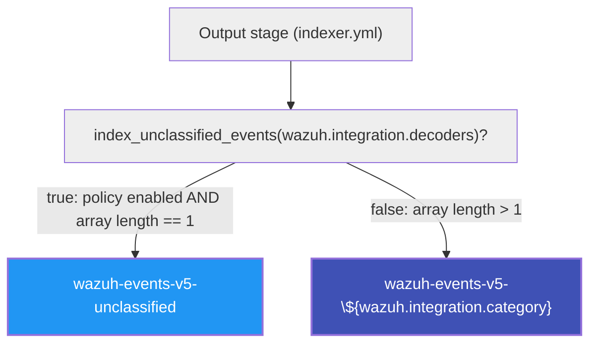


## Schema

A schema defines a structured format for data, ensuring consistency, interoperability, and efficient querying. It establishes a common set of field names, data types, and relationships that standardize log and event data across different sources.

The Engine ensures that all operations—parsing, normalization, and enrichment—aim to transform unstructured data into structured data that adheres to the schema. This structured approach enhances data integrity, improves search performance, and enables seamless correlation across multiple data sources.

- Consistency: Standardized field names prevent discrepancies when integrating data from different sources.
- Interoperability: Facilitates integration with various tools and analytics platforms.
- Rule Creation: Enables users to write rules based on a predictable data structure.
- Efficient Querying: Optimizes indexing and search performance.
- Data Enrichment: Enables meaningful correlations by aligning logs with predefined categories (e.g., network, process, user activity).

For example, a network event log structured according to the schema might look like this:
```json
{
  "event": {
    "category": "network",
    "type": "connection",
    "action": "network_connection"
  },
  "source": {
    "ip": "192.168.1.10",
    "port": 443
  },
  "destination": {
    "ip": "10.0.0.5",
    "port": 8080
  },
  "user": {
    "name": "admin"
  }
}
```

### Configuration
The schema configuration for the engine follows a structured format where each field is defined.
It's called the Wazuh Common Schema (WCS) and it's fetched (synched) from the wazuh indexer repository
([original yaml source](https://raw.githubusercontent.com/wazuh/wazuh-indexer-plugins/refs/heads/main/wcs/stateless/events/main/docs/wcs_flat.yml)).
It's not inteded to be modified by the user and it consists of a JSON object with the following key elements:

- Fields Definition:
  - The fields object contains a list of field names as keys.
  - Each field has a corresponding object defining his type.
    - `type`: Specifies the wazuh indexer field type, such as date, keyword, text, integer, etc.

```json
{
  "name": "schema/engine-schema/0",
  "fields": {
    "@timestamp": {
      "type": "date"
    },
    "agent.build.original": {
      "type": "keyword"
    },
    "agent.ephemeral_id": {
      "type": "keyword"
    },
    "agent.groups": {
      "type": "keyword"
    },
    "agent.id": {
      "type": "keyword"
    },
    "agent.name": {
      "type": "keyword"
    }
  }
}
```

### Implications
- Operational Graph and Consistency Enforcement
  - The schema is used during the construction of the operational graph to ensure that all operations are valid based on the defined field types.
  - Whenever possible, schema validation is performed at build time to prevent misconfigurations before execution.
  - If an operation's consistency cannot be fully validated at build time, additional runtime checks are applied to ensure adherence to the schema.
- Consistency and Normalization in Dashboards
  - The schema ensures that data displayed in dashboards follows a consistent structure.
  - This enables seamless aggregation, filtering, and visualization by maintaining a predictable and normalized data format.

## Content Management: Managing the Engine's processing

Although the Engine stores all assets and policy configurations locally for runtime execution, **the source of truth
for all content management resides in the Wazuh Indexer**. Creating custom decoders and integrations, enabling or
disabling them, and modifying policy-related settings are all actions performed through the Wazuh Indexer — not
directly on the Engine.

Before building the operational graph, the Engine must ensure that its local state reflects the latest configuration
available in the Wazuh Indexer. This is achieved through **CMSync**, an internal submodule of the Engine responsible
for periodically pulling content from the Wazuh Indexer and applying any detected changes to the Engine's local store.

### Synchronization process

CMSync synchronizes content independently for each space — **Standard** and **Custom** — following the same
two-step process for each:

1. **Hash comparison**: CMSync retrieves the content hash stored in the Wazuh Indexer for the space and compares
   it against the locally stored hash. This check is lightweight and allows CMSync to determine quickly whether
   the space content has changed at all.
2. **Content fetch**: If the hashes differ, CMSync downloads the full content for that space from the Wazuh
   Indexer and applies it to the Engine's local store. The Engine then rebuilds the affected operational graphs.

The content synchronized per space includes:

- **Policy configuration** — List of integration (order by priority of evaluation) and policy-level settings
- **Integrations** — integration manifests grouping the assets for each log source
- **Decoders** — normalization and field-extraction assets
- **Filters** — pre-filter and post-filter assets
- **KVDBs** — key-value databases used by decoders and filters during event processing

> [!NOTE]
> **IOC and geo/ASN databases are not part of this synchronization.** They are shared across all spaces and
> are managed by a dedicated synchronization system independent of the per-space content sync described above.

### Spaces

Spaces are a concept that originates in the **Wazuh Indexer**, where content is organized and stored under
named spaces. The Engine mirrors this structure: when CMSync pulls content from the Wazuh Indexer, assets are
kept separated by the same space they belong to in the indexer. The Engine's space separation is therefore a
direct reflection of the Wazuh Indexer's organization, not an independent concept.

The two spaces are:

- **Standard** — Contains the default integrations curated and maintained by Wazuh CTI. The Wazuh Indexer
  is responsible for downloading and hosting this content from the CTI feed; the Engine never communicates
  with CTI directly. CMSync synchronizes the Engine's local copy from the Wazuh Indexer.
- **Custom** — An independent space for user-defined or user-modified content. Users manage this space
  through the Wazuh Indexer, and CMSync propagates any changes to the Engine.

On a fresh start, the Engine triggers an initial synchronization to pull both spaces from the Wazuh Indexer,
ensuring all assets are available before building policies and defining routes. After this initial load,
subsequent synchronization cycles run periodically to keep the local state up to date.

When both spaces are available and synchronized, the Engine processes all incoming events through each active
operational graph.

## Assets

In the Wazuh Engine, assets represent the fundamental components of security policies and are the smallest unit within such a policy.

Each asset is organized into various stages that dictate operational procedures when processing an event.
These stages provide a structured and semantically meaningful sequence of operations, enhancing the engine's capability
to execute these operations efficiently based on predefined execution strategies.

Do not confuse stages with attributes, which are configuration details and metadata about the asset.


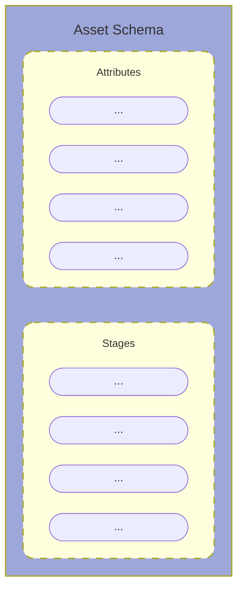

### Attributes

Attributes are configuration details and metadata about the asset. Every asset shares the following common attributes:

- **`name`**: Uniquely identifies the asset using the pattern `<asset_type>/<name>/<version>` (e.g. `decoder/aws-cloudtrail/0`).
- **`id`**: A UUIDv4 string that uniquely identifies the asset across the system.
- **`enabled`**: Boolean flag. Disabled assets are ignored when building the policy operational graph.
- **`metadata`**: Descriptive information about the asset. Common sub-fields include `module`, `title`, `description`, `compatibility`, `versions`, `author`, and `references`. The exact required sub-fields depend on the asset type.
- **`parents`**: Lists the parent asset names that define the asset's position in the asset graph. The traversal behavior depends on the asset type.
- **`definitions`**: Build-time typed macros. Each definition is a named value substituted wherever it is referenced in the asset document.

Filters have one additional attribute:

- **`type`** *(filters only)*: Determines at which point in the policy pipeline the filter is evaluated. Accepted values are `pre-filter` (evaluated before decoding) and `post-filter` (evaluated after enrichment).

### Stages
The stages define the operation chain and flow the asset performs on events. Each stage is executed in the order of definition:


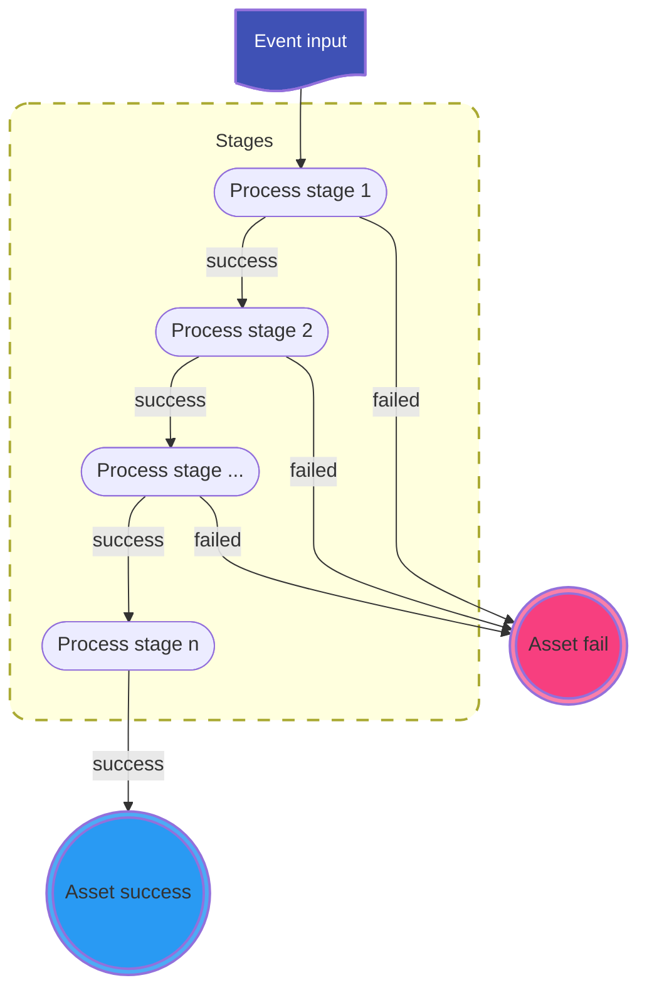

When a stage is executed, it can either fail or succeed. Each stage is executed sequentially only if the previous one succeeded. If any stage fails, the asset is considered to have failed for that event.

The available stages are:

---

**`check`** — Evaluates a condition against the event without modifying it. The asset fails if the condition is not satisfied. Accepts either:
- A **conditional expression** string using `$field` references, helper calls, and logical/comparison operators (`AND`, `OR`, `NOT`, `==`, `!=`, etc.)
- A **checklist**: an ordered array of single-pair objects `{field: condition}`, where all conditions must pass in order.

*Available in*: decoders (top-level), filters, and inside `normalize` blocks.

---

**`parse|<field>`** — Parses the value of `<field>` using an ordered list of parser expressions (e.g. logpar patterns). Expressions are tried in order; the stage succeeds as soon as one matches and the parsed values are written to the event. If no expression matches, the stage fails and the asset fails.

The key syntax is `parse|<source_field>: [<expr1>, <expr2>, ...]`.

*Available in*: decoders (top-level and inside `normalize` blocks).

---

**`normalize`** — An ordered array of normalization blocks. Each block is an independent unit that can contain any combination of the following sub-stages:

- **`check`** *(optional)*: Condition for the block. If it fails, the block is skipped; the asset does not fail.
- **`parse|<field>`** *(optional)*: Parse step within the block.
- **`map`** *(optional)*: Array of field assignments in the form `{target_field: value_or_expression}`. Maps and transforms values into the event.

*Available in*: decoders.

---

**`outputs`** — An array of output operations that deliver the event to external destinations. Each element in the array can be:
- A **direct output operation** (e.g. `wazuh-indexer:`, `file:`), executed unconditionally.
- A **`first_of`** block: an ordered list of branches, each with an optional `check` condition and a `then` list of output operations. The first branch whose `check` passes executes its `then` and the remaining branches are skipped.

Cannot modify the event.

*Available in*: outputs.

### Asset types

The type of asset determines which stages are allowed. The following table summarises the stages available per asset type:

| Asset Type | Top-level stages | Notes |
|------------|-----------------|-------|
| Decoders | `check`, `parse\|<field>`, `normalize` | `normalize` blocks may contain `check`, `parse\|<field>`, and `map` sub-stages |
| Outputs | `outputs` | `outputs` array entries can be direct operations or `first_of` blocks with `check` + `then` |
| Filters | `check` | The `type` attribute (`pre-filter`/`post-filter`) controls pipeline position |

### Operations
Operations are the fundamental units within the operation graph. Each operation can succeed or fail, forming the basis for defining the graph by combining operations based on their execution results.

Operations are always defined as:
```yaml
target_field: operation
```

Where the operation can be:
- **Literal Value**: A direct check or map operation depending on the stage it is defined. This can be any of the YAML native values (string, number, boolean, etc.).
- **Reference**: Denoted by $field_name, it performs a direct check or map operation using the referenced value.
- **Helper Function**: Denoted by helper_name(args), it performs a check or map operation depending on the called helper.

When building an asset, the process can fail if there is any operation that contains a:
- **Syntax Error**: Errors in the target_field or operation syntax.
- **Schema Validation Failure**: Errors such as mapping a boolean into a keyword field, which violates the schema validation rules.
- **Semantic Error**: Incorrect usage, such as using a conditional helper in a map stage.
These errors will be notified when trying to upload the asset to the catalog.

### Execution Graph Summary

A policy is composed of subgraphs, one per asset type. The current asset types that form the pipeline are:

- **Decoders**
- **Outputs**

Every event traverses each subgraph in order. Each subgraph is built from assets connected by parent relationships, forming a tree.

The traversal rules per subgraph are:

- **Decoders**: If the current decoder accepts the event (all its stages pass), the event is forwarded to its child decoders for further processing. If it fails, the engine tries the next sibling decoder under the same parent (children are evaluated as logical OR — only the first matching branch is followed).
- **Outputs**: The event is broadcast to all active output assets simultaneously.

An asset is considered to have **accepted** the event when all its conditional stages (`check`, `parse|<field>`) succeed. Transformational stages (`map` inside `normalize`) do not affect acceptance — a failure in a `map` operation does not cause the asset to reject the event.

A stage succeeds if the logical combination of its operations succeeds. The exact combination logic is determined by the stage itself. This ensures that each stage can apply its own logic to decide whether it has successfully processed an event.

<workflow_placeholder>

### Helper functions
Implement all the high level operations available to the user when developing the ruleset. Each function defines its signature, its mode of operation and its error management. Users cannot change the behavior of a helper function, and cannot combine two functions into a single expression.

There are two intrinsic operations which do not require additional syntax:
- Comparison of values or references inside a check stage.
- Value or reference assignment inside a map stage.

All other operations are accessed through the helper functions.

The syntax for calling a helper function is `helper_name(args…)`. They can be used in both check operations and map operations. Helper functions are classified into three categories:
- **Conditionals**: Used in check operations to test complex conditions.
- **Transformational**: Used in map operations to transform data.
- **Mapping**: A subset of transformational operations scoped to modifying only the target field.

Check the [helper standard library](ref-helper-functions.md) for a complete list of available helper functions.

#### Condition Helpers
When using conditional helpers, the syntax is:
```yaml
target_field: condition_helper(args)
```

The helper will always test a condition on *target_field*. If the condition passes, the operation succeeds; otherwise, it fails.

#### Mapping Helpers
When using mapping helpers, the syntax is:
```yaml
target_field: map_helper(args)
```

The helper will always map the *target_field* if the operation succeeds. If the operation fails, the *target_field* remains unchanged.

#### Transform Helpers
When using transformational helpers, the syntax is:
```yaml
target_field: transform_helper(args)
```

The helper will transform the *target_field* if the operation succeeds. If the operation fails, the *target_field* remains unchanged.

A transformational helper may fail due to implicit conditions, such as expecting a specific type for the target field, missing a reference passed as an argument, etc.

***It is important to understand that every operation can succeed or fail, and this is the foundation for defining the operation graph.***

#### Parsing rules
When using a helper function in a map or check operation:
```yaml
target.field: helper_name(args…)
```

The arguments for `helper_name` can be references to other fields, or JSON values (string, number, boolean, array, or object). Multiple arguments should be separated by commas.

When the helper function is built, arguments are parsed in the following order:
- **Quoted argument**: `'value'` starts and ends with a single quote. `\` and `'` can be escaped.
- **Reference**: `$reference` starts with `$`, followed by alphanumerics plus `#`, `_`, `@`, and `-`, separated by dots.
- **JSON value**: An attempt is made to parse the argument as JSON (any valid JSON type).
- **Raw string**: If none of the above apply, the argument is handled as a string value, with escapes allowed for `$`, `'`, `,`, `)`, `\`, and whitespace.

Invalid escape sequences will always fail.

For example:
```yaml
target.field: helper_name('string', $reference, 123, {"key": "value"})
```

This call applies `helper_name` to the `target.field` with arguments:
- `'string'`: A string value.
- `$reference`: A reference to another field.
- `123`: A numeric value (valid JSON).
- `{"key": "value"}`: A JSON object.


>[!NOTE]
> `123` is a valid json, not only the objects are valid jsons according to the JSON standard,
> but also the numbers, strings, booleans and null values are valid JSON values.

When parsing a helper function inside a logical check expression the same rules apply adding that at least one argument
is expected for the helper, specifying the target field:
```yaml
check: helper_name($target.field, args…)
```

Added we can specify comparison helpers as operators:
```yaml
check: $target.field <op> <value>
```

Where value is parsed as a single helper argument following the same escaping rules and order.

Where op is any of the following:
- `==`
- `!=`
- `<`
- `<=`
- `>`
- `>=`

When using any operator that is not the equality operator only string or integer values are allowed.

When using the default map or filter functions for string operations, values are parsed according to standard YAML
(or JSON) types. If a value is a string and begins with the reference symbol `$`, it is treated as a potential
reference. If the reference is invalid the operation building fails.
```yaml
check:
  - target.field: <yaml_type>|<$ref>
map:
  - target.field: <yaml_type>|<$ref>
```

Below are some usage examples:

```yaml
# Example 1: Simple equality check
check: http.method == "GET"

# Example 2: Comparison with an integer value
check: $event.severity > 3

# Example 3: Using a helper function in check
check: cidr_match($source.ip, "192.168.0.0", 24)

```


### Definitions
To facilitate the reuse of constructors when building large assets—such as parsing code for events with common headers or repeated constructs like IP/port definitions—definitions can be introduced at the specification level. For example:
```yaml
definitions:
  header: <timestamp> <host.hostname> <daemon>:
  source: <source.ip>:<source.port>
  destination: <destination.ip>:<destination.port>
  a-list:
    - item1: value1
    - item2: value2
```

These definitions can then be referenced elsewhere:
```yaml
parse|field:
    - <$header> from <$source> to <$destination> deny
```

This approach enables text reuse within an asset. Definitions are applied at build time through interpolation and do not function as runtime variables, i.e., cannot be modified once declared.

>[!NOTE]
> The definitions are typed, respecting JSON/YAML data types. For example, you can define a YAML object or a
> numeric value and use it as an argument for helper functions, not just strings for parsing.

#### Restrictions
- **Naming Conflicts**: Definitions cannot have the same name as a schema field. Doing so will result in a failure to build the asset.
- **Precedence**: Definitions take precedence over custom fields. If a definition exists with the same name as a custom field, all references to the field will be replaced by the definition's value.
- **Chaining Definitions**: Definitions can use other definitions in their values as long as they are defined beforehand.
- **Context**: Definitions can only appear on the right side of operations, meaning we can't define the structure of the document with definitions or be used inside non operational stages.
- **Scope**: Definitions are scoped to the asset where they are defined. They cannot be shared across assets.

#### Use Cases
- **Parsing Complex Logs**
  - Logs with extensive or structured headers can be broken into reusable definitions for clarity and to avoid redundancy.
  - **Example**: Defining reusable components (TYPE_FIELD, MSG_FIELD) for parsing various log formats.
- **Handling Large Value Lists**
  - When working with extensive arrays (e.g., banned IPs), definitions keep the configuration readable and maintainable.
  - **Example**: Using a predefined list of banned IPs to check against source IPs in a normalize stage.
- **Small Key-Value Databases (kvdbs)**
  - When small mappings are needed but don’t justify a full kvdb, definitions provide a lightweight alternative.
  - **Example**: Mapping log levels or event IDs to structured categories, types, and outcomes for normalization.

### Variables

Variables are temporary fields scoped to the current asset that is processing an event. They are identified by prefixing their name with an underscore `_`, following the standard field naming convention and supporting any operation just like fields.
```
_field.name
```

Key characteristics:
- Scoped to the current asset – Variables exist only within the asset processing the event and do not persist beyond it.
- Runtime Modifiable – Unlike definitions, which are static, variables can be modified during event processing.

### Log Parsing
Log parsing transforms raw log entries into structured data using parser expressions. These expressions serve as an alternative to Grok, eliminating the need for explicit type declarations by leveraging predefined schema-based parsing. Instead of regular expressions, they use specialized parsers for improved accuracy and efficiency.

Key Components:
- Literals: Direct character matches with escape rules for special characters.
- Fields: Extract structured data, including:
  - Schema fields (predefined in the schema)
  - Custom fields (user-defined, defaulting to text)
  - Optional fields (ignored if missing)
  - Field choices (choosing between multiple fields)
- Wildcards: Capture patterns without mapping data to fields.
- Optional Groups: Make subexpressions optional for flexible parsing.
- Schema Parsers: Automatically applied when a field of a known type is used, ensuring compatibility with Wazuh Indexer.

Example:
This expression captures an IP or hostname into `client.ip` or `client.address` and, if present, captures a port into `server.port`:

```yaml
parse|event.original:
  - "<client.ip>?<client.address> connected to <server.ip>(?:<server.port>)"
```

For a log entry:
```
192.168.1.10 connected to 10.0.0.5:443
```

It extracts:
```json
{
  "client.ip": "192.168.1.10",
  "server.ip": "10.0.0.5",
  "server.port": "443"
}
```

Parsers are also available as helper functions for use in map and check operations. For a detailed explanation, see the Parser Stage and Parser Helper Functions sections.

### Key Value Databases (KVDBs)

Key Value Databases (KVDBs) let the engine store reusable key-value maps that decoders and other assets can query through helper functions. They are intended for lookup data that changes independently from parsing logic, such as normalization tables, default field sets, or reference tables.

A KVDB is a named dictionary of entries where:

- each key is a string
- each value is a JSON value

This keeps large or frequently updated lookup data outside the decoder itself, making assets easier to maintain and reuse.

#### Common use cases

**Event enrichment and normalization**

Use a KVDB to store default values that should be merged into an event based on a code, type, or other field.

**Indicator matching**

Use a KVDB as a lookup set to check whether a field value is known, trusted, blocked, or suspicious.

**Reusable reference tables**

Use a KVDB to keep mappings such as status codes, protocol names, or bitmask tables that are shared by multiple assets.

#### KVDB structure

At a high level, helpers identify a KVDB by name and then resolve keys inside its `content` map.

For example:

```yaml
kvdbs:
  - id: b162e527-c155-43a3-8780-854350880f54
    metadata:
      title: example_kvdb
      description: description of the kvdb
    enabled: true
    content:
      key_1: value_1
      key_2: 123
      key_3: true
      key_4:
        nested_field: nested_value
      key_5:
        - item_1
        - item_2
```

In this example:

- the KVDB name is `example_kvdb`
- the lookup keys are `key_1`, `key_2`, `key_3`, `key_4`, and `key_5`
- each key stores a JSON value that can later be retrieved, matched, or merged by a helper

Additional descriptive metadata can be included when useful, but the important part for helper resolution is the KVDB name and its `content` entries.

#### Example: merge defaults into an event

This pattern is useful when the event already contains a code and you want to enrich it with default fields from the KVDB.

```yaml
normalize:
  - map:
      - event: kvdb_get_merge('event_defaults_by_code', $event.code)
```

If `event.code` is `http`, the value stored under `content.http` is merged into `event`.

#### Example: check whether a value exists in a KVDB

This pattern is useful for allowlists, blocklists, or IoC-style checks.

```yaml
check:
  - source.ip: kvdb_match('known_malicious_ips')
```

The check succeeds only if the current value of `source.ip` exists as a key in the KVDB.

#### Available helper functions

The KVDB helper reference includes functions for direct lookups, array lookups, merges, recursive merges, membership checks, and bitmask decoding:

- [`kvdb_get`](ref-helper-functions.md#kvdb_get)
- [`kvdb_get_array`](ref-helper-functions.md#kvdb_get_array)
- [`kvdb_get_merge`](ref-helper-functions.md#kvdb_get_merge)
- [`kvdb_get_merge_recursive`](ref-helper-functions.md#kvdb_get_merge_recursive)
- [`kvdb_match`](ref-helper-functions.md#kvdb_match)
- [`kvdb_not_match`](ref-helper-functions.md#kvdb_not_match)
- [`kvdb_decode_bitmask`](ref-helper-functions.md#kvdb_decode_bitmask)

Use this section as the conceptual overview of the asset itself, and refer to the helper reference for function-specific behavior and examples.

### Dates and Timestamps
Assets are capable of handling dates in various formats and time zones. This flexibility is achieved through configurable
parsers (refer to the [date parser documentation](ref-parser.html#date-parser) for more details).

Once a date is parsed, the Engine normalizes it to UTC. This ensures that all timestamps are stored and processed
homogeneously, maintaining consistency across event processing and dashboard visualization.

### Geolocation
Assets are capable of enriching events with geolocation information, enhancing event data with location-based context.
This is achieved by using [Maxmind - GeoLite databases](https://www.maxmind.com/), which provide location data based on
IP addresses. For more details, see the [geo location](ref-helper-functions.md#geoip) helper documentation.

The GeoLite databases are configured through the API, allowing you to specify the relevant databases to be used for
geolocation enrichment. For more information on how to configure these databases, refer to the API documentation.

### Decoders

Decoders are the first layer of assets that pass through the event when it is processed by a security policy. They are responsible for normalizing the event, transforming it into a structured event.

All events enter the pipeline through the root decoder, which selects the appropriate decoder to process the event. Each subsequent decoder processes the event as much as it can and then passes it to the next suitable decoder. This continues until no more decoders can process the event. A decoder can only select one next decoder from the available ones.


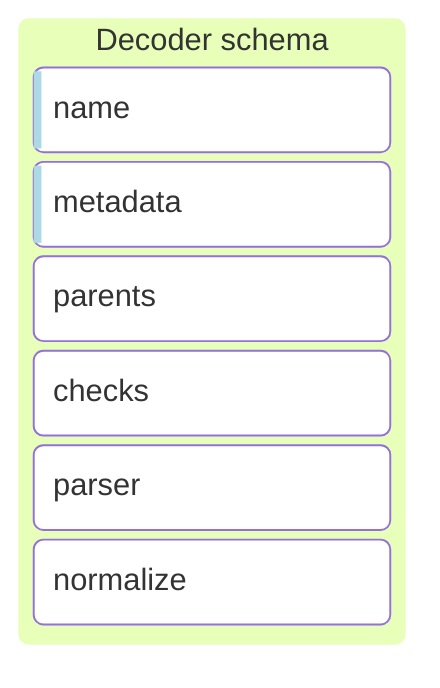

- **Name**: Identifies the decoder and follows the pattern `<asset_type>/<name>/<version>`. The name is unique and cannot
  be repeated. The naming convention for components is `<type>/<name>/<version>`. The component type is `decoder`, and
  the version must be 0, since versioning is not implemented:

- **Metadata**: Each decoder has metadata that provides information about the decoder, such as the supported products,
  versions, and formats. This metadata does not affect the processing stages.
    The metadata fields are:
    - `module` (string): The module that the decoder is associated with. I.e., `syslog`, `windows`, `apache`, etc.
    - `title` (string): The title of the decoder. I.e., `Windows Event Log Decoder`, `Linux audit system log decoder`, etc.
    - `description` (string): A brief description of the decoder.
    - `compatibility` (string): A description of the compatibility of the decoder with different products, versions, and formats.
      i.e `The Apache datasets were tested with Apache 2.4.12 and 2.4.46 and are expected to work with all versions >= 2.2.31 and >= 2.4.16 (independent from operating system)`
    - `version` (array): A list of versions for which the logs have been tested and supported. I.e., `2.2.x`, `3.x`, etc.
    - `author` (object): The author of the decoder, ie:
        ```yaml
        name: Wazuh, Inc.
        email: info@wazuh.com
        url: https://wazuh.com
        date: 2022-11-15
        ```
    - `reference` (array): A list of references to the documentation, i.e.:
      ```yaml
      - https://httpd.apache.org/docs/2.2/logs.html
      - https://httpd.apache.org/docs/2.4/logs.html
      ```

- **Parents**: Defines the order in the decoder graph, establishing the parent-child relationship between decoders.
  A decoder can have multiple parents, when an event is successfully processed in a decoder, it will evaluate the
  children, one by one, until it finds a decoder that successfully processes the event.

> [!IMPORTANT]
> There is no order of priority when evaluating the children, and it cannot be assumed that a sibling decoder will be evaluated before another one.

- **Checks**: The checks stage is a preliminary stage in the asset processing sequence, designed to assess whether an
  event meets specific conditions without modifying the event itself.
  More information on the checks stage can be found in the [Check section](#checkallow).


### Rules

Rules are the second layer of assets that process events in a security policy. They are responsible for analyzing the
normalized event, when the decoding stage is finished, to add context, security indicators, and threat intelligence.
Unlike decoders,  the rule cannot modify the decoded event, but it can add new certain fields to enrich the event, this
prevents the rules from being used to decode events.


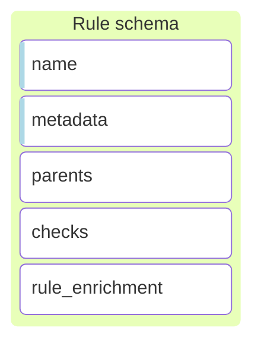

- **Name**: Identifies the rule and follows the pattern `<asset_type>/<name>/<version>`. The name is unique and cannot
  be repeated. The naming convention for components is `<type>/<name>/<version>`. The component type is `rule`, and
  the version must be 0, since versioning is not implemented:

- **Metadata**: Each rule has metadata that provides information about the rule, such as the supported products,
  versions, and formats. This metadata does not affect the processing stages.
    The metadata fields are:
    - `description` (string): A brief description of the rule.
    - `TODO: Add more fields when the metadata is defined.`

- **Parents**: Defines the order in the rule graph, establishing the parent-child relationship between rules, a rule can
  have multiple parents, when an event is successfully processed in a rule (rule matches), it will evaluate all the
  children. Unlike decoders, and all children will be evaluated.

- **Checks**: The checks stage is a preliminary stage in the asset processing sequence, designed to assess whether an
  event meets specific conditions. On the rules, the checks stage is used to evaluate the conditions that the event must
  meet to be considered a security event. More information on the checks stage can be found in the [Check section](#checkallow).

- **Rule Enrichment**: The rule enrichment stage is used to add context, security indicators, and threat intelligence to
  the normalized event. This stage is used to add new fields to the event, but it cannot modify the normalized event, it
  like the `map` stage, but with the restriction that it cannot modify the normalized event, only rule fields can be added.

### Outputs

Outputs are the last layer of assets that process events in a security policy. They are responsible for storing the
security events in a storage system, sending them to a wazuh-indexer, a file, or sending them to a third-party system.


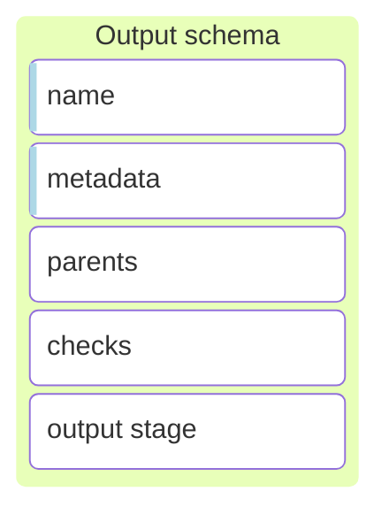
- **Name**: Identifies the output and follows the pattern `<asset_type>/<name>/<version>`. The name is unique and cannot
  be repeated. The naming convention for components is `<type>/<name>/<version>`. The component type is `output`, and
  the version must be 0, since versioning is not implemented:

- **Metadata**: Each output has metadata that provides information about the output, such as the destination, version,
  and format. This metadata does not affect the processing stages.
  The metadata fields are:
    - `description`: A brief description of the output.
    - TODO: Add more fields when the metadata is defined.

- **Parents**: Defines the order in the output graph, establishing the parent-child relationship between outputs.
  An output can have multiple parents, when an event is successfully processed in an output, it will evaluate all the
  children. Usually, the outputs are the last assets in the policy, so they do not have children.

- **Checks**: The checks stage is a stage in the output asset used to evaluate the conditions that the event must meet to
  be sent to the output. More information on the checks stage can be found in the [Check section](#checkallow).

### Filters

Filters are assets with a single stage (`check`) used to evaluate conditions without modifying the event. They do not support `parse|*` or `normalize` stages.

The filters are used to:

1. Route events to the correct policy in the orchestrator (Most common use case).
2. Filter events between parent assets and child assets.


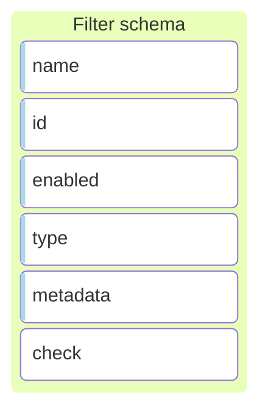

- **Name**: Identifies the filter and follows the pattern `<asset_type>/<name>/<version>`. The name is unique and cannot
  be repeated. The naming convention for components is `<type>/<name>/<version>`. The component type is `filter`, and
  the version must be 0, since versioning is not implemented:

- **ID**: Unique identifier for the filter in UUIDv4 format.

- **Enabled**: Boolean flag to enable or disable the filter.

- **Type**: Defines when the filter is executed in the pipeline:
  - `pre-filter`: evaluated before decoders.
  - `post-filter`: evaluated after decoders.

- **Metadata**: Provides descriptive information about the filter (module, title, description, compatibility, versions,
  author, references). This metadata does not affect processing stages.

- **Check**: The check stage is a stage in the filter asset used to evaluate the conditions that the event must meet to
  pass the filter. More information on the checks stage can be found in the [Check/allow section](#checkallow).

- **Parents** (optional): Defines parent filters evaluated before this one.

- **Definitions** (optional): Defines symbols that will be replaced throughout the document in its occurrences.

#### Example Filter

```yaml
name: filter/prefilter/0
id: fef71314-00c6-41f5-ab26-15e271e9f913
enabled: true
type: pre-filter
metadata:
  module: wazuh
  title: Platform filter
  description: Filter events by platform
  compatibility: Wazuh 5.*
  versions:
    - Wazuh 5.*
  author:
    name: Wazuh, Inc.
    url: https://wazuh.com
    date: 2024-01-31
  references:
    - https://documentation.wazuh.com/
check: $host.os.platform == 'ubuntu'
```

> [!NOTE]
> When filter assets are used in the orchestrator, they don't have parents; they are a check stage that is evaluated before or after decoders depending on the `type` field.

## Stages

### Check/Allow
The check stage is a preliminary stage in the asset processing sequence, designed to assess whether an event meets specific conditions without modifying the event itself. Filters events based on predefined criteria, ensuring that only relevant events trigger the subsequent stages like parse or normalize.

There are two ways to define conditions in a stage check: through a **condition list** or a **conditional expression** string.

#### Condition list
In a condition list, each condition is described with a pair `property:value`. Here, `property` is the name of any field, and `value` is the condition that the field must meet.

The event is filtered through all listed conditions, and only events that satisfy all conditions in order are processed further.

Depending on the value, the condition to test is:
- **JSON value**: Tests that the field contains a specific value.
- **Field reference**: Checks that the event contains the field denoted by the reference, and both fields have the same value. A reference is formatted as `$field.name`.
- **Helper function**: Executes a conditional operation on the field, specified by `helper_name(args…)`.

Example checklist:
```yaml
check:
  - event.format: text
  - user.name: $root_user
  - event.original: exists()
  - event.id: 1234
```

All conditions must be met for the event to pass through the check stage. If any condition fails, the event is not processed further.

> [!NOTE]
> `event.id: 1234` is not the same as `event.id: "1234"` because the first one is a number and the second one is a string.

#### Conditional expression
For scenarios requiring complex conditions, especially in rules, a conditional expression allows for more nuanced logic. This string uses a subset of first-order logic language, including logical connectives and support for grouping through parentheses.

Logical Connectives:
- Negation (`NOT`)
- Conjunction (`AND`)
- Disjunction (`OR`)

These connectives facilitate writing conditions between terms where a term can be:
- Value comparison: Formatted as `<$field><op><value>`.
- Helper function: Expressed as `<helper_name>(<field>, args...)`, except for the “exists” helper, which can be denoted by the field name alone.

Supported Operators:
- Comparison operators `!=` and `==` are applicable to all data types.
- Operators `<=`, `<`, `>=`, `>` are supported for numbers and strings (lexicographically).

Examples of conditional expressions:
```yaml
check: $event.category=="registry" AND $event.type=="change" AND ($registry.path=="/some/path" OR $registry.path=="/some/other/path")
```

```yaml
check: int_less($http.response.status_code, 400)
```

```yaml
check: $wazuh.origin == /var/log/apache2/access.log OR $wazuh.origin == /var/log/httpd/access_log
```

### Parse
Executes a series of parsing expressions that transform the event's original message into clearly defined data fields. The parsing operations are processed in sequence, with each operation attempted until one succeeds. If an operation succeeds, subsequent operations in the list are skipped.

If all operations fail, the execution of the stage is marked as failed, the processing of the event could continue with the next substage only if it is within a normalize.

For a complete list of parsers check the [Parsers](ref-parser.md) reference.

#### Parser expression
Parser expressions facilitate the transformation of log entries into structured objects, offering an alternative to Grok by eliminating the need for explicit type declarations as these are predefined in the schema. Instead of regular expressions, these expressions utilize tailored parsers, enhancing precision.

The parser expressions are composed of various tokens or expressions, where these expressions can be any one of the following:
- **Literals**, Direct characters that match input text exactly. with certain reserved characters that require escaping (used in other tokens), with the character `\` , precisely: `<>?\(`

  E.g.: The following expression will match exactly that in the log line
`[Fri Sep 09 10:42:29.902022 2011] [core:error]`
- **Fields**, are expressions of the form  `<[?]field_name[/param1…]>`, where we can identify 4 different types of field expressions:
  - **Schema fields**: Directly correspond to fields defined in the schema, with the engine automatically applying the appropriate parser and can have parameters depending on the parser.

     E.g.: `<source.ip>` will match any IPv4 or IPv6 and map it to the field `source.ip`.
  - **Custom fields**: Are those that are not in the schema, in contrast to schema fields, custom fields use the text parser unless specified otherwise by the parameters. These are intended for temporary/auxiliary use.

    Custom fields are indexed as text by default in open search, depending on the configuration open search may try to detect and index as other types.

    E.g.: `<custom_field/long>` will match any number and map it to the field `custom_field`.
  - **Optional fields**: we indicate that a field parse expression is optional writing the interrogation symbol `?` at the beginning of the expression. If the parsing fails it will continue with the next expressions.

    E.g.: `<field1>|<?field2>|<field3>` will match anything between `|` symbols three times, and the second may be empty or not.
  - **Field choice**: Expresses a choice between two field expressions, meaning one of the fields must match. We write two field expressions splitted by the interrogation symbol `?`. As the first choice we can only use parsers that do not require end token, if we use one that does the expression will fail to compile because the end tokens are not sent to the parser.

    E.g.: `<source.ip>?<~/literal/->` will match an IP and map it to source ip or a hyphen, skipping it.

    Note: `?` only needs to be scaped when it appears right after a field expression: `<source.ip>\?...`
- `Wildcards`, follows the same syntax and behaves the same as a custom field but has no name and does not map to any field. It is used to parse some pattern without extracting. Can be a optional or in a field choice also.

  E.g.:`<~/byte>` will parse a byte value and continue.

  E.g.:`Error Code: <~/long> Description: <message>` Here, `<~/long>` uses a wildcard to parse an integer error code that isn’t mapped to any field, essentially ignoring it while capturing the subsequent error description into message.
- **Optional groups**, make a logpar subexpression optional. The optional expression is denoted with `(?sub_expression)`. Used to make some more complex patterns optional where a simple optional field won’t suffice. It can contains any valid logpar expression with the exception of another optional group. An optional group can not contains another group, and two optional groups may not appear in a row.

  E.g.:`[<source.ip>(?:<source.port>)]` will match any ip address optionally followed by a port separated by double dots, and being between brackets.

**Examples**:

This expression will capture an IP address or hostname into `client.ip` or `client.address`, and optionally capture a port into `server.port` if it is present.
```yaml
<client.ip>?<client.address> connected to <server.ip>(?:<server.port>)
```

Apache error parser:
```yaml
# [Mon Dec 26 16:15:55.103522 2016] [mpm_prefork:notice] [pid 11379] AH00163: Apache/2.4.23 (Unix) configured -- resuming normal operations
# [Mon Dec 26 16:15:55.103786 2016] [core:notice] [pid 11379] AH00094: Command line: '/usr/local/Cellar/httpd24/2.4.23_2/bin/httpd'
# [Wed Oct 20 19:20:59.121211 2021] [rewrite:trace3] [pid 121591:tid 140413273032448] mod_rewrite.c(470): [client 10.121.192.8:38350] 10.121.192.8 - - [dev.elastic.co/sid#55a374e851c8][rid#7fb438083ac0/initial] applying pattern '^/import/?(.*)$' to uri '/'
# [Wed Oct 20 19:20:59.121211 2021] [rewrite:trace3] [pid 121591:tid 140413273032448] mod_rewrite.c(470): [client milo.dom.com:513] 10.121.192.8 - - [dev.elastic.co/sid#55a374e851c8][rid#7fb438083ac0/initial] applying pattern '^/import/?(.*)$' to uri '/'
# [Mon Dec 26 16:22:08 2016] [error] [client 192.168.33.1] File does not exist: /var/www/favicon.ico
# [Fri Sep 09 10:42:29.902022 2011] [core:error] [pid 35708:tid 4328636416] [client 89.160.20.112] File does not exist: /usr/local/apache2/htdocs/favicon.ico
# [Thu Jun 27 06:58:09.169510 2019] [include:warn] [pid 15934] [client 67.43.156.12:12345] AH01374: mod_include: Options +Includes (or IncludesNoExec) wasn't set, INCLUDES filter removed: /test.html
# [Mon Dec 26 16:17:53 2016] [notice] Apache/2.2.22 (Ubuntu) configured -- resuming normal operations
# [Mon Dec 26 16:22:00 2016] [error] [client 192.168.33.1] File does not exist: /var/www/favicon.ico, referer: http://192.168.33.72/
# [Mon Dec 26 16:22:08 2016] [error] [client 192.168.33.1] File does not exist: /var/www/favicon.ico
parse|event.original:
    - "[<@timestamp/Mon Dec 26 16:22:00 2016>] [<log.level>] [client <source.address>(?:<source.port>)] <message>"

    - "[<@timestamp/%a %b %d %T %Y/en_US.UTF-8>] [<~apache.error.module>:<log.level>] [pid <process.pid>(?:tid <process.thread.id>)] [client <source.address>(?:<source.port>)] <message>"

    - "[<@timestamp/%a %b %d %T %Y/en_US.UTF-8>] [<~apache.error.module>:<log.level>] [pid <process.pid>(?:tid <process.thread.id>)] <message>"
```

#### Schema fields and parsers
Fields within the schema are bound to specific parsers that ensure the data matches the expected format. For example, date fields may require a specific time format, which is denoted using parameters following the field name in the format `<field_name/param_0/param_n>`. This allows for flexible data validation against predefined types or custom formats specified by additional parameters.

For standard fields defined in the schema, each field type has an associated parser. For instance, a field of type long (like `event.severity`) will utilize a numeric parser.

Custom fields not defined in the schema default to using the text parser, which continues parsing until a specified delimiter or the end of the log entry. Fields at the end of a parser expression are interpreted as catch-all, capturing all remaining text in the log entry. This approach facilitates partial parsing where full matching is not required, ensuring flexibility in log analysis.

For example,  the case of `<tmp_field>c` this will parse everything until character `c` is found. It is possible to specify the parser name as the first argument, for example `<tmp_field/ip>c` will use the ip parser instead of the text parser. It is also possible to pass parameters to the parser, for example `<tmp_field/date/RFC822>c` parses the timestamp using the RFC822 format.

#### End tokens and field expressions
Some parsers need an anchor token to stop parsing, i.e. the text parser used by default in all custom fields will parse any character until the end token is found. The end token is the literal following the field expression, or if the field expression is at the end it will parse the remaining string.

E.g.:`<header>:<message>` will parse and capture any text up to a double dots in the header field, and the remaining of the log will be captured in the message field.

This implicates that two field expressions must be splited by a literal unless the first one does not need an end token, while `<custom/long><~>` is valid, as the long parsers does not need end token, `<text><~>` will be invalid.

In choice expressions the end token is the same for both field expressions, it is the literal right after the second field expression. E.g, `<custom_ip>?<~>|` will be valid, as both parsers require an end token, in this case the literal `|`. This implies the same as before, if one of the choices needs an end token, it must be followed by a literal.

In optional group expressions, i.e. when a field is followed by an optional group, there are multiple end tokens. The literal at the beginning of the optional group and the literal right after the group, meaning if a field needs an end token and is followed by an optional group, the group must start with a literal and a literal must appear right after the group.

E.g.: `<custom_text>(?|<opt/long>):`, in this case the text parser will try to search for a `|`, so the optional group can be parsed, and if the optional group fails, then the text parser will use the symbol `:` as end token.


### Map
Executes each operation of the list in order until the last operation. If any operation fails, it continues with the next one.

If all operations fail the stage is not marked as failed and continues to the next stage.

**Type Validation**:
- When mapping a custom field (not defined in the schema), it can store any value without additional type checks.
- When mapping a field that belongs to the schema, a validation is performed based on the field’s type (e.g.,
  `source.ip` → IP, `event.start` → timestamp).
  - If a fixed value is provided at build time and its type is invalid, the asset build fails immediately.
  - If the value is dynamically obtained, for example from a helper or another schema field, and it eventually fails
    type validation, it will fail at runtime. The field is then left unmapped to maintain the event’s integrity.

Example:

```yaml
- map:
    - event.kind: event
    - event.dataset: apache.access
    - event.category: +array_append/web
    - event.module: apache
    - service.type: apache
    - event.outcome: success
```


### Normalize/Enrichment
The normalize stage is where the event undergoes transformations and adjustments after passing through the check and parse stages successfully. Composed of a list of sub-stages that are executed in the specified order. These sub-stages can include operations such as check, map, and parse.
- **Check**: Applies conditional checks within the normalize context to determine if subsequent mappings or parsing should be executed.
- **Parse**: Further decomposes and extracts fields from the event data if required.
- **Map**: Transforms and assigns new values to fields in the event based on predefined rules.

Each set of sub-stages is processed sequentially. If a check and parse within a normalization block is successful, the corresponding map is executed, replicating the check, parse, and normalize stages of the asset.

Example:
```yaml
normalize:
  - map:
      - wazuh.decoders: array_append(windows-sysmon)
      - event.dataset: sysmon
      - event.kind: event

  # Only maps network.protocol if event.code is 22
  - check: $event.code == '22'
    map:
      - network.protocol: dns

  # Only maps resources if the check and parse stages succeeded
  - check: $event.outcome == failure
    parse|message:
      - "[<error.code/int>]<details>"
    map:
      - resources: split($details, ",")
```

### Output
The Output Stage allows you to specify and configure the different outputs, defining the final destinations for events before they leave the Engine.
```yaml
outputs:
  - output_name: configuration
```

For more details on the available output types and configurations, refer to [output documentation](ref-output.md).

## Parsers

### Schema parsers
These parsers are used automatically when a field of its type is used in a logpar expression.

For example, if you use the field `<event.start>` which is of type `date`, it will be parsed automatically by the date parser.

These parsers will generate fields which are type-compatible with Wazuh Indexer.

| Type        | Parser       | Description                                                                                          |
|-------------|--------------|------------------------------------------------------------------------------------------------------|
| null        | -            | A null field can’t be indexed or searched. When a field is set to null, OpenSearch behaves as if that field has no values. |
| boolean     | bool         | OpenSearch accepts true and false as boolean values. An empty string is equal to false.               |
| float       | float        | Codified as decimal representation in string format. A single-precision 32-bit IEEE 754 floating point number, restricted to finite values. |
| scaled_float| scaled_float | Codified as decimal representation in string format. The scaling factor is defined in the schema.    |
| double      | double       | Codified as decimal representation in string format. A double-precision 64-bit IEEE 754 floating point number, restricted to finite values. |
| long        | long         | Codified as decimal representation in string format. A signed 64-bit integer with a minimum value of `-2^63` and a maximum value of `2^63-1`. |
| byte        | byte         | Codified as a decimal representation in string format. A signed 8-bit integer with a minimum value of `-128` and a maximum value of `127`. |
| object      | -            | -                                                                                                    |
| array       | -            | -                                                                                                    |
| nested      | -            | -                                                                                                    |
| text        | text         | A string sequence of characters that represent full-text values.                                     |
| keyword     | text         | A string sequence of characters that represent full-text values.                                     |
| ip          | ip           | A string with IPv4 or IPv6 address.                                                                  |
| date        | date         | Date codified as string. All dates are converted to a unified date in UTC timezone.                  |
| geo_point   | -            | -                                                                                                    |
| binary      | binary       | A codified base64 string.                                                                            |

Aditionally we define some types for the purpose to use specific parsers, normally used to parse objects or structured types from an input text. This is the case for `url` field for example.

| Type        | Parser     | Description                                                                                           |
|-------------|------------|-------------------------------------------------------------------------------------------------------|
| url         | uri        | Parses URI text and generates the URL object with all the parsed parts.                               |
| useragent   | useragent  | Parses a user agent string. It does not build the user agent object; this can be done with the OpenSearch plugin. |


## Debugging

### Where to find the logs

The Engine writes its logs to the Wazuh manager log file, alongside the rest of the
Wazuh components:

```
/var/wazuh-manager/logs/wazuh-manager.log
```

Each log line follows the format `YYYY/MM/DD HH:MM:SS <component>: LEVEL: message`.
Most Engine messages use the `wazuh-manager-analysisd` component tag, but some subsystems
(such as the Indexer Connector) use their own tag:

```
2026/04/14 20:07:43 IndexerConnector: WARNING: No username and password found in the keystore, using default values.
2026/04/14 20:07:44 wazuh-manager-analysisd: INFO: Indexer Connector initialized.
2026/04/14 20:09:16 wazuh-manager-analysisd: INFO: Archiver initialized.
2026/04/14 20:09:16 wazuh-manager-analysisd: INFO: Remote engine's server initialized and started.
2026/04/14 20:09:16 wazuh-manager-analysisd: INFO: Engine started and ready to process events.
```

Warning and error lines include a context tag in brackets that identifies the internal
component that produced the message:

```
2026/04/14 20:09:16 wazuh-manager-analysisd: WARNING: [CMSync::exist()] Check 'standard' space in wazuh-indexer - Attempt 1/3: No available server
2026/04/14 20:09:26 wazuh-manager-analysisd: WARNING: [CMSync] Failed to synchronize namespace for space 'standard': No available server
2026/04/14 20:09:46 wazuh-manager-analysisd: WARNING: [IOC::Sync] Synchronization cycle failed: No available server
```

When debug level is active, additional diagnostic messages appear with the same format:

```
2026/04/14 20:09:16 wazuh-manager-analysisd: DEBUG: Geo sync scheduled with interval: 360 seconds.
2026/04/14 20:09:16 wazuh-manager-analysisd: DEBUG: Remote configuration synchronize scheduled with interval: 120 seconds.
2026/04/14 20:09:16 wazuh-manager-analysisd: DEBUG: IOC Sync task scheduled with interval: 360 seconds, 3 max retries.
```

### Log types

The Engine supports six severity levels. Only messages at the configured level or above
are written to the log file.

| Type       | Description |
|:----------:|:------------|
| `TRACE`    | Extremely detailed — every step of every operation. Use only for deep troubleshooting. |
| `DEBUG`    | Diagnostic messages useful for day-to-day troubleshooting. |
| `INFO`     | Normal activity: modules starting, tasks running, sync results. **Default.** |
| `WARNING`  | Something unexpected happened but the Engine kept working. |
| `ERROR`    | Something went wrong and may have affected event processing. |
| `CRITICAL` | A serious failure. The Engine may have stopped. |

### How to enable debug logging

Open the file `/var/wazuh-manager/etc/wazuh-manager-internal-options.conf` and find
(or add) the `analysisd.debug` line:

```ini
# Log verbosity for the Engine
# 0 = normal (info)  ← default
# 1 = debug
# 2 = trace (most detailed)
analysisd.debug=1
```

Save the file and restart the `wazuh-manager` service for the change to take effect.

> [!NOTE]
> Use `debug` (1) for day-to-day troubleshooting. Only switch to `trace` (2) when
> you need to follow a specific event step by step — it produces a large volume of
> output.

### Internal options reference

All of the following settings live in `/var/wazuh-manager/etc/wazuh-manager-internal-options.conf`.
Edit the file and restart the `wazuh-manager` service for changes to take effect.

#### Logging

| Setting | Description | Default |
|:--------|:------------|:-------:|
| `analysisd.debug` | Log verbosity level. `0` = normal, `1` = debug, `2` = trace. | `0` |

#### Event queue

| Setting | Description | Default |
|:--------|:------------|:-------:|
| `analysisd.event_queue_size` | Maximum number of events waiting in the router input queue. Events can be dropped when this queue is full. | `131072` |
| `analysisd.event_queue_eps` | Maximum event ingestion rate. `0` means unlimited. | `0` |

#### Indexer connector

| Setting | Description | Default |
|:--------|:------------|:-------:|
| `analysisd.indexer_queue_max_events` | Maximum number of events waiting in the indexer output queue. Events can be dropped when this queue is full. | `131072` |

#### Synchronization settings

| Setting | Description | Default |
|:--------|:------------|:-------:|
| `analysisd.remote_conf_sync_interval` | Seconds between remote engine configuration synchronization cycles. | `120` |
| `analysisd.remote_conf_indexer_connector_max_retries` | Maximum retry attempts for remote configuration requests to the Wazuh Indexer. | `3` |
| `analysisd.remote_conf_indexer_connector_retry_interval` | Seconds between retry attempts for remote configuration synchronization. | `5` |
| `analysisd.cm_sync_interval` | Seconds between content synchronization cycles from the Wazuh Indexer. | `120` |
| `analysisd.cmsync_indexer_connector_sync_batch_size` | Maximum number of content documents requested per Wazuh Indexer page during content synchronization. | `100` |
| `analysisd.cmsync_indexer_connector_max_retries` | Maximum retry attempts for content synchronization requests to the Wazuh Indexer. | `3` |
| `analysisd.cmsync_indexer_connector_retry_interval` | Seconds between retry attempts for content synchronization. | `5` |
| `analysisd.ioc_sync_interval` | Seconds between IoC database synchronization cycles. `0` disables IoC sync. | `360` |
| `analysisd.ioc_indexer_connector_max_retries` | Maximum retry attempts for IoC synchronization requests to the Wazuh Indexer. | `3` |
| `analysisd.ioc_indexer_connector_retry_interval` | Seconds between retry attempts for IoC synchronization. | `5` |
| `analysisd.ioc_indexer_connector_ioc_sync_batch_size` | Maximum number of IoC documents streamed per Wazuh Indexer page while synchronizing IoC databases. | `1000` |
| `analysisd.geo_sync_interval` | Seconds between GeoIP database synchronization cycles. `0` disables GeoIP sync. | `360` |

### Traces

Traces let you test how the Engine processes a specific event without sending it
through production. A trace is a detailed report of what happened inside the
selected policy while the event was evaluated.

There are three levels of detail:

- **Graph history** — shows the assets and policy phases that evaluated the event,
  including filters, decoders, enrichment, and outputs when they are part of the
  selected policy. Good for understanding where an event was accepted, rejected,
  or discarded.
- **Full traces** — adds a step-by-step breakdown of every operation inside each
  asset. Use this level when you need to understand exactly where parsing, checks,
  mapping, or enrichment failed.
- **Asset filtering** — limits the output to a specific group of assets, to reduce
  noise when you already know which area to investigate.

The policy flow is evaluated in phases. Pre-filter assets are evaluated before
decoders. If a pre-filter fails, the event does not continue to decoder evaluation.
After decoding, the Engine runs internal cleanup and enrichment logic. Post-filter
assets are evaluated before outputs; if a post-filter fails, the event does not
continue to output delivery.

In traces, filters appear with their asset names, such as `filter/DiscardedEvents`.
Some policies do not print a separate `pre-filter` or `post-filter` wrapper; the
filter asset itself shows the decision that was made.

**Generic trace structure** — a trace follows the event through the policy. Not
every policy prints every phase, but the usual order is:

```
traces:
[🟢] filter/<pre-filter-name>/0 -> success
  ↳ [check: <condition>] -> Success
[🟢] decoder/<decoder-name>/0 -> success
  ↳ <field>: <operation> -> Success
[🟢] cleanup/DecoderTemporaryVariables -> success
  ↳ cleanupDecoderTemporaryVariables() -> Success
[🟢] enrichment/<enrichment-name> -> success
  ↳ <enrichment operation> -> Success
[🟢] filter/<post-filter-name>/0 -> success
  ↳ <filter operation> -> Success
[🟢] output/<output-name>/0 -> success
  ↳ <output operation> -> Success
```

Pre-filters are used to decide whether an event should enter the decoder phase.
When a pre-filter fails, the event is rejected before any decoder runs. Decoders
parse and normalize the event. Cleanup assets remove temporary fields created
during decoding. Enrichment assets add derived context, such as GeoIP, AS, or IoC
matches. Post-filters run after decoding and enrichment, before outputs, and decide
whether the processed event should continue to delivery.

**Trace example** — this reduced example shows the relevant parts of a successful
event. A 🔴 means the asset did not apply to this event. A 🟢 means the asset
applied and processed it:

```
traces:
[🟢] decoder/core-wazuh-message/0 -> success
  ↳ @timestamp: get_date -> Success
[🟢] decoder/integrations/0 -> success
  ↳ event.original: exists -> Success
  ↳ _tmp_json: parse_json($event.original) -> Success
[🔴] decoder/syslog/0 -> failed
  ↳ [/event/original: <event.start/ISO8601Z> <_tmp.hostname/fqdn> <_TAG/alphanumeric/->: <message>] -> Failure
[🟢] decoder/aws-cloudtrail/0 -> success
  ↳ [check: is_object($_tmp_json.userIdentity) OR is_array($_tmp_json.logFiles) OR exists($_tmp_json.insightDetails) OR exists($_tmp_json.insightSource)] -> Success
  ↳ event.provider: map($_tmp_json.eventSource) -> Success
  ↳ cloud.region: map($_tmp_json.awsRegion) -> Success
  ↳ event.action: map($_tmp_json.eventName) -> Success
  ↳ event.start: parse_date($_tmp_json.eventTime, "%FT%TZ") -> Success
  ↳ source.ip: map($_tmp_json.sourceIPAddress) -> Success
  ↳ user.name: map($_tmp_json.userIdentity.userName) -> Success
  ↳ event.outcome: map("success") -> Success
  ↳ [_tmp_json: delete] -> Success
[🟢] filter/DiscardedEvents -> success
  ↳ Discard_event() -> Success: Event will be indexed (wazuh.space.event_discarded=false)
[🟢] cleanup/DecoderTemporaryVariables -> success
  ↳ cleanupDecoderTemporaryVariables() -> Success: Removed root keys prefixed with '_'
[🟢] enrichment/Geo -> success
  ↳ Geo(89.160.20.156)|AS(89.160.20.156) -> Success: Geo and AS enrichment applied for IP at field 'source.ip'
[🔴] enrichment/Ioc/connection -> failed
  ↳ IOC(connection) -> Failure: Source field(s) not found for 'source.ip, source.port'
```

The first successful decoder, `decoder/core-wazuh-message/0`, prepares the event
and sets `@timestamp`. The `decoder/integrations/0` asset verifies that the raw
event exists and parses it into `_tmp_json`. Decoders that do not match the event
return failures and the Engine continues evaluating the next candidates.

The matched decoder maps the event fields to the normalized schema. The
`filter/DiscardedEvents` asset decides whether the event
should be indexed. In this example, the event is kept because
`wazuh.space.event_discarded=false`.

After decoding and filtering, the Engine removes temporary fields with
`cleanup/DecoderTemporaryVariables` and runs enrichment assets. `enrichment/Geo`
adds geolocation data because `source.ip` is present. The IoC enrichment fails for
`connection` because the event does not include a port field. This is normal and
does not mean that the event was rejected.

The resulting event contains the normalized fields and the selected space:

```yaml
output:
  cloud:
    account:
      id: '123456789012'
    region: us-east-2
  event:
    action: CreateKeyPair
    kind: event
    outcome: success
    provider: ec2.amazonaws.com
    start: '2014-03-06T17:10:34.000Z'
    type:
      - info
  source:
    address: 89.160.20.156
    ip: 89.160.20.156
  user:
    id: EX_PRINCIPAL_ID
    name: Alice
  wazuh:
    integration:
      category: cloud-services
      decoders:
        - decoder/core-wazuh-message/0
        - decoder/integrations/0
        - decoder/aws-cloudtrail/0
      name: aws
    protocol:
      location: test
      queue: 49
    space:
      name: standard
```

## F.A.Q
