# Architecture

## Introduction

```mermaid
---
config:
  title: "Simplified architecture"
  nodeSpacing: 30
  rankSpacing: 25
  flowchart:
    curve: stepAfter
    subGraphTitleMargin:
      top: 20
      bottom: 20
---
flowchart LR

classDef SubmoduleClass font-size:15px,stroke-width:2px,stroke-dasharray:10px,rx:15,ry:15
classDef ModuleClass  font-size:15px,stroke-width:2px,rx:15,ry:15


%% ----------------------------------
%%                  API
%% ----------------------------------


subgraph apiModule["API"]
   direction LR
   api_orchestrator@{ shape: stadium, label: "Orchestrador manager" }
   api_kvdb@{ shape: stadium, label: "KVDB manager" }
   api_metrics@{ shape: stadium, label: "Metric manager" }
   api_geo@{ shape: stadium, label: "Geo manager" }
   api_orchestrator ~~~ api_kvdb
   api_metrics ~~~ api_geo

   api_catalog@{ shape: disk, label: "Catalog of assets" }
   api_policies@{ shape: disk, label: "Policies" }
   api_policies ~~~ api_catalog
end
apiModule:::ModuleClass


%% ----------------------------------
%%                  Geo module
%% ----------------------------------
subgraph geoModule["Geolocator"]
  geo_mmdb@{ shape: disk, label: "MaxMind DBs" }
end
geoModule:::ModuleClass

%% ----------------------------------
%%                  KVDB
%% ----------------------------------
subgraph kvdbModule["KVDB"]
    direction TB
    kvdb_db_2@{ shape: docs, label: "Key-Value DataBases" }
end
kvdbModule:::ModuleClass


%% ----------------------------------
%%              Global module
%% ----------------------------------
subgraph globalModule["Global"]
    global_metrics("Metrics")
    global_logger("Logger")
end
globalModule:::ModuleClass


%% ----------------------------------
%%                  Server
%% ----------------------------------

subgraph serverModule["Server"]
   direction RL
   server_API>Server API]
   server_engine>Server engine]
end
serverModule:::ModuleClass


%% ----------------------------------
%%           Storage
%% ----------------------------------
storageModule@{ shape: cyl, label: "Persistent</br>Storage" }
storageModule:::ModuleClass

%% ----------------------------------
%%           Builder
%% ----------------------------------
subgraph builderModule["Builder"]
 builder_asset@{ shape: stadium, label: "Builder asset" }
 builder_policy@{ shape: stadium, label: "Builder policy" }
 builder_parser@{ shape: stadium, label: "Builder parser" }
 builder_hp@{ shape: stadium, label: "Builder helper function" }

builder_policy ~~~ builder_asset --- builder_parser & builder_hp

 builder_parser --- builder_catalog_hf@{ shape: disk, label: "Catalog of helper functions" }
 builder_hp --- builder_catalog_parser@{ shape: disk, label: "Catalog of parser" }

end
builderModule:::ModuleClass

%% ----------------------------------
%%           Orchestrator
%% ----------------------------------
subgraph orchestratorModule["Orchestrator"]
   direction RL
   orchestrator_router@{ shape: stadium, label: "Router" }
   orchestrator_tester@{ shape: stadium, label: "Tester" }
   orchestrator_routerTable@{ shape: disk, label: "Routes" }
   orchestrator_sessionTable@{ shape: disk, label: "Session" }
   orchestrator_router --- orchestrator_routerTable
   orchestrator_tester --- orchestrator_sessionTable
end
orchestratorModule:::ModuleClass

subgraph backendModule["Backend"]

end

%% ----------------------------------
%%           Modules conexion
%% ----------------------------------
%%% orchestratorModule --- builderModule
serverModule ------- orchestratorModule & apiModule
orchestratorModule:::ModuleClass ---- backendModule
builderModule & apiModule --- geoModule & kvdbModule
apiModule --- storageModule

apiModule ------ builderModule

orchestratorModule  ------ builderModule
orchestratorModule ----- apiModule
storageModule --- builderModule


```

<i>Simplified architecture of the Wazuh engine</i>

The Wazuh engine is composed of several modules that interact with each other to provide the functionality of the engine. The main modules are:

- **Server**: The server module is the main module of the Wazuh engine. It is responsible for managing conexions between
    wazuh-server and the rest of the modules.
- **Orchestrator**: The orchestrator module is responsible for managing the execution routes and policy testing.
- **Backend**: The backend module executes is responsible for the execution code generated by the builder module and
    manager by the orchestrator module.
- **Builder**: The builder module is responsible of create the execution code based on the definition of the policies
    and assets.
- **API**: The API module is responsible for managing the communication between the Wazuh engine and the rest of the
    modules, providing a REST API for the communication.
- **KVDB**: The KVDB module is responsible for managing the key-value databases used by helper functions.
- **Geo**: The Geo module is responsible for managing the geolocation databases used by helper functions.
- **Persistant Storage**: The storage module is responsible for managing the persistent local storage used by the engine
    (policy, assets, sessions, schemas, etc).
- **Global**: The global module is responsible for managing the global resources used by the engine (metrics, logger,
    etc).

## Module: Server

The server module is the module responsible for exposing the Wazuh engine to the rest of the modules of waush-server.
This exposes 2 sockets one for the API (stateful) and one for the engine (stateless).
Both sockets are stream unix sockets and use a HTTP/1.1 protocol.

**engine.socket**: This socket is used to ingest the **events** collected by the Wazuh agents. The server module forwards
the events to the orchestrator module, for further processing.
**api.socket**: This socket is used to expose the REST API of the Wazuh engine. The server module forwards the requests
to the API module. The API module is responsible for managing the requests and responses. This requests are used to
manage the engine state, like the policies, assets, routes, db-update, etc.

## Module: Orchestrator

The orchestrator module is responsible for managing the execution routes and policy testing. The orchestrator is able to
instanciate multiples policies and decide which one to use based on the event received.

The orchestrator module is composed of 2 main components:
- **Router**: The router component is responsible for managing the routes and decide which policy to use based on the
    event received from the server module. For this, the router uses the routes table, with the definition of the routes:

    | route name (id) | priority |  filter  | intance of the policy  |
    |-----------------|----------|---------|------------------------|
    | _router_example_| 1        | _filter_1_ | _policy_1_               |
    | _..._           | _..._    | _filter_2_ | _policy_2_              |
    | default         | 255      | _*_       | _wazuh-default-policy_   |

- **Tester**: The tester component is responsible for testing event against a policy. The tester uses the session table
    to store the state of the session and the policy to test. Also a different of the router, the tester receives the
    event, the policy to test and returns the result of the test (Traces/Alerts).

## F.A.Q
