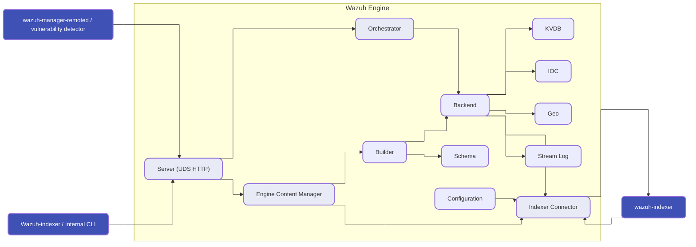
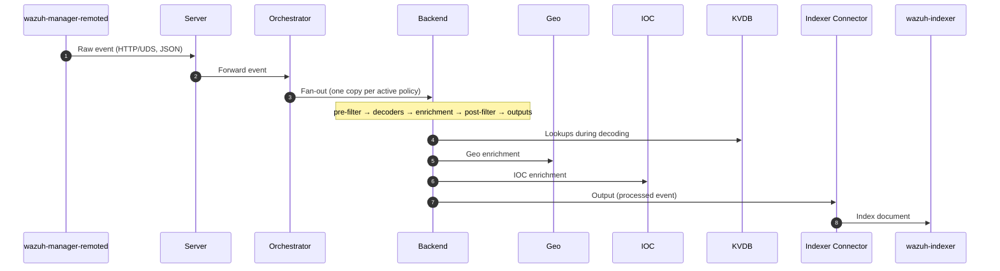
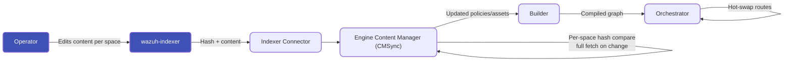

# Architecture

## Introduction

The **Wazuh Engine** is the decoding, enrichment and routing events of the Wazuh manager (it ships as the `wazuh-manager-analysisd` daemon). It receives raw events from `wazuh-manager-remoted`, normalizes them to the Wazuh Common Schema using user-defined decoders, enriches them (GeoIP, IOC, key-value lookups), evaluates them against one or more security policies, and forwards the resulting documents to `wazuh-indexer`.

The engine never communicates with agents or with Wazuh CTI directly. Its only inbound peer for events is `remoted` and `vd`, and its only outbound peer for event/content flows is `wazuh-indexer`. The only external Internet connectivity it requires is downloading GeoIP/ASN databases from official Wazuh servers for geolocation updates. Content (decoders, integrations, policies, IOC databases) is also pulled from `wazuh-indexer` rather than from a CTI feed. For the runtime concepts referenced throughout this document — events, decoders, security policies, spaces, helper functions, assets — see the [quick-start](./README.md). For the API surface, see [api-reference.md](./api-reference.md).

> [!NOTE]
> When this document mentions "Content Management" it is referring to the engine's internal content management system, which is separate from the Wazuh manager's external content management used by vulnerability detector.

---

## High-level view

```mermaid
---
config:
  flowchart:
    curve: stepAfter
---
flowchart LR

classDef ExternalClass font-size:14px,stroke-width:2px,fill:#3f51b5,color:#fff,rx:6,ry:6
classDef ModuleClass font-size:14px,stroke-width:2px,rx:10,ry:10
classDef HubClass font-size:14px,stroke-width:2px,fill:#e8eaf6,rx:10,ry:10

remoted["wazuh-manager-remoted / vulnerability detector"]:::ExternalClass
operator["Wazuh-indexer / Internal CLI"]:::ExternalClass
indexer["wazuh-indexer"]:::ExternalClass

subgraph engine["Wazuh Engine"]
  direction LR

  server["Server (UDS HTTP)"]:::HubClass
  orchestrator["Orchestrator"]:::HubClass
  backend["Backend"]:::ModuleClass
  builder["Builder"]:::ModuleClass
  schema["Schema"]:::ModuleClass
  cm["Engine Content Manager"]:::HubClass
  kvdb["KVDB"]:::ModuleClass
  ioc["IOC"]:::ModuleClass
  geo["Geo"]:::ModuleClass
  ic["Indexer Connector"]:::HubClass
  streamlog["Stream Log"]:::ModuleClass
  conf["Configuration"]:::ModuleClass

  server --> orchestrator
  server --> cm
  orchestrator --> backend
  cm --> builder
  builder --> backend
  builder --> schema
  backend --> kvdb
  backend --> ioc
  backend --> geo
  backend --> ic
  backend --> streamlog
  cm --> ic
  conf --> ic
end

remoted --> server
operator --> server
ic --> indexer
indexer --> ic
```

The diagram shows the engine boundary and its relationships with the outside world. Events enter through the **Server** module, are routed by the **Orchestrator** to the active security policies, and are processed by the **Backend** using the executable graph produced by the **Builder**. Content (decoders, integrations, policies, KVDBs) is pulled from `wazuh-indexer` by the **Engine Content Manager** through the **Indexer Connector**, which is also the channel for outbound processed events.

---

## Module overview

| Module | Role | Related quick-start sections |
|--------|------|------------------------------|
| Server | HTTP-over-UDS entry: event ingestion socket and management API socket | [Data flow](./README.md#data-flow) |
| Orchestrator | Routes incoming events to active security policies; runs the tester | [Policy processing](./README.md#policy-processing) |
| Builder | Compiles assets and policies into an executable graph | [Assets](./README.md#assets), [Execution Graph Summary](./README.md#execution-graph-summary) |
| Backend | Runtime that executes the compiled graph for each event | [Policy processing](./README.md#policy-processing) |
| Engine Content Manager | Mirrors policies, integrations, decoders, filters and KVDBs from `wazuh-indexer` | [Content Management](./README.md#content-management-managing-the-engines-processing), [Spaces](./README.md#spaces) |
| Schema | Validates events against the Wazuh Common Schema | [Schema](./README.md#schema) |
| KVDB | Per-space key-value lookups used by decoders and filters | [Key Value Databases (KVDBs)](./README.md#key-value-databases-kvdbs) |
| IOC | Global Indicator-of-Compromise databases consumed by enrichment | [IOC enrichment](./README.md#ioc-enrichment) |
| Geo | GeoIP/ASN enrichment using MaxMind databases | [Geo enrichment](./README.md#geo-enrichment) |
| Indexer Connector | Sole channel to `wazuh-indexer`: outbound events, inbound content, inbound configuration | [Output process](./README.md#output-process) |
| Stream Log | Async rotating log channels backing file outputs and the event dumper | [Output directory structure](./README.md#output-directory-structure) |
| Configuration | Local YAML configuration plus runtime settings pulled from `wazuh-indexer` | — |

---

## Module details

### Server

Two HTTP servers running on Unix Domain Sockets. The **events** socket receives raw events from `wazuh-manager-remoted` or `vulnerability dectector`. The **management API** socket exposes the operations used by internal client dev tools and the rest of the Wazuh manager: managing routes, running tester sessions, applying content changes, querying GeoIP/IOC state, toggling raw event indexing, and reading metrics. Both sockets speak HTTP with JSON bodies; the schema for every request and response is defined in protobuf.

### Orchestrator

The runtime hub. It owns the **routes** table that maps each space to the active security policy and the priority at which events are evaluated, plus the session table used by the tester. When an event arrives the Orchestrator forwards an independent copy to each active policy, so a single incoming event can produce multiple output documents — one per active policy. Routes can be added, replaced or removed at runtime without restarting the engine, which is what makes hot-swapping of synchronized content possible.

### Builder

The Builder turns the declarative content stored in the Engine Content Manager — policies, integrations, decoders, filters, KVDB references — into an executable graph that the Backend can run. It validates field types against the Schema, resolves variables and definitions, and links every helper function used in `check`, `parse` and `normalize` stages. The Engine Content Manager calls the Builder whenever content changes; the resulting graph is what the Orchestrator ultimately registers as a route.

### Backend

The Backend is the runtime that executes the compiled graph for every event. It walks the stages described in [Policy processing](./README.md#policy-processing): pre-filter, decoders (including KVDB lookups), enrichment (Geo and IOC), post-filter, and outputs. The Backend is policy-agnostic — it has no domain knowledge of decoders or rules; it only knows how to evaluate the graph the Builder produced.

### Engine Content Manager

Local mirror of the content managed in `wazuh-indexer`. It is organized by **space** — Standard (Wazuh-curated) and Custom (user-defined) — exactly mirroring the layout in the indexer. The Engine Content Manager has three responsibilities: **storage** of decoders, filters, KVDBs, integrations and policies on the engine host; **synchronization** with the indexer (CMSync), which periodically compares per-space content hashes and pulls the full content when they differ — see [Synchronization process](./README.md#synchronization-process); and **CRUD**, which validates and applies any mutations issued through the management API. After every applied change, the Engine Content Manager hands the affected policies to the Builder and asks the Orchestrator to swap the corresponding routes.

### Schema

The Schema module loads the Wazuh Common Schema document at startup and exposes it to the Builder for build-time field validation and to the Backend for runtime validation of dynamic values. It guarantees that every document the engine emits is type-consistent with the mappings configured in `wazuh-indexer`. See [Schema](./README.md#schema).

### KVDB

Per-space key-value databases that decoders and filters consult during processing — for example to map identifiers to canonical names or to merge default values into events. Regular KVDBs are part of the per-space content: they are synchronized along with the rest of the space's assets and rebuilt on the engine when their source changes. See [Key Value Databases (KVDBs)](./README.md#key-value-databases-kvdbs).

### IOC

Indicator-of-Compromise databases used by the IOC enrichment stage to match fields in incoming events against threat intelligence. These databases are **shared across spaces** and are **independent of the regular content sync**: they are kept up to date by a dedicated IOC synchronizer that downloads updates into a temporary database and then atomically swaps it in, so readers never observe a partially-updated database. See [IOC enrichment](./README.md#ioc-enrichment).

### Geo

The Geo module performs GeoIP and ASN lookups using MaxMind MMDB databases. Like the IOC databases, the Geo databases are global rather than per-space; they are refreshed in the background and hot-reloaded without restarting the engine. See [Geo enrichment](./README.md#geo-enrichment).

### Indexer Connector

The Indexer Connector is the single component that talks to `wazuh-indexer`. It carries three flows: **outbound** processed events (driven by policy outputs), **inbound** content (consumed by the Engine Content Manager and the IOC synchronizer), and **inbound** runtime configuration (consumed by the Configuration module). Concentrating all `wazuh-indexer` traffic in one place is what allows the rest of the engine to stay independent of the indexer's transport details.

### Stream Log

Stream Log provides asynchronous, rotating log channels with size-based and time-based rotation, gzip compression and retention by file count and total size. It backs the file outputs that policies can configure, and it is also what the optional event dumper uses to persist raw events for forensic investigation. Hot-path writes never block on disk I/O.

### Configuration

The local configuration is loaded from the Wazuh manager's XML/ini at startup; every module reads from it. A subset of runtime parameters is also pulled periodically from `wazuh-indexer` as **remote configuration**, so operators can tune behaviour without restarting the engine. Remote configuration changes are applied with rollback if a module rejects the new values.

---

## Event lifecycle

The diagram below shows the journey of a single event through the engine, with each step labelled by the module that owns it.

```mermaid
sequenceDiagram
    autonumber
    participant Remoted as wazuh-manager-remoted
    participant Server
    participant Orchestrator
    participant Backend
    participant Geo
    participant IOC
    participant KVDB
    participant IC as Indexer Connector
    participant Indexer as wazuh-indexer

    Remoted->>Server: Raw event (HTTP/UDS, JSON)
    Server->>Orchestrator: Forward event
    Orchestrator->>Backend: Fan-out (one copy per active policy)
    Note over Backend: pre-filter → decoders → enrichment → post-filter → outputs
    Backend->>KVDB: Lookups during decoding
    Backend->>Geo: Geo enrichment
    Backend->>IOC: IOC enrichment
    Backend->>IC: Output (processed event)
    IC->>Indexer: Index document
```

The Backend executes the same five stages described in the quick-start's [Data flow](./README.md#data-flow) and [Policy processing](./README.md#policy-processing) sections; this diagram only shows which module is responsible for each step. File outputs follow the same path but reach **Stream Log** instead of (or in addition to) the **Indexer Connector**.

---

## Content lifecycle

Content does not originate in the engine. The single source of truth for decoders, integrations, filters, KVDBs and policies is `wazuh-indexer`; the engine pulls and mirrors it locally. The diagram below shows that flow.

```mermaid
flowchart LR

classDef ExternalClass fill:#3f51b5,color:#fff,stroke-width:2px,rx:6,ry:6
classDef ModuleClass stroke-width:2px,rx:10,ry:10

operator["Operator"]:::ExternalClass
indexer["wazuh-indexer"]:::ExternalClass
ic["Indexer Connector"]:::ModuleClass
cm["Engine Content Manager (CMSync)"]:::ModuleClass
builder["Builder"]:::ModuleClass
orchestrator["Orchestrator"]:::ModuleClass

operator -- "Edits content per space" --> indexer
indexer -- "Hash + content" --> ic
ic --> cm
cm -- "Per-space hash compare<br/>full fetch on change" --> cm
cm -- "Updated policies/assets" --> builder
builder -- "Compiled graph" --> orchestrator
orchestrator -- "Hot-swap routes" --> orchestrator
```

CMSync runs periodically per space (Standard and Custom). For each space it compares the indexer's content hash with the local one; when they differ it downloads the full content for the space, applies it to the local store and notifies the Builder, which recompiles the affected policy graphs. The Orchestrator then swaps the routes atomically, so events that arrive during the change always see either the previous or the new graph — never a partial one. See [Synchronization process](./README.md#synchronization-process) for the per-space details and [Spaces](./README.md#spaces) for what each space contains.

IOC databases follow a parallel, independent pipeline: their own synchronizer pulls from `wazuh-indexer`, writes into a temporary database, and atomically hot-swaps it in. There is no per-space split for IOCs, and they are not part of CMSync.

---

## Notes

- This document covers the structure of the engine and the contracts between its modules. For runtime semantics — stages, helpers, asset structure, examples — read the [quick-start](./README.md). For the API surface, read [api-reference.md](./api-reference.md).
- The diagrams are intentionally simplified. Cross-cutting facilities such as logging, metrics and configuration loading are not drawn but are described in the corresponding module subsection above.
