# Architecture

## Introduction

```mermaid
---
config:
  title: "Simplified architecture"
  nodeSpacing: 30
  rankSpacing: 25
  flowchart:
    curve: stepAfter
    subGraphTitleMargin:
      top: 20
      bottom: 20
---
flowchart LR

classDef SubmoduleClass font-size:15px,stroke-width:2px,stroke-dasharray:10px,rx:15,ry:15
classDef ModuleClass  font-size:15px,stroke-width:2px,rx:15,ry:15

%% ----------------------------------
%%                  API
%% ----------------------------------

subgraph apiModule["API"]
   direction LR
   api_orchestrator@{ shape: stadium, label: "Orchestrator manager" }
   api_kvdb@{ shape: stadium, label: "KVDB manager" }
   api_metrics@{ shape: stadium, label: "Metric manager" }
   api_geo@{ shape: stadium, label: "Geo manager" }
   api_orchestrator ~~~ api_kvdb
   api_metrics ~~~ api_geo

   api_catalog@{ shape: disk, label: "Catalog of assets" }
   api_policies@{ shape: disk, label: "Policies" }
   api_policies ~~~ api_catalog
end
apiModule:::ModuleClass


%% ----------------------------------
%%                  Geo module
%% ----------------------------------
subgraph geoModule["Geolocator"]
  geo_mmdb@{ shape: disk, label: "MaxMind DBs" }
end
geoModule:::ModuleClass

%% ----------------------------------
%%                  KVDB
%% ----------------------------------
subgraph kvdbModule["KVDB"]
    direction TB
    kvdb_db_2@{ shape: docs, label: "Key-Value DataBases" }
end
kvdbModule:::ModuleClass

%% ----------------------------------
%%              Global module
%% ----------------------------------
subgraph globalModule["Global"]
    global_metrics("Metrics")
    global_logger("Logger")
end
globalModule:::ModuleClass

%% ----------------------------------
%%                  Server
%% ----------------------------------

subgraph serverModule["Server"]
   direction RL
   server_API>Server API]
   server_engine>Server engine]
end
serverModule:::ModuleClass

%% ----------------------------------
%%           Storage
%% ----------------------------------
storageModule@{ shape: cyl, label: "Persistent</br>Storage" }
storageModule:::ModuleClass

%% ----------------------------------
%%           Builder
%% ----------------------------------
subgraph builderModule["Builder"]
 builder_asset@{ shape: stadium, label: "Builder asset" }
 builder_policy@{ shape: stadium, label: "Builder policy" }
 builder_parser@{ shape: stadium, label: "Builder parser" }
 builder_hp@{ shape: stadium, label: "Builder helper function" }

 builder_policy ~~~ builder_asset --- builder_parser & builder_hp
 builder_parser --- builder_catalog_hf@{ shape: disk, label: "Catalog of helper functions" }
 builder_hp --- builder_catalog_parser@{ shape: disk, label: "Catalog of parser" }

end
builderModule:::ModuleClass

%% ----------------------------------
%%           Orchestrator
%% ----------------------------------
subgraph orchestratorModule["Orchestrator"]
   direction RL
   orchestrator_router@{ shape: stadium, label: "Router" }
   orchestrator_tester@{ shape: stadium, label: "Tester" }
   orchestrator_routerTable@{ shape: disk, label: "Routes" }
   orchestrator_sessionTable@{ shape: disk, label: "Session" }
   orchestrator_router --- orchestrator_routerTable
   orchestrator_tester --- orchestrator_sessionTable
end
orchestratorModule:::ModuleClass

subgraph backendModule["Backend"]

end

%% ----------------------------------
%%           Modules conexion
%% ----------------------------------
serverModule ------- orchestratorModule & apiModule
orchestratorModule ---- backendModule
builderModule & apiModule --- geoModule & kvdbModule
apiModule --- storageModule

apiModule ------ builderModule

orchestratorModule  ------ builderModule
orchestratorModule ----- apiModule
storageModule --- builderModule

```

<i>Simplified architecture of the Wazuh engine</i>

The **Wazuh-Engine** is composed of multiple modules that work together to provide all engine functionality. Below is a summary of each module’s responsibilities and interactions.

---

## Main Modules

1. **Server**
   The Server module exposes the Wazuh-Engine to the rest of the Wazuh-Server system. It creates two Unix stream sockets:
   - **engine.socket**: Receives events from Wazuh agents and forwards them to the Orchestrator module for processing.
   - **api.socket**: Exposes the engine’s REST API, forwarding requests to the API module. These requests manage engine state (policies, assets, routes, DB updates, etc.).

2. **Orchestrator**
   The Orchestrator module manages runtime routes and policy testing:
   - **Router**: Decides which policy to apply for each incoming event. It refers to a **Routes Table** that defines filters, priorities, and mappings to specific policies.
   - **Tester**: Evaluates events against the assigned policies. It uses a **Session Table** to store context/state of session. The Tester returns the outcome of policy checks (e.g., alerts and traces).

3. **Backend**
   While Orchestrator handles routing and policy instantiation, the Backend module executes the code produced by the Builder module. The Backend is effectively the runtime environment for those policies.

4. **Builder**
   The Builder module generates executable code based on policies and assets. It has four components:
   - **Policy**: Constructs code representing policy logic.
   - **Asset**: Constructs code for asset definitions.
   - **Parser**: Constructs code for any parsing functionalities.
   - **Helper Functions**: Builds code for auxiliary or common utility functions.

5. **API**
   The API module manages interactions between the Wazuh-Engine and external modules or services via a REST interface. Its major components include:
   - **Orchestrator Manager**: Handles orchestrator-related tasks.
   - **KVDB Manager**: Manages access to the KVDB module.
   - **Metric Manager**: Interfaces with the metrics system in the Global module.
   - **Geo Manager**: Manages the Geo module.
   - **Catalog of Assets**: Maintains definitions of assets used across the engine.
   - **Policies**: Maintains definitions of policies used across the engine.

6. **KVDB**
   The KVDB module provides key-value database functionality, using [RocksDB](https://rocksdb.org/) under the hood. It is typically employed by helper functions.

7. **Geo**
   The Geo module manages geolocation data, relying on [MaxMind](https://www.maxmind.com/) databases. It exposes an internal API for updating and querying geolocation information.

8. **Persistent Storage**
   The Storage module oversees long-term persistence for policies, assets, sessions, and other data (e.g., routes, schemas, configurations). It currently uses the local file system.

9. **Global**
   The Global module offers cross-cutting engine resources:
   - **Metrics**: Tracks performance and usage statistics for Wazuh-Engine.
   - **Logger**: Centralizes logging features for all modules.

---

## Module: Server

The **Server** module provides the primary interface for both incoming agent events and external API requests:

- **engine.socket**:
  - Receives raw events from Wazuh agents.
  - Forwards these events to the Orchestrator for routing and policy application.

- **api.socket**:
  - Exposes the REST API of the Wazuh-Engine.
  - Forwards requests to the API module, which then manages tasks such as policy updates, asset management, and configuration changes.

---

## Module: Orchestrator

The **Orchestrator** determines how incoming events are routed and tested against policies:

- **Router**:
  - Uses a **Routes Table** to map events to policies based on defined filters and priorities.
  - Example of a routes table:

    | Route name (ID)   | Priority | Filter        | Policy                   |
    |-------------------|----------|---------------|--------------------------|
    | router_example    | 1        | filter_1      | policy_1                 |
    | ...               | ...      | filter_2      | policy_2                 |
    | default           | 255      | * (catch-all) | wazuh-default-policy     |

- **Tester**:
  - Uses a **Session Table** to maintain session state.
  - Receives an event and a sesion, then produces a result (alerts sample and traces).

---

## Module: Backend

The **Backend** executes the compiled policy and routing code generated by the Builder module. It effectively serves as the runtime environment for custom logic crafted by the Builder and orchestrated by the Orchestrator.

---

## Module: Geo

The **Geo** module offers geolocation capabilities:

- Relies on [MaxMind](https://www.maxmind.com/) databases.
- Provides an internal interface for updating these databases and querying geolocation data.

---

## Module: KVDB

The **KVDB** module manages key-value databases for various engine operations:

- Primarily used by helper functions.
- Internally uses [RocksDB](https://rocksdb.org/) for data management.

---

## Module: Persistent Storage

The **Persistent Storage** module handles local storage for:

- Policies, routes, assets, sessions, configurations, and other engine-related data.
- Uses the file system for data persistence.

---

## Module: Global

The **Global** module unifies core engine-wide features:

- **Metrics**: Collects real-time performance statistics and usage data.
- **Logger**: Centralizes logging, enabling consistent log output for all modules.

---

## Module: Builder

The **Builder** module translates high-level definitions of policies, assets, parsers, and helper functions into executable code:

1. **Policy**: Generates policy-related logic.
2. **Asset**: Defines and compiles asset representation.
3. **Parser**: Builds parser logic.
4. **Helper Functions**: Compiles shared utility code used by assets.

---

## Module: API

The **API** module offers a REST interface for external tools and internal modules:

- **Orchestrator Manager**: Oversees orchestrator tasks (e.g., route administration).
- **KVDB Manager**: Interfaces with KVDB for data operations.
- **Metric Manager**: Exposes engine metrics for monitoring.
- **Geo Manager**: Manages geolocation data updates and queries.
- **Catalog of Assets**: Maintains a registry of asset definitions.
- **Policies**: Maintains a registry of policies used throughout the engine.

---

**Note**: This architecture is intentionally simplified to illustrate high-level relationships and flows. For more specific implementation details (such as internal data structures, APIs, or design patterns), please refer to the respective module documentation or source code.

---
