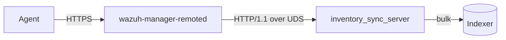

# Inventory Sync Server Architecture

## Overview

The module is a C++ shared library (`libinventory_sync_server.so`) loaded by
`wazuh-manager-modulesd` through a small C shim. It owns one worker thread and one HTTP-over-UDS
transport; it does not touch the router.

## Main components

- **The C shim** (`wazuh_modules/src/wm_inventory_sync_server.c`) reads the internal options and passes
  them across the C ABI as a POD struct. It reads them at CONFIGURATION time, not in the module's
  thread, so an out-of-range value is reported by `wazuh-modulesd -t` and fails the start rather than
  killing the daemon later.
- **The facade** owns the worker thread, the startup gate and the module lifecycle.
- **The transport** (`src/http_server/`) is a hand-written HTTP/1.1 server over `asio` and `llhttp`.
- **The endpoints** (`src/endpoints/`) are the route handlers.
- **The indexer seam** (`src/indexer/`) wraps the shared Indexer Connector behind interfaces so the
  startup gate can be tested without real indexer I/O.

## The transport

Each accepted connection becomes a `Session` whose socket handlers are bound to its own strand. That
binding is load-bearing rather than incidental: an accepted socket inherits the executor of the acceptor
that produced it, and the acceptor lives on a single shared strand, so without it every connection's I/O
would serialize onto that one strand and the configured I/O thread count would buy no parallelism at
all.

Admission control runs at headers-complete, before any body byte is read:

1. The route is resolved. No route means `404`, or `405` with an `Allow` header when the path exists
   under another verb.
2. The declared `Content-Length` plus a per-request overhead is reserved from the in-flight byte budget.
   Over budget means `503`.
3. Only then is the body read.

The per-request overhead is DERIVED from the configured header limits rather than being a constant, so
the budget cannot drift from the memory it is meant to bound.

An `accept()` that fails for a transient reason -- descriptor exhaustion, most likely, since the limit
is shared with every other module -- is logged (throttled) and the accept chain is re-armed. A chain
that returned without re-arming would leave the socket bound and the listener permanently deaf.

## The startup gate

Before the socket opens, three objects are built in order: the shared indexer session, the synchronous
connector and the asynchronous connector. Each is built at most once and memoised, because a successful
construction is a "configuration is valid" signal that cannot change without a restart.

The gate is "did construction throw", never "is the indexer reachable". The constructors validate
configuration synchronously and throw on failure, while a host that is merely unreachable does not --
so **the indexer is free to start after modulesd**. A failed attempt is retried on the worker's
heartbeat, with an escalating report: an ERROR naming the failing stage on the first attempt, debug for
the next hour, then one WARN per hour.

A socket path that could never be bound is the exception: it is validated up front and reported as
fatal, because nothing an operator does at runtime fixes it and running without ingress while looking
healthy is worse than not running.

## Two-phase shutdown

`stopAccepting()` establishes that no route handler will run again and no new connection is accepted,
while the I/O runtime stays alive so a response already handed to a handler can still be delivered.
`stop()` then drains what is outstanding, force-closes the remainder and joins the I/O threads.

Every wait in that path is bounded and named, and they are sized to add up to well under the budget the
init script gives the whole daemon before it escalates to `SIGKILL`.
