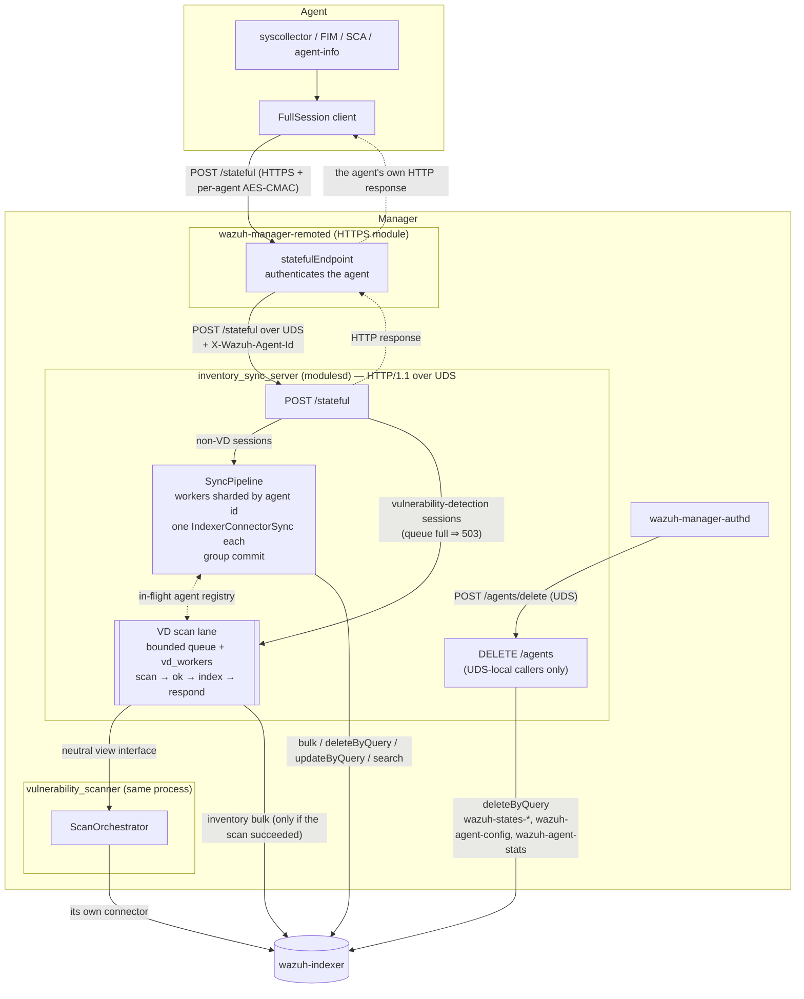
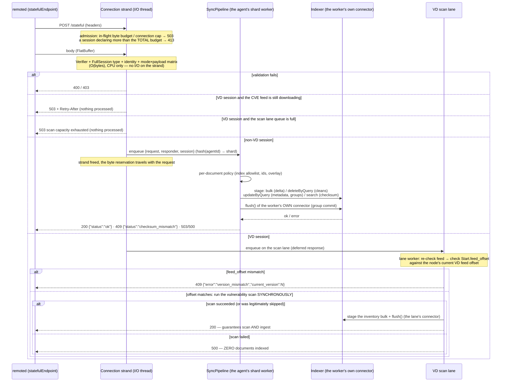
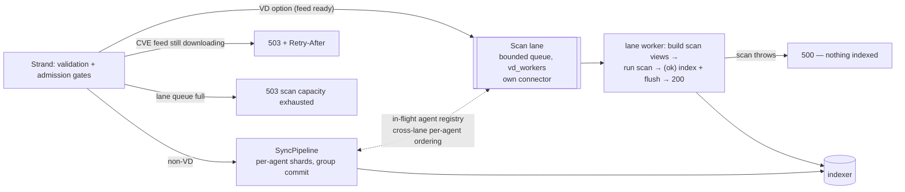

# Inventory Sync Server Architecture

## Overview

The module is a C++ shared library (`libinventory_sync_server.so`) loaded by
`wazuh-manager-modulesd` through a small C shim. It is the manager-side half of agent state
synchronization: a whole synchronization session travels as ONE FlatBuffers
`Message{FullSession}` request, and the HTTP response IS the session result — there are no acks,
no retransmission protocol, and no persistent session state.

Every hop is HTTP/1.1. The two ingestion-side routes are independent: `POST /stateful` (the only
one remoted relays for agents) and `DELETE /agents` (UDS-local manager daemons only — remoted has
no downstream route to it, by design).

## The request pipeline

The handler runs only the CPU-bound part on the connection's I/O strand — FlatBuffers
verification, identity, shape — and defers everything that touches the indexer to a worker,
answering later through the retained responder. That is what keeps the transport responsive
while sessions of arbitrary size are being applied.

What runs where, and what it can block:

| Stage | Thread | I/O | Bound |
|---|---|---|---|
| Admission + HTTP parse | connection strand | no | O(headers) |
| FlatBuffers verify + identity + shape | strand | no | O(body bytes), CPU only |
| Enqueue to a shard / the lane | strand | no | O(1); a full queue answers `503` immediately (explicit backpressure). The cap is `sync_queue_bytes` (64 MiB default), one GLOBAL byte counter across every shard — not per shard |
| Per-document policy + staging | shard worker | no | O(documents) |
| bulk/deleteByQuery/updateByQuery/search + flush | shard worker | yes | dominated by the indexer; only delays the agents of THAT shard |
| Scan + index + respond (VD sessions) | scan lane worker | yes | dominated by the scanner; only delays the lane, never the pipeline or the transport |

## The sync pipeline

`SyncPipeline` (`src/sync/`) owns N workers, each with its own private `IndexerConnectorSync`. A
session lands on `hash(agentId) % N`, which makes **per-agent ordering a property of the
topology** instead of a lock: two requests of the same agent — a cleans and the delta that
re-populates it, a delta and its checksum — are applied in arrival order because they traverse
the same FIFO. The private connector removes any cross-worker synchronization from the hot path.

Sessions divide into two scheduling kinds:

- **Bulk sessions** (delta data) only STAGE documents into the worker's connector; their
  durability — and their response — arrives with the batch flush. Workers **group-commit**: the
  flush happens when the staged bytes reach the flush threshold or the shard's queue drains, and
  only then is the whole batch answered `200`. Under low load the queue is empty after every
  session (flush-per-request latency); under a burst of small sessions the bulks grow on their
  own and the indexer sees a few large requests instead of a thousand tiny ones.
- **Immediate sessions** (cleans, checksum verification, metadata and group reconciliation, and
  whole-agent deletions) execute their own I/O and respond by themselves. Before running one, the
  worker **cuts the open batch** — flushes and answers it — because an immediate session's
  effects (deletes, a checksum read) must not overtake bulk writes of an EARLIER session of the
  same agent.

The `200` contract is strict on purpose: it is only sent after a successful `flush()`, so "the
agent saw 200" always means "the indexer accepted the data". A failed flush fails the whole open
batch; the status is picked by connector availability — `503` when the indexer is the problem
(the agent retries, exactly like any other not-ready condition), `500` otherwise (same retry, but
the log line is operator-actionable). Re-applying a session is idempotent (deterministic document
ids, versioned upserts), which is what makes "just re-POST it" the whole recovery story.

## The vulnerability-detection scan lane

Sessions whose `Start.option` is `VDFirst` or `VDSync` carry data the vulnerability scanner must
evaluate. They run through a dedicated lane so that the scan can GATE the response: a `200` for a
VD session guarantees the scan ran AND the inventory was flushed; a failed scan answers `500`
with **nothing indexed**.

The gates, in order:

| Situation | Answer | Why |
|---|---|---|
| CVE feed still downloading | `503` + `Retry-After` | Rejected WITHOUT processing, so the re-POST applies scan and ingest together and nothing ever blocks waiting for the feed. The delay is `inventory_sync_server_vd_feed_retry_after_seconds`. |
| Lane queue full | `503` `{"error":"scan capacity exhausted","code":503}` | The queue is deliberately short (`vd_scan_queue_slots`): scans are slow, and an early 503 beats a late timeout — a timed-out agent re-POSTs and re-does scan+ingest in full. |
| Scan succeeded | index + flush → `200` | The strong contract: 200 = scanned AND ingested. |
| Scan threw | `500` `{"error":"vulnerability scan failed","code":500}` | Zero documents indexed; the agent retries next cycle and the re-POST redoes both halves. |
| Scan legitimately skipped (scanner disabled) | index + `200` | Inventory must keep flowing even with the scanner off. |
| Shutdown | `503` to everything queued | The lane joins its workers; a scan in flight finishes (there is no cancellation point inside the scanner). |

Two pieces coordinate the lane with the rest of the system:

- **The in-flight agent registry** (`src/vd/agentInFlightRegistry.hpp`) is a per-agent,
  lane-aware exclusion map both dispatchers consult. The sync pipeline **parks** items of an
  agent whose scan is in flight (they stay queued, in order, without head-of-line blocking the
  shard's other agents), and the lane will not start a second scan for an agent that already has
  one running. Pipeline holds are reentrant (group commit holds several staged sessions of one
  agent at once); lane holds are not. Releases are lane-checked, so one lane can never free the
  other's hold.
- **The scan coordinator** (`src/vd/serverScanCoordinator.hpp`) registers with the scanner's
  coordination registry so a feed-update rescan (per-agent, on-demand via `/scan/vd`, or the
  master-only sweep over disconnected agents — see
  [vulnerability-scanner's architecture.md](../vulnerability-scanner/architecture.md#feed-update-rescan-scanvd--rescandisconnectedagents))
  and a session scan for the SAME agent never race: the scanner can ask which agents have sessions
  in flight, pause new dispatches for an agent, and drain what is already running before it
  rescans that agent. There is no fleet-wide coordination — each feed-update rescan fences only
  the one agent it is about to scan.

The scanner itself stays behind a **neutral view interface** — flat `string_view`/span structs —
so the boundary between the two modules carries no FlatBuffers types in either direction. The
production adapter is confined to a single translation unit (`src/vd/vdScannerAdapter.cpp`).

## Agent deletion

`DELETE /agents` (and its `POST /agents/delete` alias, for C callers whose HTTP helper only
speaks POST) deletes every document of one agent across the whole deletion scope —
`wazuh-states-*`, `wazuh-agent-config` and `wazuh-agent-stats` — scoped to this cluster: a
`deleteByQuery` on each, then one flush. The two `wazuh-agent-*` indices are named explicitly
because they sit outside the state family. The production caller is `wazuh-manager-authd`, right
after it removes the agent from `client.keys` and Wazuh DB.

The deletion is not executed inline: it is enqueued on the TARGET agent's pipeline shard as a
special item kind, so it orders FIFO against any in-flight session of that same agent — a
delete-then-reenroll can never resurrect state, and a scan in flight for that agent is respected
through the same registry. The HTTP status makes the outcome visible: `200` means every
delete-by-query in the scope was flushed (an index that does not exist counts as success, so
repeating a deletion is harmless); `503`/`500` tell the caller to retry. A `200` also means no
delete-by-query left documents behind: a per-shard failure or a skipped document (a version
conflict, which `conflicts: "proceed"` counts separately) fails the deletion instead of passing as
success, because with the agent gone nothing would ever overwrite what was missed.

authd retries up to three times with a widening pause (0 s, 1 s, 3 s), logging each pause at info
level because its writer thread is blocked meanwhile, and, when it gives up, logs a `WARNING` naming
the agent — separately for a request that never completed (no HTTP status: modulesd down or the
transfer timed out) and for one the server refused with a status. A warning, not an error: the agent
is already gone and cannot reconnect, so what is left behind is orphaned documents. It abandons the
retries if the daemon is shutting down, and the operator's recovery is to repeat the deletion.

Two windows this does NOT cover, both of which leave a document behind while still answering `200`,
and both cleared by repeating the deletion:

- The **index refresh interval**: a delete-by-query is a search, so documents the agent's last session
  wrote before the index refreshed are invisible to it. Refreshing each index first closed this, but
  `_refresh` needs the `indices:admin/refresh` privilege that the manager's least-privilege indexer
  role does not grant — every deletion failed with `403` — so it was removed pending that privilege.
- The **asynchronous write queue**: `POST /config` and `POST /stats` are written through the
  asynchronous connector, whose queue the deletion cannot drain, so a report still queued when the
  deletion runs lands after it and recreates that agent's document.

## The transport

The transport (`src/http_server/`) is a hand-written HTTP/1.1 server over `asio` and `llhttp`,
behind the module's own `IUdsHttpServer` interface. Each accepted connection becomes a `Session`
whose socket handlers are bound to its own strand. That binding is load-bearing rather than
incidental: an accepted socket inherits the executor of the acceptor that produced it, and the
acceptor lives on a single shared strand, so without it every connection's I/O would serialize
onto that one strand and the configured I/O thread count would buy no parallelism at all.

Admission control runs at headers-complete, before any body byte is read:

1. The route is resolved. No route means `404`, or `405` with an `Allow` header when the path
   exists under another verb.
2. The declared `Content-Length` plus a per-request overhead is reserved from the in-flight byte
   budget. Over the available budget means `503`; a request that declares more than the TOTAL
   budget could never be admitted and is answered `413`.
3. Only then is the body read.

The per-request overhead is DERIVED from the configured header limits rather than being a
constant, so the budget cannot drift from the memory it is meant to bound. There is no separate
per-request body cap by default: the in-flight budget IS the session size limit, and it bounds
the sum of everything in flight rather than each request in isolation.

Responses are **deferred by contract**: a handler receives an `IHttpResponder` it may answer from
any thread, long after the handler returned. The byte reservation is released when the request is
answered, so backpressure covers the whole life of a session, not just its read phase.

An `accept()` that fails for a transient reason — descriptor exhaustion, most likely, since the
limit is shared with every other module — is logged (throttled) and the accept chain is re-armed.
A chain that returned without re-arming would leave the socket bound and the listener permanently
deaf.

## The startup gate

Before the socket opens, three objects are built in order: the shared indexer session, the
synchronous connector and the asynchronous connector. Each is built at most once and memoised,
because a successful construction is a "configuration is valid" signal that cannot change without
a restart.

The gate is "did construction throw", never "is the indexer reachable". The constructors validate
configuration synchronously and throw on failure, while a host that is merely unreachable does
not — so **the indexer is free to start after modulesd**. A failed attempt is retried on the
worker's heartbeat, with an escalating report: an ERROR naming the failing stage on the first
attempt, debug for the next hour, then one WARN per hour.

Conditions the heartbeat can never fix are the exception, reported as fatal: a socket path that
could never be bound, an exception before the worker thread was launched, and a
`libinventory_sync_server.so` that cannot be loaded or does not export its entry points. Nothing
an operator does at runtime fixes any of them, and running without ingress while looking healthy
is worse than not running.

Once the gate passes, the facade builds the processing stages in dependency order: the in-flight
agent registry first (it must outlive both consumers), then the sync pipeline with one connector
per worker, then — when the scanner is linked in — the scan lane with its own connectors and the
coordinator registration. The HTTP routes are registered with **weak** references to all of it,
which is what makes shutdown destructive-by-construction: once `stop()` resets a stage, a late
request finds an expired pointer and answers `503` instead of touching freed state.

## Shutdown

`stopAccepting()` establishes that no route handler will run again and no new connection is
accepted, while the I/O runtime stays alive so a response already handed to a handler can still
be delivered. Teardown then walks the stages in reverse dependency order: the scan coordinator
unregisters (feed scans stop consulting a dying module), the scan lane stops (queued sessions are
answered `503`, the in-flight scan finishes and is answered), the pipeline stops (an OPEN batch
is answered `503` WITHOUT flushing — shutdown must not wait on indexer I/O, and the agents simply
re-POST on their next cycle), the registry is dropped, then the connectors and the session, and
finally `stop()` on the transport drains what is outstanding, force-closes the remainder and
joins the I/O threads.

Every wait in that path is bounded and named, and they are sized to add up to well under the
budget the init script gives the whole daemon before it escalates to `SIGKILL`.

## Observability

Every per-request failure condition keeps one throttled log line (90 s window; the first
occurrence always emits, so transitions are visible immediately): handler throws (answered
`500`), limit rejections (`411`/`413`/`414`/`431`), unknown routes (`404`/`405` — the trace that
catches a route mismatch with remoted), malformed HTTP, budget and connection-cap rejections,
identity mismatches (`403` on an authenticated channel is operator-relevant), feed-not-ready and
scan-capacity rejections, accept and session-bring-up failures, response write failures, and
per-phase timeouts.

The worker's heartbeat additionally polls the indexer connector and logs availability
*transitions* (WARN when it goes away, INFO when it comes back), and a session whose peer closes
while its response is still deferred is detected and released immediately instead of waiting out
the response timeout.

### Statistics (`GET /metrics`)

The module keeps lock-free runtime statistics (the shared `wazuh_metrics` library,
`src/shared_modules/metrics/` — relaxed-atomic counters and gauges, log-linear histograms for
percentiles) and dumps them on `GET /metrics` over the same local socket — see the
[API Reference](api-reference.md#get-metrics). What is measured, by stage:

| Stage | Metrics |
|---|---|
| Responses | `sync.requests.total.<code>` — one counter per contract status, counted exactly once at the send site (endpoint rejection, pipeline, or scan lane), plus a `sync.requests.total.other` catch-all for any status outside the contract |
| Pipeline | `sync.pipeline.shed.total` (queue-full refusals), `sync.shard.<i>.depth`/`.bytes` (live gauges per worker shard), `sync.session.duration.bulk`/`.immediate` (enqueue-to-response histograms, µs) |
| Group commit | `sync.bulk.flushes`, `sync.bulk.bytes.total`, `sync.bulk.sessions.total` |
| Documents | `sync.docs.indexed`, `sync.docs.skipped`, `sync.bytes.ingested` |
| VD lane | `vd.lane.depth` (gauge), `vd.lane.time` (queue+scan+index histogram), `vd.capacity.503.total`, `vd.retry_after.total`, `vd.scan.duration` (histogram), `vd.scans.ok`/`.failed`/`.skipped` |

Counters survive the module's internal restart retries on purpose (the registry is created once
per process and never reset), so totals read across a retry are cumulative.

## Design decisions

The decisions that shape the module, and what each one buys. This is the narrative distillation;
the complete numbered catalog (D1–D22, plus the functional and non-functional requirements it
answers to) lives in the module's in-tree developer README,
`src/wazuh_modules/inventory_sync_server/README.md`:

| # | Decision | Rationale |
|---|---|---|
| 1 | **A whole session is ONE request** (`FullSession`). No chunking, no gap tracking, no retransmission protocol. | The transport (TCP + HTTP) already guarantees ordered, complete delivery; re-implementing it above would only add states that can desynchronize. |
| 2 | **The HTTP response IS the result.** No acknowledgment messages, no out-of-band response channel. | Native request/response correlation: the agent always knows which session an answer belongs to, and a lost answer is just a retriable request. |
| 3 | **Idempotency instead of deduplication.** No session ids; re-applying a session converges to the same state (deterministic `_id`s, versioned upserts). | Retry logic on the agent stays trivially simple, and the server needs no dedup state. |
| 4 | **No local persistence.** Sessions are applied straight from the request body; the scan context for VD sessions is built from the body in RAM. | Nothing to recover, compact, or wipe; restart semantics are "the agent re-POSTs". |
| 5 | **The in-flight byte budget is the size limit** — no per-request body cap by default. A session declaring more than the total budget answers `413`. | One limit that actually bounds memory, instead of two that can contradict each other. |
| 6 | **Per-agent ordering by sharding**, not by locking: `hash(agentId) % workers`, one connector per worker, group commit. | Ordering becomes a topology property; the indexer sees few large bulks; no shared connector state on the hot path. |
| 7 | **A `200` means flushed.** Bulk responses wait for the group commit; immediate sessions flush inside their own execution. | "The agent saw success" and "the indexer has the data" can never diverge. |
| 8 | **Checksum verification is one attempt, no retry loop.** Mismatch answers `409` and the agent full-resyncs (a cleans + a full delta). | Retrying a deterministic comparison only delays the inevitable resync. |
| 9 | **VD sessions scan synchronously, and the scan gates indexing** — scan → ok → index → `200`; failure → `500` with nothing indexed. | A VD `200` certifies both halves; there is no window where inventory exists without its scan. |
| 10 | **Feed not ready ⇒ `503` + `Retry-After`, rejected without processing.** Nobody blocks waiting for the CVE feed. | The re-POST applies ingest and scan together; threads are never parked on a download that can take minutes. |
| 11 | **A short scan-lane queue** with immediate `503` on overflow, and per-agent cross-lane exclusion through a shared registry. | Early rejection beats late timeout; the pipeline and the lane can never interleave one agent's operations. |
| 12 | **The scanner boundary is a neutral view interface** — no FlatBuffers types cross between the modules, in either direction. | The schema can evolve without recompiling the scanner; the adapter is one translation unit. |
| 13 | **Agent deletion is an endpoint with a visible result**, deferred to the agent's shard. | The caller can retry a failed deletion instead of losing it silently, and deletion orders correctly against the agent's in-flight sessions. |
| 14 | **Ingress via remoted's authenticated `POST /stateful`** (per-agent AES-CMAC), with the authenticated id cross-checked against the session's claimed identity (`403` on mismatch). | Identity is enforced at the edge AND at the application layer; the body stays opaque to remoted. |
| 15 | **The credential keystore socket lives in its own module** (`keystore_server`). | The manager API's indexer credentials do not depend on the ingestion module's lifecycle. |
