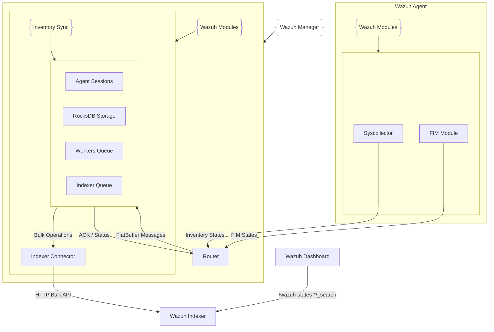

# Architecture

The **Inventory Sync module** implements a **session-based synchronization architecture** designed to ensure reliable transfer of inventory data from Wazuh agents to the Wazuh Indexer.
It leverages a combination of design patterns — **Facade**, **Template Method**, and **Publisher–Subscriber** — to modularize responsibilities, simplify extensibility, and provide scalable synchronization capabilities.

---

## Main Components

### **`inventorySyncFacade.hpp`**

The main orchestration component and entry point for inventory synchronization.
Responsibilities:

* Initializes local RocksDB storage for session-based data persistence.
* Subscribes to Router communication channels for incoming FlatBuffer messages.
* Manages agent session lifecycle, including creation, tracking, and timeouts.
* Coordinates IndexerConnector and ResponseDispatcher interactions.
* Implements the session-based synchronization protocol with unique session IDs.

---

### **`agentSession.hpp`**

Manages synchronization state and lifecycle for each agent.
Responsibilities:

* Tracks session lifecycle (Start → Data → End).
* Stores incoming data with session-prefixed keys in RocksDB.
* Validates integrity and detects gaps in sequences.
* Implements timeout and heartbeat validation.
* Coordinates acknowledgment handling with the ResponseDispatcher.

---

### **`context.hpp`**

Defines metadata for each synchronization session.
Responsibilities:

* Stores synchronization mode (ModuleFull, ModuleDelta, ModuleCheck, MetadataDelta, MetadataCheck, GroupDelta, GroupCheck).
* Maintains session ID, agent ID, and module name.
* Tracks agent context information (OS details, version, groups).
* Manages agent lock ownership flag for metadata/groups operations.
* Provides metadata to IndexerConnector and ResponseDispatcher.

---

### **`responseDispatcher.hpp`**

Handles outbound communication to agents.
Responsibilities:

* Sends acknowledgments upon successful synchronization.
* Reports errors and status updates.
* Routes responses based on session context.

---

## Synchronization Flow

The Inventory Sync protocol operates in **three phases**:

1. **Start Phase**

   * Agent initiates synchronization with a `START` message containing mode and agent context.
   * A unique session ID is generated.
   * Context is created, and RocksDB storage prepared.
   * For metadata/groups modes: agent is locked to prevent concurrent inventory sessions.

2. **Data Phase**

   * Agent transmits inventory data in chunks (for module modes).
   * Data is written into RocksDB with session-prefixed keys.
   * FlatBuffer validation ensures message integrity.
   * Both insert (upsert) and delete operations are supported.
   * For metadata/groups check modes: data phase is skipped (disaster recovery).

3. **End Phase**

   * Agent sends an `END` message.
   * Session data is processed by the IndexerConnector.
   * Bulk indexing/deletion operations are issued to the Indexer.
   * For disaster recovery modes: update-by-query operations scan all indices.
   * An acknowledgment is sent back, and session data is cleaned up.
   * Agent is unlocked if it was locked for metadata/groups operations.

---

## Agent Context Synchronization

### Metadata and Groups Updates

The module handles two types of agent context updates:

**Delta Operations** (MetadataDelta, GroupDelta):
* Triggered when agent metadata or group membership changes
* Updates `agent.*` fields on all existing documents for that agent
* Uses update-by-query to efficiently update documents across multiple indices
* Requires agent locking to prevent race conditions with concurrent inventory syncs

**Disaster Recovery** (MetadataCheck, GroupCheck):
* Periodic integrity checks to detect and fix inconsistencies
* Scans all documents for an agent across all indices
* Corrects any documents with outdated or incorrect agent context
* Ensures metadata/groups consistency after crashes, errors, or data corruption

### Agent Locking Mechanism

To prevent race conditions between inventory updates and metadata/groups updates:

1. **Lock Acquisition**: Metadata/groups sessions lock the agent before processing
2. **Session Waiting**: Module waits up to 60 seconds for active inventory sessions to complete
3. **Bulk Flush**: Pending bulk operations are flushed to allow sessions to finish quickly
4. **Safe Processing**: Once all sessions complete, metadata/groups update proceeds
5. **Lock Release**: Agent is unlocked after operation completes or on error/timeout
6. **Lock Tracking**: Context tracks which session owns the lock via `ownsAgentLock` flag

This ensures that inventory documents receive correct agent context without conflicts.

---

## High-Level Diagram

---

## Session Management

The module provides robust **session lifecycle management**:

* **Session Creation**: 64-bit random IDs prevent collisions.
* **Timeout Handling**: Configurable timeout (default: 10s) triggers cleanup.
* **Concurrency Control**: Thread-safe session map with shared/unique locks.
* **Data Persistence**: Session-scoped keys ensure isolation in RocksDB.
* **Error Recovery**: Automatic cleanup on timeouts or errors.

---

## Scalability Features

* **Asynchronous Processing**: Multi-threaded workers handle messages in concurrent way, using a producer-consumer approach.
* **Bulk Operations**: Efficient batching reduces Indexer overhead.
* **Memory Protection**: Temporary RocksDB storage prevents memory bloat.
* **Queue Management**: Configurable worker and Indexer queues enable backpressure control.
