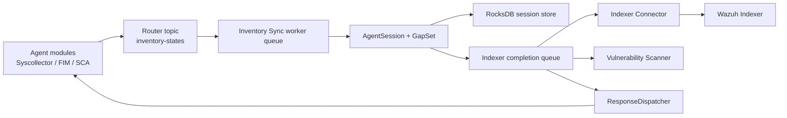

# Architecture

Inventory Sync is a **manager-only**, **session-oriented** synchronization service. Agents send FlatBuffer messages over the Router topic `inventory-states`; the manager validates those messages, stores session chunks in RocksDB, translates them into indexer operations, optionally triggers vulnerability scanning, and returns acknowledgments to the agent.

## Main components

### `src/wazuh_modules/inventory_sync/src/inventorySyncFacade.hpp`

This is the orchestration layer.

Responsibilities:

- Creates and clears the local RocksDB session store in `inventory_sync/`.
- Subscribes to the Router topic `inventory-states` with subscriber id `inventory-sync-module`.
- Validates and dispatches `Start`, `DataValue`, `DataBatch`, `DataContext`, `DataClean`, `ChecksumModule`, `End`, and `ReqRet` protocol messages.
- Owns the worker queue for inbound messages and the queue that serializes indexer-side completion work.
- Executes bulk indexing, delete-by-query, update-by-query, checksum verification, stale-session cleanup, and agent deletion.
- Triggers the Vulnerability Scanner for sessions marked with `VDFirst` or `VDSync`.

### `src/wazuh_modules/inventory_sync/src/agentSession.hpp`

This component owns the lifecycle of a single session.

Responsibilities:

- Parses the Start message into a `Context` object.
- Tracks expected and received sequence numbers with `GapSet`.
- Persists `DataValue` chunks as `{session}_{seq}`.
- Persists `DataContext` chunks as `{session}_{seq}_context`.
- Stores `DataClean` indices and `ChecksumModule` values in session state.
- Enqueues the session for final processing once `End` arrives and all required chunks are present.

### `src/wazuh_modules/inventory_sync/src/context.hpp`

`Context` stores the per-session metadata used by both indexing and downstream consumers:

- Synchronization mode and option.
- Session id, module name, agent id, agent identity fields, and group list.
- Target index list.
- Global version for metadata and group updates.
- Cluster name and cluster node from the Start message.
- Lock ownership for metadata and group reconciliation flows.
- Checksum data for `ModuleCheck`.
- Deferred `DataClean` index set.

### `src/wazuh_modules/inventory_sync/src/responseDispatcher.hpp`

This component sends `StartAck`, `EndAck`, and retransmission requests back to the agent through the Router/response path.

### `src/wazuh_modules/inventory_sync/src/inventorySyncQueryBuilder.hpp`

This component builds the OpenSearch update and search queries used for:

- Metadata updates.
- Group updates.
- Metadata recovery checks.
- Group recovery checks.
- Module checksum validation.

## Supported synchronized data

Inventory Sync currently processes these module families:

- **`syscollector`**: inventory system, hardware, hotfixes, packages, processes, ports, interfaces, protocols, networks, users, groups, services, and browser extensions.
- **`fim`**: `wazuh-states-fim-files`, `wazuh-states-fim-registry-keys`, and `wazuh-states-fim-registry-values`.
- **`sca`**: `wazuh-states-sca`.

It also handles manager-side **agent metadata** and **group membership** reconciliation across already indexed state documents.

## End-to-end flow

```mermaid
flowchart LR
  Agent["Agent modules\nSyscollector / FIM / SCA"] --> Router["Router topic\ninventory-states"]
  Router --> Workers[Inventory Sync worker queue]
  Workers --> Session[AgentSession + GapSet]
  Session --> RocksDB[RocksDB session store]
  Session --> EndQueue[Indexer completion queue]
  EndQueue --> Indexer[Indexer Connector]
  EndQueue --> VD[Vulnerability Scanner]
  EndQueue --> Ack[ResponseDispatcher]
  Indexer --> OpenSearch[Wazuh Indexer]
  Ack --> Agent
```

The protocol is organized around three phases:

1. **Start**

- The agent opens a session with module name, mode, option, message count, target indices, agent identity, groups, and cluster fields.
- The manager assigns a 64-bit session id and replies with `StartAck`.
- The session is rejected if the indexer is unavailable, the agent is locked for metadata or group maintenance, or the configured session limit is reached.

2. **Data**

- `DataValue` carries upsert or delete operations for indexable state documents.
- `DataBatch` carries multiple `DataValue` entries in one protocol message; Inventory Sync unwraps them and stores them as individual session entries.
- `DataContext` carries auxiliary context data. Inventory Sync stores it in RocksDB and tracks its sequence number, but does not index it directly.
- `DataClean` requests `deleteByQuery` against one or more indices for the current agent.
- `ChecksumModule` provides the agent checksum used by `ModuleCheck`.
- `GapSet` tracks missing ranges and supports retransmission requests.

3. **End**

- Once `End` is received and all required chunks are present, the session is moved to the indexer completion queue.
- The manager executes indexing, deletion, update-by-query, checksum verification, or vulnerability scanning according to the session mode.
- The session store is deleted and `EndAck` is returned when processing completes.

## Synchronization modes

Inventory Sync supports these synchronization modes:

- `ModuleFull`: delete all documents for the agent in the Start indices, then index the session payload.
- `ModuleDelta`: apply only the `DataValue` upserts and deletes received in the session.
- `ModuleCheck`: compare the agent checksum with the manager checksum for the target index.
- `MetadataDelta`: update agent metadata fields on existing state documents.
- `MetadataCheck`: repair stale or inconsistent metadata through update-by-query.
- `GroupDelta`: update `wazuh.agent.groups` on existing state documents.
- `GroupCheck`: repair stale or inconsistent groups through update-by-query.

## Message handling details

### `DataValue`

- Stored in RocksDB as `{session}_{seq}`.
- Replayed at End time into `bulkIndex` or `bulkDelete` calls.
- Enriched by the manager with `wazuh.agent.*` and `wazuh.cluster.name` metadata before indexing.

### `DataBatch`

- Supported by the current schema and implementation.
- Used to ship many `DataValue` entries in one message.
- Inventory Sync unpacks the batch and stores each item as an individual session record so the rest of the pipeline remains unchanged.

### `DataContext`

- Stored in RocksDB as `{session}_{seq}_context`.
- Excluded from indexer replay.
- Participates in gap tracking and retransmission.
- Can still be consumed by downstream session logic, including vulnerability-scanner flows that use the session RocksDB contents.

### `DataClean`

- Adds indices to `Context.dataCleanIndices`.
- At End time, Inventory Sync issues `deleteByQuery(index, agentId)` for each requested index.

### `ChecksumModule`

- Used only for `ModuleCheck`.
- Stores the agent checksum and checksum target index in the session context.
- The manager computes its own checksum-of-checksums from indexed documents and compares the values before acknowledging the session.

## Metadata and group coordination

Metadata and group updates use a stronger coordination path than normal inventory sync.

Behavior:

- The agent is locked before metadata or group reconciliation begins.
- Pending indexer bulk work is flushed first.
- The manager waits up to **60 seconds** for other active sessions for that agent to finish.
- If sessions remain after the timeout, they are treated as zombie sessions and cleaned up.
- The lock is released only after the update-by-query operation completes or the session fails.

This prevents race conditions where inventory data would be indexed with stale metadata or stale group lists.

## Reliability and cleanup

Inventory Sync includes several consistency mechanisms:

- **Gap detection and retransmission** through `GapSet` and `ReqRet`.
- **Stale-session cleanup** for sessions inactive for **20 minutes**.
- **Periodic cleanup sweep** every **10 minutes**.
- **Checksum validation** with retry logic for `ModuleCheck` to tolerate indexer propagation delays.
- **Startup cleanup** of the `inventory_sync/` RocksDB directory before the module starts serving new sessions.

## Vulnerability Scanner integration

When the Start option is `VDFirst` or `VDSync`, Inventory Sync can invoke the Vulnerability Scanner after session persistence and indexer work setup.

Current behavior:

- If the Vulnerability Scanner is disabled, Inventory Sync skips the scan and still completes the session.
- If the scanner is enabled but the CVE feed is not ready, the session waits until the scanner reports readiness or stops.
- Once ready, the scanner builds its own context from the same Inventory Sync session data stored in RocksDB.

This means Inventory Sync is not only an indexing service. It is also the synchronization boundary that feeds downstream vulnerability analysis.
