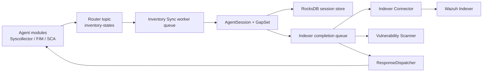

# Architecture

Inventory Sync is a **manager-only**, **session-oriented** synchronization service. Agents send FlatBuffer messages over the Router topic `inventory-states`; the manager validates those messages, stores session chunks in RocksDB, translates them into indexer operations, optionally triggers vulnerability scanning, and returns acknowledgments to the agent.

## Main components

### `src/wazuh_modules/inventory_sync/src/inventorySyncFacade.hpp`

This is the orchestration layer.

Responsibilities:

- Creates and clears the local RocksDB session store in `queue/inventory_sync/`.
- Subscribes to the Router topic `inventory-states` with subscriber id `inventory-sync-module`.
- Validates and dispatches the FlatBuffer protocol messages: `Start`, `DataValue`, `DataBatch`, `DataContext`, `DataClean`, `ChecksumModule`, and `End`.
- Also accepts a **JSON control message** on the same topic — `{"command":"delete_agent","agent_id":"<id>"}` — which issues a `deleteByQuery` for that agent across `wazuh-states-*` (scoped to the cluster). This is how agent removal purges state documents.
- Owns the multi-threaded input worker queue (`cpp_get_nproc()` threads) and the single-threaded queue that serializes indexer-side completion work.
- Enforces an **index allowlist** (`isAgentScopedStateIndex`): only `wazuh-states-inventory-*`, `wazuh-states-fim-*`, `wazuh-states-sca`/`-*`, and `wazuh-states-vulnerabilities` are accepted; `wazuh-states-vulnerabilities` may only be targeted by `DataClean`, never written by an agent.
- Overlays manager-controlled `wazuh.agent.*` / `wazuh.cluster.name` metadata on every upserted document, so an agent cannot spoof another agent or cluster.
- Executes bulk indexing, delete-by-query, update-by-query, checksum verification, stale-session cleanup, and agent deletion.
- Triggers the Vulnerability Scanner for sessions marked with `VDFirst` or `VDSync`, and coordinates with the scanner's feed-update rescan.
- Runs a small **keystore socket server** on `queue/sockets/keystore` (`GET`/`PUT`/`DELETE` against the manager keystore column families) used by dependent components.

Document `_id` values are built as `{clusterName}_{agentId}_{DataValue.id}`, and the optional `DataValue.version` is forwarded to the indexer as the external document version.

### `src/wazuh_modules/inventory_sync/src/agentSession.hpp`

This component owns the lifecycle of a single session.

Responsibilities:

- Parses the Start message into a `Context` object.
- Tracks expected and received sequence numbers with `GapSet`.
- Persists `DataValue` chunks as `{session}_{seq}`.
- Persists `DataContext` chunks as `{session}_{seq}_context`.
- Stores `DataClean` indices and `ChecksumModule` values in session state.
- Enqueues the session for final processing once `End` arrives and all required chunks are present.

### `src/wazuh_modules/inventory_sync/src/context.hpp`

`Context` stores the per-session metadata used by both indexing and downstream consumers:

- Synchronization mode and option.
- Session id, module name, agent id, agent identity fields, and group list.
- Target index list.
- Global version for metadata and group updates.
- Cluster name and cluster node from the Start message.
- Lock ownership for metadata and group reconciliation flows.
- Checksum data for `ModuleCheck`.
- Deferred `DataClean` index set.

### `src/wazuh_modules/inventory_sync/src/responseDispatcher.hpp`

This component sends `StartAck`, `EndAck`, and `ReqRet` (retransmission) messages back to the agent. Responses are written to the manager active-response datagram socket `queue/sockets/ar` (`ARQUEUE_PATH`), framed as `(msg_to_agent) [] N!s <agentId> <size> <module>_sync <flatbuffer>`. `remoted` forwards them to the agent, where the module's Agent Sync Protocol instance parses them (`parseResponseBuffer`). Note this is a **different channel** from the inbound path: requests arrive over the Router topic `inventory-states`, replies leave over the AR socket.

### `src/wazuh_modules/inventory_sync/src/inventorySyncQueryBuilder.hpp`

This component builds the OpenSearch update and search queries used for:

- Metadata updates.
- Group updates.
- Metadata recovery checks.
- Group recovery checks.
- Module checksum validation.

## Supported synchronized data

Inventory Sync currently processes these module families:

- **`syscollector`**: inventory system, hardware, hotfixes, packages, processes, ports, interfaces, protocols, networks, users, groups, services, and browser extensions.
- **`fim`**: `wazuh-states-fim-files`, `wazuh-states-fim-registry-keys`, and `wazuh-states-fim-registry-values`.
- **`sca`**: `wazuh-states-sca`.

It also handles manager-side **agent metadata** and **group membership** reconciliation across already indexed state documents.

## End-to-end flow

```mermaid
flowchart LR
  Agent["Agent modules\nSyscollector / FIM / SCA"] --> Router["Router topic\ninventory-states"]
  Router --> Workers[Inventory Sync worker queue]
  Workers --> Session[AgentSession + GapSet]
  Session --> RocksDB[RocksDB session store]
  Session --> EndQueue[Indexer completion queue]
  EndQueue --> Indexer[Indexer Connector]
  EndQueue --> VD[Vulnerability Scanner]
  EndQueue --> Ack[ResponseDispatcher]
  Indexer --> OpenSearch[Wazuh Indexer]
  Ack --> Agent
```

For the full call sequence across agent, manager, and indexer — plus a level-by-level walkthrough from concept down to specific functions — see [Data Flow and Sequence of Calls](data-flow.md).

The protocol is organized around three phases:

1. **Start**

- The agent opens a session with module name, mode, option, message count, target indices, agent identity, groups, and cluster fields.
- The manager assigns a random 64-bit session id and replies with `StartAck(Status_Ok, session)`.
- Start is rejected before a session is created when:
  - the agent is **locked** (metadata/group reconciliation or feed-update scan in progress) → `StartAck(Status_Error)`;
  - the indexer is **unavailable** → `StartAck(Status_Offline)`;
  - the **session limit** (`maxSessions`) is reached → `StartAck(Status_Offline)`;
  - the global **DataValue quota** cannot cover the declared `size` → `StartAck(Status_Offline)`.
- A stale session for the same `{agent, module}` pair is cleaned up first, so an agent or `modulesd` restart does not leak the previous session.
- The `module` field is `syscollector`, `fim`, `sca`, or `syscollector_vd` (the vulnerability-detector data stream, see below). `syscollector_vd` Start messages are exempt from the global all-agents lock (held during shutdown) but still honor the per-agent lock.

2. **Data**

- `DataValue` carries upsert or delete operations for indexable state documents.
- `DataBatch` carries multiple `DataValue` entries in one protocol message; Inventory Sync unwraps them and stores them as individual session entries.
- `DataContext` carries auxiliary context data. Inventory Sync stores it in RocksDB and tracks its sequence number, but does not index it directly.
- `DataClean` requests `deleteByQuery` against one or more indices for the current agent.
- `ChecksumModule` provides the agent checksum used by `ModuleCheck`.
- `GapSet` tracks missing ranges and supports retransmission requests.

3. **End**

- When `End` arrives with all required chunks present, the manager immediately replies with `EndAck(Status_Processing)` and moves the session to the indexer completion queue. The agent treats `Processing` as "keep waiting" — it does not resend `End` and does not consume a retry.
- If chunks are still missing, the manager replies with `ReqRet` carrying the missing sequence ranges instead, and the agent retransmits.
- The completion worker then executes indexing, deletion, update-by-query, checksum verification, or vulnerability scanning according to the session mode.
- When processing finishes, the session store is deleted and a final `EndAck` is returned: `Status_Ok`, `Status_Error`, or (for `ModuleCheck`) `Status_ChecksumMismatch`.

## Synchronization modes

Inventory Sync supports these synchronization modes:

- `ModuleFull`: delete all documents for the agent in the Start indices, then index the session payload.
- `ModuleDelta`: apply only the `DataValue` upserts and deletes received in the session.
- `ModuleCheck`: compare the agent checksum with the manager checksum for the target index.
- `MetadataDelta`: update agent metadata fields on existing state documents.
- `MetadataCheck`: repair stale or inconsistent metadata through update-by-query.
- `GroupDelta`: update `wazuh.agent.groups` on existing state documents.
- `GroupCheck`: repair stale or inconsistent groups through update-by-query.

## Message handling details

### `DataValue`

- Stored in RocksDB as `{session}_{seq}`.
- Replayed at End time into `bulkIndex` or `bulkDelete` calls.
- Enriched by the manager with `wazuh.agent.*` and `wazuh.cluster.name` metadata before indexing.

### `DataBatch`

- Supported by the current schema and implementation.
- Used to ship many `DataValue` entries in one message.
- Inventory Sync unpacks the batch and stores each item as an individual session record so the rest of the pipeline remains unchanged.

### `DataContext`

- Stored in RocksDB as `{session}_{seq}_context`.
- Excluded from indexer replay (the bulk loop skips `_context` keys).
- Participates in gap tracking and retransmission.
- **Consumed by the Vulnerability Scanner** for `VDSync` sessions: it is the surrounding, unchanged inventory (e.g. the OS row for a changed package) that the scanner needs to correlate a delta. The scanner reads it straight from the session RocksDB store. (Note: an in-code comment still describes this as a "future implementation" — that comment is stale; the scanner reads these entries today.)

### `DataClean`

- Adds indices to `Context.dataCleanIndices`.
- At End time, Inventory Sync issues `deleteByQuery(index, agentId)` for each requested index.

### `ChecksumModule`

- Used only for `ModuleCheck`.
- Stores the agent checksum and checksum target index in the session context.
- The manager computes its own checksum-of-checksums from indexed documents and compares the values before acknowledging the session.

## Metadata and group coordination

Metadata and group updates use a stronger coordination path than normal inventory sync.

Behavior:

- The agent is locked before metadata or group reconciliation begins.
- Pending indexer bulk work is flushed first.
- The manager waits up to **60 seconds** for other active sessions for that agent to finish.
- If sessions remain after the timeout, they are treated as zombie sessions and cleaned up.
- The lock is released only after the update-by-query operation completes or the session fails.

This prevents race conditions where inventory data would be indexed with stale metadata or stale group lists.

## Reliability and cleanup

Inventory Sync includes several consistency mechanisms:

- **Gap detection and retransmission** through `GapSet` and `ReqRet`.
- **Stale-session cleanup** for sessions inactive for **20 minutes**.
- **Periodic cleanup sweep** every **10 minutes**.
- **Checksum validation** with retry logic for `ModuleCheck` to tolerate indexer propagation delays.
- **Startup cleanup** of the `queue/inventory_sync/` RocksDB directory (`remove_all`) before the module starts serving new sessions.

## Vulnerability Scanner integration

The `syscollector_vd` module is a second Agent Sync Protocol stream inside the agent's syscollector, dedicated to vulnerability-relevant inventory (packages, OS/system, hotfixes). Its sessions carry a `VDFirst` or `VDSync` option, and Inventory Sync invokes the Vulnerability Scanner after the inventory documents have been persisted and the indexer work is set up.

- **`VDFirst`** — the agent's first vulnerability sync. Everything is sent as `DataValue`. The scanner deletes the agent's prior vulnerability documents and runs a full first scan.
- **`VDSync`** — an incremental sync. Only changed rows are sent as `DataValue`; the surrounding unchanged inventory the scanner needs for correlation (e.g. the OS row for a changed package, plus hotfixes on Windows) is sent as `DataContext`. The scanner runs a package-delta scan, escalating to a full scan when the OS/hotfix data changed.

How the hand-off works ([`inventorySyncFacade.hpp`](../../../../src/wazuh_modules/inventory_sync/src/inventorySyncFacade.hpp) End-processing branch):

- If the Vulnerability Scanner is not initialized/disabled, Inventory Sync skips the scan and still completes the session.
- If the scanner is enabled but the CVE feed is not ready (e.g. first manager startup while the feed downloads), the session blocks in `waitForFeedReady()`. The agent has already received `EndAck(Status_Processing)` and keeps waiting; it gets the final `Status_Ok` once the scan finishes.
- Once ready, the scanner reads the **same session data from RocksDB** (`{session}_*` keys, including the `_context` DataContext entries) to build its own `ScanContext`; it does **not** re-read the indexed documents. Inventory Sync passes the shared `Context` and the RocksDB store handle into `VulnerabilityScannerFacade::runScanner(store, context)`.
- The scanner writes its results to `wazuh-states-vulnerabilities` through its **own** Indexer Connector. Inventory Sync never writes that index.

### Feed-update rescan coordination

When the CVE feed updates, the scanner runs a full rescan of every agent. This is coordinated with in-flight `syscollector_vd` sessions so no agent is scanned against half-written data and no agent is scanned twice:

- Before it marks the feed ready, the scanner snapshots agents that currently hold a `VDFirst` session (`getAgentsWithActiveSessionForModule("syscollector_vd", VDFirst)`) — those agents are already getting a full scan and are excluded from the feed-update rescan.
- The scanner then calls back into Inventory Sync via `waitForAllVDSyncSessions(60s, 5)` to let active `VDSync` sessions drain. Those sessions see `isFeedUpdateScanInProgress()` and self-skip their own delta scan, because the feed-update full scan already covers them.
- Concurrent `VDFirst` scans for the same agent are de-duplicated (`m_activeVDFirstScans`) to prevent racing vulnerability-cleanup passes. After a `VDFirst` scan completes, the agent is registered as feed-update-covered.

This makes Inventory Sync not only an indexing service but the synchronization boundary that feeds — and paces — downstream vulnerability analysis.
