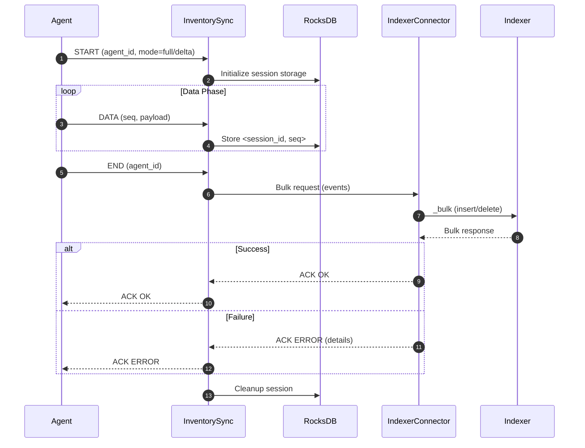

# Configuration

The **Inventory Sync** module is designed to run with minimal configuration, working out of the box with default settings. It acts as a synchronization intermediary, relying primarily on the **Indexer Connector** configuration for indexing operations.

The module itself does not expose dedicated options in **`ossec.conf`**. Instead, it inherits operational parameters from the Indexer Connector.

---

## Connection to Wazuh Indexer

Inventory Sync delegates all indexing tasks to the **Indexer Connector**.
Incoming FlatBuffer messages from agents are processed and grouped into **bulk operations**, which are then sent to the Indexer for efficient storage.

**Default Indexer Connector configuration block:**

```xml
  <indexer>
    <enabled>yes</enabled>
    <hosts>
      <host>https://0.0.0.0:9200</host>
    </hosts>
    <ssl>
      <certificate_authorities>
        <ca>/etc/filebeat/certs/root-ca.pem</ca>
      </certificate_authorities>
      <certificate>/etc/filebeat/certs/filebeat.pem</certificate>
      <key>/etc/filebeat/certs/filebeat-key.pem</key>
    </ssl>
  </indexer>
```

> **Note**: Only secure (TLS/SSL) connections are supported. Plaintext connections to the Indexer are not allowed.

---

## Module Parameters

The module relies on internal constants that define synchronization behavior:

| Parameter           | Default Value                  | Purpose                                                          |
| ------------------- | ------------------------------ | ---------------------------------------------------------------- |
| **Session Timeout** | 10 seconds (2 × DEFAULT\_TIME) | Defines how long a session remains active without receiving data |
| **Thread Count**    | 1                              | Dedicated thread for Indexer operations                          |
| **Topic**           | `inventory-states`             | Router topic subscription                                        |
| **Subscriber ID**   | `inventory-sync-module`        | Router subscriber identity                                       |
| **Storage Path**    | `inventory_sync/`              | RocksDB directory for session data                               |

---

## Connection Verification

Before starting synchronization, verify Indexer health via the **`/_cluster/health`** endpoint.

**Example response:**

```json
{
  "cluster_name": "wazuh-cluster",
  "status": "green",
  "number_of_nodes": 1,
  "active_primary_shards": 15,
  "active_shards_percent_as_number": 100
}
```

A **green** status indicates the cluster is healthy and ready.

---

## Connection Testing

The connection can be validated manually with `curl`, using the proper CA, certificate, and key:

```console
curl --cacert <root_CA_path> --cert <cert_path> --key <key_path> \
     https://<indexer-ip>:9200/_cluster/health
```

---

## Session Storage

The Inventory Sync module uses **RocksDB** for temporary session data:

* **Location**: `inventory_sync/` directory (relative to Wazuh working dir)
* **Key Format**: `<session_id>_<sequence>` to isolate per-session data
* **Cleanup Policy**: Automatic cleanup at startup and after session completion

This ensures persistence during ongoing syncs without exhausting memory.

---

## Router Configuration

The module relies on the **Router** for message delivery from agents:

* **Topic**: `inventory-states`
* **Subscriber ID**: `inventory-sync-module`
* **Message Format**: FlatBuffer-encoded synchronization messages

The Router must be properly configured and running for Inventory Sync to receive agent updates.

---

# Synchronization Sequence

The following diagram illustrates the three synchronization phases (**Start → Data → End**) between Agent, Inventory Sync, and Indexer:

