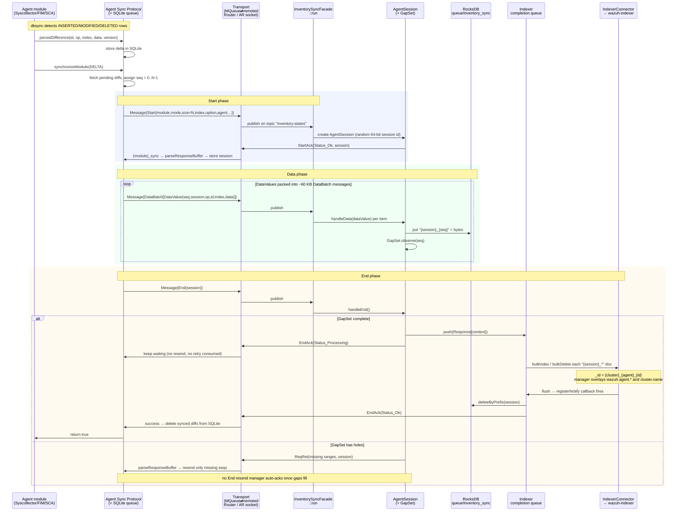
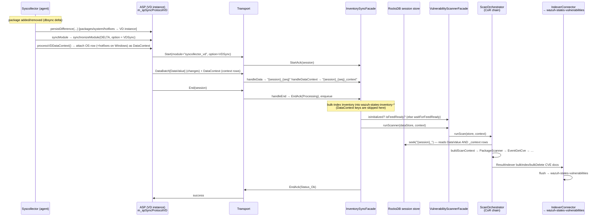
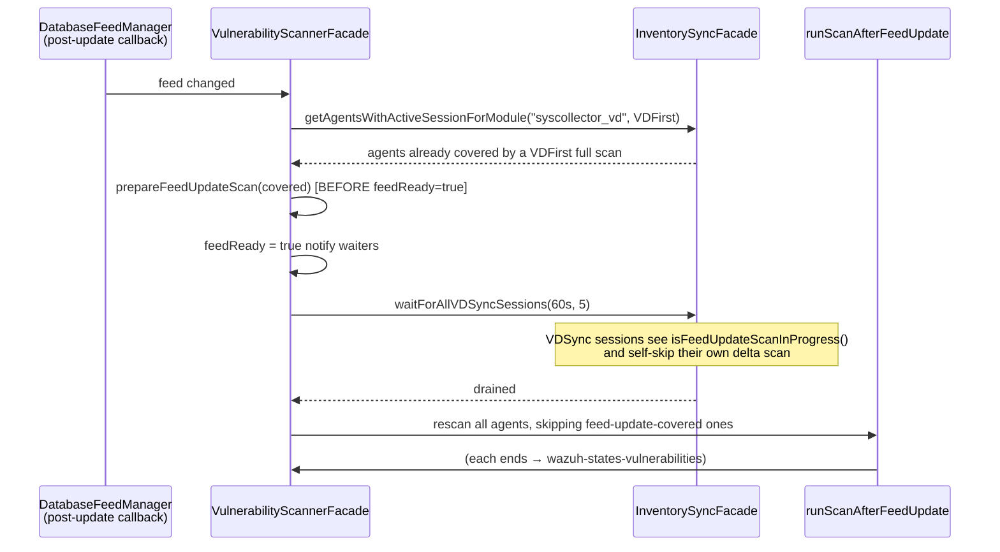

# Data Flow and Sequence of Calls

This document traces the **sequence of calls between the agent, the manager, and the Wazuh Indexer** for an Inventory Sync session, and then explains the same flow **from the most abstract level down to the specific classes and functions**, using the Vulnerability Detector (VD) as the worked example.

It complements:

- [Architecture](architecture.md) — manager-side components and responsibilities.
- [FlatBuffers](flatbuffers.md) — the on-the-wire message schema.
- [Agent Sync Protocol](../utils/sync-protocol/README.md) — the agent-side library that drives the protocol (its [sequence diagrams](../utils/sync-protocol/sequence-diagrams.md) treat the manager as a black box; this document opens that box).

## Who is who

Inventory Sync has **two sides** connected by two transports:

| Side | Component | Where |
|------|-----------|-------|
| Agent | Module (Syscollector / FIM / SCA / agent-info) | `wazuh_modules/*`, `syscheckd/*` |
| Agent | **Agent Sync Protocol** (`AgentSyncProtocol`) + SQLite queue | `src/shared_modules/sync_protocol/` |
| Transport ↑ | MQueue (`SYNC_MQ='s'`) → `wazuh-agentd` → `remoted` → Router topic `inventory-states` | `mqueue_transport.cpp`, `remoted/src/secure.c` |
| Manager | **Inventory Sync** facade, `AgentSession`, `GapSet`, RocksDB, indexer queue | `src/wazuh_modules/inventory_sync/` |
| Manager | **Indexer Connector** → Wazuh Indexer (`wazuh-states-*`) | `src/wazuh_modules/*/indexerConnector` |
| Manager | **Vulnerability Scanner** (for `VDFirst`/`VDSync`) → `wazuh-states-vulnerabilities` | `src/wazuh_modules/vulnerability_scanner/` |
| Transport ↓ | AR datagram socket `queue/sockets/ar` (`<module>_sync` framing) → `remoted` → agent | `responseDispatcher.hpp`, `client-agent/src/receiver.c` |

The two transports are **asymmetric**: requests travel agent → manager over the Router topic `inventory-states`; responses travel manager → agent over the active-response (`ar`) socket, framed as `(msg_to_agent) [] N!s <agentId> <size> <module>_sync <flatbuffer>`.

## 1. Session lifecycle — a normal inventory delta sync

This is the control-plane handshake for `syscollector` / `fim` / `sca` in `ModuleDelta` (or `ModuleFull`). Transport hops (MQueue → agentd → remoted → Router, and the AR socket back) are collapsed into a single **Transport** lane for readability.

Mode-specific completion (all reach the indexer completion queue the same way, then branch in the facade's `run` callback):

- **`ModuleFull`** — `deleteByQuery(index, agent)` for every Start index first, then bulk-index the session payload.
- **`ModuleDelta`** — bulk-index/delete only the received `DataValue`s.
- **`ModuleCheck`** — no data; compute a checksum-of-checksums from the indexed docs and compare with the agent's `ChecksumModule` (5 retries, 10 s apart) → `EndAck(Ok)` or `EndAck(ChecksumMismatch)`.
- **`MetadataDelta` / `MetadataCheck` / `GroupDelta` / `GroupCheck`** — no data; lock the agent, flush pending bulk work, wait up to 60 s for the agent's other sessions to drain, then run an `update_by_query` (Painless script) across the agent's state indices.

## 2. Vulnerability Detector hand-off (`syscollector_vd`)

`syscollector_vd` is **not a separate module** — it is a second Agent Sync Protocol instance inside Syscollector, backed by its own SQLite DB (`syscollector_vd_sync.db`). It carries the same inventory (packages / OS / hotfixes) but with option `VDFirst` (first full scan, everything as `DataValue`) or `VDSync` (delta: changes as `DataValue`, surrounding unchanged rows the scanner needs for correlation as `DataContext`).

The key difference from a plain inventory sync is the **data-plane hand-off after End**: once the inventory documents are indexed, the facade calls the Vulnerability Scanner, which re-reads the *same RocksDB session data* (including the `_context` entries Inventory Sync itself never indexes) and writes CVE findings to `wazuh-states-vulnerabilities` through its **own** Indexer Connector.

Chain selected by option (built once in `ScanOrchestrator` via `FactoryOrchestrator`):

- **`VDFirst`** → *FirstFullScan*: `OsScanner → PackageScanner → EventDetailsBuilder → ResultIndexer` (alerts suppressed on the first scan). The agent's prior vulnerability docs are `deleteByQuery`-purged first.
- **`VDSync`, packages only** → *PackagesDelta*: `PackageScanner → EventGetCve → EventDetailsBuilder → EventSendReport → ResultIndexer`.
- **`VDSync`, OS/hotfix changed** → *FullScan*: `EventGetContext → OsScanner → PackageScanner → EventDetailsBuilder → EventSendReport → ResultIndexer`.

### Feed-update rescan coordination (bidirectional)

When the CVE feed updates, the scanner rescans every agent — and coordinates with in-flight `syscollector_vd` sessions so nobody is scanned against half-written data or scanned twice:

## 3. From abstract to specific

The same flow, described at four levels of zoom. The worked example is **"a package changes on an agent → a CVE document appears in the indexer."**

### Level 1 — Conceptual

The agent continuously observes local state (files, packages, checks). Instead of shipping full snapshots, it ships **deltas** with sequence numbers over a reliable, session-based protocol. The manager reconciles those deltas into the Wazuh Indexer so `wazuh-states-*` always reflects current agent state. For vulnerability data, the manager additionally runs a scanner that turns package/OS inventory into CVE findings.

### Level 2 — Contracts and boundaries

- **Agent Sync Protocol** (`shared_modules/sync_protocol`) is the single agent-side API every module uses: `persistDifference`, `synchronizeModule`, `requiresFullSync`, `synchronizeMetadataOrGroups`, `notifyDataClean`, `parseResponseBuffer`. State lives in a per-module SQLite queue.
- **Inventory Sync** (`wazuh_modules/inventory_sync`) is the manager-side authority: it owns session state, RocksDB persistence, indexer operations, and response dispatch.
- The **contract** between them is the FlatBuffer schema `inventorySync.fbs` (`Start`, `DataValue`, `DataBatch`, `DataContext`, `DataClean`, `ChecksumModule`, `End`, `StartAck`, `EndAck`, `ReqRet`).
- The **Vulnerability Scanner** consumes an Inventory Sync session's RocksDB contents through `VulnerabilityScannerFacade::runScanner(store, context)` and owns the `wazuh-states-vulnerabilities` index.

### Level 3 — Message and session flow

Start → StartAck(session) → [DataBatch(seq…) + DataContext] → End → EndAck(Processing) → (bulk index + optional scan) → EndAck(Ok/Error/ChecksumMismatch). `GapSet` tracks completeness and drives `ReqRet` retransmission. Metadata/Group and ModuleCheck modes carry no data. See [Architecture › End-to-end flow](architecture.md#end-to-end-flow).

### Level 4 — Specific classes and functions

Agent side (Syscollector VD example):

| Step | Symbol | File |
|------|--------|------|
| dbsync delta callback | `Syscollector::notifyChange` → `m_persistDiffFunction` | `wazuh_modules/syscollector/src/syscollectorImp.cpp` |
| route package/OS/hotfix to the VD stream | `persistDifference` → `m_spSyncProtocolVD` | `syscollectorImp.cpp:2389` |
| pick full vs delta | `syncModule` → `isVDFirstSyncDone()` → `synchronizeModule(Option::VDFIRST/VDSYNC)` | `syscollectorImp.cpp:2324` |
| attach correlation context | `processVDDataContext` → `persistDifference(..., isDataContext=true)` | `syscollectorImp.cpp:2628` |
| emit Start / data / end | `sendStartAndWaitAck`, `sendDataMessages`, `sendDataContextMessages`, `sendEndAndWaitAck` | `shared_modules/sync_protocol/src/agent_sync_protocol.cpp` |
| consume responses | `parseResponseBuffer` (stores `session`, handles StartAck/EndAck/ReqRet) | `agent_sync_protocol.cpp:1168` |
| send on the wire | `MQueueTransport::sendMessage` (`SYNC_MQ='s'`) | `sync_protocol/src/mqueue_transport.cpp` |

Transport:

| Step | Symbol | File |
|------|--------|------|
| publish agent messages on the Router topic | `router_provider_create("inventory-states", …)` | `remoted/src/secure.c` |
| receive `<module>_sync` responses | `receiver.c` → `wmcom_send`/`ag_send_syscheck` → module `.sync` → `parseResponseBuffer` | `client-agent/src/receiver.c`, `wazuh_modules/src/wmcom.c` |

Manager side:

| Step | Symbol | File |
|------|--------|------|
| dispatch by message type | `InventorySyncFacadeImpl::run` | `inventory_sync/src/inventorySyncFacade.hpp:94` |
| session lifecycle | `AgentSession::handleData` / `handleDataContext` / `handleEnd` | `inventory_sync/src/agentSession.hpp` |
| completeness tracking | `GapSet::observe` / `ranges` | `inventory_sync/src/gapSet.hpp` |
| session persistence | RocksDB keys `{session}_{seq}` / `{session}_{seq}_context` | `agentSession.hpp` |
| completion + indexing | indexer-queue callback → `bulkIndex` / `bulkDelete` / `deleteByQuery` / `executeUpdateByQuery` | `inventorySyncFacade.hpp` (indexer-queue lambda) |
| response dispatch | `ResponseDispatcher::sendStartAck` / `sendEndAck` / `sendEndMissingSeq` | `inventory_sync/src/responseDispatcher.hpp` |
| VD hand-off | `VulnerabilityScannerFacade::runScanner` → `ScanOrchestrator::runScan` → `buildScanContext` (reads RocksDB) → CoR chain → `ResultIndexer` | `vulnerability_scanner/src/vulnerabilityScannerFacade.cpp`, `scanOrchestrator/scanOrchestrator.hpp`, `scanOrchestrator/factory/resultIndexer.hpp` |

> Line numbers are provided as navigation hints against the tree this document was written for; treat the symbol names as the stable reference.
