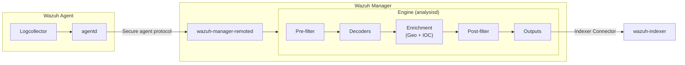

# What's new in Wazuh 5.0 — Log data collection

This page summarizes the changes to the log data collection flow introduced in Wazuh 5.0.

## Overview

| Area | Change |
|------|--------|
| Windows EventChannel output format | Native XML instead of JSON wrapper (Windows agents only) |
| Filebeat removed | Events flow directly from `analysisd` to `wazuh-indexer` via the Indexer Connector |
| Syslog server removed | `wazuh-remoted` no longer accepts syslog input |
| Manager separated from agent | Log collection always requires a dedicated agent |
| Events no longer written to file by default | `file-output-integrations.yml` output is disabled by default |

---

## End-to-end event flow

The diagram below shows the complete path of a log event from collection on the agent to storage in `wazuh-indexer`.



Key differences from Wazuh 4.x:

- **Filebeat is removed**: the engine's Indexer Connector delivers processed events directly to `wazuh-indexer` without an intermediate file or Filebeat process.
- **Manager is not an agent**: log collection always originates at a dedicated Wazuh agent; the manager has no Logcollector of its own.

For internal engine details, see the [Engine overview](../engine/README.md) and the [Engine architecture](../engine/architecture.md).

---

## Agent-side changes

### Windows EventChannel output format

The output format for Windows EventChannel events has changed. The agent now forwards the native Windows Event XML as rendered by the EventChannel API (`EvtRender()`), matching the format exported by Windows Event Viewer.

This standardizes event data for downstream processing and makes Wazuh-forwarded events directly comparable to native Windows Event Viewer exports.

**Before (Wazuh 4.x)** — JSON wrapper:

```json
{"message": "Event description.", "event": "<Event>...</Event>"}
```

**After (Wazuh 5.0)** — native XML:

```xml
<Event xmlns='http://schemas.microsoft.com/win/2004/08/events/event'>
  <System>
    <Provider Name='Microsoft-Windows-Security-Auditing' Guid='{54849625-5478-4994-a5ba-3e3b0328c30d}'/>
    <EventID>4624</EventID>
    ...
  </System>
  <EventData>
    <Data Name='SubjectUserName'>SYSTEM</Data>
    ...
  </EventData>
</Event>
```

Key structural differences:

- No `<?xml version="1.0" encoding="UTF-8"?>` declaration.
- `<Event>` is the root element.
- Namespaces and attributes are preserved exactly as provided by the EventChannel API.

!!! note
    This change applies to **Windows agents only**. The `<log_format>eventchannel</log_format>` configuration option is unchanged.

### Unchanged behavior

The following aspects of the `agent → remoted` flow are **unchanged** in Wazuh 5.0:

- **Transport protocol**: Events continue to flow through the same secure agent protocol (`logcollector → agentd → remoted`).
- **Custom socket outputs**: The `<socket>` + `<localfile><target>` + `<out_format>` configuration is fully supported and functionally unchanged on Linux, Unix, and macOS.
- **All other log formats**: No changes to the event payload for any other log format (syslog, journald, macos, eventlog, etc.).

---

## Manager/server-side changes

### Filebeat removed

Filebeat has been removed from the Wazuh server. The engine now delivers processed events directly to `wazuh-indexer` through its built-in **Indexer Connector**. This change is transparent to agents and users.

The engine ships two built-in outputs under `/var/wazuh-manager/etc/outputs/default/`:

| Output file | Default state | Description |
|-------------|---------------|-------------|
| `indexer.yml` | **Enabled** | Forwards processed events directly to `wazuh-indexer` |
| `file-output-integrations.yml` | Disabled | Writes processed events to a local file on the manager |

In Wazuh 4.x, events were written to a file so that Filebeat could read and forward them to Elasticsearch/OpenSearch. With Filebeat removed, `file-output-integrations.yml` is disabled by default and `indexer.yml` handles delivery entirely.

### Syslog server removed

The built-in syslog server in `wazuh-remoted` has been removed. Wazuh 5.0 no longer accepts direct syslog input through remoted.

### Manager no longer functions as an agent

In Wazuh 5.0, the manager and agent are fully separate components. Log collection always occurs via a dedicated Wazuh agent — the manager does not run Logcollector itself.

### Events no longer written to file by default

Events are no longer written to disk by default. In Wazuh 4.x this was required because Filebeat read from that file; with Filebeat removed and `file-output-integrations.yml` disabled, writing to file is unnecessary. The output can be re-enabled manually if needed.
