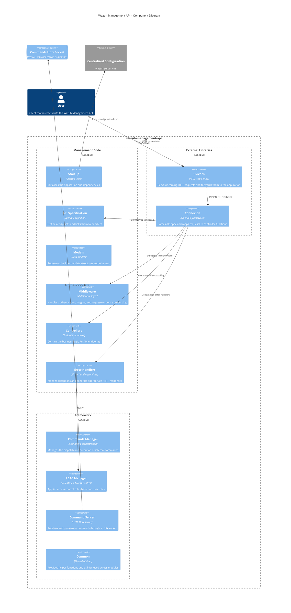

# Architecture

```mermaid

C4Container
title Wazuh Management API - Component Diagram


System_Boundary(management_api, "wazuh-management-api") {

    System_Boundary(app, "Management Code") {
        Component(startup, "Startup", "Startup logic", "Initializes the application and dependencies")
        Component(api_spec, "API Specification", "OpenAPI definition", "Defines endpoints and links them to handlers")
        Component(models, "Models", "Data models", "Represent the internal data structures and schemas")
        Component(middleware_lib, "Middleware", "Middleware layer", "Handles authentication, logging, and request/response processing")
        Component(controllers, "Controllers", "Endpoint handlers", "Contain the business logic for API endpoints")
        Component(error_handlers, "Error Handlers", "Error handling utilities", "Manage exceptions and generate appropriate HTTP responses")
    }

    System_Boundary(deps, "External Libraries") {
        Component(uvicorn, "Uvicorn", "ASGI Web Server", "Serves incoming HTTP requests and forwards them to the application")
        Component(connexion, "Connexion", "OpenAPI framework", "Parses API spec and maps requests to controller functions")
    }

    System_Boundary(framework, "Framework") {
        Component(commands_manager, "Commands Manager", "Command orchestration", "Manages the dispatch and execution of internal commands")
        Component(rbac_manager, "RBAC Manager", "Role-Based Access Control", "Applies access control rules based on user roles")
        Component(commands_server, "Command Server", "HTTP Unix server", "Receives and processes commands through a Unix socket")
        Component(common, "Common", "Shared utilities", "Provides helper functions and utilities used across modules")
    }

    Rel(user, uvicorn, "Sends HTTP requests to")
    Rel(uvicorn, connexion, "Forwards HTTP requests")
    Rel(connexion, middleware_lib, "Delegates to middleware")
    Rel(connexion, error_handlers, "Delegates to error handlers")
    Rel(connexion, api_spec, "Parses API specification")
    Rel(connexion, controllers, "Solve request by executing")
    Rel(controllers, rbac_manager, "Query")
    Rel(startup, centralized_config, "Reads configuration from")
    Rel(commands_server, commands_socket, "Receives commands via")
}

ComponentQueue(commands_socket, "Commands Unix Socket", "Receives internal Wazuh commands")
System_Ext(centralized_config, "Centralized Configuration", "wazuh-server.yml", "Defines core parameters for service behavior")
Person(user, "User", "Client that interacts with the Wazuh Management API")

```
