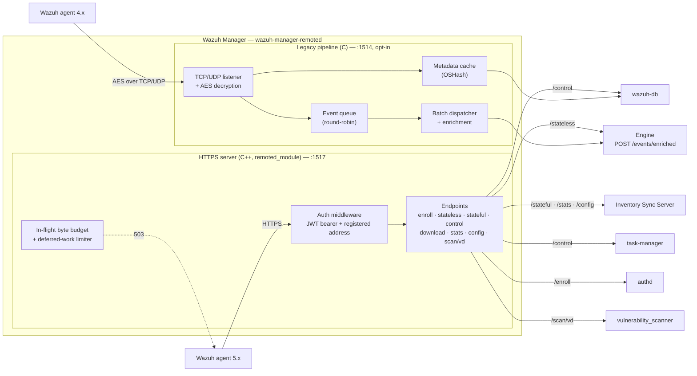

# Remoted Architecture

## Overview

`remoted` is the communication gateway between Wazuh agents and the manager. It handles secure
connections, authentication, message routing, and event forwarding to the engine.

It runs **two independent channels**, and they share almost nothing — not their transport, their
authentication, their threading, nor their code:

| | HTTPS agent API | Legacy channel |
| --- | --- | --- |
| Port | `1517` | `1514` |
| Transport | TLS 1.3 over TCP | TCP or UDP, AES-encrypted payloads |
| Authentication | per-request `wazuh-agent+jwt` bearer token (HS256) self-signed with the agent's pre-shared key | AES session key derived from `client.keys` |
| Direction | agent-initiated requests only; work is handed back in responses | persistent connection, manager can push |
| Enabled | always | only when `<remote><legacy>` is present and enabled |
| Serves | 5.x agents | 4.x agents |
| Implemented in | C++ (`remoted_module`) | C |

A 5.x agent uses the HTTPS API exclusively — it has no legacy code path at all. The legacy channel
exists to keep 4.x agents working during a migration, and when `<remote><legacy>` is absent or
disabled, `start_legacy_subsystems()` is a no-op: no listener is bound, and the legacy keystore,
metadata cache, event queue and dispatcher threads are never created.

## High-Level Architecture



Every downstream hop is HTTP over a Unix-domain socket.

## HTTPS agent API (`remoted_module`)

A self-contained C++17 module linked into `wazuh-manager-remoted` and run on its own worker thread.
It is **Linux-manager only** — agents and Windows do not build it.

It starts **synchronously** as part of `remoted`'s startup, with **no retry**: if the TLS
certificate or key is missing or invalid, starting the module fails and `remoted` itself does not
start. This is deliberate — the manager must not come up believing the HTTPS listener is available
when it silently is not.

### Layering

- **Transport** — RESTinio + OpenSSL, behind a transport-agnostic interface, so the HTTP library can
  be swapped without touching a single endpoint. Default bind `127.0.0.1:1517`.
- **Auth middleware** — framework-agnostic verification of the `wazuh-agent+jwt` bearer: compact
  grammar, exact header/claim sets, HS256 with the agent's key (constant-time comparison), time rules,
  identity, and the registered-address check against the agent's `ip` column in `client.keys` (the
  same restriction the legacy listener applies). It authenticates from the headers alone — the body
  is not part of the token — so nothing is decoded on behalf of an unauthenticated peer. The keystore hot-reloads
  on `inotify` plus a periodic poll, so an agent enrolled or removed after startup is picked up
  without a restart.
- **Body decoding** — one cross-cutting step configured once for every authenticated route, so none
  can accidentally opt out. `zstd` only. It runs strictly **after** the MAC is verified, which is
  what stops an unauthenticated peer from spending the manager's CPU or memory on decompression.
- **Endpoints** — each owns *what* it forwards and *how* it maps the downstream answer. Handlers run
  on a bounded worker pool, off the I/O threads.

### Endpoints

Nine agent-facing routes. Full request/response contracts in
[HTTPS Agent API](https-events-api.md); machine-readable in [`agent-api.yaml`](agent-api.yaml).

| Route | Purpose | Downstream |
| --- | --- | --- |
| `GET /` | Unauthenticated liveness probe | — |
| `POST /enroll` | Agent registration; bridges to `authd`, which keeps all enrollment logic | authd local socket |
| `POST /stateless` | Event batches (H/E wire format) | Engine, `POST /events/enriched` |
| `POST /stateful` | Whole inventory sync sessions, relayed opaquely | Inventory Sync Server |
| `POST /control` | `startup` / `notify` / `shutdown`; returns limits, groups, change-detection hashes and pending tasks | wazuh-db, task-manager |
| `POST /download` | Centralized configuration (`merged.mg`) and WPK packages; the one streamed response | filesystem |
| `POST /stats` | Agent-reported module statistics | Inventory Sync Server |
| `POST /config` | Agent-reported configuration | Inventory Sync Server |
| `POST /scan/vd` | On-demand Vulnerability Detection re-scan | vulnerability_scanner |

### Back-pressure

The manager processes what it has capacity for rather than buffering into a fixed queue. Capacity is
bounded in two phases, and excess load is shed with a plain `503`:

1. **In-flight byte budget** — bounds the total unprocessed payload held in memory, reserved before
   a route runs. The liveness `GET /` is exempt, so it keeps answering `200` under pressure.
2. **Deferred-work limiter** — bounds how many requests are parked awaiting a downstream service.

Neither sends `Retry-After`: this is server-side load-shedding, not per-client rate-limiting, and the
agent runs its own retry/backoff. See [Configuration](configuration.md) for the sizing knobs and
[Metrics](metrics.md) for what to watch.

### Local admin plane

The module's own metrics are served on a manager-local Unix socket
(`queue/sockets/remote-admin-http.sock`), never on the agent-facing listener — see
[the admin socket](README.md#local-admin-socket).

## Legacy pipeline (opt-in)

Everything in this section runs **only** when `<remote><legacy>` is present and enabled. It exists
to serve 4.x agents.

### 1. Network listener

Accepts agent connections over TCP (port `1514` by default) or UDP.

### 2. Message handler

- **Decryption** — decrypts agent messages using the AES session key
- **Validation** — verifies message integrity and agent authentication
- **Classification** — control message vs event

Control messages carry the `#!-` header: keep-alive, startup, shutdown, and `req` requests.

Three 4.x message types are **discarded** rather than processed, because their 5.0 replacements are
HTTPS-only:

| Legacy header | Meaning | 5.0 disposition |
| --- | --- | --- |
| `5:` (`DBSYNC_HEADER`) | dbsync deltas | Discarded — not supported in 5.0 |
| `s:` (`INVENTORY_SYNC_HEADER`) | incremental inventory sync | Discarded — the manager only accepts whole sessions, via `POST /stateful` |
| `u:upgrade_module:` (`UPGRADE_ACK_HEADER`) | WPK upgrade acknowledgment | **Still honored** — acked and forwarded, so remote upgrade of a 4.x agent keeps working |

### 3. Metadata database

In-memory cache of the agent metadata extracted from keep-alives:

- OSHash table indexed by agent ID
- Thread-safe with read/write locks
- Holds agent name, version, OS details, groups, hostname

### 4. Event queue and dispatcher

A round-robin queue buffers events from all agents; a dispatcher thread batches them, enriches each
batch from the metadata cache, and forwards it to the engine.

### 5. Engine client

- **Transport** — HTTP over a Unix-domain socket
- **Socket** — `queue/sockets/engine-ingest-http.sock`
- **Route** — `POST /events/enriched`
- **Framing** — `x-wev1` (see [Event Protocol](event-protocol.md))

### Data flow

Agent sends event → listener → decrypt and validate → classify:

- **Control message** → parse keep-alive → update metadata cache → update wazuh-db
- **Event message** → event queue → batch and enrich → `POST /events/enriched` to the engine

## Key configuration options

```xml
<remote>
  <https>
    <port>1517</port>
    <bind_addr>0.0.0.0</bind_addr>
    <certificate>etc/certs/remoted.pem</certificate>
    <key>etc/certs/remoted-key.pem</key>
  </https>

  <legacy>
    <enabled>yes</enabled>
    <port>1514</port>
    <protocol>tcp</protocol>
  </legacy>

  <agents>
    <allow_higher_versions>no</allow_higher_versions>
  </agents>
</remote>
```

Tuning lives in internal options rather than `wazuh-manager.conf` — the HTTPS server's transport and
capacity knobs under `remoted.http_*`, `remoted.max_inflight_bytes` and
`remoted.max_deferred_requests`, and the legacy pipeline's under `remoted.control_msg_queue_size`,
`remoted.batch_events_capacity` and `remoted.worker_pool`.

For the complete set, see [Configuration](configuration.md).

## References

- [HTTPS Agent API](https-events-api.md) — the agent-facing protocol and all nine endpoints
- [Endpoint reference](agent-api-reference.html) — the same contract as OpenAPI
- [Configuration](configuration.md)
- [Metrics](metrics.md)
- [Load balancers](load-balancers/README.md)
- [Stateless Metadata](stateless-metadata.md) — legacy-channel metadata enrichment
- [Event Protocol](event-protocol.md) — the `x-wev1` framing both channels use downstream
