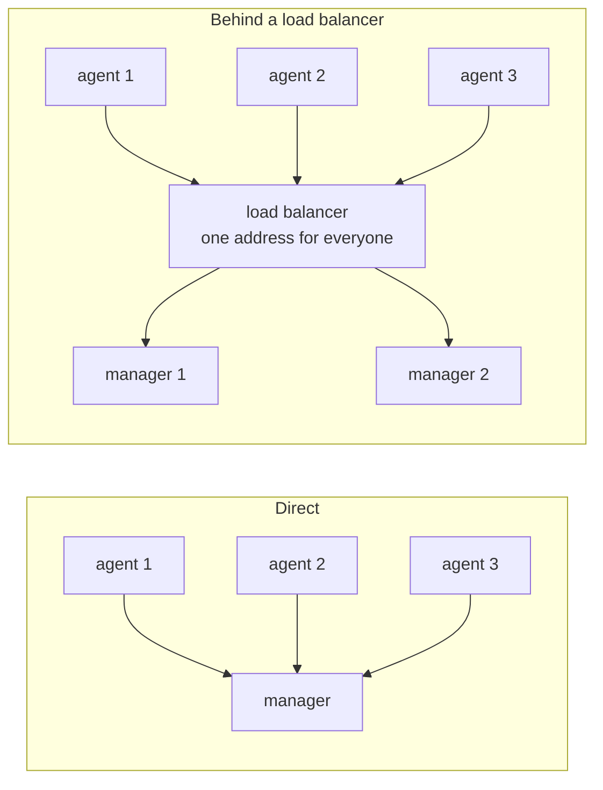
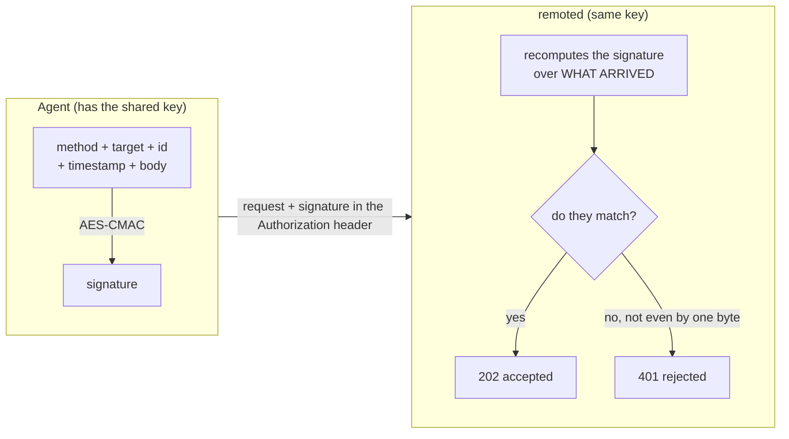
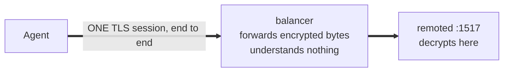
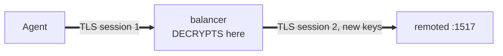
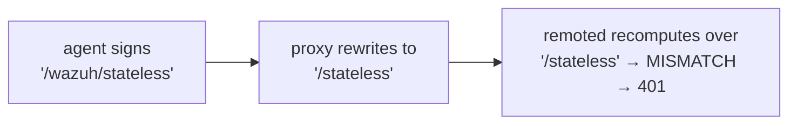
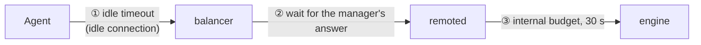
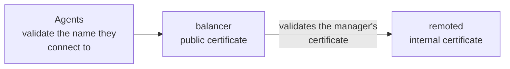
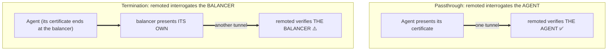
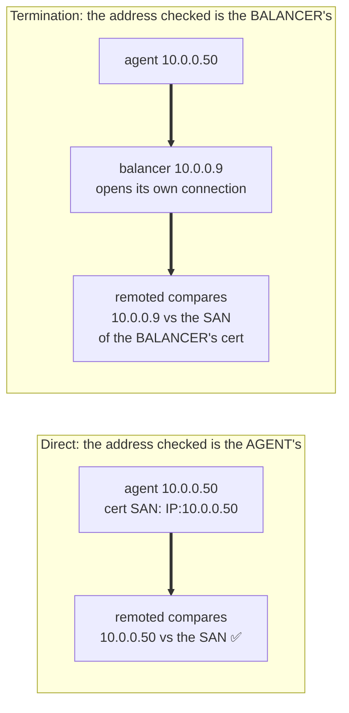

# Getting started with load balancers

How to put a load balancer or reverse proxy in front of remoted's HTTPS events API (port `1517`),
what the protocol requires from that proxy, and which deployment models are supported.

Everything on this page has been measured against a real manager. The configurations it points to
are working ones, not sketches.

- [NGINX configuration](nginx.md)
- [HAProxy configuration](haproxy.md)

---

## 1. Why a load balancer

Today each agent connects directly to one manager. A load balancer sits in front of several
managers and spreads the traffic:



It buys three things: **scale** (one manager has a connection ceiling), **survival** (if one manager
dies the rest keep serving) and **not reconfiguring thousands of agents** every time a manager is
added, because they all point at a single address.

## 2. The one thing that makes this protocol different

Every agent request carries an **AES-CMAC signature** computed with the agent's pre-shared key.
The signature covers five things, byte for byte:

```
method + request target + agent id + timestamp + body
```



Two consequences drive every rule on this page:

1. **Anything in that list is untouchable.** A proxy that rewrites the request target or the body
   invalidates the signature, and **every** request gets `401`.
2. **Anything outside that list is invisible to the signature.** Headers are not covered, so a
   proxy may add `X-Forwarded-For` freely — and, on the flip side, a header the manager relies on
   is not protected by it.

There is one more property with no way around it: **remoted has no plaintext listener.** The
connection to it is always TLS.

## 3. The two deployment models

Think of TLS as a sealed envelope. The whole decision is: **does the balancer open it?**

### TLS passthrough (it does not open it) — layer 4



The balancer forwards bytes it cannot read. The agent validates **remoted's** certificate, and the
agent's own client certificate reaches remoted intact. The balancer cannot break the signature even
if misconfigured — but it is also blind: it cannot filter, cannot cap sizes, and can only balance
whole connections.

### TLS termination and re-encryption (it does open it) — layer 7



The balancer decrypts, can inspect and balance per request, and opens a **new** TLS connection to
remoted. The agent validates the **balancer's** certificate. The agent's client certificate **ends
at the balancer**: a different TLS session cannot carry it, which is a property of TLS itself and
not a limitation of any product.

> **Terminating to a plaintext backend is not possible.** remoted only accepts TLS, so termination
> always means **re-encryption**. The upside is that the internal hop is never in the clear.

### Which one to choose

| | Passthrough | Termination |
|---|---|---|
| Balances per | whole connection | **individual request** |
| Agent gets "stuck" to one manager | yes, while its connection lives | no |
| Can filter / cap request sizes | ❌ | ✅ |
| Per-request logs and metrics | ❌ | ✅ |
| Certificates agents must trust | one **per manager** | **one**, the balancer's |
| Agent mTLS (client certificates) | ✅ works | ❌ ends at the balancer |
| Point where traffic is in the clear | none | inside the balancer |
| AWS equivalent | NLB | ALB |

**Recommendation: TLS termination**, for the per-request balancing, the edge protection and the
single public certificate — accepting two things explicitly: the balancer becomes part of your
security perimeter (traffic is decrypted there), and agent client certificates do not reach the
manager.

**Choose passthrough** if agent mTLS is a requirement, or if no machine in the path may see
decrypted traffic.

## 4. Rules that apply to any proxy

These come from the protocol, so they hold for NGINX, HAProxy, an ALB or anything else.

### 4.1. remoted cannot live under a URL path prefix

Publishing it as `https://lb/wazuh/...` requires the proxy to rewrite the path, and the path is
signed:



Give remoted its **own port or hostname**. Query strings, extra headers and repeated slashes are
fine — they are forwarded unchanged as long as the proxy does not rewrite the target.

### 4.2. The backend connection must be TLS 1.3

remoted requires TLS 1.3 as its minimum version and it is not configurable. A proxy that offers
only TLS 1.2 to the backend fails the handshake, and the agent sees `502` — while the agent and its
signature were perfect, which makes it a confusing failure to chase.

Note the asymmetry: the connection **from the agent** may be more permissive; the connection **to
remoted** may not.

### 4.3. Never enable PROXY protocol towards remoted

PROXY protocol prepends the client's address to the start of the TCP connection, before any
application byte. remoted does not parse it, so those bytes land where it expects the TLS
handshake, and **every agent's connection breaks at once** — with no HTTP status code to
investigate, only TLS errors.

This applies to `proxy_protocol` (NGINX), `send-proxy` / `send-proxy-v2` (HAProxy) and the
equivalent option on an AWS NLB target group.

### 4.4. Allow the body size remoted allows

remoted accepts up to 20 MB per request. A proxy with a smaller limit answers `413` to events the
manager would have accepted. NGINX defaults to 1 MB and must be raised; HAProxy has no limit by
default.

### 4.5. Align the timeouts

Three different clocks are involved:



* **①** Balancers close idle connections (60 s on an AWS ALB). Agents keep connections open between
  events, so this will happen. The failure is clean and immediate at transport level, nothing was
  consumed, and the agent simply reconnects and resends.
* **②** Must be **at least 30 s**, remoted's own per-request budget. A shorter value cuts off
  requests that were still legitimately in progress — and, if the proxy then retries them on
  another manager, the same event can be processed twice.
* **③** remoted answers by itself when its budget runs out. Nothing to configure; just do not set
  ② below it.

### 4.6. Health checks

remoted answers `GET /` with `200`, unauthenticated and with no body. Use it as the health check
(on AWS: path `/`, matcher `200`). A plain TCP check also works, since the port only opens once the
listener is ready.

> **Limitation to be aware of:** `GET /` reports that the process is alive, not that the whole
> pipeline is working. A manager whose analysis engine is down still answers `200` here while
> rejecting every event with `503`, and the balancer will keep sending it traffic.

### 4.7. Retries: nothing is duplicated unless you ask for it

Both NGINX and HAProxy, with their default settings, only retry a request that was **never
delivered** (a connection that could not be established). Retrying that cannot duplicate anything.

Enabling retries on *responses* is what makes the same request reach two managers, and it must be
opted into explicitly (`non_idempotent` in NGINX, `retry-on 503` and similar in HAProxy). Unless
you have a reason, leave those off.

Never retry on `400`, `401` or `413`: those are deterministic client errors, and retrying them on
another manager produces the same error while multiplying load.

## 5. Certificates



* **The certificate agents validate** is the balancer's (under termination) or each manager's
  (under passthrough). Its **subjectAltName** must contain the name agents use, and the CA that
  signed it must be trusted by the agents.
* **The manager's certificate** is also validated *by the balancer* when you enable backend
  verification, which you should. Its subjectAltName must contain the name the balancer uses to
  reach it.

> Certificates generated automatically at install time are a starting point. For a real deployment,
> replace them with certificates that carry the names actually used, issued by a CA both sides
> trust.

## 6. `verification_mode`: read this before enabling it

`<remote><https><verification_mode>` controls whether remoted requires a **client certificate**. It
has three values: `none` (default), `certificate` and `full`. All three are meant for a manager that
agents reach **directly**; this section is about what changes once a balancer sits in between.

The key to understanding it: **remoted demands the certificate from whoever opens the connection.**



| Deployment | What `certificate` actually authenticates |
|---|---|
| Direct | the agent |
| Passthrough | the agent |
| **Termination** | **the balancer** |

**Under termination this does not authenticate agents.** An agent presenting no certificate at all
is still accepted, because remoted was satisfied by the balancer's certificate. That is not a
defect — it is what "whoever opens the connection" means — but enabling it while expecting agent
authentication leaves a door open that you believe is closed.

It is still worth enabling under termination, for a different and valuable reason: it means **only
your balancer can talk to remoted**, closing the listener off from the rest of the internal
network. Combine it with a firewall rule; it is defence in depth, not a replacement.

To require certificates *from agents* behind a terminating proxy, configure that on the **proxy**
(the agent-facing side), not on remoted.

### `full`: also checks the address

`full` does everything `certificate` does and adds one requirement: the certificate must carry the
address the connection **came from**, as a `subjectAltName`. If it does not, remoted answers `403` —
on every route, the health check included.

On a manager agents reach directly this is a genuinely useful mode: it binds each agent's
certificate to the address that agent connects from, so a stolen certificate is not enough on its
own. **Behind a balancer it is a different question**, because the address remoted sees is not the
agent's:



| Deployment | Address remoted requires in the certificate |
|---|---|
| Direct | the agent's |
| Passthrough | the agent's |
| **Termination** | **the balancer's** |

So under termination `full` is not a stricter check on agents — it is a stricter check on your
balancer. To use it there, the balancer's client certificate must list the balancer's own address as
an **`IP:` SAN**, and every address it can egress from must appear (each node of an HA pair, every
member of an autoscaling group, the NAT address if there is one). Miss one and that node starts
getting `403`.

Two consequences worth stating plainly:

* **A managed balancer whose certificate you do not control cannot satisfy it.** With an AWS ALB you
  do not choose what the backend connection presents, so `full` is not usable there.
* **`X-Forwarded-For` does not help.** The check reads the transport address of the connection, not a
  header — which is the point, since a header is exactly what an attacker would forge.

Under **passthrough** none of this applies: the agent's own connection reaches remoted, so `full`
behaves as it does on a direct manager.

## 7. In a cluster

Under termination each request is routed independently, so **any manager can receive any request
from any agent at any time**. Two things must therefore hold across all managers:

* **Agent keys must be present everywhere.** A manager without an agent's key answers `401`. Since
  requests are spread per request, a freshly enrolled agent whose key has not reached every manager
  yet sees **intermittent** `401`s — correct signature, correct configuration, "sometimes it
  works". If you see that pattern right after enrolling, this is why.
* **Clocks must be in sync (NTP).** The signature carries a timestamp and each manager judges it
  against its own clock, so drift produces the same intermittent `401`s. Keep the related
  `remoted.auth_*` internal options identical across managers too.

## 8. Checklist before going to production

- [ ] remoted has its own port or hostname (no URL path prefix)
- [ ] The proxy forwards the request target unchanged
- [ ] Backend connections negotiate TLS 1.3
- [ ] Backend certificate verification is enabled, and the certificate has a matching SAN
- [ ] Body size limit raised to 20 MB
- [ ] Response timeout ≥ 30 s
- [ ] Health check against `GET /`
- [ ] PROXY protocol **disabled**
- [ ] Response-based retries left off unless duplicates are acceptable
- [ ] Agent keys synchronised and NTP running on every manager
- [ ] If `verification_mode` is `certificate` under termination, you know it authenticates the
      balancer
- [ ] If it is `full`, the balancer's certificate lists every address it egresses from as an `IP:`
      SAN — or the mode is left off, which is the usual choice behind a balancer

Then pick your proxy: **[NGINX](nginx.md)** or **[HAProxy](haproxy.md)**.
