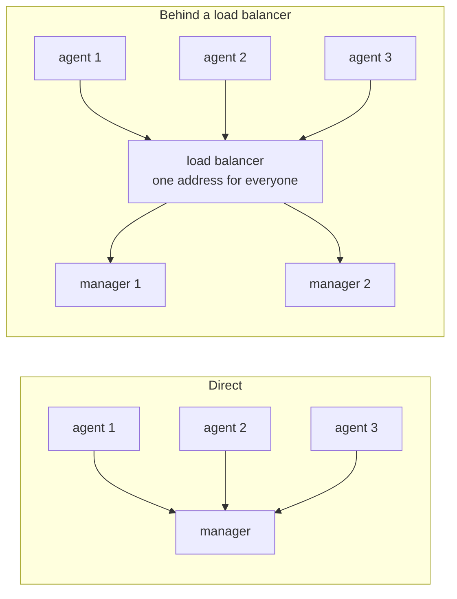
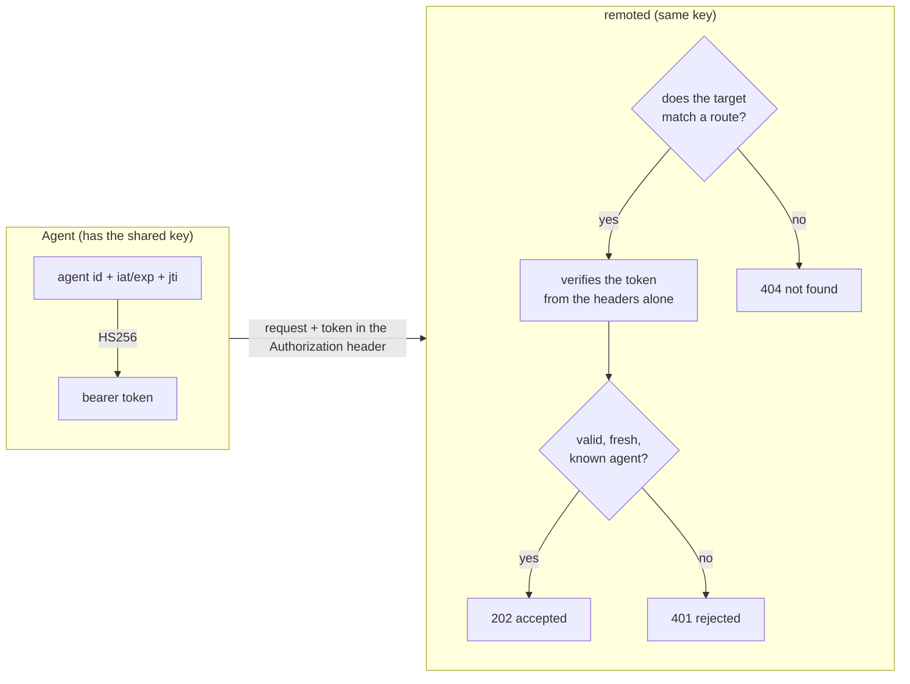
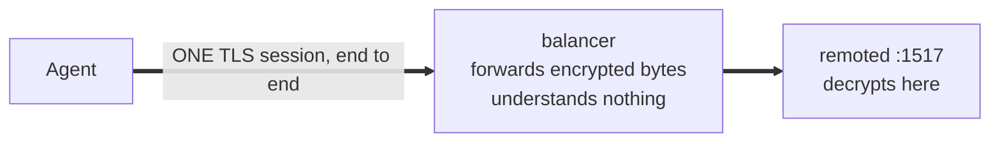
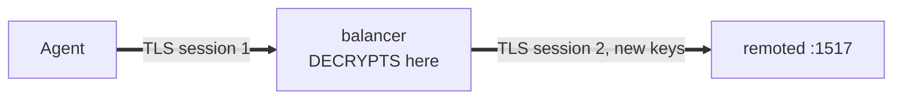
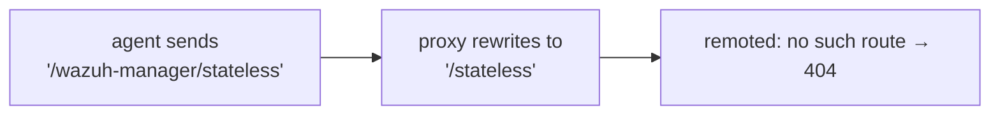
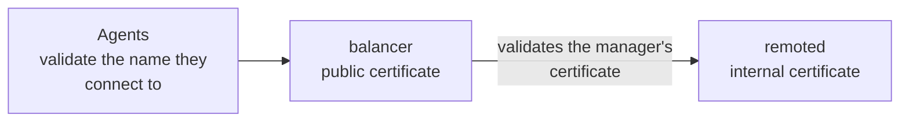
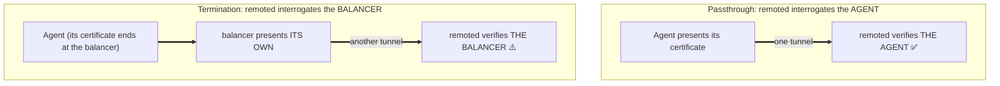
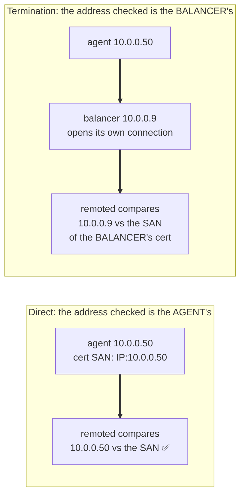

# Getting started with load balancers

How to put a load balancer or reverse proxy in front of remoted's HTTPS events API (port `1517`),
what the protocol requires from that proxy, and which deployment models are supported.

Everything on this page has been measured against a real manager. The configurations it points to
are working ones, not sketches.

- [NGINX configuration](nginx.md)
- [HAProxy configuration](haproxy.md)

---

## 1. Why a load balancer

Today each agent connects directly to one manager. A load balancer sits in front of several
managers and spreads the traffic:


```mermaid
flowchart LR
    subgraph BEFORE["Direct"]
      A1["agent 1"] --> M1["manager"]
      A2["agent 2"] --> M1
      A3["agent 3"] --> M1
    end
    subgraph AFTER["Behind a load balancer"]
      B1["agent 1"] --> LB["load balancer<br/>one address for everyone"]
      B2["agent 2"] --> LB
      B3["agent 3"] --> LB
      LB --> N1["manager 1"]
      LB --> N2["manager 2"]
    end
```

It buys three things: **scale** (one manager has a connection ceiling), **survival** (if one manager
dies the rest keep serving) and **not reconfiguring thousands of agents** every time a manager is
added, because they all point at a single address.

## 2. The one thing that makes this protocol different

Every agent request carries a **`wazuh-agent+jwt` bearer token** the agent signs (HS256) with its
pre-shared `client.keys` key. The token binds exactly two things:

```
who (agent id: kid / sub / iss)  +  when (iat / nbf / exp: 60 s, fresh jti per request)
```


```mermaid
flowchart LR
    subgraph AG["Agent (has the shared key)"]
      L["agent id + iat/exp + jti"] -->|"HS256"| H["bearer token"]
    end
    AG -->|"request + token in the Authorization header"| M
    subgraph M["remoted (same key)"]
      R{"does the target<br/>match a route?"} -->|"yes"| L2["verifies the token<br/>from the headers alone"]
      R -->|"no"| NF["404 not found"]
      L2 --> C{"valid, fresh,<br/>known agent?"}
      C -->|"yes"| OK["202 accepted"]
      C -->|"no"| KO["401 rejected"]
    end
```

Two consequences drive every rule on this page:

1. **The target and the body are not signed — TLS protects them.** A proxy that rewrites the
   request target does not break authentication; it sends the request to a route that does not
   exist, and **every** request gets `404`. The operational rule is the same as before — forward
   the target and the body untouched — but the failure you will see is a missing route, never a
   credential error.
2. **Headers are invisible to the token.** A proxy may add `X-Forwarded-For` freely — remoted never
   reads it (see [4.8](#48-the-manager-sees-the-balancers-address)) — and, on the flip side, a header
   the manager relies on is not protected by it.

There is one more property with no way around it: **remoted has no plaintext listener.** The
connection to it is always TLS.

## 3. The two deployment models

Think of TLS as a sealed envelope. The whole decision is: **does the balancer open it?**

### TLS passthrough (it does not open it) — layer 4


```mermaid
flowchart LR
    A["Agent"] ==>|"ONE TLS session, end to end"| N["balancer<br/>forwards encrypted bytes<br/>understands nothing"]
    N ==> R["remoted :1517<br/>decrypts here"]
```

The balancer forwards bytes it cannot read. The agent validates **remoted's** certificate, and the
agent's own client certificate reaches remoted intact. The balancer cannot touch the request even
if misconfigured — but it is also blind: it cannot filter, cannot cap sizes, and can only balance
whole connections.

### TLS termination and re-encryption (it does open it) — layer 7


```mermaid
flowchart LR
    A["Agent"] ==>|"TLS session 1"| N["balancer<br/>DECRYPTS here"]
    N ==>|"TLS session 2, new keys"| R["remoted :1517"]
```

The balancer decrypts, can inspect and balance per request, and opens a **new** TLS connection to
remoted. The agent validates the **balancer's** certificate. The agent's client certificate **ends
at the balancer**: a different TLS session cannot carry it, which is a property of TLS itself and
not a limitation of any product.

> **Terminating to a plaintext backend is not possible.** remoted only accepts TLS, so termination
> always means **re-encryption**. The upside is that the internal hop is never in the clear.

### Which one to choose

| | Passthrough | Termination |
|---|---|---|
| Balances per | whole connection | **individual request** |
| Agent gets "stuck" to one manager | yes, while its connection lives | no |
| Can filter / cap request sizes | ❌ | ✅ |
| Per-request logs and metrics | ❌ | ✅ |
| Certificate agents validate | every manager's leaf (one CA), each carrying the agent-facing name | **one**, the balancer's |
| Agent mTLS (client certificates) | ✅ works | ❌ ends at the balancer |
| Point where traffic is in the clear | none | inside the balancer |
| AWS equivalent | NLB | ALB |

**Recommendation: TLS termination**, for the per-request balancing, the edge protection and the
single public certificate — accepting two things explicitly: the balancer becomes part of your
security perimeter (traffic is decrypted there), and agent client certificates do not reach the
manager.

**Choose passthrough** if agent mTLS is a requirement, or if no machine in the path may see
decrypted traffic.

## 4. Rules that apply to any proxy

These come from the protocol, so they hold for NGINX, HAProxy, an ALB or anything else.

### 4.1. The proxy must never rewrite the path — prefixes are CONFIGURED, not rewritten

The manager routes on the literal request path, so any proxy-side rewrite sends every request to a
route that does not exist:


```mermaid
flowchart LR
    A["agent sends<br/>'/wazuh-manager/stateless'"] --> N["proxy rewrites to<br/>'/stateless'"] --> R["remoted: no such route → 404"]
```

To publish remoted under a URL path prefix, configure the SAME prefix on both ends instead:
[`remote.https.global_prefix`](../configuration.md#httpsglobal_prefix) on the manager (its default,
`/wazuh-manager/`, applies even when the option is absent) and the matching prefix on the agents. The
agent then sends `/wazuh-manager/stateless`, and the proxy's only job is to forward that path
untouched (passthrough). A prefix mismatch between agent and manager surfaces as `404`, not `401`
— the bearer token does not bind the path, so authentication is never what fails here.

If you cannot align the prefix end to end, give remoted its **own port or hostname**. Query
strings and extra headers are fine — they are forwarded unchanged as long as the proxy does not
rewrite the target. Repeated slashes are not: an empty segment (`/wazuh-manager//stateless`) does
not route and is answered `404`. (Percent-encoded spellings of a path also route — the
router decodes ordinary bytes for matching — so this changes nothing for a well-behaved client.)

### 4.2. The backend connection must be TLS 1.3

remoted requires TLS 1.3 as its minimum version and it is not configurable. A proxy that offers
only TLS 1.2 to the backend fails the handshake, and the agent sees `502` — while the agent and its
token were perfect, which makes it a confusing failure to chase.

Note the asymmetry: the connection **from the agent** may be more permissive; the connection **to
remoted** may not.

### 4.3. Never enable PROXY protocol towards remoted

PROXY protocol prepends the client's address to the start of the TCP connection, before any
application byte. remoted does not parse it, so those bytes land where it expects the TLS
handshake, and **every agent's connection breaks at once** — with no HTTP status code to
investigate, only TLS errors.

This applies to `proxy_protocol` (NGINX), `send-proxy` / `send-proxy-v2` (HAProxy) and the
equivalent option on an AWS NLB target group.

### 4.4. Allow the body size remoted allows

remoted has two body caps. An authenticated request body over `remoted.auth_max_body_size` (5 MiB
by default) is answered with a JSON `413`, which the agent acts on. A body over
`<remote><https><max_body_size>` (10 MiB by default) makes remoted close the connection without an
answer, which a proxy reports as `502`. Set the proxy's limit at or above `max_body_size` so that
the manager decides: a proxy with a smaller limit answers `413` to events the manager would have
accepted. NGINX defaults to 1 MB and must be raised; HAProxy has no limit by default.

### 4.5. Align the timeouts

Three different clocks are involved:


```mermaid
flowchart LR
    A["Agent"] -->|"① idle timeout<br/>(idle connection)"| N["balancer"]
    N -->|"② wait for the manager's answer"| R["remoted"]
    R -->|"③ request budget, 30 s"| E["engine"]
```

* **①** Balancers close idle connections (60 s on an AWS ALB). Agents keep connections open between
  events, so this will happen. The failure is clean and immediate at transport level, nothing was
  consumed, and the agent simply reconnects and resends.
* **②** Must be **above 30 s** (for example 60 s), remoted's own per-request budget. A shorter
  value cuts off requests that were still legitimately in progress — and, if the proxy then retries
  them on another manager, the same event can be processed twice. A value exactly equal races
  remoted's own deadline.
* **③** `remoted.http_request_timeout` (30 s by default): remoted answers by itself when it runs
  out. If you raise it, raise ② with it.

One more clock runs on the backend connection itself: remoted closes an idle keep-alive connection
after `remoted.http_read_timeout` (10 s by default), and closes the connection after every `404` or
`403`. Keep the proxy's idle time for reusable backend connections below 10 s (NGINX:
`keepalive_timeout 5s;` in the `upstream`), or a request sent on a connection remoted has already
closed fails with `502`.

### 4.6. Health checks

remoted answers its health probe — `GET` on the global prefix itself, `GET /wazuh-manager/` by
default (with or without the trailing slash) — with `200`, unauthenticated, with a small JSON body
(`{"status":"ok","module":"remoted"}`). Use it as the health check (on AWS: path `/wazuh-manager/`,
matcher `200`). A bare `GET /` answers `404` unless `global_prefix` is `/`. A plain TCP check also
works, since the port only opens once the listener is ready.

> **Limitation to be aware of:** the health probe reports that the process is alive, not that the whole
> pipeline is working. A manager whose analysis engine is down still answers `200` here while
> rejecting every event with `503`, and the balancer will keep sending it traffic.

### 4.7. Retries: nothing is duplicated unless you ask for it

Both NGINX and HAProxy, with their default settings, only retry a request that was **never
delivered** (a connection that could not be established). Retrying that cannot duplicate anything.

Enabling retries on *responses* is what makes the same request reach two managers, and it must be
opted into explicitly (`non_idempotent` in NGINX, `retry-on 503` and similar in HAProxy). Unless
you have a reason, leave those off.

Never retry on `400`, `401` or `413`: those are deterministic client errors, and retrying them on
another manager produces the same error while multiplying load. A `429` (with `Retry-After`) comes
only from `POST /enroll` and `GET /cacerts`, whose rate limits are per node;
the agent already retries it after the delay.

### 4.8. The manager sees the balancer's address

remoted never reads `X-Forwarded-For` or any other forwarding header: every address check uses the
TCP peer of the connection, which behind a non-transparent balancer is the balancer. Two checks are
affected:

* the `ip` column of the agent's `client.keys` entry — an agent registered with a fixed address is
  answered `401 invalid_signature` from any other address (see
  [Registered address](../https-events-api.md#registered-address-ip-column)). Register agents with
  `any` (or the balancer's range);
* enrollment with `use_source_ip`, or with `ip: "src"` in the body, registers the balancer's address.
  Do not enable it behind a balancer.

## 5. Certificates


```mermaid
flowchart LR
    AG["Agents<br/>validate the name they<br/>connect to"] --> LB["balancer<br/>public certificate"]
    LB -->|"validates the manager's<br/>certificate"| R["remoted<br/>internal certificate"]
```

* **The certificate agents validate** is the balancer's (under termination) or each manager's
  (under passthrough). Its **subjectAltName** must contain the name agents use, and the CA that
  signed it must be trusted by the agents.
* **The manager's certificate** is also validated *by the balancer* when you enable backend
  verification, which you should. Its subjectAltName must contain the name the balancer uses to
  reach it.

> Behind a balancer, the certificate the manager issues for itself is unlikely to carry the right
> names: it derives them from the host, which does not know the name the balancer presents. Either
> set `WAZUH_MANAGER_REMOTED_CERT_SANS` so the issued listener pair carries the name the balancer
> checks *and* the one agents connect to, or issue the pair externally (the Wazuh installation
> assistant's `wazuh-certs-tool`) from a CA both sides trust. See
> [Credentials](../../../getting-started/credentials.md#subject-alternative-names).

## 6. `verification_mode`: read this before enabling it

`<remote><https><verification_mode>` controls whether remoted requires a **client certificate**. It
has three values: `none` (default), `certificate` and `full`. All three are meant for a manager that
agents reach **directly**; this section is about what changes once a balancer sits in between.

The key to understanding it: **remoted demands the certificate from whoever opens the connection.**


```mermaid
flowchart TB
    subgraph PT["Passthrough: remoted interrogates the AGENT"]
      A1["Agent presents its certificate"] ==>|"one tunnel"| R1["remoted verifies THE AGENT ✅"]
    end
    subgraph TM["Termination: remoted interrogates the BALANCER"]
      A2["Agent (its certificate ends at the balancer)"] ==> N["balancer presents ITS OWN"]
      N ==>|"another tunnel"| R2["remoted verifies THE BALANCER ⚠️"]
    end
```

| Deployment | What `certificate` actually authenticates |
|---|---|
| Direct | the agent |
| Passthrough | the agent |
| **Termination** | **the balancer** |

**Under termination this does not authenticate agents.** An agent presenting no certificate at all
is still accepted, because remoted was satisfied by the balancer's certificate. That is not a
defect — it is what "whoever opens the connection" means — but enabling it while expecting agent
authentication leaves a door open that you believe is closed.

It is still worth enabling under termination, for a different and valuable reason: it means **only
your balancer can talk to remoted**, closing the listener off from the rest of the internal
network. Combine it with a firewall rule; it is defence in depth, not a replacement.

To require certificates *from agents* behind a terminating proxy, configure that on the **proxy**
(the agent-facing side), not on remoted.

### `full`: also checks the address

`full` does everything `certificate` does and adds one requirement: the certificate must carry the
address the connection **came from**, as a `subjectAltName`. If it does not, remoted answers `403` —
on every route, the health check included.

On a manager agents reach directly this is a genuinely useful mode: it binds each agent's
certificate to the address that agent connects from, so a stolen certificate is not enough on its
own. **Behind a balancer it is a different question**, because the address remoted sees is not the
agent's:


```mermaid
flowchart LR
    subgraph D["Direct: the address checked is the AGENT's"]
      A1["agent 10.0.0.50<br/>cert SAN: IP:10.0.0.50"] ==> R1["remoted compares<br/>10.0.0.50 vs the SAN ✅"]
    end
    subgraph T["Termination: the address checked is the BALANCER's"]
      A2["agent 10.0.0.50"] ==> B["balancer 10.0.0.9<br/>opens its own connection"]
      B ==> R2["remoted compares<br/>10.0.0.9 vs the SAN<br/>of the BALANCER's cert"]
    end
```

| Deployment | Address remoted requires in the certificate |
|---|---|
| Direct | the agent's |
| Passthrough | the balancer's, unless the balancer preserves the client address (transparent proxying, NLB client-IP preservation) |
| **Termination** | **the balancer's** |

So under termination `full` is not a stricter check on agents — it is a stricter check on your
balancer. To use it there, the balancer's client certificate must list the balancer's own address as
an **`IP:` SAN**, and every address it can egress from must appear (each node of an HA pair, every
member of an autoscaling group, the NAT address if there is one). Miss one and that node starts
getting `403`.

Two consequences worth stating plainly:

* **A managed balancer whose certificate you do not control cannot satisfy it.** With an AWS ALB you
  do not choose what the backend connection presents, so `full` is not usable there.
* **`X-Forwarded-For` does not help.** The check reads the transport address of the connection, not a
  header — which is the point, since a header is exactly what an attacker would forge.

Under **passthrough** the TLS session is the agent's, but the TCP connection is usually the
balancer's (NGINX `stream` and HAProxy `mode tcp` open their own): `full` then checks the balancer's
address against the **agent's** certificate and fails. It behaves as on a direct manager only when
the balancer preserves the client address at network level.

## 7. In a cluster

> **Deploying a cluster behind a balancer has its own page.** Topology, port map, which operations
> require the master, the certificate layout, the deployment procedure and a production checklist
> live in
> [A Wazuh server cluster behind a load balancer](../../cluster/lb.md), with symptom-first diagnosis
> in [Troubleshooting a balanced cluster](../../cluster/lb-troubleshooting.md). This section covers
> only what a proxy operator has to know.

Under termination each request is routed independently, so **any manager can receive any request
from any agent at any time**. Under passthrough the granularity is the **connection**, not the
request: an agent that keeps one connection open stays on one node for its lifetime. Both models
are supported; the deployment has to know which one it picked, because it decides how visible
everything below is.

Everything else about a balanced cluster is on the cluster pages, which own it:

* what is replicated between nodes and what is not (`etc/certs/`, `var/upgrade/`, remoted's
  in-memory agent registry) — [What the cluster replicates](../../cluster/lb.md#4-what-the-cluster-replicates-and-what-it-does-not);
* the brief `401`s after enrollment, the `403` on configuration download from a node that has not
  yet seen the agent's `/control`, and the values that must match across nodes (`global_prefix`, the
  `limits` internal options, `<cluster><name>`, clocks) —
  [What an agent observes while the cluster catches up](../../cluster/lb.md#7-what-an-agent-observes-while-the-cluster-catches-up);
* which CA agents trust, and why `GET /cacerts` must not bootstrap trust under termination with a
  balancer certificate from another CA — [What agents trust](../../cluster/lb.md#what-agents-trust);
* a node that answers the health probe but fails `/control` —
  [One node is degraded](../../cluster/lb-troubleshooting.md#9-some-agents-work-some-do-not-with-no-pattern).

## 8. Checklist before going to production

- [ ] The published path prefix (if any) equals `remote.https.global_prefix` on every manager
      node and on every agent — the proxy never rewrites it. Otherwise remoted has its own port
      or hostname
- [ ] The proxy forwards the request target unchanged
- [ ] Backend connections negotiate TLS 1.3
- [ ] Backend certificate verification is enabled, and the certificate has a matching SAN
- [ ] Body size limit at or above the manager's `<remote><https><max_body_size>` (10 MiB by default)
- [ ] Response timeout above 30 s (`remoted.http_request_timeout`)
- [ ] Idle time of reusable backend connections below 10 s (`remoted.http_read_timeout`)
- [ ] Health check against `GET <global_prefix>` (`GET /wazuh-manager/` by default)
- [ ] Agents registered with `any` (or the balancer's range), `use_source_ip` off
- [ ] PROXY protocol **disabled**
- [ ] Response-based retries left off unless duplicates are acceptable
- [ ] Agent keys synchronised and NTP running on every manager
- [ ] If `verification_mode` is `certificate` under termination, you know it authenticates the
      balancer
- [ ] If it is `full`, the balancer's certificate lists every address it egresses from as an `IP:`
      SAN — or the mode is left off, which is the usual choice behind a balancer

Then pick your proxy: **[NGINX](nginx.md)** or **[HAProxy](haproxy.md)**.
