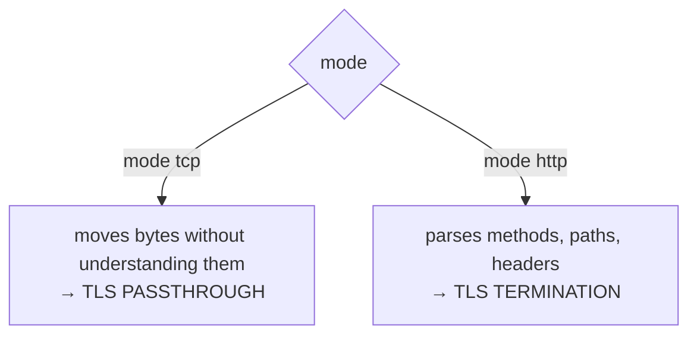
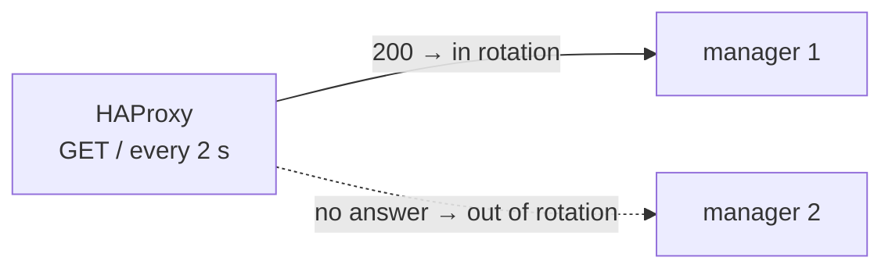

# HAProxy in front of remoted

Working HAProxy configuration for remoted's HTTPS events API (port `1517`), what it does
differently from NGINX, and the three things that surprise people coming from an `nginx.conf`.

Read [Getting started with load balancers](README.md) first: it explains the two deployment models
and the rules that apply to any proxy. This page is the HAProxy-specific part.

---

## 1. How a `haproxy.cfg` maps to the two models

A `haproxy.cfg` has **no nested blocks**. It is a flat list of sections, each introduced by a
keyword in column 1:

| Section | What it is |
|---|---|
| `global` | process-wide settings. One per file. |
| `defaults` | values inherited by every section declared **after** it |
| `frontend` | what HAProxy offers: which port it listens on, with which certificate |
| `backend` | where it forwards: the group of destination managers |

A frontend and a backend are separate objects joined by `default_backend`:


And the keyword that decides everything:



Where NGINX uses two different top-level blocks, HAProxy uses one word. That makes it compact, but
also means a mistyped `mode` silently changes the whole deployment model — **set it explicitly in
every section** rather than relying on inheritance.

TLS lives on two lines: `bind` (the agent-facing side) and `server` (the manager-facing side).
There is no separate directive per option the way NGINX has `ssl_*` and `proxy_ssl_*`.

## 2. Complete configuration

Serves both models at once so you can compare them: `:8444` is passthrough, `:8443` is termination.
In production you would keep only the one you chose.

Lines marked `[!]` are the ones that break things if changed — section 3 explains each.

```haproxy
global
    log stdout format raw local0

    # No 'user'/'group' when running from the official container image: it already drops
    # privileges, and doing it twice makes HAProxy fail to start.

defaults
    log     global
    option  dontlognull

    timeout connect 5s

    # [!] Idle timeout on the connection FROM THE AGENT. Agents keep connections open
    # between events, so this one will fire; the agent reconnects and resends.
    timeout client  60s

    # [!] How long to wait for the manager's answer. remoted gives itself 30 s per
    # request, so anything lower cuts off work that was still in progress -- and a retry
    # of it could reach a second manager. See 3.4.
    timeout server  30s

# =====================================================================
#  TLS PASSTHROUGH (:8444) -- layer 4
#
#  'mode tcp' and no 'ssl' anywhere: HAProxy never sees the HTTP, so it
#  cannot break the signature. The agent validates REMOTED's certificate
#  and its own client certificate reaches remoted intact.
# =====================================================================
frontend passthrough_in
    mode tcp
    bind :8444
    option tcplog
    default_backend remoted_nodes_tcp

backend remoted_nodes_tcp
    mode tcp

    # 'balance source' would pin each agent address to one manager; the default is
    # round-robin over whole connections.
    server node1 10.0.0.11:1517 check
    server node2 10.0.0.12:1517 check

    # [!] DO NOT add 'send-proxy' or 'send-proxy-v2' to those server lines -- see 3.3.

# =====================================================================
#  TLS TERMINATION + RE-ENCRYPTION (:8443) -- layer 7
#
#  HAProxy decrypts, balances per request, and opens a NEW TLS connection
#  to remoted. The agent validates HAProxy's certificate.
# =====================================================================
frontend termination_in
    mode http
    option httplog

    # [!] 'crt' takes ONE file with the certificate AND its key concatenated -- see 3.1.
    # The SAN of that certificate must contain the name agents connect to.
    #
    # Add 'alpn h2,http/1.1' to also offer HTTP/2 to agents; the signature survives the
    # conversion to HTTP/1.1 towards the manager.
    bind :8443 ssl crt /etc/haproxy/certs/load_balancer.pem ssl-min-ver TLSv1.2

    default_backend remoted_nodes_http

backend remoted_nodes_http
    mode http

    # Health check: remoted answers GET / with 200, unauthenticated.
    option httpchk
    http-check send meth GET uri /
    http-check expect status 200

    # Informational. Safe to add: headers are not covered by the signature.
    http-request set-header X-Real-IP %[src]
    option forwardfor

    # [!] Retries. The default 'retry-on conn-failure' only retries what was never
    # delivered, which cannot duplicate anything. See 3.5 before widening it.
    retries 3
    option redispatch

    # [!] ONE physical line per server -- HAProxy has no line continuation, see 3.2.
    #   ssl                  speak TLS (remoted has no plaintext port)
    #   ssl-min-ver TLSv1.3  remoted requires TLS 1.3 as a minimum
    #   verify required      validate the manager's certificate (HAProxy does NOT by default)
    #   verifyhost           which name that certificate is checked against
    #   sni                  send that name during the handshake
    #   crt                  the client certificate HAProxy presents if remoted requires mTLS
    #                        -- this is the PROXY's identity, not the agent's
    #   check                enable the health check configured above
    server node1 10.0.0.11:1517 ssl ssl-min-ver TLSv1.3 verify required ca-file /etc/haproxy/certs/ca.crt verifyhost wazuh-manager-node1 sni str(wazuh-manager-node1) crt /etc/haproxy/certs/proxy_client.pem check
    server node2 10.0.0.12:1517 ssl ssl-min-ver TLSv1.3 verify required ca-file /etc/haproxy/certs/ca.crt verifyhost wazuh-manager-node2 sni str(wazuh-manager-node2) crt /etc/haproxy/certs/proxy_client.pem check
```

Note what the configuration does **not** contain: there is no body-size limit (HAProxy has none by
default, so remoted's own 20 MB applies) and no path handling, because HAProxy forwards the request
target unchanged unless you explicitly tell it not to.

## 3. HAProxy specifics

### 3.1. Certificate and key go in ONE file

Unlike NGINX, which takes `ssl_certificate` and `ssl_certificate_key` separately, HAProxy's `crt`
expects a single file containing both, concatenated:

```bash
cat load_balancer.crt load_balancer.key > load_balancer.pem
chmod 640 load_balancer.pem     # it contains a private key
```

The same applies to the client certificate HAProxy presents to the managers
(`crt /etc/haproxy/certs/proxy_client.pem`).

### 3.2. There is no line continuation

A trailing `\` is **not** "continues below" — HAProxy parses it as an unknown keyword and refuses to
start:

```
[ALERT] config : 'server remoted_nodes_http/node1' : unknown keyword '\'.
```

The `server` line with TLS, verification, SNI and a client certificate is long, and it has to stay
on one physical line. Validate before restarting:

```bash
haproxy -c -f /etc/haproxy/haproxy.cfg
```

### 3.3. `send-proxy` breaks every agent at once

PROXY protocol prepends the client address to the start of the connection, before any application
byte. remoted does not parse it, so those bytes land where the TLS handshake should begin and every
agent's connection fails — with no HTTP status code, only TLS errors. `send-proxy-v2` (the binary
variant, and what an AWS NLB target group would enable) fails the same way.

### 3.4. Backend TLS is not verified by default

HAProxy connects to a TLS backend **without validating its certificate** unless you say
`verify required`. Always include it, together with `ca-file` and `verifyhost`; otherwise anything
that can impersonate the manager's address is accepted.

`verifyhost` is HAProxy's equivalent of NGINX's `proxy_ssl_name`: the name checked against the
manager certificate's SAN.

### 3.5. Retries only cover undelivered requests — keep it that way

HAProxy's default `retry-on conn-failure` retries a request only when the connection could not be
established, i.e. before anything was delivered. `option redispatch` lets that retry go to a
different manager. Together they mean a manager that dies costs nothing and duplicates nothing.

Widening it makes the same request reach two managers:

```haproxy
# Only if duplicate delivery is acceptable in your pipeline:
retry-on conn-failure 503
```

### 3.6. Active health checks (and their limitation)

With `check` on the server lines plus `option httpchk`, HAProxy probes every manager on its own
(every 2 s by default) and takes a failed one out of rotation **before** agent traffic reaches it —
no client request is spent discovering the failure, unlike NGINX Open Source.



The limitation is remoted's, not HAProxy's: `GET /` reports that the process is alive, not that the
pipeline works. A manager whose analysis engine is down still answers `200` and stays in rotation.

## 4. Coming from NGINX

| Concept | NGINX | HAProxy |
|---|---|---|
| Layer 4 / layer 7 | `stream{}` / `http{}` block | `mode tcp` / `mode http` |
| Server certificate | `ssl_certificate` + `ssl_certificate_key` | `bind ... ssl crt <combined pem>` |
| Destination group | `upstream` + `proxy_pass` | `backend` + `server` |
| TLS to the backend | `proxy_ssl_protocols TLSv1.3` | `ssl-min-ver TLSv1.3` on the `server` line |
| Verify the backend | `proxy_ssl_verify on` + `proxy_ssl_trusted_certificate` | `verify required` + `ca-file` |
| Name to verify against | `proxy_ssl_name` | `verifyhost` |
| SNI | `proxy_ssl_server_name on` | `sni str(<name>)` |
| Client certificate to the backend | `proxy_ssl_certificate` (+ `_key`) | `crt <combined pem>` on the `server` line |
| Body size limit | `client_max_body_size` | none needed (no default limit) |
| Client idle timeout | `keepalive_timeout` | `timeout client` |
| Wait for the backend | `proxy_read_timeout` | `timeout server` |
| Retry on another node | `proxy_next_upstream` | `retry-on` + `retries` + `option redispatch` |
| Active health checks | NGINX Plus only | `check` + `option httpchk` |
| Real client IP header | `proxy_set_header X-Forwarded-For` | `option forwardfor` |
| PROXY protocol (⚠️ never enable) | `proxy_protocol on` | `send-proxy` / `send-proxy-v2` |
| Offer HTTP/2 | `http2 on` | `alpn h2,http/1.1` on `bind` |
| Validate the configuration | `nginx -t` | `haproxy -c -f <file>` |

Two differences worth knowing when choosing: HAProxy will not rewrite the request target by
accident (in NGINX one stray slash on `proxy_pass` does it), and it has no 1 MB body limit to
remember. Neither is a reason to migrate an existing NGINX deployment — the rules in
[the NGINX page](nginx.md) cover both — but they are two fewer things to get wrong.

## 5. Verifying the deployment

```bash
# 1. The configuration parses (do this before every restart)
haproxy -c -f /etc/haproxy/haproxy.cfg

# 2. Which certificate each entry point presents
openssl s_client -connect wazuh-manager.example.com:8443 </dev/null 2>/dev/null | openssl x509 -noout -subject
openssl s_client -connect wazuh-manager.example.com:8444 </dev/null 2>/dev/null | openssl x509 -noout -subject
#    :8443 must show the BALANCER's certificate, :8444 the MANAGER's

# 3. The health check endpoint answers, unauthenticated
curl -k https://wazuh-manager.example.com:8443/
#    -> {"status":"ok","module":"remoted"}
```

In the access log, the field after the server name is
`actconn/feconn/beconn/srvconn/retries` — a `+` there means the request was retried and
redispatched to another manager:

```
... termination_in~ remoted_nodes_http/node1 0/0/2/40/42 202 115 - - ---- 1/1/0/0/+1 ...
                                                                          ^^ retried
```

What each status code tells you:

| Code | Meaning |
|---|---|
| `202` | signature valid **and** the event was ingested |
| `401` | signature rejected — if it is *every* request, something is rewriting the target |
| `413` | body too large — remoted's own 20 MB limit |
| `502` / `503` | HAProxy could not get an answer — suspect TLS 1.3, certificate verification, or every manager being down |

## 6. Reference configurations

Ready-to-run configurations covering these scenarios — including the ones written to fail, so you
can see each trap in action — ship with the source under
`src/remoted/remoted_module/tools/load_balancer/haproxy/`.
