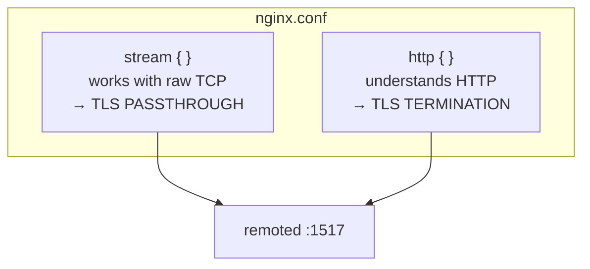
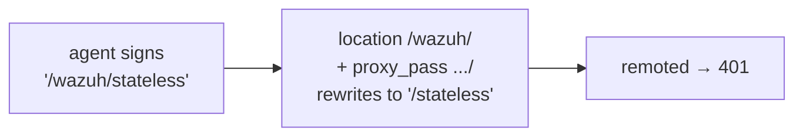

# NGINX in front of remoted

Working NGINX configuration for remoted's HTTPS events API (port `1517`), and the four mistakes
that are easy to make and hard to diagnose.

Read [Getting started with load balancers](README.md) first: it explains the two deployment models
and the rules that apply to any proxy. This page is the NGINX-specific part.

---

## 1. How an `nginx.conf` maps to the two models

NGINX expresses the two deployment models with **two different top-level blocks**, and they can
coexist in one file:



Inside `http {}` there are three nested blocks:

| Block | What it is |
|---|---|
| `upstream <name> { }` | the group of destination managers |
| `server { }` | one site: which port is served, with which certificate |
| `location <path> { }` | what to do with requests matching a URL path |

And the single most common source of confusion: there are **two separate connections**, each with
its own directives.


Directives prefixed with `proxy_` configure the connection **from NGINX to the manager**.
Directives without that prefix configure the connection **NGINX offers to the agent**.

## 2. Complete configuration

Serves both models at once so you can compare them without restarting anything: `:8444` is
passthrough, `:8443` is termination. In production you would keep only the one you chose.

Lines marked `[!]` are the ones that break things if changed — section 3 explains each.

```nginx
worker_processes auto;
error_log /var/log/nginx/error.log info;

events {
    worker_connections 1024;
}

# =====================================================================
#  TLS PASSTHROUGH (:8444) -- layer 4
#
#  NGINX does not decrypt. The agent validates REMOTED's certificate and
#  its own client certificate reaches remoted intact.
# =====================================================================
stream {
    log_format lb4 '[passthrough] client=$remote_addr -> upstream=$upstream_addr '
                   'bytes_in=$bytes_received bytes_out=$bytes_sent duration=$session_time s';
    access_log /var/log/nginx/remoted-passthrough.log lb4;

    upstream remoted_nodes_tcp {
        server 10.0.0.11:1517 max_fails=3 fail_timeout=10s;
        server 10.0.0.12:1517 max_fails=3 fail_timeout=10s;

        # Pins each agent address to the same manager. Optional; the default is round-robin.
        # hash $remote_addr consistent;
    }

    server {
        # No 'ssl' keyword: that is exactly what makes this passthrough. NGINX takes no part
        # in the encryption and therefore needs no certificate.
        listen 8444;
        proxy_pass remoted_nodes_tcp;
        proxy_connect_timeout 5s;

        # [!] DO NOT enable 'proxy_protocol on;' -- see 3.4.
    }
}

# =====================================================================
#  TLS TERMINATION + RE-ENCRYPTION (:8443) -- layer 7
#
#  NGINX decrypts, inspects and balances per request, then opens a NEW
#  TLS connection to remoted. The agent validates NGINX's certificate.
# =====================================================================
http {
    log_format lb7 '[termination] client=$remote_addr "$request" -> upstream=$upstream_addr '
                   'status=$status node_status=$upstream_status duration=$request_time s';
    access_log /var/log/nginx/remoted-termination.log lb7;

    upstream remoted_nodes_http {
        server 10.0.0.11:1517;
        server 10.0.0.12:1517;

        # Keeps connections to the managers open and reusable instead of paying a full TLS
        # handshake per event. Requires the two directives marked below.
        keepalive 32;
    }

    server {
        # ---- connection 1: what NGINX offers TO THE AGENT ----
        listen 8443 ssl;
        server_name wazuh-manager.example.com;

        # The certificate agents validate. Its SAN must contain the name they connect to.
        ssl_certificate     /etc/nginx/certs/load_balancer.crt;
        ssl_certificate_key /etc/nginx/certs/load_balancer.key;

        # This side may be permissive: it is a different connection from the backend one.
        ssl_protocols TLSv1.2 TLSv1.3;

        # [!] remoted accepts 20 MB; NGINX defaults to 1 MB -- see 3.2.
        client_max_body_size 20m;

        location / {
            # ---- connection 2: what NGINX opens TOWARDS REMOTED ----

            # [!] THE MOST IMPORTANT LINE. Nothing after the group name: no trailing
            # slash, no path -- see 3.1.
            proxy_pass https://remoted_nodes_http;

            # Required for the 'keepalive' above to have any effect.
            proxy_http_version 1.1;
            proxy_set_header Connection "";

            # [!] remoted requires TLS 1.3 as a minimum -- see 3.3.
            proxy_ssl_protocols TLSv1.3;

            # [!] Do NOT add 'proxy_ssl_ciphers' -- see 3.3.

            # Verify the manager's certificate. NGINX acts as a TLS client here.
            proxy_ssl_trusted_certificate /etc/nginx/certs/ca.crt;
            proxy_ssl_verify on;
            proxy_ssl_verify_depth 2;

            # [!] Which name that certificate is checked against. It must appear in the
            # manager certificate's SAN, or verification fails.
            proxy_ssl_name wazuh-manager-node1;
            proxy_ssl_server_name on;

            # The client certificate NGINX presents when remoted requires mTLS
            # (verification_mode = certificate). NOTE: this is NGINX's identity, not the
            # agent's -- see the getting-started page, section 6.
            proxy_ssl_certificate     /etc/nginx/certs/proxy_client.crt;
            proxy_ssl_certificate_key /etc/nginx/certs/proxy_client.key;

            # Informational. Safe to add: headers are not covered by the signature.
            proxy_set_header X-Real-IP $remote_addr;
            proxy_set_header X-Forwarded-For $proxy_add_x_forwarded_for;

            # [!] Retries. Never add http_401/http_400/http_413, and see 3.5 before
            # adding 'non_idempotent'.
            proxy_next_upstream error timeout http_502 http_503;

            proxy_connect_timeout 5s;
            # [!] At least 30 s: remoted's own per-request budget -- see 3.6.
            proxy_read_timeout 30s;
        }
    }
}
```

## 3. The traps

### 3.1. A trailing slash on `proxy_pass` breaks every request

This is the one that costs the most time, because a single character changes the behaviour:

| Written as | What NGINX forwards |
|---|---|
| `proxy_pass https://remoted_nodes_http;` | the original target, **unchanged** ✅ |
| `proxy_pass https://remoted_nodes_http/;` | the target with the `location` prefix **replaced** ❌ |

The request target is part of what the agent signs, so a rewritten target means a signature that no
longer matches, which means `401` on **every** request:



Consequence: remoted cannot be published under a path prefix. Use its own port or hostname.

Related, and safe: `merge_slashes` (on by default, collapses `//` into `/`) does **not** break the
signature as long as `proxy_pass` has no URI component. There is no need to turn it off.

### 3.2. The 1 MB default body limit

Without `client_max_body_size 20m`, NGINX answers `413 Request Entity Too Large` to events remoted
would have accepted. The giveaway is that the error page is NGINX's own, not a JSON response from
the manager.

### 3.3. TLS 1.3 to the backend, and the cipher directive that stops NGINX from starting

`proxy_ssl_protocols TLSv1.3` is required: remoted refuses anything lower and the agent sees `502`.

The natural next step is to also pin the cipher suites with `proxy_ssl_ciphers`. **Do not.** That
directive talks to an OpenSSL function that only covers TLS 1.2 and below, so with TLS 1.3 suite
names NGINX does not warn — it **fails to start**:

```
[emerg] SSL_CTX_set_cipher_list("TLS_AES_256_GCM_SHA384:...") failed
        (SSL: error:0A0000B9 ... no cipher match)
```

Omit it: OpenSSL's TLS 1.3 defaults already include the suites remoted accepts. If your policy
requires pinning them, the correct directive is different (NGINX ≥ 1.19.4):

```nginx
proxy_ssl_conf_command Ciphersuites TLS_AES_256_GCM_SHA384:TLS_CHACHA20_POLY1305_SHA256:TLS_AES_128_GCM_SHA256;
```

### 3.4. `proxy_protocol on` breaks every agent at once

In the `stream` block it is tempting: it is the standard way to tell the backend the real client
address, which passthrough otherwise hides. But remoted does not parse it, and those bytes land
where the TLS handshake should start. Nothing reaches HTTP, so there is no status code to
investigate — only TLS errors, for every agent simultaneously.

### 3.5. Retries and duplicate delivery

With the configuration above, a request is only retried on another manager when the connection
could not be established — that is, when nothing was delivered. Retrying that is safe.

NGINX will **not** pass a `POST` to another server once it has been sent, whatever
`proxy_next_upstream` lists. Adding the `non_idempotent` value removes that protection and allows
the same request to be processed by two managers:

```nginx
# Only if duplicate delivery is acceptable in your pipeline:
proxy_next_upstream error timeout http_502 http_503 non_idempotent;
```

(Note: `proxy_next_upstream_non_idempotent` is not a directive; `non_idempotent` is a *value* of
`proxy_next_upstream`.)

### 3.6. Response timeout below remoted's budget

`proxy_read_timeout` must be at least **30 s**. Below that, NGINX gives up on requests the manager
was still legitimately processing — and if it retries them elsewhere, the event can be ingested
twice.

## 4. Health checks

```nginx
upstream remoted_nodes_http {
    server 10.0.0.11:1517 max_fails=3 fail_timeout=10s;
    server 10.0.0.12:1517 max_fails=3 fail_timeout=10s;
    keepalive 32;
}
```

NGINX Open Source only has **passive** health checks: it learns a manager is gone when a real agent
request fails, which means one request is spent discovering it. `max_fails` / `fail_timeout` control
how long it stays out of rotation afterwards. Active health checks against `GET /` require NGINX
Plus; HAProxy does them out of the box, which is worth knowing when choosing.

## 5. Verifying the deployment

```bash
# 1. The configuration is valid (do this before every reload)
nginx -t

# 2. Which certificate each entry point presents
openssl s_client -connect wazuh-manager.example.com:8443 </dev/null 2>/dev/null | openssl x509 -noout -subject
openssl s_client -connect wazuh-manager.example.com:8444 </dev/null 2>/dev/null | openssl x509 -noout -subject
#    :8443 must show the BALANCER's certificate, :8444 the MANAGER's

# 3. The health check endpoint answers, unauthenticated
curl -k https://wazuh-manager.example.com:8443/
#    -> {"status":"ok","module":"remoted"}

# 4. The manager's certificate has a usable SAN (the field hostname verification reads)
openssl x509 -in /var/wazuh-manager/etc/certs/remoted.pem -noout -ext subjectAltName
#    (that is the default path; if <certificate> is set, read the file it names)
```

Then send a real signed request from an agent and watch the access log:

```
[termination] client=10.0.0.50 "POST /stateless HTTP/1.1" -> upstream=10.0.0.11:1517 status=202 ...
```

What each status code tells you:

| Code | Meaning |
|---|---|
| `202` | signature valid **and** the event was ingested |
| `401` | signature rejected — if it is *every* request, suspect a rewritten target (3.1) |
| `413` | body too large — the proxy's limit (3.2) or the manager's 20 MB |
| `502` | the proxy could not talk to the manager — suspect TLS 1.3 (3.3) or certificate verification |
| `503` | the manager accepted the request but could not process it right now |

## 6. Reference configurations

Ready-to-run configurations covering these scenarios — including the ones written to fail, so you
can see each trap in action — ship with the source under
`src/remoted/remoted_module/tools/load_balancer/nginx/`.
