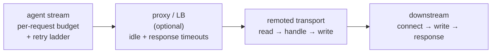

# Connection Timing Tuning

How to reason about the agent↔manager timing contract — timeouts, retries, throttles and queues —
instead of cargo-culting values. It is the cross-cutting page: every option named here has its own
entry in [remoted configuration](configuration.md#https-agent-server-remoted_module) (manager side)
or [client configuration](../client/configuration.md#https-connection-timing) (agent side); what
this page adds is how they interact, which pairs must move together, and what measurably breaks
when they do not.

Defaults and ranges are the ones the product ships; every *measured* figure quoted here comes from
the #38284 campaign on the 4-core/8 GB reference pair (c5ad.xlarge, Amazon Linux 2023),
cross-checked on a second architecture.

**Where the options live.** Manager: `etc/wazuh-manager-internal-options.conf`
(`remoted.*`, `wazuh_modules.*`) and `wazuh-manager.conf` (the `<remote>`/`<global>` XML settings).
Agent: `etc/local_internal_options.conf` (`agent.*`, `logcollector.*`) and the agent's own XML
(`<client>`). Both internal-options files are **per node/host and never synchronized**: nothing in
a cluster propagates them, so a value set on one manager only makes an agent's behavior depend on
which node it lands on.

## 1. The clocks on one request

Each hop has its own clock, and they are not nested inside one another:

| Phase | Bounded by | Default | How it ends |
|---|---|---|---|
| TLS handshake **plus** reading the whole request | [`remoted.http_read_timeout`](configuration.md#remotedhttp_read_timeout) | 10 s | connection closed, no HTTP status |
| Handling, once the request is fully read | [`remoted.http_request_timeout`](configuration.md#remotedhttp_request_timeout) | 30 s | request torn down |
| Downstream connect | [`remoted.downstream_connect_timeout`](configuration.md#remoteddownstream_connect_timeout) | 2 s | `503` |
| Downstream body write | [`remoted.downstream_write_timeout`](configuration.md#remoteddownstream_write_timeout) | 5 s | `503` |
| Downstream answer | [`remoted.downstream_response_timeout`](configuration.md#remoteddownstream_response_timeout) / [`..._stateful_...`](configuration.md#remoteddownstream_stateful_response_timeout) | 5 s / 20 s | `503` |
| Writing the response | [`remoted.http_write_timeout`](configuration.md#remotedhttp_write_timeout) | 10 s | connection closed. Rearmed per chunk on a streamed `POST /download`, which does **not** make a slow transfer safe: below ~1 Mbit/s it is what aborts WPK downloads (§5) |
| The whole request, from the agent's side | `agent.https_request_timeout` / `agent.https_stateful_timeout` | 10 s / 90 s | attempt consumed, retry after backoff |

Two properties of that table are where most tuning mistakes start:

- **`http_read_timeout` is a total deadline, not an idle timer.** It is armed once, when the
  connection starts waiting for a request, and is never rearmed as bytes arrive. A body that needs
  longer than 10 s to reach the manager is cut at 10 s even though it never stalled. It is
  therefore the *upload* budget — see invariant 3.
- **The manager's phases do not stop when the agent leaves.** A request whose body was already
  forwarded downstream is completed by the manager regardless of whether anyone is still waiting
  for the answer. Whoever gives up first decides who does duplicate work.

## 2. Three laws

1. **Attempt budgets multiply.** Attempt counts (`agent.https_*_attempts`) are **total tries, not
   retries**: `1` means "send once, never retry". The worst case of one step is
   `attempts × timeout + Σ backoff`. Only retryable failures and back-pressure (`503`) consume an
   attempt; authentication failures, permanent errors and version rejections stop immediately.
2. **Backoff is full jitter, per stream.** The delay before try *n* is uniform in
   `[0, min(cap, base · 2ⁿ)]` starting at `base`, reset on success, with an independent ladder for
   each of the agent's HTTPS streams (control, events, one per sync module). Mean delay is half the
   ceiling, so a saturated ladder produces one attempt every `cap/2` per stream — the measured
   **6.5 SYN/min per agent** against a dead manager is that rate times the streams a default agent
   keeps open. A `Retry-After` on a `503` only ever lengthens the wait: the agent takes
   `max(Retry-After, backoff)`.
3. **Timeouts are only meaningful in pairs.** A value is not "safe" or "unsafe" on its own; it is
   safe relative to the deadline facing it on the other side of the hop. Every invariant below is
   a pair.

## 3. Invariants

Check these before changing anything. Each one has a measured failure mode.

| # | Rule | What breaks when violated |
|---|---|---|
| 1 | [`remoted.control_keepalive_throttle`](configuration.md#remotedcontrol_keepalive_throttle) < ½ · `<global><agents_disconnection_time>` | live, answering agents flap to `disconnected` for part of every cycle (measured: ~30 s of every 120 s at 2× the threshold). The staleness monitord sees is the throttle **plus** the agent's `<client><notify_time>`, which the manager cannot know; remoted warns at startup from half upward |
| 2 | `agent.https_request_timeout` > the downstream answer the manager is waiting for | the agent abandons a request the engine already ingested and retries it → duplicate events (measured ×6 against a slow engine). `/stateless` carries no batch identity, so the engine cannot recognize a repeat, and the amplification is **not** bounded by the attempt budget: once those are spent the batch is kept and re-sent on the next flush tick, so it repeats until the downstream answers inside the deadline. At defaults the comparison is 10 s against a 5 s response deadline, with 12 s of worst-case downstream chain behind it: raise `downstream_response_timeout` and you cross into the duplicating regime without touching the agent |
| 3 | `remoted.http_read_timeout` ≥ (largest body) / (slowest sustained uplink) | the manager closes the connection mid-upload, the agent sees a transport failure and burns an attempt, forever. Cuts track the knob to a tenth of a second (measured: 10.16 s at the shipped 10 s, 3.13 s at 3 s, none at 60 s) and raising `remoted.http_request_timeout` to 180 s does not move them, so raising `agent.https_stateful_timeout` for a slow link **buys nothing on its own** |
| 4 | `agent.https_stateful_attempts × agent.https_stateful_timeout` + backoffs < 15 min | that ceiling is the agent's fixed session safety net (§4); past it, sessions overlap, duplicate and head-of-line block. Defaults sit at ≈8 min (5 × 90 s + ≤15 s of ladder) — do not raise both together |
| 5 | proxy response timeout ≥ [`remoted.http_request_timeout`](configuration.md#remotedhttp_request_timeout) (30 s), proxy body limit ≥ `<remote><https><max_body_size>` (20 MiB) | the proxy cuts requests the manager would have completed, and — if it retries them on another manager — the same session is processed twice. See [load balancers §4.5](load-balancers/README.md#45-align-the-timeouts) |
| 6 | `connect + write + response` ≤ [`remoted.http_request_timeout`](configuration.md#remotedhttp_request_timeout) | the HTTP server tears the request down before the downstream deadline can fire, so the log names the wrong culprit. remoted warns at startup when the sum cannot be honored |
| 7 | [`remoted.jwt_clock_skew`](configuration.md#remotedjwt_clock_skew) ≥ real agent/manager clock drift | every request fails `401` with no other symptom. Fix NTP rather than widening the window: widening it widens the replay window of a captured token |
| 8 | `wazuh_modules.inventory_sync_server_session_query_batch_size` ≤ the indexer's `max_result_window` (10000) | integrity checks fail permanently with `500`. The option refuses values outside `0 \| 100–10000` at startup |
| 9 | `remoted.control_keepalive_throttle` > the fleet's `<client><notify_time>` | a throttle at or below the notify interval suppresses nothing: it can only drop a notify that arrives inside an already-open window |

## 4. Fixed values you cannot tune

These have no option. They are the ceilings the tunable values have to fit under.

| Value | What it is | Consequence |
|---|---|---|
| 60 s | Agent bearer token lifetime (`exp - iat`) of the `wazuh-agent+jwt` profile | the tolerated clock error is [`jwt_max_age`](configuration.md#remotedjwt_max_age) + [`jwt_clock_skew`](configuration.md#remotedjwt_clock_skew), nothing else |
| 15 min | Agent-side ceiling on waiting for one `/stateful` session's verdict (`SESSION_RESPONSE_TIMEOUT`) | invariant 4 |
| 60 s | I/O deadline on the agent's local `queue-sync` hand-off between a sync module and the HTTPS client | the intake answers only once it has spooled the whole body, so on a slow link — where the previous upload is still in flight — this fires **before** the 90 s HTTPS budget ever binds: the module reports the local transport as unavailable, defers, and the next cycle restarts the session from zero |
| 3 | Consecutive deferrals tolerated before a sync failure is logged at WARNING instead of INFO | `Synchronization of <table> deferred: ... Will retry next cycle.` at INFO is normal right after a restart; the same cause four cycles running escalates |
| 5 × 10 s | Integrity-check retries on a `409` before the agent trusts a checksum mismatch | a full resync is not triggered by one disagreeing check |
| 6 h / 5 min | remoted's control-registry entry TTL and eviction sweep | throttle state for an agent that stops talking is reclaimed on that cadence |
| `agents_disconnection_time` | monitord's sweep period, which equals the threshold itself | detection of a disconnection lands anywhere in [1×, 2×] of it; notify cadence does not speed it up |

## 5. Per-goal recipes

**Slow or satellite links.** Work the upload budget first (invariant 3): the ceiling is
`http_read_timeout × link rate`, and inventory bodies compress ~16:1 on the wire, so the effective
payload allowance is much larger than the raw figure suggests. The two casualties, in order, are
(a) WPK downloads, which are binary and do not compress, and where the manager gives up before the
agent does: below roughly 0.8–1.1 Mbit/s it tears the stream down (isolated to
[`remoted.http_write_timeout`](configuration.md#remotedhttp_write_timeout): 5/10 aborts at the
shipped 10 s, 0/5 at 120 s on the same shaper), so a real 11,977,198 B WPK needs ~1.06 Mbit/s to
land inside the agent's 90 s and the pass/fail band is [0.90, 1.10) Mbit/s — non-deterministic
near it, so one passing run does not clear a link class; and (b) large first-time inventory
sessions, where the fix is reducing what one session carries rather than raising a timeout.
Raise `remoted.http_read_timeout` and `agent.https_stateful_timeout` **together** — either alone
is inert.

**Large fleets (10k+).** The keepalive throttle is the wazuh-db shield, and its suppression factor
is simply `control_keepalive_throttle / notify_time` once the throttle is the larger of the two:
at the shipped defaults (60 s throttle, 10 s notify) that is 6×; the campaign measured **30×**
(300→10 writes for 10 agents in 60 s) at a 2 s notify cadence. Compute it for *your* cadence
rather than quoting either number. Detection latency is governed by `agents_disconnection_time`
alone (§4). Budget outage recovery at ~6.5 TLS handshakes/min per disconnected agent, and check
that against [`remoted.max_parallel_connections`](configuration.md#remotedmax_parallel_connections)
(512) before a fleet-wide restart.

**Manager outages and event loss.** Short outages are transparent (measured: a 25 s outage
delivered every buffered event exactly once). On longer ones the loss point is **not** the HTTPS
producer pause — `agent.https_producer_pause_threshold` does stop the agent's send path, which is
exactly why the backlog lands one layer up — but `logcollector.queue_size` (1024 lines), which
drops new lines on a full queue with **one** warning ever emitted per target
(`Target '...' message queue is full`) and a debug-level line per discard afterwards. Size it as
`peak EPS × required outage window`: the default tolerates ≈100 s at 20 eps (measured: 33% of a
3-minute outage's events lost).

**Overloaded `/stateful`.** Under sustained overload, shedding is capacity-driven and roughly
independent of `downstream_stateful_response_timeout`; what the knob bounds is the **latency
tail** (saturated p99 ≈ 0.94 × knob, measured across six values). Keep the default 20 s — it sat
at 3.4× the measured flush p99 under 3× overload — and never set it below 2× your deployment's
flush p99: shedding grows fast below that (17% at 10 s, 50% at 2 s in overload). Raising it past
23 s also breaks invariant 6. When the sync server is what is saturated, add workers before you
add queue: at 80-agent overload the shipped 4 workers with a 64 MiB budget shed 26,946 of 30,527
sessions, while a 256 MiB budget shed nothing and moved p50 from 53 ms to 721 ms — a bigger queue
converts shedding into latency, it does not add capacity.

**Mass upgrades.** Every agent fetching a WPK at once is bounded only by
`remoted.max_parallel_connections`; there is no per-transfer limiter, and a chunked transfer
rearms its write deadline per chunk, so slow readers hold slots for as long as they need. Stage
the rollout instead of raising timeouts.

## 6. Environment decisions

Answer these once per deployment; they decide which of the knobs above you will ever touch.

- **Clock discipline.** Without NTP on both sides, no timeout tuning matters: authentication fails
  first (invariant 7). `remoted.auth.reject.clock_skew` is the metric that says so.
- **Is there a proxy in the path?** If yes, its idle, response and body limits become part of the
  contract (invariant 5), and its retry policy must stay on "never delivered" only — retrying on a
  response is what turns one session into two managers' work.
- **Compression.** The agent compresses request bodies with zstd by default
  (`agent.https_compression_enabled`). If a manager or proxy in the path refuses it, the agent
  takes a `415`, retries the request uncompressed once and disables compression for that stream —
  self-healing, at the cost of one wasted attempt per stream and of the 16:1 wire saving that the
  slow-link budget above assumes. Decide it once, on both sides
  ([`remoted.http_content_encoding_enabled`](configuration.md#remotedhttp_content_encoding_enabled)).
- **Cluster shape.** Internal options are per node. An agent that alternates between nodes is
  throttled independently on each, so its worst-case wazuh-db write rate is one write per window
  **per node**. Set timing options identically on every node, or accept node-dependent behavior.
- **4.x agents in the fleet.** The keepalive throttle governs 5.x agents only; 4.x keepalives are
  written ungated by the legacy path, so a sizing table has to count 5.x agents alone.
- **Capacity vs. timing.** A `503` from the byte budget or the deferred limiter is a capacity
  answer, not a timing one, and raising timeouts makes it worse by holding slots longer. Establish
  which one is binding from the metrics (§8) before touching either.

## 7. Symptom → knob

| Observable | Likely cause | Where to look |
|---|---|---|
| Live agents flap `disconnected` | throttle ≥ ½ disconnection time (invariant 1) | startup warning; `last_keepalive` age vs threshold |
| Duplicate events after engine slowness | invariant 2: a timeout layer aborting after the body was consumed | same-body deliveries at the engine ingress; `/stateless` has no dedup |
| Uploads fail on one link class only, always at the same size | invariant 3: the read deadline, not the agent budget | connection closed with no HTTP status; the agent counts a transport failure |
| A first sync never converges | session too large for the budgets, or the local hand-off failing (§4) | `Synchronization of ... deferred` / `... failed N times in a row` on the agent |
| Integrity check returns `500` forever | the session query page is larger than the indexer accepts | the indexer's `index.max_result_window` against the configured batch size (values above 10000 are already refused at startup, so this means the indexer's window was lowered) |
| `503` with `Retry-After` on `/stateful` | VD feed not ready (CVE content not loaded) | content-updater log |
| `503` without `Retry-After` | downstream timeout **or** an in-flight budget shed — indistinguishable to the agent | `remoted.server.budget.*` vs `remoted.forwarder.*`; budget sheds are not in endpoint metrics |
| Every request `401`, no other symptom | clock drift past the token window (invariant 7) | `remoted.auth.reject.clock_skew` |
| Agent reports synced but the indexer is missing data | immediate sessions report success while the indexer is unreachable; the queue is not persistent | `Indexer node ... is no longer available` in the manager log |

## 8. Verifying a change

Timing changes are only observable in the [metrics](metrics.md); make the change, then read the
number that has to move.

| Change | Metric that must move | Metric that must **not** |
|---|---|---|
| Any downstream deadline | [`remoted.forwarder.error.response_timeout`](metrics.md#downstream-failures--remotedforwarder) falls | `remoted.forwarder.deferred.rejected.total` must not rise (slots held longer) |
| `http_request_timeout` / thread counts | [`remoted.http.<endpoint>.latency`](metrics.md#request-latency--remotedhttpendpointlatency) p99 vs the cap | `responses.503` |
| Keepalive throttle | the ratio of the [`remoted.control.notify`](metrics.md#control-plane--remotedcontrol) rate to the `remoted.control.wdb.latency` observation rate ≈ the suppression factor | `remoted.control.wdb_error` |
| Capacity limits | `remoted.server.budget.rejected.total` / `remoted.forwarder.deferred.rejected.total` stop moving | endpoint latency p99 |
| Clock window | `remoted.auth.reject.clock_skew` falls to zero | — |

## 9. Measured defaults record

All shipped defaults were validated by measurement in the #38284 campaign; none needed changing.
The two range fixes it produced (the batch-size ceiling, the startup warning for the throttle)
shipped separately. The measurement tables behind each verdict are in wazuh/wazuh#38284, and the
defects found on the way in wazuh/wazuh#38549. Final sign-off of the defaults against a stated
product envelope (target fleet size, worst supported link) is tracked in #38284.

## See Also

- [Configuration](configuration.md#https-agent-server-remoted_module) — every `remoted.*` option,
  with ranges and per-option notes
- [Client configuration](../client/configuration.md#https-connection-timing) — the agent half
- [Metrics](metrics.md) — what to watch after a change
- [HTTPS Agent API](https-events-api.md) — the protocol the timings bound
- [Load balancers](load-balancers/README.md#45-align-the-timeouts) — the proxy's own clocks
