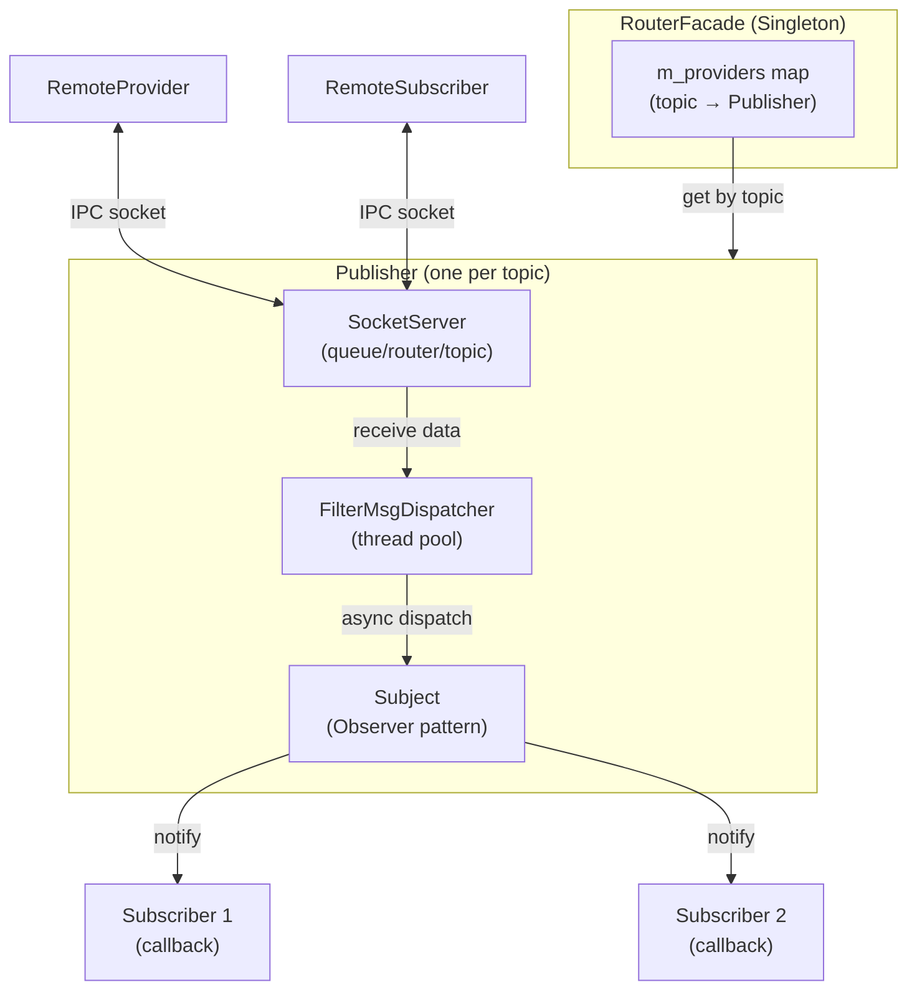
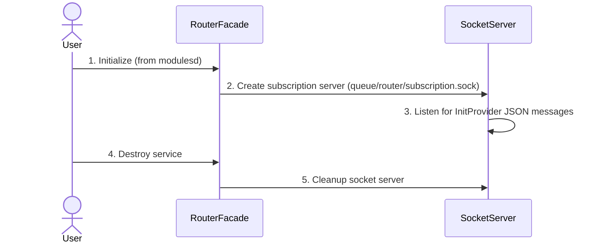
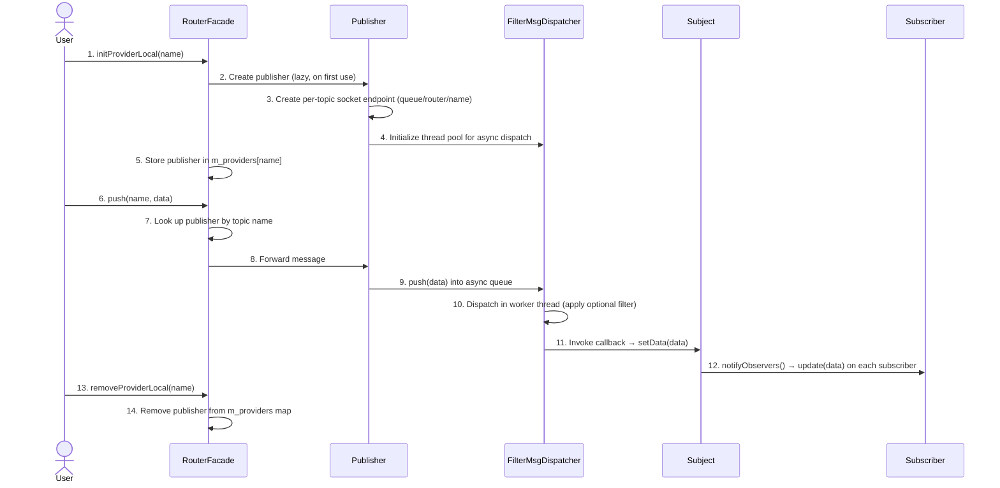
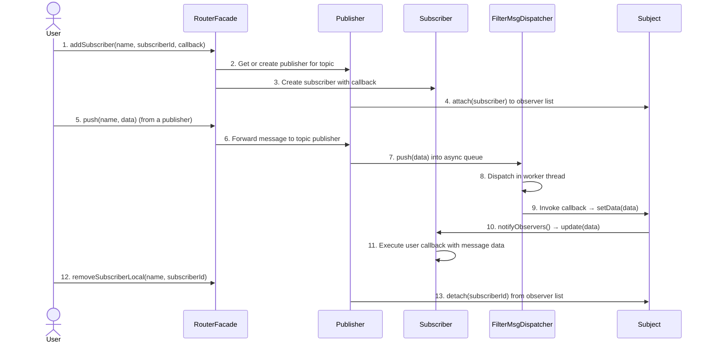

# Router Architecture

## Overview

The Router module is built around a central `RouterFacade` singleton that manages publishers, subscribers, and IPC socket servers. The facade coordinates the full lifecycle: initialization, message dispatch, and teardown. Providers are created lazily — a `Publisher` instance is only instantiated when the first subscriber or message arrives for a given topic.

## Component Architecture

## Sequence Diagrams

### Initialization

The initialization sequence shows how the router is set up from the `wazuh-modulesd` daemon perspective. The `RouterFacade` creates a subscription socket server for cross-process provider registration.

### Publisher Flow

The publisher flow shows how a provider is registered on-demand and how messages are dispatched asynchronously through the `FilterMsgDispatcher` thread pool to all observers.

### Subscriber Flow

The subscriber flow shows how a subscriber registers with a topic, and receives messages through the observer pattern.

