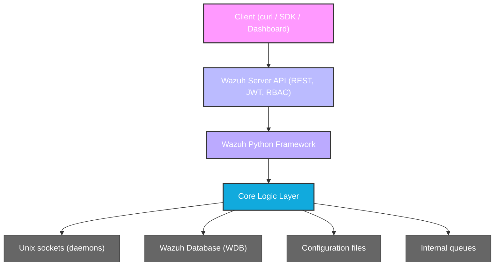
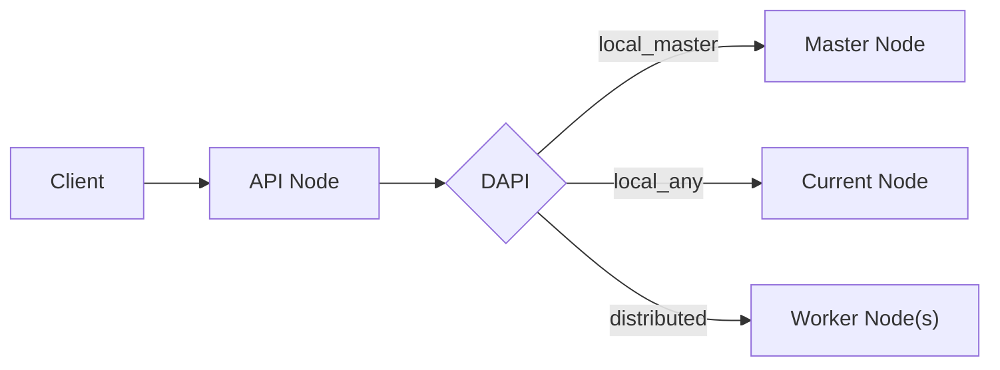

# Architecture

The Wazuh Server API is a layered system where an HTTP server delegates to a Python framework, which in turn communicates with internal daemons and databases through Unix sockets.

---

## System Architecture Overview

---

## Directory Structure

### API Interface Layer
`wazuh/framework/wazuh/`

This layer:
- Exposes API-facing functions
- Validates input
- Enforces RBAC
- Formats responses

It **must not** contain business logic.

| Module | Responsibility | Main Endpoints |
|--------|----------------|----------------|
| `agent.py` | Agent lifecycle and queries | `/agents` |
| `manager.py` | Manager status and configuration | `/manager` |
| `cluster.py` | Cluster operations | `/cluster` |
| `syscheck.py` | File Integrity Monitoring | `/syscheck` |
| `rootcheck.py` | Policy and rootcheck | `/rootcheck` |
| `active_response.py` | Trigger AR commands | `/active-response` |
| `security.py` | Authentication and users | `/security` |
| `rbac/` | Authorization logic | `/security/*` |
| `mitre.py` | MITRE ATT&CK mappings | `/mitre` |
| `stats.py` | Manager statistics | `/manager/stats` |
| `task.py` | Async task handling | `/tasks` |
| `event.py` | Event ingestion into analysisd | `/events` |

---

### Core Logic Layer
`wazuh/framework/wazuh/core/`

This layer contains **all real logic**. It is **API-agnostic** and can be reused internally.

| Component | Description |
|-----------|-------------|
| `agent.py`, `manager.py`, etc. | Business logic implementation |
| `common.py` | Global constants, paths, context variables, and utility functions |
| `results.py` | Standardized result model (`WazuhResult`, `AffectedItemsWazuhResult`) |
| `InputValidator.py` | Regex-based input validation (names, lengths) |
| `utils.py` | General utilities (caching, process management, helpers) |
| `wazuh_socket.py` | IPC with Wazuh daemons via Unix sockets |
| `wazuh_queue.py` | Internal async messaging |
| `wdb.py` | Async interface to Wazuh DB (length-prefixed Unix socket protocol) |
| `wdb_http.py` | HTTP-based alternative WDB client (via `aiohttp`) |
| `configuration.py` | Parse `ossec.conf` and related files |
| `exception.py` | Custom exception hierarchy and error code catalog |
| `wlogging.py` | Custom log rotation with gzip compression |
| `pyDaemonModule.py` | UNIX daemonization (double-fork pattern) |
| `stats.py` | Statistics processing logic |
| `cluster/` | Cluster architecture (master, worker, DAPI, HAProxy helper) |
| `indexer/` | Wazuh Indexer integration (credentials, disconnected agents) |

---

### API Server Layer
`wazuh/api/api/`

This layer implements the **HTTP server** that exposes the REST API.

| Component | Description |
|-----------|-------------|
| `controllers/` | Route handlers (one per resource: agent, cluster, security, etc.) |
| `authentication.py` | JWT token generation and validation using EC keys (PyJWT) |
| `middlewares.py` | Request/response pipeline (security headers, rate limiting, access logging) |
| `error_handler.py` | Centralized error handling and brute-force protection |
| `validator.py` | Comprehensive regex-based validation for all API input parameters |
| `signals.py` | API lifecycle events and background tasks (key generation, CTI updates) |
| `constants.py` | API filesystem paths (`/api/configuration`, `/api/security`, etc.) |
| `encoder.py` | Custom JSON serialization |
| `uri_parser.py` | URI parsing utilities |
| `alogging.py` | Async-aware API logging |
| `spec/spec.yaml` | OpenAPI 3.0 specification (defines all endpoints, schemas, parameters) |
| `configuration/` | API configuration management |
| `models/` | Data models for request/response objects |

#### Controllers

Each controller wraps framework calls in the **DAPI (Distributed API)** layer to transparently route requests across cluster nodes.

| Controller | Responsibility |
|------------|----------------|
| `agent_controller.py` | Agent CRUD and lifecycle |
| `cluster_controller.py` | Cluster node operations |
| `security_controller.py` | Users, roles, policies, RBAC |
| `active_response_controller.py` | Trigger active response commands |
| `syscheck_controller.py` | FIM operations |
| `rootcheck_controller.py` | Rootcheck/SCA results |
| `mitre_controller.py` | MITRE ATT&CK mappings |
| `task_controller.py` | Async task queries |
| `event_controller.py` | Event ingestion to analysisd |
| `overview_controller.py` | Agent overview/summary |
| `default_controller.py` | Basic API info (version, hostname, timestamp) |

---

### RBAC Sub-module
`wazuh/framework/wazuh/rbac/`

| File | Responsibility |
|------|----------------|
| `decorators.py` | `expose_resources` decorator that enforces action/resource permissions |
| `orm.py` | ORM models for roles, policies, and user-role mappings |
| `preprocessor.py` | Resource preprocessing before permission checks |
| `default_resources.py` | Built-in default RBAC resource definitions |
| `auth_context.py` | Authentication context handling |

---

### Cluster Sub-module
`wazuh/framework/wazuh/core/cluster/`

| File | Responsibility |
|------|----------------|
| `dapi/` | **Distributed API** — routes requests to the correct cluster node |
| `master.py` | Master node logic |
| `worker.py` | Worker node logic |
| `client.py` | Worker → master communication |
| `server.py` | Cluster server |
| `local_client.py` | Local cluster client |
| `local_server.py` | Local cluster server |
| `control.py` | Cluster control operations |
| `cluster.py` | Core cluster logic |
| `common.py` | Cluster-specific shared utilities |
| `config.py` | Cluster configuration schema |
| `utils.py` | Cluster utilities (`get_cluster_items`, etc.) |
| `hap_helper/` | HAProxy integration for load balancing |

---

### Indexer Sub-module
`wazuh/framework/wazuh/core/indexer/`

| File | Responsibility |
|------|----------------|
| `indexer.py` | Main Wazuh Indexer client |
| `credential_manager.py` | Indexer credential management |
| `disconnected_agents.py` | Handling disconnected agents in the indexer |
| `max_version_components.py` | Version component handling |

---

## Execution Flow

Example: `GET /agents?status=active`

1. HTTP request reaches the Server API (Starlette/Connexion)
2. Middlewares process the request (security headers, rate limiting, access logging)
3. JWT token is validated via `authentication.py`
4. Input parameters are validated via `validator.py` (regex-based)
5. Request is routed to the controller (`agent_controller.py`)
6. Controller wraps the call in the **DAPI** layer for cluster routing
7. DAPI determines the target node (`local_master`, `local_any`, etc.)
8. Framework function (`wazuh/agent.py`) is invoked
9. RBAC permissions are checked via `expose_resources` decorator
10. Core logic (`core/agent.py`) is executed
11. Data is fetched from:
    - WDB (via Unix socket or HTTP)
    - Manager daemon (via Unix socket)
    - Filesystem
12. Result is wrapped in `AffectedItemsWazuhResult` or `WazuhResult`
13. Result is serialized to JSON and returned

---

## Distributed API (DAPI)

In cluster deployments, not all requests can be handled by the node receiving them.

The DAPI layer (`core/cluster/dapi/`) transparently routes requests:

| Routing Mode | Description |
|--------------|-------------|
| `local_master` | Must execute on the master node |
| `local_any` | Can execute on any node |
| `distributed_master` | Master distributes to relevant worker nodes |

---

## Result Model

All framework functions return standardized result objects defined in `core/results.py`:

| Class | Description |
|-------|-------------|
| `WazuhResult` | Base dict-like result wrapper |
| `AffectedItemsWazuhResult` | Tracks affected/failed items with error details |

Results support:
- Merge operations (`|` operator) for combining results across cluster nodes
- Iteration, length, and containment checks
- Pagination metadata

---

## Socket Communication Protocol

The framework communicates with Wazuh daemons via **Unix domain sockets** using a length-prefixed protocol.

### Protocol Details
- Messages use a **4-byte little-endian header** indicating the payload length
- The same framing is used for both sending and receiving
- `WazuhAsyncSocket` (in `core/wdb.py`) handles async socket connections

### Key Socket Paths

| Socket | Daemon | Purpose |
|--------|--------|---------|
| `wdb` | wazuh-db | Database queries |
| `queue/sockets/queue` | analysisd | Event ingestion |
| `queue/sockets/auth` | authd | Agent registration |
| `queue/sockets/remote` | remoted | Agent communication |
| `queue/sockets/request` | various | Internal requests |

---

## Logging Architecture

### Custom Log Rotation (`core/wlogging.py`)
- The `CustomFileRotatingHandler` class extends Python's logging to:
  - Rotate log files when they reach a size threshold
  - Compress rotated files with **gzip**
  - Set file permissions to `0o640`
  - Store rotated logs in a dedicated directory

### API Access Logging (`api/alogging.py`)
- Every API request generates an access log entry
- Passwords and sensitive data are **sanitized** from query strings and request bodies before logging
